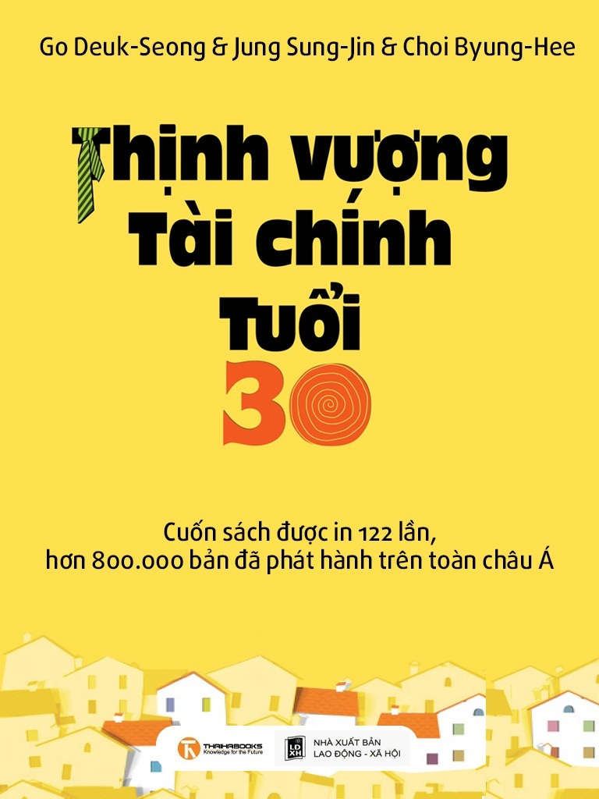

# Thịnh Vượng Tài Chính Tuổi 30 (Tập 1)

## Thông tin sách
- **Tác giả:** Choi Pyong Hee, Go Deuk Seong, Jeong Seong Jin
- **Dịch giả:** Nguyễn Mạnh Hùng & Thái Hà Books
- **Tên sách:** Thịnh Vượng Tài Chính Tuổi 30 - Tập 1

---

## Mục lục

- [Lời nói đầu](00_loi_noi_dau.md)
- [Lời tựa](00_loi_tua.md)
- [Chương 1: Cuộc du hành 30 năm sau](01_chuong_1.md)
- [Chương 2: Liệu tôi có thực sự hạnh phúc khi về già?](02_chuong_2.md)
- [Chương 3: Vì 30 năm tuổi già thịnh vượng](03_chuong_3.md)
- [Chương 4: Lập kế hoạch hành động theo từng độ tuổi](04_chuong_4.md)
- [Phụ lục: 9 Nguyên tắc trù bị cho tuổi già](05_phu_luc.md)
