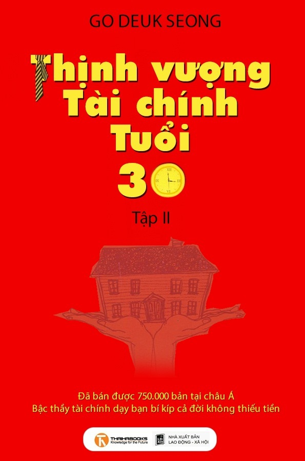

# THỊNH VƯỢNG TÀI CHÍNH TUỔI 30 - TẬP 2

*Tác giả: Go Deuk Seong*

*Ebook miễn phí tại: www.SachMoi.net*

---

## LỜI NÓI ĐẦU

Khi còn nhỏ, cha mẹ thường dạy chúng ta rằng: “Con hãy học tập chăm chỉ, đạt điểm cao, thi đỗ trường đại học danh tiếng, con sẽ tìm được công việc với mức lương cao và đãi ngộ tốt”. Ngày nay, bạn tốt nghiệp đại học, bắt đầu đi làm, phấn đấu trong công việc, ngày nghỉ đi du lịch cùng bạn bè, như vậy cũng là tạm ổn. Nhưng 30 năm sau thì sao? Bạn đã bao giờ mường tượng về cuộc sống của mình 30 năm sau? Bạn sẽ cầm tay người bạn đời của mình ngắm mặt trời mọc trên biển Aegean Hy Lạp, hay ngồi ăn cháo trắng trong ngôi nhà nhỏ bé của mình? Mỗi người chúng ta đều sẽ già đi, nhưng không ai mong muốn thu nhập hôm nay kém hơn hôm qua; ai cũng mong mình sống lâu, và không muốn phải chịu cảnh buồn tủi lúc tuổi già.

Bạn đã bao giờ tính toán thử xem 30 năm sau, với vai trò làm cha mẹ, bạn sẽ có bao nhiêu tiền để cho con ăn học, kết hôn? Sau khi nghỉ hưu bạn sẽ duy trì mức sống như hiện nay bằng cách nào? Bạn cần bao nhiêu tiền để làm việc đó?

Giả sử hiện nay bạn 30 tuổi, bạn sẽ nghỉ hưu năm 55 tuổi, và sẽ mất vào năm 80 tuổi. Hiện nay chi phí tối thiểu cho cuộc sống ở thành phố và bảo hiểm y tế là 300.000 Won/tháng, tạm tính tỷ lệ lạm phát là 4%, 25 năm sau nếu muốn duy trì mức sống như hiện nay cần phải có 800.000 Won/tháng. Cuộc sống sau khi nghỉ hưu trong 25 năm tối thiểu cần 800.000 Won/tháng x 12 tháng x 25 năm = 240.000.000 Won. Nếu thêm 200.000 Won chi phí du lịch và thư giãn tối thiểu, thì sẽ phải thêm 160.000.000 Won nữa, tổng cộng là 400.000.000 Won. 400.000.000 Won mới chỉ là chi phí cho bản thân, tổng chi phí cho hai vợ chồng tính sơ sơ cũng lên đến 800.000.000 Won.

Hơn nữa, nếu có sức khỏe, bạn còn có thể sống đến 85 tuổi thậm chí là 90 tuổi. Thêm vào đó là những chi phí không thể tính trước dành để chữa trị những căn bệnh của tuổi già. Do vậy mà số tiền cần thiết để dưỡng già sẽ có thể lên tới 1.000.000.000 Won hoặc cao hơn nữa.

Nhưng tôi sẽ tiết lộ cho bạn biết thời gian để chúng ta kiếm ra số tiền đó. Theo giả thiết trên, nếu bạn đi làm năm 25 tuổi, thì thời gian làm việc là 30 năm, thời gian nghỉ hưu 25 năm, cũng có nghĩa là trong 30 năm đi làm bạn sẽ phải chuẩn bị 800.000.000 Won, trong đó chưa bao gồm khoản tiền mua nhà, mua xe và nuôi con cái.

30 năm, 800.000.000 Won, tôi dám chắc rằng bạn đang choáng váng với những con số này. Thực ra, bạn không cần phải hoang mang đến vậy, bởi vì nhà hoạch định tài chính hàng đầu châu Á đã tìm ra đối sách cho bạn, giúp bạn vượt qua bức tường ngăn cách giữa nghèo khó và giàu sang!

Hãy cùng tôi xem xét bảng tính sau:

Mỗi tháng 200.000 Won, 30 năm sau sẽ có 1.200.000.000 Won.

Nếu bạn 30 tuổi, mỗi tháng bạn chỉ cần đầu tư 200.000 Won, thì 30 năm sau, tức là khi bạn 60 tuổi, bạn sẽ có 1.200.000.000 Won! 1.200.000.000 Won đủ cho bạn và người bạn đời hưởng thụ cuộc sống an nhàn lúc tuổi già.

Có thể bạn thấy điều này thật khó, bạn đang trong độ tuổi lập nghiệp, bạn phải mua nhà, mua xe, chuẩn bị kết hôn, không thể để ra 200.000 Won mỗi tháng, vậy thì bạn có thể lùi lại 10 năm, đến khi 40 tuổi được không? Đáp án là có, nhưng bạn sẽ tổn thất hơn 900.000.000 Won.

Từ năm 30 tuổi mỗi tháng đầu tư 200.000 Won, trong 30 năm thu lời sẽ là 1.200.000.000 Won. Đến năm 40 tuổi mới bắt đầu đầu tư, đầu tư trong 20 năm thì lợi nhuận sẽ là bao nhiêu? 282.744.200 Won! Chỉ chậm 10 năm thôi, thu nhập của bạn đã giảm đi hơn 900.000.000 Won.

Thời gian không chờ đợi ai cả, nếu bạn bắt đầu hoạch định cuộc sống của mình theo cách của các nhà hoạch định tài chính ngay bây giờ, tôi tin rằng không cần đến 30 năm, chỉ cần 10 năm sau thôi bạn đã có thể ung dung hưởng thụ cuộc sống tuổi già.

Sau khi đọc cuốn *Thịnh vượng tài chính tuổi 30 - Tập I*, nhiều người đã muốn sống thêm một lần nữa, hơn một triệu người bắt đầu quản lý chi tiêu và chuẩn bị cho cuộc sống 30 năm sau của mình. Một cô gái thuộc tầng lớp có thu nhập cao đã từ bỏ sở thích mua sắm đồ hiệu; một người 30 tuổi đã thay đổi ý định từ đổi xe mới sang mua bảo hiểm dưỡng lão cho mọi người trong gia đình; một người đàn ông 40 tuổi vô cùng hối tiếc vì không được đọc cuốn sách này sớm hơn… Tôi rất vui khi thấy được những thay đổi của độc giả. Để hướng dẫn người đọc đề ra kế hoạch tốt hơn tôi đã viết cuốn sách này.

“Nếu được trẻ lại, việc đầu tiên tôi sẽ làm là tích lũy tiền cho cuộc sống sau khi về hưu của mình. Cuộc sống của tôi khó khăn như thế này chính là vì không có tiền. Tuy lúc còn trẻ tôi cũng đã từng đau đầu vì tiền, đã từng bị “viêm màng túi”, nhưng dù sao đi nữa lúc đó vẫn có thu nhập hàng tháng; tuy tôi cũng lo lắng hoang mang về tương lai của mình, nhưng tôi không nghĩ mình sẽ đến nông nỗi này. Bây giờ không có thu nhập, sức khỏe cũng không được như trước, hàng ngày vẫn có nhiều khoản phải chi tiêu. Chỉ nghĩ đến điều đó là tim tôi đau như có dao cứa vào!”

Một ông lão mơ hồ nhìn vào không trung thẳng thắn tâm sự với tôi những lời như của một kẻ bại trận. Khi ông còn trẻ, lúc đó vật giá cũng bắt đầu tăng cao, kinh tế cũng rất khó khăn, nhiều lúc ông cũng nghĩ về tương lai mờ mịt khi chỉ có trong tay một khoản thu nhập eo hẹp. Nhưng lúc đó vẫn còn hy vọng bởi ông còn trẻ, còn có sức lực. Sau khi về hưu, ông phát hiện ra rằng vấn đề kinh tế còn nghiêm trọng hơn ông tưởng tượng, việc không có tiền tiết kiệm đã đưa ông vào hoàn cảnh vô cùng khó khăn. Tuy rằng tiền không thể giải quyết mọi vấn đề, nhưng chúng ta cũng phải thừa nhận một sự thật là, một ông lão suốt ngày đau đầu vì tiền thì không thể sống vui vẻ được.

“Vậy thì vấn đề là ở đâu?” “Cả đời tôi đã phải đau đầu vì tiền, không ngờ đến lúc về hưu rồi vẫn gặp phải vấn đề đó!”

Chúng ta phải tiếp xúc với tiền cả đời, và luôn luôn phải đau đầu vì nó, vậy có cách nào giúp chúng ta thoát khỏi nỗi phiền muộn đó không, hoặc ít ra có cách nào giúp chúng ta không phải đau đầu vì tiền lúc tuổi già hay không? Xuất phát từ ý tưởng này tôi đã quyết định đặt bút viết cuốn sách này. Để giúp cho quá trình mô tả gần hơn với đời sống, tôi đã quan sát năm nhân vật ở những độ tuổi khác nhau một cách kỹ lưỡng trong vòng 5 năm, đồng thời để tìm ra một biện pháp khả thi giúp chúng ta không phải đau đầu về cơm ăn áo mặc khi về hưu và cụ thể hóa biện pháp đó, tôi đã thử quan sát và tư duy từ góc độ của họ. Năm nhân vật của tôi là những người có nhiều thẻ tín dụng, thường xuyên giật gấu vá vai, đó là Choe Socheon luôn trong tình trạng bức bách; là những người tin vào sự may mắn, luôn đổ lỗi cho số phận như O Junbi; là những công chức nhà nước sống cho qua ngày như No Buseong; là những người theo chủ nghĩa hưởng thụ, cho dù mắc nợ nhưng vẫn phải ở nhà đẹp, đi xe xịn như Song Huiseong; và là những người coi đầu tư như một canh bạc, mong muốn sau một đêm trở thành triệu phú như Do Jihae.

Đa số những người xung quanh tôi đều có tài sản là một căn nhà, một cái xe, mà tiền mua nhà đó là tiền vay ngân hàng. Mọi người luôn nói rằng người thân khỏe mạnh, sống yên bình hạnh phúc là niềm vui lớn nhất, nhưng sự thật là trước mặt chúng ta có các loại hóa đơn, chi phí vô cùng lớn cho việc học hành của con cái, ngoài ra còn có tiền trả góp mua nhà, mua xe. Chỉ riêng những khoản đó thôi đã đủ làm chúng ta đau đầu, lãi suất ngân hàng lúc tăng lúc giảm, điều này làm cho việc hoạch định tài chính khó khăn hơn rất nhiều, cho nên mọi người bắt đầu buông tay, tiêu tiền ngày càng thiếu suy nghĩ, chi tiêu không có mục đích. Thời gian trôi qua, đa số trong chúng ta không chuẩn bị được gì cho cuộc sống về hưu sắp đến của mình.

Để giúp cho mọi người nhận thức rõ về cuộc sống sau khi về hưu không còn xa nữa, trước đây tôi đã viết cuốn *Thịnh vượng tài chính* *tuổi 30 tập I*.

Cuốn sách trên đã nhận được phản hồi tốt của bạn đọc. Cuốn sách này tuy sinh sau đẻ muộn nhưng tôi hy vọng nó cũng sẽ mang lại nhiều cảm xúc cho độc giả, góp thêm một viên gạch nhỏ cho cuộc sống tương lai tốt đẹp của bạn. Những độc giả đã đóng góp ý kiến và cổ vũ nhiệt tình cho tôi nếu có thể xin hãy tiếp tục ủng hộ tôi, sự ủng hộ của các bạn là niềm vinh dự lớn lao đối với tôi. Nội dung cuốn sách này không hoàn toàn tách biệt với cuốn trước, sách miêu tả chi tiết hơn những việc cần chuẩn bị cho cuộc sống sau khi về hưu. Nếu cuốn sách trước được coi là đã mô tả hiện thực khốc liệt, tính cấp bách, tính tất yếu và mức độ cẩn trọng của công việc chuẩn bị cho cuộc sống về hưu, thì cuốn sách này sẽ chú trọng đến những bước chuẩn bị về tài chính, và sự chuẩn bị đó được áp dụng vào đời sống thực tế như thế nào. Có thể nói cuốn sách này là bản thực hành của cuốn sách trước.

Nhân đây tôi xin được gửi lời cảm ơn sâu sắc đến những người đã giúp đỡ tôi trong quá trình viết sách. Đầu tiên tôi xin được cảm ơn các độc giả đã tham gia những lần hội thảo giành cho bạn đọc và đã quyết định chuẩn bị cho cuộc sống về hưu. Tôi xin cảm ơn hai đồng tác giả cuốn sách trước là Jeong Seong Jin và Choi Pyong Hee, họ đã không ngần ngại đóng góp những ý kiến vô cùng quý báu. Còn có giám đốc Jeong Dae Ryung phụ trách bộ phận nghiệp vụ cá nhân ngân hàng SC First Bank Hàn Quốc cùng các nhân viên, các khách hàng của ngân hàng, cùng với các bạn đồng nghiệp tại Dasan Books đã giúp đỡ tôi trong quá trình viết cuốn sách này. Tôi cũng muốn cảm ơn những người thân trong gia đình đã lặng lẽ ủng hộ cổ vũ cho tôi.

Mục đích cuối cùng của quản lý chi tiêu là đạt đến sự tự do về mặt tài chính, cả đời không phải đau đầu vì tiền, lúc nào cần đến tiền là có để dùng ngay. Đến lúc về hưu chúng ta cũng cần phải được tự do về tài chính, chỉ có như vậy ta mới ứng phó được với những vấn đề sau khi về hưu. Cần biết rằng khoản tiền 200.000 Won ta đã tiêu khi còn trẻ nếu để dành đến lúc về hưu sẽ có ý nghĩa và tác dụng lớn lao hơn rất nhiều. Bạn cũng nên học tập chú kiến tích lũy từng chút thức ăn một, bắt đầu chuẩn bị ba món tài sản lớn là tài sản bảo đảm, tài sản về hưu và tài sản đầu tư. Mong rằng mỗi người trong chúng ta sau những năm tháng làm việc vất vả cực nhọc sẽ có được quãng thời gian cuối đời an nhàn và hạnh phúc.”

---

## NHỮNG LỜI KHEN NGỢI

### ➢ Nếu được đọc cuốn sách này sớm, con đường đến với thành công của bạn sẽ bằng phẳng hơn.

Đây không phải là cuốn sách dạy làm giàu hay liệt kê cách quản lý tài chính đơn thuần. Thông qua việc mô tả kinh nghiệm của năm nhân vật đang làm những công việc bình thường, cuốn sách sẽ lần lượt giảng giải về những vấn đề mà bạn gặp phải trong từng giai đoạn cuộc đời và hướng dẫn bạn cách quản lý tài chính trong giai đoạn đó. Các bạn thanh niên độ tuổi đôi mươi mới bước vào đời, các bạn độ tuổi 30 đang trong giai đoạn lập nghiệp, những người độ tuổi 40 với vai trò người chủ gia đình, cùng những công chức độ tuổi 50 chuẩn bị về hưu, tôi xin được trân trọng giới thiệu đến các bạn cuốn sách này.

> *Giám đốc bảo hiểm nhân thọ AIG - Kim Seongil*

### ➢ Thật tuyệt vời, cuốn sách này sẽ tạo nên cơn sốt đối với người dân thành thị hiện đại!

Những công trình kiến trúc vĩ đại đều cần có một bản thiết kế chi tiết, sau khi có nó, ta sẽ bắt đầu xây từng tầng một. Quản lý tài chính cũng như vậy, nếu khi còn trẻ chúng ta chọn đúng hướng, hoạch định sớm cuộc đời mình, thì ta sẽ có một cuộc sống đầy đủ, nhưng đó quả là việc không dễ dàng đối với giới công chức. Ngoài giới thiệu các bí quyết quản lý tài chính, cuốn sách còn cung cấp những thông tin cần thiết để bạn có một cuộc sống hạnh phúc. Cuốn sách này chính là bản thiết kế chi tiết cho cuộc sống hạnh phúc sau này của bạn.

> *Phóng viên “Nhật báo trung ương” Hàn Quốc - Choe Ikjae*

### ➢ Cuốn sách sẽ giúp bạn có thêm quyết tâm để làm lại từ đầu.

Tôi đã đọc một mạch hết cuốn sách này, mọi vấn đề kinh tế làm chúng ta đau đầu đã được cuốn sách kể lại như một cuốn tiểu thuyết. Trong lúc đọc, bạn sẽ thấy vô cùng thích thú, đọc xong chắc chắn bạn sẽ có nhiều ý tưởng mới, và bạn sẽ tràn đầy năng lượng. Tôi luôn nhắc nhở bản thân không được trở thành người như No Buseong hay Song Huiseong, nếu muốn làm lại từ đầu, hãy học tập kinh nghiệm của Choe Socheon^(1)^!

> *Giám đốc hãng Credu - Nam Gihwan*

### ➢ Một cuốn sách sống mãi với thời gian, giúp ta rũ bỏ những phiền muộn về tiền bạc.

Tuy đây là cuốn sách về chi tiêu cá nhân, nhưng trong toàn bộ cuốn sách không hề có một câu mệnh lệnh thức nào, cuốn sách mô tả toàn cảnh cuộc sống của một con người với lối viết tiểu thuyết, nhờ đó, nó rất gần gũi và thú vị. Theo cách của Giáo sư Masu giảng trong cuốn sách này chúng ta sẽ từng bước loại bỏ những khó khăn trong quá trình quản lý tài chính, làm bạn với thời gian, và từng bước hướng đến mục tiêu, từ đó mỗi người chúng ta sẽ đến được cái đích là một cuộc sống dư giả trong tương lai.

> *Giám đốc hãng Sam Sung - Kim Gihyeong*

---

## GIỚI THIỆU NHÂN VẬT

- **Choe Socheon (30 tuổi):** 30 tuổi, làm việc tại một doanh nghiệp tư nhân lớn. Sinh trưởng trong một gia đình kinh tế eo hẹp, có quan niệm sai lầm về tiền, thu nhập mỗi năm tuy không ít nhưng vẫn còn nợ ngân hàng 2/3 tiền nhà, tiền trả góp và vay tín dụng khiến tiền lương mỗi tháng của anh không còn được là bao. Anh cũng bắt đầu lo lắng cho cuộc sống sau khi về hưu của mình, nhưng vì không biết cách nên anh rất buồn.

- **No Buseong (Ngoài 50 tuổi):** Ngoài 50 tuổi, làm việc tại một doanh nghiệp nhà nước. Ông chờ đợi một ngày nào đó sẽ kế tục sự nghiệp của cha mình, vì vậy ông không hề lo lắng cho cuộc sống về hưu. Ngoài ra, nơi ông làm việc là doanh nghiệp nhà nước, ông một mực tin rằng sau khi về hưu mình cũng có thể sống tốt dựa vào đồng lương hưu. Vợ ông vô cùng chú trọng đến đầu tư vào giáo dục con cái, bản thân ông cũng đồng tình với quan điểm đầu tư cho con cái chính là đầu tư cho tương lai, tiền học thêm của con chiếm phần lớn thu nhập của gia đình. Ông rất ung dung, lạc quan về cuộc sống về hưu của mình.

- **Song Huiseong (Tuổi ngoài 40):** Tuổi ngoài 40, làm việc trong một doanh nghiệp nước ngoài. Quan điểm của ông là: “Mỗi ngày sống là mỗi ngày hưởng thụ”, ông đặt toàn bộ hy vọng vào bất động sản, hơn nữa ông cũng dùng thẻ tín dụng không tiếc tay. Tuy vợ ông cũng làm việc trong công ty lớn, có thu nhập mỗi năm tương đối cao, nhưng ông lại cho rằng mua bảo hiểm là hoàn toàn lãng phí, ông tự tin thái quá về tình trạng sức khỏe của bản thân.

- **O Junbi:** Đồng nghiệp của Choe Socheon, là hội viên câu lạc bộ lướt sóng. Anh ta tin vào số mệnh, không mảy may nghĩ đến việc quản lý chi tiêu và dưỡng già, nhà anh ta ở là do công ty cấp, anh ta cũng không tiết kiệm tiền để mua nhà, chi tiêu mỗi tháng giới hạn trong tiền lương, phần còn lại chi vào việc du lịch của cả gia đình.

- **Do Jihae:** Tuy trẻ tuổi nhưng được lãnh đạo công ty coi trọng. Anh chàng ngoài 30 tuổi này thường mang hết số tiền lương của mình đầu tư vào cổ phiếu. Càng kiếm được nhiều tiền, anh càng khao khát kiếm nhiều hơn nữa. Do đầu tư cổ phiếu rủi ro lớn mà lợi nhuận cũng cao, nên mặc dù đã thua lỗ vài lần, nhưng anh vẫn không thoát khỏi cơn mê cổ phiếu. Anh ta coi thường đầu tư dài hạn và ổn định, chú trọng đầu tư cổ phiếu OTC, và những tin tức nội bộ từ người môi giới đã khiến anh ta khốn đốn nhiều phen. Có thể nói anh ta là một người theo chủ nghĩa cơ hội.

- **Giáo sư Masu:** Là giám đốc điều hành Công ty tư vấn GBE chi nhánh châu Á. Sau khi chỉ ra những quan niệm sai lầm và bảo thủ về tiền bạc của Choe Socheon, nhắc nhở anh nên quản lý chi tiêu để đảm bảo thu nhập của mình. Để làm được việc đó cần có thói quen chi tiêu chính xác, và phải tuân theo một số quy luật đầu tư nhất định, ông đã giúp đỡ Choe Socheon rất nhiều trong việc hoạch định mục tiêu cuộc sống của mình.
