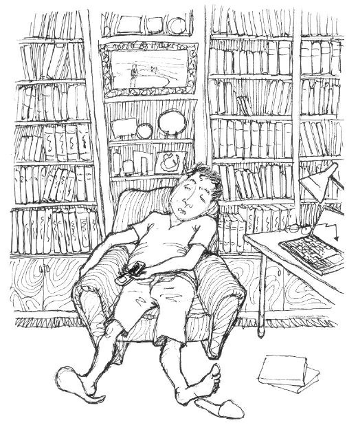
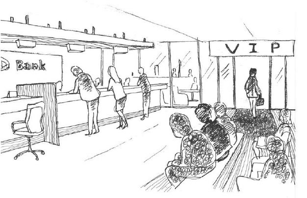
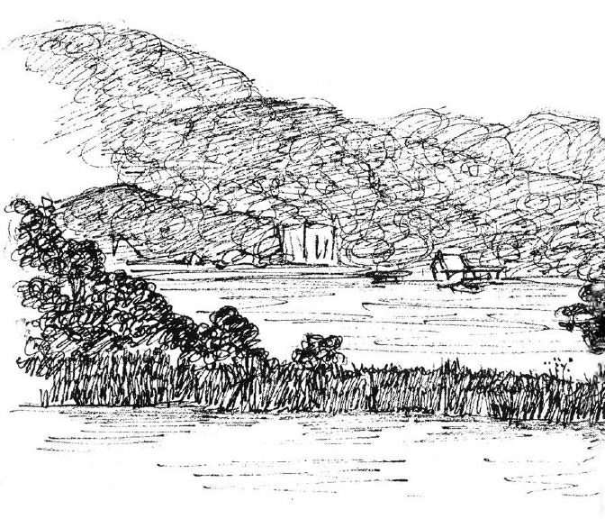
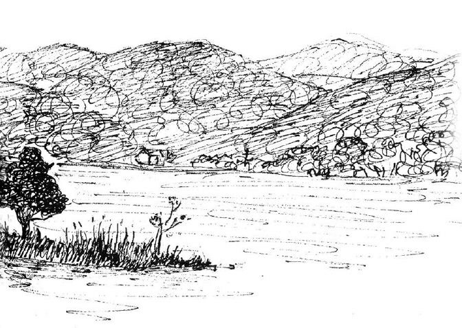

# Chương 1: Khoảng cách giữa mơ ước và hiện thực

## Mua và bán cũng cần có hiểu biết

“Anh dậy mau đi, các con đã mặc quần áo xong hết rồi, anh bảo hôm nay cho các con đi công viên chơi, chúng vui lắm đấy.”

Vợ Choe Socheon lay chồng đang nằm ngủ, rồi cô lại than vãn:

“Đã nói là cho con đi chơi rồi mà còn thức khuya đọc sách là sao?”

Tối hôm trước Choe Socheon mải xem những cuốn sách mới mua, mãi đến 3 giờ mới ngủ, vậy mà mới 8 giờ sáng vợ anh đã gọi dậy.

“Anh khổ cực như vậy là vì ai chứ?”

Đang định nói ngày nghỉ vốn là để nghỉ ngơi, nhưng nghĩ lại nếu phản bác như vậy thì sẽ lại bị vợ ca thán.

“Bố ơi, dậy đi.”

Cô con gái Ji Eun đang học mẫu giáo chạy tới dang rộng đôi tay, vậy là Choe Socheon không còn lý do để nằm ỳ trên giường nữa. Anh dụi mắt rồi nhìn ra ngoài, cậu con trai Junbi mới lên ba cũng đã mặc quần áo xong xuôi, thấy bố dậy Junbi vỗ tay sung sướng. Choe Socheon bế hai con lên, trong đầu hạ quyết tâm:

“Thôi được, cho dù có mệt mỏi mình cũng sẽ cố gắng vì các con thân yêu của mình.”

Sau bữa sáng, vợ anh bắt đầu chuẩn bị cho buổi đi chơi, nhân lúc đó anh vào phòng đọc sách bật máy tính, 9 giờ sẽ mở cửa thị trường cổ phiếu, nếu cứ theo đà hôm qua thì hôm nay cổ phiếu anh đang mua sẽ tăng kịch trần.

“Tính đến hôm qua, lợi nhuận ròng của tháng này đã lên đến 2.000.000 Won. Hôm nay tăng kịch trần đi nào, nếu như vậy thì chuyến đi chơi hôm nay sẽ rất vui.”

Sao thế này? Những con số hiển thị trên màn hình hoàn toàn trái ngược với mong đợi của anh, thị trường cổ phiếu đầu phiên giao dịch có xu hướng tăng mạnh, nhưng cổ phiếu của anh lại xuống gần điểm sàn.

“Ơ, sao lại thế này? Có chuyện gì xảy ra vậy? Sao lại chỉ có mỗi cổ phiếu của mình rớt điểm?”

Anh lập tức tra cứu thông tin, bàn tay cầm chuột bắt đầu run lẩy bẩy.

*Cổ phiếu SB do quý III kinh doanh thua lỗ đang đảo chiều giảm* *điểm xuống gần điểm sàn*.

Choe Socheon nhanh chóng liên lạc với người bạn học khóa trên đang làm việc tại công ty chứng khoán.

“Anh ạ, có chuyện gì vậy? Em vừa nghe tin cổ phiếu SB giảm điểm do quý III kinh doanh thua lỗ, thông tin này có chính xác không?”

“À, cậu cứ bình tĩnh, tôi cũng đang xem báo cáo, cần có thời gian mới biết rõ được là nguyên nhân gì, cậu cứ đợi đã.”

“Em làm sao mà bình tĩnh được? Bây giờ liệu có nên bán ra không? Anh đã từng bảo đôi lúc cũng phải chịu đau hay sao, nên bán hay nên để quan sát tiếp?”

“Lát nữa tôi gọi lại cho cậu, hôm nay thị trường tăng mạnh nên có rất nhiều khách hàng gọi điện tới, cậu đừng lo lắng quá.”

“Không phải, anh ạ!”

Tút tút…

Choe Socheon lòng nóng như lửa đốt muốn nói tiếp nhưng đầu bên kia chỉ còn tiếng “Tút tút…”.

Không có được câu trả lời thích đáng, anh càng hoang mang hơn. Ngay cả trong lúc gọi điện thoại mắt anh cũng không rời khỏi màn hình máy tính, giá cổ phiếu lúc gần chạm sàn cũng có lúc đảo chiều tăng một chút, thiệt hại ở mức 12%, thật may, nhưng tâm trạng bất an vẫn bủa vây anh.

“Như vậy thì có thấm vào đâu, đây là dấu hiệu đảo chiều tăng mạnh hay chỉ là đảo chiều kỹ thuật nhất thời thôi?”

Một góc màn hình đang hiển thị tình hình giao dịch, trong lúc rối ren này, anh chợt nhớ đến một quan điểm trong cuốn sách đọc được tối hôm qua:

*Mua bán cần nắm bắt thời cơ!*

“Đúng rồi, mua bán cần nắm bắt thời cơ, nếu trong lúc cổ phiếu đảo chiều kỹ thuật mà không bán ra, thì e rằng nó sẽ tiếp tục giảm, đến lúc đó không thể làm gì được nữa, đợi qua cơn khủng hoảng này rồi tính tiếp, mình phải bán ngay!”

Choe Socheon bán tất cả cổ phiếu SB với giá hiện thời, như vậy tính ra đã lỗ tổng cộng 2.000.000 Won, hôm qua còn được lời 2.000.000 Won, vậy mà hôm nay đã trở thành lỗ 2.000.000 Won, tuy lòng anh đau như cắt, nhưng đành phải an ủi bản thân chưa thua hết là may rồi.”

Choe Socheon muốn uống nước để lấy lại tinh thần, nhưng khi lấy được nước quay lại phòng đọc sách, anh lại được một phen kinh ngạc, anh không thể tin nổi vào mắt mình nữa, cổ phiếu SB không những đã tăng lại những điểm đã mất, mà còn cao hơn giá hôm qua một chút, trong thanh tin tức của hệ thống khớp lệnh mạng HTS hiện lên dòng tin:

*Tuy cổ phiếu SB quý III kinh doanh không khởi sắc nhưng do cung* *không đủ cầu, nên giá cổ phiếu này vẫn tiếp tục tăng.*

Thoắt tăng thoắt giảm, lúc này Choe Socheon như bị rơi xuống địa ngục. Bây giờ không còn cơ hội để cứu vãn tổn thất lúc trước nữa rồi, tứ chi anh rã rời, hai chân run lẩy bẩy, hai tay bám chặt vào bàn, anh hối hận sao mình không nhẫn nại hơn một chút, cứ nghĩ đến việc chỉ trong 10 phút đã tổn thất một tháng lương, đầu anh lại ong lên.

Đúng lúc này vợ anh mở cửa đi vào:

“Anh chưa mặc quần áo đi còn ngồi đó làm gì? Mẹ con em xong cả rồi, anh nhanh lên đi.”

“Ừ anh biết rồi.”

Choe Socheon chỉ trả lời theo phản xạ, còn anh vẫn ngồi bất động.

“Đúng rồi, hôm qua em nhận được hóa đơn thẻ TC, anh lại mở thẻ tín dụng nữa à?”

Đúng là chó cắn áo rách, thẻ tín dụng đó anh giấu vợ mở bây giờ lại nhận được hóa đơn, Choe Socheon cầm hóa đơn vợ đưa, lôi bạn ra làm bia đỡ đạn.

“À, cái này, em còn nhớ So Uey bạn anh không? Cậu ta làm việc ở ngân hàng, suốt ngày bị thúc doanh số nên cứ mời anh mở thẻ tín dụng, từ chối mãi không được anh đành phải mở một cái.”

Chuyển nhà mới, sắm sửa nội thất, đồ gia dụng mới, những khoản mua trả góp và khoản vay của thẻ tín dụng cũ đã lên đến mức tối đa, anh đành phải mở thẻ tín dụng mới để giật gấu vá vai. Anh nhanh chóng mở phong bì và xem hóa đơn.

*Số tiền chi trả một lần 300.000 Won.*

*Số tiền trả góp 1.500.000 Won.*

*Số tiền mặt đã chi 3.500.000 Won.*

Nhìn số tiền phải trả trên hóa đơn, Choe Socheon thở dài, tìm bản khai chi tiết trong hóa đơn.

“Số tiền mặt đã chi là để trả cho khoản nợ của tấm thẻ tín dụng thứ nhất, số tiền trả một lần là tiền trả hôm đi chơi golf với trưởng ban, còn tiền trả góp là sao?”

Anh lấy hóa đơn của tấm thẻ thứ nhất từ trong ngăn bàn ra và bắt đầu đối chiếu, đúng lúc này, điện thoại của anh phát ra tiếng “Ting ting”.

*Quý khách đã quá hạn trả lãi tiền vay mua nhà, theo quy định,* *chúng tôi sẽ thu 18% tiền phạt trả chậm tương ứng với 750.000 Won,* *xin quý khách thông cảm. Ngân hàng Huyndai.*

Choe Socheon hoàn toàn rơi vào trạng thái hoang mang, trên màn hình máy tính là số dư sau khi khớp lệnh, tay trái là hóa đơn thanh toán tín dụng, tay phải là tin nhắn điện thoại, anh thấy mình như đang chìm dần vào địa ngục, hoa mắt chóng mặt, hai tay anh như bị trói chặt, không cử động được nữa...

“Anh ra đây nhanh đi, các con đang đợi đấy.”

Vừa nói vợ anh vừa mở cửa đi vào, nhưng tai anh lúc đó không thể nghe thấy gì nữa.

“Anh làm sao thế? Sao người lại lạnh toát thế này, em thấy sắc mặt anh không được tốt, anh mệt à?”

“Em à, anh xin lỗi, hôm nay anh muốn nghỉ ngơi một chút, anh hơi khó chịu, em đưa con đi chơi nhé, được không?”

Choe Socheon nói thều thào, sau đó nhắm chặt mắt lại…

## Một sổ tiết kiệm hay nhiều sổ tiết kiệm

Không biết Choe Socheon đã nằm bao lâu, ánh mặt trời chói chang chiếu qua khung cửa sổ làm cho anh buộc phải mở mắt, anh uống một ngụm nước, hít một hơi thật sâu.

“Cứ giật gấu vá vai mãi thế này cũng không phải cách hay, phải nghĩ ra cách nào đó, phải tìm hiểu rõ tình hình đã, từ nay đến ngày lĩnh lương còn mấy ngày nữa nhỉ?”

Vừa nhìn vào lịch, Choe Socheon lại bị sốc tiếp, đến khi nhận được lương cũng không giải quyết được vấn đề trước mắt.

“Tiền lương 4.000.000 Won, trừ đi thuế và bảo hiểm, chỉ còn lại 3.300.000 Won, ôi trời, mình lấy gì để trả nợ đây?”

Mọi cảm xúc bao trùm lên anh. Ngày nghỉ đã định đưa con đi chơi, thực hiện trách nhiệm của người làm cha, không ngờ lại ra nông nỗi này.

“Tiền lương cũng không giải quyết được vấn đề gì, đành phải dùng đến chiêu tiết kiệm vậy.”

Trước đây, một người bạn làm việc ở ngân hàng đã khuyên anh nên đầu tư vào gói tiết kiệm, mỗi tháng nộp 200.000 Won, nhân viên ngân hàng nói với anh rằng, nên chuẩn bị cho cuộc sống sau khi về hưu ngay bây giờ, bởi vì thời gian chuẩn bị sẽ lên tới 30 năm, tuy số tiền tiết kiệm rất nhỏ thôi, nhưng cũng đủ cho anh dùng khi về hưu. Lúc đó anh cho rằng đây chỉ là một chiêu thức ngân hàng tiếp thị cho khách hàng sau khi cho họ vay tiền, anh thấy không có gì đáng lưu tâm, nhưng bây giờ anh lại thấy nó có thể giúp ích cho anh. Anh ngồi lại bên bàn làm việc, vào mạng của ngân hàng tra cứu.

*Quý khách hàng đã đầu tư gói tiết kiệm 200.000 Won mỗi tháng,* *thời gian đầu tư là 24 tháng, tổng số tiền bạn đầu tư là 4.800.000* *Won, tổng tiền tiết kiệm được là 5.836.076 Won, với lợi nhuận* *1.036.076 Won, lãi suất trong thời gian này là 20%.*

Đọc đến đây Choe Socheon vô cùng kinh ngạc, một gói tiết kiệm mà anh miễn cưỡng đầu tư lại có thể đem lại cho anh hơn 1.000.000 Won lợi nhuận.

“Không thể ngồi chờ chết được, phải rút hết tiền tiết kiệm ra, không chừng một ngày nào đó cả sàn chứng khoán đều giảm mạnh, lấy hết tiền ra để tạm thời chữa cháy vậy…”

Choe Socheon lục tìm sổ tiết kiệm và con dấu để tới ngân hàng.

Ngân hàng đông nghịt người, hôm đó đúng vào ngày cuối cùng ngân hàng quyết toán, trong sảnh rất đông những người đang cầm số

chờ đến lượt.

“Phía trước mình có 34 người xếp hàng, cho dù 14 người bỏ đi thì cũng phải còn 20 người, ôi, ít nhất cũng phải đợi một tiếng nữa.”

Đang lúc tâm trạng rối bời lại gặp phải tình huống này, Choe Socheon càng bực mình hơn, anh không hiểu tại sao ngân hàng kiếm được nhiều tiền từ khách hàng như vậy mà lại bắt khách hàng chờ đợi khổ sở, muốn rút tiền cũng phải đợi một tiếng đồng hồ! Lâu lâu mới có một ngày nghỉ thì lại nhận được toàn tin xấu, sau đó việc gì cũng không theo ý mình. Anh bắt đầu nóng ruột nhìn trước ngó sau, anh thấy bên cạnh cây điều hòa có một con đường trải thảm đỏ, cuối con đường có vài người không cầm số đi vào một căn phòng, trên đó có ghi “Phòng khách hàng VIP”, bên cạnh đó còn có một phòng khác là “Két sắt ngân hàng”, những người đi ra từ phòng khách hàng VIP đều đi vào căn phòng này.

“Đó chắc là nơi dành cho những người nhiều tiền, ở đâu cũng vậy, cứ có tiền là sẽ được tiếp đón nhiệt tình, lúc nào mình mới được vào chỗ đó đây?”

Nhìn những người đi trên thảm đỏ, anh càng đứng ngồi không yên, anh có đôi chút ganh tị với họ. Đúng lúc này, một người đàn ông trông rất quen được Giám đốc ngân hàng tiếp đón đi từ trong phòng VIP ra.

“Anh ta còn trẻ sao lại giàu thế nhỉ, chắc là con nhà giàu rồi. Gì thế này? Đó chẳng phải là Jin Munhwa sao, sao anh ta lại đi từ đó ra?”

Jin Munhwa là bạn học đại học với Choe Socheon, khi đó hai người thân như anh em, nhưng tốt nghiệp xong Jin Munhwa đến nơi khác làm việc, nên hai người mất liên lạc từ đó. Vừa nhận ra Jin Munhwa, Choe Socheon vui mừng gọi:

“Jin Munhwa.”

Jin Munhwa nhìn xung quanh, thấy Choe Socheon đang ngồi ở ghế chờ bèn đi tới.

“Choe à, lâu quá rồi, không ngờ chúng ta lại gặp nhau ở đây.”

Jin Munhwa vỗ vai Choe Socheon, anh rất vui mừng:

“Từ lúc cậu đến làm ở nơi khác chúng ta không liên lạc với nhau, cũng lâu lắm rồi đấy, cậu sống thế nào?”

Tuy rất tò mò tại sao Jin Munhwa lại đi từ phòng VIP ra, nhưng Choe Socheon vẫn cố kìm để nói mấy câu chào hỏi.

“Tôi thì cũng tàm tạm thôi, hơn ba mươi rồi còn gì, thời gian trôi nhanh thật, mải kiếm tiền nuôi gia đình chẳng có thời gian gặp bạn bè nữa.”

“Sao ông có nhiều sổ tiết kiệm thế? Ông làm việc ở ngân hàng này à?”

Choe Socheon không thể kiềm chế được nữa, chỉ vào sấp sổ tiết kiệm trên tay Jin Munhwa.

“Làm ở ngân hàng á? Không phải, tôi có việc nên đến đây, nhiều sổ tiết kiệm quá rất khó giữ, nên tôi đến đây để thuê một cái két sắt của ngân hàng. Choe Socheon, ông đợi tôi một chút, tôi cất sổ tiết kiệm vào rồi sẽ ra ngay.”

Nhìn Jin Munhwa cầm một sấp sổ tiết kiệm trong tay đi về phía phòng để két sắt, Choe Socheon mặt đỏ rần rần, mình thì sáng ngày ra đã bị ngân hàng phạt tiền do không trả lãi đúng hạn, phải cầm sổ tiết kiệm đến ngân hàng để rút, so với Jin Munhwa thật là khác xa một trời một vực. Khi tốt nghiệp, Jin Munhwa phải ra tỉnh ngoài làm việc, cậu ta đã rất ngưỡng mộ mình vì mình được vào làm trong công ty lớn, nhưng chỉ 10 năm sau thôi tình thế đã hoàn toàn đảo ngược.

Trong lúc đợi Jin Munhwa, đã đến lượt Choe Socheon làm thủ tục. Choe Socheon nói với nhân viên ngân hàng rằng anh muốn rút tiết kiệm. Trong lúc nhân viên ngân hàng đang chăm chú nhìn vào màn hình và bàn phím thì anh hỏi nhỏ muốn sử dụng phòng VIP và két sắt ngân hàng thì phải có những điều kiện gì, nhân viên ngân hàng trả lời rằng phải có tiền gửi từ 100.000.000 Won trở lên.

“Vậy là Munhwa đã có đến 100.000.000 Won rồi sao? Anh chàng này khá thật đấy…”

Munhwa xong việc, hai người cùng nhau đi uống café và trò chuyện.

“Hôm nay ông không phải đi làm à?”

“À, hôm nay tôi được nghỉ, chuẩn bị đưa con đi chơi, và tìm hiểu thêm về cổ phiếu nữa.”

Trong lúc nói chuyện với Jin Munhwa chỉ cần nhắc đến tiền là Choe Socheon lại chuyển đề tài, nhưng bản thân anh thì lại hay nhắc đến “cổ phiếu”.

“Cổ phiếu à? Lúc học đại học tôi cũng biết ông rất giỏi, sẽ không thỏa mãn với một công việc, bây giờ ông vừa đi làm vừa chơi cổ phiếu, thế thì bận lắm nhỉ.”

Đúng như anh dự đoán, Jin Munhwa không bỏ qua hai chữ “cổ phiếu”.

“Làm gì có, ai mà chẳng phải thế, phải kiếm tiền nuôi gia đình thôi. Ông có vẻ khá nhỉ, hôm nay thấy ông có nhiều sổ tiết kiệm như vậy, lại thuê cả két sắt ngân hàng, chắc ông kiếm cũng khá phải không?”

Cuối cùng Choe Socheon cũng quay lại cách nói chuyện thẳng thắn với Jin Munhwa.

“Khá ư? Tôi thấy còn ít lắm.”

Jin Munhwa lắc đầu, anh không nói thêm gì nữa.

“Sao ông lại nói thế? Tôi được biết muốn thuê két sắt của ngân hàng thì tiền gửi phải từ 100.000.000 Won trở lên. Thôi không nói chuyện đó nữa, ông có bí quyết gì, nói cho tôi nghe đi.”

Choe Socheon hỏi Jin Munhwa với vẻ mặt vừa chờ đợi vừa ngại ngùng.

“Ông còn nhớ môn Quản lý tài chính chúng ta học trước kia không? Học kỳ cuối ấy.”

Choe Socheon kìm nén cả nỗi xấu hổ để hỏi Jin Munhwa về bí quyết kiếm tiền thì anh ta lại lôi môn học Quản lý tài chính từ thời đại học ra nên anh có vẻ không vui.

“Nhớ chứ, nhưng ông đừng nhắc đến nữa, môn đó tôi học được vài buổi đã cãi nhau với thầy giáo, sau đó lại bỏ học liên tục, lúc tốt nghiệp chỉ được điểm D.”

Tuy đã mười năm trôi qua, nhưng Choe Socheon vẫn nhớ như in chuyện đó.

“Đúng vậy, do là học kỳ cuối nên ông không lên lớp mấy, còn tôi thì lại rất thích môn này, tiết nào tôi cũng nghe rất chăm chú, cuối cùng được điểm A+.”

“Vậy sao, lúc đó tôi quyết định đi làm vào kỳ cuối, nên không chú ý đến điểm số lắm, sao tự nhiên ông lại nhắc đến nó?”

“Thực ra tôi không có bí quyết gì, chỉ có điều khi đi làm tôi đem kiến thức học được lúc đó ứng dụng vào thực tế.”

“Sao có thể như vậy được? Kiến thức học được từ môn Quản lý tài chính có thể giúp ông được như ngày hôm nay sao? Đừng đùa nữa, mau nói cho tôi bí quyết đi.”

Ánh mắt Choe Socheon lộ rõ vẻ kinh ngạc, anh tiếp tục hỏi Jin Munhwa.

“Làm gì có bí quyết đặc biệt nào đâu, chỉ có điều khi ở trên lớp tôi bám sát tư duy của thầy, có chỗ nào chưa hiểu tôi liền gặp Giáo sư Masu để hỏi.”

Vừa nghe đến tên Giáo sư Masu, trong đầu Choe Socheon lập tức hiện lên khuôn mặt của Giáo sư. “Lúc đó Giáo sư Masu là giáo sư thỉnh giảng, chỉ dạy ở trường mình một học kỳ, sau đó lại quay về Mỹ.”

“Đúng vậy, khi làm việc, những lúc rảnh tôi vẫn liên lạc với thầy qua email, tôi luôn giữ quan hệ tốt với thầy, nên khi gặp vướng mắc, tôi đều hỏi ý kiến thầy.”

“À…”

Thấy có vẻ không hỏi được gì từ Jin Munhwa, Choe Socheon thất vọng vô cùng, anh nhớ lại thời đại học của mình.

Vào học kỳ cuối, anh và Jin Munhwa đã chọn môn Quản lý tài chính, Giáo sư Masu được mệnh danh là “Người hùng trong kinh doanh” lúc đó đang làm tổng giám đốc của một công ty tài chính chi nhánh Hàn Quốc, được trường anh mời về dạy một học kỳ, chủ yếu dạy các lớp sắp tốt nghiệp. Vì Giáo sư Masu rất nổi tiếng nên Choe Socheon rất háo hức khi đăng ký môn này. Năm đó để đối phó với khủng hoảng kinh tế châu Á, chính phủ đã ban hành chính sách cho phép nước ngoài đầu tư trong quá trình chuyển đổi từ doanh nghiệp nhà nước sang doanh nghiệp tư nhân. Điều này khiến những ngân hàng trong nước và những tổ chức được chính phủ đầu tư đang phát triển tốt bị tư bản nước ngoài khống chế, Choe Socheon chưa nghe giảng được mấy lần đã đặt ra câu hỏi này cho Giáo sư Masu. Choe Socheon cho rằng khi tư bản đầu cơ dần dần xâm lấn thị trường tài chính trong nước, người dân sẽ lo lắng về việc tài sản nhà nước bị rò rỉ ra nước ngoài. Giáo sư Masu phản bác lại một cách khô cứng bằng lý luận toàn cầu hóa và thị trường tư bản, hai người tranh luận rất gay gắt, cuối cùng không ai chịu ai, sau đó Choe Socheon chuẩn bị đi làm nên không coi trọng môn học này nữa, anh nộp báo cáo qua loa, đến cuối kỳ thi cũng qua, nhưng chỉ đạt điểm D.

“Choe Socheon, cậu không biết Giáo sư Masu cũng mới đến Hàn Quốc sao?”

“Vậy à, tôi không biết, tôi không giữ liên lạc với Giáo sư.”

“Bây giờ Giáo sư là giám đốc điều hành khu vực châu Á của Công ty tư vấn GBE, khi nào rảnh chúng ta đi thăm thầy nhé.”

“Cậu vẫn giữ liên lạc với Giáo sư à? Tốt nghiệp xong tôi không hề liên lạc với thầy, bây giờ lại đến thăm thì ngại lắm. Hơn nữa tôi hay trốn học giờ của ông ấy, lại còn cãi lại ông ấy, thôi, bỏ đi.”

Choe Socheon xua tay.

“Đừng nói vậy, Giáo sư cũng rất muốn gặp cậu, thầy vẫn nhắc mãi lần tranh luận với cậu đấy, trong thư thầy gửi cho tôi cũng nhắc đến cậu đấy.”

“Vậy sao?”

Nghe thấy Giáo sư Masu vẫn còn nhớ mình, Choe Socheon vui mừng xen lẫn ngạc nhiên.

“Đương nhiên rồi, lần sau tôi sẽ sắp xếp cho hai người gặp nhau.”

Về đến nhà, mặt Choe Socheon vẫn buồn rầu, từ sáng đến giờ gặp bao nhiêu chuyện, đến ngân hàng lại gặp Jin Munhwa, anh thấy mình càng thảm hại hơn. Tiền trả góp mua xe thì đã thanh toán rồi, nhưng còn tiền nợ thẻ tín dụng và tiền nhà nữa, mình làm gì còn nhiều tiền mà gửi tiết kiệm nữa, có lẽ từ giờ trở đi mỗi ngày mình sẽ phải quay quắt vì tiền. Anh bắt đầu sợ hãi mọi thứ xung quanh, hóa đơn thẻ tín dụng, thông báo trả lãi chẳng khác nào khế ước bán thân của anh.

“Tại sao lại thế này? Năm nào cũng được tăng lương, vậy mà tiền vẫn không đủ tiêu, vấn đề nằm ở đâu đây?”

## Chi tiêu không tính toán - Bạn chỉ hết

## phiền muộn tạm thời

Ngủ dậy, Choe Socheon mở cửa sổ xem thời tiết bên ngoài, sau mấy ngày mưa liên tục, cuối cùng hôm nay trời cũng hửng nắng, thật là may, bởi vì hôm nay là ngày Câu lạc bộ Lướt sóng tổ chức hoạt động, một người đang đau đầu vì tiền như Choe Socheon mà vẫn rất háo hức với hoạt động này.

“Được rồi, hôm nay mình phải quên hết mọi phiền muộn, thả mình theo những con sóng thôi!”

Choe Socheon uống cốc sữa nóng vợ đưa, giở báo đọc, mắt anh theo quán tính liếc vào phần bản tin tài chính kinh tế, trong mục đánh giá thị trường cổ phiếu tuần trước và dự báo triển vọng thị trường tuần sau, anh chú ý đến một đoạn tin:

… Những người khó khăn không bao giờ có ý muốn trở thành người giàu có, cho nên họ luôn tìm lý do cho thất bại trong quản lý tài chính của mình. Trái lại những người thành công về mặt tài chính mỗi khi đối mặt với vấn đề này, họ sẽ vắt kiệt chất xám để tìm ra một giải pháp, sau khi giải quyết xong vấn đề thì họ càng thành công hơn. Còn người khó khăn không bao giờ giải quyết triệt để vấn đề tài chính của mình, nên cuối cùng họ không những gặp phải vấn đề kinh tế mà ngay cả hạnh phúc của những người trong gia đình họ cũng bị ảnh hưởng…

Đây là bài phỏng vấn một nhân vật đã thành công trong sự nghiệp sau khi thất bại thảm hại, thấy từ “người khó khăn” trong bài phỏng vấn dường như đang ám chỉ chính mình, Choe Socheon hơi khó chịu.

“Cái gì? Người khó khăn ư? Người nghèo thì nói thẳng là người nghèo lại còn vòng vo tam quốc.”

Choe Socheon quăng tờ báo xuống bàn, ra ban công sửa sang lại quần áo.

Ngày thứ Sáu của tuần thứ tư mỗi tháng anh đều đi Tae Pyeong, khi mới vào công ty, trong một buổi họp mặt nhân viên tổ chức tại Tae Pyeong, lần đầu tiên anh được thử chơi môn lướt sóng, anh cảm nhận được sức hút đặc biệt của môn thể thao này, sau đó anh rủ O Junbi làm cùng công ty tham gia Câu lạc bộ Lướt sóng. Anh chưa bao giờ vắng mặt trong các buổi sinh hoạt của câu lạc bộ, nhưng từ khi kết hôn và có con, muốn tham gia sinh hoạt với câu lạc bộ cũng phải xem chừng thái độ của vợ.

Choe Socheon quên đi tất cả để hòa mình vào con sóng, bên tai anh là tiếng động cơ kêu ro ro, những con sóng nhấp nhô, cảnh biển tuyệt đẹp, và dây thừng căng chặt, anh chìm đắm vào không khí thư giãn, quên đi mọi âu lo muộn phiền. Những con sóng đã đánh tan đi những khoản nợ thẻ tín dụng và tiền phạt trả lãi chậm đang làm anh đau đầu. Mây chiều dần dần kéo đến phủ kín bầu trời, ngày cuối cùng của tháng Năm sắp trôi qua, đúng thật là “ngày vui ngắn chẳng tày gang”.

Sau khi lướt sóng, mọi người tụ tập ăn uống. Mọi người ngồi thành từng nhóm theo mối quan hệ xã hội của mình. Choe Socheon ngồi ăn cùng nhóm những người đi làm. Hôm nay tiêu điểm của cuộc nói chuyện là Song Huiseong - hội viên lâu năm của câu lạc bộ đang ngồi ở góc bàn. Anh đã lướt sóng được 15 năm, hiện đang là giám đốc kinh doanh của một doanh nghiệp nước ngoài, thân hình cao lớn rắn chắc, lại thêm cách ăn mặc đẹp, anh được các hội viên nữ vô cùng ngưỡng mộ, câu chuyện hôm nay xoay quanh chiếc xe mà Song Huiseong mới mua.

“Song Huiseong, xem ra tiền thưởng của anh cao thật đấy, mua được cả Lexus rồi.”

Do Jihae - tổng phụ trách câu lạc bộ bắt đầu mở lời.

“Đúng vậy, tiền thưởng cùng với thẻ tín dụng cũng đủ mua xe. Vừa nghe phiên bản nâng cấp ra thị trường tôi chạy ngay sang cửa hàng Lexus cạnh công ty tôi, nhưng phương thức thanh toán của họ lằng nhằng quá.”

“Sao lại thế?”

Do Jihae ngạc nhiên hỏi.

“Đầu tiên phải trả 20% số tiền, số còn lại mỗi tháng trả 500.000 Won, từ tháng này bắt đầu chi trả, cho nên tôi phải quyết tâm lắm mới mua được chiếc xe này đấy, dù sao thì năm sau cũng tăng lương, tính ra cũng không đến mức khó khăn lắm.”

Trong khi mọi người đang nhìn Song Huiseong với ánh mắt ngưỡng mộ thì một câu nói vọng ra từ phía góc bàn:

“Lexus tốt đến vậy sao?”

Đó là No Buseong, người lớn tuổi nhất câu lạc bộ, cũng là đồng hương với O Junbi, tuy hai người cách nhau nhiều tuổi nhưng rất thân thiết.

“Anh Budong, anh nói thế là chưa hiểu rồi, có người đã từng nói thế này, nếu muốn được thưởng thức café vào buổi sáng thì phải mua được Lexus.”

“Có nghĩa là phải lái xe đi uống café à?”

“Không phải, câu đó có nghĩa là có thể mang café đi làm, cho dù có đặt café lên mặt đồng hồ ô tô thì ly café cũng không hề lung lay, tức là khi ngồi trong xe không có cảm giác bị rung. Ha ha.”

“Ồ.”

Mọi người xung quanh đều ồ lên ngưỡng mộ, đó quả thật là mơ ước của những người đi làm công sở. Do Jihae cũng vô cùng ngưỡng mộ, cậu ta hỏi về giá của chiếc xe và điện thoại của nhân viên bán hàng, trong số những người có mặt ở đó cậu ta tương đối trẻ, mơ ước của cậu ta là chiếc xe thể thao mui trần, nhưng cho đến nay vẫn chưa được đưa vào kế hoạch mua sắm, thấy Do Jihae có vẻ do dự, Song Huiseong nói quan điểm của mình:

“Do Jihae này, sống thì phải cho ra sống chứ? Cha mẹ chúng ta sống khổ cả đời, ăn không dám ăn, mặc không dám mặc, tuy chúng ta không có nhiều tiền, nhưng một chút tiền thế này cũng đáng bỏ ra lắm chứ, mua một chiếc xe tốt, đến kỳ nghỉ có thể đưa cả nhà đi biển, nói cách khác thì, chỉ cần cách sống của mình không ảnh hưởng gì đến người khác là OK rồi. Cậu có biết con người hay phạm phải sai lầm gì không? Chỉ nghĩ đến tương lai, nhưng lại bỏ qua niềm vui trước mắt, tôi cho rằng ai biết hưởng thụ từng khoảnh khắc trong đời người mới là người thông minh và hạnh phúc nhất, nhiều cái hiện tại gộp lại thì mới có tương lai, nếu chỉ nghĩ về tương lai, thì tương lai sẽ không bao giờ tới. Cậu thấy đúng không?”

Song Huiseong mặt đỏ bừng, miệng vẫn còn bọt bia, anh ta cũng khẳng khái nói, Do Jihae đặt cốc bia xuống, tiếp lời anh ta bằng một giọng điệu bi tráng:

“Anh nói đúng đấy, hôm qua em đi gửi tiết kiệm ở ngân hàng thấy lãi suất chẳng được bao nhiêu, 10 năm trước, lãi suất còn được hơn 10%, nhưng bây giờ lãi suất thấp kinh khủng, lại còn bị trừ thuế lợi tức, cuối cùng cũng không sánh được với chỉ số giá cả tiêu dùng CPI, trong lúc kinh tế lạm phát mà gửi tiền vào ngân hàng thì thà để tiền mà ăn chơi còn hơn, có đúng thế không?”

“Ha ha, xem ra chúng ta suy nghĩ giống nhau đấy.”

Nghe lời khen của Song Huiseong, Do Jihae càng hứng thú hơn, cậu ta nâng cao ly nói to:

“Đúng vậy, anh ạ, cuộc đời còn cần nhất là thứ gì? Thích ăn thì ăn, thích uống thì uống, thích làm thì làm, hay thật đấy, nào chúng ta cạn ly!”

Lúc về O Junbi và No Buseong ngồi chung xe của Choe Socheon, những khi tụ tập họ thường thay nhau lái xe, lần này đến lượt Choe Socheon. Anh mở đài phát thanh, trên đó đang thảo luận sôi nổi về chủ đề nên làm thế nào để ứng phó với cuộc sống sau khi về hưu, họ đưa ra một quan điểm cho rằng một người sống ở thành phố đến năm 40 tuổi cần có ít nhất 600.000.000 - 700.000.000 Won tiền dưỡng lão, O Junbi liền nói:

“Ngày nào đến công ty cũng bận tối mắt tối mũi, sao còn nghĩ đến cuộc sống sau khi về hưu nữa? Sống qua được một ngày đã là may rồi, thực ra với đồng lương của chúng ta thì bao giờ mới tiết kiệm đủ tiền dưỡng già? Trên thế giới có một số người chỉ nằm ở nhà kiếm tiền bằng bất động sản, còn chúng ta có tiết kiệm cũng chỉ được một chút tiền thì có tác dụng gì, tôi thấy không cần phải suy nghĩ nhiều làm gì, cứ sống vậy thôi, số trời đã định rồi.”

O Junbi lúc nào cũng vậy, nói chuyện gì anh ta cũng quy cho số phận, nghĩ lại thì triết lý sống của anh ta rất đơn giản, đó là “thuận theo ý trời, chống lại số phận là ngu xuẩn”.

Choe Socheon lúc đầu cũng hơi bức xúc vì cách nghĩ của anh chàng này, nhưng lâu dần cũng thành quen, No Buseong ngồi ở ghế sau cũng nói:

“Đúng vậy, lúc nghỉ hưu cuộc sống của chúng ta còn tốt hơn nhiều, lúc đó nước ta sẽ trở thành nước phát triển, không phải lo lắng về cuộc sống sau khi về hưu nữa, cho dù không được như Thụy Sĩ phát tiền dưỡng già cho dân, thì cũng không đến nỗi chết đói, hơn nữa tháng nào chúng ta cũng phải nộp bảo hiểm mà.”

No Buseong vốn làm việc ở Công ty điện lực Hàn Quốc - một doanh nghiệp nhà nước, gần đây ông lại được thuyên chuyển đến Công ty phát điện miền Đông được tách ra từ công ty mẹ, ông quả thật là “chắc chân” với vị trí của mình, vì vậy ông luôn hài lòng với hoàn cảnh hiện tại.

“Anh No Buseong đừng nói nữa, bây giờ chỉ nhắc đến tiền là ong hết cả đầu, người giàu có cũng phải đối mặt với không ít vấn đề đấy, người thân thì xa cách, sức khỏe yếu kém, có khi còn bị kiện tụng, có thể trở thành người giàu có hay không là do số mệnh. Nhưng trên đời này còn có nhiều thứ quý hơn tiền, em thích nhất là cuối tuần được đưa cả nhà đi chơi, tuy cũng khá tốn kém, nhưng em thấy, được ở bên những người thân của mình còn quý hơn là có nhiều tiền.”

Câu hỏi của O Junbi lại tiếp tục nhận được sự tán đồng của No Buseong, cậu ta cho rằng chỉ cần cả gia đình đi du lịch với nhau thì đến đâu cũng thấy vui, cho nên cậu cũng đang suy nghĩ có nên đổi xe hay không, hai người chuyện trò không ngớt.

Choe Socheon im lặng lắng nghe cuộc trò chuyện của hai người, tuy quen biết họ đã lâu nhưng cách sống an hưởng của họ không ít lần khiến anh chán nản.

“Họ sống thật phóng khoáng, nhưng tiền lương của họ cũng đâu có cao hơn mình, sao lại có nhiều tiền để đi du lịch và thư giãn như vậy? Chắc chắn họ còn giấu mình điều gì.”

## Bản đồ kho báu

Tháng Năm mọi người rất thích đi du lịch nên con đường từ Tae Pyeong về Seoul vô cùng đông đúc, vì còn phải đưa O Junbi và No Buseong về, cho nên Choe Socheon sẽ về nhà rất muộn. Sau khi đỗ xe xong, nhìn đồng hồ đã gần 12 giờ, anh nhanh chóng bê dụng cụ lướt sóng và quần áo ướt đi vào nhà, vợ anh đang rất tức giận.

“Anh cũng biết đường về cơ à? Anh biết bây giờ là mấy giờ rồi không?”

Đúng như anh tưởng tượng, chắc chắn vợ anh sẽ không nhịn nữa.

“Anh xin lỗi, đường tắc quá, nên anh về muộn…”

“Rõ ràng anh biết sẽ tắc đường, sao còn đi lướt sóng? Lướt sóng có kiếm ra tiền không? Có mài ra ăn được không?”

Vợ Choe Socheon vốn đã không ưa việc cuối tuần anh đi lướt sóng một mình, hôm nay quyết làm cho ra lẽ, anh nghĩ khi về xin lỗi vợ là sẽ không có chuyện gì, không ngờ vợ anh lại đùng đùng nổi giận như vậy.

“Sao nào, việc anh đi lướt sóng cuối tuần không phải bây giờ mới có, ngày nào anh cũng đi làm mệt mỏi biết nhường nào, có một chút sở thích cũng không được sao? Chơi thể thao có thể giải tỏa áp lực, có gì không tốt? Anh làm vậy không chỉ vì riêng anh, còn vì em và các con, em đừng chỉ suy nghĩ một phía như thế, cũng phải nghĩ cho anh nữa chứ, anh có phải là cái máy kiếm tiền đâu.”

Đang đau đầu vì tiền, lại bị vợ trách mắng nên Choe Socheon nhân thể xổ ra hết những áp lực mà anh phải gánh chịu, anh vứt đồ xuống sàn, rồi đi về phòng đọc sách, đóng sập cửa vào. Anh ngồi bất động trên ghế, toàn thân như đè nặng xuống, anh nhắm mắt, hít thở sâu để lấy lại bình tĩnh, nhưng vừa cãi nhau với vợ xong thì khó mà có thể bình tĩnh ngay được. Xem ra hôm nay anh sẽ phải ngủ trong phòng đọc sách để không gặp thêm rắc rối với vợ.

Choe Socheon mở máy tính theo thói quen, khi kiểm tra hộp thư anh thấy có thư của Jin Munhwa.

Tôi Munhwa đây.

Gần đây ông thế nào? Hôm gặp ông ở ngân hàng tôi vui lắm.

Hôm nay tôi gọi điện cho ông định hẹn gặp, nhưng điện thoại tắt máy cả ngày, nhân dịp Giáo sư Masu hẹn tôi ăn cơm, tôi định mời cả ông, nhưng không liên lạc được. Tôi và giáo sư có nhắc đến ông đấy, thầy rất tiếc vì ông không đến. Giáo sư Masu nói rằng đợt giảng bài cho chúng ta là lần đầu tiên và cũng là lần cuối cùng, nhưng tôi vẫn gọi thầy là Giáo sư, nên thầy rất vui, thầy thích được gọi là “Giáo sư” hơn là “Hội trưởng” hay “Giám đốc”. Tôi đã scan danh thiếp của Giáo sư và gửi trong fifi le đính kèm, ông hãy liên hệ với Giáo sư nhé, nếu nhận được điện thoại của ông, thì Giáo sư sẽ rất vui đấy.

Đúng rồi, tôi quên mất, tháng sau cả gia đình tôi đi Singapore, từ lâu tôi đã mong muốn được làm việc ở nước ngoài, đến nay đã thành hiện thực. Trước khi tôi đi chúng ta phải gặp nhau một buổi mới được.

Munhwa.

Đọc xong thư của Munhwa, Choe Socheon ngưỡng mộ thì ít, ghen tị thì nhiều. Số tiền gửi ngân hàng của cậu ta đã đủ mượn két sắt ngân hàng, nay lại còn đưa vợ con ra nước ngoài làm việc, xem ra cậu ta rất được công ty trọng dụng, so với mình thì sao, ngay cả sở thích cũng bị vợ can thiệp, mỗi ngày phải quay quắt vì tiền, sự khác biệt đó làm anh khó chịu. Anh như lên cơn điên, đẩy mạnh bàn phím, hai tay ôm lấy đầu, bỗng anh nhớ tới câu nói của Jin Munhwa rằng khi gặp khó khăn anh đều hỏi ý kiến Giáo sư Masu.

“Mình có nên gặp Giáo sư Masu không, chẳng phải Munhwa đã biết được nhiều điều từ ông ấy, xem ra Giáo sư Masu chắc chắn có bí quyết để giải quyết vấn đề kinh tế.”

*Biết cách kiểm soát tiền bạc có nghĩa là không được để tiền bạc*

*chi phối cuộc sống của mình. Càng thiếu tiền thì vị thế của tiền* *càng cao. Ranh giới giữa thành công và thất bại trong tài chính* *quyết định bởi quan niệm về tiền bạc.*

