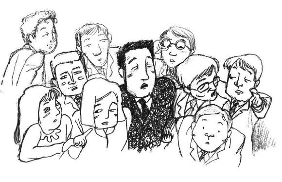
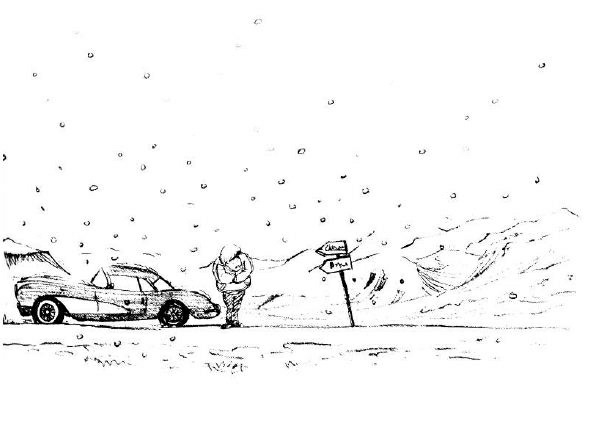
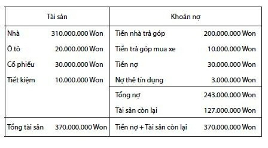
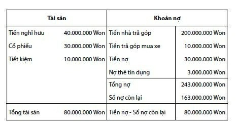
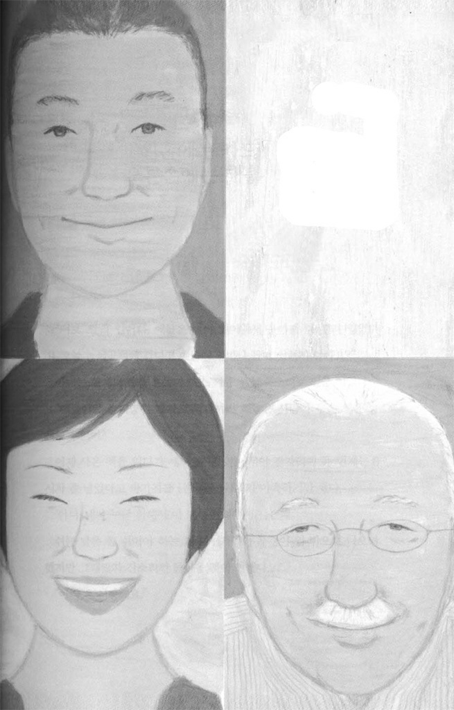

# Chương 2: Thỉnh giáo chuyên gia quản lý tài chính, giải mã bí quyết làm giàu

8 giờ 55 phút, như thường lệ Choe Socheon bước vào sảnh công ty, nhưng không khí hôm nay khác hẳn mọi ngày, mọi người đang tập trung bàn tán trước bảng thông báo của công ty, Choe Socheon cũng chen vào xem.

**THÔNG BÁO VỀ VIỆC THU HỒI NHÀ Ở CỦA CÔNG TY**

**Đối tượng thông báo**: Các nhân viên đang ở trong khu nhà ở của công ty.

**Người phê duyệt:** Phòng nhân sự

Do khủng hoảng kinh tế, gần đây doanh thu của công ty sụt giảm nghiêm trọng, việc xoay vòng vốn gặp nhiều khó khăn. Để giải quyết tình trạng này, Hội đồng Quản trị đã nghiên cứu và đi đến quyết định thu hồi toàn bộ nhà ở phúc lợi chỉ thu tiền quản lý mà công ty đã phân cho các nhân viên.

Quyết định này sẽ gây khó khăn cho các nhân viên đang ở nhà của công ty, mong mọi người thông cảm cho những khó khăn của công ty, vui lòng hoàn trả nhà cho công ty trong vòng ba tháng kể từ khi có thông báo này.

Công việc kinh doanh của công ty gần đây xuống dốc nghiêm trọng, mọi người đồn nhau rằng công ty sẽ có biện pháp ứng phó, nhưng không ai ngờ lại nhanh đến vậy. Đọc xong thông báo, người đầu tiên Choe Socheon nghĩ đến là O Junbi, cậu ta ở nhà của công ty ngay từ ngày đầu tiên đi làm.

“Gay go rồi đây, chắc cậu ấy sốc lắm.”

Trong phòng làm việc mọi người xôn xao bàn tán, thông báo đột ngột kia làm ai nấy chẳng còn lòng dạ làm việc, mấy người ngồi trong phòng nghỉ cũng đang bàn luận về vấn đề “thu hồi nhà”. Phòng Choe Socheon cũng có hai nhân viên đang ở nhà của công ty, xem ra giám đốc Jang cũng có vẻ không hài lòng. Choe Socheon gác công việc lại, đến phòng nhân sự để tìm hiểu tình hình, anh thấy có mấy người đang nói chuyện với trưởng phòng nhân sự.

“Trưởng phòng, làm vậy có phải hơi quá đáng không? Bỗng nhiên bắt chúng tôi chuyển đi, chúng tôi biết ở đâu bây giờ? Trước đây công ty cho chúng tôi chỗ ở nói là phúc lợi của công ty tốt nhất cả nước, bây giờ bắt chúng tôi chuyển đi thì chúng tôi sẽ sống thế nào?”

“Mọi người đừng bi quan như vậy, lần này chủ yếu là do công ty kinh doanh gặp nhiều khó khăn, tôi cũng không có cách nào khác. Mọi người có thể kêu ca với tôi, nhưng những khó khăn mà công ty đang gặp phải mọi người đều biết cả, chưa điều chỉnh về nhân sự đã là may lắm rồi, nếu không bán nhà thì sẽ có hơn 30 nhân viên bị thôi việc. Từ đầu năm lợi nhuận của công ty không được như trước, nên Hội đồng Quản trị đã đưa ra phương án cắt giảm phúc lợi, bán nhà cũng là một phần trong phương án tổng thể.”

Lời giải thích trần tình của trưởng phòng nhân sự khiến mọi người không nói thêm gì nữa, mọi người trở về phòng làm việc của mình,

Choe Socheon cũng không biết thêm thông tin gì. Sau khi về phòng, anh thấy phó chủ nhiệm Kim và phó chủ nhiệm Lee đang đưa đơn xin nghỉ phép cho trưởng phòng, họ muốn nhanh chóng bàn bạc với vợ con về vấn đề nhà ở, trưởng phòng Jang không biết nói gì đành phê chuẩn đơn của họ.

Choe Socheon không về bàn làm việc của mình mà đến phòng Vật tư tìm O Junbi, nhưng cậu ta không có ở đó, mọi người xung quanh cũng không biết cậu ta đi đâu, cuối cùng tìm đến phòng nghỉ thấy O Junbi đang ngồi chán nản nhìn vào máy tính. Choe Socheon lấy hai ly café từ máy bán hàng tự động rồi đến ngồi cạnh cậu ta.

“Ông làm gì thế?”

“Ông đấy à, tôi đang xem mạng.”

Cậu ấy di chuột một cách khó nhọc.

“Cậu xem gì đấy, trang web bất động sản à?”

“Trong ba tháng tôi phải tìm được nhà để chuyển đi, nên tôi muốn tìm hiểu một chút về giá cả thuê nhà khu vực quanh đây.”

“Thế nào, có căn nhà nào phù hợp không?”

“Ôi, còn phải hỏi, diện tích tương đương với căn nhà tôi đang ở thì tiền thuê rất đắt.”

“Chẳng phải ông có tiền tiết kiệm sao? Tôi phải trả tiền nhà cũng đang hết hơi đây.”

“Làm gì có tiền tiết kiệm.”

O Junbi uống một mạch hết cốc café rồi nói.

“Sao cơ? Không có tiền tiết kiệm?”

Choe Socheon không tin vào tai mình bèn hỏi lại.

“Tôi chỉ có quỹ nhà ở 2.000.000 Won, cùng với sổ tiết kiệm mỗi tháng 200.000 Won trong hai năm, đấy là toàn bộ tài sản của tôi, bây giờ tôi bắt đầu nghĩ đến chết rồi đấy.”

O Junbi hai tay ôm lấy đầu, trông rất khổ sở.

“Không phải chứ, tiền lương mỗi tháng ông dùng vào việc gì rồi? Ông không phải nuôi cha mẹ, cũng không phải chăm sóc người ốm.”

Câu trả lời của O Junbi làm cho Choe Socheon vô cùng kinh ngạc.

“Tôi cũng không biết tiền đi đâu nữa.”

“Chắc chắn phải tiêu vào chỗ nào rồi chứ…”

“À, ông cũng biết rồi đấy, tôi và vợ tôi rất thích du lịch, cuối tuần nào chúng tôi cũng đưa con đi du lịch, đến kỳ nghỉ còn đi biển, cũng vì thích đi du lịch nên chúng tôi đã mua một chiếc xe việt dã. Tuy tôi sống không có kế hoạch gì, nhưng tôi chỉ tiêu trong khoản tiền mình có thôi, chỉ phung phí trong điều kiện cho phép thôi, chẳng lẽ lại là sai à?”

“Trời ơi… Ông chưa bao giờ tiết kiệm đề phòng lúc nguy cấp à?”

“Không có, nếu có người tiếp thị bán bảo hiểm thì tôi còn có thể suy nghĩ. Nhưng bây giờ tôi chỉ có một chút tiền thâm niên công tác thôi, thực ra tôi cứ cho rằng tiết kiệm là không cần thiết.”

Nghe O Junbi nói, Choe Socheon ý thức được mình đang gặp phải một vấn đề nghiêm trọng đến cỡ nào.

“Thế bây giờ ông định thế nào?”

“Tôi không biết, còn thế nào nữa, chỉ còn ba tháng thôi.”

O Junbi đóng trình duyệt máy tính rồi đứng dậy.

“Dù có thế nào cũng phải tìm cách giải quyết chứ.”

“Rồi sẽ ổn cả thôi, số trời đã định rồi, ông cũng đừng lo lắng quá.”

O Junbi kết thúc cuộc nói chuyện bằng học thuyết Thiên mệnh quen thuộc.

Về đến phòng làm việc, Choe Socheon đứng ngồi không yên. Bản thân anh cũng đang sống trong những ngày tháng giật gấu vá vai để trả nợ, với tình trạng tài chính này, chẳng may có một sự cố xảy ra với anh thì hậu quả không biết sẽ như thế nào. Choe Socheon vắt óc tìm cách ứng phó, anh cho rằng nếu tiếp tục sống như thế thì chỉ có nước chết. Suy nghĩ này làm anh càng bất an hơn, không còn tinh thần làm việc nữa. Anh hoang mang lật giở tài liệu, mở ngăn bàn tìm kiếm lung tung để giết thời gian.

“Chủ nhiệm Choe, anh có nhà rồi mà, sao phải lo lắng như vậy?”

Nhìn biểu hiện bất thường của Choe Socheon, trưởng phòng Jang cất lời hỏi.

“Sao anh lại cho rằng đó không phải là việc của tôi? Họ đều là đồng nghiệp của tôi, tôi biết là nhà anh có tiền, nhưng cũng không nên bàng quan với những người xung quanh mình như vậy.”

Không ngờ Choe Socheon lại cao giọng phản bác, làm cho các nhân viên ngồi ở phía xa cũng quay lại.

“Ơ hay, sao anh chỉ biết một mà không biết hai? Anh có biết một buổi sáng anh không làm gì sẽ gây ra tổn thất lớn như thế nào cho công ty không? Lãng phí thời gian cũng sẽ dẫn đến việc phải “thu hồi nhà”, nếu anh thực sự muốn giúp các đồng nghiệp của mình thì anh nên chăm chỉ làm việc từng giây từng phút, giúp cho công ty hoạt động hiệu quả trở lại, có đúng không?”

Trưởng phòng Jang nói rất đúng, nhưng Choe Socheon cho rằng trong lúc này mà cũng nói được những lời như vậy thì trưởng phòng Jang quả là một người không bao giờ phải đau đầu vì kế sinh nhai. Anh mím môi đi ra hành lang, đến phòng nghỉ uống café với tâm trạng đau khổ, bỗng anh nhớ tới tấm danh thiếp của Giáo sư Masu mà Munhwa gửi cho anh.

“Xem ra mình phải gác lại những việc này, hẹn gặp Giáo sư Masu xem sao.”

ăn phòng của Giáo sư Masu nằm trong tòa nhà Star Tower gần bến tàu điện ngầm, Choe Socheon ngước nhìn bảng chỉ dẫn ở giữa sảnh, anh quyết định đợi ráo mồ hôi mới lên. Vì không muốn nghe trưởng phòng Jang phàn nàn nên anh hẹn gặp Giáo sư Masu vào giờ nghỉ trưa. Mới tháng Sáu mà nhiệt độ đã tăng cao bất thường, chỉ đi vài bước từ bến tàu điện ngầm vào mà lưng anh ướt đẫm mồ hôi.

Từ tấm bảng chỉ dẫn chằng chịt anh biết văn phòng Công ty tư vấn GBE chi nhánh châu Á mà Giáo sư Masu làm việc nằm trên tầng 17, anh đi theo nhân viên tiếp tân đến văn phòng của Giáo sư.

“Chào Giáo sư, em là Choe Socheon ạ.”

“Ôi rất vui được gặp lại cậu, lâu quá rồi nhỉ, ha ha.”

Tuy đã nhiều năm không gặp nhưng Giáo sư Masu trông vẫn như xưa, trái lại còn có phần thân mật hơn trước, điều này làm cho anh cảm thấy dễ chịu hơn.

“Giáo sư bận như vậy mà vẫn bớt chút thời gian để gặp em, em cảm ơn Giáo sư ạ.”

Choe Socheon đưa tay vò đầu ra vẻ có lỗi vì đã không đến thăm Giáo sư sớm hơn.

“Ha ha, cậu đừng nói như vậy, tuổi tôi cũng cao rồi, được gặp những học sinh cũ quả là một niềm vui lớn, nào, lại đây ngồi đi.”

Gặp lại Choe Socheon, Giáo sư có vẻ vui thực sự.

Sau màn chào hỏi, Choe Socheon và Giáo sư ngồi uống trà, tuy ngoài mặt anh vẫn tỏ ra rất điềm đạm, bình thản, nhưng trong đầu anh chỉ quẩn quanh với ý nghĩ “mau nói cho em biết bí quyết quản lý tài chính của thầy đi nào”.

“Em nghe nói thầy vẫn còn nhớ đến em, em vô cùng ngạc nhiên, vì em chỉ học mấy tiết của thầy, sau đó cũng không gặp lại.”

Choe Socheon bất cẩn nhắc đến chuyện không vui của mình.

“Sao tôi có thể quên cậu được, đó là lần đầu tiên và cũng là lần cuối cùng tôi giảng bài ở nước ngoài với vai trò Giáo sư thỉnh giảng, không ngờ mới dạy được vài buổi đã tranh luận với cậu, tôi cũng thấy hơi ái ngại.”

“Em rất xin lỗi.”

Trông Choe Socheon có vẻ bối rối nhưng thực ra anh không hề để ý đến lời Giáo sư.

“Không, không, có gì đâu mà xin lỗi, tôi thấy đó là một kỷ niệm vui, khi đó cậu đã đưa ra quan điểm của mình một cách rất khoa học, tôi đã rất ấn tượng về cậu, tuổi trẻ thì cần phải như vậy, ngoài ra tôi cũng rất ấn tượng về một lần khác, cậu có nhớ không?”

Nói xong Giáo sư mỉm cười.

“Em không biết, lần nào cơ ạ?”

Choe Socheon rất ngạc nhiên.

“Chính là bài báo cáo của cậu.”

“Báo cáo? Ý thầy là bài báo cáo về việc kiếm 100.000.000 Won?”

“Đúng vậy, tôi đã ra đề tài đó cho bài kiểm tra giữa kỳ, tôi ấn tượng mạnh về bài báo cáo đó của cậu, từ đó tôi luôn muốn gặp mặt nói chuyện riêng với cậu, cậu còn nhớ cuối bài báo cáo cậu viết gì không?”

“Em xin lỗi, em chưa nhớ ra ạ.”

Đã 10 năm trôi qua, ngay bản thân mình còn không nhớ nổi cuối bài báo cáo mình viết gì, Choe Socheon không hiểu Giáo sư Masu đang muốn nói đến chuyện gì.

Giáo sư Masu hơi ngẩng đầu lên, nhìn lên trần nhà, dường như đang cố gắng chắp vá từng mảnh ký ức lại với nhau.

“Nếu tôi nhớ không nhầm thì cậu đã viết thế này…”

*Sống trong thời đại ngày nay, ngay từ khi mới bước ra xã hội,* *phỏng vấn xin việc đã phải dựa vào tiềm lực kinh tế của gia đình. Một* *người vừa không có điều kiện kinh tế, gia đình lại không có thế lực như* *em sau này khi bước ra xã hội, rất khó kiếm được 100.000.000 Won,* *những người xuất thân nghèo khó càng khó phá bỏ gông xích của* *nghèo khó, ngược lại những người xuất thân giàu sang lại càng ngày* *càng giàu, lẽ nào đây chính là đặc tính của chủ nghĩa tư bản?*

“Những người khác đều viết sẽ làm thế nào để kiếm ra 100.000.000 Won, tràn đầy hy vọng vào tương lai, chỉ có mình cậu là dùng luận điệu bi quan để kết thúc bản báo cáo. Lúc đó tôi thấy cậu quả là một sinh viên có cá tính, có lẽ cậu không quan tâm đến điểm số, mà trong lòng cậu nghĩ như vậy thật nên mới viết vào bản báo cáo.”

“Nghe thầy nói em mới nhớ ra, bây giờ em vẫn giữ quan điểm đó.”

“Ha ha, vậy sao, vậy thì tôi càng không yên tâm, khi còn học đại học trẻ người non dạ, bây giờ đi làm đã lâu như vậy rồi mà cậu vẫn còn giữ quan điểm đó, vậy thì tôi rất lo lắng cho cậu đấy.”

“Em thấy mình đã cố gắng hết sức rồi, nhưng mười năm trôi qua em vẫn không hoàn thành được việc gì, trong tay chẳng có gì ngoài hóa đơn thanh toán nợ thẻ tín dụng và các loại thông báo thanh toán tiền trả góp, hôm nay em đến đây cũng muốn xin thầy cho em vài lời khuyên.”

Một cơ hội đến bất ngờ để anh nói ra chủ đề chính của buổi gặp mặt, Choe Socheon vui mừng khôn xiết, vừa quan sát phản ứng của Giáo sư Masu vừa nói tiếp:

“Có thể em nói hơi quá, nhưng trong xã hội ngày nay mà thu nhập như Giáo sư thì thật là hiếm, nhất là ở Hàn Quốc.”

“Lúc bằng tuổi cậu, tôi cũng đã từng nghĩ như vậy, lúc đó tôi đang ở Mỹ, một đất nước được người ta cho rằng đâu đâu cũng là vàng, tôi lại cho rằng giấc mộng nước Mỹ ở cách tôi quá xa, suy nghĩ của cậu bây giờ giống hệt với tôi lúc đó. Thế này nhé, tôi sẽ kể cho cậu về bước ngoặt cũng là kinh nghiệm thất bại thời trai trẻ của tôi, có được không?”

Một người đã gặt hái được nhiều thành công trong sự nghiệp như Giáo sư Masu cũng đã có một thời có cái nhìn tiêu cực về thế giới, điều này làm cho Choe Socheon vô cùng ngạc nhiên, hơn nữa thất bại đó còn là bước ngoặt trong cuộc đời ông, rõ ràng anh không thể bỏ qua chi tiết này được.

“Kể từ ngày đó đến nay tính ra đã 30 năm rồi…”

Giáo sư Masu hồi tưởng lại chuyện quá khứ, giọng ông trầm xuống, Choe Socheon cũng thở chậm lại.

“Khi đó tôi thấy mình như đang bị giam cầm trong mê cung tối om, tôi hoàn toàn mất kiểm soát về vấn đề tài chính của mình, đó là cuộc khủng hoảng lớn nhất trong cuộc đời tôi. Trước đó tôi có một công việc với đồng lương rất hậu hĩnh, tất cả đều đang tốt đẹp, nhưng do không biết quản lý chi tiêu, một phần tài sản của tôi đã tan thành mây khói, lại thêm việc chi tiêu vô độ nên cả số tiền tôi tích lũy được cũng hết sạch. Từ sau khi rơi vào khủng hoảng, tinh thần lạc quan cầu tiến của tôi không còn nữa, đầu óc tôi hoàn toàn trống rỗng. Còn những suy nghĩ ngu ngốc kiểu như “khi còn trẻ hãy hưởng thụ thoải mái” lại xâm chiếm toàn bộ ý nghĩ của tôi. Mỗi tháng cầm một tập hóa đơn thanh toán nợ thẻ tín dụng và thông báo trả góp tôi đều không biết phải làm thế nào. Đối với một người chưa từng phải đau đầu vì tiền như tôi mà nói, tiền quan trọng hơn bao giờ hết, tôi cần tiền hơn bất cứ lúc nào.”

Giáo sư Masu uống một ngụm nước rồi kể tiếp:

“Tiền lương của tôi không thể chi trả hết những món nợ đó, chi tiêu hàng tháng cứ như gió vào nhà trống, về sau cứ nhắc đến tiền là vợ chồng tôi lại to tiếng với nhau, tình cảm vợ chồng cũng sứt mẻ từ đó, tôi luôn kêu ca và kể khổ, không hiểu nổi tại sao tôi lại rơi vào tình cảnh khốn khó như vậy.”

“Không ngờ thầy cũng có lúc như vậy, giống hệt tình cảnh của em hiện nay.”

Nghe xong câu chuyện của thầy mà cảm giác như đang nghe chuyện của mình, Choe Socheon vô cùng ngạc nhiên.

“Ha ha, cậu thấy giống à? Nếu đúng như vậy thì câu chuyện của tôi sẽ có ích cho cậu nhiều hơn là tôi nghĩ đấy.”

“Vậy thầy đã vượt qua tình cảnh đó như thế nào?”

Choe Socheon tin rằng để vượt qua được giai đoạn khó khăn đó chắc chắn Giáo sư Masu phải có bí quyết gì đó.

“Thuyền đi trên biển nếu bị mất phương hướng rất dễ đâm phải đá ngầm, có thể còn bị vỡ tan, thâm hụt tài chính cũng giống như con thuyền mất phương hướng. Lúc đó tinh thần tôi suy sụp hoàn toàn, không thể làm việc được, nên tôi đã xin nghỉ phép dài ngày, nhốt mình trong nhà, suy nghĩ lại những vấn đề của mình. Tuy ý chí của tôi không thua kém gì người khác, nhưng muốn tìm ra ánh sáng trong đường hầm đâu phải là dễ, sau đó tôi đã đi hiệu sách mua một thùng sách về. Lúc đó tôi chỉ nghĩ rằng phải tìm ra một cách làm giàu nhanh nhất, hoặc là một bí quyết quản lý tài chính mà mọi người không chú ý tới, không biết tôi đã đọc bao nhiêu cuốn sách.”

“Sau đó thầy có tìm ra bí quyết không?”

Mắt Choe Socheon sáng rực, anh vội hỏi.

“Nếu kiếm tiền dễ như vậy thì e rằng tất cả những người biết chữ đều trở thành triệu phú, đúng không? Ha ha!”

Giáo sư Masu cười phá lên, rồi nói tiếp:

“Tuy đã đọc rất nhiều sách, nhưng tôi không tìm ra bí quyết nào cả, những cuốn sách đó chỉ giúp tôi hiểu ra một điều, đó là tôi quá thiếu hiểu biết, tôi không biết cách quản lý chi tiêu, điều đó dẫn đến việc tiền ngày càng chiếm vị thế cao hơn trong cuộc sống sau này của tôi.”

“Tiền chiếm vị trí rất cao trong cuộc sống của Giáo sư? Em không hiểu…”

Choe Socheon ra vẻ không hiểu ẩn ý sau câu nói của Giáo sư.

“Trước đây tôi cho rằng tiền không phải tất cả, cũng chính vì suy nghĩ đó nên tôi không ý thức được việc bản thân mình sẽ phải giải quyết các vấn đề về tiền do chính mình gây ra, tôi chỉ biết trốn tránh và trì hoãn, càng như vậy càng khó thoát khỏi vũng bùn, cuối cùng tiền trở thành chủ nhân của cuộc đời tôi, tôi không thể kiểm soát được tiền, mà tiền lại có thể khống chế tôi.”

“Cuộc sống bị tiền khống chế”, nghe đến đây tim Choe Socheon nặng trĩu, nếu cứ tiếp tục như thế này, e rằng không lâu nữa mình cũng sẽ bị tiền chi phối.

“Rút cục là có chuyện gì ạ?”

Choe Socheon tròn mắt nhìn Giáo sư, anh ngồi gần Giáo sư hơn nữa.

Giáo sư Masu đứng dậy, đến bên cửa sổ hồi tưởng lại chuyện năm đó.

Ở nước Mỹ, ô tô là vật dụng cần thiết trong cuộc sống của mỗi người, cho dù số nợ có lớn tới đâu, tiền thuế nợ đến vài tháng họ cũng không muốn từ bỏ chiếc ô tô của mình, đối với Giáo sư Masu cũng vậy, ông có một chiếc xe thể thao Corvette của hãng Chevrolet.

Một buổi tối thứ Bảy, ông và vợ cãi nhau vì tiền.

“Anh không thể tiết kiệm một chút được à? Đổ xăng cho chiếc xe cưng của anh thì anh không tiếc gì, sao không làm gì cho vợ con được ăn ngon mặc đẹp một chút?”

“Em nói gì? Người khác nghe thấy lại tưởng anh là thằng đàn ông để cho cả nhà bị chết đói, ăn nói kiểu gì vậy.”

Masu đẩy cửa đi ra, cửa phòng đóng sập lại, ông lái chiếc Corvette đi khỏi nhà, ông lái xe lên đường cao tốc để giảm stress.

“Xem ra chỉ có cậu mới hiểu được tâm trạng của tôi, bay lên nào.”

Ra khỏi đường cao tốc, đi vào đường cái trong một vùng tĩnh mịch, Masu nhấn hết ga xe, chạy như điên trên đường.

“Ôi hôm nay thời tiết xấu quá. Bản thân đã không vui lại còn gặp thời tiết âm u nữa…”

Ông trời cứ như đồng cảm với tâm trạng của ông, một trận tuyết lớn nhất trong vòng 20 năm đã ập đến, đúng lúc đó xe hết xăng, xe lại bị cán đinh đúng chỗ cách trạm xăng vài ki lô mét, tuyết vẫn rơi nặng hạt, Giáo sư Masu bị kẹt trong đường cái không thoát ra được.

“Lẽ nào cứ ngồi đây chờ chết? Hay là đi bộ đến một nông trại gần đây? Không được, mình không thể để chiếc Corvette của mình ở lại đây được.”

Ông quyết định chờ xem có xe nào đi qua không, nhưng ở nơi vắng vẻ này rất ít xe qua lại, thỉnh thoảng có xe chạy qua nhưng do trời tối nên lái xe cũng không muốn dừng lại.

Thời gian dần trôi, nỗi sợ hãi trong ông ngày càng lớn dần.

Ông vẫn cứ tâm niệm rằng “Corvette là biểu tượng của lòng tự tôn, không thể vứt bỏ được”, nhưng bản thân ông lại ra khỏi xe và đi về hướng nhà mình, càng đi càng xa chỗ chiếc xe, ông nghe thấy một tiếng nói vọng ra từ trong tim mình:

“Đúng rồi, tốt lắm, trước tiên cứ sống như vậy đã, có xe thì có gì tốt, rồi xem không có xe mình vẫn sống tốt như vậy, vì vợ con mình, mình phải sống thật tốt!”

Ông cứ thế men theo đường cái, đến sáng sớm hôm sau thì về đến nhà. Vừa thấy vợ, Masu liền ôm chầm lấy vợ và khóc nức nở.

“Xin lỗi em, những vấn đề tiền nong mà chúng ta gặp phải đều do anh gây ra, nếu có trách thì hãy trách anh!”

Kể xong chuyện, Giáo sư Masu có vẻ nhẹ nhõm hơn.

“Ý thầy là chỉ có cách vứt bỏ chiếc xe thể thao mới có cơ hội xoay chuyển sao?”

“Đúng là tuổi trẻ có khác, hiểu nhanh thật đấy, trước đây tôi luôn bị bó buộc trong cái vỏ hào nhoáng đó.”

“Nhưng cũng không có nghĩa là sau khi ngộ ra chân lý đó thầy có thể giải quyết được mọi vấn đề.”

Sự thật đúng là như vậy, vứt bỏ vẻ hào nhoáng bề ngoài không thể giải quyết vấn đề tài chính ngay lập tức, Choe Socheon hơi thất vọng.

“Đương nhiên là như vậy, nhưng quan trọng là ít ra tôi không còn trách móc người khác đã gây ra vấn đề tài chính của mình, tôi phải chịu trách nhiệm hoàn toàn đối với vấn đề chi tiêu của gia đình tôi. Từ đó tôi đã hạ quyết tâm như thế, sau này tôi cũng vẫn làm như vậy. Thực ra sau khi chuyện đó xảy ra, việc đầu tiên tôi làm khi về nhà là bán chiếc xe đi, chiếc xe đó là thứ vô cùng quý giá đối với tôi, từ đó về sau tôi đoạn tuyệt hẳn với những thứ nằm ngoài phạm vi chi trả của mình.”

Trong khi Giáo sư Masu vẫn đang nói về kinh nghiệm của mình, bên ngoài có tiếng gõ cửa, thư ký của ông nói nhỏ với ông vài câu, Giáo sư Masu gật đầu, ra hiệu cho thư ký ra ngoài.

“Thật là xin lỗi, tôi có khách đến đột xuất, chúng ta dừng ở đây nhé.”

“Không sao ạ, em vô cùng cảm ơn thầy đã dành thời gian cho em.”

Tuy nói vậy nhưng Choe Socheon cảm thấy rất tiếc, Giáo sư Masu sắp nói vào vấn đề chính rồi, không ngờ lại bị phá đám.

“Xem ra cậu vẫn chưa hết băn khoăn phải không, thế này nhé, để tôi xem lại lịch trình làm việc, tối thứ Bảy tuần sau tôi rảnh, cậu đến nhà tôi được không? Thực ra tôi vẫn còn chuyện muốn nói với cậu.”

Nhận được lời đề nghị của Giáo sư Masu, Choe Socheon vui ra mặt.

“Được ạ, thưa Giáo sư.”

Hai người hẹn nhau thời gian và địa điểm gặp mặt, trên đường về Choe Socheon thấy bước chân mình nhẹ tênh.

“Xem ra đến thứ Bảy tuần sau mình có thể giải quyết các vấn đề tài chính trước mắt rồi.”

hóng tầm mắt ra xa ngắm nhìn toàn cảnh sông Hangang, ánh mặt trời chiếu chan hòa, Giáo sư Masu ngồi trên ghế ngả nhìn ra ngoài cửa sổ, cảm thấy thư giãn vô cùng.

Giáo sư Masu cầm cốc trà, nhấp một ngụm rồi nói:

“Cậu thử uống xem, đây là trà ngon bạn tôi mang từ Trung Quốc sang, vị hơi đắng nhưng rất tốt cho sức khỏe. Loại này sản lượng thấp cho nên ông ta cũng tốn một khoản đấy.”

Hương thơm đặc biệt đó kích thích khứu giác của Choe Socheon, anh uống thử một ngụm trà được pha bằng ấm sứ, thấy miệng đăng đắng, nhưng khi vào đến cổ họng, lại có cảm giác mát dịu đến tận chân răng.

“Em không hiểu biết gì về trà đạo, nhưng trà này có thể làm cho người ta thấy vô cùng sảng khoái.”

“Mười năm trước tôi bắt đầu tiếp xúc với trà, sau này dần dần trở nên thích trà đạo.”

Hai thầy trò chỉ ngồi uống trà mà không nói chuyện gì. Những món đồ cổ bày ngăn nắp trong nhà Giáo sư sáng bóng lên, khung cửa sổ và sàn phòng khách đều được làm bằng gỗ thông, phòng khách hai tầng thể hiện đẳng cấp của chủ nhà, bên ngoài cửa sổ là một khu vườn nhỏ, có một người làm vườn đang làm việc ngoài đó, Choe Socheon phát hiện ra ông ta cũng đã lớn tuổi, đang đi lại trên một con đường trải những viên đá nhỏ màu trắng để cắt tỉa các cây trong vườn.

Một lát sau, Giáo sư Masu đặt tách trà xuống rồi nói:

“Theo cậu, tiền bạc tốt hay không tốt?”

“…”

Lần đầu tiên được hỏi như vậy, Choe Socheon bất ngờ không biết phải nói gì, chuyên ngành anh học ở trường đại học là kinh doanh và kinh tế, sau này đi làm cũng thường xuyên tiếp xúc với tiền, nhưng anh chưa bao giờ suy nghĩ về giá trị của đồng tiền, cho nên anh không thể đưa ra câu trả lời chính xác ngay được.

“Câu hỏi của tôi rất đơn giản nhưng không dễ để trả lời phải không? Đừng nghĩ quá phức tạp, hãy nghĩ lại những gì mình đã trải qua và thử nói xem cậu nghĩ thế nào về tiền.”

“Em cho rằng tiền là thứ không thể thiếu, nhưng mặt khác nó cũng đem lại bất hạnh cho con người, tiền gây ra khoảng cách giàu nghèo trong xã hội, không những thế nó còn dẫn tới tranh chấp và thù hận, đúng không ạ? Thực ra em không có ấn tượng tốt lắm về tiền.”

Từ nhỏ đến lớn cuộc sống của Choe Socheon đều bị đồng tiền xoay vần, cho nên đối với anh, tiền không phải là thứ gì tốt đẹp cả.

“Ha ha, có rất nhiều người nói giống em, nhắc đến “tiền” là trong đầu chỉ có những ấn tượng xấu, chính vì suy nghĩ đó nên mọi người có định kiến với đồng tiền, chỉ nhắc đến “tiền” là đã thấy khó chịu. Khi trong cuộc sống xảy ra vấn đề kinh tế, cũng chỉ biết ứng phó một cách thụ động, chỉ biết trốn tránh, cả đời không thoát ra được lối mòn, cuối cùng tiền trở thành ông chủ, còn con người lại trở thành nô lệ cho nó.”

“Tiền trở thành chủ nhân của con người là sao ạ?”

“Đồng tiền làm chủ và con người làm chủ là hai trường hợp hoàn toàn trái ngược nhau. Khi chúng ta làm chủ đồng tiền, chúng ta có thể thực hiện mơ ước của mình, có thể sống hạnh phúc; nhưng khi tiền làm chủ, thì lại hoàn toàn khác, lúc đó chúng ta buộc lòng phải vứt bỏ mọi hy vọng và mơ ước, mục đích của công việc chỉ là kiếm tiền, cuộc sống chỉ xoay quanh đồng tiền, bản thân không còn kỳ vọng vào thu nhập trong tương lai, đành phải tuân theo sự an bài của số phận, sống một cuộc sống thụ động. Chính vì lối sống thụ động đó, mọi người tự vạch ra giới hạn cho tiềm lực kinh tế của mình, chỉ hài lòng với hiện tại, lúc nào cũng cho rằng: “Cho dù mình có cố gắng thế nào cũng chỉ kiếm được đến thế thôi”, khi phải chi tiêu thì cho rằng: “Có tiền không tiêu thì cuộc sống còn gì thú vị nữa”, đúng vậy không? Cậu có đồng ý với tôi không?”

Choe Socheon gật gật đầu.

“Thưa Giáo sư, em đồng ý với phần lớn quan điểm của thầy, em thực sự cảm thấy thu nhập và chi tiêu của mình bị giới hạn, nhưng em không cho rằng giới hạn đó là do chính mình vạch ra. Thực tế, cho dù em có cố gắng như thế nào, thu nhập cũng không hơn được mức hiện tại, đây là hiện thực em phải đối mặt, cho dù có tiết kiệm như thế nào thì mức chi tiêu cũng vượt quá khả năng kinh tế của gia đình. Điều khiến em buồn nhất là em cũng tiêu pha như người khác, nhưng sao những vấn đề tài chính đó chỉ xảy ra với một mình em, mọi người xung quanh đều thu nhập như em, cũng đổi xe mới, đôi lúc cũng đưa vợ con đi du lịch, sống còn xa xỉ hơn em, sao lại như vậy được, đáng ra họ phải bị khủng hoảng từ lâu rồi. Mỗi tháng cầm trong tay tập hóa đơn thanh toán, em thấy cuộc sống của mình dường như hết hy vọng, làm gì cũng không được.”

“Cậu nói vậy không đúng, bây giờ vẫn chưa muộn, nếu muộn rồi thì tôi với cậu ngồi đây còn ý nghĩa gì nữa. Cậu có suy nghĩ như vậy chứng tỏ cậu vẫn chưa thoát ra khỏi cuộc sống bị động, cậu nên bỏ suy nghĩ mọi việc đã muộn, không thể giải quyết được đó đi.”

Choe Socheon vô cùng băn khoăn, bây giờ cho dù anh có hét to “Đúng vậy, vẫn chưa muộn” thì trừ khi có một khoản tiền trên trời rơi xuống, nếu không anh không thể thay đổi được một sự thật là anh đang phải đối mặt với vấn đề tài chính.

Giáo sư Masu chú ý đến vẻ buồn rầu của Choe Socheon, ông nói:

“Cậu đã từng nghe câu “Nghèo khó là căn bệnh mãn tính” chưa? Nếu chấp nhận số phận nghèo khổ thì sau này rất khó thay đổi, nếu cứ cho rằng đó là số trời. Những người cho rằng nghèo khổ là số trời, không đấu tranh với nó luôn cảm thấy xuất thân nghèo khó là một điều đáng xấu hổ, nhưng lâu rồi họ cũng quen với suy nghĩ đó, họ học cách thích ứng với cuộc sống nghèo khổ. Khi xảy ra vấn đề, họ cho rằng đó là do hoàn cảnh, và không chịu cố gắng nữa.”

“Chúng ta không thể thích ứng với nghèo khó mà phải tránh xa nó.”

Trên thực tế, người giàu thì ngày càng giàu, người nghèo thì ngày càng nghèo đi. Trong số những người giàu có đa số là xuất thân từ gia đình có điều kiện, rất ít người xuất thân bần hàn. Choe Socheon bắt đầu không đồng tình với quan điểm của Giáo sư, anh cho rằng con nhà giàu không cần cố gắng thì cũng vẫn mua được xe xịn, biệt thự, đến kỳ nghỉ còn đi nước ngoài chơi golf.

“Ha ha, xem ra cậu vẫn nhìn tiền bằng con mắt tiêu cực lắm. Nếu cậu không bỏ quan niệm đó đi, thì nó sẽ ăn sâu vào tiềm thức của cậu, đến lúc đó chắc chắn rằng vấn đề tài chính sẽ lại tìm đến với cậu, nói cách khác, khủng hoảng tài chính là lựa chọn của bản thân cậu.”

“Nói vậy, thầy cho rằng chính quan niệm tiêu cực đã gây ra những vấn đề về tài chính sao?”

Choe Socheon nén lại bực dọc, anh hỏi Giáo sư.

“Thái độ tiêu cực của cậu đã chặn đứng dòng chảy của tiền, xuất thân nghèo khó chẳng có gì đáng xấu hổ, khuất phục trước số phận mới là đáng xấu hổ, nếu cậu muốn có một cuộc sống sung túc, cần phải thừa nhận tiền bạc là một thứ có ích và vô cùng cần thiết. Bản thân cậu phải hy vọng có một cuộc sống như thế, và tin tưởng rằng cuộc sống đó đang chờ đợi cậu ở phía trước, ngoài ra còn phải đề ra một mục tiêu tài chính lớn hơn và cầu tiến hơn nữa.”

Giáo sư Masu đứng dậy.

“Cứ ngồi đây mãi cậu sẽ chán đấy, chúng ta ra ngoài đi dạo.”

ách đó không xa, dòng sông Hangang đang lững lờ trôi, được đi dạo trong một khu vườn đẹp thế này quả thật là một thú vui tao nhã, tuy mặt trời chói chang, nhưng gió vẫn lùa qua những tán lá cây, Choe Socheon im lặng đi phía sau Giáo sư Masu.

“Thế nào? Ở đây rất mát mẻ, đúng không?”

“Thưa Giáo sư, em vẫn còn thắc mắc. Những lời thầy nói em đều hiểu, nhưng suy cho cùng thì em vẫn chưa biết mình phải làm gì, em vẫn rất hoang mang.”

“Đầu tiên cậu phải thừa nhận sự thật này, những vấn đề cậu đang gặp phải là do chính bản thân cậu gây ra, những tài sản cậu có được hiện nay đều được giới hạn trong phạm vi mà cậu đặt ra.”

Giáo sư Masu dừng lại bên dòng nước, ông quay đầu lại, nhìn vào mắt Choe Socheon.

“Như vậy nghe hơi vô lý, ai có thể lựa chọn được giàu hay nghèo? Hơn nữa em chưa bao giờ mong muốn bị rơi vào tình cảnh này.”

Choe Socheon không đồng ý với ý kiến của Giáo sư, lấy chân đá viên sỏi dưới đất ra xa.

“Ha ha, xem ra cậu cố chấp hơn tôi tưởng đấy, thế thì tôi giải thích kỹ hơn cho cậu nhé. Đầu tiên, có một điều cậu đã hiểu nhầm, mong muốn và lựa chọn là hai việc khác ầm, nhau, cậu không mong muốn tình huống đó xảy ra, đó chỉ là nguyện vọng của cậu thôi, nhưng trong cuộc sống cậu lại có những lựa chọn trái ngược với những gì cậu mong muốn. Cậu phải thừa nhận điều này, tình cảnh hiện nay của cậu là do trước kia cậu đã nghĩ sai, dẫn đến lựa chọn sai, cậu vẫn không công nhận sao?”

Choe Socheon nín lặng.

Giáo sư Masu vỗ vai anh rồi nói:

“Đa số mọi người đều không dám nhìn thẳng vào vấn đề, bởi lẽ để chấp nhận hiện thực rất đau khổ, cho nên họ muốn trốn tránh, bằng lòng với hoàn cảnh, giống như một người bị mụn nhọt, nhưng lại không muốn chữa trị, cuối cùng thì sao? Đến lúc mụn vỡ ra mới hiểu được một điều rằng thà bị đau khi chữa trị còn hơn là bị đau khi mụn vỡ. Nếu không dám nhìn thẳng vào vấn đề tài chính của bản thân, thì tình hình có thể sẽ xấu đến mức không thể cứu vãn được, vì vậy chúng ta phải chấp nhận sự thực là chúng ta bị mụn nhọt, và phải quyết tâm chữa trị.”

Giáo sư Masu dừng lại, quan sát nét mặt Choe Socheon, khuôn mặt anh vẫn thể hiện sự lo lắng.

“Thế nào? Còn muốn nghe nữa không? Xem ra cậu vẫn không muốn chấp nhận sự thật…”

“Nói thật là em vẫn muốn Giáo sư tiết lộ cho em bí quyết kiếm được nhiều tiền hơn là nghe những lý luận về giá trị của đồng tiền, và về trách nhiệm của em đối với vấn đề tài chính. Nếu em có nhiều tiền hơn thì chắc em sẽ nhìn nhận về nó tích cực hơn.”

Choe Socheon chờ đợi rất lâu rồi lấy hết dũng khí nói ra ý đồ của mình.

“Ha ha, sao cậu vẫn chưa hiểu ý tôi nhỉ, nói cách khác, kể cả tôi có giới thiệu cho cậu một vài cách đầu tư, cậu thu được lời lớn, nhưng rồi chẳng được bao lâu cậu cũng sẽ mất đi nhiều hơn là kiếm được mà thôi. Nếu cậu hỏi tại sao, đó là vì cậu không biết cách làm chủ đồng tiền và quản lý đồng tiền của mình một cách thỏa đáng.”

Nói đến đây, Giáo sư Masu ra hiệu cho người làm vườn đi đến. Sau một hồi nhổ cỏ dại, người làm vườn đang ngồi nghỉ dưới gốc cây đứng lên đi đến phía họ.

“Thưa ông chủ, tôi nhổ cỏ ở đằng kia nóng quá nên ngồi nghỉ một lát…”

Vừa thấy Giáo sư Masu, người làm vườn vội vàng giải thích.

“Không sao, thực ra nhân tiện lúc anh đang ngồi nghỉ, tôi có chuyện muốn nói với anh. Tôi muốn hỏi tiền nhập học của con anh lo đến đâu rồi?”

“Ôi, nói đến chuyện đó, quả thật tôi không biết tiền đi đâu hết, tôi và vợ tôi làm quần quật cũng không kiếm đủ tiền, sao cuộc sống lại thế này, tiền đều bị những người giàu có giữ chặt trong túi rồi hay sao ấy.”

Giáo sư Masu vừa hỏi, người làm vườn đã dốc bầu tâm sự.

“Xem ra cũng khó, nhưng anh phải nghĩ cách kiếm tiền để nhập học cho con đi, oán trách cuộc sống thì có ích gì, chẳng ai tự dưng biếu không cho anh tiền cả. Không ai muốn thiếu tiền, nhưng ngay từ đầu phải nhận rõ trách nhiệm của mình, không được đổ tội cho người khác. Không có tiền, không đủ tiền, hay kinh tế khó khăn ư, những tình cảnh đó đều do anh chưa chịu trách nhiệm với đồng tiền của mình. Theo tôi được biết, tiền lương của anh và vợ anh cộng lại cũng hơn 4.000.000 Won, nếu tính toán trước số tiền nhập học cho con thì mỗi tháng tiết kiệm một chút, cũng không đến nỗi gặp phải khó khăn như bây giờ.”

Trong lúc đưa ra lời khuyên cho người làm vườn, ánh mắt Giáo sư Masu đưa đi đưa lại giữa Choe Socheon và người làm vườn. Mỗi khi bắt gặp ánh nhìn ấy, Choe Socheon đều né tránh.

“Ôi, kệ nó, cuộc sống của nó thì để nó tự giải quyết, có đi học đại học hay không do nó tự quyết, nếu đi học thì phải làm thêm một công việc nữa, vậy đi học còn có ý nghĩa gì? Nó thích tiêu tiền, uống rượu, mua quần áo, tôi thì chẳng giàu có gì, bình thường cũng không muốn nói nó, bọn trẻ bây giờ không biết chúng nghĩ gì nữa.”

Người làm vườn thở dài rồi nói tiếp:

“Đến tuổi này tôi cũng chẳng ngại gì hết, đáng ra năm ngoái tôi đã mua một căn hộ có một phòng khách và 3 phòng ngủ rồi, nhưng về sau thấy lãi ngân hàng cũng khá nhiều, hơn nữa vợ tôi lại muốn mua chiếc giường bằng đá, nói là phải nằm giường đá mới ngủ được. Thực ra bà ấy đến nhà người ta chơi thấy có giường đá, thấy rất ấm áp, cho nên mới nghĩ như vậy. Tôi cũng già rồi, đi tàu điện ngầm hay xe bus rất bất tiện, nên chúng tôi tự lái xe, cũng tốn thêm khá nhiều tiền, nhưng còn cách nào khác? Tốn tiền một chút nhưng mình cảm thấy thoải mái là được, phải không anh bạn trẻ?”

Người làm vườn vỗ vỗ vào đầu gối Choe Socheon, tỏ ý muốn anh đồng tình với quan điểm của ông ta.

“Đúng… Đúng vậy.”

Nghĩ đến tình cảnh của mình, Choe Socheon cũng thở dài, anh chợt nhận ra ý đồ của Giáo sư Masu khi ông gọi người làm vườn tới.

“Giáo sư, nếu như em đã nhận thức được trách nhiệm của mình với đồng tiền, thì tiếp theo em phải làm gì?”

Choe Socheon háo hức chờ đợi câu trả lời của Giáo sư.

“Nếu cậu thực sự nhận thức được rằng mình phải chịu trách nhiệm với tình cảnh hiện nay của mình, thì cậu sẽ tin rằng trong tương lai vấn đề tài chính của cậu sẽ khác đi, vì cậu đã nghĩ khác và có lựa chọn khác. Cậu phải giữ chữ tín với tiền của mình, tiềm thức sẽ chỉ cho cậu con đường đúng đắn, muốn kiếm được nhiều tiền hơn nữa thì trước tiên phải có quan hệ mật thiết với tiền, cậu thấy thế nào?”

Giáo sư Masu nói xong, người làm vườn nói phải đi nhổ cỏ tiếp, ông ta đứng dậy. Khi ông ta đi khỏi, Choe Socheon cảm thấy vô cùng tiếc nuối.

Mặt trời chói chang hơn làm cho không khí nóng nực dần lên, hai thầy trò quay vào phòng đọc sách của Giáo sư Masu.

“Thế nào, cậu thấy người làm vườn của tôi là chủ nhân của đồng tiền hay là nô lệ của đồng tiền? Thôi, tôi hỏi thẳng với cậu nhé, cậu thấy mình là chủ nhân của đồng tiền hay là nô lệ của đồng tiền?”

Cụm từ “nô lệ của đồng tiền” có vẻ hơi khó nghe, nhưng trước mặt Giáo sư Masu, Choe Socheon quyết định gác lòng tự tôn của mình sang một bên, thể hiện đúng bản chất của mình, anh mong rằng như vậy Giáo sư Masu sẽ cho anh một đáp án chính xác và có tính thực thi hơn.

“Theo lời Giáo sư thì bây giờ em đang là nô lệ của đồng tiền, em luôn bị các khoản nợ bủa vây, nhưng đến khi nào có nhiều tiền, em sẽ trở thành chủ nhân của đồng tiền.”

“Cậu nghĩ thế vẫn chưa đúng lắm, tiền nhiều hay ít không quyết định cậu làm chủ đồng tiền hay làm nô lệ cho đồng tiền, mà phải xem cậu có quyết tâm thoát khỏi sự khống chế của đồng tiền hay không, sau đó chế ngự được nó, chỉ những người có quyết tâm đó mới trở thành chủ nhân của đồng tiền.”

“Thưa thầy, làm thế nào để có thể chế ngự đồng tiền ạ? Có phải là biết được tiền đã thất thoát đi đâu, từ đó khống chế nó, có phải như vậy không ạ?”

“Chế ngự đồng tiền có nghĩa là không được để đồng tiền chiếm vị trí quá cao trong cuộc sống của chúng ta, chúng ta phải chịu trách nhiệm với vấn đề liên quan đến tiền. Càng không có tiền thì vị trí của tiền càng cao hơn, và dẫn đến bị đồng tiền làm chủ, cậu có công nhận là hầu hết mọi người đều đã từng gặp phải vấn đề tài chính không? Thành công hay thất bại trong chi tiêu quyết định bởi cách nhìn nhận và ứng phó với vấn đề tài chính mà mình gặp phải, nó còn quan trọng hơn việc vấn đề đó là vấn đề gì, phải coi vấn đề tài chính đó là vấn đề mình cần phải giải quyết, và đối diện với nó một cách tích cực, làm hết trách nhiệm của mình, như vậy cậu sẽ có nhiều cơ hội hơn để giải quyết thành công vấn đề tài chính, khi nắm bắt được cơ hội đó tức là cậu đang có bước ngoặt trong vấn đề tài chính. Nếu chỉ coi đó là sự sắp đặt của số phận và tìm cách trốn tránh nó thì tình hình tài chính của cậu sẽ không bao giờ khá lên được.”

Giáo sư Masu khuyên Choe Socheon, nếu muốn độc lập về mặt tài chính, thì về đến nhà phải hành động ngay, bước đầu tiên, hãy viết ra giấy: “Lý do cần có tiền, cũng có nghĩa là mong muốn có tiền để làm gì”, hãy viết lý do phải kiếm ra tiền, sau đó cậu sẽ biết chính xác mình phải làm gì, muốn có cái gì, muốn trở thành người như thế nào.

Giáo sư Masu lấy ra một tờ giấy rồi làm mẫu.

*10 năm sau tôi muốn:*

-*Mua cho mình một căn nhà có vườn.*

-*Không phải đau đầu vì tiền, không có khoản nợ nào.*

-*Sau khi nghỉ hưu có thể giúp đỡ người khác.*

-*Cho con được học tập theo nguyện vọng của chúng.*

-*Mua được những gì mình thích.*

“Cậu thấy những điều này thế nào? Cậu có muốn chúng trở thành hiện thực không? Cậu có còn bi quan cho rằng tiền sẽ hủy diệt con người nữa hay không? Nếu cậu viết được ra những lý do của mình, cậu sẽ biết vì sao cậu cần có tiền, đó sẽ là động lực để cậu phấn đấu, và giúp cậu hiểu ra một điều rằng nếu muốn thực hiện những việc đó thì tiền là thứ không thể thiếu, có như vậy cậu mới nhìn tiền bạc một cách khách quan hơn. Cậu sẽ có cảm tình hơn với tiền, và tràn ngập hy vọng vào tương lai, chẳng lâu sau cậu sẽ thấy mình đang tiến gần đến những mục tiêu đó, đương nhiên quyền lựa chọn là ở cậu, khi cậu đưa ra quyết định thì cậu sẽ biết được cậu sẽ thành công hay thất bại.”

“Vâng, em hiểu rồi, em sẽ nghe theo lời khuyên của thầy.”

Bất giác Choe Socheon nhận ra ở một góc nào đó trong nội tâm anh vọng ra câu nói: “Không thể sống thiếu tiền, tiền là một thứ rất tốt đẹp, rất quý giá!”

“Nhưng những việc cần làm đâu chỉ dừng ở đó, chỉ dựa vào quyết tâm thì không đảm bảo sẽ có tự do về tài chính.”

“Vậy còn phải làm gì nữa, thưa Giáo sư?”

Thực ra, Choe Socheon muốn Giáo sư Masu nói cho anh biết cách quản lý chi tiêu, bởi lẽ anh thấy điều đó còn thiết thực hơn là chỉ nói về quyết tâm và thái độ.

“Tôi đã từng nói rồi, nếu muốn có một cuộc sống không phải băn khoăn về tiền nong, điều quan trọng nhất là phải có trách nhiệm với tiền, trách nhiệm đó xuất phát từ việc xác định rõ “mình có bao nhiêu tài sản, kiếm tiền bằng cách nào, tiền tiêu vào việc gì, đầu tư vào đâu”, sau đó lên kế hoạch và thực hiện, đây chính là bước đầu tiên trên con đường tự do về tài chính.”

“Nhưng thực tế thì xung quanh em rất ít người đưa ra kế hoạch chi tiêu tỉ mỉ, bởi vì những khoản phải chi tiêu đâu có ít, lập ra kế hoạch cụ thể e rằng hơi khó và hơi thừa.”

Choe Socheon nhớ lại Tết năm nào anh cũng quyết tâm “Năm nay nhất định phải làm một quyển sổ tiết kiệm cho cả nhà”, nhưng chẳng bao lâu quyết tâm của anh cũng tiêu tan hết.

“Ha ha, thật tội nghiệp, rất nhiều người trẻ tuổi luôn sắm sửa cho bản thân rất tinh tươm, họ biết trong tủ có bao nhiêu bộ quần áo và thiếu bao nhiêu bộ, nhưng lại không biết chi tiêu, không quan tâm mình có bao nhiêu tài sản, sau này sẽ cần bao nhiêu tiền, nếu cậu coi nhẹ việc quản lý tài sản thì hãy thay đổi suy nghĩ đó ngay đi, phải nắm chặt tiền trong tay mình, đó là một việc không thể bỏ qua.”

Choe Socheon gật đầu liên tục.

“Cũng giống như khi biết quý trọng sức khỏe, chúng ta sẽ phải kiểm tra định kỳ, khi nhìn nhận vấn đề tiền bạc, chúng ta cũng phải biết hiện tại mình có bao nhiêu tài sản, và chẩn đoán, chữa trị những vấn đề tồn tại trong đó. Thế này nhé, bây giờ cậu hãy liệt kê những tài sản và các khoản nợ của cậu ra tờ giấy này, sau đó lấy tài sản trừ đi số nợ, sẽ ra số tài sản còn lại.”

Giáo sư Masu đưa giấy bút cho Choe Socheon, thấy anh còn do dự, ông nói thêm:

“Cậu sao vậy, cậu có biết phí tư vấn trong một tiếng đồng hồ của tôi là bao nhiêu không?”

“Dạ?”

Nghe Giáo sư Masu nhắc đến tiền, Choe Socheon tròn mắt ngạc nhiên.

“Ha ha, làm gì mà hốt hoảng thế, tôi đùa thôi, cả đời tôi chỉ dạy học một kỳ, chỉ có mấy học sinh, cậu thấy tôi giống loại người thích thu tiền của học sinh lắm à?”

Choe Socheon bắt đầu liệt kê các tài sản và các khoản nợ của mình, Giáo sư Masu nhắc anh khi liệt kê tài sản có thể căn cứ vào giá cả thị trường để định giá tài sản, liệt kê thật chi tiết các khoản nợ, có chỗ nào không hiểu thì hỏi lại Giáo sư, không ngờ việc làm đó cũng tốn không ít thời gian.

“Sau khi liệt kê tình trạng tài chính của mình, cậu thấy thế nào?”

Xem tờ giấy của Choe Socheon xong, Giáo sư hỏi anh.

“Em thấy có nhiều món nợ lớn hơn em tưởng tượng, em cứ nghĩ là tiền nợ thẻ tín dụng không tính là nợ, nhưng Giáo sư nói là khoản đó cũng phải liệt kê vào, nên em vô cùng kinh ngạc về con số này.”

Choe Socheon thở dài sau khi xem xong các khoản nợ của mình.

“Cậu luôn thấy thiếu tiền phải không? Bây giờ cậu đã hiểu lý do phải liệt kê các khoản nợ rồi phải không? Lãi suất mỗi năm của khoản nợ 240.000.000 Won là 7%, tức là 16.800.000 Won, mỗi tháng là 1.400.000 Won, đây là một con số không nhỏ, chỉ riêng lãi suất đã lên đến 1.400.000 Won, nếu muốn trả cả gốc thì số tiền phải trả mỗi tháng sẽ lớn hơn rất nhiều.”

“…”

Trước đây, Choe Socheon luôn thắc mắc tại sao tiền lương vừa chuyển vào tài khoản đã hết sạch, bây giờ nghe Giáo sư giải thích như vậy, anh mới ngộ ra.

“Bây giờ xem danh sách tài sản của cậu nhé, ngôi nhà là tài sản lớn nhất, bây giờ cậu đang sống trong ngôi nhà đó phải không?”

“Vâng, hai năm trước khi giá nhà đất lên cao em đã mua căn nhà đó, nhưng sau đó giá nhà lại không cao như em dự đoán, trong khi đó nợ ngân hàng thì ngày một tăng dần.”

Giáo sư Masu lấy bút đỏ ra, đánh dấu vào dòng “Nhà - 310.000.000 Won”.

“Từ giờ trở đi, cậu hãy nghe kỹ lời tôi nói, tốt nhất là cậu nên xóa bỏ tài sản nhà ở cá nhân khỏi danh sách, ngôi nhà không thể coi là tài sản có thể đầu tư được, đương nhiên giá nhà đất cũng có thể tăng cao, cậu có thể thu lợi từ chênh lệch giá nhà, nhưng ngôi nhà bản thân mình đang ở không thể mang ra để đầu tư được, đó là một suy nghĩ mạo hiểm, bởi vì nếu cậu muốn thực hiện mơ ước của mình dựa vào tiền bán nhà, thì rất khó để đầu tư vào những phương diện khác.”

“Nhưng rất nhiều chuyên gia cho rằng đầu tư vào bất động sản là lựa chọn hàng đầu để kiếm tiền, không phải như vậy sao?”

Choe Socheon cho rằng lần này anh đã nói đúng, nên giọng điệu phản bác rất tự tin.

“Tôi không nói mua nhà là sai, mà tôi muốn khuyên cậu không nên liệt kê căn nhà mình đang ở vào danh sách tài sản. Tôi không bảo em bán căn nhà đi, bởi vì đó là chỗ ở của cả gia đình, có một căn nhà tương xứng với khả năng tài chính của mình là một chuyện hết sức bình thường, nhưng cậu không thể coi đó là công cụ kiếm tiền và mong nó sẽ mang đến nhiều tiền hơn cho cậu, hơn nữa cậu cần biết rằng căn nhà của cậu vẫn đang sinh nợ mỗi ngày.”

Giáo sư Masu cho rằng được ở trong ngôi nhà của mình thì cả gia đình sẽ cảm thấy rất hạnh phúc, tâm lý sẽ ổn định, nhưng nếu số tiền mua nhà vượt quá khả năng kinh tế, thì cái giá phải trả là lãi suất ngân hàng cao ngất, tiền thuế, và chi phí bảo dưỡng, nhìn bề ngoài thì có vẻ như mua nhà là một cách đầu tư, nhưng phân tích kỹ thì dự án đầu tư đó rất xa xỉ.

“Thực ra trong cuộc sống, cậu có nhận thấy một điều rằng sau khi mua được một căn nhà, người ta thường không còn tiền rảnh rỗi, không thể đầu tư vào các lĩnh vực khác được. Có rất nhiều người khi mua nhà trả góp thường tính cả tiền lương của mình vào đó, như vậy sẽ không còn tiền để đầu tư, nếu không gặp may thì sẽ phải nai lưng ra trả tiền nhà, ngày nào cũng làm việc vất vả chỉ để trả nợ tiền nhà, cuộc sống như vậy thật không thoải mái chút nào.”

“Nhưng có căn nhà của riêng mình là mục tiêu lớn nhất trong cuộc đời em.”

Choe Socheon không đồng ý với lời phân tích của Giáo sư Masu, tiếp tục đưa ra quan điểm của mình.

“Cậu thật là, nói sao với cậu bây giờ? Tôi nhắc lại, cậu đừng nhầm lẫn, tôi không bảo cậu đừng mua nhà, cũng không nói giá nhà sẽ xuống, có mua nhà hay không, mua nhà rộng bao nhiêu, đó hoàn toàn là lựa chọn của cậu, nhưng cậu phải nhớ một điều rằng cậu muốn cải thiện tình hình tài chính của mình, khi tính toán tài sản của mình cậu không nên đưa căn nhà vào danh sách, vì tôi đã thấy nhiều người mua nhà với mục đích đầu tư, kết cục là lại trói chặt mình vào đó.”

“Vâng, em hiểu rồi ạ.”

Thực ra tiền mua nhà vẫn còn nợ đến hơn 70%, nên cũng không thể coi đó là căn nhà của mình, Choe Socheon đành phải đồng ý với quan điểm của Giáo sư Masu.

Giáo sư Masu chau mày, ông gạch bỏ mục ô tô khỏi danh sách.

“Ngay cả căn nhà tôi còn khuyên cậu nên bán đi nữa là thứ xa xỉ như ô tô. Nó đúng là một thứ hàng hóa xa xỉ có thể làm cho cậu thấy hạnh phúc, nhưng có nhà và xe trong lúc này đồng nghĩa với việc có hai món nợ lớn. Còn phải chú ý một điều nữa, nhà và xe có thể bán đi nhưng chưa chắc đã đủ trả nợ, bởi vì còn những khoản nợ khác cần phải thanh toán.”

Giáo sư Masu dừng lại một chút rồi xem xét kỹ lưỡng các khoản nợ của Choe Socheon.

“Có nhiều khoản nợ quá, theo kinh nghiệm của tôi, những ưu lo, muộn phiền của phần lớn chúng ta là do các khoản nợ gây ra, khi vay nợ còn phải trả tiền lãi, lãi mẹ đẻ lãi con, vậy nên người ta cứ luẩn quẩn trong cái vòng nợ nần, chính vì thứ gì cũng muốn có, nên càng ngày càng nợ nhiều hơn.”

“Nhưng em đã từng xem một bài báo nói rằng nợ là một cách kiếm tiền rất tốt, người ta gọi đó là “hiệu ứng cán cân” phải không ạ?”

Ý của Choe Socheon là tuy anh thừa nhận mặt tiêu cực của các món nợ, nhưng nếu vận dụng nó một cách linh hoạt, cũng có thể sẽ có hiệu quả.

“Chắc chắn là sai, đó là một quan niệm hoàn toàn sai lầm. Đây là kết luận mà tôi đã dành phần lớn thời gian trong cuộc đời mình để quan sát. Vận dụng “hiệu ứng cán cân” vào các khoản nợ thực sự có thể mang lại nhiều lợi ích, nhưng cũng sẽ gây ra tổn thất tương đương, cho nên không thể xem đầu tư bằng các khoản nợ là một cách đầu tư đúng đắn, có thể trong một khoảng thời gian ngắn, nó mang lại lợi nhuận cho cậu, nhưng về lâu dài, vẫn chỉ là thua lỗ. Được rồi, bây giờ tôi sẽ cải thiện tình hình tài chính của cậu theo tiêu chuẩn của tôi.”

“Không tính nhà và xe, cộng thêm tiền nghỉ hưu, tổng tài sản của cậu chỉ có 80.000.000 Won… Trong khi các khoản nợ cậu là 163.000.000 Won, đây quả là một con số đáng sợ.”

Choe Socheon hai tay ôm chặt đầu, anh cũng không thể tin được điều đó.

“Tôi làm như vậy là vì muốn cậu đối mặt với hiện thực, và chuẩn bị tốt cho tương lai của mình, cậu nghĩ thế nào? Cậu đã bao giờ nghĩ rằng tình hình tài chính của mình nghiêm trọng như vậy chưa?”

“Thật sự là nghiêm trọng hơn em tưởng tượng, thời gian gần đây em luôn phải suy nghĩ đến tiền, xem ra trước đây em vẫn chưa nhận thức được nguồn gốc của vấn đề.”

Nói đến đây, Choe Socheon thấy lòng nặng trĩu.

“Nhưng đây mới chỉ là bắt đầu, như tôi đã nói, đây mới là bước đầu tiên. Đừng sầu não quá, ít ra thì như thế này vẫn tốt hơn là không biết gì cho đến khi mọi chuyện tồi tệ hơn chứ? Tuy trước mắt chưa tìm ra cách giải quyết khoản nợ khổng lồ này, nhưng cậu đã nhận thức được tình hình tài chính của mình, chắc cậu hiểu rõ ý nghĩa của việc này đối với bản thân cậu.”

Giáo sư Masu nhìn đồng hồ rồi đứng dậy.

“Thời gian trôi nhanh quá, tôi còn nhiều chuyện muốn nói với cậu, nhưng chiều nay tôi bận chút việc. Chẳng mấy khi cậu đến thăm nhà mà không mời cậu được bữa cơm, ngại quá.”

“Không sao đâu ạ, hôm nay em học được rất nhiều điều từ Giáo sư, như thế cũng đủ rồi, lại còn được tư vấn miễn phí nữa.”

“Thế thì tôi yên tâm rồi, lần sau chúng ta gặp nhau ở văn phòng nhé, để tôi sắp xếp lại lịch làm việc, rảnh rỗi chúng ta lại uống trà và trò chuyện.”

Trên đường về, Choe Socheon nửa lo sợ về khoản nợ khổng lồ vừa được Giáo sư Masu chỉ ra, nửa quyết tâm từ nay sẽ nắm chắc cuộc sống của mình, tự tin đối diện với cuộc đời. Tuy trước mắt vẫn chưa có cách giải quyết, nhưng anh tin rằng mình đang bước những bước đầu trên con đường tới hy vọng.

*Chi tiêu vượt quá điều kiện kinh tế của mình cũng nguy hiểm* *giống như say rượu lái xe. Muốn được tự do về mặt tài chính trước* *hết phải giải quyết hết các khoản nợ. Các khoản nợ ảnh hưởng* *nghiêm trọng đến chất lượng cuộc sống của bạn. Đừng tiêu xài* *hoang phí để rồi mắc nợ.*

