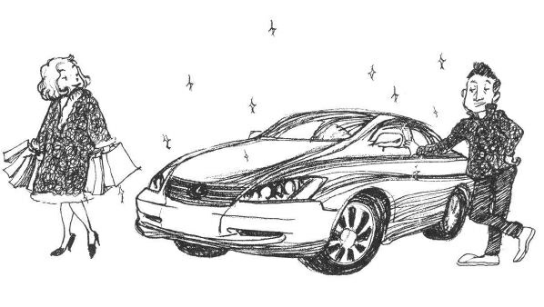
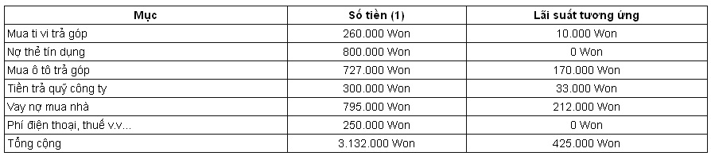
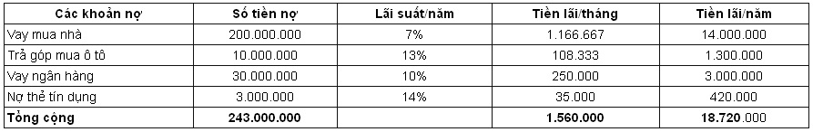
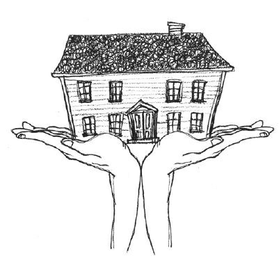
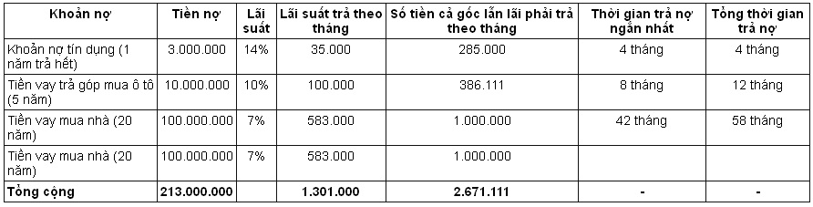
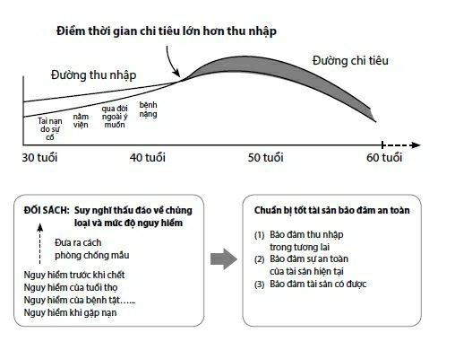
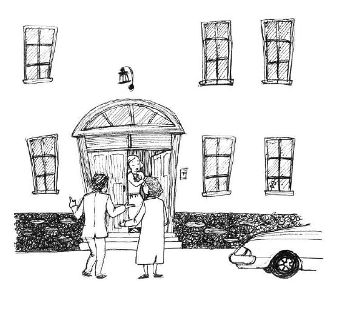
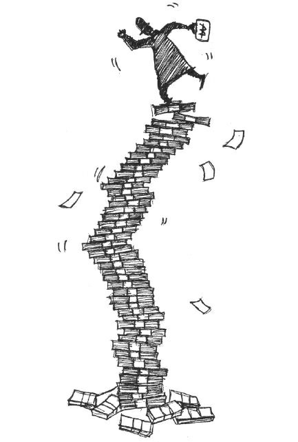

# Chương 3: Làm thế nào để nhận thức rõ hiện thực và từng bước vượt qua trở ngại?

## Song Huiseong phá sản

Sắp hết giờ làm, điện thoại của Choe Socheon đổ chuông liên hồi, đó là Do Jihae, chủ nhiệm câu lạc bộ Lướt sóng. Choe Socheon do dự không biết có nên nghe hay không. Từ sau lần gặp Giáo sư Masu, anh đã giảm hẳn những khoản chi tiêu không cần thiết, cho nên đã mấy tháng anh không tham gia hoạt động của câu lạc bộ. O Junbi đang đau đầu vì chuyện thu hồi nhà, cho nên hai người họ đã vắng mặt trong mấy buổi sinh hoạt. Nếu là trước kia, bất kể câu lạc bộ có hoạt động gì, họ đều tham gia đầy đủ, nhưng bây giờ đã khác. Chuông điện thoại vẫn đổ dồn, anh đành cầm điện thoại lên ấn nút nghe.

“Em Do Jihae đây, sao anh không nghe điện thoại?”

“Xin lỗi, tôi đang bận việc, có chuyện gì sao?”

“Anh Huiseong đang nằm viện.”

“Sao cơ?”

Anh cứ nghĩ Do Jihae gọi điện nhắc anh tham gia buổi sinh hoạt sắp tới, nên trong đầu anh đang nghĩ lí do để từ chối, không ngờ lại nhận được tin Song Huiseong nằm viện.

“Nghe nói là ung thư phổi.”

“Sao lại thế được? Sức khỏe anh ấy tốt như vậy cơ mà, lần trước gặp nhau anh ấy vẫn vui vẻ cơ mà, sao lại bị ung thư phổi được…”

Choe Socheon không tin nổi Song Huiseong bị ung thư phổi, mấy tháng trước anh ấy còn lướt sóng rất khỏe cơ mà.

“Đúng là vậy, nhưng ung thư phổi rất khó phát hiện ở giai đoạn đầu, thường là khi phát hiện ra đã qua mất thời điểm điều trị lý tưởng.”

Do Jihae đề nghị hội viên của câu lạc bộ cùng nhau đi thăm Song Huiseong. Tuy đã hết giờ làm nhưng Choe Socheon vẫn chưa xong việc, vì trung tâm chăm sóc khách hàng ở Busan tháng 11 tới sẽ chuyển địa điểm, nên có rất nhiều điện thoại gọi tới, xem ra anh sẽ đến chỗ hẹn muộn.

Vừa xong việc, Choe Socheon vội vàng tới bệnh viện, những người khác đã thăm hỏi xong, đang chuẩn bị về, Choe Socheon chào hỏi những người bạn đã lâu không gặp, sau đó đi vào phòng bệnh, thấy Song Huiseong đã ngủ, vợ ông đang ngồi bên giường bệnh, thấy Choe Socheon vội nói: “Hôm nay nhiều người đến thăm quá, anh ấy hơi mệt.”

“Vất vả cho chị quá, anh ấy khỏe như vậy sao lại bị ung thư phổi được, anh ấy nhất định sẽ khỏe lại.”

Câu nói của Choe Socheon phảng phất chút lo lắng.

“Đã sang giai đoạn ba rồi, khối ung thư bắt đầu di căn, bác sĩ nói phải kết hợp phẫu thuật và hóa trị…”

Vợ Song Huiseong nghẹn ngào nói, Choe Socheon khuyên chị nên ăn uống một chút, còn anh ngồi bên cạnh nhìn tấm thân gầy mòn của Song Huiseong, lòng anh nhói đau.

Rất lâu sau đó, Song Huiseong động đậy, anh ta mở mắt nhìn thấy Choe Socheon ngồi bên cạnh và thều thào hỏi:

“Cậu đến rồi à?”

“Anh, anh sao vậy?”

Choe Socheon cầm lấy tay Song Huiseong, ân cần hỏi thăm.

“Bây giờ không có gì quan trọng nữa rồi, cậu bận như vậy mà vẫn dành thời gian đến thăm, tôi thật ngại quá.”

“Anh đừng khách sáo, em đến thăm anh là chuyện đương nhiên mà.”

“Dù sao đi nữa cũng cảm ơn cậu.”

Song Huiseong định ngồi dậy.

“Anh đừng ngồi dậy, cứ nằm cũng được.”

“Không sao, nằm cả ngày rồi, cũng mỏi người, cậu đỡ tôi dậy.”

Choe Socheon đỡ lưng Song Huiseong để anh ta ngồi dậy.

“Bây giờ thoải mái hơn rồi.”

“Phẫu thuật xong là ổn thôi, anh nên cai thuốc lá đi, mọi người trong câu lạc bộ cũng hút nhiều quá.”

Choe Socheon khuyên Song Huiseong nên lạc quan.

“Khỏe rồi thì có thể làm gì được nữa? Nhà tôi có còn là cái nhà nữa đâu.”

Khuôn mặt Song Huiseong xanh xao, anh nói một câu bâng quơ.

“Sao anh lại nói vậy, vợ chồng anh có gì phải lo lắng đâu, hai người là thần tượng của giới công chức bọn em, vợ chồng hòa thuận, con cái ngoan ngoãn, anh nói sao ấy chứ.”

Choe Socheon chưa nói hết câu, Song Huiseong đã thở dài, anh nhìn ra cửa sổ, rồi bắt đầu kể câu chuyện của mình.

***

Song Huiseong làm việc cho một công ty thiết kế nước ngoài, vợ anh No Mili làm việc trong một công ty lớn, tuy còn trẻ nhưng hai người đã có mức lương rất cao, họ được bạn bè vô cùng ngưỡng mộ. Sau khi kết hôn không lâu, họ mua một chiếc ô tô hạng trung, tuy chiếc xe hơi vượt quá khả năng của họ, nhưng họ lại quan tâm đến ánh mắt ngưỡng mộ của mọi người hơn. Cứ như vậy họ có một cuộc sống tân hôn hạnh phúc, sau khi có hai đứa con, họ càng làm việc chăm chỉ hơn.

“Anh à, con chúng ta cũng lớn rồi, em muốn đổi một căn nhà rộng hơn anh thấy thế nào? Các con cũng cần có phòng riêng.”

“Anh thấy bây giờ giá nhà đất đang lên, nếu muốn đổi nhà rộng hơn thì phải vay ngân hàng.”

Song Huiseong và No Mili suy nghĩ hồi lâu, cuối cùng họ quyết định vay tiền đổi một căn nhà lớn hơn.

“Cứ quyết vậy đi, nhà đất càng ngày càng lên cao, trước sau anh cũng dự định mua nhà, đây cũng là một cách đầu tư.”

Sau khi chuyển nhà, No Mili lại gợi ý chồng trang hoàng thêm một số nội thất cao cấp cho căn nhà.

“Đồ dùng nhà mình đã 5 năm rồi, em rất muốn có một cái bàn ăn kiểu dáng châu Âu sang trọng để uống café, anh ngồi trên chiếc ghế sofa bằng da thật đọc báo, chắc chắn sẽ rất đẹp đấy.”

“Thôi được, dù sao cũng đã vay ngân hàng rồi, trang trí nhà như thế nào là do em quyết, nhân dịp này anh cũng muốn đổi chiếc xe lớn hơn một chút, đàn ông thì phải có xe đẹp mới được mọi người đánh giá cao, phải không nào?”

No Mili vô cùng vui mừng trước ý tưởng của chồng, rồi khoác tay Song Huiseong đi mua sắm.

“Cảm giác như mình trở thành người giàu có vậy, thật là thích, anh thật là giỏi.”

Sau khi mua đồ điện và đồ gia dụng xong, trên đường về No Mili nói chuyện với chồng, khuôn mặt lộ rõ vẻ hạnh phúc, nhìn vợ vui vẻ như vậy, Song Huiseong nói anh còn phải mở thêm vài tấm thẻ tín dụng, để sắm hết một loạt đồ mới.

Sau đó, họ bận rộn với việc tiếp đãi bạn bè đến thăm nhà mới, khi mọi người nhìn họ với ánh mắt ngưỡng mộ, họ càng thấy hạnh phúc hơn, trong mắt mọi người họ rất đẹp đôi. Để làm đẹp thêm cho cuộc sống của mình, họ mua toàn đồ xịn, thậm chí họ còn thích mua hàng qua mạng và qua truyền hình, mọi người đều vô cùng ngạc nhiên trước những gì họ chi tiêu, họ được mệnh danh là “đôi vợ chồng vừa thành đạt vừa hạnh phúc”.

Nhưng cuộc sống hạnh phúc đó không kéo dài được bao lâu, những khoản nợ, khoản trả góp và tiền nợ thẻ tín dụng mà họ đã vay để tô vẽ cho hình tượng giàu sang của mình đều đồng loạt đến hạn. Nhưng ngôi nhà họ mua không hề tăng giá, điều này làm họ vô cùng lo lắng.

“Anh à, mình phải làm sao bây giờ, hôm nay ngân hàng gọi đến thông báo đã đến hạn phải trả tiền, chúng ta phải trả một phần nợ gốc, anh còn khoản tiết kiệm nào không?”

“Anh đào đâu ra tiền tiết kiệm nữa, chúng ta cứ trông mong giá nhà sẽ tăng, nên đã vung tay quá trán.”

Song Huiseong không nói thêm nữa, vợ anh biết rõ rằng tiền lương của họ không thể đủ chi trả những khoản nợ và chi tiêu đó, lại còn hỏi anh còn tiền tiết kiệm không, điều đó khiến anh hơi bực mình.

Bàn bạc một lúc, họ quyết định rút tiền nghỉ hưu ra để dùng tạm, nhưng mọi việc chưa kết thúc ở đó.

“Anh ơi, anh giúp em đi, chồng em đang vô cùng nguy cấp, anh hãy giúp em lần này đi, được không?”

Em gái của Song Huiseong muốn nhờ anh giúp việc bảo lãnh vay nợ cho công ty của chồng cô ấy. Ba năm trước, chồng của em gái anh bỏ việc cơ quan bắt đầu kinh doanh, vì cô nài nỉ nhiều quá, nên Song Huiseong đã giấu vợ cho cô ấy vay 50.000.000 Won. Mọi việc vẫn chưa chấm dứt, cô ấy lại đến gặp anh vì chuyện bảo lãnh nữa.

“Anh cũng đang khó khăn lắm, lần trước anh đã giấu chị cho em vay 50.000.000 Won, anh đã khổ lắm rồi, lần này lại bảo anh bảo lãnh là thế nào?”

“Anh ơi, em không nhờ anh thì còn biết nhờ ai? Anh tốt nghiệp trường đại học nổi tiếng, có công việc tốt, có một cuộc sống khiến mọi người ngưỡng mộ, nên em chỉ biết tìm anh thôi, đây là lần cuối cùng, không có lần sau nữa đâu, có được không? Anh…”

Nhìn ánh mặt cầu xin của em gái, Song Huiseong động lòng, suy nghĩ mấy ngày trời, anh lại giấu vợ đóng dấu vào thư bảo lãnh.

Mấy ngày sau…

“Anh à, thế này là thế nào?”

No Mili gọi điện cho Song Huiseong lúc anh đang làm việc ở công ty.

“Sao thế, có chuyện gì vậy?”

No Mili kiểm tra tài khoản thấy tiền lương ít đi một nửa, nên gọi điện thoại hỏi xem việc viết thư bảo lãnh cho em gái có vấn đề gì không, vừa nghe đến đó, Song Huiseong nổi giận. Mấy hôm trước anh đã nhận được rất nhiều thông báo trả nợ, No Mili phát hiện ra chồng giấu cô bảo lãnh cho chồng của em gái, hai người đã cãi nhau một trận. Song Huiseong bảo cô không cần quan tâm đến việc đó nữa, cứ để anh tự giải quyết, rồi anh cúp máy, anh thắc mắc không biết thư bảo đảm anh viết có vấn đề gì không.

Song Huiseong vội vàng gọi điện cho em gái, nhưng điện thoại của cô tắt máy, gọi đến nhà không có ai nghe máy, cũng không gọi được cho chồng cô ấy.

“Mấy cái đứa này!”

Không liên lạc được với họ nên Song Huiseong càng tức giận hơn, nhưng cũng không còn cách nào khác. Anh liền đến phòng tài vụ, tìm hiểu nguyên nhân tiền lương của anh bị trừ, đúng lúc trưởng phòng Jin đang ở đó.

“Cậu không đến thì tôi cũng định qua tìm cậu, tôi nhận được thông báo lương của anh bị trừ rồi, nguyên nhân thì không rõ, anh phải cẩn thận nhé…”

“Sao lại như vậy, trước khi trừ cũng không có thông báo gì cả, sao lại đột ngột như vậy?”

Cuối cùng Song Huiseong cũng biết đến cái cảnh bị thúc nợ khổ sở như thế nào, đúng là chó cắn áo rách. Trưởng phòng Jin nói nhận được chỉ thị của công ty, phải báo cáo lại với cấp trên những khoản tín dụng cá nhân, nhất là những khoản liên quan đến tài chính, những người đó sẽ bị đưa vào danh sách quản lý đặc biệt của phòng nhân sự, việc giám sát nhân sự đối với những người đó sẽ nghiêm ngặt hơn để đề phòng khi tài chính bất ổn họ tham ô công quỹ.

Không biết được nguyên nhân, Song Huiseong đi ra ngoài tòa nhà châm một điếu thuốc, việc bảo lãnh vốn đã làm anh rất đau đầu, không ngờ khi anh rút tiền nghỉ hưu thì tiền lương lại bị trừ, gây ảnh hưởng không tốt với công ty, sau này ấn tượng với phòng nhân sự cũng sẽ không được tốt.

Một loạt sự cố xảy ra làm cho Song Huiseong bị sốc, anh thấy đau thắt trong lồng ngực, tiếp theo đó là một cơn ho dữ dội. Dạo này anh thường xuyên bị ho, anh chỉ nghĩ đơn giản là anh bị cảm do chuyển mùa, nhưng hôm nay lại bị đau thắt lồng ngực nữa.

Sau đó anh tới bệnh viện để lấy thuốc cảm, bác sĩ khuyên anh nên kiểm tra sức khỏe, không ngờ kết quả cuối cùng lại cho thấy anh có thể đã bị ung thư phổi, Song Huiseong được chuyển đến bệnh viện lớn.

***

Song Huiseong không nói được nữa, anh bắt đầu thở gấp.

“Anh à, anh mệt rồi đừng nói nữa.”

“Không sao, lấy cho tôi một chút nước…”

Choe Socheon rót một cốc nước đưa cho Song Huiseong.

“Cậu có biết nằm viện thế này tôi buồn nhất là chuyện gì không? Tuy tôi chỉ đau đớn về thể xác, nó cũng sẽ chấm dứt sớm thôi, nhưng gia đình tôi thì còn đau khổ rất lâu nữa, tôi chẳng để lại cho họ được thứ gì, cứ nghĩ vợ con tôi tay trắng đối mặt với thế giới khốc liệt này, thì nỗi đau thể xác của tôi chẳng thấm tháp vào đâu, cậu đừng có sống như tôi nhé.”

Song Huiseong nói cũng khó khăn, nhưng anh vẫn muốn kể bài học đời mình cho mọi người. Ra khỏi phòng bệnh, tinh thần Choe Socheon trùng hẳn xuống, anh thấy mình với Song Huiseong chẳng khác gì nhau, tuy anh không mê hàng hiệu như vợ chồng Song Huiseong, cũng không thích mua hàng trên mạng và qua truyền hình như Song Huiseong, nhưng nội thất trong nhà và chiếc xe việt dã của anh cũng để lại gánh nặng không nhỏ, bản thân anh cũng đang đi theo vết xe đổ của Song Huiseong. Một cảm giác bất an bao trùm lên Choe Socheon.

Choe Socheon đi về phía thang máy, anh thấy No Mili đang ngồi thần người ở cuối hành lang, anh thấy mình nên chào chị ta, nên anh đi lại phía đó.

“Chị vất vả quá, anh ấy nhất định sẽ khỏe lại, nếu tôi giúp được gì thì chị cứ nói.”

Choe Socheon biết rằng nếu anh tỏ ra mình có biết về chuyện bảo lãnh thì No Mili sẽ càng đau buồn hơn, nên anh chỉ chào hỏi qua loa.

“Lần này thì xong rồi, mọi người đều có bảo hiểm, anh ấy thì chẳng có gì, làm sao bây giờ?”

Giọng chị ta nghẹn ngào, thực sự trong lúc này Song Huiseong cần nhất là bảo hiểm y tế để chi trả viện phí.

“Anh ấy không có bảo hiểm y tế sao?”

“Chỉ có bảo hiểm trọn đời loại 50.000 Won một tháng thôi, nhân viên tư vấn có khuyên anh ấy nên mua một loại bảo hiểm y tế, nhưng anh ấy nói mình không có bệnh tật gì, bỏ tiền mua bảo hiểm thì lãng phí, nên không để ý đến chuyện đó, sau đó tôi cũng thôi không nhắc đến chuyện bảo hiểm nữa, nhưng ai ngờ lại xảy ra việc này, bây giờ có hối hận cũng không kịp nữa.”

Nước mắt chị rơi lã chã.

Choe Socheon không biết phải an ủi chị thế nào cho phải, đành ái ngại đứng nhìn.

“Chẳng may mình cũng mắc bệnh như Huiseong thì tất cả các khoản nợ sẽ dồn hết lên đầu vợ con mình sao?”

## Hình thức trả góp không lý tưởng như

## bạn nghĩ

Cả đêm Choe Socheon dường như không ngủ được vì anh lo lắng cho Song Huiseong và cho cả tương lai của mình. Anh đến công ty sớm hơn một tiếng đồng hồ và gặp Jang Myeong Kyeong ở cầu thang máy.

“Trưởng phòng Jang, anh đến sớm thật đấy!”

“Chào cậu, sao hôm nay cậu đi làm sớm vậy?”

Jang Myeong Kyeong nhìn Choe Socheon với ánh mắt đầy vẻ hoài nghi.

“À, tôi tỉnh giấc sớm quá nên dậy đi làm luôn, anh ngày nào cũng đến sớm vậy à.”

“Ngày nào tôi cũng đến công ty vào giờ này, đi làm sớm một chút thì nhận lương của công ty sẽ thanh thản hơn, phải không?”

“Đúng là như vậy.”

Sợ trưởng phòng Jang sẽ chỉ trích mình 9 giờ mới vào văn phòng, nên Choe Socheon vờ như không nghe thấy lời mời uống café của trưởng phòng, đi thẳng vào văn phòng, theo thường lệ anh bật máy tính xem tin tức, một bài báo làm anh chú ý.

*Ở nước ta, chi tiêu bằng thẻ tín dụng đã tăng từ 162.000 tỉ Won* *năm 2003 lên 250.000 tỉ Won năm 2007, trong khoảng thời gian* *4 năm tăng đến hơn 50%. Số nợ trả góp mua ô tô cũng tăng từ* *hơn 3.200 tỉ Won năm 2000 lên hơn 6.400 tỉ Won năm 2006. Số* *nợ đặt cọc mua nhà cuối năm 2004 lên đến 169.800 tỉ Won, đến* *cuối năm 2007 đã lên đến 217.000 tỉ Won, tăng 47.200 tỉ Won.*

“Thẻ tín dụng, ô tô trả góp, vay nợ mua nhà… những khoản đó đều liên quan đến mình.”

Nhìn những số liệu thống kê trước mặt, Choe Socheon thở dài thườn thượt.

“Sao vậy, còn trẻ mà sao đã thở dài như vậy?”

Trưởng phòng Jang đem một cốc café tới.

“À, không có gì, tôi đang đọc một bài báo…”

Sau khi xem qua một loạt tin tức, trưởng phòng Jang kéo một chiếc ghế lại, ngồi xuống.

“Dạo này sao trông cậu ủ rũ thế, có chuyện gì buồn à?”

Trưởng phòng Jang hỏi với giọng điệu phỏng đoán.

“Cũng không có gì đâu ạ…”

Choe Socheon kể chuyện của Song Huiseong cho anh ấy nghe.

### Lạm dụng thẻ tín dụng - Hậu quả sẽ giống

### như say rượu lái xe

“Theo lời kể của cậu thì người bạn đó rắc rối to rồi, anh ấy đã bị mê hoặc bởi quan niệm mua sắm đang lưu hành trong xã hội hiện nay. Hiện nay trong xã hội xuất hiện một số người trẻ tuổi bị gọi là “chưa hết tháng đã hết tiền”, đến cuối tháng tiền lương của họ đều đã được tiêu hết, mà xã hội lại đang cổ súy cho quan niệm mua sắm “Đời người chỉ có một lần, đừng để phải hối tiếc”. Một số người theo số đông đã không suy tính đến lãi suất của những khoản nợ thẻ tín dụng, thích vay nợ để tiêu xài, mua ô tô bằng phương thức trả góp định kỳ hay là thuê mượn, bản thân họ không có tiền tiết kiệm nên khi thiếu tiền họ sẽ ngập trong vũng bùn kinh tế, cuối cùng chính tiền đã lấy đi cuộc sống của họ.”

“Vay nợ để tiêu xài là vô cùng sai lầm, nhưng thẻ tín dụng cũng có dịch vụ trả góp định kỳ không lãi suất, nó giúp chúng ta không phải cầm nhiều tiền mặt, như vậy chẳng phải tốt hơn sao?”

Choe Socheon còn nhớ trong một buổi liên hoan của công ty, trưởng phòng Jang đã nói anh chưa từng mở một tấm thẻ tín dụng nào.

“Dùng thẻ tín dụng để chi tiêu vượt quá khả năng của mình cũng giống như say rượu lái xe, vô cùng nguy hiểm, bởi vì tiền không qua tay mình, nên rất khó khống chế mong muốn mua sắm của bản thân. Nghiêm túc mà nói, mua hàng bằng thẻ tín dụng là một hình thức vay nợ, cũng như anh đã nói, hình thức trả góp định kỳ không lãi suất nghe có vẻ như ta được lợi, nhưng nó lại cổ vũ cho việc mua sắm vượt khả năng, cuối cùng cuộc sống của chúng ta đều đã bị mang ra thế chấp hết.”

Lời của trưởng phòng Jang làm Choe Socheon nhớ đến chiếc máy tập chạy anh mua trả góp mấy tháng trước. Anh chọn cách trả góp trong 10 tháng, nên bây giờ vẫn chưa trả hết, mỗi lần thấy thông báo trả tiền, vợ anh lại không tiếc lời kêu ca, trách móc anh sao không tập ở phòng thể dục của khu nhà, lại thích mua máy về cho tốn kém.

“Mua túi hàng hiệu, đi du lịch nước ngoài bằng hình thức trả góp, hay chi tiêu vượt quá khả năng chi trả của mình, không chỉ có bạn anh thích như vậy đâu, xung quanh chúng ta có rất nhiều người như thế. Khi chưa có đủ khả năng mà có được thứ mình muốn, đấy chính là sai lầm của xã hội chúng ta, nó tạo ra một nhóm người ỷ lại vào chi tiêu trả góp, chỉ riêng số nợ đó đã là một con số rất lớn, khi những khoản nợ đó sinh lời, thì nó sẽ tăng với tốc độ chóng mặt, và kết quả là con người trở thành nô lệ của đồng tiền, rất khó có cơ hội ngóc đầu lên được.”

Nghe trưởng phòng Jang nói, Choe Socheon lại thở dài.

“Tôi cho cậu xem thứ này.”

Trưởng phòng Jang về bàn làm việc của mình, lấy một tập tài liệu đến bàn của Choe Socheon.

“Cậu xem cái này đi, đây là những bài báo tôi đã thu thập được.”

Trưởng phòng Jang mở tập tài liệu, các tin tức được anh cắt và dán ngay ngắn, đó là những bài báo về kinh tế, trưởng phòng Jang giở một bài đưa cho Choe Socheon xem.

Cứ mỗi tháng đến ngày nhận lương là Li Daekang sống ở Seoul vô cùng đau khổ. Anh làm việc trong một doanh nghiệp lớn đã được 10 năm, trừ tiền thưởng thì thu nhập mỗi tháng của anh là 3.500.000 Won, nhưng anh nói mình đang sống một “cuộc sống trả góp”, sau khi trừ đầu trừ đuôi, tiền lương mỗi tháng của anh chỉ còn lại 300.000-400.000 Won.

Đầu tiên là khoản nợ thẻ tín dụng 1.060.000 Won, 800.000 Won là khoản trừ cho trung tâm thương mại và phí xăng dầu, còn lại 260.000 Won là tiền mua trả góp chiếc ti vi LCD 42 inches. Hồi tháng 5, anh đã mua chiếc ti vi đó với giá 1.500.000 Won, chi trả bằng hình thức trả góp trong 6 tháng. Anh Li nói: “Lúc đó chiếc giường tôi mua trả góp trong 10 tháng vừa trả hết, lại thấy cái ti vi đời cũ mua từ 7 năm trước chất lượng hình ảnh xấu quá, nên tôi muốn mua một cái mới, có một trung tâm thương mại đưa ra mức giá rẻ bất ngờ, nên tôi đã quyết định mua. Anh Li trả 700.000 Won cho lần đầu, còn lại 800.000 Won sẽ trả góp, theo quy định trả góp, lần sau nếu trả bằng thẻ tín dụng thì anh sẽ bị tính lãi, nếu trả góp trong 6 tháng thì số lãi là 59.000 Won, nếu trả bằng tiền mặt hoặc trả hết một lần, giá chiếc ti vi là 1.500.000 Won, nhưng nếu trả góp thì sẽ phải trả 1.559.000 Won.

Trừ những khoản nợ thẻ tín dụng đi, những khoản chi tiêu cố định cũng khá nhiều, năm ngoái anh dùng thẻ tín dụng Sam Sung mua trả góp chiếc xe ô tô giá 20.000.000 Won trong vòng 36 tháng, mỗi tháng số tiền cả gốc lẫn lãi phải trả là 727.000 Won, trong đó tổng số lãi suất lên đến 170.000 Won.

Hai năm trước anh vay của công ty 10.000.000 Won với mục đích làm tiền sinh hoạt, mỗi tháng lương của anh bị trừ thêm 300.000 Won, lãi suất mỗi tháng là 33.000 Won. 4 năm trước, anh đã vay của ngân hàng 70.000.000 Won để mua nhà, mỗi tháng phải trả 795.000 Won cả vốn lẫn lãi, trong đó lãi là 20.000.000 Won, đó đã là lãi suất thấp nhất tại thời điểm vay.

Ngoài ra, anh còn phải trả tiền điện thoại di động, điện thoại cố định, tiền điện, tiền gas, tháng trước tiền lương của anh chỉ còn 370.000 Won. Anh Li phàn nàn: “Cứ mỗi lần đổi xe, giường, ti vi, ghế sofa là lại thiếu tiền, đành phải mua bằng hình thức trả góp.” “Bây giờ không mua trả góp thì không biết sống thế nào...”

**BẢNG CHI TIÊU CỤ THỂ TRONG THÁNG 8 CỦA LI** **DAEKANG**

*Nhật báo kinh tế số ra ngày 13 tháng 10 năm 2007*

“Thế nào, nhìn những con số đó cậu có thấy choáng váng không? Trên thực tế có rất nhiều người có tình hình tài chính giống như trong bài báo.”

Trưởng phòng Jang nói ngay cả người có thu nhập lên đến 5.000.000 Won cũng phải sống cho qua ngày để trả nợ, lúc ngoài 20 tuổi thì ham chơi và đua đòi hàng hiệu, đến 30 tuổi lại muốn mua nhà, 40 tuổi lại lo tiền học cho con, tất cả những khoản đó làm cho chúng ta phải tìm đến hình thức trả góp hoặc vay nợ.

“Chúng ta phải hết sức cảnh giác với quan niệm chi tiêu ngoài khả năng này, vì số tiền chúng ta tiêu trong một giờ lớn hơn số tiền chúng ta kiếm ra rất nhiều lần. Từ khi có hình thức trả góp, những phụ nữ ở tầng lớp trung lưu thích hư vinh giấu chồng mua vàng bạc trang sức và những đồ xa xỉ khác, chồng họ thì cắn răng mua xe nhập khẩu, từ lúc họ đưa ra những quyết định ấy, cuộc sống của họ đã bị trói chặt với những khoản nợ rồi.”

Tuy không mua vàng bạc và xe nhập khẩu nhưng chi tiêu của Choe Socheon rõ ràng đã vượt quá khả năng chi trả của anh, nhớ lại lần nói chuyện với Giáo sư Masu, khi phát hiện ra tài sản cố định của mình chỉ còn 63.000.000 Won, anh đã suýt ngất. Trong lòng anh lại cảm thấy bất an, nhưng lần này không phải vì Song Huiseong nữa.

## Nợ nần là kẻ thù lớn nhất của cuộc

## sống

Hẹn gặp Giáo sư Masu không đơn giản như anh nghĩ. Giáo sư là giám đốc điều hành khu vực châu Á nên phải thường xuyên đi lại giữa Nhật Bản và Hồng Kông, rất ít khi rảnh rỗi. Choe Socheon bắt đầu lo lắng, làm thế nào anh cũng phải gặp được Giáo sư Masu, để nghe phương án cụ thể của Giáo sư. Sau 10 lần liên lạc với thư ký của Giáo sư, anh cũng có được một cơ hội gặp mặt. Do đang trong giờ làm việc, không được bỏ vị trí, nên anh lấy lý do con ốm để rời khỏi công ty sớm, anh chạy như bay đến văn phòng của Giáo sư Masu.

Choe Socheon kể cho Giáo sư Masu câu chuyện của Song Huiseong, nói rằng mình đã ngộ ra được nhiều điều từ câu chuyện ấy.

“Thưa Giáo sư, vậy bây giờ em nên giải quyết vấn đề tài chính của mình như thế nào ạ?”

Choe Socheon vô cùng nóng ruột, nhưng Giáo sư Masu lại rất bình thản, ông vỗ vai Choe Socheon.

“Đáp án rất đơn giản, đó là giải quyết các khoản nợ. Nhưng trước khi giải quyết các khoản nợ phải làm một việc, đó là để không làm nảy sinh nợ mới, phải bịt lỗ thủng lại, phải kiềm chế mong muốn mua sắm ngay cả khi phải mang nợ, để làm được điều này cần phải có tri thức và kỹ xảo. Vì vậy, bước tiếp theo cậu phải làm là tìm hiểu tình hình nợ của mình, sau đó trả từng khoản một, tôi đã từng gặp rất nhiều người sau khi trả hết nợ đã trở nên giàu có. Suy cho cùng, cái gốc của quản lý chi tiêu là ở “thanh toán các khoản nợ trong thời gian ngắn nhất và không làm nảy sinh nợ mới”. Nếu cậu không muốn trở thành nô lệ của đồng tiền thì trước hết phải nhận thức được một điều, cậu phải chịu trách nhiệm về các vấn đề tài chính do mình gây ra, chứ không phải đổ lỗi cho người khác. Sau này cậu không phải nghĩ gì cả, chỉ cần dốc toàn lực trả nợ thôi.”

“Điều đó không đơn giản chút nào.”

Cái gốc của quản lý chi tiêu là ở “thanh toán các khoản nợ trong khoảng thời gian ngắn nhất và không làm nảy sinh nợ mới”, Choe Socheon hoàn toàn đồng ý với câu nói ấy, nhưng anh không biết làm thế nào để bắt tay vào thanh toán các khoản nợ.

“Ban đầu mọi người đều không biết phải làm thế nào, thế này nhé, cậu hãy tìm hiểu xem các khoản nợ mang lại bao nhiêu rắc rối cho cậu.”

Giáo sư Masu bật máy tính xách tay rồi xoay về hướng Choe Socheon.

“Đây là bảng danh sách các khoản nợ của cậu, lần trước cậu đã viết ra, cậu sướng hơn cha mẹ của mình ở chỗ cậu dễ dàng có được nhà và xe, và dễ dàng vay tiền ngân hàng, nhưng cuộc sống này không có bữa trưa miễn phí, mỗi tháng cậu phải trả 1.560.000 Won cho chủ nợ, một năm là hơn 18.720.000 Won, lương một năm của cậu là bao nhiêu?”

“Khoảng 50.000.000 Won, à còn bị trừ thuế, chỉ còn khoảng 42.000.000 Won thôi ạ.”

“Nếu như vậy, không tính nợ gốc, chỉ riêng tiền lãi đã chiếm 45% thu nhập một năm của cậu, nếu trả nợ gốc trong 10 năm, mỗi năm phải trả 24.000.000 Won, như vậy cả vốn lẫn lãi thì tiền lương của cậu không đủ để trả, chỉ nghĩ đến đó thôi đã nản rồi. Nếu muốn thành công trong quản lý chi tiêu, vũ khí mạnh nhất của chúng ta là tiền lương, nhưng giờ đây vũ khí đó của cậu không đủ mạnh để chiến thắng khoản nợ này rồi.”

*(Đơn vị: Won)*

Choe Socheon không nói được gì, chỉ biết nhìn đăm đăm vào bảng thống kê trên màn hình.

“Đến đây, cậu có thể phân thích từng khoản nợ của mình, tại sao lại có khoản nợ này, trong khoản nợ đó tiềm ẩn nguy cơ gì, nếu cậu không làm rõ được điều đó, cho dù có trả hết nợ, thì rồi cậu vẫn sẽ rơi vào khủng hoảng. Hiện nay cậu có tổng cộng bốn khoản nợ, đó là: khoản nợ mua nhà, trả góp mua ô tô, nợ ngân hàng và nợ thẻ tín dụng, đúng không?”

“Đúng vậy, nghe Giáo sư nói em mới phát hiện ra mình có nhiều khoản nợ đến vậy.”

Choe Socheon thấy mặt mình nóng rần rần. Thấy vậy, Giáo sư Masu bảo thư ký mang một tách trà tới, Choe Socheon uống xong tinh thần có ổn định hơn một chút.

### Vay nợ mua nhà: Nguyên tắc 30%

“Bây giờ chúng ta phân tích từng mục một, cậu thấy khoản “tiền vay mua nhà” như thế nào?”

Giáo sư Masu uống một ngụm nước lấy giọng rồi ngồi thẳng lại, bắt đầu nêu câu hỏi.

“Vay nợ tất nhiên không phải là việc tốt, nhưng với em, trong số các khoản nợ thì khoản này còn khá, bởi vì lấy nhà làm thế chấp, so với các loại hình tín dụng khác, lãi suất tương đối thấp.”

“Từ lúc đến đây tôi phát hiện ra mọi người rất thích nhà ở và bất động sản. Ở đây, tỉ lệ nắm giữ bất động sản và tiền tệ của cá nhân là 4:1, giá trị bất động sản gấp 4 lần tiền tệ, ở Mỹ tỉ lệ đó là 4:6, tiền tệ lớn hơn bất động sản rất nhiều, nhìn trên toàn thế giới thì tỉ lệ nắm giữ bất động sản của người Hàn Quốc là một trường hợp đặc biệt.”

“Vậy sao? Em cứ nghĩ rằng có một căn nhà là nhu cầu cơ bản của mọi người, nước nào cũng vậy… Em chưa bao giờ nghe đến điều này.”

Giáo sư Masu nói rằng quan niệm về nhà đất của người dân Hàn Quốc đã tạo ra cơn sốt bất động sản kéo dài suốt hơn 30 năm, có một căn nhà riêng là mục tiêu lớn nhất trong cuộc đời một người Hàn Quốc, vì vậy họ sẽ dốc hết thu nhập của mình vào đó, nhưng nhiều khi để trả nợ, họ lại không thể đầu tư vào các lĩnh vực khác.

“Nếu thị trường nhà đất Hàn Quốc bị trượt dốc, hoặc cậu bất ngờ bị mất việc làm, không có thu nhập, thì nguy cơ mà cậu phải đối mặt còn nghiêm trọng hơn bây giờ nhiều. Nếu hoàn cảnh bắt buộc, cậu không còn cách nào khác phải vay nợ thế chấp để mua nhà, thì cả vốn lẫn lãi phải trả mỗi tháng không được vượt quá 30% thu nhập mỗi tháng, phải ghi nhớ điều này, vay nợ vượt quá khả năng chi trả là điều nguy hiểm nhất. Với tiền lương bây giờ của cậu, trả tiền nhà hơi vất vả, đây là vấn đề bắt buộc phải giải quyết.”

Giáo sư Masu dùng bút đỏ khoanh tròn con số 1.166.667 Won là tiền lãi vay nợ mua nhà mỗi tháng.

“Con số này quả thật là đáng sợ, đây là sai lầm do nghĩ giá nhà sẽ lên cao, nếu giá nhà không những không tăng, mà lãi suất tăng, thì cậu sẽ phải chịu gánh nặng lớn đến thế nào.”

Trước đó mỗi tháng Choe Socheon phải trả 1.000.000 Won tiền lãi vay mua nhà, đây thực sự là một gánh nặng đối với anh, nhưng anh luôn tin rằng giá nhà đất sẽ tăng, lúc đó anh sẽ lời lớn, nhưng nghe Giáo sư Masu nói vậy, anh ý thức được mình đã tin vào việc giá nhà tăng một cách vô căn cứ, đó cũng là do anh quá lạc quan về tương lai của mình.

“Ha ha, có phải như vậy không? Giả thiết có một người cũng hy vọng giá nhà sẽ tăng, mua một căn nhà 300.000.000 Won, trong đó 100.000.000 Won là tiền của cậu ta, còn 200.000.000 Won là vay của ngân hàng, thì mỗi tháng cậu ta phải trả 1.000.000 Won tiền lãi. Nhưng cậu ta chỉ là một công chức bình thường, thu nhập mỗi tháng chỉ có tiền lương, trong hoàn cảnh phải trả lãi, thì anh ta không thể đầu tư được, nhưng nếu giá nhà đất lại trái với kỳ vọng của anh ta, sau 10 năm giảm 33% thì hậu quả sẽ như thế nào?”

Choe Socheon tỏ ra rất muốn biết hậu quả của việc đó, Giáo sư Masu viết một số “0” lên tờ giấy trắng.

“Không, nhà của anh ta biến thành một cái hộp sắt vụn, lúc đó giá trị của ngôi nhà là 200.000.000 Won, nhưng 200.000.000 Won đó là bằng với số nợ ngân hàng.”

“Thế thì thật là đáng sợ.”

Mặt Choe Socheon không chút biểu cảm.

“Xem ra cậu vẫn còn mơ hồ lắm, cậu có biết có một việc còn đáng sợ hơn nữa không? Mỗi tháng trả 1.000.000 Won tiền lãi, 10 năm sau cậu có biết là con số đó là bao nhiêu không? 120.000.000 Won! Nếu đầu tư tiền đó vào quỹ tiết kiệm với lãi suất 10%/năm thì sẽ được 200.000.000 Won, đáng ra nếu thao tác đúng sau 10 năm anh ta sẽ có 200.000.000 Won, nhưng thật đáng tiếc, cơ hội kiếm được 200.000.000 Won đã bốc hơi. Ở Hàn Quốc luôn tiềm ẩn nguy hiểm trong đầu tư bất động sản, vì vậy nếu đánh cược tất cả vào trong một ngôi nhà thì là điều không nên.”

### Huyễn hoặc và sai lầm

Vay nợ mua nhà là một cách đầu tư khá tốt, vì có thể dùng chính ngôi nhà đó làm vật thế chấp, lãi suất cũng tương đối thấp.

### Ý kiến của chuyên gia

Khoản vay mua nhà vượt quá khả năng chi trả của bạn sẽ làm cho tình hình tài chính của bạn trở nên bất ổn, cách làm chính xác là số tiền phải trả cả vốn lẫn lãi không được vượt quá 30% thu nhập của bạn. Nếu có thể, nhanh chóng trả hết khoản nợ đó trong một thời gian ngắn.

### Mua xe: Hãy suy nghĩ kỹ

“Tiếp theo là khoản mua xe trả góp. Lúc nãy cậu nói Song Huiseong đã sắm một chiếc xe hạng sang bằng hình thức thuê xe phải không, vậy cậu thấy hình thức trả góp định kỳ và thuê như thế nào?”

“Có lẽ suy nghĩ của em sẽ lại bị Giáo sư chỉ trích, theo em nghĩ nếu không dùng hình thức trả góp hoặc thuê thì một người dân thường như em không thể có xe xịn được, hơn nữa làm gì có ai trả hết tiền mua xe trong một lần?”

Choe Socheon thấy phấn chấn hẳn lên, anh thấy mình nói không có gì là sai cả.

“Tốt, cậu dám nói ra suy nghĩ thật của mình, điều này rất quan trọng, mục đích lần gặp mặt này của cậu cũng không phải là nói lời hay ý đẹp cho tôi nghe, thực ra trước kia tôi cũng nghĩ như cậu.”

“Hai năm trước em mua trả góp một chiếc xe, bây giờ vẫn còn nợ một khoản. Nhưng do gần đây lại có nhiều mẫu xe mới, nên em lại muốn đổi xe nữa, đúng lúc tiền lương được tăng 8%, tăng 4.000.000 Won so với trước, nên em đã hơi động lòng, nhưng vợ em một mực phản đối, nói xe vẫn tốt không việc gì phải đổi, em khuyên vợ em rằng bây giờ chiếc xe vẫn còn mới, bán đi vẫn còn được giá, nhưng đến nay vợ chồng em vẫn chưa thống nhất ý kiến, không hiểu sao vợ em lại bảo thủ thế.”

“Ha ha, thực ra vợ cậu đang muốn ngăn cản cậu rơi vào vòng xoáy nợ nần, trước đây tôi đã kể cho cậu nghe chuyện chiếc xe Corvette rồi nhỉ, tôi cũng là người thích ô tô, nhưng cứ nghĩ đến chuỗi ngày dài trả góp là tôi không muốn mua nữa, nếu không suy tính đến năng lực kinh tế của mình, mua xe trả góp hay thuê, thì chính hành động đó đã chặn đứng con đường làm giàu của cậu.”

“Thế nên em mới muốn đổi xe sau khi tiền lương đã được tăng lên 4.000.000 Won.”

Choe Socheon cho rằng khoản chi đó không hề vượt quá khả năng của anh, anh nhìn Giáo sư Masu với ánh mắt nghi hoặc.

“Cho dù là trả góp hay thuê xe cũng đều đem lại gánh nặng lớn cho tài chính gia đình, giả sử cậu vẫn chưa trả hết tiền mua chiếc xe cũ, lại dùng số tiền lương mới tăng đó để mua chiếc xe mới, tiền trả góp mỗi tháng là 400.000 Won, trả trong 60 tháng, chưa đến 3 năm cậu lại mua trả góp một chiếc xe mới nữa, thì số tiền trả góp đó sẽ ám ảnh cậu cả đời. Nếu từ năm 30 tuổi đến năm 60 tuổi, mỗi tháng phải trả 400.000 Won tiền mua xe, thì tương đương với việc mua một chiếc xe với giá 144.000.000 Won, nếu mỗi tháng trong cuộc đời đều phải trả 400.000 Won tiền mua xe thì cậu sẽ bỏ qua bao nhiêu cơ hội đầu tư, tiền đó nếu đầu tư vào quỹ tiết kiệm với lãi suất 10%/năm thì đến 60 tuổi cậu sẽ có trong tay 868.000.000 Won tiền dưỡng già…”

Mỗi tháng đầu tư 400.000 Won, thì số tiền trả trong 30 năm là 144.000.000 Won, nhưng điều kinh ngạc không chỉ dừng ở đó, nếu đầu tư số tiền đó vào quỹ tiết kiệm, thì số tiền thu được sẽ là hơn 800.000.000 Won.

“Một chiếc xe có thể làm tiêu tan số tiền 800.000.000 Won dưỡng già của cậu, cậu có đổi chiếc xe lấy số tiền dưỡng già của mình không? Ở Mỹ, nhiều người giàu mua xe tương ứng với tình hình tài chính của họ, và thời gian sử dụng xe rất lâu, đó chính là bí quyết thành công trong tài chính của họ.”

“Nghe Giáo sư nói em biết mình còn thiển cận lắm.”

Choe Socheon tuy cũng muốn biện minh, nhưng không tìm ra lý do nào thích hợp hơn.

### Huyễn hoặc và sai lầm

Mua xe trả góp hay thuê là một biện pháp tài chính giúp mọi người có được xe xịn với giá cả thấp nhất.

### Ý kiến của chuyên gia

Khi suy tính mua xe, những người giàu có thường chọn xe tương đương với tình hình tài chính của mình, và sử dụng trong thời gian dài, đây chính là bí quyết thành công của họ.

### Thanh toán tín dụng theo giai đoạn: Một cái

### bẫy

“Vậy thì tốt, tôi rất vui vì cậu đã tiếp thu ý kiến của tôi, còn khoản “nợ thẻ tín dụng” thì sao?

“Dạ.”

Vừa nhắc đến thẻ tín dụng, Choe Socheon lập tức nhớ đến “cuộc sống trả nợ” mà trưởng phòng Jang đã nói với anh, lần này anh rất muốn nghe xem Giáo sư Masu có cao kiến gì.

“Đầu tiên tôi muốn hỏi cậu, trả góp trong vòng 3 tháng không lãi suất có tốt hơn là trả tiền mặt một lần không?”

“Đương nhiên rồi, tiền mặt nằm trong tay chúng ta có thể sinh lãi.”

“Lãi là bao nhiêu? Vấn đề là ở chỗ công ty bán hàng sẽ làm cho cậu thấy bùi tai, và khuyến khích cậu mua những món không cần thiết, chiến lược kinh doanh của họ rất lợi hại, các công ty tín dụng thì không ngừng khuyến khích những người có khả năng chi tiêu hạn chế rằng hãy dùng tấm thẻ đó để hưởng thụ thú vui mua sắm, ăn uống, vui chơi đi, thế là một số người bị mê hoặc bởi những lời tuyên truyền đó, cứ đến cuối tuần là đến các trung tâm mua sắm, cho con học ở những trường lớn.”

“Nhưng dùng thẻ tín dụng có thể được hưởng ưu đãi giảm thuế, hơn nữa chương trình tích điểm của thẻ cũng được chiết khấu.”

Choe Socheon không tán hành việc lạm dụng thẻ tín dụng, nhưng anh muốn nói rằng nếu sử dụng đúng cách thì có thể được lợi từ thẻ tín dụng.

“Nếu một người chưa độc lập về mặt tài chính mà cho rằng dùng thẻ tín dụng để được chiết khấu thì rất nguy hiểm, ưu đãi đó cũng chỉ là chiêu bài của công ty phát hành thẻ tín dụng, lý do tồn tại duy nhất của thẻ tín dụng là ở mục đích tạo ra các khoản nợ, hãy thử nghĩ xem, nếu không có thẻ tín dụng, cậu có mua nhiều đồ như thế không, có nợ nần chồng chất như thế không? Chính vì có thẻ tín dụng đứng sau lưng yểm trợ nên khi đến trung tâm mua sắm chúng ta mới lãng phí như vậy.”

“Thầy nói vậy cũng đúng, vợ em bình thường tính toán rất chi li, nhưng cứ ra siêu thị là vội vàng nhặt đồ chất đầy vào xe… bởi vì mua vượt quá một số tiền nào đó sẽ được hưởng ưu đãi không lãi suất, cho nên thường mua đại những món đồ chưa dùng đến cho đủ số tiền.”

Choe Socheon định khi về nhà sẽ giảng giải cho vợ anh hiểu về những sai lầm khi dùng thẻ tín dụng.

“Những lần mua sắm như vậy tích lũy lại sẽ thành một món nợ lớn, đè nặng lên vai cậu, một khi có nợ thẻ tín dụng chúng ta sẽ mất tự tin đối với đồng tiền, có cuộc sống không có kế hoạch, cuối cùng chúng ta phải kiếm tiền bạt mạng để trả những khoản nợ và lãi đó, mơ nước của chúng ta thì ngày một xa dần.”

Giáo sư Masu nhấn mạnh, nếu chúng ta vay tiền để mua xe và đồ hiệu nhằm thỏa mãn ý thích của mình thì sau một thời gian, giá trị của xe và hàng hiệu sẽ mất đi, chỉ còn lại một khoản nợ, nó sẽ gặm nhấm dần tương lai của chúng ta.

Trong lúc Giáo sư Masu nói, mặt Choe Socheon càng ngày càng đỏ hơn, trước đây anh thấy việc chi tiêu vô độ của mình chỉ để lại một vài món nợ, nhưng không nghĩ là quan niệm chi tiêu của mình là sai lầm, điều duy nhất an ủi anh là anh đã tỉnh ngộ, sau này anh sẽ không sa vào bẫy của các công ty bán hàng nữa.

### Huyễn hoặc và sai lầm

Hình thức trả góp miễn lãi suất 3 tháng có lợi hơn dùng tiền mặt mua trực tiếp. Bởi lẽ tiền mặt có được có thể tạo ra nhiều lãi suất hơn.

### Ý kiến của chuyên gia

Hình thức trả góp miễn lãi suất 3 tháng chắc chắn không thể giúp bạn trở thành triệu phú, ngược lại, quan niệm này sẽ khiến bạn rơi vào cái bẫy tiêu dùng. Hơn nữa phần lớn những người sử dụng hình thức này do đều không thể trả hết nợ trong thời gian quy định nên để trả khoản nợ này sẽ lấy chỗ nọ đập chỗ kia, cuối cùng lại gánh thêm các khoản nợ khác.

### Hiệu ứng đòn bẩy của nợ nần: Rủi ro lớn hơn

### nhiều lợi ích

“Khoản nợ cuối cùng là khoản gì?”

“Dạ, đó là tiền vay ngân hàng ạ. Thực ra mục đích vay ngân hàng của em là để đầu tư cổ phiếu, số tiền này là 30.000.000 Won, với lãi suất là 3.000.000 Won/ năm. Nhưng nếu cổ phiếu có thể sinh lời 30% thì thu nhập từ đó sẽ là 9.000.000 Won, sau khi trả hết lãi suất vẫn còn 6.000.000 Won. Em làm vậy là do khoản tiền quay vòng khá căng nên lúc nào em cũng cảm thấy phải làm chút gì đó.”

Trước đó, do bán tháo quá sớm cổ phiếu Saengi Bulgasali, nên anh đã lỗ rất nhiều, giờ đây anh cũng bắt đầu nghi ngờ hình thức đầu tư này liệu có thông minh hay không.

“Điều cậu vừa nói chính là hiệu ứng đòn bẩy nợ nần. Đàn ông Hàn Quốc, đặc biệt là những người ở độ tuổi 30-40 thường giấu vợ con mở một tài khoản để chơi cổ phiếu, với mục đích là kiếm ít tiền tiêu vặt, nhưng nguyên tắc cơ bản nhất trong đầu tư cổ phiếu là phải sử dụng tiền nhàn rỗi, chứ không phải vay tiền để chơi. Vay tiền chơi cổ phiếu có thể khiến cậu nếm phải trái đắng, thậm chí nếu hơi bất cẩn sẽ ủ thành một cốc rượu đắng. Bề ngoài thì là “dùng tiền của người khác để kiếm tiền”, nhưng trên thực tế vay tiền để đầu tư sẽ gây ra tổn thất gấp đôi cho đầu tư và lãi suất. Nhìn chung những ví dụ thành công rất ít, nếu cậu không phải là nhà đầu tư chuyên nghiệp, biện pháp thông minh nhất chính là nhanh chóng kết thúc việc vay tiền chơi cổ phiếu này lại.”

“Cho dù Giáo sư không nói, thì bây giờ em cũng đã rất hối hận rồi ạ, bởi lẽ lấy tiền vay cộng với lãi suất để đầu tư khiến em rất lo lắng, điều này cũng ảnh hưởng đến kết quả phán đoán của bản thân em về thời cơ trong thị trường cổ phiếu.”

Choe Socheon đã đi ngược lại với nguyên tắc đầu tư “bắt buộc phải sử dụng nguồn tiền nhàn rỗi”, do đó anh đã phải trả một cái giá khá đắt.

### Huyễn hoặc và sai lầm

Lợi dụng hiệu ứng đòn bẩy nợ nần có thể giành được lợi nhuận cao trong thời gian ngắn.

### Ý kiến chuyên gia

Người vay trở thành nô lệ của người cho vay. Mức độ nguy hiểm của khoản nợ lớn hơn nhiều so với lợi ích có được trong hiệu ứng đòn bẩy nợ nần. Hãy vứt bỏ ý nghĩ ngu xuẩn “dùng tiền của người khác để kiếm tiền” đi, xin hãy ghi nhớ nguyên tắc đầu tư bắt buộc phải sử dụng tiền nhàn rỗi.

“Cậu nghĩ thế nào về bốn khoản nợ của mình?”

“Trước đây em thật sự không hiểu biết gì về nợ nần, những khoản nợ đó đã khiến cho tiền dưỡng già của em sau này tiêu tan hết, em cảm thấy đau quá thầy ạ!”

Giáo sư Masu nói rất đúng, mỗi tháng tiết kiệm 4000.000 Won, 30 năm sau bạn sẽ có thể có được 800.000.000 Won tiền dưỡng già. Nếu như lấy 400.000 Won đó dùng vào việc trả khoản lãi suất 1.560.000 Won mỗi tháng, 30 năm sau sẽ là một con số hết sức khả quan, một phép tính sơ sơ như vậy khiến Choe Socheon như một quả cầu xì hơi ngồi bẹp dí trên ghế.

“Cậu cũng đừng quá lo lắng, sau khi thanh toán hết nợ nần lại làm lại từ đầu, cậu vẫn còn có cơ hội để trở thành người có tiền.”

“Nhưng làm thế nào để trả hết những khoản nợ đó đây ạ? Đầu em hiện giờ trống rỗng, với tình trạng như hiện nay của em, muốn trong một thời gian ngắn thanh toán hết các khoản nợ nần quả là hết sức phi lý, tiền tiết kiệm thì không đủ để trả nợ, thầy có thể cho em một vài hướng đi cụ thể được không ạ?”

Thái độ của Choe Socheon rất thành khẩn, sự lo lắng thể hiện rõ trong đôi mắt anh.

## Xây dựng dự toán chi tiêu - Bước đầu

## tiên để trở thành người giàu có

Buổi nói chuyện giữa Choe Socheon và Giáo sư Masu dần trở nên thẳng thắn.

“Ha ha, đây cũng chính là nội dung tiếp theo mà tôi sẽ nói với cậu. Để trả nợ, trước hết phải giảm chi tiêu, chỉ nghĩ mà không làm thì không thể được. Đối với những người ngày hôm qua còn vui vẻ sung sướng sử dụng thẻ tín dụng để mua hàng, hôm nay phải thắt lưng buộc bụng để sống qua ngày, thực sự là một việc rất khó thực hiện, vì vậy chúng ta cần phải có sự chuẩn bị kỹ lưỡng, xây dựng một dự toán chi tiêu theo tháng cho gia đình.”

“Dự toán chi tiêu theo tháng ạ?”

Thu nhập và chi tiêu của gia đình cũng chỉ có mấy mục, đếm trên đầu ngón tay, Choe Socheon quả thực không thể hiểu nổi tại sao lại phải lập dự toán chi tiêu theo tháng.

“Đúng vậy, chúng ta chỉ lập dự toán theo tháng cho những khoản chi tiêu cần thiết, từ đó có thể bảo đảm được rằng các khoản chi của chúng ta sẽ nằm trong dự toán. Một dự toán tốt sẽ nhắc nhở chúng ta chi tiêu một cách hợp lý, xóa bỏ những ý tưởng chi tiêu tùy hứng, mục đích của việc làm này là sử dụng đúng mục đích số tiền có hạn. Nhưng điều này cũng không thể dựa vào sức của một người, cách tốt nhất là hai vợ chồng cùng bàn bạc đưa ra dự toán của tháng tiếp theo, viết ra giấy, và dán tờ giấy đó ở vị trí dễ thấy nhất. Xin hãy nhớ một điều, không cho phép thực hiện những khoản chi ngoài dự toán.”

“Nhưng thưa thầy, lập ra dự toán, sau đó làm theo dự toán, chẳng phải là trở thành nô lệ cho đồng tiền hay sao? Cuộc sống bị bó buộc trong một cái khung như vậy, không cho phép bản thân được hưởng thụ niềm vui nào, cuộc sống như vậy có khác biệt gì so với cuộc sống nô lệ?”

Choe Socheon không thể lý giải nổi cuộc sống như vậy thì có ý nghĩa gì.

“Cậu luôn là người hiểu vấn đề, nhưng cậu nói như vậy khiến tôi rất thất vọng, tôi hỏi cậu, dự toán là do ai lập ra?”

“Đương nhiên là do em lập ra và đó là kết quả sau khi thương lượng với vợ.”

“Hành động theo những quy tắc mà bản thân mình đưa ra không thể gọi là cuộc sống nô lệ, ngược lại đó là một cuộc sống tự do thực sự. Thông qua việc lập dự toán chi tiêu theo tháng, mỗi một khoản chi đều được quy định bởi một khoản cụ thể, điều này giống với việc đánh số cho các khoản tiền, để chúng phải phục tùng theo mệnh lệnh của cậu, như vậy tiền sẽ hoàn toàn nghe theo sự điều khiển của cậu mà không chạy lung tung, chỉ có kiểm soát được tiền, cậu mới có thể làm chủ cuộc sống của mình, bây giờ cậu đã hiểu ý tôi rồi chứ?”

“Dạ, em đã hiểu rồi ạ, đúng là suy nghĩ của em quá đơn giản.”

Choe Socheon đồng ý với cách giải thích của Giáo sư Masu.

“Không sao, đây mới chỉ là sự khởi đầu. Biết thừa nhận bản thân gặp khó khăn trong vấn đề tài chính và quyết tâm thay đổi, điều đó mới quan trọng nhất. Lần trước cậu đã liệt kê ra được tình hình tài chính của mình, sau khi hiểu được thực lực tài chính của bản thân, tiếp theo đó phải xây dựng mục tiêu tài chính. Nhưng để làm được điều đó, việc trước tiên là phải xóa bỏ trở ngại lớn nhất cản trở việc đạt được mục tiêu - các khoản nợ, và dự toán chi tiêu chính là bước cụ thể hóa để hoàn thành mục tiêu tài chính.”

“Nhưng thưa thầy em luôn cảm thấy không biết phải làm thế nào, các khoản chi của em từ trước tới nay đều không có kế hoạch…”

Do từ trước tới nay Choe Socheon chưa từng lập dự toán cho các khoản chi tiêu của mình, bây giờ đột nhiên phải lập dự toán chi tiêu theo tháng, anh cảm thấy đôi chút khó khăn.

“Cậu đừng làm phức tạp việc này, dùng quyển sổ chi tiêu của gia đình hoặc phần mềm excel lập ra các khoản chi tương đương với mức thu nhập của cậu, sau đó, thực hiện nghiêm chỉnh theo các mục tiêu đã đề ra này.”

Giáo sư Masu cho biết ông đã từng gặp rất nhiều người thành công trước đây đã từng thất bại chỉ vì một lý do là hàng năm họ đã dành quá nhiều thời gian vào việc tiêu tiền, nhưng lại không chịu bỏ ra mấy tiếng để suy nghĩ xem dùng tiền vào việc gì. Ông nhấn mạnh hơn nữa tầm quan trọng trong việc quản lý tài chính.

“Có rất nhiều người mỗi khi đề cập đến vấn đề tài chính đều nghiêng về việc đem tiền của mình giao cho các công ty đầu tư có thể mang lại nguồn lợi lớn quản lý hộ. Nhưng có một điều quan trọng hơn so với đầu tư đó là, trước tiên chúng ta phải hình thành thói quen quản lý một cách hợp lý khoản tiền của mình, có nghĩa là việc lập dự toán và thực hiện dự toán mới là cái tinh túy nhất của vấn đề quản lý tài chính. Nếu như thu nhập mỗi năm của cậu khoảng 40.000.000 Won, sau 40 năm làm việc, trong tay cậu đã có một khoản tiền khổng lồ là 1.600.000.000 Won, đồng nghĩa với việc cậu có khả năng trở thành triệu phú, hơn nữa nếu như khoản tiền này được quản lý một cách hợp lý, 1.600.000.000 Won này có thể tăng lên gấp mấy chục lần thậm chí mấy trăm lần, nhưng nếu như bây giờ cậu cứ tiêu tiền theo ý thích, phạm phải sai lầm của người khác, thì sau khi tiêu hết số tiền trên, cậu sẽ bước vào giai đoạn tuổi già không có nguồn kinh tế, cậu sẽ trở thành một gã nghèo xác xơ không một xu dính túi.”

Choe Socheon không dám tin rằng đời mình sẽ có 1.600.000.000 Won, và điều càng làm anh ngạc nhiên là, số tiền này nếu quản lý một cách hợp lý, còn có thể tăng lên mấy chục lần thậm chí mấy trăm lần.

“Thưa Giáo sư, làm thế nào mới có thể quản lý tốt số tiền này? Đương nhiên em sẽ làm theo những gì Giáo sư hướng dẫn, hôm nay sau khi về nhà em sẽ lập dự toán chi tiêu theo tháng, nhưng chỉ dựa vào nó có thể làm được tất cả không ạ? Nếu như muốn làm giàu phải chăng vẫn còn có cách đặc biệt khác?”

Choe Socheon có đôi chút nghi hoặc, anh rướn người sát vào Giáo sư Masu.

“Ha ha, ai cũng muốn biết làm thế nào để nhanh chóng làm giàu, nhưng thực tế không có cách nào cả. Nhưng để trở thành người có tiền, bắt buộc phải tuân theo nguyên tắc ‘chi ít hơn thu’, không được có cuộc sống nợ nần, sau khi lập xong dự toán, cho dù phải thắt lưng buộc bụng cũng không được lạm chi, dùng số tiền dôi ra của mỗi tháng để tiết kiệm hoặc đầu tư chính là một cách làm giàu, đương nhiên, làm giàu còn có nhiều cách khác, nhưng các cách đó không hiệu quả và đơn giản bằng việc quản lý hợp lý nguồn thu của mình. Thà rằng bắt tay vào làm ngay từ bây giờ để từng bước tiến gần đến mục tiêu mà mình đề ra còn hơn là ôm giấc mộng trúng xổ số.”

“Nghe thầy nói như vậy, em hoàn toàn tin tưởng vào việc tiết kiệm có thể làm giàu.”

Choe Socheon gật gù nói.

“Ha ha, thật vậy sao? Tôi hỏi cậu một câu nữa, bây giờ cậu có bao nhiêu thẻ tín dụng?”

“Hình như em có 5 cái ạ, nhưng còn có mấy cái dường như không đụng đến, em để trong ngăn kéo.”

“Vậy thì hôm nay, sau khi về nhà, cậu hãy hủy hết những chiếc thẻ tín dụng đó, dùng kéo cắt nát đi, đương nhiên là cả thẻ tín dụng của vợ cậu nữa.”

Choe Socheon hết sức ngạc nhiên, cậu hoàn toàn có thể hiểu được ý đồ của Giáo sư khi không muốn cho cậu sử dụng thẻ tín dụng nữa, nhưng nghĩ đến có lúc trong người không đủ tiền, liệu có nên giữ lại một hai cái dùng trong những việc cần thiết, Choe Socheon đã nói ra suy nghĩ đó của mình.

“Trước khi có được quyền chủ động về tiền, cậu tuyệt đối không được có những suy nghĩ nhu nhược như vậy, bởi lẽ tình hình tài chính của cậu bây giờ rất tồi tệ. Nếu thực sự không tiện cầm theo tiền mặt, có thể sử dụng thẻ ATM để chỉ có thể rút tiền trong tài khoản ngân hàng. Bây giờ cậu đang ở trong tình trạng một sống một còn với các khoản nợ, trước khi có thể kiểm soát được các khoản nợ của mình, tuyệt đối không được dùng thẻ tín dụng, phải nhớ rằng không quyết đoán trong những hành động cụ thể sẽ không thể có bất kỳ hiệu quả nào, cậu có dám bảo đảm là mình sẽ làm được điều này hay không?”

“Vậy em sẽ cố gắng hết sức ạ, nhưng thưa thầy…”

Tuy miễn cưỡng đồng ý, nhưng nghĩ đi nghĩ lại, kiểu gì cũng phải giữ lại một cái thẻ tín dụng, do đó anh lại bắt đầu thuyết phục Giáo sư Masu:

“Nhưng không được, thưa thầy, em chợt nghĩ đến nếu như người nhà em bị ốm cần phải dùng đến tiền thì làm thế nào. Nếu như hủy hết các thẻ tín dụng, khoản tiền dư thừa hàng tháng dùng vào việc trả nợ, em phải làm thế nào để xử lý những việc đột xuất như vậy? Để phòng những việc đó, em có thể giữ lại một chiếc thẻ tín dụng được không ạ?”

Giáo sư Masu cho rằng suy nghĩ chuẩn bị tiền cho những việc đột xuất rất tốt, nhưng không đồng tình với việc sử dụng thẻ tín dụng để giải quyết những việc đột xuất.

“Thôi được, giống như cậu nói, cuộc sống của chúng ta đâu đâu cũng tồn tại những biến cố không thể dự đoán trước, do vậy, khi trả nợ phải sử dụng một vài bí quyết, bây giờ tôi sẽ nói cho cậu biết ‘Nguyên tắc 70:30 trong việc thanh toán các khoản nợ’.”

## Bước thứ hai: Nguyên tắc trả nợ 70:30

“70:30 là chỉ 70% thu nhập dùng cho những chi tiêu hàng

## “70:30 ngày, 30% còn lại dùng cho việc trả nợ, có phải không ạ?”

“Cậu sai rồi, 70:30 không phải là chỉ toàn bộ thu nhập, mà là chỉ số tiền còn dư ra của mỗi tháng. Ví dụ, thu nhập của một gia đình nào đó là 4.000.000 Won, thông qua việc lập dự toán phát hiện ra rằng không thể tiết kiệm được, khoản chi hàng tháng nhất định phải là con số 3.000.000 Won, như vậy số tiền còn lại sẽ là 1.000.000 Won, tiếp theo lại đem số tiền 1.000.000 Won đó chia theo tỉ lệ 70:30, 700.000 Won dành cho việc trả nợ, 300.000 Won còn lại để tiết kiệm.”

“Nhưng nếu như dành cả 1.000.000 Won để trả nợ chẳng phải sẽ nhanh chóng trả hết nợ hay sao ạ?”

Choe Socheon hỏi lại, dường như anh vẫn chưa thực sự hiểu vấn đề lắm.

“Cậu nghĩ như vậy tôi cũng không thấy làm lạ, trên thực tế có rất nhiều người làm như vậy, nhưng do khoản chi bị kiểm soát nghiêm ngặt, số tiền dôi ra hàng tháng cũng được dành để trả nợ hết, điều đó có nghĩa là một tháng cậu sẽ không có một đồng nào cả, nếu mấy tháng liền đều như vậy, chắc chắn cậu sẽ cảm thấy vô cùng mệt mỏi, số tiền kiếm được lập tức được dùng để trả nợ, lúc đó chắc chắn cậu sẽ đặt câu hỏi ‘mình sống vì điều gì’, từ đó dần dần mất đi hứng thú trong công việc hàng ngày, nếu lúc đó đột nhiên nảy sinh vấn đề mà cậu đã từng đề cập đến, ví dụ trong nhà có người cần phải phẫu thuật và cần một khoản tiền lớn, nếu vậy đành phải lựa chọn cách vay tiền qua thẻ tín dụng hoặc vay tiền người khác, đến lúc đó, tất cả những nỗ lực trước kia của cậu đều đổ xuống sống xuống biển.”

“Thầy nói rất đúng ạ, nhưng mỗi tháng chỉ dành khoảng 30% khoản tiền dôi ra để tiết kiệm liệu có thể giải quyết được vấn đề không ạ?”

“Số tiền này chính là tiền gốc, số tiền gốc tăng lên theo thời gian, niềm tin của cậu cũng sẽ dần hồi phục, niềm tin này sẽ giúp cậu có đủ năng lực chèo lái con thuyền tài chính của mình và sẽ càng mạnh lên, 70% dùng cho việc trả nợ sẽ khiến cho khoản nợ ngày càng ít đi, 30% dùng cho việc tiết kiệm sẽ làm cho số tiền gốc ngày càng tăng lên, cứ như vậy, vòng tuần hoàn xấu gây ra bởi nợ nần sẽ bị chặt đứt, tình hình tài chính sẽ dần đi vào quỹ đạo.”

## Bước thứ ba: Điều chỉnh triệt để cơ cấu

Choe Socheon lắng nghe từng lời nói của Giáo sư Masu, anh cảm thấy phía trước mình đã xuất hiện ánh sáng của niềm hi vọng.

“Bây giờ phải xem xét một vấn đề là đến bao giờ cậu có thể trả hết các khoản nợ.”

Choe Socheon cũng rất nóng lòng được biết câu trả lời, anh thay đổi tư thế ngồi, chăm chú nhìn vào bảng thống kê của Giáo sư.

“Trong các khoản nợ của cậu, khoản nợ ngân hàng dùng vào việc đầu tư cổ phiếu có thể giải quyết bằng cách bán hết những cổ phiếu đó đi, còn các khoản nợ khác trong bảng này, nếu như thông qua dự toán có thể đảm bảo mỗi tháng dành ra 3.500 Won trong số tiền dôi ra hàng tháng để trả nợ, cậu nên bắt đầu từ những khoản nợ nhỏ.”

“Sao lại thế được ạ? Tại sao lại không bắt đầu từ những khoản nợ có lãi suất nhiều ạ?”

Choe Socheon hơi ngạc nhiên, bởi nếu theo suy nghĩ của người bình thường, để tránh phải trả lãi suất, nên ưu tiên trả trước những khoản nợ đẻ ra nhiều lãi suất.

“Phân tích từ góc độ lý tính, trước tiên phải trả những khoản nợ đẻ ra nhiều lãi suất là chính xác, nhưng đứng từ góc độ hiện thực, coi các khoản nợ nhỏ là điểm đột phá mới là một bí quyết để trả hết các khoản nợ trong thời gian ngắn nhất.”

“Ồ!”

Choe Socheon gật gù với lời giải thích của Giáo sư Masu.

“Chúng ta hãy cũng làm một phép tính nhé! Thông qua dự toán, chúng ta bảo đảm dành 700.000 Won để trả nợ, cộng với 285.000 Won dùng để trả góp khoản vay thẻ tín dụng mỗi tháng, như vậy, mỗi tháng chúng ta có 985.000 Won để trả khoản nợ thứ nhất - khoản nợ thẻ tín dụng, trong khoảng 4 tháng chúng ta sẽ trả hết số nợ này. Tiếp theo đó, chúng ta lại dùng 985.000 Won cộng với số tiền phải trả góp hàng tháng mua xe ô tô là 386.000 Won, tổng cộng là 1.370.000 Won đồng để giải quyết khoản nợ thứ hai - khoản tiền vay còn lại dùng để trả góp tiền mua ô tô, và sau 8 tháng cậu sẽ trả hết khoản tiền này, trong 1 năm cậu có thể trả hết tất cả các khoản nợ trừ khoản nợ mua nhà. Trước đó, chúng ta cũng đã từng nhắc đến, mỗi tháng số tiền cả lãi lẫn gốc để trả tiền vay đặt cọc mua nhà lên đến 2.000.000 Won, đây là một gánh nặng rất lớn đối với thu nhập của cậu, vì vậy, chúng ta tạm thời không động đến khoản tiền 100.000.000 Won, trước tiên phải trả khoản nợ 100.000.000 Won, 1.370.000 Won cộng với 1.000.000 Won tiền trả mỗi tháng trong tổng số 100.000.000 Won, với 2.370.000 Won trong vòng 42 tháng cậu có thể trả cả lãi lẫn gốc số tiền 100.000.000 Won đó, thời gian trả nợ tiền mua nhà là 20 năm, nếu như cậu quyết tâm trả hết nợ trong thời gian nhanh nhất, trong vòng ba năm rưỡi cậu sẽ trả được hết một nửa số tiền vay mua nhà, trong thời gian 5 năm thực hiện kế hoạch trả nợ, tất cả các khoản nợ không kể đến một nửa khoản tiền vay mua nhà còn lại đã được trả hết, ngoài ra mỗi tháng còn có một khoản tiền nhàn rỗi là 2.370.000 Won dùng để đầu tư vào việc khác, cậu hãy nhớ kỹ điều này! Nếu như 5 năm sau cậu dùng số tiền 2.370.000 Won này đầu tư vào quỹ tương hỗ (MF) với lãi suất hàng năm là 10%, cậu có biết 20 năm sau, số tiền dành để dưỡng già của cậu là bao nhiêu không? Không nên nghi ngờ vào thính giác của mình, cậu đã có một khoản tiền là 1.600.000.000 Won.”

Quả là một cách tính thần kỳ! Choe Socheon gật gù tán thưởng, nhưng trong giây lát lại trở nên rầu rĩ, anh tiếp tục hỏi Giáo sư Masu:

“Thưa thầy, em tính nhẩm các khoản chi của mình, mỗi tháng gần như không để dành ra được khoản nào cả, cho dù em có thắt lưng buộc bụng, e rằng nguyên tắc 70:30 của thầy không phù hợp với em, em phải làm sao ạ?”

“Đây chính là do các món nợ quá nhiều gây ra, lúc này cậu bắt buộc phải điều chỉnh lại cơ cấu tài chính của gia đình cậu. Điều này giống với việc điều chỉnh cơ cấu mà rất nhiều doanh nghiệp Hàn Quốc đã làm trong thời kỳ khủng hoảng kinh tế châu Á. Cậu bắt buộc phải xử lý hết những tài sản không cần thiết và không có hiệu quả đối với cậu và gia đình cậu, sau đó dùng khoản thu nhập có được trả các món nợ.”

“Vậy sao? Xử lý hết các tài sản đó? Như vậy là thế nào thưa thầy?”

Cách xử lý hết tài sản khiến Choe Socheon cảm thấy rất mơ hồ.

“Ví dụ thay đổi nhà ở và xe ô tô mà cậu đang có hiện nay, để phù hợp hơn với thực lực tài chính của cậu, như vậy số tiền dư ra có thể trả một khoản nợ rất lớn, khoản nợ và số lãi phải trả hàng tháng cũng sẽ giảm đi rất nhiều. Tuy hiện nay cậu đang ở một căn nhà rất rộng, đi xe đẹp, nhưng cậu lại là nô lệ của đồng tiền, chi bằng bây giờ hãy trở thành chủ nhân của đồng tiền, đợi sau này khi đã có thực lực kinh tế sẽ lại đi mua nhà to và xe đẹp. Còn có một điểm rất quan trọng đó là phải gia tăng thu nhập cơ bản của cậu, có lẽ cậu sẽ vì sĩ diện mà không muốn làm như vậy, nhưng với thu nhập hiện nay của cậu số tiền tiết kiệm được sẽ không đủ để trả nợ, vì vậy rất cần phải tận dụng thời gian ngoài giờ làm để tăng thêm thu nhập của mình. Tôi nghĩ tôi đã giải thích rõ ràng rồi chứ?”

“Dạ vâng, rất cảm ơn thầy. Thực lòng mà nói, em hiểu rất rõ cuộc sống sau này sẽ hết sức khó khăn, nhưng em sẽ không lùi bước, để có cuộc sống tốt đẹp hơn trong tương lai, em nhất định sẽ kiên trì.”

Khi bản thân không còn nghĩ ngợi đến nhà to và xe đẹp nữa, Choe Socheon cảm thấy thực tế hơn rất nhiều, anh cũng nhận thấy phải tự tin để giải quyết tất cả những việc trước mắt.

“À, cậu có bảo hiểm y tế và bảo hiểm tài sản không?”

Trong lúc cất máy tính xách tay, Giáo sư Masu đột nhiên đưa ra câu hỏi này.

“Dạ, những thứ đó em đều không có ạ, sức khỏe em hiện giờ vẫn tốt, mấy năm nữa chắc cũng không có bệnh tật gì, bọn trẻ thì còn nhỏ, chưa đến lúc phải lo lắng đến vấn đề sức khỏe, vợ em cũng nói ăn tốt ngủ tốt là liều thuốc bổ, nên chúng em thấy rằng không cần phải tốn tiền vào việc mua bảo hiểm y tế, nói thẳng ra, nếu không được lợi gì từ bảo hiểm y tế thì tội gì phải tốn tiền vào việc đó ạ?”

“Ha ha, tiếc tiền bảo hiểm tôi có thể hiểu được, nhưng ai có thể bảo đảm được rằng những gì mà anh bạn Song Huiseong của cậu gặp phải cậu sẽ không gặp phải? Trong gia đình nếu như có người lâm bệnh nặng, nếu không có bảo hiểm chắc chắn sẽ gặp rất nhiều phiền phức, nếu như trong quá trình trả nợ, cậu gặp phải việc này, có thể sẽ phải gánh thêm nợ đấy.”

Nghe Giáo sư nói vậy, Choe Socheon lại mất niềm tin, giả dụ anh đã thắt lưng buộc bụng và đưa được tình hình tài chính trở về quỹ đạo, nếu như bệnh tật hiểm nghèo xảy ra sẽ giống như một hòn đá lớn rơi trúng đầu anh, và ném anh xuống 18 tầng địa ngục.

“Đúng là như vậy, kể từ khi gặp lại Song Huiseong, em vẫn chưa hết bàng hoàng, em sẽ về bàn với vợ, chắc chắn phải mua bảo hiểm y tế.”

“Trước khi quyết định mua bảo hiểm cậu phải tìm hiểu rõ hơn về nó. Nhưng tôi có thể nói trước cho cậu, cái gọi là bảo hiểm chính là khoản tiền bảo đảm dùng để lo cho những việc xảy ra ngoài ý muốn, chúng ta hãy tranh thủ khi còn trẻ kịp thời dùng một khoản tiền nhỏ mua bảo hiểm để có thể giải quyết việc lớn xảy ra sau này, hãy dành từ 5%-8% tổng thu nhập để đầu tư cho các loại bảo hiểm y tế, bảo hiểm tai nạn, bảo hiểm bệnh tật, bảo hiểm trọn đời v.v, có những loại bảo hiểm này, cho dù là bệnh tật hay tai nạn cũng đều rất khó có thể lấy đi hạnh phúc của cậu và gia đình cậu.”

## Lòng tham sẽ gây ra tai họa khó lường

Sau khi trở về nhà, ngồi bên bàn ăn nhưng Choe Socheon lại không dùng cơm cùng cả nhà, anh mỉm cười nhìn vợ đang gỡ xương cá cho con.

“Sao vậy? Trên mặt em có gì à?”

Khó khăn lắm khuôn mặt cau có suốt mấy ngày nay của Choe Socheon mới nở nụ cười.

“Anh đã làm cho em vất vả suốt mấy năm nay.”

“Anh hôm nay làm sao vậy? Suốt mấy ngày nay trông anh rầu rĩ, em còn lo cho anh…”

“Anh muốn bàn với em một chuyện.”

Choe Socheon nói cho vợ biết họ đang gặp rắc rối về tài chính, và cả việc anh tìm gặp Giáo sư Masu để nhờ giúp đỡ.

“Theo Giáo sư Masu, chúng ta phải căn cứ vào tình hình tài chính hiện nay để đổi sang một căn hộ có diện tích nhỏ hơn, đồng thời cũng đổi sang dùng chiếc xe nhỏ hơn, điều này chắc chắn sẽ gây ra một số bất lợi cho cuộc sống của chúng ta, nhưng chỉ còn cách đó, vì chúng ta rất khó có thể có cách nào khác để vượt qua khủng hoảng tài chính lần này.”

“Gượm chút, ý anh là, chúng ta sẽ phải bán căn nhà này?”

Vợ Choe Socheon kinh ngạc vì ý nghĩ của anh, căn nhà này mua sau khi họ kết hôn, do vậy vợ anh có tình cảm đặc biệt với nó là điều không tránh khỏi, nhưng anh đoán, sau khi suy xét kỹ càng, chắc chắn cô ấy sẽ ủng hộ quyết định của anh.

“Anh đã chẳng nói rõ rồi đó sao, tình hình hiện nay của chúng ta không thể tiếp tục sống trong căn nhà như thế này, cũng giống như em, chẳng lẽ anh sẽ vui khi bán đi ngôi nhà của mình ư? Nhưng em thử nghĩ xem, mỗi tháng vợ chồng mình phải bỏ ra bao nhiêu tiền để trả lãi suất ngân hàng, anh nghĩ rằng sau khi hiểu rõ, chắc chắn em sẽ đồng ý với ý kiến của anh.” Choe Socheon nhìn thẳng vào mắt vợ và nói chắc như đinh đóng cột.

“Kể từ bây giờ em sẽ tiết kiệm hơn, sẽ làm theo anh nói, bắt đầu từ bây giờ không sử dụng thẻ tín dụng, lập dự toán chi tiêu theo tháng, như vậy là đủ rồi, còn vấn đề đổi nhà anh nhất định phải suy nghĩ lại, anh có biết hàng ngày tại sao em lại tiết kiệm từng đồng như vậy không? Đó là vì ngôi nhà này đấy, anh còn nhớ hai năm trước khi nhà mình chuyển đến đây không? Anh và bọn trẻ thích ngôi nhà đến thế nào, em vẫn nhớ như in cái cảnh đó.”

“Bà xã ơi, thật lòng mà nói, ngôi nhà này vẫn chưa phải là của chúng ta, nó chỉ đứng tên của vợ chồng mình mà thôi. Căn nhà này thực chất là của ngân hàng, hơn một nửa tiền nhà là tiền của ngân hàng, nhưng ngân hàng không cho không chúng ta, mỗi tháng anh đều bị họ trừ mất 1.000.000 Won từ tiền lương đấy.”

Càng nói, Choe Socheon càng trở nên xúc động, bọn trẻ thấy vậy vội vàng trở về phòng của mình, giọng của vợ anh mỗi lúc một to.

“Anh nói đúng, vợ chồng mình đã vay ngân hàng rất nhiều để mua căn nhà này, nhưng lương của anh không phải cũng luôn tăng đó sao, tại sao lại phải lo lắng đến vậy? Nếu như giá nhà tăng đến một mức nhất định nào đó, cho dù phải trả lãi suất, nhưng rất có thể sẽ được hưởng khoản chênh lệch giá, những người giàu lên nhờ bất động sản bây giờ chẳng phải là rất nhiều sao?”

Nghe vợ nói vậy, Choe Socheon tức nghẹn giọng, anh nhớ đến câu nói của Giáo sư Masu “Người Hàn Quốc có tình cảm đặc biệt với ngôi nhà của mình”, lúc này đây anh mới ý thức được rằng việc này không hề dễ giải quyết.

“Nếu như giá nhà không tăng như chúng ta mong muốn, chẳng phải cả đời này chúng ta sẽ cứ sống như hiện nay, mỗi tháng lấy ra 1.000.000 Won để quyên tặng cho ngân hàng sao? Ban nãy anh cũng đã giải thích với em rồi, 1.000.000 Won này không phải là con số 1.000.000 Won đơn giản, nếu chúng ta không phải bỏ ra 1.000.000 Won để trả lãi ngân hàng, mà dùng vào đầu tư thì khoản tiền thu được không biết sẽ gấp hơn bao nhiêu lần số tiền 1.000.000 Won đó. Bị động để chờ đợi giá nhà tăng chi bằng mình chủ động đầu tư thì hơn.”

Vợ anh nói cần phải có thời gian suy nghĩ thêm, Choe Socheon cho rằng như vậy cũng tốt, dù có nói thế nào, nếu như không được vợ đồng ý và cảm thông, tất cả kế hoạch đều sẽ dậm chân tại chỗ.

Hai tuần trôi qua nhưng vẫn không thấy vợ có phản hồi gì, Choe Socheon có đôi chút lo lắng.

“Hai tuần lại đẻ ra bao nhiêu lãi đây, thế là lại đi toi 500.000 Won.”

Choe Socheon mua một ít bánh kẹo cho bọn trẻ, mệt mỏi trở về khu nhà mình ở, anh ngồi xuống chiếc ghế dài dưới sân, tuy trời đã tối, nhưng trong khu chung cư vẫn còn rất nhiều trẻ con đang chơi trượt patinh, đạp xe, và còn có rất nhiều cặp vợ chồng đang đi dạo sau bữa tối.

“Không được, dù có thế nào, tối nay cũng phải có kết luận cuối cùng, việc này không thể để thế được.”

Nhìn đồng hồ, anh định đứng dậy ra về, bỗng nhiên phát hiện phía trước tòa nhà 103 đang tập trung một vài người, anh liền lại gần để xem có chuyện gì.

“Ồ, thật là lạ, tối thế này mà vẫn chuyển nhà à?”

“Chắc là căn hộ số 1502, nhà Hyeonsuk, nhà họ phải chuyển đi.”

Bởi lẽ rất ít người chuyển nhà vào buổi tối, nên mọi người đứng trước xe tải bàn luận.

“Đúng rồi, Hyeonsuk ở căn hộ số 1502 chẳng phải là bạn của Ji Eun đó sao? Chắc chắn Ji Eun sẽ rất buồn.”

Vì trước khi ra khỏi nhà chỉ xỏ vội đôi dép lê nên anh cảm nhận rõ cái se lạnh của buổi tối mùa thu, anh vội rảo bước về nhà.

“Ji Eun này, nhà Hyeonsuk chuyển nhà đấy, sao con không sang chào bạn?”

Vừa đến cửa, Choe Socheon liền thông báo ngay cho cô con gái Ji Eun.

“Ồ thật vậy sao? Em cũng không biết, tại sao lại chuyển nhà vào giờ này kia chứ?”

Vợ anh đang sắp xếp lại chăn gối cho bọn trẻ ngạc nhiên hỏi.

“Chắc là không sai, họ đang chuyển đồ ra khỏi nhà.”

“Thật đúng là, tại sao chuyển nhà lại không thông báo với em một câu nhỉ, em và mẹ Hyeonsuk còn rất thân thiết đấy…”

Vợ anh quyết định đi chào nhà Hyeonsuk, cô đưa cả Ji Eun đi theo, chưa đầy 30 phút sau đã thấy hai mẹ con về, thái độ của vợ có phần khang khác, cô không nói một lời nào mà đi thẳng vào phòng dỗ bọn trẻ ngủ.

Choe Socheon ngồi ngoài phòng khách xem ti vi, sau khi bọn trẻ đã ngủ, vợ anh bưng một đĩa hoa quả đến ngồi cạnh anh.

“Em có điều gì không vui à?”

“Căn hộ nhà Hyeonsuk bị phát mại rồi anh ạ, bởi vì mấy tháng nay họ không trả được tiền ngân hàng, ban đầu mẹ Hyeonsuk còn ôm chút hi vọng, nhưng trong lần phát mại thứ hai căn nhà đã bị bán đi rồi.”

Choe Socheon đã hiểu tại sao vợ anh lại buồn như vậy, bản thân gia đình anh mỗi tháng cũng phải trả 1.000.000 Won tiền vay ngân hàng, do vậy sự việc xảy ra hôm nay không còn là chuyện của nhà người khác nữa.

“Anh đã nói rồi mà, những khoản vay vượt quá khả năng của mình sẽ mang vạ vào thân.”

“Nói như vậy, chúng ta cũng phải bán căn hộ này đi và mua một căn hộ khác.”

“Đúng vậy, trước khi chúng ta chưa bị rơi vào tình cảnh như họ, chúng ta sẽ trả hết 200.000.000 Won tiền vay ngân hàng, và dùng 100.000.000 Won mua một căn hộ khác, như vậy mỗi tháng chúng ta ít nhất là có 1.000.000 Won để đầu tư, khoản tiền này có thể dùng cho cả nhà, đương nhiên cũng có thể giống như hiện nay là gửi vào ngân hàng, tạm thời chưa dùng đến.”

“Được thôi, cứ làm theo anh đi, nhưng có một điều kiện, bây giờ anh phải đi tàu điện ngầm đi làm, anh cũng biết rõ tiền xăng mỗi tháng không phải là một khoản nhỏ, đã quyết định phải tiết kiệm, việc này cũng phải làm được, anh thấy thế nào?”

Choe Socheon hứa sau này nếu không có gì đặc biệt, anh sẽ đi làm bằng tàu điện ngầm, vợ anh cũng đã đồng ý với quyết định bán nhà.

Tuy cả hai vợ chồng đã quyết định chuyển nhà, nhưng việc này liên quan đến rất nhiều việc khác, căn hộ mới phải phù hợp với tình hình tài chính, vấn đề học hành của con cái và đi làm của người lớn đều phải nghĩ đến, cho dù là việc gì thì cũng mất khá nhiều sức lực.

Sau bữa trưa, vừa uống cà phê Choe Socheon vừa tâm sự với các đồng nghiệp thân thiết về chuyện của mình, đúng lúc đó chủ nhiệm Kim, một người khá am hiểu về đầu tư bất động sản bước vào phòng nghỉ, sau khi nghe chuyện của Choe Socheon, ông hứa sẽ giúp đỡ anh, khi đang chuẩn bị uống cà phê, điện thoại của ông đổ chuông.

“Yongsan sẽ làm khu đô thị mới? 150.000.000 Won là ok?”

Thông tin này đã khiến cho phòng nghỉ bỗng trở nên rộn ràng.

“Chủ nhiệm, nghe nói sắp có khu đô thị mới?”

“Ở đâu? Ở đâu sắp mở khu đô thị mới?”

“À, thông qua mấy người bạn, tôi biết được thông tin này, căn cứ quân sự của quân Mỹ ở Yongsan sắp chuyển đi, việc di chuyển căn cứ quân sự và kiến trúc quá cũ kỹ ở trục đường Hanyang, do đó mới có thông tin sắp mở khu đô thị mới ở đó, tôi giờ đây đang đau đầu nhức óc với những thông tin bất động sản kiểu này, lúc thì thuế bất động sản tổng hợp, lúc thì lại thuế chuyển nhượng, đầu tôi sắp nổ tung ra rồi.”

Choe Socheon dỏng tai lên nghe, mở khu đô thị mới có nghĩa là lợi nhuận đầu tư ở đấy có khả năng sẽ gấp mấy lần so với đầu tư vào các thị trường hiện tại, nếu như bán căn nhà bây giờ, sau khi trả hết tiền ngân hàng vẫn còn dư ra khoảng 110.000.000 Won, cộng với số tiền thưởng sắp tới, vay thêm một ít tiền nữa là có thể đầu tư vào đây.

Choe Socheon nhờ chủ nhiệm Kim giới thiệu cho một công ty tư vấn đầu tư bất động sản, hơn nữa gia đình anh cũng đang cần phải tìm một căn hộ giá cả hợp lý, và nếu thuận lợi còn có thể đầu tư, đúng là một mũi tên trúng hai đích.

Choe Socheon gọi điện thoại cho công ty mà chủ nhiệm Kim giới thiệu, công ty tư vấn bất động sản cho biết thời điểm này là cơ hội tuyệt vời để đầu tư bất động sản tại khu đô thị mới ở Yongsan.

“Bây giờ có quá nhiều người quan tâm đến khu vực này, ước tính một hai ngày nữa nhà ở đây sẽ bán hết veo, nếu như anh có ý định mua nhà, tốt nhất là nhanh chóng nộp 4.000.000 - 5.000.000 Won tiền đặt cọc.”

Choe Socheon suy nghĩ một lúc, khoản tiền nhà còn lại cũng phải đợi đến lúc vào ở mới phải trả tiếp, đến lúc đó, chỉ cần bán căn nhà hiện tại là có thể giải quyết vấn đề tài chính, còn khoản tiền đặt cọc 4.000.000 - 5.000.000 Won đồng cũng có thể vay ngân hàng, nên anh quyết định hẹn với công ty tư vấn bất động sản đi xem thực tế.

“Ông Choe, chẳng phải là ông cũng đang định chuyển nhà đó sao, chi bằng ông chuyển đến đây luôn, ông nhìn xem môi trường ở đây, hai năm trước sau khi các ngôi nhà cũ bị dỡ bỏ và xây các khu biệt thự mới, nếu như ông lựa chọn sống ở đây, đợi đến khi dự án khu đô thị mới khởi động, sẽ có thể kiếm được một khoản lớn, sau đó dùng số tiền này là có thể đổi sang một căn khác to hơn, lợi như thế tại sao lại không đầu tư chứ?”

Nếu như dự án này thực hiện, nhà cửa trong khu dự án này chắc chắn rất xập xệ. Nhưng không giống như những gì Choe Socheon nghĩ, những ngôi nhà này nhìn bên ngoài vẫn rất mới. Do vẫn chưa liên hệ với chủ nhà, nên Choe Socheon đành đặt cọc trước cho công ty môi giới 5.000.000 Won. Đặt cọc xong, anh cảm thấy rất hãnh diện, anh cho rằng vợ anh sẽ rất hài lòng với quyết định của mình.

“Bà xã ơi, chúng ta sắp gặp may rồi.”

“Nghĩa là sao?”

Sau bữa tối, vợ anh ngồi gọt hoa quả, Choe Socheon đã đem chuyện hôm nay kể lại cho vợ nghe.

“Trời ơi, một chuyện lớn như vậy mà anh không hề bàn bạc gì với em mà tự quyết định như vậy? Hơn nữa đến giờ chúng ta vẫn chưa bán được nhà.”

“Anh xin lỗi, nhưng quả thực đây là một cơ hội rất tốt, cơ hội thì không chờ ai cả, lần sau sẽ tiếp tục thu 20.000.000 Won, em cũng không phải lo lắng, đúng rồi, tuần sau anh sẽ được lĩnh tiền thưởng, mình dùng số tiền này để trả là được mà, không có gì phải lo lắng đâu.”

“Chẳng phải công ty anh đã yêu cầu các nhân viên trả nhà ở cho công ty rồi sao, khi công ty đang gặp khó khăn, làm sao có thể phát tiền thưởng cho mọi người?”

“Đương nhiên tiền thưởng lần này không phải ai cũng được như trước, chỉ có những bộ phận có thành tích xuất sắc mới được lĩnh, lần này bộ phận bọn anh đã được bình chọn vì có thành tích đột phá, mỗi người ít nhất cũng được 15.000.000 Won.”

Câu nói này của Choe Socheon đã làm vợ anh yên tâm, cô chuẩn bị ngày mai đến đó xem nhà.

Ngày hôm sau, hai vợ chồng anh tranh thủ giờ nghỉ trưa đến trước căn biệt thự đã trả tiền đặt cọc.

“Ngôi nhà này xem ra vẫn còn rất mới vì mới xây được hai năm, nhưng không biết bên trong thế nào?”

“Hôm qua anh vẫn chưa vào xem được, vì chủ nhà không có ở nhà, do đó vẫn chưa liên hệ được.”

“Anh đúng thật là, đến ngay cả chủ nhà vẫn chưa gặp, cũng chưa hề xem bên trong ngôi nhà thế nào mà đã ký hợp đồng.”

“Công ty bất động sản cho biết một hai ngày nữa các căn nhà ở đây sẽ bán hết, em xem lúc đó phải làm thế nào, nên anh đã…”

Choe Socheon trách vợ chỉ luôn quan tâm đến những vấn đề nhỏ nhặt.

Vì đã tới nơi, nên hai vợ chồng muốn vào xem bên trong ngôi nhà, vợ anh bấm chuông.

“Ai đó?”

“Chào bác, chúng tôi là người hôm qua đã ký hợp đồng mua căn nhà này, chúng tôi muốn vào xem bên trong ngôi nhà.”

“Cái gì?”

Chủ nhà giận dữ nói họ không hề muốn bán nhà, tại sao lại mạo nhận hợp đồng mua bán nhà.

“Gần đây đều có tin vùng này sẽ mở dự án khu đô thị mới, do đó rất nhiều người bị lừa, tại sao trước khi ký hợp đồng anh chị không tìm hiểu trước?”

Chủ nhà từ chối không cho họ vào nhà, lạnh lùng đóng cửa lại.

Choe Socheon ngồi phệt xuống đất, vợ anh kiến nghị nhanh chóng đi tìm cái công ty tư vấn bất động sản đó, cô kéo anh đi. Trên đường đi, họ liên tục gọi điện thoại cho người đã ký hợp đồng với Choe Socheon hôm qua, nhưng đều không liên lạc được, càng đến gần công ty, tim Choe Socheon càng đập mạnh.

Khi nhìn thấy cảnh tượng giấy tờ vứt tung tóe trên sàn nhà và những chiếc bàn nằm chỏng chơ dưới đất hiện ra trước mắt, tất cả sự việc đã trở nên rõ ràng, Choe Socheon oán hận mình ngu xuẩn, trong có mấy ngày đã tự chui vào thòng lọng mà bọn lừa đảo giăng sẵn, nhưng tất cả đã quá muộn.

“Đúng là tham quá hóa ngu!”

Vợ anh nổi giận lôi đình, nhiếc móc Choe Socheon hồ đồ. Đã đến nước này, anh biết không thể xoa dịu vợ trong chốc lát, anh chỉ biết hứa với vợ về sau sẽ không bị lòng tham làm lóa mắt, sẽ từng bước thực hiện ý tưởng tài chính của mình theo kiến nghị của Giáo sư Masu, hi vọng vợ có thể hiểu cho anh. Và anh cũng chỉ biết an ủi bản thân vì vẫn chưa bị mắc lừa thêm nhiều tiền hơn.

Hai tuần sau, Choe Socheon và vợ anh căn cứ vào tình hình tài chính mua một căn hộ rộng 73m2, tuy căn hộ này đã khá cũ, nhưng tìm được một căn nhà phù hợp là quá may mắn. Để tránh mắc phải sai lầm như lần trước, lần này họ yêu cầu đối phương sau khi xuất trình bản công chứng đăng ký kinh doanh và chứng minh thư của chủ nhà mới ký hợp đồng.

Khi không còn áp lực của nợ nần, Choe Socheon thấy nhẹ nhàng hơn rất nhiều, và lấy lại được sự tự tin vốn có. Sau khi hoàn tất hợp đồng với công ty môi giới bất động sản, anh và vợ đứng ở lan can, ngắm nhìn tổ ấm mới của mình.

“Chúng ta sẽ làm lại từ đầu, kể từ ngày hôm nay phải kiên quyết thực hiện theo dự toán chi tiêu theo tháng, chắc chắn sẽ có ngày vén mây thấy mặt trời, cố lên, Choe Socheon!”

*Nếu như chưa được chuẩn bị trước, những lo lắng cho cuộc sống* *sau khi về hưu sẽ trở thành hiện thực. Trở ngại lớn nhất để chuẩn* *bị đủ tiền dưỡng già chính là bỏ lỡ thời cơ. Nếu như bạn chuẩn bị* *đủ các khoản tiền bảo hiểm, tiền dưỡng già và tài sản đầu tư cho* *cuộc sống tương lai, thì chắc chắn bạn sẽ không bao giờ thấy thiếu*

*tiền.*

