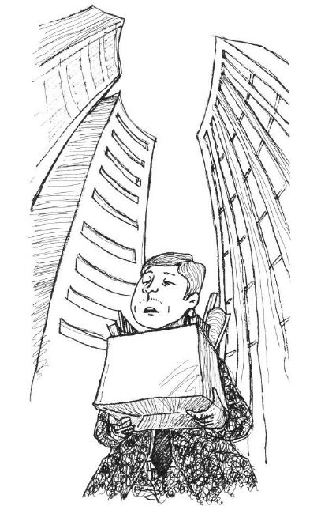
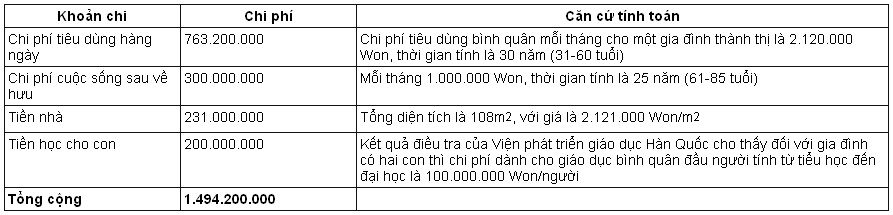
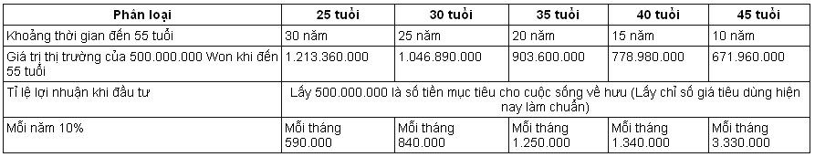
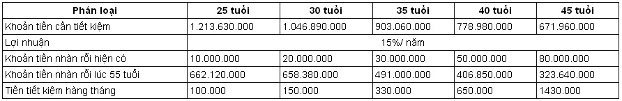
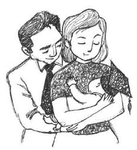

# Chương 4: Kẻ thù lớn nhất của cuộc sống sau khi nghỉ hưu là bỏ lỡ thời cơ

Những mẩu giấy ghi nhớ màu vàng và giấy tờ vứt tứ tung trong sảnh phía dưới tòa nhà của công ty cho thấy ở đây đã từng xảy ra cảnh tượng rất hỗn loạn.

“Chính phủ phải lập tức dừng ngay chính sách tư nhân hóa các doanh nghiệp nhà nước!”

“Phản đối việc điều chỉnh cơ cấu do con người nhúng tay vào!”

Những mẩu giấy màu vàng rơi đầy trong các góc của tòa nhà đã phản ánh tiếng nói bức xúc của các nhân viên trong công ty. Cách đây không lâu, khắp nơi đây là tiếng chửi mắng, khẩu hiệu thậm chí cả tiếng đấm đá, bây giờ chỉ còn lại các nhân viên và những người quét dọn, No Buseong đi qua cái sảnh lớn này, nơi đã từng làm ông bị tổn thương và bước vào trong thang máy.

Vừa bước vào phòng làm việc, các đồng nghiệp đều đổ dồn nhìn ông, ông rất sợ phải tiếp xúc với những ánh mắt cảm thông của nhiều người, vội vàng nhét đồ đạc của mình vào trong hộp giấy.

“Hừ…”

Ông đã thở dài sau khi từ phòng làm việc bước vào thang máy, kể từ hôm nay anh sẽ không phải đối mặt với những ánh mắt cảm thông này nữa.

No Buseong đờ đẫn nhìn chiếc hộp giấy trong tay, ông đã làm ở đây gần 30 năm, những gì để lại chắc chắn không thể nhét hết vào trong hộp giấy này, ông cũng đã bước sang cái tuổi 54. 54 tuổi, độ tuổi khó khăn để bắt đầu làm lại.

“Cũng may bây giờ không phải là mùa đông giá buốt, mùa xuân đã đến, tất cả sẽ trở nên tốt đẹp.”

No Buseong châm một điếu thuốc và an ủi bản thân mình như vậy, nhưng khi đi đến bãi đỗ xe, bước chân ông vẫn nặng trĩu. Sau khi đặt chiếc thùng giấy vào trong xe, điện thoại của ông bỗng đổ chuông, đó là điện thoại của Do Jihae, sau một hồi do dự, ông đã nhấc máy.

“Anh à, em đây, Jihae đây.”

“Ồ, chào cậu, có việc gì không?”

“À, cũng chẳng có việc gì ạ, anh em mình cũng hơn một năm chưa gặp nhau rồi, em muốn gặp anh, mọi người dường như bận rộn hơn trước, hôm nay anh đến chỗ em ăn trưa đi, anh Choe Socheon và anh O Junbi cũng đến đấy ạ, anh nhớ đến đấy nhé!”

No Buseong tuy không muốn nhưng không nỡ từ chối trước sự nhiệt tình của Do Jihae, nên đành nhận lời. Khi đi qua cổng công ty, ông nhìn thấy có mấy người đang tụ tập hô khẩu hiệu, ông lại cảm thấy buồn, và muốn nhanh chóng rời khỏi cái nơi làm ông đau khổ này. Lúc đó có một đồng nghiệp trẻ làm cùng bộ phận nhìn thấy ông, cậu thanh niên đó dường như có điều gì đó muốn nói với ông nên đi về phía xe của ông, nhưng ông rồ ga phóng đi, đã đến nước này, ông cảm thấy mình chẳng còn gì để nói.

Tiếng thịt nướng kêu lốp bốp, nhưng chẳng ai muốn đụng, mọi người chỉ gắp những đồ ăn kèm theo ở trước mặt, họ vốn định coi lần gặp mặt này là buổi tụ tập đầu năm được tổ chức muộn, nhưng rõ ràng, hình như không ai có tâm trí cả.

“À, anh Huiseong tháng Một ra viện đấy ạ.”

Do Jihae phá vỡ không khí nặng nề.

“Sức khỏe đã ổn rồi à?”

Choe Socheon tỏ vẻ vui mừng.

“Không phải như vậy ạ, bác sỹ cho biết cho dù có phẫu thuật thì cũng không có kết quả, nên anh Huiseong đã quyết định ra viện, tiền viện phí lại đắt như vậy, cũng chỉ có cách đó thôi ạ.”

“Lúc đó anh ấy mua bảo hiểm ung thư có phải tốt không, nhìn anh ấy như vậy, em thật sự tiếc cho anh ấy. Anh ấy ngã bệnh đồng nghĩa với việc trong nhà mất đi trụ cột, bây giờ em nghĩ rằng vì hạnh phúc của cả gia đình, bắt buộc phải mua bảo hiểm y tế và bảo hiểm ung thư.”

Choe Socheon nghĩ đến tầm quan trọng của bảo hiểm mà Giáo sư Masu từng nói.

“Anh Buseong này, sao anh buồn vậy? Em biết là anh đang lo lắng cho anh Huiseong, nhưng ngay cả anh cũng vậy, bữa cơm hôm nay chẳng có không khí gì cả, càng những lúc như thế này càng phải lạc quan lên chứ anh!”

O Junbi vừa gắp thịt nướng đã chín đặt trước mặt No Buseong, vừa nói với ông:

“Đúng vậy, hôm nay không thấy anh Buseong nói gì cả, hình như anh có tâm sự gì đúng không ạ?”

Do Jihae mắt không rời No Buseong.

No Buseong dường như rất khát, ông uống ực một ngụm nước, và nói ra việc mình đã trở thành vật hi sinh cho việc điều chỉnh cơ cấu của công ty, mọi người lúc đó không biết phải an ủi ông thế nào, tất cả đều thẫn thờ nhìn ông, lúc đó No Buseong mới nói:

“Các cậu đừng bao giờ giống như tôi nhé, trước đây tôi luôn cho rằng, cho dù gặp phải khó khăn gì, chắc chắn sẽ tìm ra lối thoát, nhưng đời người không đơn giản như những gì tôi đã tưởng tượng!”

***

No Buseong là con một trong một gia đình khá giả. Sau khi tốt nghiệp đại học ông vào làm việc tại công ty Điện lực Đại Hàn, từ trước đến giờ chưa hề gặp phải bất kỳ khó khăn nào, cuộc sống thì thuận buồm xuôi gió, vì vậy ông thuộc tuýp người luôn vui vẻ lạc quan, sẽ được thừa kế tài sản kếch xù của cha nên ông không chú tâm lắm đến việc phấn đấu để thăng quan tiến chức ở công ty.

“Không thể thế được, những người vào công ty cùng thời với anh đều thăng quan tiến chức rồi, chỉ có mỗi mình anh vẫn dậm chân tại chỗ, nghĩa là thế nào?”

Mặc dù rất nhiều người không thể hiểu nguyên nhân tại sao lại như vậy, nhưng No Buseong không muốn giải thích nhiều, bởi vì đối với ông, công ty chẳng qua chỉ giống như một chỗ ghé chân.

Đối với No Buseong, vì là một doanh nghiệp nhà nước, công ty Điện lực Đại Hàn luôn đem lại nguồn thu nhập ổn định cho ông.

Nhưng kể từ ngày công ty của bố ông tuyên bố phá sản, tất cả đã thay đổi. Một lượng lớn tài sản trong phút chốc đã bốc hơi, căn nhà của bố ông cũng bị phát mại, trách nhiệm nuôi dưỡng bố mẹ đổ lên đầu đứa con một là ông, ông đành phải đón bố mẹ về ở cùng để chăm lo cho bố mẹ. Tuy lương ở một công ty lớn không ít, nhưng gánh nặng bất ngờ đó vẫn khiến ông có đôi chút không thích ứng nổi. Lúc đầu khi tình hình khá cấp bách, vợ ông không hề phản đối, nhưng lâu dần, giữa vợ và bố mẹ ông cũng nảy sinh bất hòa.

“Anh nói với mẹ anh đi nhé, đến lúc này mà vẫn cứ như là người có tiền.”

“Em nói thế là có ý gì?”

Đột ngột mất đi chỗ dựa, vốn đã rất mệt mỏi với việc ở cơ quan, nghe thấy vợ nói vậy, No Buseong nổi giận đùng đùng.

“Bà nói muốn mua mỹ phẩm, em đã đưa thẻ tín dụng cho bà, kết quả bà đã mua hết 300.000 Won, với tình hình như hiện nay của chúng ta, chúng ta có thể gánh được khoản vay tín dụng mua mỹ phẩm với giá 300.000 Won không?”

“Cả đời bà đã sống như vậy, làm sao có thể trong thời gian ngắn trở thành một người khác được? Hơn nữa chẳng nhẽ chỉ vì ít đi 300.000 Won mà chúng ta sẽ chết đói sao? Số tiền tôi kiếm được đủ nuôi sống cả gia đình này, sau này cô đừng bao giờ nói với tôi những chuyện vặt vãnh như thế nữa!”

Vợ của No Buseong ngày càng không hài lòng về mẹ chồng, mẹ chồng không những chẳng cho cô tài sản gì, hơn nữa lại tăng thêm gánh nặng kinh tế cho gia đình cô, thậm chí cô còn có thái độ oán hận mẹ chồng.

“Em không thể hiểu nổi tại sao bố mẹ vẫn sống như trước đây, nếu như không có tiền có thể giống như những người già khác tìm việc gì đó để làm, giúp đỡ con cháu sẻ chia gánh nặng, bây giờ cái gì cũng đắt đỏ, ngay cả tiền học của bọn trẻ cũng là vấn đề, em thật sự rất lo.”

“Cái gì? Bố mẹ tôi là người ngoài sao? Nếu như giá cả đắt đỏ, thì bớt tiền học đi một chút.”

“Anh nói cái gì? Anh nói thế mà nghe được sao?”

Vợ ông giận điên người, bởi vì tin vào quan điểm “giáo dục là đầu tư tốt nhất cho tương lai”, nên cứ đến kỳ nghỉ, cô lại đưa bọn trẻ ra nước ngoài học, và cho bọn trẻ tham gia các lớp học thêm và bồi dưỡng, số tiền dành dụm được phần lớn đều dành cho việc học của bọn trẻ.

“Đầu tư cho con cái chính là đầu tư bảo đảm cho cuộc sống sau này của chúng ta, đợi đến khi lũ trẻ trưởng thành, chúng ta sẽ được hưởng phúc.”

Cho dù xảy ra chuyện gì, vợ ông cũng quyết không để ảnh hưởng đến việc học hành của con cái.

Mấy hôm sau, người cha vì thất bại trong kinh doanh mà suốt ngày buồn rầu vì bị cao huyết áp nên phải nhập viện, rồi lại bị xuất huyết não phải chuyển sang phòng bệnh đặc biệt. Vì phải nằm viện để theo dõi mất mấy tháng liền nên số tiền viện phí bỗng trở thành gánh nặng, con người trước đây vốn cho rằng sẽ được thừa kế của cha mà không phải lo lắng gì bỗng chốc đã phải tiêu hết tất cả số tiền tiết kiệm có được, nhưng như thế vẫn chưa đủ để trả tiền viện phí, nên ông đành phải bán căn nhà đang ở, đi thuê một căn nhà khác.

Sau khi chuyển đến một căn nhà có diện tích nhỏ hơn, mối bất hòa giữa vợ và mẹ ông đã lên đến đỉnh điểm, bọn trẻ cũng tỏ thái độ không hài lòng với sự bất tiện mà căn phòng nhỏ đem lại. No Buseong trăn trở một thời gian dài, cuối cùng quyết định đưa bố mẹ vào viện dưỡng lão ở khu vực ngoại ô Seoul, tuy luôn nhớ bố mẹ nhưng mỗi khi nghĩ đến hàng ngày bố mẹ ông sẽ không phải nhìn thái độ mặt nặng mày nhẹ của vợ, ông cũng cảm thấy cách giải quyết như vậy có lẽ sẽ tốt hơn cho bố mẹ ông.

Một thời gian sau, ông phát hiện ra rằng chi phí dành cho việc học hành của bọn trẻ vẫn là một gánh nặng không nhỏ, hơn nữa lại còn xu hướng tăng thêm, tiền lương của ông sau khi trừ đi tiền học và sinh hoạt phí hàng ngày cũng chẳng còn được mấy đồng, dù vậy, ông vẫn tràn đầy niềm tin vào “thu nhập hiện tại” của mình.

Vấn đề cuối cùng cũng đã đến với ông, công ty của ông căn cứ theo chính sách tư nhân hóa doanh nghiệp nhà nước, chuyển đổi bộ phận cấp điện nơi ông đang làm việc theo chế độ tư nhân hóa.

“Anh No Buseong, bây giờ công ty đã trực tiếp cổ vũ mọi người nghỉ hưu trước thời hạn, đặc biệt là đối với các nhân viên phản đối chính sách tư nhân hóa đều bị ép đến chỗ không lối thoát.”

Một khi thực hiện chế độ tư nhân hóa, để nâng cao sức cạnh tranh, công ty bắt buộc phải tiến hành điều chỉnh cơ cấu ở mức độ sâu hơn, No Buseong sợ rằng bản thân sẽ trở thành vật hi sinh cho việc điều chỉnh cơ cấu này, do mỗi lần có tụ họp phản đối điều chỉnh cơ cấu đều không thiếu ông.

“Cứ ngồi ôm cây đợi thỏ như thế này cũng không phải là cách hay, từ trước đến giờ tôi chưa hề phạm phải sai phạm gì lớn, chắc chắn công ty sẽ không cho tôi về hưu trước tuổi, nhưng một khi tiến hành điều chỉnh cơ cấu, sau khi cắt giảm một số nhân viên, tiếp theo đương nhiên sẽ giảm tiền lương và bỏ tiền thưởng, như vậy lấy gì để nộp tiền học cho bọn trẻ và nộp tiền nuôi bố mẹ đây? Như vậy không thể được!”

Nhưng tính nghiêm trọng của sự việc vượt quá những gì ông nghĩ. No Buseong đã làm việc ở công ty gần 30 năm, năng lực tuy không có gì đặc biệt nhưng cũng không phải là loại vô dụng chuyên gây phiền phức, biểu hiện ở công ty cũng tạm được, nhưng những nhân sự thừa trong quá trình điều chỉnh cơ cấu lại chỉ nhằm vào những nhân viên như No Buseong, nguyên nhân chính là lương của những người như ông cao, còn tuổi thì đã lớn, và hơn nữa những người như thế này khó có được bước đột phá trên vị trí của mình.

Công ty gây sức ép với các nhân viên, những nhân viên không chịu nổi sức ép đã lần lượt ra đi. Sau khi thông qua việc gặp riêng để truyền đạt chính sách nhân sự, công ty sẽ đưa ra các quyết định khác nhau như cho về hưu sớm, giữ lại, hay giáng chức v.v, mọi người đều đang đồn đoán những cái tên nằm trong danh sách đen.

No Buseong nhận được thông báo giám đốc bộ phận quản lý kinh doanh muốn gặp ông nói chuyện. Cũng giống như những người khác, ông có dự cảm không hay về lần gặp này, lo rằng điềm xấu sẽ lại rơi vào đầu mình, nhưng ông lạc quan cho rằng cùng lắm là ông sẽ bị giáng chức, và ông cũng đã chuẩn bị sẵn sẽ phải đối đáp thế nào.

No Buseong nghĩ rằng không được quá sợ hãi, vì vậy trong lúc nói chuyện luôn giữ thế thượng phong. Ông phản đối sự bất hợp lý trong việc điều chỉnh cơ cấu, khẳng định đi khẳng định lại phải để những người làm việc chăm chỉ tiếp tục ở lại, cải thiện đãi ngộ đối với họ, giám đốc cắt ngang lời ông và nói rõ đây là ý kiến của tổng giám đốc.

“Cuộc nói chuyện này giữa tôi và anh không phải bàn bạc những vấn đề này, tổng giám đốc công ty đã quyết định, chúng tôi cần những người xuất sắc chứ không cần những người làm việc chăm chỉ.”

Câu nói này của giám đốc đã cho No Buseong thấy rằng mình không cần phải nói tiếp nữa, và điều đó cũng có nghĩa là công ty đã quyết định để ông thôi việc. Nhưng ông không thể ngờ rằng mình chính là đối tượng đầu tiên bị cho thôi việc, cho dù là làm việc chăm chỉ thì cuối cùng cũng khó có thể tránh khỏi bị đá ra khỏi công ty.

Thời gian ở công ty càng dài, cơ hội thăng tiến càng ít, những người vào công ty cùng thời với ông đều đã lần lượt bỏ đi, No Buseong cho rằng mình giữ được vị trí này là may mắn lắm rồi, chỉ có điều đôi lúc ông cũng cảm thấy khá áp lực từ những đồng nghiệp trẻ, do đó nếu phân tích kỹ một chút, quyết định của công ty cũng là việc có thể đoán được, chỉ trách bản thân không chuẩn bị trước tâm lý.

***

“Bây giờ ngay cả tiền ăn hàng ngày cũng trở thành vấn đề, tầm tuổi như tôi bây giờ còn đi đâu làm việc được nữa, bọn trẻ thì vẫn còn đi học, một thời gian nữa còn phải dựng vợ gả chồng cho chúng nó… còn phải cần rất nhiều tiền, nhưng bản thân thì không còn thu nhập, thực sự tôi không muốn sống nữa.”

Sau khi kể xong, No Buseong châm một điếu thuốc, có lẽ là vì chưa ăn chút gì nên sau khi hít một hơi ông đã ho sặc sụa, mọi người cũng không biết phải an ủi ông thế nào, tất cả đều im lặng.

“Hừ…”

O Junbi thở dài đánh thượt.

“Anh ơi, tại sao anh lại giống em đến vậy, rốt cuộc là anh em mình sai ở đâu, số phận của anh em mình sao lại…”

O Junbi vẫn luôn đổ lỗi cho số phận, năm ngoái sau khi trả lại nhà cho công ty, anh đã đưa cả nhà về quê ở với bố mẹ, một mình ở lại căn phòng vừa làm chỗ kinh doanh vừa làm chỗ ở gần công ty.

“Em đã đưa bọn trẻ về ở với ông bà, dự định sẽ nhanh chóng kiếm tiền để cả nhà sớm đoàn tụ, nhưng kiếm tiền cũng không phải là chuyện ngày một ngày hai, thật lòng mà nói, em chưa bao giờ hi vọng trở thành đại gia, chỉ mong cả nhà đoàn tụ sống một cuộc sống hòa thuận là hạnh phúc lắm rồi, nhưng ngay cả điều này cũng khó thực hiện đến vậy?”

“Tôi cũng giống cậu, lúc nào cũng có ý nghĩ chỉ cần sống ngày hôm nay là đủ, nên không biết chuẩn bị trước cho cuộc sống sau này, để bọn trẻ học thêm tràn lan, mê muội với những sở thích của bản thân, muốn lái xe sang… tôi chưa bao giờ cho rằng những điều này đồng nghĩa với lãng phí, luôn nghĩ rằng tất cả mọi người đều như vậy, nên không hề lo lắng, nhưng giờ đây ngay cả chỗ chui ra chui vào cũng không còn. Các cậu xem, năm nay tôi đã 54 tuổi, một căn nhà thuê là toàn bộ những gì tôi có, đợi đến khi bọn trẻ lấy vợ lấy chồng, còn phải kiếm cho chúng một gian, e rằng đến lúc đó tôi sẽ thật sự trở thành một kẻ nghèo xác xơ không một xu dính túi. Bây giờ những lo lắng này luôn thường trực trong tôi, có lúc ngay cả khi ngủ tôi cũng giật mình tỉnh giấc vì những suy nghĩ này.”

No Buseong lại châm thêm một điếu thuốc, ông không đụng đũa bất kỳ thứ gì, ông hút thuốc liên tục, điều này khiến cho O Junbi hết sức lo lắng, với tay lấy hộp thuốc vứt ra một bên.

“Cậu có biết điều tôi hối hận nhất sau khi để mất đi vị trí của mình là gì không? Đó chính là khi có thu nhập ổn định, không cần biết tiền nhiều hay ít, tôi đã không lo tiết kiệm, trong khi đó chi phí cho cuộc sống nghỉ hưu không ngừng tăng. Bây giờ thì không kịp nữa rồi. Số tiền dưỡng già chính là cái mầm, đợi đến sau khi về hưu sẽ đơm hoa kết trái, e rằng các cậu không hiểu được điều này, vì các cậu còn trẻ, nếu như ngay từ bây giờ các cậu bắt đầu chuẩn bị tiền dưỡng già cho mình thì vẫn còn kịp đấy, đừng để cho bản thân mình khi về già mới hối hận, khi còn kiếm được tiền nhất định phải tích lũy để chuẩn bị cho cuộc sống sau này.”

“Ôi dào, những chuyện đau lòng như thế anh đừng nói nữa, tất cả mọi chuyện sẽ đâu vào đấy cả thôi, anh vẫn còn lương hưu mà, nếu như tiêu pha có kế hoạch, chưa biết chừng còn có thể giải quyết mọi vấn đề, chỉ cần nắm bắt cơ hội, chúng ta sẽ có thể xoay chuyển tình thế, em sẽ chọn cho anh một cổ phiếu tốt, anh đừng lo lắng quá.”

Do Jihae cắt ngang lời No Buseong, và nói những lời chẳng sát với thực tế, điều này khiến Choe Socheon lại bắt đầu lo lắng cho Do Jihae, con người luôn tin vào quan điểm “đời người giống như một ván bài”.

“Anh này, anh cũng nên ăn chút gì đi, phải lấy lại tinh thần chứ.”

O Junbi gắp thịt nướng cho No Buseong, và khuyên ông ăn nhiều một chút, No Buseong và O Junbi từ tính cách đến những gì đã nếm trải đều rất giống nhau, Choe Socheon không dám tưởng tượng họ phải làm thế nào để đối mặt với cuộc sống sau này.

Thư ký của Giáo sư Masu gửi cho Choe Socheon một tấm thiệp mời anh tham dự hội thảo “Hãy lắng nghe ý kiến của chuyên gia - Cuộc sống vô lo không còn xa nữa” dành cho đối tượng đang đi làm. Giáo sư Masu là khách mời đặc biệt tham gia diễn thuyết trong buổi hội thảo này. Choe Socheon dự định sau khi hội thảo kết thúc sẽ tìm gặp Giáo sư một lúc.

Theo kiến nghị của Giáo sư, Choe Socheon đã bán nhà và trả hết khoản nợ mua nhà, bán hết cổ phiếu và trả được nợ ngân hàng, như vậy mỗi tháng còn dư ra được ít tiền, tuy con số không lớn nhưng anh vẫn muốn được lắng nghe ý kiến của Giáo sư về cách quản lý tiền bạc, buổi hội thảo này đúng là cơ hội ngàn năm có một.

Do giờ tan tầm nên đường rất tắc, hơn 7 giờ anh mới tới được nơi diễn ra hội thảo, Choe Socheon ngồi ở hàng ghế cuối cùng. Sau khi các đại biểu tham dự hội thảo đã đến hết, chủ tọa mới bắt đầu giới thiệu Giáo sư Masu, sau mấy câu mở đầu đơn giản, Giáo sư Masu bắt đầu bài nói chuyện. Choe Socheon cảm thấy như mình đang trở lại với thời đại học của 10 năm trước. Điểm khác với các bài giảng của Giáo sư là, bài nói chuyện lần này theo hình thức hội thảo, Giáo sư rất chú trọng giao lưu với người nghe, không khí buổi hội thảo rất nhẹ nhàng.

“Hôm nay là Lập Hạ, theo truyền thống là phải ăn canh gà hầm sâm, hôm nay mọi người đã ăn chưa ạ?”

Sau khi Giáo sư Masu đưa ra một chủ đề vui vẻ như vậy, mọi người liền rộn ràng bàn luận về món canh gà hầm sâm.

“Tất nhiên là phải ăn rồi, đối với người lớn tuổi, thì sức khỏe chính là tiền bạc, khi còn trẻ phải ăn uống tốt thì đến già mới không phải chịu bệnh tật, hôm nay tôi đã ăn hai bát to liền, ha ha.”

Một vị hơn 50 tuổi vừa vỗ bụng vừa trả lời, hành động hài hước của ông đã khiến cả hội trường cười nghiêng ngả.

“Vậy sao? Xem ra bất kỳ việc gì cũng đều phải chuẩn bị trước khi còn trẻ, nếu không lúc về già sẽ rất khổ. Chủ đề ngày hôm nay của chúng ta là làm thế nào để có một cuộc sống an bình sau khi nghỉ hưu? Cách đây không lâu, một tờ báo đã tiến hành điều tra đối với các đối tượng là những người đang đi làm trong độ tuổi từ hơn 30 tuổi đến hơn 50 tuổi, với câu hỏi là ông/bà có cảm thấy bất an đối với cuộc sống sau khi về hưu hay không và ông/ bà đã có sự chuẩn bị như thế nào cho cuộc sống sau này của mình. Các bạn có biết kết quả điều tra như thế nào không ạ?”

“Chuẩn bị cho cuộc sống về hưu” - cụm từ này đối với Choe Socheon khá lạ lẫm, theo anh hiểu, anh bây giờ mới 35 tuổi còn những 20 năm nữa mới đến tuổi nghỉ hưu, vẫn chưa đến lúc nói về chuyện này. Đây là việc mà những người ở độ tuổi 45-55 phải suy nghĩ. Nhưng từ sau những gì mà No Buseong gặp phải, anh cảm thấy mình phải suy nghĩ sớm hơn về vấn đề này. Bài nói chuyện của Giáo sư Masu vừa mới bắt đầu nhưng anh cảm thấy mình đã không lãng phí thời gian khi đến đây.

“Những người ở độ tuổi từ hơn 30 - 50 tuổi không mấy lo lắng về cuộc sống sau khi về hưu, bởi lẽ bây giờ cái gì cũng phải cần đến tiền, nên mọi người đã xem nhẹ vấn đề chuẩn bị gì cho cuộc sống về hưu sau này.”

Đó là câu trả lời của một thanh niên mới ngoài 30 tuổi, mọi người đều gật gù tỏ ý tán thành.

“Bạn trả lời rất đúng, kết quả điều tra cho thấy, những người có sự chuẩn bị trước cho cuộc sống về hưu sau này của mình chiếm chưa đến một nửa số người điều tra, phần lớn những người được hỏi đều cho biết các khoản chi dành cho giáo dục con cái, vay tiền mua nhà, chi tiêu hàng ngày đã chiếm phần lớn khoản thu nhập của họ, điều này khiến cho họ không đủ sức để tiếp tục tích lũy tiền bạc cho cuộc sống sau khi về hưu nữa, nhưng vấn đề ở chỗ, có đến hơn 80% số người được hỏi đều có cảm giác bất an về cuộc sống sau này, vì vậy có thể thấy rằng, tuy rất nhiều người lo lắng cho cuộc sống sau khi về hưu, nhưng lại không biết làm thế nào để chuẩn bị.”

Giáo sư Masu cho chiếu lên màn hình kết quả của cuộc điều tra.

“Thưa Giáo sư, những người đến dự buổi hội thảo ngày hôm nay phần lớn còn rất trẻ, ví như tôi đây năm nay mới hơn 30 tuổi, nên hiện giờ tôi vẫn chưa cần thiết lo lắng cho cuộc sống về hưu sau này chứ? Bởi lẽ còn hơn 20 năm nữa tôi mới về hưu.”

Một người khoảng hơn 30 tuổi đưa ra câu hỏi này với một thái độ lạc quan.

“Ha ha, bạn thật sự nghĩ như vậy sao? Vậy tôi xin hỏi một câu trước, trong những người từ 65 tuổi trở lên, số người có thể an nhàn hưởng thụ cuộc sống sau khi về hưu chiếm bao nhiêu phần trăm?”

Mọi người bắt đầu bàn luận với những người xung quanh, hội trường bỗng chốc náo nhiệt hẳn.

“Có phải là 70-80%?”

Một người đàn ông khỏe mạnh khoảng hơn 40 tuổi tự tin trả lời.

“Đúng vậy, ít nhất có hơn một nửa số người đã sử dụng số tiền kiếm được khi còn trẻ để hưởng thụ cuộc sống sau khi về hưu.”

Mọi người chờ đợi câu trả lời của Giáo sư Masu sau khi những đại biểu tham dự hội thảo đưa ra hết các ý kiến của mình.

“Tiếc rằng thực tế lại không phải như vậy. Kết quả điều tra cho thấy, trên 40% số người cao tuổi cần tới sự giúp đỡ của con cái hoặc người thân, trong khi đó chỉ có 10% là có thể độc lập về mặt kinh tế, không cần tới sự giúp đỡ của người khác và hoàn toàn dựa vào số tiền tích lũy từ khi còn trẻ.”

“Hiện nay vấn đề cuộc sống sau khi về hưu đã trở thành một vấn đề không thể né tránh, phần lớn các bạn ngồi đây còn khá trẻ, đối với các bạn, cuộc sống sau khi về hưu còn quá xa vời, việc cần làm hiện nay là phải lo cho cuộc sống trước mắt, nằm mơ các bạn cũng chưa bao giờ nghĩ đến phải chuẩn bị cho cuộc sống sau này. Nhưng có một điều chúng ta phải khẳng định, đó chính là tất cả chúng ta đều phải đón nhận cuộc sống đó, vậy thì các bạn có thể tưởng tượng một chút sau này mình sẽ thế nào, bởi lẽ tuổi tác của các bạn không giống nhau, nên các bạn trẻ thì thử tưởng tượng 30 năm sau mình sẽ thế nào, các bạn nhiều tuổi hơn một chút thì hãy thử tưởng tượng 10 năm sau mình sẽ thế nào, chúng ta hãy cùng tìm ra một vài điểm chung từ những tưởng tượng này: Sau này con cháu chúng ta sẽ càng khó kiếm tiền hơn chúng ta, đó là do vấn đề lão hóa tăng và tỉ lệ sinh giảm, chính phủ sẽ điều chỉnh từ chính sách, thuế thu nhập cá nhân, chi phí công và bảo hiểm y tế trưng thu của người trẻ sẽ cao hơn, tỉ lệ này hiện nay là 10-20% thu nhập, nhưng ai dám chắc trong tương lai sẽ không tăng lên đến 40-50%, điều này khiến cho suy nghĩ sau này sẽ nhờ con cái không những khó thực hiện thậm chí còn làm liên lụy đến chúng. Nói tóm lại, sự chuẩn bị cho cuộc sống sau khi về hưu bắt buộc phải dựa vào nỗ lực của bản thân.”

Giáo sư Masu nhấp chuột, màn hình lớn phía sau ông xuất hiện hai hàng chữ như sau:

*Cho dù vui vẻ hiện thời, cũng đừng quên mất tuổi già thê lương!*

*Nếu không chuẩn bị kịp thời, về già hối hận đã không kịp rồi!*

“Có bao giờ các bạn nghĩ đến từ lúc kết hôn lập gia đình cho đến lúc từ giã cõi đời này, chúng ta cần có bao nhiêu tiền chưa?”

Sau khi nêu câu hỏi, trên màn hình lại xuất hiện một dòng chữ:

*Muốn có một cuộc sống hạnh phúc, tôi và những thành viên trong* *gia đình ít nhất cần phải có bao nhiêu tiền?*

“Đương nhiên, điều kiện và hoàn cảnh sống của mỗi người không giống nhau, giá trị quan và quan niệm về chi tiêu cũng khác nhau, nhưng nhìn chung, chi phí cuộc sống cơ bản của một gia đình được thể hiện trong bảng sau.”

Trên màn hình hiện ra một bảng biểu, mọi người nghển cổ để nhìn rõ nội dung trong bảng.

**Chi phí cần thiết của gia đình trong vòng 55 năm kể từ khi** **bạn 31 tuổi - 85 tuổi**

*Ghi chú:* -Số liệu trên được tính cho một gia đình có 4 người, và không bao gồm chi phí cưới xin của các con. -Chưa xem xét đến chi phí mua xe hơi và diện tích nhà rộng hơn; -Chưa xem xét đến nhân tố vật giá tăng. *(Đơn vị: Won)*

“Lạy chúa tôi, lẽ nào cả đời chúng ta sẽ phải chi tiêu gần 1.500.000.000 Won cho cả nhà chăng?”

“Đúng đấy, con số này cũng hơi quá, nếu như không có căn cứ tính toán, tôi thật sự không thể tin nổi đây lại là sự thực.”

Phần lớn những đại biểu tham dự đều rất kinh ngạc với con số 1.500.000.000 Won.

“Từ số liệu trên chúng ta thấy, trong vòng 55 năm (từ 31 - 85 tuổi) một gia đình phải tiêu tốn hơn 1.500.000.000 Won, nhưng điều khiến chúng ta không thể tin nổi là, con số hơn 1.500.000.000 Won vẫn chưa bao gồm chi phí mua xe hơi, chi phí diện tích nhà rộng hơn và chi phí cưới xin của con cái, những chi phí này là những tính toán cơ bản nhất.”

Giáo sư Masu vừa giải thích xong, một người đàn ông ngồi ở hàng đầu chăm chú suốt vào màn hình giơ tay xin hỏi:

“Nhưng có một điểm rất lạ, mức lương trung bình năm của một gia đình 4 người ở nước ta là 40.000.000 Won, sau 30 năm công tác số tiền kiếm được mới là 1.200.000.000 Won, nếu như tính theo cách thời gian làm việc 30 năm và thời gian chi tiêu là 55 năm, như vậy chẳng phải là vẫn thiếu khoảng 30.000.000 Won nữa?”

“Quan sát của bạn rất sắc sảo, vì đã phát hiện ra bí mật 30.000.000 Won này.”

Giáo sư Masu vừa cười vừa nói, mọi người bên dưới lầm rầm bàn tán.

“Bí mật 30.000.000 Won? Điều đó có nghĩa là gì?”

“Cũng có thể là sự trùng hợp, số tiền 30.000.000 Won này cũng chính là số tiền mà chúng ta cần cho cuộc sống nghỉ hưu sau này, nói cách khác, khi thu nhập và chi tiêu của một gia đình ở vào mức bình quân, đến lúc 60 tuổi khi về hưu sẽ không có một xu dính túi, sau 60 tuổi không có thu nhập, nhưng chi thì vẫn phải chi, do vậy cơ bản là không thể độc lập được về mặt kinh tế. Chúng ta hãy thử nghĩ xem, nếu sau 30 năm, hàng ngày chúng ta phải lo lắng về việc mưu sinh, phải nhìn thái độ của con cái để sống, nếu như bản thân hoặc người bạn đời của chúng ta lại đau chỗ này nhức chỗ kia, nỗi đau khổ đó không thể diễn tả được bằng lời.”

Giáo sư Masu vừa nói hết, một người đứng phắt dậy lớn tiếng nói:

“Không đến mức như vậy chứ! Chúng ta vất vả cả đời chẳng lẽ còn phải nhìn thái độ của con cái để sống sao? Đợi đến khi con cái trưởng thành, chúng ta càng có nhiều thời gian và sức lực, lúc đó tích lũy tiền bạc cho cuộc sống về hưu sau này cũng chưa muộn, nếu như bây giờ chúng ta phải sống vì những chuyện 30 năm sau, cuộc sống như vậy còn có ý nghĩa gì? Chúng ta còn rất trẻ, còn có thể làm việc rất lâu, có cần thiết ngay bây giờ phải nghĩ đến sau này về hưu sẽ sống thế nào chăng? Kiểu gì cũng có lối thoát, tôi cho rằng không cần thiết phải lo lắng như vậy.”

Một thanh niên hơn 30 tuổi đã bày tỏ sự phản đối với quan điểm của Giáo sư Masu, những câu nói của anh ta khiến Choe Socheon nghĩ đến No Buseong của mấy tháng trước, một cuộc sống ổn định hạnh phúc là mơ ước của nhiều người, nhưng sự đời khó lường, ví như No Buseong, trong một đêm người cha giàu có bị phá sản, “bát cơm” của bản thân cũng rơi mất.

“Các bạn cho rằng các bạn vẫn còn trẻ, nên còn có thể làm việc 30 năm nữa, bản thân cách nghĩ này đã sai.”

Sau khi chào Giáo sư Masu bằng ánh mắt, Choe Socheon tiếp tục nói:

“Chúng ta luôn quen với việc nhìn nhận bản thân và tương lai bằng một thái độ lạc quan mù quáng, nhưng sự đời lại khó lường, ai có thể bảo đảm được rằng cả đời chúng ta luôn thuận buồm xuôi gió, không bao giờ gặp phải biến cố gì đột xuất?”

Choe Socheon kể cho mọi người nghe câu chuyện của No Buseong, những tai họa mà No Buseong gặp phải khiến mọi người xót xa, ai cũng lo lắng cho cuộc sống sau này của ông ta không biết sẽ đi về đâu.

“Quyền thừa kế tài sản, công việc ổn định, tất cả những điều này đã khiến cho anh ta luôn tin vào tương lai tươi sáng của mình, nhưng tất cả trong nháy mắt đã rời bỏ anh ta. Nói thực lòng, chuyện này cũng khiến tôi cảm thấy lo sợ, tôi sợ rằng một ngày nào đó, tôi cũng mất việc, hoặc người thân trong gia đình đột nhiên lâm bệnh cần phải tiêu một khoản viện phí rất lớn, do đó chúng ta không thể cho rằng thu nhập 20 năm sau của chúng ta giống như bây giờ. Anh bạn vừa phát biểu kia nếu như vẫn luôn giữ quan điểm như vậy, về sau gặp khó khăn sẽ khó giải quyết. Mục đích đến đây ngày hôm nay của tôi là muốn chia sẻ với mọi người một vài suy nghĩ của bản thân tôi.”

Choe Socheon khẳng định thêm lần nữa mọi người không nên coi chuyện của No Buseong là chuyện của người khác.

“Rất đúng, tôi cũng đã hơn 40 tuổi, bây giờ cũng đã bắt đầu lo lắng cho cuộc sống sau này của mình. Bởi vì mỗi tháng khi lương vừa đổ vào thẻ, chưa được mấy hôm đã không còn một đồng, tôi thực sự rất lo lắng, nếu cứ tiếp tục như vậy, nếu không có kế hoạch gì cho tương lai, e rằng đến lúc già, chắc chắn tôi sẽ trở thành một kẻ nghèo kiết xác!”

Một người đàn ông đã hơn 40 tuổi nói rằng cảm giác như mình đang có một cuộc sống hết sức mơ hồ, nhưng lại không biết làm thế nào để kết thúc tình trạng này, hi vọng nhận được sự chỉ dẫn của Giáo sư Masu.

“Chúng ta luôn lo lắng sẽ có biến động, bởi vì trạng thái ổn định hiện tại đối với chúng ta là thoải mái nhất, đương nhiên chúng ta cũng sẽ có những lo lắng nhất định cho cuộc sống tương lai của bản thân, nhưng nếu vì để chuẩn bị cho cuộc sống sau khi về hưu mà lập tức phải thay đổi một số thói quen hiện tại, do đó mà chúng ta cứ lần nữa mãi việc này. Đương nhiên, nếu chúng ta không thể vượt qua được cám dỗ của cuộc sống hiện tại, không chịu trải nghiệm những khó khăn do thay đổi đem đến thì tương lai của chúng ta sẽ vô cùng đen tối, vì vậy chúng ta không thể ngồi nhìn tất cả mà không đi tìm kiếm sự thay đổi. Vậy thì, bắt đầu từ bây giờ, chúng ta hãy chính thức xem xét vấn đề mà cuộc sống sau khi về hưu phải đối mặt.”

Mọi người đã cảm nhận được sức nặng trong câu nói của Giáo sư Masu, nên đồng loạt điều chỉnh lại tư thế ngồi, Choe Socheon cũng lấy máy tính, chuẩn bị chăm chú lắng nghe bài diễn thuyết của Giáo sư.

“heo các bạn, trở ngại lớn nhất trong quá trình tích lũy tiền bạc dành cho cuộc sống sau khi về hưu là gì? Các bạn cứ thoải mái trình bày quan điểm của mình.”

Sau khi Giáo sư Masu đi vào chủ đề chính, mọi người trở nên hết sức tích cực, thi nhau đưa ra đáp án của mình.

“Chi tiêu quá mức?”

“Tôi thì cho rằng đó chính là chiến lược đầu tư bị động kiểu gửi tiết kiệm định kỳ.”

“Trở ngại lớn nhất chính là không coi trọng bảo hiểm và tiền dưỡng lão.”

…

Mọi người tranh nhau nói.

“Ha ha, các bạn đều có lý, nhưng vẫn không phải là đáp án mà tôi cần, còn có đáp án nào khác nữa không?”

“Bỏ lỡ thời cơ mới chính là trở ngại lớn nhất, đúng không ạ?”

Choe Socheon nhìn Giáo sư Masu và trả lời:

“Đúng vậy, tại sao bạn lại nghĩ như vậy?”

“Trước đây trong giờ lên lớp, Giáo sư đã dùng 2 tiếng đồng hồ để nói rõ về hiệu quả của lãi suất kép, lúc đó em thấy những lời Giáo sư giảng giống như một phép thuật, sau này em mới hiểu ra rằng chỉ cần sớm khởi động phép thuật này một chút, có thể thu được lợi lớn hơn.”

“Ha ha, đúng là đồ đệ của tôi, nhưng cũng không biết là do học sinh xuất sắc hay là trình độ của thầy giỏi đây?”

Câu bông đùa của Giáo sư Masu khiến cho không khí buổi hội thảo trở nên nhẹ nhàng hơn rất nhiều.

“Kẻ thù lớn nhất mà cuộc sống về hưu phải đối mặt chính là thời gian, nếu bạn có sự chuẩn bị cho cuộc sống sau này càng sớm, gánh nặng của bạn sẽ càng ít đi, nếu như hơn 20 tuổi đã bắt đầu chuẩn bị, sẽ không hề cảm thấy đó là gánh nặng, nhưng hơn 40 tuổi mới bắt đầu, thì bạn sẽ phải chịu một sức ép khá lớn.”

Giáo sư Masu nhấp chuột, một bảng thống kê lại hiện ra trên màn hình.

* Giả thiết lạm phát mỗi năm tăng 3% *(Đơn vị: Won)*

“Tôi xin lấy ví dụ để chứng minh. Giả sử chúng ta bắt đầu tích lũy từ bây giờ, cho đến khi 55 tuổi về hưu, số tiền dưỡng già của chúng ta tính theo mức giá hiện tại là 500.000.000 Won, tỉ lệ lợi nhuận do đầu tư mỗi năm là 10%, nếu như bây giờ chúng ta 25 tuổi, mỗi tháng chỉ cần tiết kiệm 590.000 Won là có thể thực hiện được mục tiêu đề ra, nhưng nếu như 35 tuổi mới bắt đầu thì số tiền đó là 1.250.000 Won, 45 tuổi là 3.330.000 Won, mọi người có thể thấy sự chênh lệch giữa các con số lớn đến mức nào.”

“Thực sự là rất đáng kinh ngạc, tôi nằm mơ cũng không nghĩ đến, nhưng tôi chỉ muốn khi điều kiện tốt lên một chút tôi sẽ bắt đầu chuẩn bị tích lũy, nhưng không nghĩ đến là do để lỡ thời cơ, sau này lại phải trả cái giá đắt như vậy để bù đắp, nhưng tại sao lại có sự chênh lệch lớn đến như vậy, thưa Giáo sư?”

Người đàn ông ban nãy lớn tiếng cho rằng lẽ nào cả đời vất vả đến khi già lại phải nhìn thái độ của con cái để sống, thở dài nói:

“Điều này có liên quan đến hiệu quả của lãi suất kép mà ban nãy anh Choe Socheon đề cập đến. Khác với việc chỉ tính lãi suất tiền gửi thông thường, khi tính lãi suất kép, còn phải tính cả lãi suất có được từ tiền gốc cộng với số lãi, như vậy, lãi suất kép có được do lãi cộng lãi theo thời gian sẽ càng lớn, điều này giống với học thuyết hòn tuyết lăn.”

“Như vậy có thể nói độ tuổi khác nhau thì số tiền chi tiêu mỗi tháng cũng sẽ khác nhau, nếu như bắt đầu từ bây giờ tích lũy tiền dưỡng già, những sức ép sau này phải gánh chịu sẽ ít hơn nhiều. Ngoài ra còn có một điểm nữa, chúng ta còn phải chuẩn bị sản phẩm đầu tư, khi lựa chọn sản phẩm đầu tư, tính an toàn sẽ là nhân tố được xem xét đầu tiên đúng không ạ, thưa Giáo sư?”

Một phụ nữ ngoài 30 tuổi đã đưa ra ý kiến của mình, tất cả mọi người đều gật đầu tán thưởng, và chờ đợi phản ứng của Giáo sư Masu.

“Câu hỏi này của bạn rất hay, nhưng khi chuẩn bị tích lũy tiền dưỡng già, mọi người phải chú ý một điểm, đó chính là không nên tin tưởng một cách mù quáng vào sản phẩm đầu tư an toàn. Chúng ta luôn tồn tại một suy nghĩ sai lầm, đó chính là cho rằng sản phẩm đầu tư an toàn có thể bảo đảm cho chúng ta có được một tương lai ổn định tuyệt đối, nhưng có một điều mà chúng ta không thể không nhắc đến, đó chính là phải bảo đảm lãi suất thu được phải cao hơn lạm phát.”

Điều này giống như một gáo nước lạnh dội lên đầu những người luôn tâm niệm “an toàn là trên hết”, tất cả mọi người trong phút chốc đều ngây ra, mọi người đều đang chờ đợi lời giải thích tiếp theo của Giáo sư Masu.

“Do các bạn ngồi đây có độ tuổi khác nhau, nên tôi lấy độ tuổi 35 để giải thích. Trong các ví dụ trước đây, chúng ta đặt ra lợi nhuận thu được từ đầu tư là 10%, nhưng nếu như chúng ta lựa chọn sản phẩm an toàn được bảo đảm để đầu tư là gửi tiết kiệm ngân hàng có kỳ hạn thì không thể nào đạt được lãi suất 10%, hiện nay lãi suất ngân hàng có kỳ hạn chỉ là 4,5%, nhưng lãi suất thực tế sau khi trừ đi thuế thu nhập cá nhân chỉ là 3,8%, vì vậy để tích lũy đủ số tiền dưỡng già, mỗi tháng để ra 1.250.000 Won chắc chắn không đủ, mà bắt buộc phải để ra số tiền là 2.580.000 Won. Xin hỏi các bạn, ai có thể mỗi tháng có được nhiều tiền như thế để gửi vào ngân hàng? Do đó, đối với những người mà thực lực tài chính có hạn, nếu muốn gia tăng lợi nhuận thì bắt buộc phải gánh chịu rủi ro nhất định, việc tích lũy tiền dưỡng già là một quá trình rất dài, nhưng trong quá trình này nếu cứ giữ quan điểm “sản phẩm đầu tư rủi ro thấp sẽ được bảo đảm” thì bạn sẽ thất bại, với ví dụ tiêu biểu là sản phẩm tiền dưỡng lão 401.000 USD của Mỹ, trong đó có tới 65% là đầu tư vào thị trường cổ phiếu.”

“Ban nãy chúng ta tính lợi nhuận thu được hàng năm theo tỉ lệ 10%, nếu như lợi nhuận là con số gấp đôi con số này, mỗi tháng chúng ta sẽ phải tiết kiệm bao nhiêu tiền ạ?”

Một cậu thanh niên hơn 20 tuổi đang làm việc ở công ty đầu tư rủi ro nêu câu hỏi.

“Ha ha, quả đúng là người làm trong lĩnh vực đầu tư rủi ro luôn tâm niệm ‘rủi ro cao lợi nhuận cao’, khi lợi nhuận hàng năm là 10% thì sẽ phải tiết kiệm 1.250.000 Won, 20% sẽ là 400.000 Won, bạn thấy thế nào? Con số ấn tượng đấy chứ?”

Khuôn mặt của cậu thanh niên đỡ căng thẳng hơn sau câu trả lời của Giáo sư.

“Quan niệm thứ hai mà chúng ta cần phải gạt bỏ đó là lòng tin mù quáng vào sự tăng giá của bất động sản. Sau khi đến đất nước này, điều khiến tôi cảm thấy kinh ngạc nhất đó là tình yêu gần như bệnh hoạn của mọi người đối với bất động sản hay mua nhà. Đương nhiên điều này cũng có nguyên nhân lịch sử nhất định, nhưng đây thực sự là một hiện tượng vô cùng nguy hiểm, bởi lẽ mọi người đã đem phần lớn thu nhập của cả đời đầu tư vào nhà cửa, không chỉ tốn thời gian, mà còn phải trả tiền vay ngân hàng. Điều này khiến cho chúng ta rất khó để thực hiện các khoản đầu tư khác, từ đó mất đi rất nhiều cơ hội đầu tư quan trọng, xét từ góc độ giá thành cơ hội, tổn thất là khá lớn.”

“Nhưng nếu như giá nhà tăng thì chẳng phải là đã bù đắp được tất cả các tổn thất đó sao?”

Có người đã đưa ra giả thiết như vậy, Choe Socheon cười méo xẹo:

“Dĩ nhiên nếu như toàn bộ thế giới này đều chuyển động và vận hành theo như ý muốn của chúng ta thì quá tốt. Cũng giống như sự sụp đổ của nền kinh tế bong bóng ở Nhật, một khi giá bất động sản bị đóng băng, xin hỏi chúng ta sẽ thế nào?”

Câu hỏi đột ngột của Giáo sư Masu khiến cả hội trường im phăng phắc, mọi người nhìn nhau, nhưng không ai trả lời.

“Tuy mọi người không muốn nghĩ đến điều này, nhưng nhỡ điều đó xảy ra, e rằng sẽ gây ra sự thâm hụt về tài chính rất lớn cho mỗi gia đình. Chúng ta tiếp tục xem bảng thống kê bên trên. Một người ở độ tuổi 35 nếu như muốn khi 55 tuổi tích lũy được số tiền tương đương với giá trị là 500.000.000 Won tại thời điểm hiện tại, thì mỗi tháng phải tiết kiệm 1.310.000 Won với mức lãi suất hàng năm là 10%. Nếu như lợi nhuận tăng lên 15% thì mỗi tháng chỉ cần 610.000 Won. Nói là

610.000 Won, nhưng đây cũng là một con số không nhỏ, vậy còn có cách nào khác không? Có, có thể giải quyết thông qua khoản tiền nhàn rỗi. Thông thường càng nhiều tuổi thì khoản tiền nhàn rỗi càng nhiều, nếu như biết lợi dụng khoản tiền này, mỗi tháng chúng ta sẽ không cần phải tiết kiệm quá nhiều tiền dưỡng già đến vậy. Giả dụ bạn có 10.000.000 Won tiền nhàn rỗi, với lãi suất năm 15% và tính theo cách tính lãi suất kép, sau 20 năm, số tiền tiết kiệm trên sẽ tăng lên 163.670.000 Won, điều này sẽ làm giảm đi rất nhiều gánh nặng tiền gửi tiết kiệm mỗi tháng của chúng ta. Ở một quốc gia mà bất động sản chiếm tỉ lệ rất cao trong tài sản này, chúng ta không thể đánh giá quá cao giá bất động sản, mà phải căn cứ vào tình hình thực tế của bản thân, kiên quyết giảm tỉ trọng cho đầu tư bất động sản, dành sức lực chính cho việc tích lũy tiền mặt, thông qua đầu tư tài chính chuẩn bị cho cuộc sống sau khi nghỉ hưu. Khoản tiền nhàn rỗi, lợi nhuận, thời gian đều sẽ ảnh hưởng đến kết quả cuối cùng. Dưới đây chúng ta xem với khoản tiền nhàn rỗi và tỉ lệ lợi nhuận đã định, mỗi tháng chúng ta sẽ phải dành ra bao nhiêu tiền dưỡng già?”. Trên màn hình lại xuất hiện một bảng thống kê có chút thay đổi so với bảng thống kê trước đó.

*Ghi chú:* Khoản tiền cần tiết kiệm = Căn cứ vào tỉ lệ lạm phát 3% mỗi năm, đến khi 55 tuổi sẽ bằng với 500.000.000 Won tại thời điểm hiện tại. *(Đơn vị: Won)*

“Nếu như quan sát kỹ bảng thống kê phía sau lưng tôi, các bạn sẽ phát hiện ra rằng, khi còn trẻ, cho dù là khoản tiền nhàn rỗi rất ít nhưng cũng có thể giảm đi rất nhiều khoản tiền cần tiết kiệm mỗi tháng, ngược lại, tuổi càng cao, để giảm bớt số tiền tiết kiệm mỗi tháng, số tiền nhàn rỗi cũng cần nhiều hơn. Đây chính là nguyên nhân tại sao chúng ta nói rằng phải sớm chuẩn bị cho cuộc sống sau khi nghỉ hưu. Có lẽ trong số các bạn ngồi đây, có người luôn nghiêng về đầu tư bất động sản, vậy thì bây giờ rất cần thiết phải suy nghĩ lại xem có nên giảm bớt tỉ lệ dành cho đầu tư bất động sản trong cơ cấu tài sản của mình, học cách lợi dụng khoản tiền nhàn rỗi để tạo ra hiệu quả lãi suất kép, mỗi tháng sẽ giảm được tiền tiết kiệm dành cho cuộc sống sau này, hi vọng các bạn có thể căn cứ vào tình hình tài chính của bản thân để đưa ra một tỉ lệ phù hợp cho khoản tiền nhàn rỗi và tiền tiết kiệm mỗi tháng nhằm chuẩn bị cho cuộc sống sau này của chính mình.”

Cùng với những nội dung ngày càng cụ thể, mọi người cũng tập trung hơn, tất cả mọi người đều lấy sổ hoặc máy tính để ghi chép lại nội dung bài nói chuyện của Giáo sư Masu.

“Tiếp theo chúng ta sẽ nói về vấn đề chi phí giáo dục cho con cái. Đây cũng là một vấn đề hết sức nhạy cảm. Tôi tin rằng mức độ cuồng nhiệt trong giáo dục con cái của các bạn cũng không kém gì bất động sản, và dường như đã tăng lên đến mức như một hiện tượng sùng bái tôn giáo, tiêu tiền thì không cần phải nói, một số phụ huynh mà tôi từng tiếp xúc cho biết những lúc cần thiết thậm chí họ sẽ hi sinh cả bản thân để con cái có thể nhận được sự giáo dục tốt nhất.”

“Chúng ta cũng không nên chỉ nhìn vào mặt không tốt của nó, để con cái nhận được sự giáo dục tốt nhất kỳ thực cũng là một loại đầu tư, sau này đợi đến khi đơm hoa kết trái chắc chắn sẽ có được báo đáp, nói thẳng ra rằng, bây giờ để bọn trẻ học nhiều một chút, đợi đến khi chúng lớn thì tiền lương chẳng phải sẽ cao hơn sao? Do đó, đây không thể gọi là tiêu tiền oan uổng được, mọi người thấy có đúng không ạ?”

Có người đã phát biểu ý kiến ngược lại với quan điểm của Giáo sư và còn hi vọng nhận được sự ủng hộ của người khác. “Đúng vậy” nhiều người đã lên tiếng hưởng ứng. Quả thật vấn đề giáo dục của con cái đúng là một chủ đề nhạy cảm.

“Tôi không phủ nhận giáo dục là một kênh đầu tư rất ổn, nhưng vấn đề ở chỗ trong hoàn cảnh giáo dục rất nóng và sự thôi thúc của tâm lý cạnh tranh như hiện nay, chi phí dành cho các khóa học ngoại khóa đã tăng chóng mặt vượt qua mức mà những gia đình bình thường có thể chịu được, thời gian học của con cái trong một gia đình bình quân là 20 năm, điều này có nghĩa là với khoảng thời gian 20 năm đó về cơ bản bạn không còn khả năng để có thể tiếp tục đầu tư vào cái khác.”

Giáo sư Masu lại bổ sung thêm chi phí dành cho giáo dục con cái chính là xung đột lớn nhất của cuộc sống nghỉ hưu.

“Cho dù không thể đầu tư vào những cái khác thì phần lớn phụ huynh vẫn lựa chọn đầu tư giáo dục cho con, bởi vì đợi sau khi chúng ta già, người duy nhất mà chúng ta có thể nương tựa chỉ có thể là con cái của chúng ta mà thôi… không thể chỉ nghĩ về bản thân mà coi nhẹ việc học hành của con cái, nếu không, trong tương lai con cái chúng ta chắc chắn sẽ oán hận chúng ta, tóm lại là tôi không muốn bọn trẻ oán hận mình.”

Một người đàn ông hơn 40 tuổi với cặp kính cận dầy đã đưa ra quan điểm của mình như trên.

“Đúng vậy, con người ta học cái này cái nọ, chỉ mỗi con mình không học, như vậy làm sao có thể được?”

Một phụ nữ ngồi cạnh Choe Socheon lẩm bẩm.

“Tất nhiên quyền lựa chọn là ở các bạn, nhưng thực sự chúng ta cần phải bình tĩnh lại để suy xét, vì việc học hành của con cái thậm chí không hi sinh tất cả bao gồm cả đối mặt với cuộc sống sau khi về hưu, làm như vậy có thật sự là vì con cái không? Nếu như khó có thể đồng thời gánh vác chi phí học hành của con cái và chuẩn bị tiền dưỡng già, vậy thì bắt buộc phải có sự ưu tiên cái nào trước cái nào sau, nếu chúng ta quyết định đặt cuộc sống nghỉ hưu ra sau, hết sức ủng hộ việc học của con, vậy thì sau này sẽ để con cái gánh gánh nặng nuôi dưỡng mình; ngược lại, nếu chúng ta có thể hi sinh một chút đầu tư cho việc học của con cái, thì con cái chúng ta sẽ không phải gánh gánh nặng này nữa.”

Sau khi Giáo sư Masu đưa ra quan điểm cuộc sống nghỉ hưu không được chuẩn bị trước sẽ là gánh nặng cho con cái, cả hội trường im phăng phắc.

“Dưới đây tôi mời các bạn xem một bức thư của một người đã từng tham dự buổi diễn thuyết gửi cho tôi.”

Một bức thư hiện lên trên màn hình.

*Tôi là một phụ nữ làm công việc nội trợ 40 tuổi, con gái năm nay* *học đại học năm thứ 3, con trai đang ôn thi lại đại học, năm ngoái* *cháu đã thi đỗ vào trường xx, nhưng sau này cháu lại muốn thi vào* *trường tốt hơn, do đó sau khi đã nộp tiền đăng ký và xin bảo lưu, cháu* *lại tiếp tục học các lớp ôn thi đại học. Chồng tôi đã thở dài sau khi xem* *biên lai tiền học ở lớp ôn thi đại học của con trai, mấy hôm trước* *chồng tôi lại thở dài như vậy sau khi đọc được trên báo một bài viết* *“Bạn đã chuẩn bị gì cho cuộc sống sau khi nghỉ hưu…”*

*“Giám đốc Vương năm nay 45 tuổi, ông sẽ nghỉ hưu vào năm 60* *tuổi. Giả sử trong vòng 20 năm từ 60 tuổi đến 80 tuổi, số tiền chi tiêu* *mỗi tháng là 2.000.000 Won, vậy thì khi 60 tuổi ông bắt buộc phải* *tích lũy đủ 620.000.000 Won tiền dưỡng già, nếu muốn trong vòng 15* *năm tích lũy đủ số tiền trên, bắt đầu từ bây giờ mỗi tháng phải tiết* *kiệm 1.490.000 Won (đầu tư vào sản phẩm lãi kép với lợi nhuận năm* *là 10%) hoặc mỗi tháng phải đầu tư 2.520.000 Won (đầu tư vào sản* *phẩm lãi kép với lợi nhuận năm là 4%.)*

*Theo như bài báo, mỗi tháng phải đầu tư ít nhất là 1.500.000Won* *tiền dưỡng già, do tôi luôn kiên trì mỗi tháng đầu tư 2.000.000 Won* *cho việc học của con cái, do đó, ông xã rất lo lắng cho cuộc sống sau* *này, ông ấy luôn phản đối tôi, cả ngày nếu không than vãn, thì lại thở*

*dài. Tuy rằng tôi cũng không muốn khi về già là gánh nặng cho con* *cái, nhưng cũng không thể không quan tâm đến tiền học phí của con* *chị và tiền học thêm của thằng em, do đó 2.000.000 Won này cho dù* *thế nào chăng nữa cũng không thể coi là tiền dưỡng già được. Những* *người làm cha làm mẹ như chúng ta dường như dành tất cả cho con* *cái, nhưng cuộc sống sau khi về hưu của chúng ta sẽ thế nào? Gần đây* *báo chí liên tục đưa tin nhiều người già đã hi sinh cả đời cho con cái,* *nhưng đến khi về già lại sống một cuộc sống cô đơn khổ cực. Đọc* *những bài báo như vậy tôi lại càng cảm thấy rằng mong muốn con cái* *là chỗ dựa cho mình lúc về già là điều khó có thể thực hiện được. Nếu* *cứ nghĩ như vậy thì chẳng khác mình đang tự lừa dối mình. Ngay như* *thế hệ chúng ta chăm lo cho cha mẹ lúc về già đã gặp phải những khó* *khăn nhất định, huống hồ là sau này, chắc chắn sẽ khó khăn hơn rất* *nhiều, chúng ta làm sao có thể hi vọng con cái sẽ chăm sóc chúng ta* *đây?*

Tất cả mọi người đều rất căng thẳng khi đọc bức thư trên, hình như mọi người đang suy nghĩ điều gì đó. Thực ra qua chuyện của No Buseong, Choe Socheon đã sớm nhận ra rằng đầu tư quá nhiều vào việc học của con cái tồn tại rất nhiều vấn đề, nên anh gật gù đọc những dòng chữ trên màn hình máy chiếu.

“Vấn đề này quả thực rất khó để chúng ta đưa ra quyết định, thường xuyên có người nhờ tôi tư vấn cho vấn đề tích lũy tiền dưỡng già. Những người trong độ tuổi từ 30-50 đều cảm nhận sâu sắc về tầm quan trọng của việc tích lũy khoản tiền này, nhưng trong đó rất nhiều người lại than vãn rằng mình không lấy đâu ra tiền để làm việc đó, vậy tôi xin hỏi, nếu như việc học của con cái cần đến tiền, lẽ nào bạn vẫn giữ quan điểm như vậy, cho dù thế nào cũng không trả tiền học phí cho con? Tôi nghĩ rằng, chắc chắn các bạn sẽ bằng mọi cách để lo đủ tiền học cho con. Do đó để họ lựa chọn cuộc sống sau khi nghỉ hưu hay việc học hành của con cái nhiều người sẽ cảm thấy rất khó khăn, nhưng kỳ lạ là, từ câu hỏi này, chúng ta lại có thể dễ dàng có được đáp án.”

Khi Giáo sư Masu nói đến đây, cả hội trường bỗng chốc trầm hẳn xuống, mọi người đều đang lắng nghe Giáo sư nói.

“Nếu như con cái của các bạn đã đến tuổi hiểu được sự đời, tôi kiến nghị các bạn trực tiếp hỏi các cháu. Nếu con các bạn còn nhỏ, các bạn có thể đứng từ góc độ của bọn trẻ để suy nghĩ vấn đề này, cuộc sống sau khi nghỉ hưu không chỉ là của riêng chồng với vợ, mà nó còn liên quan đến tương lai của bọn trẻ, nếu con cái bạn chăm lo cho bạn, thì trong 29 năm làm việc của chúng, nghĩa vụ phụng dưỡng cha mẹ của con bạn sẽ là 26 năm. Cứ như vậy, niềm hi vọng vào sự thành đạt của những đứa con mà bạn vô cùng yêu quý sẽ rất khó để trở thành hiện thực. Do đó vì con cái mà hi sinh cuộc sống sau khi nghỉ hưu, dồn hết tất cả cho việc học hành của con cái, về khách quan không hề có lợi cho tương lai của chúng. Nên theo tôi, các bạn phải đặt cuộc sống sau khi nghỉ hưu lên trước việc học hành của con cái, cũng như vậy những khoản chi dành để mua nhà hoặc mua xe cũng chỉ có thể xếp sau những thứ này. Với tầm quan trọng như vậy, cho dù sau này chúng ta có gặp khó khăn về kinh tế, cũng không được lấy số tiền dưỡng già đó dùng vào việc khác, bắt buộc phải chia ra để quản lý, hi vọng các bạn hãy lập tức hành động, trước tiên thử dùng 10% số tiền học của con cái chuyển thành tiền dưỡng già.”

Sau khi Giáo sư Masu nói xong, cả hội trường im phăng phắc, tất cả mọi người không ai nói một lời, ai cũng đang trầm tư suy nghĩ. Giáo sư để mọi người nghỉ giải lao 10 phút. Mọi người lục tục kéo nhau ra hành lang, Choe Socheon cũng ra ngoài. Bên ngoài trời đã tối, từng câu từng lời của Giáo sư lại hiện ra trước mắt anh, trong đó, câu nói *“Cho dù vui* *vẻ hiện thời, cũng đừng quên mất tuổi già thê lương!”* luôn in đậm trong tâm trí anh.

“Lo lắng của tôi có trở thành hiện thực không… tuyệt đối không thể, nhất định không thể để mọi thứ xảy ra, giống như những gì Giáo sư Masu nói, điều gì quan trọng nhất thì phải lập tức hành động ngay!”

Bây giờ bận thế này, làm gì có thời gian và sức lực để nghĩ đến chuyện của 30 năm sau, đợi đến khi thật sự nghỉ hưu, mọi chuyện sẽ trở nên tốt đẹp.

Sự chuẩn bị của ngày hôm nay sẽ quyết định tương lai của 30 năm sau! Một cuộc sống về hưu không có sự chuẩn bị chắc chắn sẽ khiến bạn hối hận, điều quan trọng là bắt đầu từ hôm nay, bắt đầu ngay từ bây giờ!

Mấy phút giải lao nhanh chóng trôi qua, mọi người đều trở về chỗ ngồi của mình. Choe Socheon cũng uống hết cà phê trong cốc và trở về chỗ bật máy tính. Sau khi mọi người ổn định chỗ ngồi, đèn trong hội trường tối lại, trên màn hình lại xuất hiện một nội dung mới, mọi người vội vàng nghển cổ lên nhìn.

“Điều cuối cùng mà tôi muốn nói với các bạn ngày hôm nay là vấn đề tích lũy ‘Ba tài sản lớn’ trong cuộc đời, xin hỏi có ai biết ba tài sản lớn đó là ba tài sản gì không ạ?”

“Ba tài sản lớn có phải là cổ phiếu, tiền tiết kiệm và bất động sản không ạ, thưa Giáo sư?”

Một người trung niên đeo kính gọng vàng tự tin trả lời, Choe Socheon cũng nghĩ như vậy, nhưng Giáo sư Masu lại mỉm cười, dường như ông đã đoán được trước câu trả lời của mọi người.

“Mỗi khi tôi đưa ra câu hỏi này, trong đầu rất nhiều người đều xuất hiện ba thứ tài sản là cổ phiếu, tiền tiết kiệm và bất động sản, nhưng ba tài sản lớn mà tôi muốn đề cập đến ở đây chúng ta không thể dùng tay để chạm vào, nhưng quả thực lại có thể lo cho tương lai của chúng ta, và trong danh sách tài sản của các bạn tuyệt đối không thể thiếu chúng.”

Câu nói của Giáo sư Masu khiến đầu óc của Choe Socheon bắt đầu phải làm việc, nếu ba tài sản lớn không phải là cổ phiếu, tiền tiết kiệm và bất động sản thì là cái gì đây? Trong khi anh đang vắt óc suy nghĩ thì dưới dòng chữ “Ba tài sản lớn” lại xuất hiện 3 dòng chữ mới:

*Ba tài sản lớn*

1. *Tài sản bảo đảm* 2. *Tài sản dưỡng già* 3. *Tài sản đầu tư*

“Bảo đảm, dưỡng già, đầu tư?”

Choe Socheon cảm thấy khá mơ hồ, theo anh, đã nói là tài sản thì nên là những mục cơ bản trong quản lý tài chính, tại sao trên màn hình lại xuất hiện những mục như vậy, những đại biểu tham gia khác cũng nghi hoặc giống như Choe Socheon.

“Ban nãy tôi đã nói rất rõ rằng, tôi gọi những tài sản này là ‘tài sản gánh trách nhiệm cho tương lai’, hiện nay trong tay các bạn có bao nhiêu tiền tôi không quan tâm, tài sản mà các bạn chuẩn bị dành cho tương lai mới là điều mà tôi muốn chia sẻ với các bạn ngày hôm nay.”

Khuôn mặt Giáo sư vẫn nở nụ cười, dường như phản ứng kinh ngạc của mọi người khiến ông cảm thấy rất thú vị.

Trên màn hình lại xuất hiện một dòng chữ như trên, Giáo sư Masu tiếp tục giải thích:

“Trước tiên, chúng ta hãy cùng nhận biết ‘tài sản bảo đảm’ trong ba tài sản lớn dưới đây. Sự nỗ lực làm việc của các bạn được đổi thành thu nhập cố định, nhưng nếu như rủi ro rơi xuống đầu bạn, ví dụ như bản thân bạn hoặc người thân trong gia đình lâm bệnh nặng, hoặc gặp phải tai nạn, sẽ phải bỏ ra một số tiền lớn, và nếu không may, những biến cố này sẽ xảy ra khi bạn 40-50 tuổi, độ tuổi thu không đủ chi, điều dễ thấy nhất là tài chính của gia đình bạn sẽ gặp phải khó khăn lớn, lúc đó e rằng mặt trời khó có thể mọc lên từ phía Đông. Để đối phó với tình hình này, chúng ta bắt buộc phải chuẩn bị tiền bảo hiểm, đây cũng chính là khoản tiền mà mọi người thường nhắc đến - bảo hiểm.”

Giáo sư Masu nhấn mạnh để ứng phó với tình hình đột xuất xảy ra bắt buộc phải mua bảo hiểm, và xu thế chính là tìm một chuyên gia bảo hiểm để tư vấn. Điều này khiến Choe Socheon nghĩ đến mấy năm trước một chuyên gia bảo hiểm cũng từng nói những câu đáng sợ như vậy, và ông ta khuyến khích anh mua bảo hiểm. Sau khi cùng Giáo sư Masu nói về chuyện của Song Huiseong, Choe Socheon đã nhận thức rõ tầm quan trọng của việc mua bảo hiểm, nhưng do hiện nay vẫn chưa thể hưởng những quyền lợi mà bảo hiểm đem lại nên anh vẫn do dự chưa đưa ra quyết định.

“Bảo hiểm quả thực có thể giúp chúng ta vượt qua một số khó khăn, nhưng chi phí của các loại bảo hiểm là không nhỏ, nói thực lòng, tôi luôn cảm thấy bỏ tiền ra mua bảo hiểm giống với việc ném tiền xuống vệ đường, quá là xót, hơn nữa sau khi bảo hiểm đến hạn, một phần tiền gốc sẽ không lấy lại được, do đó tôi không hào hứng lắm với việc này.”

Có người đã nói ra suy nghĩ của mình, Choe Socheon cảm thấy rất vui, không ít người cũng hưởng ứng với quan điểm của người đó.

“Chúng ta không thể coi việc mua bảo hiểm là ném tiền qua cửa sổ, khi những rủi ro xảy ra và khiến chúng ta gặp khó khăn về tài chính, bảo hiểm chính là một vũ khí an toàn có thể cứu giúp chúng ta khắc phục khó khăn, tóm lại đó chính là ‘tài sản bảo đảm’ của chúng ta, hơn nữa nếu chúng ta quan sát kỹ các sản phẩm bảo hiểm, sẽ phát hiện ra rằng tiền của chúng ta không hề lãng phí, ngược lại nó còn có thể thỏa mãn nhu cầu quản lý tài sản của chúng ta.”

Giáo sư Masu khẳng định lại bảo hiểm là một loại tài sản xuất sắc đủ có thể bù đắp tổn thất về kinh tế khi chúng ta gặp phải biến cố trong tương lai, và ông kiến nghị mọi người nên đi tìm các chuyên gia tư vấn bảo hiểm chuyên nghiệp để tư vấn, căn cứ vào tình hình tài chính hiện nay của bản thân và tình trạng của bản thân lựa chọn sản phẩm bảo hiểm phù hợp.

“Thưa Giáo sư, tôi rất đồng ý với quan điểm phải có trong tay tài sản bảo hiểm của ông. Cách đây không lâu, một giám đốc bộ phận của công ty khách hàng của chúng tôi do bị ung thư nên phải làm phẫu thuật, nếu trước đó ông ta không mua bảo hiểm, thì ông ta đã phải bỏ ra gần 20.000.000 Won, công ty cũng không thể bỏ ra một số tiền lớn như vậy cho ông ta. Một số người có được khoản tiền dự trữ đủ để chi trả hoặc có thể không cần phải suy nghĩ về chuyện này, nhưng đối với hầu hết mọi người, cho dù là còn phải trả các khoản nợ khác thì cũng nên đầu tư vào phương diện này.”

Người vừa nói những lời này còn cho biết thêm sau khi ông ta đi khảo sát hết những người bệnh ở một bệnh viện và đã rất nhanh chóng đưa ra quyết định mua bảo hiểm ung thư và bảo hiểm nhân thọ. Rất nhiều người đã bắt đầu lung lay sau khi nghe câu chuyện của ông ta.

“Đúng vậy, bảo đảm mà bảo hiểm cung cấp trên thực tế là một loại ‘bảo đảm bằng tiền cho tương lai’, khi còn khỏe mạnh, bạn nên bỏ ra từ 5-8% thu nhập để làm tài sản bảo đảm, bạn sẽ có thể giải quyết được với những việc xảy ra đột xuất.”

Giáo sư Masu lại hướng về màn hình, nhẹ nhàng ấn nút điều khiển trong tay, trên màn hình lại xuất hiện một nội dung khác:

“Sau khi có được tài sản bảo đảm, chúng ta nên xem xét đến tài sản dưỡng già, ban nãy tôi đã nhấn mạnh tầm quan trọng của cuộc sống sau khi về hưu, nên tôi sẽ không nhắc lại nữa.”

Giáo sư Masu uống một ngụm nước, và tiếp tục nói:

“Về hưu đồng nghĩa với việc sau này sẽ không còn thu nhập nữa, khi còn trẻ các bạn có thể gánh vác chi tiêu của gia đình bằng thu nhập, nhưng sau khi về hưu, không còn thu nhập nữa, vì vậy lúc trẻ phải dự trù trước các khoản chi phí trong tương lai. Đương nhiên đứng từ góc độ nhà nước mà nói, chế độ tiền dưỡng lão được thành lập chính là để giải quyết tình hình này, các bạn ngồi đây hôm nay đều là những người làm công ăn lương, nên chắc phần lớn đều dùng một phần tiền lương mỗi tháng để nộp tiền dưỡng lão đúng không ạ?”

“Tiền dưỡng lão!”

Choe Socheon biết tiền dưỡng lão tồn tại rất nhiều vấn đề, bản thân anh cũng không coi trọng khoản tiền này, nên khi Giáo sư Masu nhắc đến vấn đề này, cả hội trường bỗng ồn ào hẳn lên.

“Nhưng trên thực tế, tiền dưỡng lão không hề an toàn, với xu thế phát triển hiện nay, chắc chắn sẽ có ngày cạn kiệt, hiện nay chẳng phải có tin đồn rằng tiền dưỡng lão thu không đủ chi đó sao?”

“Ha ha, tôi đọc trên các phương tiện thông tin đại chúng và biết rằng tiền dưỡng lão hiện nay tồn tại rất nhiều vấn đề, hôm nay nếu như tôi phê phán chế độ tiền dưỡng lão của chính phủ đương nhiên là không hợp lý, nhưng có một điều không thể phủ nhận, đó chính là sau khi các bạn về hưu, chỉ dựa vào tiền dưỡng lão chắc chắn là không đủ, do đó, chúng ta bắt buộc phải tích lũy khoản tiền đó bằng cách tăng thêm tiền dưỡng lão hoặc tiền tiết kiệm.”

Trước đó, Choe Socheon mỗi khi cùng người khác bàn luận về tiền dưỡng lão, anh luôn chế nhạo chính phủ, chưa từng xem xét các chính sách tương ứng, nhưng càng cười nhạo lại càng khiến người khác cảm thấy anh đã từng rất tin vào tiền dưỡng lão, Giáo sư Masu đã nhìn thấu suy nghĩ của Choe Socheon, tiếp tục nói:

“Nói như vậy, nếu muốn trong tương lai bản thân sẽ nhận được sự bảo đảm an toàn nhất, chỉ có thể dựa vào sự nỗ lực của bản thân, chứ không thể hi vọng vào người khác, tiền dưỡng lão cũng như vậy, nó có thể không ổn định giống như những gì mà các bạn lo lắng, cũng có thể giống như một tài sản khi về hưu mà chính phủ hứa hẹn, vậy phải làm thế nào? Có phải chúng ta có chút do dự? Rốt cuộc phải tin ai bây giờ? Mặc dù chúng ta không thể đưa ra quyết định ngay, vậy thì chúng ta hãy tìm ra thứ mà chúng ta có thể xác định, thêm vào tiền dưỡng lão cá nhân hoặc tiền tiết kiệm đều xuất phát từ nguyên nhân này. Ngoài tiền dưỡng lão, xét từ góc độ luật pháp, các bạn còn có thể nhận được một sự bảo đảm, các bạn có biết đó là gì không?”

“Sao vậy? Nhà nước còn có thể dành sự bảo đảm khác cho chúng ta?” Mọi người cảm thấy rất kinh ngạc.

“Ha ha, xem ra các bạn thật sự không biết, đáp án của câu hỏi này chính là tiền dưỡng già hoặc tiền hưu trí, khi chúng ta về hưu, số tiền hưu trí có được là một tài sản dưỡng già rất tuyệt.”

“Ai dà, tôi đã lĩnh hết rồi, và đem số tiền đó đi trả tiền vay ngân hàng để mua nhà.”

Một người đàn ông ngồi trong góc lo lắng nói.

Giáo sư Masu nhìn khắp lượt hội trường và tiếp tục nói:

“Tiền hưu trí là một tài sản dưỡng già rất quan trọng, vì vậy không thể tiêu hết trước khi về hưu, cũng không thể lẫn lộn với các tài sản khác, coi tiền hưu trí là tài sản dưỡng già để quản lý riêng với các khoản tiền khác là một điểm hết sức quan trọng, nhưng quan trọng nhất là, phải bắt đầu từ hôm nay chuẩn bị tài sản dưỡng già cho bản thân.”

Mọi người đều tán thưởng ý kiến của Giáo sư, tất cả đều bị hấp dẫn bởi nội dung của buổi diễn thuyết.

“Nếu tính theo thu nhập của cá nhân, cần phải chuẩn bị bao nhiêu tài sản dưỡng già mới đủ ạ?”

“Đương nhiên là càng nhiều càng tốt, nhưng thực tế lại là, do ảnh hưởng của các nhân tố, mỗi tháng bỏ ra 1.000 Won đã thành vấn đề, nhưng sau khi chúng ta có một tiêu chuẩn, thì sự việc lại trở nên đơn giản hơn nhiều, nhìn chung tôi thường kiến nghị mọi người để ra 15% thu nhập mỗi tháng làm tài sản dưỡng già.”

15%, tất cả mọi người đều lẩm nhẩm con số này. Giáo sư Masu lại nhấp chuột, trên màn hình xuất hiện nội dung cuối cùng:

“Tài sản cuối cùng mà chúng ta cần phải chuẩn bị đó là tài sản đầu tư, nó bao gồm nhà cửa để chúng ta sinh sống, tiền học của con cái và chi phí cưới xin cho chúng, khoản tiền nhàn rỗi v.v. Thông thường mọi người luôn dành toàn bộ tài sản có được coi là tài sản đầu tư, và liệt kê cả tiền vay ngân hàng để mua nhà, mua xe ô tô vào danh sách tài sản đầu tư, nhưng tài sản đầu tư mà tôi muốn đề cập đến ở đây là chỉ những tài sản có thể sử dụng và không hề có quan hệ đến các khoản nợ.”

“Theo như Giáo sư nói, nhà cửa và xe cộ dùng tiền vay ngân hàng để mua thì không thể liệt vào danh sách tài sản… nhưng những tài sản đó rõ ràng là mang tên của tôi, chẳng nhẽ lại không phải là của tôi chăng?”

Choe Socheon cười thầm khi có người hỏi câu hỏi giống như mình trước đây.

“Ô tô và nhà cửa mà hiện nay các bạn ở mặc dù là mang tên của các bạn, nhưng để có được những thứ đó, các bạn phải vay tiền ngân hàng, hơn nữa còn phải trả chi phí, do đó, không thể gọi đó là tài sản đầu tư, những thứ tài sản này càng giống với tài sản xa xỉ hơn (tài sản mang tính chi phí). Vì hạnh phúc của cả gia đình, khi mua nhà bắt buộc chúng ta phải lựa chọn một căn nhà phù hợp với thực lực kinh tế của mình, tốt nhất là tiền gốc và tiền lãi ngân hàng phải trả mỗi tháng khống chế trong phạm vi 30% thu nhập tháng. Ngoài ra chúng ta cũng phải nói thêm một chút về vấn đề học hành của con cái mà trước đó chúng ta đã từng tranh luận, nó chỉ xếp sau một chút tài sản dưỡng già, nhưng điều này không có nghĩa là chúng ta không cần tích lũy phần tài sản đầu tư này. Các bạn phải nhớ một điểm này, tài sản bảo đảm và tài sản dưỡng già mà chúng ta nhắc đến trước đó là hai loại tài sản quan trọng mà chúng ta bắt buộc phải chuẩn bị, cho dù chúng ta đang phải trả nợ cũng không được coi nhẹ khoản tiền này, tài sản đầu tư lại là thứ tài sản chúng ta phải chuẩn bị sau khi chúng ta trả hết mọi khoản nợ nần.”

Chẳng mấy chốc buổi hội thảo đã sắp kết thúc, mọi người dường như ngày càng đắm chìm hơn trong bài diễn thuyết của Giáo sư Masu, Choe Socheon cảm thấy đây cũng là một cơ hội tốt để chỉnh lý lại những nội dung mà lần trước anh đã nói chuyện với Giáo sư, do đó anh cảm thấy rất hài lòng với những gì thu được.

“Cho dù các bạn không thể trở thành triệu phú, thì chỉ cần chuẩn bị ba tài sản lớn này, cả đời bạn cũng sẽ không bao giờ gặp phải khó khăn về kinh tế. Tôi dám khẳng định điều này là có lý do của nó, nếu chẳng may bạn mắc bệnh hiểm nghèo hoặc từ giã cõi đời này, tài sản bảo đảm có thể bảo vệ cả gia đình bạn; nếu sau khi nghỉ hưu bạn mất đi thu nhập cố định thì tài sản dưỡng già và tài sản đầu tư có thể bảo vệ cho chính bản thân bạn.”

Những câu nói này của Giáo sư Masu khiến Choe Socheon cảm thấy xấu hổ, bản thân anh trước đây chỉ chúi mũi vào cổ phiếu, anh luôn mơ tưởng mình sẽ nhẹ nhàng kiếm được tiền, trên thực tế những gì anh làm cho bản thân và gia đình để chuẩn bị cho tương lai lại vô cùng ít ỏi.

“Rất nhiều người đều cho rằng chỉ cần bản thân phát tài, trở thành triệu phú thì tất có cuộc sống hạnh phúc. Thực ra nếu như các bạn có thể chuẩn bị tốt ‘ba tài sản lớn’ với điều kiện không còn nợ nần, tôi tin tưởng rằng cuộc sống của các bạn sẽ hạnh phúc hơn nhiều so với bất kỳ một triệu phú nào. Bài nói chuyện của tôi hôm nay đến đây là hết, cảm ơn các bạn đã lắng nghe!”

Đèn trong hội trường bật sáng, Giáo sư Masu cúi chào mọi người, tất cả mọi người đều đứng dậy vỗ tay để cảm ơn bài nói chuyện thú vị và đầy ý nghĩa của Giáo sư. Choe Socheon cũng ra sức vỗ tay để bày tỏ lòng cảm ơn đối với Giáo sư đã giúp mình vứt bỏ quan niệm sai lầm về tiền bạc, giúp bản thân tìm ra phương hướng đúng đắn cho cuộc đời mình.

*Đầu tư không có mục đích cũng giống như đáp một chuyến máy* *bay không có điểm đến, đầu tư quản lý tài sản, phương hướng* *quan trọng hơn tốc độ hàng vạn lần. Muốn nuôi dưỡng “chiếc* *mầm của tiền bạc” phát triển thành cái cây phát tài với cành lá* *sum xuê, bắt buộc phải học cách chờ đợi. Mục tiêu và thời gian*

*chính là bí quyết để có được thành công.*

