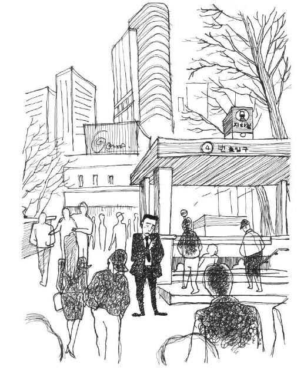
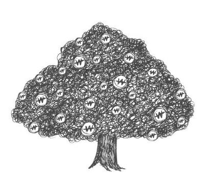
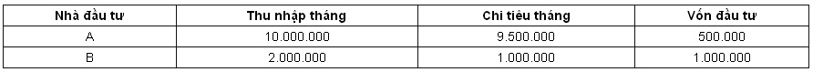
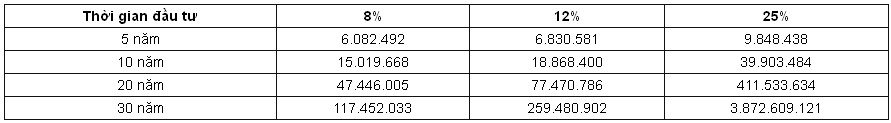
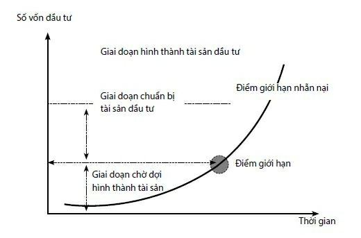
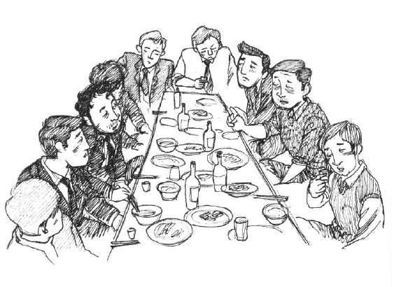
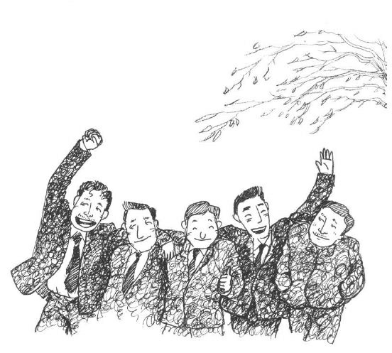
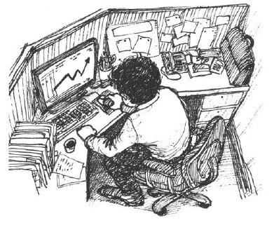

# Chương 5: Chiến lược đầu tư đem lại lợi nhuận theo cấp số nhân

## Bình tĩnh nhìn nhận “Tin tức nội bộ”

Đã hết giờ ăn trưa, Do Jihae đành phải mua một chiếc xúc xích để chống đói, vừa ăn vừa bận rộn gọi điện thoại.

“Tôi đây, ông dạo này thế nào?”

Do Jihae đang gọi điện thoại cho cậu bạn học cấp 3, sau mấy câu chào hỏi, anh mới nói đến chuyện vay tiền.

“Chắc chắn đấy! Đây là thông tin do bạn tôi tiết lộ, lần này không cần phải suy nghĩ nữa cứ trực tiếp thả vào là tiêu diệt được ngay, tôi dám chắc 100% đấy, nên ông cho tôi vay trước 150.000 Won, sau này tôi sẽ trả cho ông cao hơn cả lãi ngân hàng.”

Hai người nói chuyện rất lâu, sau đó Do Jihae chỉ nghe thấy tiếng gác máy cạch một cái, đầu dây bên kia đã tắt máy.

“Ui giời, đồ keo kiệt, đã nói là chỉ vay một thời gian sẽ trả ngay… thế mà? Nào là chơi cổ phiếu giống như đang đánh bạc này? Chơi cổ phiếu không phải là đánh bạc thì là cái gì? Nếu như không chơi thì biết đến bao giờ mới có tiền? Đúng là đồ ngốc!”

Do Jihae lẩm bẩm một mình và nhét tọt miếng xúc xích vào miệng. Anh tìm khắp các số liên lạc trong danh bạ điện thoại, nhưng cũng không thể tìm được người nào có thể vay tiền. Bỏ điện thoại vào túi, anh cảm thấy rất bức bối. Tuy cách đó không lâu chỉ vì tin tình báo sai mà đã bỏ lỡ cơ hội kiếm rất nhiều tiền, nhưng theo anh đó chỉ là do anh chưa gặp may, còn đây lại là cơ hội tuyệt vời để cứu vãn lại những tổn thất ơ trước đây, nhưng khả năng tài chính của anh lại không cho phép, điều này khiến anh rối bời.

“Mẹ kiếp, cái trò cổ phiếu này phải đầu tư nhiều thì mới mong có sản phẩm lớn… chỉ dựa vào mấy đồng tiền thưởng của mấy hôm trước làm sao mà đủ được, nếu như bỏ hết số tiền này vào cổ phiếu thì cũng chả kiếm được mấy đồng.”

Do Jihae chuẩn bị dùng số tiền thưởng ném vào cổ phiếu, anh đã chạy đôn chạy đáo khắp nơi để nghe ngóng tin tức nội bộ, cuối cùng anh cũng nắm bắt được một cơ hội, công ty mà một người bạn đang làm sắp bí mật sáp nhập, anh cảm thấy đây quả là một cơ hội trời cho, nếu như bỏ lỡ thì quá là ngu xuẩn.

“Khi cơ hội đến tại sao mọi người lại không nắm bắt ngay nhỉ, cái thằng ngu này, mỡ dâng đến miệng rồi còn chê.”

Sau khi hết giờ làm, Do Jihae gặp người bạn đã cung cấp thông tin nội bộ để nói chuyện, việc công ty sáp nhập vẫn đang được tiến hành, không có gì thay đổi, điều này lại khiến anh đứng ngồi không yên.

“Cứ tiếp tục như thế này không phải là biện pháp khả thi, mỗi một giây một phút bây giờ đều vô cùng quý giá, phải nhanh chóng tìm cách giải quyết mới được!”

Sau khi chia tay bạn, Do Jihae bước nhanh trên đường với một tâm trạng rối bời, gọi điện không được đành phải đi tìm gặp thôi. Sau khi tiễn đưa mùa hè oi ả, mùa thu với tiết trời mát mẻ khiến bước chân của những người đi đường cũng trở nên nhẹ nhõm hơn.

“Thời tiết hôm nay đẹp quá, mình phải quyết tâm hơn mới được.”

Đi đến gần bến tàu điện ngầm, Do Jihae chợt nhớ ra công ty của Choe Socheon cũng ở gần đây.

“Đúng rồi, nghe nói anh Socheon cũng đang chơi cổ phiếu, nếu như mình nói cho anh biết thông tin này, không chừng anh ý còn bảo mình tính thêm phần của anh ý nữa. Trời, sao mình không sớm nhớ ra anh Socheon nhỉ?”

Do Jihae vội vàng gọi cho Choe Socheon, đúng lúc Choe Socheon đang chuẩn bị về, Do Jihae hẹn gặp Choe Socheon ở gần đó.

“Anh ơi, em ở đây.”

Choe Socheon vừa bước vào quán cà phê, đã thấy Do Jihae mừng rỡ vẫy tay.

“Có việc gì vậy, hôm nay là ngày cuối cùng của tháng Mười, chẳng phải thích hợp cho một người ngồi ở nhà để ôn lại tình xưa nghĩa cũ hay sao?”

Một câu nói đùa khiến cả hai người cười phá lên, Do Jihae gọi nhân viên phục vụ.

“Hay hôm nay thưởng thức cà phê kiểu Mỹ đi ạ? Hôm nay em mời.”

Hai người vừa uống cà phê vừa nói chuyện về câu lạc bộ, sau đó lại nói về những sự kiện nóng trong nước và thế giới, nhưng Do Jihae dường như không mấy để tâm đến nội dung trò chuyện.

“À, cậu tìm anh có việc gì vậy? Hình như câu lạc bộ cũng không có chuyện gì, tối mịt tối mờ này hẹn anh chắc không chỉ có những chuyện quốc gia đại sự này chứ?”

Choe Socheon cảm thấy không nên lãng phí thời gian để ngồi đây nói chuyện phiếm như vậy, tốt nhất là đi thẳng vào vấn đề. Do Jihae lại có đôi chút ngượng ngùng, anh gượng cười và nói ra ý định của mình:

“Cũng không có việc gì lắm, anh này, anh cũng đang chơi cổ phiếu đúng không? Lần này em lấy được một thông tin cực kỳ tin cậy… Trên thực tế cổ phiếu nếu chỉ dựa vào việc công bố kết quả kinh doanh và phân tích của cá nhân thì rất khó có thể kiếm được nhiều tiền, những người chơi cổ phiếu chuyên nghiệp đều chia sẻ với nhau những tin tức nội bộ.”

Nghe Do Jihae nói vậy, Choe Socheon lập tức nhận thấy có một dự cảm không hay nào đó, tuy bản thân biết Do Jihae cũng chơi cổ phiếu, nhưng anh chưa bao giờ bàn luận về cổ phiếu với cậu ta, vì những người tham gia câu lạc bộ đều nói rằng chơi cổ phiếu và đánh bạc chẳng có gì khác nhau.

“Cái gì, tin tức nội bộ, sao cậu ta lại nói với mình về thông tin có thể kiếm bộn tiền? Xem ra cậu ta hẹn gặp không chỉ vì thông báo cho mình thông tin đó…”

Nghĩ đến đây, Choe Socheon cảm thấy bất an.

“Hay anh cũng đầu tư đi ạ? Nếu như anh còn dư tiền, có thể cho em vay một ít để làm vốn đầu tư được không?”

Dự cảm không hay đã thành hiện thực, Do Jihae thông báo cho Choe Socheon một thông tin không chính thống dường như được tiết lộ từ thị trường chứng khoán, nếu chỉ dựa vào một nguồn tin không đáng tin cậy này mà đến vay mình tiền, Choe Socheon thật sự muốn rời khỏi chỗ này ngay lập tức.

Thực ra, nếu như thời gian trước đây, khi có được thông tin này chắc chắn Choe Socheon sẽ dỏng tai lên nghe, nhưng sau khi được Giáo sư Masu khuyến cáo, Choe Socheon đã học được cách căn cứ vào quy mô tài sản của mình mà từng bước tích lũy, không tiếp tục ôm mộng sau một đêm bỗng trở thành triệu phú nữa.

“Bây giờ anh đã không còn hứng thú với cổ phiếu nữa… anh bận rồi, anh phải về đây.”

Nhìn thấy Choe Socheon toan đứng dậy ra về, Do Jihae bắt đầu cảm thấy căng thẳng, kiểu gì cũng phải khuyên Choe Socheon.

“Jihae này, hi vọng cậu đừng chê anh nói nhiều, cổ phiếu là một cách quản lý tài chính về thu nhập tăng thêm sau khi trừ đi tiền lương của những người làm công ăn lương như anh em mình, nhưng cậu phải biết nó vẫn thuộc vào phạm vi của quản lý tài chính, chúng ta không thể ôm mộng sau một đêm trở thành triệu phú, nếu như vậy nó và xổ số có gì khác nhau đâu? Anh nghe nhiều người nói rằng cậu chơi cổ phiếu giống như đang đánh bạc, kiểu chơi này không thể gọi là quản lý tài chính được, hơn nữa còn rất dễ bị những thông tin giả làm cho sai lệch…”

“Ai nói như vậy? Ai dám nói là em đánh bạc?”

“Không phải nói là cậu đánh bạc, mà là cậu chơi cổ phiếu giống như đang đánh bạc…”

Choe Socheon rất ngạc nhiên trước phản ứng gay gắt của Do Jihae, đương nhiên những lời anh nói hơi quá một chút, với phản ứng như vậy của Do Jihae e rằng anh có nói nữa cũng không khuyên được.

Do Jihae cúi đầu trầm ngâm hồi lâu, bưng cốc nước uống một hơi, sau đó nói:

“Anh à, nếu như anh không đồng ý cũng không hề gì, đầu tư hay không hoàn toàn do anh quyết định, em cũng không có gì để nói cả.”

Do Jihae uống một hơi cạn cốc cà phê.

“Anh à, em rất xin lỗi vì đã nổi giận với anh, nhưng nói thẳng ra, cổ phiếu chẳng phải là đánh bạc sao? Những người kiếm bộn tiền nhờ cổ phiếu về cơ bản không khác việc mua xổ số trúng thưởng là mấy, do đó em cũng muốn kiếm tiền bằng việc chơi cổ phiếu.”

Do Jihae ấm ức bao biện, anh ta nhìn đồng hồ, dường như muốn kết thúc buổi nói chuyện ngày hôm nay, Choe Socheon cũng không biết phải nói gì, anh vốn dự định nói cho Do Jihae biết về quan điểm quản lý tài chính của Giáo sư Masu, nhưng xem ra cậu ta không muốn nghe nên anh đã quyết định không nói nữa.

Lẫn trong dòng người tấp nập, Do Jihae vô cùng buồn bã, đến cổng vào của bến tàu điện ngầm, anh châm một điếu thuốc, bắt đầu suy nghĩ tiếp theo là đến gặp ai, nhưng nghĩ mãi vẫn không nghĩ ra người thích hợp.

“Chi bằng về nhà để nghiên cứu lại cổ phiếu này đã, một thông tin quan trọng như vậy, báo chí và thông tin chứng khoán lại không hề nhắc đến?”

Nhưng anh ta lại nghĩ, sự sáp nhập lần này được tiến hành hết sức bí mật, chắc chắn là không để lọt thông tin ra bên ngoài, cho dù thế nào, bản thân đã có được thông tin nội bộ mà người khác không biết, chỉ cần chuẩn bị đủ tiền là được. Trên đường về nhà, Do Jihae liên tục gọi điện cho mọi người để vay tiền, nhưng càng gọi càng thất vọng. Anh không thể vay tiền của anh em hoặc họ hàng, vì sự việc của Song Huiseong trước đó là một bài học đắt nhất, anh không muốn kéo người nhà dính vào việc này.

“Đợi đã, thông tin này không có gì đáng ngờ, vậy tại sao không trực tiếp vay ngân hàng nhỉ? Nếu như đúng như cậu ta nói, có một khoản tiền lớn như vậy còn lo gì việc không có tiền trả? Hơn nữa chẳng bao lâu sẽ biết được kết quả, lãi suất cũng chẳng đáng là bao.”

Do Jihae bất giác nắm chặt tay, anh đã quyết định, bản thân chắc chắn có thể kiếm được một khoản thu nhập không nhỏ, vậy thì không có gì phải lo lắng vấn đề trả nợ nữa, đi vay ngân hàng thôi!

## Đầu tư không như đánh bạc, phải để

## lại một con đường sống

Choe Socheon giữ chặt cốc cà phê đã nguội lạnh trong tay, thẫn thờ nhìn ra ngoài cửa sổ, mùa đông lạnh giá đã qua đi nhưng Seoul vẫn chẳng mang hơi hướng gì của mùa xuân, cả thành phố xám xịt, đường phố náo nhiệt bị gió cát bao trùm cũng mất đi sức sống vốn có của nó.

Đó là một ngày tháng Ba, đã mấy ngày nay thành phố liên tục hứng chịu những đợt bão cát. Hôm nay anh lại nhận được một thông tin không hay, bệnh tình của Song Huiseong ngày một xấu đi, anh ấy lại phải nhập viện lần nữa, người nhận được thông tin này đầu tiên là O Junbi, lúc đó cậu ta đang ở bên ngoài có chút việc, sau khi từ bệnh viện thăm Song Huiseong trở về, O Junbi buồn bã nói với Choe Socheon là nên nhanh chóng đi thăm Song Huiseong.

“Sao thế, lại vào viện rồi à, mùa thu năm ngoái sau khi ra viện không hề nhận được một thông tin gì của anh ấy, tôi cứ nghĩ là bệnh tình của anh ấy đã thuyên giảm, nhưng anh ấy không có một loại bảo hiểm nào cả, giờ phải làm thế nào đây…!”

Công việc ở công ty khiến Choe Socheon mệt nhoài, nhưng anh vẫn phải vào thăm Song Huiseong. Câu lạc bộ lâu lắm rồi không tổ chức hoạt động gì, hơn nữa anh cũng bận xử lý công việc của công ty và kế hoạch tài chính của bản thân, lâu rồi không liên hệ với Song Huiseong, không thể ngờ anh ấy lại nhập viện lần nữa, điều này khiến Choe Socheon cảm thấy hơi áy náy.

Hết giờ làm, Choe Socheon đến viện thăm Song Huiseong. Sau khi nghe bác sỹ nói tình hình của anh ta không mấy lạc quan, lòng dạ anh rối bời, người mắc bệnh ung thư giai đoạn cuối rất đau khổ, nhưng nỗi đau khổ của người nhà bên giường bệnh cũng không kém gì người bệnh, Choe Socheon cũng chỉ có thể lặp lại những lời an ủi, cuối cùng không thể chịu đựng thêm nữa, anh đã rời khỏi phòng bệnh.

Vì để đến bệnh viện trước khi hết thời gian thăm viếng bệnh nhân, Choe Socheon vẫn chưa ăn cơm tối, sau khi ra khỏi cổng viện, bụng anh sôi lục bục, do đó anh đi vào một quán ăn gần đó để nhét cái gì đó vào bụng thì phát hiện ra Do Jihae đang ngồi uống rượu một mình, trên bàn có một bát canh khoai tây. Ban nãy vợ của Song Huiseong cho biết Do Jihae cũng vừa đến bệnh viện, nhưng anh không ngờ lại gặp cậu ta ở đây. Kể từ buổi gặp mặt vào mùa thu năm ngoái, hai người vẫn chưa liên hệ lại, do đó lần gặp này ít nhiều cũng hơi gượng gạo, nhưng bất luận thế nào cũng không thể thấy mà như không thấy được.

“Do Jihae, sao lại một mình uống rượu thế này, có chuyện gì không vui à?”

Choe Socheon ngồi xuống chiếc ghế đối diện với Do Jihae.

“Ồ, là anh à, thật trùng hợp, anh cũng đến thăm anh Huiseong à?”

“Ừ, ra khỏi viện bụng anh sôi ùng ục, nên phải vào đây ăn chút gì. Xem ra sau khi thăm anh Huiseong, cậu cũng cảm thấy buồn nên đến đây uống rượu một mình à?”

Sau khi ngồi xuống anh mới phát hiện ra Do Jihae đang rất tâm trạng.

“Đúng, cũng có nguyên nhân đó ạ, nhưng em cũng có nỗi buồn riêng.”

Nhìn vẻ ủ rũ của Do Jihae, Choe Socheon dường như đã phần nào đoán ra, chắc chắn có liên quan đến câu chuyện xảy ra giữa anh và cậu ta vào tháng Mười năm ngoái.

Mặc dù Do Jihae đang gặp phải khó khăn, nhưng trong mắt của Choe Socheon, cậu ta vẫn luôn là người rất lạc quan.

“Thế giới này những việc không như ý quả là nhiều quá anh ạ!”

Do Jihae im lặng, Choe Socheon rót rượu vào cái cốc trước mặt Do Jihae, Do Jihae trân trối nhìn cốc rượu, một lúc sau mới nói:

“Gần đây anh có chơi cổ phiếu không ạ?”

“Hừ, cũng không kiếm được đồng nào, mà lại còn đau hết cả đầu, nên cuối cùng anh đã bán tháo hết. Cậu còn nhớ trước đây anh đã từng nói với cậu rằng chơi cổ phiếu không được quá ham, bây giờ anh giao tiền cho các chuyên gia quản lý rồi, chỉ có một vài dự án đầu tư gián tiếp nhỏ thôi.”

“Thế ạ, lúc đó nếu như nghe lời anh, thì bây giờ em đã không khuynh gia bại sản.”

“Cậu nói gì vậy? Cậu là cao thủ được mọi người công nhận cơ mà, hơn nữa cũng khá nhiều lần thành công, lần trước chẳng phải là cậu đã có được một tin tức nội bộ…”

“Cho dù là cao thủ thì có tác dụng gì hả anh, trên thực tế thì là tự mình đánh chết mình, bây giờ em không còn một xu dính túi, trở thành kẻ nghèo kiết xác anh ạ…”

“Rốt cuộc đã xảy ra chuyện gì vậy, cậu nói thẳng ra xem nào.”

“Anh à, anh em mình ăn trước đi đã, anh cũng đói rồi mà, ăn xong em sẽ tâm sự với anh ạ.”

Choe Socheon gọi một suất cơm trộn, rồi nhìn cậu em Jihae mặt mày ủ dột đang ngồi trước mặt, cơm đã được bưng đến nhưng Choe Socheon chỉ ăn được mấy miếng bèn đặt thìa xuống nghe câu chuyện của Do Jihae.

Do Jihae kể lại tường tận câu chuyện đã từng nhắc đến với Choe Socheon vào mùa thu năm trước, cậu bạn làm việc ở phòng kế hoạch công ty gốm sứ Dacheng tiết lộ cho cậu thông tin công ty này sắp sáp nhập, cũng vừa hay lúc đó cậu được lĩnh khoản tiền thưởng, đang đau đầu vì việc đầu tư vào đâu, cho nên cậu ta cho rằng đó là một cơ hội rất tốt, bèn lấy số tiền tiết kiệm cộng với khoản tiền thưởng và tiền vay ngân hàng đầu tư vào cổ phiếu gốm Dacheng.

“Ông Do, nếu chỉ dựa vào cảm tính nhất thời hoặc tin tức nội bộ để đầu tư, số tiền vất vả lắm mới kiếm được chắc chắn sẽ mất, ông cho rằng chỉ một mình ông biết thông tin mật này sao? Thực ra những thông tin nội bộ này đã sớm được tiết lộ. Muốn có được thành công trong đầu tư, phải lựa chọn cổ phiếu Bluechip để tiến hành đầu tư dài hạn.”

Giám đốc Kim phụ trách bộ phận khách hàng cá nhân đã giúp đỡ Do Jihae đầu tư cổ phiếu được hai năm nay, ông ta cho rằng tình hình kinh doanh của gốm Dacheng không ổn định, ông kiến nghị cậu phải biết hạ thấp rủi ro, nhưng Do Jihae lại cho rằng “rủi ro cao thì lợi nhuận mới cao” làm lý do để từ chối những lời khuyên của giám đốc Kim.

Do tự quyết không qua tư vấn nên mấy lần đầu tư trước đó Do Jihae đều gặp phải thất bại. Sau này cậu không tự quyết định nữa, tất cả các khoản đầu tư vào cổ phiếu, cậu đều nhất loạt nghe theo sự góp ý của giám đốc Kim, chỉ đầu tư vào cổ phiếu Bluechip. Nhưng với bản tính nóng vội, Do Jihae thường xuyên khi thị trường cổ phiếu có chút biến động liền cắt lỗ ngay, có chút lợi nhuận là lập tức bán tống bán tháo cổ phiếu. Giám đốc Kim tuy đã khuyến cáo cậu cách đầu tư như vậy rất nguy hiểm nhưng theo Do Jihae, nếu như chỉ đầu tư theo góp ý của giám đốc Kim, bản thân cậu chắc chắn sẽ bỏ lỡ cơ hội sau một đêm trở thành triệu phú, cuối cùng cậu đã quyết định dùng 20.000.000 Won tiền thưởng cộng với 30.000.000 Won tiền vay ngân hàng để đầu tư vào cổ phiếu Dacheng. Ban đầu giống hệt như những gì cậu ta nghĩ, sau khi thông tin sáp nhập được công bố, cổ phiếu này lập tức tăng liên tục, cậu ta cũng kiếm được chút ít, nhưng đó chỉ là một cái bẫy ngọt ngào, sang đến ngày thứ hai giá cổ phiếu của gốm Dacheng đứng giá, do đó nhà đầu tư bắt đầu đổ hàng ra thị trường nên đã gây ra hiện tượng bán tháo cổ phiếu, và kết cục là cổ phiếu này đã rớt giá thảm hại.

“Ông Do, bây giờ phải nhanh chóng bán tháo Dacheng, cổ phiếu này có vấn đề, tôi đã chẳng nói với ông chỉ nên đầu tư vào cổ phiếu Bluechip hay sao? Hôm nay bán ra hết vẫn còn kịp đấy.”

Giám đốc Kim nhắc đi nhắc lại điều quan trọng nhất trong đầu tư là phải tuân thủ nguyên tắc đầu tư, chỉ dựa vào một thông tin nào đó mà dốc hết tiền vào đó là rất nguy hiểm.

“Cứ chờ xem đã, bây giờ chẳng phải là cơ hội tốt để gia tăng lượng cổ phiếu hay sao? Tôi phải tiếp tục đầu tư thêm.”

Do Jihae như bị trúng tà, muốn lợi dụng cơ hội này để lấy lại tất cả những gì đã mất, anh lại vay thêm ngân hàng 30.000.000 Won, sau đó lại rút toàn bộ tiền lương hưu, tiền mở rộng diện tích nhà ở và tiền tiết kiệm định kỳ là 30.000.000 Won, tổng cộng là 60.000.000 Won để mua cổ phiếu gốm Dacheng.

Không lâu sau, gốm Dacheng tuyên bố hủy bỏ kế hoạch sáp nhập, điều này đã khiến cho cổ phiếu Dacheng rớt giá và chạm đáy. Trong tình hình các nhà đầu tư bán tháo cổ phiếu, Do Jihae đành phải bán số cổ phiếu trong tay, nhưng cũng chỉ thu lại được một nửa số tiền bỏ ra. Kể từ đó, con người nợ cao như núi này chỉ cần nghe đến hai chữ cổ phiếu là thấy hận thấy đau. Nhưng sau đó, khi thấy báo chí và ti vi đưa tin lợi nhuận của các quỹ đầu tư nước ngoài cao như thế nào, cậu ta lại có chút dao động. Cậu ta lại giằng xé giữa việc đầu tư hay không, nhưng tiếng nói “cuộc đời chính là một ván bài” vang lên từ sâu thẳm tâm hồn đã thôi thúc cậu ta đặt nhà lấy tiền đầu tư vào quỹ đầu tư Nhật Bản (Japan Fund) và Inđônêxia (Indonesia Fund). Chịu ảnh hưởng của suy thoái kinh tế thế giới, thị trường mới nổi này cũng xuất hiện thông tin lợi nhuận bằng không, thị trường cổ phiếu Nhật Bản và Indonesia lần lượt rớt giá, Do Jihae cũng không chịu nghe theo lời khuyên của nhân viên ngân hàng là nên giữ lại thêm một thời gian nữa, để chuộc lại toàn bộ số tiền bỏ ra, cậu ta cắn răng chịu tổn thất. Trong một thời gian ngắn, cậu ta đã vấp phải hai cú sốc lớn, hơn nữa với thực lực kinh tế hiện nay của cậu ta thì không còn cách nào khác. Nhưng điều khiến cậu ta đau khổ nhất là, sau khi lấy lại tiền không được bao lâu, thị trường lại đi vào ổn định, thị trường cổ phiếu lại trở về điểm tăng trưởng cao như trước đây.

Sau khi nghe những thất bại của Do Jihae, Choe Socheon nhớ lại bản thân anh trước đây cũng tự nhận mình là cao thủ trong giới cổ phiếu mà thua lỗ đầm đìa. Anh cảm thấy hối hận vì ban đầu đã không khuyên nhủ anh chàng nhất thời hồ đồ Do Jihae này, và cảm thấy mình thật là may mắn khi gặp được Giáo sư Masu. Nếu không gặp được Giáo sư, chắc chắn anh cũng sẽ giống như Do Jihae, để cứu vãn tổn thất mà đưa ra những quyết định sai lầm.

Sau khi về nhà, Choe Socheon vẫn đắm chìm trong suy nghĩ, cổ phiếu và quỹ đầu tư đều là những kênh đầu tư tốt chứ không giống như một số người nhận định là chúng không mang lại điều gì tốt đẹp, vì đứng từ góc độ của người làm công ăn lương, chúng đều là những biện pháp quản lý tài chính có hiệu quả, vấn đề ở chỗ không giống như đặt cược cho các cuộc đua ngựa, khi chơi cổ phiếu hay rót vốn vào quỹ đầu tư, chúng ta không thể vội vàng đưa ra quyết định, tất cả những thất bại này đều là do thói quen đầu tư sai lầm gây ra.

“Mình phải xin gặp Giáo sư Masu thêm một lần nữa, sau khi buổi hội thảo kết thúc mình vẫn chưa gặp lại Giáo sư, mình muốn nghe trực tiếp những ý kiến cụ thể của Giáo sư về vấn đề đầu tư.”

## Đầu tư và quản lý tài chính - Phương

## hướng quan trọng hơn tốc độ hàng vạn

## lần

Hôm nay Giáo sư Masu đến một công ty quản lý giám sát gần nơi Choe Socheon làm việc, sau khi nói chuyện với chủ tịch hội đồng quản trị của công ty đó xong, trên đường trở về, Choe Socheon đã gọi điện cho ông, hai người hẹn nhau gặp tại quán cà phê gần nhà. Choe Socheon đã kể cho Giáo sư nghe chuyện của Do Jihae, hi vọng Giáo sư có thể cho một vài ý kiến ở phương diện đầu tư.

“Trước khi tôi nói, cậu hãy nói về quan điểm của mình trước, theo cậu nguyên nhân dẫn đến thất bại trong đầu tư của anh bạn đó là gì?”

“Nguyên nhân chính là Do Jihae không nghe theo lời khuyến cáo về việc hạ thấp rủi ro của người môi giới chứng khoán, ngoài ra cậu ta không có chiến lược đầu tư dài hạn, chỉ quan tâm đến việc thành bại trước mắt, đây cũng là một nguyên nhân không thể coi nhẹ.”

“Cậu nói rất đúng, không xem xét đến rủi ro, chỉ nhìn thấy cái lợi trước mắt mà tiến hành đầu tư ngắn hạn là nguyên nhân trực tiếp dẫn đến thất bại của chàng trai trẻ đó, nhưng cậu có nghĩ đến nguyên nhân nào khác còn quan trọng hơn cái cậu vừa nói không?”

“Nếu nói như vậy thì đó là tính cách, đúng không ạ? Theo quan sát của em, Do Jihae là người có tính cách nóng vội.”

Choe Socheon nghĩ đến những biểu hiện của Do Jihae trong các hoạt động do câu lạc bộ tổ chức, theo anh đây chính là đáp án.

“Tính cách à… cũng có lý, nhưng tôi muốn đứng từ một góc độ khác để nhìn nhận vấn đề này, Do Jihae vì cái lợi trước mắt mà đắm chìm vào các dự án đầu tư ngắn hạn, đó là vì anh ta không có một mục tiêu đầu tư rõ ràng.”

“Mục tiêu đầu tư?”

“Con người ta khi đầu tư thường sẽ nói phải đạt được mục tiêu gì đó, nhưng cậu phải chú ý đến câu nói của họ, sẽ phát hiện mục tiêu mà họ nói chẳng qua chỉ là một vài kỳ vọng hết sức mơ hồ, khi chúng ta hỏi những người này ‘tại sao anh lại đầu tư?’, đáp án của hầu hết mọi người đều giống nhau, ‘muốn kiếm được nhiều tiền’, khi chúng ta tiếp tục hỏi ‘tại sao lại muốn kiếm nhiều tiền?’, thì họ đều cảm thấy người đưa ra câu hỏi này thật tẻ nhạt, tại sao lại có thể hỏi một câu vô nghĩa như vậy.”

Choe Socheon gật đầu lia lịa.

“Bây giờ, mọi người không còn coi trọng vấn ‘tài chính ổn định’ nữa, điều mà họ quan tâm nhất là chỉ có người thành công mới có thể hưởng thụ ‘tự do về tài chính’. Chính vì vậy, rất nhiều người sẽ coi việc thông qua quản lý tài chính kiếm được nhiều thu nhập hơn làm mục tiêu cuối cùng, điều này là nguyên nhân trực tiếp khiến họ bỏ qua những nguyên tắc đầu tư, chỉ quan tâm đến việc theo đuổi lợi ích ngắn hạn trước mắt, cuối cùng sẽ bị rơi vào vòng xoáy đầu tư và không thể rút chân ra được.”

Giáo sư Masu chỉ ra rằng Do Jihae đang ở vào tình trạng như thế này.

“Những người này chỉ cần thấy thị trường cổ phiếu hoặc thị trường bất động sản bắt đầu tăng giá liền lập tức lao vào, sau đó không đợi đến thời cơ tốt nhất mà chỉ cần thấy có hiện tượng rớt giá là lại nhanh chóng bán tháo toàn bộ. ớt Tuy nhiên, sau khi bạn có một mục tiêu tài chính rõ ràng, đồng thời có lòng tin vững chắc vào mục tiêu này, thì cho dù bạn là người có tính cách nóng vội, cũng sẽ dần dần có được nghị lực và kiên nhẫn, cậu thấy có đúng không?”

Nhấp một ngụm cà phê rồi lại uống một ngụm nước mát, Giáo sư Masu, thưởng thức hương vị độc đáo của cà phê đặc, đã chỉ ra nguyên nhân của vấn đề.

“Xem ra đúng là như vậy ạ, trong thời gian chơi cổ phiếu, trong đầu em lúc nào cũng chỉ nghĩ đến việc làm thế nào để có thể kiếm được thật nhiều tiền, nhưng lại không hề nghĩ đến việc đặt ra cho mình một mục tiêu cụ thể.”

Choe Socheon chợt nhớ đến một anh bạn học khóa trên thời đại học, trong cuộc sống anh ta là người nóng vội, nhưng khi đầu tư cổ phiếu thì lại vô cùng thận trọng, luôn kiên trì đầu tư dài hạn, hết sức chú trọng vào tính ổn định trong lợi ích của đầu tư cổ phiếu, từ ví dụ của anh ta cũng có thể thấy rằng tính cách cũng có quan hệ nhất định với việc đầu tư nhưng lại không phải là nguyên nhân căn bản dẫn đến thất bại.

“Giả dụ như cuối cùng cậu cũng đã lên được máy bay đi du lịch nước ngoài, trong thời khắc máy bay đang chạy trên đường băng để chuẩn bị cất cánh, lúc đó chắc chắn là cậu sẽ vô cùng hưng phấn, nhưng sau khi máy bay cất cánh không lâu, trong khoang máy bay bỗng vang lên tiếng nói của cơ trưởng: ‘Kính thưa quý vị, hiện nay chúng ta đã bay trên bầu trời với một tốc độ cực nhanh nhưng chúng ta vẫn không thể xác định sẽ hạ cánh ở đâu’, cậu thử nghĩ xem, lúc đó tâm trạng cậu sẽ thế nào?”

“Ý của thầy là phương hướng quan trọng hơn tốc độ đúng không ạ, trong buổi diễn thuyết lần trước của thầy, em đã cảm nhận được rất rõ điều này, em nhận thấy rằng ‘ba tài sản lớn’ mà thầy nêu ra chính là mục tiêu đầu tư của em ạ.”

Giáo sư Masu gật đầu, tiếp tục nói về vấn đề “mục tiêu đầu tư”:

“Muốn xác định rõ ba tài sản lớn để tiến hành đầu tư và tích lũy, thì chúng ta phải ‘quản lý tài chính có mục tiêu’, đây chính là nội dung trọng tâm mà tôi muốn nói. Không có mục tiêu rõ ràng, phương pháp và lý thuyết dù tốt đến mấy cũng như nước chảy bèo trôi. Đầu tư của chúng ta cũng vậy, điều quan trọng nhất là trước hết phải làm rõ vấn đề tại sao lại đầu tư. Những người có mục tiêu rõ ràng nếu có thể xây dựng một kế hoạch đầu tư có lợi cho việc đạt được mục tiêu, và tập trung toàn bộ sức lực vào việc thực hiện kế hoạch đầu tư đó, chắc chắn sẽ bất ngờ phát hiện ra rằng đầu tư đã thu được hiệu quả ngoài mong đợi.”

Choe Socheon nuốt lấy từng câu từng chữ của Giáo sư, và Giáo sư cũng hưng phấn hơn bởi sự nhiệt tình của anh, ông mỉm cười tiếp tục giải thích:

“Tôi đã gặp rất nhiều người bị mất phương hướng trong cơn lũ thông tin tài chính kinh tế, ước mơ rất nhiều, lúc thế này, lúc thế khác, bận rộn đến mức quên cả niềm vui, nhưng cuộc đời con người làm sao chỉ có thể sống dựa vào ước mơ?”

Giáo sư Masu khuyến cáo Choe Socheon không nên lẫn lộn số lượng đầu tư với thành quả đầu tư.

“Cuộc sống không có mục tiêu sẽ bị người khác dắt mũi, cuộc sống như vậy rất tẻ nhạt, cũng với chân lý như vậy, nếu quản lý tài chính không có mục tiêu, cũng sẽ giống như lâu đài cát, dễ dàng bị sóng biển làm sụp.”

“Cuộc sống không có mục tiêu… quản lý tài chính không mục tiêu…”

Lúc này Choe Socheon mới phát hiện ra rằng, mình mới chỉ biết đến việc chăm chỉ kiếm tiền, nhưng lại không biết phải chuẩn bị sẵn sàng để đối phó với những nguy hiểm luôn rình rập nhưng không thể đoán trước, và bị ước muốn mãnh liệt trở nên giàu có đã làm mờ hai mắt.

“Cậu còn nhớ hai mục tiêu tài chính trước đây tôi đã từng nói với cậu không? Ít nhất là mỗi tháng phải trích 5% và 15% thu nhập đầu tư cho khoản tài sản bảo đảm và tài sản dưỡng già, đồng thời cậu còn phải trả hết tất cả nợ nần, đương nhiên khoản nợ này không bao gồm khoảng 30% thu nhập mỗi tháng dành để trả khoản vay tiền đặt cọc mua nhà, thế nào, cậu có làm được không?”

Giáo sư Masu hỏi Choe Socheon liệu có thể chuẩn bị tốt tài sản bảo đảm và dưỡng già cho mình được không.

“Dạ, được ạ, kể từ sau khi nghe những lời dạy bảo của thầy quyết tâm trở thành ‘chủ nhân của đồng tiền’, em đang cố gắng trả nợ, để tránh những rủi ro phát sinh em cũng đã có tài sản bảo đảm, đồng thời cách đây không lâu em cũng đã bắt đầu chuẩn bị tài sản dưỡng già cho mình nhằm đối phó với cuộc sống sau khi về hưu không có thu nhập ạ.”

Choe Socheon nói về việc mình đã và đang chuẩn bị tài sản bảo đảm và tài sản dưỡng già, đồng thời bổ sung rằng bản thân tràn đầy niềm tin vào cuộc sống tương lai.

Giáo sư Masu dặn Choe Socheon nếu đã bắt đầu thực hiện hai mục tiêu này, thì bước tiếp theo phải tập trung sức lực nhiều hơn vào việc tích lũy các tài sản đầu tư khác như tiền học cho con cái, tiền nhàn rỗi, tiền mua nhà…

## Mấu chốt của thành công là xác định

## đúng mục tiêu

“Đúng vậy, trong điều kiện tài sản bảo đảm và tài sản dưỡng già đều được bảo đảm, phải bắt đầu tích lũy tài sản đầu tư, nếu như từ hôm nay cậu đã xác định được mục tiêu đầu tư, thì tiếp theo sẽ xuất hiện những sự việc thần kỳ.”

Trước đó Choe Socheon đã từng phải nếm mùi thất bại, nên câu nói này của Giáo sư Masu khiến anh rất vui, anh kéo ghế xích lại gần Giáo sư hơn một chút.

“Như cậu đã biết, thu nhập bình quân năm của một gia đình bình thường là 40.000.000 Won, như vậy trong cuộc đời mình, người chủ gia đình sẽ có trong tay khoảng 1.200.000.000 Won, một số tiền lớn đúng không? Nếu chỉ tính đến điều này, phần lớn người chủ gia đình đều có thể trở thành triệu phú, nếu họ biết cách quản lý, khoản tiền lớn này sẽ tăng gấp mấy chục lần thậm chí mấy trăm lần. Nhưng ngược lại, nếu không để tâm, họ sẽ dễ dàng bỏ lỡ cơ hội này, thậm chí còn vô tình đánh mất khoản tiền này và khiến gia đình mình rơi vào khủng hoảng, những ví dụ như thế này rất nhiều.”

“Ngược lại với kỳ vọng của bản thân, cuối cùng đánh mất khoản tiền này, điều này rất có thể xảy ra, nhưng chẳng lẽ còn có người vứt số tiền đó đi sao ạ?”

“Do Jihae chẳng phải như vậy sao? Cậu ta cũng không thể coi là đánh mất số tiền này, mà là tự mình vứt tiền đi, đầu tư nhưng không hề có bất kỳ mục đích gì, và không xem xét đến bất kỳ rủi ro nào, chỉ thấy cái lợi trước mắt là lao vào, điều này khác gì so với Donkihote bất chấp tất cả để lao vào cối xay gió? Do đó, gọi cách đầu tư này là ném tiền qua cửa sổ là hợp lý hơn cả.”

Nếu suy xét kỹ thì quả đúng như vậy, Do Jihae có thu nhập rất cao, trong vòng 5 năm qua, mỗi năm thu nhập gần 100.000.000 Won, nhưng bây giờ thì không một xu dính túi, cậu ta cũng không tiêu pha hoang phí, nhưng tiền thì lại cứ đội nón ra đi.

“Trong cuộc sống, tiền rất quan trọng, nhưng làm thế nào để kiểm soát tiền, ngay cả ở trường học, cũng không ai dạy cho cậu cả, vì vậy mới xảy ra những câu chuyện tưởng như hoang đường. Thực ra trong cuộc sống, nếu từng bước phân tích những hỉ nộ ái ố mà chúng ta cảm nhận được, sẽ phát hiện ra rằng phần lớn những cung độ tình cảm này đều có liên quan đến tiền bạc, bạn có thể duy trì tâm trạng bình thường hay đang rơi vào trạng thái bất an, tất cả đều được quyết định bởi việc chúng ta làm thế nào để kiểm soát được số tiền chúng ta có được. Về sau cậu cũng phải bỏ công bỏ sức ở phương diện này, để tránh bản thân phạm phải sai lầm trong vấn đề tiền bạc, chỉ cần việc kiểm soát tiền bạc của cậu đạt đến mức độ thành thục, lúc đó hạnh phúc sẽ luôn mỉm cười với cậu.”

Giáo sư Masu nhìn Choe Socheon, trên mặt lộ rõ vẻ hài lòng khi thấy Choe Socheon có thể thay đổi giá trị quan theo hướng mà ông đã chỉ, ông có cảm giác như được đứng trên bục giảng.

Sau khi uống hết cà phê trong cốc, Giáo sư Masu lại nhắc nhở Choe Socheon còn có một điểm phải chú ý:

“Trước khi đầu tư cậu phải ghi nhớ một điều, cho dù là ai, nếu đầu tư đều mong kiếm được nhiều tiền, do đó, có một số người có những hành động mạo hiểm, không xem xét đầu tư nên bắt đầu thế nào, do đó đã bị khoản lợi nhuận khổng lồ không thực tế làm lóa mắt, cuối cùng mất phương hướng, anh bạn Do Jihae của cậu là một ví dụ điển hình.”

Choe Socheon đồng tình với Giáo sư và lắng nghe Giáo sư phân tích:

“Nhưng điều đáng chê trách là, những người kiếm được khoản tiền lớn lại luôn bắt đầu chặng đường đầu tư của mình bằng một đồng giấy bạc, có nghĩa là, trong đầu tư cậu phải nhận thức rõ tầm quan trọng của vốn đầu tư, phải ghi nhớ rằng, khi cậu tùy tiện vứt đi đồng bạc mà có thể ươm thành mầm, cái cây phát tài của cậu trong tương lai cũng dần dần chết khô, những người giàu tạo ra các khối tài sản khổng lồ đều rất tin tưởng bản thân có thể nuôi dưỡng cái mầm với giá trị một đồng trở thành một cái cây cao trọc trời, và họ cũng ươm trồng từng chiếc mầm tiền đó xuống mảnh đất màu mỡ.”

Nhưng cái mầm của tiền bạc rốt cuộc là cái gì đây?

“Trong giới đầu tư, cái mầm của tiền bạc được coi là vốn, nhưng làm thế nào để có vốn? Phần lớn vốn đầu tư có được nhờ quá trình làm việc chăm chỉ của cậu, những triệu phú tay trắng làm nên sự nghiệp đều không ngừng tạo ra thu nhập, tiếp đó đem một phần thu nhập có được để đầu tư, cuối cùng có được cái cây phát tài cành lá sum suê. Nhưng cậu hãy nhìn Do Jihae, cậu ta có một công việc với điều kiện cũng như đãi ngộ tốt hơn những người bình thường khác, do đó chất lượng của những chiếc mầm mà cậu ta có được cũng tốt hơn những người xung quanh, nhưng đáng tiếc là cậu ta lại không biết lợi dụng vũ khí lợi hại đó, đem tiền đầu tư lung tung, kết quả là cậu ta đã mất cả chì lẫn chài. Cậu hãy xem cái này nhé!”

Giáo sư Masu đặt tách cà phê sang một bên, và mở máy tính xách tay.

(Đơn vị: Won)

“Theo cậu sau 10 năm, nhà đầu tư A hay B trong bảng trên ai sẽ tích lũy được nhiều tài sản hơn?”

“Theo như bảng trên thì A thu nhập nhiều hơn, nhưng nếu phán đoán theo số vốn đầu tư của hai người, thì tài sản của B sẽ nhiều hơn ạ.”

“Đúng vậy, tuy thu nhập của B rất ít, nhưng anh ta biết được tầm quan trọng của thu nhập hàng tháng, nên khá tiết kiệm, và thận trọng đầu tư, cho nên vốn đầu tư nhiều hơn của A, ngược lại, A do chi tiêu quá đà và không coi trọng đầu tư, nên đã mất đi rất nhiều vốn đầu tư.”

Giáo sư Masu dùng bút bi chỉ vào cột “vốn đầu tư” và “thu nhập tháng” của B, và nhìn thẳng vào đôi mắt của Choe Socheon.

“Tài sản của Warren Buffett đứng hàng đầu trên thế giới, một trong những bí quyết để dẫn đến thành công của ông đó là ‘tiết kiệm và đầu tư’, khi còn trẻ ông đã biết phải có kế hoạch cho tương lai, nên đã tiến hành đầu tư và tiết kiệm, cho dù là một đô la cũng không tiêu lung tung, và luôn kiểm soát chi tiêu chỉ trong phạm vi thu nhập, chính thói quen đầu tư này đã giúp ông có được một con ngỗng ngày nào cũng biết đẻ trứng vàng, và với con ngỗng này ông đã trở thành một trong những người giàu nhất nước Mỹ, trở thành thần tượng của rất nhiều bạn trẻ, do đó càng trẻ càng phải hiểu được giá trị của số vốn ít ỏi và giá thành cơ hội của nó.”

## 4.000 Won mỗi ngày, 40.000.000

## Won sau 10 năm và 3.800.000.000

## Won sau 30 năm

Sau khi chăm chú lắng nghe Giáo sư giải thích, Choe Socheon đã nêu ra một câu hỏi:

“Thưa thầy bây giờ em đã nhận thấy rõ tầm quan trọng của tiền lương, nhưng nếu chúng ta chỉ dựa vào thu nhập và quản lý tiền bạc để nuôi trồng ‘mầm tiền’ thành một cây cao chọc trời chẳng phải sẽ mất rất nhiều thời gian đúng không ạ?”

Về nguyên tắc, Choe Socheon trước tiên đồng ý với việc phải gieo mầm tiền bạc, nhưng anh e rằng thời gian để cho chiếc mầm đó lớn thành cây to sẽ rất dài, Giáo sư Masu phá lên cười trước sự lo lắng của anh, nhưng ông vẫn nhẫn nại giải thích:

“Vấn đề ‘thời gian’ mà cậu nhắc đến cũng là một bí mật để tạo ra tài sản đầu tư, nếu không biết cách lợi dụng thời gian, chắc chắn sẽ rất khó tạo ra tài sản đầu tư như ý. Chúng ta thường thấy rất nhiều người nóng lòng muốn phải giàu lên nhanh chóng trong một thời gian ngắn, nhưng càng nóng lòng bao nhiêu thì càng dễ rơi vào cái bẫy của tiền bạc, lúc đó đừng mơ đến làm giàu, không khéo còn trở thành nô lệ của đồng tiền. Nhưng có một điểm cậu phải ghi nhớ, thời gian vĩnh viễn không bao giờ duy trì một tốc độ, nhưng cậu sẽ luôn cảm thấy thời gian trôi đi rất chậm, không biết đến bao giờ mới có được tài sản đầu tư như mình mong muốn, tuy nhiên sau khi cậu đã bước lên con đường tăng tốc để thành công, tất cả chẳng qua chỉ là sự việc trong nháy mắt, trong thời gian chưa đến một ngày thậm chí sẽ có được thành quả tương đương với cả một năm.”

Giáo sư Masu dường như đã biết trước câu hỏi của Choe Socheon nên ông trả lời rất bình thản, bởi lẽ ông hiểu rất rõ rằng, mọi người luôn có thái độ nôn nóng trước cái lợi của tiền bạc.

“Tôi sẽ lấy thêm một ví dụ nữa nhé. Những hộ giàu lên nhanh chóng hoặc những người nổi tiếng trong mắt mọi người thực ra cũng có một chặng đường vất vả chỉ có họ mới biết, nhưng họ biết chờ đợi, sự chờ đợi này không có thỏa hiệp cũng không có sự bỏ cuộc, cuối cùng vào một ngày nào đó trong phút chốc bỗng thu được thành công.”

“Thành công trong phút chốc? Giống như những nhà thơ bỗng trở nên nổi tiếng sau một đêm ạ?”

“Đúng vậy, nhưng hầu hết mọi người đều không có tính nhẫn nại, đều oán giận thời gian sao trôi đi quá chậm, khi họ vứt bỏ để quay đầu bước đi, thì họ đâu ngờ thành công đã ở rất gần họ, chỉ là do họ không đợi được đến giây phút đó, và rồi đón nhận sự thất bại, điều này cũng giống với Do Jihae không chờ đợi thị trường cổ phiếu hồi phục để lấy lại tiền đã mất, cậu nên nhớ một điều, *nếu không học được cách nhẫn nại,* *thành công sẽ không bao giờ chủ động đến gõ cửa nhà cậu.*”

Hai người nói chuyện quên cả thời gian, lúc này cà phê cũng đã nguội lạnh, Choe Socheon lại gọi thêm một cốc khác, Giáo sư Masu tiếp tục nói:

“Tôi sẽ tiếp tục nói cho cậu biết nguyên nhân tại sao không thể quá nóng vội. Ban nãy cậu gọi thêm một ly cà phê, tôi sẽ lấy luôn đó làm ví dụ nhé. Người trẻ thường thích uống cà phê, nhưng nếu mỗi ngày có thể tiết kiệm được 4.000 Won tiền cà phê, chúng ta hãy thử tính xem mình có thể tiết kiệm được bao nhiêu tiền nhé. Mỗi ngày 4.000 Won, với 20 ngày của mỗi tháng chúng ta có thể tiết kiệm được 80.000 Won, một năm là 960.000 Won. Như vậy đi, chúng ta hãy dùng excel để tính xem khoản tiền tiêu vặt đó có thể đem lại cho chúng ta bao nhiêu lợi nhuận. Nếu như dùng số tiền đó để đầu tư với thời gian ngắn là 5 năm, cho dù là tỉ lệ lãi suất kép có cao đến thế nào cũng không thể có được bao nhiêu lợi nhuận cả, nhưng nếu chúng ta đầu tư trong vòng 10 năm có thể sẽ thu được một khoản tiền lớn, tỉ lệ lợi nhuận 25% trong bảng là tỉ lệ lợi nhuận 20 năm của tỷ phú thông thái Warren Buffett, 12% là tỉ lệ lợi nhuận đầu tư dự kiến của thị trường mới nổi, với 4.000 Won tiền tiêu vặt mỗi ngày, sau một thời gian số tiền đó có thể biến thành mỏ vàng lớn lên tới 3.800.000 Won.

### Giả thiết mỗi ngày dành 4.000 Won tiền cà

### phê cho đầu tư, con số đó sẽ là 80.000 Won

**sau 20 ngày và 960.000 Won sau 1 năm**

(Đơn vị: Won)

“Chà, đúng là thần kỳ, trong vòng 30 năm, mỗi ngày tiết kiệm 4.000 Won tiền cà phê, có thể có được một thu nhập khủng là 3.800.000.000 Won…”

“Đây chính là sức mạnh của lãi suất kép, cho dù mỗi ngày chỉ cần tiết kiệm 4.000 Won cũng có thể tích lũy được một khoản tiền lớn, lãi suất kép giống như thực vật lấy thời gian là chất dinh dưỡng, khi mới sinh trưởng có thể tốc độ của nó rất chậm, nhưng sau một thời gian nó sẽ sinh trưởng với một tốc độ rất nhanh, và sẽ ngày càng nhanh hơn. Nếu như đầu tư khoảng 2-3 năm đã mong chờ sự xuất hiện của lãi suất kép, điều này cũng giống như việc hái quả xanh để ăn. Chúng ta bắt buộc phải đợi đến lúc trái ngọt, đừng bao giờ vì ăn phải quả xanh mà chê nó vừa nhỏ vừa chua. Muốn có được lợi ích do lãi suất kép đem lại, bắt buộc phải học cách chờ đợi, từ góc độ này, chúng ta nhận thấy một điều, sự tồn tại của lãi suất kép khiến chúng ta phải dành thời gian từ 20-30 năm để tích lũy tiền dưỡng già, có được khoản tiền này cuộc sống sau khi về hưu của chúng ta sẽ được bảo đảm.”

Sau khi được Giáo sư Masu giải thích về mối quan hệ giữa lãi suất kép và thời gian, Choe Socheon đã nhen nhóm tia hi vọng bản thân mình cũng phải có được một cây phát tài.

“Nhưng khi tận dụng thời gian cũng phải chú ý một điều, sự tăng trưởng của tài sản đầu tư không tỉ lệ thuận với thời gian. Trong giai đoạn đầu tiên của việc tích lũy tài sản, chắc chắn chúng ta sẽ phải đi rất nhiều đường vòng, nhưng đồng thời cũng sẽ đúc rút được rất nhiều kinh nghiệm, điều quan trọng nhất trong giai đoạn này là phải học cách nhẫn nại.”

Màn hình máy tính của Giáo sư Masu lại xuất hiện một đồ thị.

“Thông qua đồ thị này có thể thấy, trong một thời gian nhất định, tốc độ tăng trưởng của tài sản không rõ ràng, nhưng từ một điểm thời gian nào đó, tốc độ tăng trưởng sau điểm giới hạn sẽ giống như tốc độ tăng trưởng của quả cầu tuyết, nhưng rất nhiều người trong quá trình hình thành tài sản đã bỏ cuộc trước khi xuất hiện điểm giới hạn. Nhìn chung khi đầu tư nếu gặp một vài khó khăn nhỏ, mọi người đều có thể khắc phục, nhưng nếu mục tiêu không rõ ràng, rất nhiều người không thể kiên trì đến cùng, nên việc đầu tư chắc chắn gặp phải thất bại. Những nhà đầu tư ngắn hạn không có sự kiên trì cũng giống như các chú thỏ, sau nửa hành trình sẽ bị rùa ta cho rớt lại đằng sau, họ không thể kiếm được nhiều tiền. Do đó giai đoạn đầu tuy khó khăn một chút, nhưng không thể bỏ cuộc, phải quyết tâm đến cùng, đầu tư dài hạn vô cùng quan trọng, nếu bỏ cuộc giữa đường, chắc chắn sẽ mất cả gốc lẫn lãi.”

“Nếu như cậu tiết kiệm tiền uống cà phê, mỗi tháng số tiền đó sẽ là 80.000 Won, giả dụ chúng ta đầu tư với lợi nhuận năm là 8%, cậu có biết 20 năm sau số tiền đó sẽ là bao nhiêu không? 47.450.000 Won, nếu như cậu muốn lợi dụng triệt để hiệu quả của lãi suất kép cho tài sản đầu tư, cậu có biết còn có thể làm thế nào không?”

“Nếu như mỗi tháng tiết kiệm 80.000 Won có thể có được 47.450.000 Won, vậy thì muốn có được 474.500.000 Won, thì mỗi ngày cần phải gieo 10 ‘mầm tiền’ có giá trị 4.000 Won, như vậy thông qua lãi kép chúng ta có thể tạo ra khoản tiền dưỡng già sung túc.”

Choe Socheon cũng cho rằng muốn tận dụng hiệu quả của lãi suất kép, không thể coi nhẹ “ma lực của thời gian”.

“Cậu thấy có thần kỳ không? Chỉ cần cậu nắm lấy và tận dụng những đồng tiền rơi rớt trong túi, thành công đã thuộc về cậu. Cậu phải nhớ rằng, đối với nhà đầu tư thành đạt, thời gian là vũ khí tối ưu nhất, hi vọng mỗi ngày cậu đều có thể sử dụng được lá bài thời gian bí mật này!”

## Kiểm soát rủi ro, biết sớm, lợi sớm

Choe Socheon gật gù trước những gì Giáo sư nói. Anh lại hỏi tiếp:

“Nhưng thưa thầy, em phải tiến hành đầu tư thế nào ạ? Lãi suất tiền gửi đều đã giảm từ 12% xuống còn 8%, cổ phiếu thì lại rủi ro cao, tiết kiệm ngân hàng tuy có thể bảo đảm an toàn cho vốn đầu tư nhưng lợi nhuận lại quá thấp, em thật sự không biết phải dùng cách nào để đầu tư ạ.”

Giáo sư Masu nhấp một ngụm cà phê, giơ tay xem đồng hồ, một tiếng đồng hồ đã trôi qua, nhưng ông không hề bận tâm đến việc đó, tiếp tục giảng giải cho Choe Socheon:

“Sau khi đưa ra quyết định đầu tư, chắc chắn chúng ta sẽ đau đầu với việc lựa chọn phương thức đầu tư như thế nào, nên lựa chọn gửi tiết kiệm có độ an toàn cao hay là cổ phiếu hoặc quỹ đầu tư rủi ro cao nhưng lại có thể thu được lợi nhuận như ý. Để tôi lấy một ví dụ, giả sử trong tay cậu có 10.000.000 Won, nếu dùng số tiền này để gửi tiết kiệm có kỳ hạn với lãi suất cố định là 5%/ năm trong điều kiện bảo đảm các khoản thuế, sau 30 năm tổng số tiền tiết kiệm sẽ là 43.000.000 Won, cách đầu tư này sẽ không thể mang đến lợi nhuận lớn nào cả. Chúng ta lại thử dùng cách khác, chia số tiền 10.000.000 Won đó thành 3 khoản tiền như sau: 3.000.000 Won, 3.000.000 Won và 4.000.000 Won, và tiến hành đầu tư riêng rẽ. Giả dụ với khoản tiền 3.000.000 Won thứ nhất, do đầu tư vào cổ phiếu thất bại nên đã bị mất số vốn này, khoản tiền 3.000.000 Won thứ hai chỉ thu được lãi suất năm là 1%, còn khoản tiền 4.000.000 Won cuối cùng sẽ đầu tư vào hạng mục có lãi suất năm là 12%, vậy thì sau 30 năm cậu sẽ còn lại được bao nhiêu tiền?”

“Bao nhiêu tiền ư?”

Choe Socheon suy nghĩ đến số tiền 3.000.000 Won bị mất, một khoản tiền thứ hai với lãi suất 1%/ năm, anh cho rằng cứ như vậy chắc chắn sẽ tổn thất rất lớn.

“Điều không thể ngờ rằng, trong tay cậu còn có đến 124.000.000 Won, khoản tiền đầu tư thứ nhất do thất bại đã mất sạch, khoản đầu tư thứ hai chỉ có 1% lãi suất/ năm, nhưng khoản đầu tư cuối cùng 4.000.000 Won với lãi suất 12%/ năm đó sẽ cho cậu nhiều hơn 81.000.000 Won so với việc gửi tiết kiệm với lãi suất cố định trong vòng 30 năm.”

Choe Socheon giật mình, anh vốn tưởng rằng sẽ lỗ nặng, nhưng không ngờ lại có thêm được 80.000.000 Won, con số này khiến anh quá kinh ngạc.

“Do đó khi còn trẻ, phải có sự quan tâm nhất định đối với sản phẩm đầu tư mang tính biến động như thị trường cổ phiếu, sản phẩm tiền tệ có độ an toàn cao tuy tạm thời có thể mang lại cho cậu cảm giác an toàn nhưng một thời gian dài sau, do lãi suất của nó thấp hơn so với lạm phát, chắc chắn sẽ xuất hiện nguy cơ mất giá trị.”

Giáo sư Masu nói cho anh chàng đang ngạc nhiên Choe Socheon rằng những điều thần kỳ còn đang ở phía sau.

“Ngoài ra, vì tài sản đầu tư, cậu còn phải bắt buộc học được cách kiểm soát rủi ro, quan tâm đến thị trường cổ phiếu. Nếu lãi suất tiền gửi ngân hàng sau thuế là 3,5%, lợi nhuận thu được sau 3 năm mới là 10,5%. Nhưng nếu chúng ta lựa chọn quỹ đầu tư, chỉ cần bảo đảm lợi nhuận vượt qua 10,5% trong vòng 3 năm, thì nó sẽ là kênh đầu tư tốt hơn so với tiền gửi tiết kiệm. Nhìn từ góc độ phát triển của lịch sử, lợi nhuận bình quân năm của thị trường cổ phiếu đang trong giai đoạn phát triển là hơn 10%. Tôi tin rằng cậu đã có được đáp án, chỉ cần cậu có niềm tin với thị trường cổ phiếu, tài sản đầu tư của cậu sẽ dần dần được tích lũy.”

“Nhưng nếu đến lúc đó lại phải gánh chịu ảnh hưởng giống như khủng hoảng tài chính châu Á, thì phải làm thế nào ạ?”

Còn nhớ, lúc đó rất nhiều người vì chơi cổ phiếu mà khuynh gia bại sản, sau cuộc khủng hoảng đó, thị trường cổ phiếu luôn không ổn định, không ít người xung quanh Choe Socheon đã nếm phải quả đắng khi thị trường cổ phiếu rớt giá.

Giáo sư Masu thừa nhận lúc đó gần 80% cổ phiếu của Hàn Quốc rớt giá mạnh, nhưng cuối cùng kinh tế vẫn hồi phục, những năm 30 của thế kỷ trước, nước Mỹ cũng từng xảy ra khủng hoảng kinh tế, 86% cổ phiếu rớt giá, tỉ lệ thất nghiệp gần 30%, nhưng nền kinh tế Mỹ cũng vẫn vực dậy được.

“Cuối cùng thì thị trường vốn vẫn phải tiếp tục phát triển, do đó nhìn từ dài hạn chúng ta không cần phải lo lắng vì điều này, con người luôn có một thói quen, đó chính là không nhớ nổi mình đã khắc phục khó khăn thế nào, nhưng lại nhớ rất rõ những thứ vặt vãnh, những gì tôi vừa nói cậu đều có thể tìm được ví dụ thực tế để chứng minh.”

“Vậy thì khi thị trường cổ phiếu rớt giá, thậm chí là chạm đáy, chúng ta sẽ dốc hết tiền vào đó chẳng phải là sẽ thu được lợi nhuận cao hay sao?”

“Ha ha, lý thuyết là như vậy, nhưng nhìn từ góc độ lịch sử, nhiều khi tỉ lệ lợi nhuận dài hạn trên thị trường cổ phiếu lại được quyết định bởi sự thay đổi trong vòng mấy ngày, nói cách khác, nếu nắm bắt được cơ hội mấy ngày đó, chắc chắn có thể thu được lợi nhuận khả quan, nhưng nếu bỏ lỡ, một phần rất lớn trong tỉ lệ lợi nhuận dài hạn đó sẽ mất đi, nhưng trong hiện thực ai có thể dự đoán chính xác được mấy ngày đó? Không ai có thể biết được ngày nào thì cổ phiếu rớt giá, nếu chỉ vì đợi đến lúc đó mới đầu tư thì về cơ bản sẽ không thể triển khai được bất kỳ khoản đầu tư có hiệu quả nào khác, liên tục đầu tư tiền bạc mới là điều cơ bản nhất. Cũng giống như cuộc đời con người, hành vi đầu tư luôn phải có tính liên tục và tính nhẫn nại.”

Tính liên tục và nhẫn nại qua giọng nói của Giáo sư Masu lại mang một màu sắc khác hẳn. Thất bại trước đây của anh chẳng phải có liên quan mật thiết đến hai từ này đó sao? Choe Socheon cảm thấy anh đã mất quá nhiều chi phí và sức lực mới lĩnh hội được chân lý này, nên nở nụ cười méo xẹo.

“Kiên nhẫn quả thực là đức tính mà em cần phải có trước nhất, em cảm nhận được sâu sắc tầm quan trọng của đức tính này đó là khi em chơi cổ phiếu Starfish.”

“Cậu nói rất đúng, tuy ban đầu hơi vất vả, nhưng không thể bỏ cuộc, phải kiên trì đến cùng, đối với những nhà đầu tư cá nhân không biết lựa chọn cổ phiếu, có thể lựa chọn các quỹ đầu tư có sự giúp sức hoặc theo sát các quỹ đầu tư có chỉ số lợi nhuận tương đối trên thị trường, thông qua đó có thể dễ dàng nắm bắt được tỉ lệ lợi nhuận trên thị trường cổ phiếu.”

Nghe những câu nói này của Giáo sư Masu, Choe Socheon không còn lo lắng đầu tư vào thị trường cổ phiếu nữa, trước đó anh đã coi nhẹ nguyên tắc đầu tư cơ bản nhất, và bị những biểu hiện hào nhoáng bên ngoài của thị trường cổ phiếu mê hoặc để phải trả giá đắt.

Lúc này điện thoại của Choe Socheon réo vang, anh nghe máy và nói vài câu, sau đó xin lỗi Giáo sư.

“Em xin lỗi thầy, công ty em có việc, em phải về bây giờ, em thật sự cảm thấy có lỗi khi để thầy phải vất vả đến đây.”

“Ha ha, không sao, tôi cũng tiện đường qua đây mà, tôi đã chiếm dụng thời gian làm việc của cậu nhiều quá.”

“Đâu có ạ, thầy đã dạy em bao nhiêu thứ quan trọng như vậy, đáng lẽ ra em phải đến tận nơi gặp thầy mới phải.”

Hai thầy trò đứng dậy, bước ra khỏi quán cà phê.

“Em cảm ơn thầy đã dành thời gian cho em.”

“À, đúng rồi, thời gian tới, tôi và cậu có thể tạm thời không gặp nhau được, vì tôi phải đi Nhật mấy tháng để bàn bạc về vấn đề lập chi nhánh công ty ở đó.”

“…”

Khi chia tay, Choe Socheon cảm thấy rất lưu luyến, nhưng lúc đó anh lại không biết phải nói gì.

“Cuối cùng, tôi vẫn muốn nhắc cậu một câu.”

“Dạ.”

“Mọi người ai cũng muốn kiếm tiền nhanh ‘giống Thỏ’, nhưng cho dù là xem xét lại lịch sử hay những người xung quanh, chú Rùa dùng số tiền vất vả lắm mới kiếm được để tiến hành đầu tư dần dần đã giành được thắng lợi cuối cùng. Tôi đã gặp rất nhiều người thất bại trong đầu tư, theo quan sát của tôi, phần lớn họ đều quyết một phen sống chết để đầu tư theo những kế hoạch ngắn hạn không thực tế, ngược lại, phần lớn những người thành công đều có kế hoạch đầu tư dài hạn, do đó, kế hoạch đầu tư của cậu ít nhất cũng phải xác định từ 5 năm trở lên.”

## Vì tương lai, hãy nắm chắc hiện tại

Vài người đàn ông đang hút thuốc bên ngoài nhà tang lễ, mấy người phụ nữ cả tối đứng tiếp đón người đến viếng đang ngủ gật trên mấy chiếc ghế kê bên ngoài, những tiếng khóc thương truyền đến bên tai nhắc nhở bây giờ đã là sáng sớm của ngày thứ Hai, Choe Socheon ngước nhìn bầu trời đang dần chuyển sang màu trắng ở phía Đông và hồi tưởng lại những gì đã xảy ra vào tối hôm qua.

Trong điều kiện thắt chặt tài chính, công ty anh đã đưa ra một loạt phương án sắp xếp lại các bộ phận kinh doanh, anh bận tối mắt tối mũi, điện thoại của anh bỗng vang lên, đó là Do Jihae.

“Anh… anh Huiseong…”

Điều lo lắng đó cuối cùng đã đến. Kể từ khi nhìn thấy thân hình gầy gò của Song Huiseong lần trước, anh luôn nghĩ đến bệnh tình của anh ta. Anh thở dài gác máy, anh biết so với những đau đớn của căn bệnh ung thư phổi giai đoạn cuối giày vò Song Huiseong, thì sự hối hận đối với người thân khiến anh ta đau khổ hơn gấp bội, nghĩ đến điều này, anh lại thấy tim mình nhói đau.

Sau khi đến nhà tang lễ, anh mới thấy nơi đây ảm đạm hơn so với tưởng tượng, bởi lẽ bình thường Song Huiseong là người có tính cách vui vẻ.

“Anh Socheon, ở đây ạ.”

“Ồ cậu đấy à, những người khác đâu? À, để tôi gửi tiền phúng đã…”

Choe Socheon đến trước cái bàn đặt ở cửa ra vào gửi tiền phúng, sau khi vào nhà tang lễ, trước tiên là cúi lậy người đã khuất, sau đó làm lễ đối với gia quyến, nói một vài lời an ủi, vợ của Song Huiseong thẫn thờ, hai đứa con thì vẫn khó có thể chấp nhận sự thực là bố chúng đã qua đời, nghển cổ lên nhìn.

“Ồ, cậu đến rồi đấy à! Hôm nay ở lại đây chứ? Qua bên này ăn chút gì đi!”

No Buseong xem ra đã ngà ngà say, O Junbi và Do Jihae thì đang ngồi lặng lẽ uống rượu, kể ra, bốn người họ đã lâu lắm rồi không gặp nhau, thường ngày ai cũng bận rộn, ngay cả thời gian dành để ăn một bữa cơm cũng không có.

“Mau lại đây, ngồi xuống đi.”

O Junbi gượng cười với Choe Socheon, rồi tiếp tục uống rượu, O Junbi sống một mình đã được hơn một năm, cậu ta gầy đi trông thấy.

“Dạo này ông thế nào, tuy làm cùng công ty, nhưng thường ngày lại chẳng có cơ hội gặp mặt…”

Choe Socheon quan sát biểu cảm trên khuôn mặt của O Junbi và ý tứ hỏi.

“Tôi à? Vẫn sống trong căn phòng nhỏ và hàng ngày kiếm tiền thôi.”

Câu trả lời hết sức bình thản của O Junbi khiến Choe Socheon càng thêm lo lắng.

“Này, ông đừng nhìn tôi với ánh mắt lo lắng như thế, hai năm nay, lương của tôi cũng đã tăng 2.000.000 Won, bây giờ cũng đã có thể thuê một căn nhà có một phòng ngủ rồi, ba năm nữa sau khi có khả năng thuê được căn nhà ba phòng, lúc đó tôi sẽ đón vợ con lên, chà, tôi thật sự hối hận tại sao không kiếm tiền sớm hơn đấy.”

Choe Socheon cảm thấy yên tâm khi biết được tình hình của O Junbi đã dần có bước chuyển biến tốt, trước đó anh rất lo lắng cho cuộc sống chăn đơn gối chiếc của anh ta.

“Thấy ông kiếm được tiền, tôi cũng yên tâm, ông nên nghe ngóng xem, gửi tiền vào chỗ nào có lãi suất cao hơn. Ăn nhiều vào chút, này, tại sao ông lại không ăn gì vậy?”

Choe Socheon đẩy đĩa thức ăn đến trước mặt O Junbi, và khuyên anh ta ăn thêm.

“Thức ăn bên ngoài thật chả ra làm sao, à này, ông dạo này thế nào? Hình như gần đây ông không lái xe đi làm nữa…”

“Ồ, tôi vẫn chưa nói với ông, tôi đã bán căn nhà trước đây rồi, và đổi sang một căn có thể chịu được giá, căn nhà trước đó tiền vay ngân hàng nhiều quá, chỉ tính riêng lãi suất đã không thể gánh nổi, sau khi trả hết nợ, tôi dùng số tiền còn dư thuê một căn nhà nhỏ hơn, còn bà xã thì bắt tôi phải đi tàu điện ngầm đi làm.”

“Thật sao? Người như ông là chúa ghét đi tàu điện ngầm mà, ông làm thế nào để thích ứng được?”

“Nào có thích ứng được. Đến tận bây giờ vẫn cảm thấy như đang bị đày xuống địa ngục, tuy có đôi chút vất vả, nhưng tinh thần lại cảm thấy như đang ở trên thiên đàng, bởi vì mỗi tháng tôi có thể tiết kiệm được 1.000.000 Won để đầu tư.”

Choe Socheon và O Junbi vừa uống rượu vừa nói chuyện, lúc này No Buseong ngồi bên chêm vào một câu, tuy là câu nói vui, nhưng mặt anh lại rất buồn bã.

“Anh dạo này thế nào ạ?”

Choe Socheon lúc này mới nhớ ra là chưa chào hỏi No Buseong, vội vàng rót rượu cho ông ta để thay lời xin lỗi.

“Tôi ý à? Ha ha, tôi rất ổn, thế giới này còn có thể có gì nữa? Chỉ cần tôi và mọi người trong nhà khỏe mạnh là được rồi chứ sao?”

Đặt chén rượu xuống, No Buseong lại nói tiếp:

“Tôi thật sự rất ngưỡng mộ thế hệ trẻ các cậu, nếu như tôi có thể giống như các cậu, trở về với tuổi 30, chắc chắn tôi sẽ tiết kiệm tiền dưỡng già. Các cậu đã thấy tình cảnh của Song Huiseong rồi chứ, bắt buộc phải mua bảo hiểm y tế, còn sau khi biết được hoàn cảnh của tôi, cũng phải tích lũy tiền bạc cho cuộc sống sau này đi nhé! Bây giờ tôi đã có nhận thức mới về câu ‘cuộc đời tiền bối’. Cuộc đời của tiền bối đã phải đi qua bao nhiêu đường vòng, phạm phải rất nhiều sai lầm, mục đích của nó chính là để những thế hệ sau như các cậu tránh bị mất học phí để có được những bài học kinh nghiệm quý giá này.”

No Buseong còn đang định rót rượu thêm vào chén, nhưng đã bị Do Jihae ngồi bên giật lấy chén rượu.

“Anh, anh uống nhiều rồi đấy, đừng uống nữa.”

“Được thôi, không uống nữa, cho dù tiền kiếm được nhiều hay ít, nhưng ít ra bây giờ tôi vẫn là trụ cột của gia đình, uống nhiều quá cũng không ra gì cả.”

“Nói thế là anh lại đi làm rồi ạ…”

Choe Socheon thấy thái độ của No Buseong rất vui khi nói ra câu đó, nhưng O Junbi bên cạnh véo anh một cái vào đùi, đưa mắt ra hiệu.

“Ha ha, không có gì, đến tuổi tôi bây giờ vẫn đi làm bảo vệ cho khu chung cư đương nhiên không phải là việc đáng tự hào gì cả, nhưng còn có cách nào nữa đâu, cuộc sống đưa đẩy mà.”

Sau khi mất việc, No Buseong mất một thời gian dài ngày nào cũng chìm trong bia rượu, sau khi dùng tiền lương hưu để trả hết tiền học cho bọn trẻ, số tiền còn lại chỉ tương đương với 2-3 tháng sinh hoạt phí, sau này thực sự không còn cách nào khác, vợ ông đến làm việc cho một cửa hàng ăn, No Buseong cũng bắt đầu tìm việc, ông vốn cho rằng đợi sau khi bọn trẻ đều vào đại học, tình hình sẽ ổn hơn, nhưng sự thực lại không như mong muốn, để góp đủ tiền học cho con, ông khổ sở không dám kêu, tuy tiền học ít hơn so với tiền học ngoại khóa trước đây, nhưng đối với ông, hiện tại số tiền này cũng là một gánh nặng không nhỏ.

“Anh à, không uống nữa thì ăn thêm chút gì đi chứ, có sức khỏe là có tất cả.”

Choe Socheon bưng cơm canh nóng hổi đặt trước mặt No Buseong.

“Cảm ơn các cậu, mấy anh em mình có duyên đến được với nhau, anh thật sự rất vui, đúng rồi, Jihae, nghe nói gần đây cậu là cao thủ đầu tư ngắn hạn?”

Do Jihae cười gượng, nâng chén rượu lên.

“Kể từ vố lần trước, đến bây giờ em mới lấy lại được tinh thần, bây giờ chỉ cần có người nói em là cao thủ đầu tư ngắn hạn là em thấy rất hối hận.”

Câu nói của Do Jihae khiến mọi người cười phá lên, sau đó nâng cốc uống cạn. Họ lại nâng cốc chúc cho người đã khuất được bình an, khi đã đều ngà ngà say, do đã chuẩn bị tinh thần phục bên linh cữu, nên mọi người đều tìm một chỗ để ngả lưng.

Trời đã dần sáng, một ngày mới lại bắt đầu. Choe Socheon đột nhiên nhớ đến một câu nói - Enjoy current, mỗi khi lướt trên mặt nước, các hội viên đều vui mừng hét lên câu này. Câu này có ý nghĩa là “hưởng thụ hiện tại”, nhưng nếu hiểu theo mặt chữ La-tinh thì phải dịch là “nắm chắc hiện tại” mới chuẩn xác. Nắm chắc hiện tại từng giây từng phút không chỉ có ý nghĩa phải nắm lấy niềm vui hiện tại, mà còn có hàm ý vì tương lai hãy nắm bắt hiện tại.

Nhìn mặt trời mọc buổi sáng, Choe Socheon càng cảm nhận rõ tất cả đều vẫn chưa muộn, trong buổi sáng mùa thu đẹp trời này, trong lòng anh ngập tràn về cuộc sống tương lai, anh tin tưởng sâu sắc rằng mỗi bước đi của mình sẽ đều rất chắc chắn.

## Bí quyết từ “viêm màng túi” trở thành

## “biết chi tiêu”

Sáng sớm thứ Hai, để có thời gian đi nghỉ cùng gia đình, Choe Socheon xác nhận lại một lần nữa kế hoạch làm việc. Vừa vặn vào tuần đầu tiên của tháng Hai nên không có việc gì gấp gáp, ông chỉ cần hoàn thành kế hoạch kinh doanh và kế hoạch năm mới vào cuối tháng Một là có thể có hai ngày đi nghỉ.

Buổi sáng nộp đơn xin nghỉ phép, sau khi kết thúc công việc đi ăn cùng các đồng nghiệp, sau đó là thời gian uống cà phê trong phòng nghỉ của công ty, chủ nhiệm Cheong nhắc đến việc nghỉ phép và hỏi ông với thái độ ngưỡng mộ:

“Giám đốc Choe, nghe nói ông và gia đình sắp đi du lịch Nhật Bản? Kết quả thi của con gái ông tốt chứ?”

“Cháu thi cũng được, nhưng vẫn chưa có kết quả, Junbi cũng đã thi đại học, Ji Eun cũng đã thi xong sát hạch nghiệp vụ, cho nên lần này muốn đưa cả nhà đi nghỉ cho bớt căng thẳng.”

“Giám đốc Choe chẳng có gì phải lo lắng, việc học của con cái tốt như vậy, đúng là khiến mọi người phải ghen tị!”

Chủ nhiệm Cheong cùng bộ phận ngưỡng mộ nói.

“Không chỉ có bọn trẻ học giỏi đâu nhé, cậu có biết giám đốc Choe có bao nhiêu tiền không?”

Giám đốc Seong đang uống cà phê bên cạnh tiếp lời, ông ta và Choe Socheon cùng vào công ty, trong số người cùng vào công ty lúc đó, rất nhiều người vì không được thăng chức hoặc vì lý do cá nhân đã rời bỏ công ty, không mấy ai kiên trì đến tận giờ, giám đốc Seong là một trong những người như vậy, có thể thấy để tồn tại được trong xã hội cạnh tranh khốc liệt như thế này cũng khó ngang với việc cứu sinh trong rừng nguyên thủy.

“Giám đốc Choe, tại sao việc gì ông cũng làm tốt đến vậy, từ việc giáo dục con cái, đến công việc, thậm chí là tăng giá trị cho tài sản nữa?”

Nhân viên mới Migug Wing muốn biết làm thế nào mới có thể đạt được thành công như Choe Socheon. Trong công ty, ông được coi là người “biết cách quản lý tiền bạc” và được các nhân viên trẻ coi là thần tượng, vì vậy mỗi khi công ty họp mặt ăn uống và uống cà phê trong giờ giải lao, rất nhiều nhân viên đều hỏi ông về bí quyết thành công trong việc quản lý tài chính.

“Cũng chẳng có gì ghê gớm, chẳng qua là sống tốt mỗi ngày thôi.”

“Nói vậy thì quá là đơn giản ạ, giám đốc hãy nói cho chúng tôi biết bí quyết đi.”

Lúc này chủ nhiệm Hwang bước vào phòng nghỉ, ném mạnh chiếc cốc giấy vào thùng rác, mọi người ngừng bặt và nhìn anh ta.

“Sao vậy? Không coi ai ra gì, cấp trên ở đây tại sao lại tùy tiện vứt rác như vậy?”

Chủ nhiệm Cheong trách chủ nhiệm Hwang không biết trên dưới, lúc này chủ nhiệm Hwang mới chú ý đến sự có mặt của chủ nhiệm Cheong và Choe Socheon, nên vội vàng cúi đầu xuống.

“Xin lỗi, tôi… đó là vì cổ phiếu…”

Trước đó, chủ nhiệm Hwang đã đem hết số tiền thưởng và tiền vay ngân hàng đi chơi cổ phiếu, kết quả là thất bại thảm hại, nhưng anh ta không cho rằng đó là trách nhiệm của bản thân, mà đổ lỗi cho người môi giới chứng khoán và bậc tiền bối đã giới thiệu cho anh ta cổ phiếu này, do đó mới không kiểm soát được hành động.

Choe Socheon bỗng nhớ lại hình ảnh của Do Jihae và mình khi còn trẻ, lúc đó, ông cũng hàng ngày chúi mắt vào đầu tư ngắn hạn, mắt không rời vào các biểu đồ của thị trường cổ phiếu, nhưng cuối cùng vẫn không thu được gì cả, do đó bắt đầu oán hận tất cả. Choe Socheon ngăn chủ nhiệm Cheong không trách cứ chủ nhiệm Hwang nữa, ông an ủi anh ta mấy câu. Sau khi bầu không khí trở lại như cũ, chủ nhiệm Cheong vì rất muốn biết được Choe Socheon có bí quyết quản lý tài chính gì, nên đã nhắc lại vấn đề ban nãy, thấy không khí có vẻ nặng nề, Choe Socheon cười nói:

“Thực ra, ban đầu tôi cũng không thuận buồm xuôi gió như các bạn nghĩ đâu, chà, hết giờ nghỉ trưa rồi, chúng ta về phòng làm việc thôi.”

“Đúng đấy, giám đốc Choe, ông hãy cho bọn trẻ chúng tôi một vài lời khuyên đi, những ý kiến trước đây của ông đã giúp tôi rất nhiều, nếu không thế này đi, cuộc họp tuần sau, ông hãy dành thời gian giảng giải cho chúng được không ạ? Dù sao đó cũng là thời gian diễn thuyết tự do hai tiếng đồng hồ mà, tôi còn phải suy nghĩ xem chúng ta sẽ thảo luận vấn đề gì.”

“Lên lớp? Tôi trông có giống thầy giáo không? Nếu tôi có được bản lĩnh đó thì đã sớm chuyển nghề rồi.”

Thấy Choe Socheon đứng dậy, các nhân viên tha thiết đề nghị ông phải có buổi nói chuyện, giám đốc Seong đột nhiên tìm được nội dung cho công việc hội thảo mà ông phụ trách, cũng khá tích cực.

“Thôi, được rồi, vậy để tôi thử xem sao. Đúng ba giờ các cậu chuẩn bị sẵn những giấy tờ phải phê duyệt, tôi về trước đây.”

Choe Socheon đành phải đồng ý, ông đi về phòng làm việc của mình.

Mặt sông bị bao phủ bởi một lớp băng mỏng, bây giờ vẫn là mùa đông, một cơn gió thổi qua khiến không khí càng trở nên lạnh giá. Nội dung của buổi hội thảo là thảo luận vấn đề xác định kế hoạch công việc trong năm mới và phân công làm việc theo nhóm, đồng thời còn phải tiến hành bồi dưỡng cho những nhân viên mới. Không giống với những buổi picnic nhẹ nhàng, không khí khá là nghiêm túc, các nhân viên trong công ty đều rất hào hứng đối với phần lớn kế hoạch làm việc, buổi hội thảo cũng vì thế càng trở nên sôi nổi.

Sau một ngày làm việc kết thúc, các nhân viên sau khi ăn tối thường túm năm tụm ba đi vào các phòng hội nghị, buổi tối còn chuẩn bị thêm một vài chủ đề khác, phát triển tiềm năng của bản thân, vui chơi giải trí, Yoga, v.v… các nhân viên có thể căn cứ vào sở thích của mình để lựa chọn các môn học khác nhau, trong đó có một môn do Choe Socheon phụ trách, đó là quản lý tài chính.

“Phải diễn thuyết… có phải hơi quá chăng?”

Choe Socheon có đôi chút căng thẳng, sau khi vào hội trường ông bất ngờ phát hiện có rất nhiều nhân viên đến dự, tuy Chủ nhiệm Cheong ngồi hàng cuối cùng giơ ngón tay cái lên, nhưng ông vẫn cảm thấy lo lắng.

“Xin chào các bạn, tôi là Choe Socheon, thật bất ngờ hôm nay lại có nhiều người đến dự như vậy, trước khi bắt đầu, tôi muốn nói một câu, tôi có được như ngày hôm nay là nhờ vào Giáo sư Masu, chính ông đã dạy cho tôi biết phải có quan niệm đúng đắn về tiền bạc, hướng dẫn tôi tìm ra con đường quản lý tài chính đúng đắn, điều này giống như các bậc thánh hiền trước đây thường nói, những gì tốt phải biết chia sẻ cùng mọi người, tôi vô cùng cảm ơn các bạn hôm nay đã cho tôi cơ hội như thế này, tôi cũng hi vọng từ nay về sau có thể cùng các bạn chia sẻ và giao lưu kinh nghiệm. Sau đây tôi xin bắt đầu bài nói chuyện của mình, có chỗ nào chưa phải, mong nhận được sự góp ý của các bạn.”

Sau lời mở đầu và những tràng vỗ tay, buổi nói chuyện chính thức bắt đầu, Choe Socheon chiếu nội dung đã chuẩn bị trước lên màn hình:

*Thay đổi quan niệm về tiền bạc trước đây.* *Khi gặp khó khăn về kinh tế, bạn phải gánh tất cả trách nhiệm.* *Trong cuộc sống tuyệt đối không thể để mình biến thành nô lệ của* *đồng tiền, mà phải trở thành chủ nhân của nó.*

*Bất kỳ quyết định nào trong đầu đều không có ý nghĩa.* *Mục tiêu hàng đầu là phải trả hết nợ.* *Đưa ra dự toán để kiểm soát nghiêm ngặt chi tiêu.* *Sử dụng nguyên tắc 70:30.* *Điều chỉnh cơ cấu tài sản của gia đình, đảm bảo cho thu nhập tăng* *lên.* *Quản lý tài chính cần có sự dẫn dắt của mục tiêu.* *Phải nắm bắt những thay đổi của tài sản đầu tư.* *Đầu tư cần có tầm nhìn xa.* *Thận trọng khi lựa chọn sản phẩm tiền tệ.* *Không nên quá lạc quan về tương lai.* *Kẻ thù lớn nhất của cuộc sống sau khi nghỉ hưu là bỏ lỡ thời cơ.* *Sản phẩm đầu tư an toàn không đồng nghĩa với một tương lai được* *bảo đảm.* *Phải vứt bỏ sự mê muội trong đầu tư bất động sản và giáo dục con* *cái.* *Chuẩn bị tốt ba tài sản lớn.* *Cho dù là cuộc đời con người hay là đầu tư, kết quả cuối cùng luôn* *là Rùa vượt qua Thỏ.*

“Những gì tôi liệt kê trên đây là nguyên tắc mà tôi luôn tuân thủ, tôi dám khẳng định rằng, chỉ cần có thể làm được những điều ở trên, các bạn không chỉ thành công trong việc quản lý tài chính, hơn thế nữa bạn và gia đình bạn sẽ có được một cuộc sống sung túc.”

Nói đến đây, Choe Socheon dừng lại. Tất cả mọi người có mặt trong hội trường đều chăm chú nhìn ông, trong đó cũng có cả một số người mới nghe đã nghẹo đầu tỏ vẻ phản đối. Điều này khiến ông nhớ lại lần đầu gặp Giáo sư Masu, ban đầu bản thân ông cũng khó có thể chấp nhận quan điểm của Giáo sư, bây giờ nghĩ lại thấy rất nực cười, tuy nhiên sự đời thay đổi khó lường, bản thân ông đã từng tiếp nhận những lời dạy bảo của Giáo sư Masu, và vận dụng vào trong cuộc sống, giờ đây lại truyền thụ những trí tuệ cuộc sống có ý nghĩa sâu sắc này cho các bạn trẻ, điều này khiến ông xúc động vô cùng.

Choe Socheon hít một hơi thật sâu, bắt đầu giảng giải từng điều một, ông hi vọng sẽ có nhiều người có thể thành công như ông, hiểu rõ hiện tại, để chuẩn bị tốt cho cuộc sống trong tương lai.

8 giờ sáng, Choe Socheon đang đứng đợi thang máy, anh bắt đầu hối hận vì mình đã ngủ nướng, tàu điện ngầm buổi sáng kẹt cứng người, cứ như là “bến tàu địa ngục”, anh bắt buộc phải chen chúc trong cái bến tầu địa ngục đó, xem ra quyết định đưa chìa khóa xe cho vợ đi họp lớp là một quyết định sai lầm. Hít một hơi thật sâu, anh bắt đầu lách vào những khe hở. Những tiếng kêu, những khuôn mặt méo mó, những thân người nóng nực vây chặt lấy anh, không thể tin nổi đó lại là khởi đầu của một ngày tốt đẹp. Đó chính là nguyên nhân khiến anh vẫn lái xe đi làm mặc dù giá xăng đã tăng cao ngút trời. Anh chạy vội vào sảnh công ty, lúc này đã là 8 giờ 55 phút, chỉ còn 5 phút nữa là đến giờ làm. Lần nào cũng vậy, tuy đã ra khỏi nhà sớm nhưng lúc đến nơi vẫn sát giờ làm, điều này có lẽ đến nhà triết học Kant cũng không thể giải thích được. Choe Socheon cười trừ, không đến muộn là may rồi. Dây thần kinh của Choe cuối cùng cũng được chùng xuống, anh vừa đợi thang máy vừa chỉnh lại trang phục của mình.

“Ôi chủ nhiệm Choe, hôm nay anh lại đến sớm 5 phút rồi, chúng ta sắp họp mặt những người đến sớm 5 phút thường xuyên gặp nhau trong thang máy được rồi đấy!”

Chủ nhiệm Sim Hyonam cùng bước vào công ty nói đùa, anh ta cũng là gương mặt quen thuộc ở sảnh trong thời điểm này, Choe Socheon cười, những người khác trong thang máy cũng cười.

Sau khi chào hỏi các đồng nghiệp, vừa ngồi vào chỗ là Choe Socheon lập tức mở mạng khớp lệnh HTS, nếu không xem được giá của mấy loại cổ phiếu đang đầu tư thì cả ngày nay chắc anh không thể làm được gì. Thực ra trên đường đi làm lúc nào anh cũng chỉ nghĩ đến cổ phiếu.

Anh nhìn một lượt bảng cổ phiếu, á, chuyện gì thế này? Tất cả cổ phiếu đều đang giảm, chỉ có loại anh đầu tư là vẫn đang tăng mạnh, nếu cứ đà này thì trong sáng nay sẽ tăng kịch trần, gương mặt Choe Socheon lộ rõ vẻ vui mừng, đôi vai anh cũng thả lỏng ra.

“Đúng như mình dự đoán, đầu tư hết 30.000.000 Won quả là một quyết định thông minh, đàn ông làm việc gì cũng phải dứt khoát, khi có cơ hội phải ra tay ngay!”

Sau khi biết tin vui này, Choe Socheon phấn chấn lạ thường, anh huýt sáo đi ra sảnh uống café, đúng lúc đó trưởng phòng Jang đi tới.

“Trưởng phòng Jang, cuối tuần vui vẻ không?”

Choe Socheon hỏi thăm trưởng phòng Jang.

“Chủ nhiệm Choe, hôm nay có chuyện gì mà vui thế, chẳng bù cho tuần trước.”

“Ha ha, vậy sao? Đúng là có chuyện vui… lúc nào rảnh tôi kể cho anh nghe, hôm nay tôi mời anh ăn trưa nhé, à, hay thế này đi, hôm nay tôi mời cả phòng chúng ta ăn trưa.”

“Chủ nhiệm Choe, anh trúng quả đậm à!”

Choe Socheon vừa nói xong, cả phòng xôn xao hẳn lên, mọi người vây lại quanh anh.

“Ha ha, có người mời ăn cơm thì cũng tốt thôi, nhưng anh vui cũng mời ăn cơm, con gái đi học mẫu giáo cũng mời cơm, nếu cứ như vậy thì tiết kiệm được bao nhiêu? Bữa trưa nay cứ coi như anh đã mời rồi, anh đừng lãng phí quá.”

Câu nói của trưởng phòng Jang làm cho mọi người trong văn phòng trầm xuống và quay lại chỗ ngồi của mình.

“Ôi, sao anh lại nói vậy? Tôi tự nguyện mà, anh không thể bảo tôi sống theo cách của anh được, làm vậy mọi người mất vui… Lúc nào cũng chỉ nghĩ đến tiết kiệm, 10 năm mới đổi được cái xe cũ, vậy thì lúc nào mới giàu lên được?”

Choe Socheon nhìn trưởng phòng Jang nói nhỏ.

“Trưởng phòng Jang, chẳng phải anh cũng có không ít tài sản sao? Ngoài nhà và xe, chỉ tính riêng tiền mặt cũng phải hơn 500.000.000 Won.”

Phó phòng Choe ngồi cạnh đó cũng quay ra Choe Socheon nói:

“Đúng vậy, cha mẹ anh ấy đều giàu có, sau này tài sản chẳng phải của anh ấy hết sao, giàu vậy mà không đổi cái xe mới, lại cứ sống khổ sở.”

Lăn lộn nơi công sở hơn 10 năm, Choe Socheon ngày một chán nản, thỉnh thoảng lại nghe chuyện ông A vừa trúng cổ phiếu hay bà B vừa bán đất qua một đêm đã trở thành triệu phú, anh càng bồn chồn không yên, không còn tâm trí đâu mà làm việc. Tháng nào anh cũng bận rộn vì khoản tiền lương 4.000.000 Won. Đối với anh, cuộc sống như vậy là quá bần hàn, nên anh đã lựa chọn đầu tư vào cổ phiếu. Lúc đầu anh còn tuân thủ theo nguyên tắc đầu tư “Mua cổ phiếu Bluechips và bình tĩnh chờ đợi”, nhưng sau vài phiên giao dịch, chỉ cần cổ phiếu đang nắm giữ vừa tăng giá, anh liền mua vào thật nhiều, bây giờ ngay cả trong giờ làm việc anh cũng vùi đầu vào nghiên cứu giá cổ phiếu.

“Nếu đến khi đóng phiên giao dịch không có biến động gì lớn thì chỉ riêng tháng này mình đã kiếm được 2.000.000 Won, nên đầu tư vào cổ phiếu sớm, thế là phí mất 10 năm làm việc ở công ty, chỉ cần để tâm nhiều hơn đến vấn đề này thì cho dù không thể trở thành tỷ phú cũng có thể kiếm thêm một khoản tiền, không hiểu sao trước đây mình không nghĩ ra!”

Choe Socheon thu xếp đồ chuẩn bị tan sở, khi ra về anh đi đến một hiệu sách lớn ở gần cổng công ty. Trong đó có rất nhiều loại sách, anh tìm đến quầy sách quản lý tài chính, nhìn qua một lượt. Anh thấy buồn vô cùng, cả một quầy sách như vậy mà không có cuốn nào phù hợp với tình trạng kinh tế của anh lúc này. Anh vừa lật giở mấy trang sách, vừa chìm vào suy tư:

“Lúc đi học thấy mình cũng khá may mắn, cứ nghĩ rằng sau này cuộc sống sẽ thuận lợi, thế rồi lăn lộn mấy năm, ý chí kiên cường trước đây mất dần đi, kiểu người vừa không có tiền vừa khô như mình chỉ có thể làm thuê cả đời, mệt mỏi đến vậy rồi vẫn bị người ta dọa đuổi việc. Chỉ có tiền mới kiếm ra tiền! Mình phải nhanh chóng đi đào mỏ vàng đầu tiên trong cuộc đời mình thôi, nếu lần nào đầu tư cũng được may mắn như lần này thì thành công cũng không còn xa nữa. Ngày mai được nghỉ, mình phải tranh thủ nghiên cứu thêm về cổ phiếu.”

Tìm được hai cuốn sách về cổ phiếu, Choe Socheon ra khỏi hiệu sách, lên tàu điện trở về nhà. Trong tàu điện ngầm vô cùng ồn ào, nhưng cho dù có ồn ào hơn nữa cũng không ngăn nổi trí tưởng tượng và nỗi phấn chấn trong lòng anh.

“Đúng vậy, cứ quyết định vậy đi, mình sẽ làm như vậy!”

*Nếu gặp thời cơ thì hãy hành động quyết đoán, điều này sẽ giúp* *bạn tiến thêm một bước trong việc chuẩn bị cho cuộc sống về hưu,* *nếu không cuộc đời bạn sẽ không có gì thay đổi cả.*

