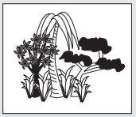

# Chương 7
## Khu Vườn Đặc Biệt

> *Đa số mọi người đều sống trong một vòng tròn giới hạn các tiềm năng thiên bẩm của mình - dù là ở khía cạnh thể chất, trí tuệ, hay đạo đức - trong khi tất cả chúng ta đều có một nguồn dự trữ to lớn những điều mà chúng ta không dám mơ đến. *>
> – William James

Julian nói, “Trong câu chuyện ngụ ngôn này, khu vườn là biểu tượng của tâm trí. Nếu anh quan tâm đến tâm trí mình, nuôi dưỡng và chăm sóc nó như một khu vườn màu mỡ được chăm bón và tưới nước đầy đủ, thì hoa trong vườn sẽ nở rộ hơn cả mong đợi của anh. Còn nếu anh để cho cỏ dại bám rễ sinh sôi, thì sự bình yên lâu dài trong tâm trí và sự hài hòa nội tại sẽ luôn lảng tránh anh.

Tôi hỏi anh một câu đơn giản nhé John. Nếu tôi đi vào sân sau nhà anh, nơi có khu vườn mà anh từng hãnh diện khoe với tôi, rồi bỏ chất thải độc hại vào tất cả những cây dã yên thảo quý giá của anh, thì anh có giận run lên không?”.

“Chắc chắn rồi.”

“Thực tế là hầu hết những người làm vườn giỏi đều canh gác khu vườn của họ như những chiến binh đầy tự hào, và họ luôn đảm bảo không cho bất kỳ tác nhân ô uế nào xâm nhập. Thế nhưng, hãy nhìn những thứ rác rưởi độc hại mà hầu hết mọi người vẫn đưa vào khu vườn màu mỡ trong tâm trí của họ mỗi ngày: những nỗi lo lắng bất an, sự day dứt về quá khứ, biết bao suy nghĩ ủ ê về tương lai, tất cả những nỗi sợ hãi tự tạo ấy đã tàn phá thế giới nội tâm của chúng ta. Trong ngôn ngữ bản địa của các nhà hiền triết Sivana, một loại ngôn ngữ đã tồn tại suốt hàng ngàn năm qua, cách viết từ ‘lo lắng’ cực kỳ giống với cách viết của từ ‘lễ hỏa táng’. Yogi Raman nói với tôi rằng đó không phải là một sự trùng hợp ngẫu nhiên. Sự lo lắng hút cạn mọi sức lực của trí óc và sớm muộn gì cũng sẽ gây tổn thương cho tâm hồn chúng ta.

Để sống một cuộc đời trọn vẹn nhất, anh phải đứng canh gác ở cổng khu vườn của mình và chỉ cho phép những thông tin hữu ích nhất được đi vào mà thôi. Anh thật sự không thể trả nổi cái giá đắt đỏ của một ý nghĩ tiêu cực đâu, dù chỉ một ý nghĩ tiêu cực thôi cũng không được. Những con người vui vẻ, năng động và có cuộc sống viên mãn nhất về cơ bản cũng không có gì khác biệt với tôi và anh. Tất cả chúng ta đều là những con người bằng xương bằng thịt. Tất cả chúng ta đều có cùng nguồn gốc trong vũ trụ này. Tuy nhiên, những người sống không chỉ để tồn tại, những người thổi bùng ngọn lửa tiềm năng của chính mình và biết cách thưởng thức vũ điệu diệu kỳ của cuộc sống mới tạo nên những điều khác biệt hơn so với những người có cuộc sống bình thường. Trong tất cả những việc họ làm, điều quan trọng nhất chính là có một góc nhìn tích cực về thế giới này và tất cả những gì tồn tại trong đó.”

Julian nói thêm, “Các nhà hiền triết đã dạy tôi rằng, trung bình một ngày, một người bình thường có khoảng 60.000 ý nghĩ lướt qua trong tâm trí họ. Điều thật sự khiến tôi ngạc nhiên chính là 95% những ý nghĩ đó giống với những điều mà người ta đã nghĩ vào hôm trước!”.

“Anh nói nghiêm túc đấy chứ?”, tôi hỏi.

“Rất nghiêm túc. Đây chính là sức ảnh hưởng ghê gớm của lối suy nghĩ nghèo nàn. Những người suy nghĩ về những điều giống nhau mỗi ngày, mà hầu hết chúng đều là suy nghĩ tiêu cực, thì đều rơi vào thói quen tư duy xấu. Thay vì tập trung vào tất cả những điều tốt đẹp trong cuộc sống và nghĩ cách làm cho mọi thứ hoàn hảo hơn nữa, họ lại bị giam trong quá khứ. Một số người lo lắng về các mối quan hệ thất bại hoặc các vấn đề tài chính. Một số người khác lại gặm nhấm nỗi buồn về một tuổi thơ không như ý. Vẫn còn một số khác suy nghĩ ủ ê về các vấn đề vặt vãnh hơn: cách mà một nhân viên cửa hàng đã đối xử với họ, hay lời nhận xét ác ý từ một đồng nghiệp. Những người để tâm trí hoạt động theo chiều hướng này đang cho phép sự lo lắng cướp mất quyền làm chủ cuộc sống của mình. Họ đang khóa chặt tiềm năng khổng lồ của tâm trí, khiến nó không thể tạo ra điều kỳ diệu và mang đến cho cuộc sống của họ những gì mà họ mong muốn về mặt thể chất, tình cảm và dĩ nhiên cả mặt tâm linh nữa. Những người này không bao giờ nhận ra việc quản lý tâm trí chính là yếu tố cốt lõi để có thể quản lý cuộc sống.”

Julian tiếp tục nói với niềm tin vững chắc, “Cách suy nghĩ của anh hình thành từ thói quen, đơn thuần là như thế. Hầu hết mọi người không nhận ra nguồn sức mạnh to lớn của tâm trí. Tôi đã học được rằng ngay cả những người điều khiển tư duy giỏi nhất cũng chỉ sử dụng được 1% năng lực tư duy của mình mà thôi. Tại Sivana, các nhà hiền triết dám thường xuyên khám phá tiềm năng chưa được khai thác hết của tâm trí. Và kết quả thật đáng kinh ngạc. Yogi Raman, thông qua việc nghiêm túc luyện tập thường xuyên, đã điều khiển được tâm trí mình đến mức ông có thể làm chậm nhịp tim theo ý muốn. Ông thậm chí còn tự luyện khả năng không cần ngủ trong vài tuần. Mặc dù tôi sẽ không bao giờ đưa ra gợi ý nên đặt những điều đó làm mục tiêu phấn đấu, nhưng tôi chân thành khuyên anh hãy bắt đầu nhìn thấu tâm trí mình theo đúng bản chất của nó – món quà tuyệt diệu nhất của tạo hóa”.

“Liệu có phương pháp nào mà tôi có thể thực hiện để giải phóng sức mạnh của tâm trí không? Việc có thể làm chậm nhịp tim chắc chắn sẽ khiến tôi trở thành tâm điểm của sự chú ý trong một buổi tiệc rượu”, tôi nói với giọng đùa cợt.

“Đừng bận tâm về việc đó vào lúc này, John. Rồi tôi sẽ chỉ cho anh một số phương pháp thực tế mà sau này anh có thể thử, và anh sẽ thấy sức mạnh của những phương pháp cổ xưa này. Điều quan trọng bây giờ là anh cần hiểu rằng, chúng ta làm chủ được tâm trí mình thông qua sự rèn luyện công phu, không hơn không kém. Hầu hết chúng ta đều có cùng những nguyên liệu thô giống nhau ngay từ khoảnh khắc chúng ta hít hơi thở đầu tiên; điều tạo nên sự khác biệt ở những người có nhiều thành tựu hơn những người khác, hoặc những người hạnh phúc hơn người khác chính là cách họ sử dụng và rèn giũa nguyên liệu thô của mình. Khi anh dốc hết tâm sức cho việc biến đổi thế giới nội tâm thì cuộc sống của anh cũng sẽ nhanh chóng chuyển từ bình thường sang phi thường.”

Người thầy của tôi đang trở nên hào hứng hơn. Đôi mắt anh sáng lấp lánh trong khi anh nói về sự kỳ diệu của tâm trí và những điều tốt đẹp mà chắc chắn nó sẽ mang đến.

“Anh biết không John, đến cuối đời, chỉ có một thứ mà chúng ta có toàn quyền chi phối.”

“Con cái của chúng ta hả?”

“Không đâu, anh bạn. Chính là tâm trí của chúng ta. Chúng ta có thể không kiểm soát được thời tiết hoặc giao thông hoặc cảm xúc của những người xung quanh. Nhưng chắc chắn chúng ta có thể kiểm soát thái độ của mình trước những sự kiện đó. Tất cả chúng ta đều có quyền quyết định những gì chúng ta suy nghĩ trong bất cứ thời điểm nào. Khả năng này chính là một phần của những gì tạo nên phần ‘người’ trong ta. Anh thấy đó, một trong những viên ngọc quý của vốn tri thức uyên thâm mà tôi học được trong cuộc hành trình về phương Đông cũng là một trong những điều giản đơn nhất.”

Rồi Julian dừng lại, như thể tập trung sức lực để đưa ra một món quà vô giá.

“Đó là gì?”

“Không có gì gọi là thực tế khách quan hay ‘thế giới thực’. Không có gì là tuyệt đối. Kẻ thù lớn nhất của anh có thể là người bạn thân nhất của tôi. Một sự kiện có vẻ là tấn bi kịch đối với người này có thể sẽ mở ra một cơ hội vô tận cho người khác. Điều tạo nên sự khác biệt giữa những người có thói quen lạc quan và những người khốn khổ triền miên chính là cách họ phân tích và xử lý các tình huống trong cuộc sống.”

“Julian, làm thế nào mà một tấn bi kịch có thể là thứ gì khác ngoài bi kịch?”

“Để tôi cho anh thấy một ví dụ cụ thể. Khi đến Calcutta, tôi có gặp một giáo viên tên là Malika Chand. Cô ấy rất yêu thích công việc dạy học và cô đối xử với học sinh như với chính con ruột của mình. Cô luôn nuôi dưỡng tiềm năng của chúng bằng tất cả tấm lòng. Khẩu hiệu bất biến của cô là ‘Sự tự tin quan trọng hơn chỉ số I.Q’. Cô được cộng đồng biết đến như một người sống để cho đi, luôn sẵn lòng phục vụ những người khốn khó. Đáng tiếc thay, ngôi trường thân thương của cô, ngôi trường đã lặng lẽ chứng kiến sự phát triển tốt đẹp của biết bao thế hệ học trò, đã bị kẻ phá hoại thiêu rụi trong một đêm. Mọi người trong cộng đồng đều cảm thấy đó là một sự mất mát to lớn. Nhưng theo thời gian, cơn giận của họ đã nhường chỗ cho sự thờ ơ, và họ dần chấp nhận thực tế là con cái của họ sẽ không được đến trường.”

“Thế còn Malika thì sao?”

“Cô ấy thì khác, cô ấy luôn có một tinh thần lạc quan bất diệt. Không giống với những người xung quanh mình, cô nhận thấy trong sự việc đã xảy ra có một cơ hội. Cô nói với tất cả phụ huynh rằng mỗi khó khăn đều mang đến lợi ích tương xứng, nếu họ chịu dành thời gian để tìm kiếm. Sự kiện đã qua chỉ là lớp ngụy trang cho một món quà giá trị bên trong. Ngôi trường vừa bị thiêu rụi cũng đã quá cũ và mục nát. Trần nhà bị dột và sàn nhà đã sụt lún bởi sức nặng của hàng ngàn đôi chân nhỏ chạy nhốn nháo trên bề mặt sàn suốt bao nhiêu năm trời. Đây chính là cơ hội mà họ đã chờ đợi từ lâu để cùng chung tay góp sức xây dựng lại một ngôi trường mới tốt hơn, một ngôi trường sẽ tiếp tục phục vụ thêm nhiều thế hệ học sinh hơn nữa trong những năm tiếp theo. Và thế là nhờ có sự hỗ trợ của cô Malika, một người giàu nghị lực đã sáu mươi bốn tuổi, các cư dân trong cộng đồng đã sắp xếp lại những nguồn lực chung và gây quỹ để xây dựng một ngôi trường mới đẹp lung linh như một ví dụ sáng ngời cho sức mạnh của tầm nhìn khi đứng trước nghịch cảnh.”

“Vậy nó giống như câu châm ngôn xưa về việc nhìn nhận ly nước vẫn còn đầy một nửa, thay vì cho rằng nó đã vơi đi một nửa?”

“Có thể cho là như vậy. Bất luận điều gì xảy ra với anh trong cuộc sống, tự bản thân anh có quyền lựa chọn cách phản ứng của mình trước những biến cố đó. Khi anh hình thành thói quen tìm kiếm điều tích cực trong mọi tình huống, cuộc sống của anh sẽ ngày càng phát triển cao rộng nhất có thể. Đây là một trong những quy luật tự nhiên tuyệt vời nhất.”

“Và tất cả đều bắt đầu từ việc sử dụng trí óc một cách hiệu quả hơn à?”

“Chính xác là vậy đấy John. Mọi thành công trong cuộc sống, dù là về vật chất hay tinh thần, đều bắt đầu từ khối vật thể nặng hơn năm ký ở giữa hai vai anh đấy. Nói một cách cụ thể hơn, chúng bắt đầu từ những ý nghĩ mà anh đưa vào tâm trí mình mỗi giây, mỗi phút, mỗi ngày. Thế giới bên ngoài của anh phản ánh thế giới nội tâm của anh. Bằng cách kiểm soát suy nghĩ và phản ứng của mình trước các biến cố trong cuộc đời, anh đã bắt đầu kiểm soát được vận mệnh của chính mình.”

“Điều này nghe rất hợp lý, Julian. Tôi nghĩ có lẽ cuộc sống của tôi đã quá bận rộn đến nỗi tôi không dành thời gian để nghĩ về những điều này. Khi còn học ở trường luật, tôi có người bạn thân tên Alex rất thích đọc những quyển sách khơi nguồn cảm hứng. Anh ấy bảo rằng chúng giúp anh có động lực và năng lượng để đối mặt với khối lượng công việc kinh hoàng của chúng tôi. Tôi còn nhớ anh ta đã nói với tôi, chữ ‘khủng hoảng’ trong tiếng Hoa được tạo thành từ hai chữ phụ: một chữ là ‘hiểm nguy’, một chữ là ‘cơ hội’. Tôi đoán là ngay cả các cổ nhân Trung Hoa cũng biết rằng kể cả những tình huống tăm tối nhất vẫn có những mặt sáng, nếu chúng ta đủ can đảm để tìm kiếm.”

“Yogi Raman đã nói thế này, ‘Trong cuộc sống không có sai lầm, chỉ có những bài học. Không có gì gọi là trải nghiệm tiêu cực, chỉ có những cơ hội để học hỏi, phát triển và nâng tầm hiểu biết, trên con đường tiến tới sự tự chủ bản thân. Qua mỗi cuộc chiến, chúng ta tôi luyện thêm sức mạnh. Kể cả nỗi đau cũng có thể trở thành người thầy tuyệt vời’.”

“Nỗi đau ư?”, tôi tỏ vẻ không đồng tình.

“Đúng vậy. Để vượt lên nỗi đau, trước tiên anh phải trải nghiệm nó. Hay nói cách khác, làm sao anh có thể thật sự biết được niềm vui ở trên đỉnh núi nếu anh chưa vượt qua thung lũng ở bên dưới. Anh hiểu ý tôi chứ?”

“Để có thể tận hưởng những điều tốt đẹp, người ta phải trải qua những điều tồi tệ?”

“Đúng vậy. Nhưng tôi đề nghị anh hãy thôi đánh giá các sự kiện là tích cực hoặc tiêu cực. Thay vào đó, hãy cứ trải nghiệm chúng, vui vẻ với chúng và học hỏi từ chúng. Mỗi việc xảy ra đều mang đến cho anh những bài học. Những bài học nhỏ ấy sẽ tiếp thêm nhiên liệu để anh phát triển toàn diện từ ngoài vào trong. Nếu không có chúng, anh sẽ bị mắc kẹt ở lưng chừng đồi. Hãy nghĩ về cuộc sống của chính mình. Hầu hết mọi người đều phát triển mạnh mẽ nhất từ những trải nghiệm khó khăn nhất. Nếu vừa gặp chút trở ngại mà anh đã thấy thất vọng thì hãy nhớ rằng theo quy luật tự nhiên, khi cánh cửa này khép lại thì cánh cửa khác sẽ mở ra.”

Julian bắt đầu vung tay đầy phấn khích, giống như các vị chính khách vẫn thường làm khi phát biểu trước cử tri. “Một khi anh liên tục áp dụng nguyên tắc này vào đời sống hàng ngày và bắt đầu điều khiển được tâm trí mình phân tích mọi sự kiện theo hướng tích cực và tạo thêm sức mạnh cho bản thân, thì anh sẽ loại bỏ sự lo lắng ra khỏi đầu mình vĩnh viễn. Anh sẽ thôi giam cầm bản thân bởi những việc đã qua trong quá khứ. Thay vào đó, anh sẽ trở thành người kiến tạo tương lai.”

“Được rồi, tôi đã hiểu khái niệm này. Mỗi trải nghiệm, thậm chí là những trải nghiệm tồi tệ nhất, đều sẽ mang đến cho tôi một bài học. Vì vậy, tôi nên mở lòng để học hỏi từ mọi biến cố trong cuộc sống. Bằng cách đó, ta sẽ trở nên mạnh mẽ hơn và hạnh phúc hơn. Còn điều gì khác mà một luật sư bình thường như tôi có thể làm để cải thiện mọi việc nữa không?”

“Trước tiên, hãy bắt đầu sống trong trí tưởng tượng phong phú và rực rỡ, chứ đừng sống trong ký ức.”

“Anh nói rõ hơn giúp tôi được không?”

“Ý tôi là để giải phóng tiềm năng của trí não, cơ thể và tâm hồn, trước tiên anh hãy mở rộng trí tưởng tượng của mình. Như anh thấy đấy, mọi thứ đều được tạo ra hai lần: trước tiên là ở trong tâm trí ta, rồi sau đó mới đến trong thực tế. Tôi gọi quá trình này là ‘quá trình thiết kế’ bởi vì mọi thứ mà anh tạo ra ở thế giới bên ngoài đều bắt đầu từ một bản vẽ đơn giản ở thế giới bên trong của anh, phác thảo trên màn ảnh sống động của tâm trí. Khi anh học cách kiểm soát các ý nghĩ của mình và tưởng tượng thật sinh động về tất cả những điều mà anh khao khát từ cuộc sống này với một sự kỳ vọng tuyệt đối, thì những nguồn sức mạnh đang ngủ im bên trong con người anh sẽ được đánh thức. Anh sẽ bắt đầu giải phóng những tiềm năng đích thực của tâm trí để tạo nên một cuộc sống tuyệt diệu mà tôi tin anh xứng đáng có được. Kể từ đêm nay, hãy quên hết quá khứ. Hãy dám mơ ước những điều lớn lao hơn tất cả hoàn cảnh thực tại trước mắt. Hãy kỳ vọng những điều tốt đẹp nhất. Anh sẽ rất ngạc nhiên trước các kết quả đạt được.

Anh biết không John, suốt nhiều năm hoạt động trong ngành luật, tôi cứ ngỡ mình đã biết rất nhiều. Tôi dành nhiều năm để học ở những ngôi trường tốt nhất, đọc tất cả những quyển sách pháp luật mà mình có thể chạm tay vào và hợp tác làm việc với những người đáng ngưỡng mộ nhất. Tất nhiên, tôi đã là người chiến thắng trong trò chơi pháp luật. Nhưng đến lúc này thì tôi nhận ra mình đã thua trong trò chơi của cuộc đời. Tôi đã quá bận rộn đuổi theo những niềm hoan lạc phù phiếm của cuộc đời đến nỗi gần như bỏ lỡ tất cả những niềm vui nhỏ bé. Tôi chưa bao giờ đọc những quyển sách hay mà cha tôi từng khuyên đọc. Tôi chưa từng gầy dựng bất cứ mối quan hệ tốt đẹp nào. Tôi chưa bao giờ học cách thưởng thức âm nhạc. Khi nói ra điều này, tôi thật sự nghĩ mình rất may mắn. Cơn đau tim ngày ấy chính là khoảnh khắc giúp tôi xác định lại bản thân mình, đó chính là tiếng chuông cảnh tỉnh dành riêng cho tôi. Không biết anh có tin hay không, nhưng chính nó đã cho tôi cơ hội thứ hai để sống một cuộc sống giá trị hơn và nhiều cảm hứng hơn. Giống như Malika Chand, tôi đã nhìn thấy những hạt giống cơ hội trong trải nghiệm đau đớn của mình. Điều quan trọng nhất là tôi đã đủ can đảm để nuôi dưỡng chúng.”

Tôi có thể nhận thấy Julian không chỉ trở nên trẻ trung hơn ở dung mạo bên ngoài, mà bên trong anh cũng đã trở nên thông thái hơn bội phần. Tôi nhận ra rằng đêm hôm ấy không đơn thuần là một đêm chuyện trò thú vị giữa hai người bạn cũ, mà nó có thể chính là khoảnh khắc khẳng định lại bản thân của tôi và là một cơ hội chắc chắn cho một khởi đầu mới. Tôi bắt đầu suy nghĩ về tất cả những việc sai trái trong cuộc đời mình. Rõ ràng là tôi có một gia đình tuyệt vời, một sự nghiệp ổn định và luôn được đánh giá cao trong chuyên môn. Thế nhưng, vào những lúc tĩnh lặng một mình, tôi biết vẫn còn thiếu vắng một điều gì đó. Tôi phải lấp đầy khoảng trống ấy, vì dường như nó đang bắt đầu giam hãm cuộc đời tôi.

Khi còn nhỏ, tôi có những ước mơ vĩ đại. Tôi thường hình dung bản thân là một người hùng trong làng thể thao hoặc một ông trùm kinh tế. Tôi thật sự tin rằng tôi có thể làm được, có được và trở thành bất cứ thứ gì mình muốn. Tôi cũng nhớ rõ cách mà bản thân cảm nhận về mọi việc khi còn là một thiếu niên lớn lên ở vùng Bờ Tây đầy nắng. Niềm vui đến từ những điều giản dị. Niềm vui là những buổi trưa hè vô tư tắm sông hoặc đạp xe xuyên rừng. Tôi là một đứa rất hiếu kỳ đối với cuộc sống. Tôi là một nhà phiêu lưu mạo hiểm. Không có bất kỳ giới hạn nào đối với những gì tương lai có thể mang đến. Thật lòng tôi không nghĩ rằng mình đã cảm nhận lại kiểu tự do và vui vẻ như thế trong suốt mười lăm năm qua. Chuyện gì đã xảy ra? Có lẽ từ khi trưởng thành, tôi đã đánh mất những ước mơ xưa kia của mình. Tôi từ bỏ bản thân để hành xử theo cách mà người trưởng thành phải hành xử. Có thể tôi đã đánh mất chúng kể từ khi tôi vào trường luật và học cách ăn nói như một luật sư. Dù như thế nào đi nữa thì chính đêm hôm đó khi được ngồi bên cạnh Julian và nghe những lời anh chia sẻ từ tận đáy lòng, tôi đã có đủ quyết tâm để ngưng việc dành hết năm tháng hữu hạn của mình chỉ để kiếm sống, thay vào đó là tập trung nhiều thời gian hơn để kiến tạo một cuộc sống đích thực.

“Có vẻ như tôi đã khiến anh suy nghĩ về cuộc đời mình thì phải”, Julian nhận xét. “Hãy bắt đầu suy nghĩ về những ước mơ của mình để thay đổi, giống như khi anh còn nhỏ ấy. Jonas Salk đã diễn đạt được điều này hay nhất khi ông viết, ‘Tôi có những giấc mơ và cả những cơn ác mộng. Và tôi đã vượt qua những cơn ác mộng của mình bằng chính những giấc mơ’. Hãy can đảm theo đuổi lại các giấc mơ của mình, John ạ. Hãy bắt đầu tôn sùng cuộc sống thêm lần nữa và trân trọng tất cả những điều diệu kỳ mà nó mang đến. Hãy nhận thức trọn vẹn nguồn sức mạnh của tâm trí để thực hiện những điều mình muốn. Một khi làm như vậy, cả vũ trụ sẽ hiệp lực cùng anh để tạo nên những điều kỳ diệu.”

Rồi Julian cho tay vào sâu trong chiếc áo choàng lấy ra một tấm thẻ nhỏ có kích cỡ gần bằng một tấm danh thiếp. Tấm thẻ đã khá sờn rách ở các mép, cho thấy nó đã được dùng liên tục suốt nhiều tháng.

“Một ngày nọ, trong khi Yogi Raman và tôi đang đi dọc một con đường núi yên tĩnh, tôi đã hỏi ông triết gia mà ông yêu thích nhất là ai. Ông bảo rằng ông chịu ảnh hưởng từ khá nhiều người trong cuộc đời mình nên thật khó để chọn ra một người nào là nguồn cảm hứng duy nhất. Tuy nhiên, có một lời trích dẫn mà ông luôn khắc ghi trong tâm; một lời trích dẫn chứa đựng tất cả những giá trị mà ông đã luôn trân trọng trong suốt cuộc đời tĩnh tu của mình. Thế rồi, ngay ở nơi tuyệt đẹp ấy, giữa chốn thâm sơn cùng cốc, vị hiền triết thông tuệ của phương Đông đã chia sẻ điều đó với tôi. Và tôi cũng khắc ghi lấy từng lời vào tâm khảm mình. Chúng đóng vai trò như một lời nhắc nhở hàng ngày về bản chất của chúng ta và về tất cả những gì mà chúng ta có thể trở thành. Những lời ấy là của triết gia Ấn Độ vĩ đại Patanjali. Việc lặp lại những lời đó thật to mỗi sáng trước khi ngồi thiền có một tác động sâu sắc đối với mọi việc diễn ra trong ngày của tôi. John, hãy ghi nhớ rằng từ ngữ chính là hiện thân bằng lời của sức mạnh.”

Rồi Julian cho tôi xem tấm thẻ. Lời trích dẫn ấy như thế này:* Khi được truyền cảm hứng bởi một mục đích cao cả hay một kế hoạch phi thường nào đó, tất cả suy nghĩ trong bạn sẽ phá vỡ mọi xiềng xích: Tinh thần sẽ vượt ngoài giới hạn, ý thức sẽ được mở rộng theo mọi hướng và bạn sẽ tìm thấy bản thân mình ở trong một thế giới mới, rộng lớn và tuyệt vời hơn. Những động lực, khả năng và tài năng đang ngủ yên sẽ được đánh thức, và bạn nhận ra bản thân đã trở thành một con người mới vĩ đại hơn hẳn những gì bạn từng mơ ước. *Ngay khoảnh khắc ấy, tôi thấy được mối liên hệ giữa sức khỏe thể chất và sự nhạy bén của tinh thần. Julian đang có một sức khỏe hoàn hảo và trông trẻ hơn rất nhiều so với thời điểm chúng tôi gặp nhau lần đầu tiên. Anh ấy tràn đầy sinh lực và có vẻ như nguồn năng lượng, nhiệt huyết và lạc quan trong anh là vô hạn. Tôi có thể thấy được anh đã thay đổi nhiều điều trong lối sống của mình, nhưng rõ ràng điểm khởi đầu cho cú lột xác ngoạn mục của anh chính là sự khỏe mạnh trong tinh thần. Thành công bên ngoài thật sự bắt nguồn từ thành công ở bên trong. Bằng cách thay đổi tư duy, Julian Mantle đã thay đổi cuộc đời mình.

“Chính xác thì tôi có thể phát triển thái độ sống tích cực, điềm tĩnh và tràn đầy cảm hứng này bằng cách nào, Julian? Sau bao nhiêu năm tháng bước trên một lối mòn cũ kỹ, tôi nghĩ sức mạnh tinh thần của mình đã trở nên yếu đuối cả rồi. Nói ra thì tôi gần như không thể kiểm soát nổi những ý nghĩ trôi loanh quanh trong khu vườn tâm trí của mình”, tôi chân thành chia sẻ.

“Tâm trí là một người đầy tớ tuyệt vời, nhưng lại là một ông chủ kinh khủng. Nếu anh đã trở thành một người có lối tư duy tiêu cực, thì đó là vì anh đã không chăm sóc tâm trí mình và không dành thời gian rèn luyện để nó chỉ tập trung vào những điều tốt đẹp. Winston Churchill đã nói, ‘Cái giá của sự vĩ đại chính là trách nhiệm đối với từng ý nghĩ của mình’. Rồi anh sẽ dần thiết lập được một lối tư duy mạnh mẽ mà anh đang tìm kiếm. Hãy nhớ, tâm trí cũng giống như bất cứ cơ bắp nào khác trên cơ thể. Nếu không được dùng đến thì nó sẽ dần trở nên vô dụng.”

“Ý anh là nếu tôi không rèn luyện tâm trí của mình thì nó sẽ suy yếu?”

“Đúng vậy. Hãy nghĩ thế này. Nếu muốn tăng cường sức mạnh cho cơ bắp tay, anh phải tập luyện cơ tay. Nếu anh muốn làm săn chắc các bó cơ chân của mình, trước tiên anh phải sử dụng chúng. Tương tự, tâm trí anh sẽ tạo nên những điều tuyệt vời nếu anh thường xuyên sử dụng tâm trí. Tâm trí anh sẽ thu hút tất cả những gì mà anh khao khát đến trong cuộc sống thực tại, một khi anh học được cách vận hành nó sao cho hiệu quả. Tâm trí sẽ tạo ra sức khỏe lý tưởng nếu anh chăm sóc nó đúng mực. Và tâm trí sẽ trở về trạng thái tự nhiên thanh thản và yên bình vốn có, nếu anh thật sự tưởng tượng về điều đó. Các nhà hiền triết Sivana có một câu nói rất đặc biệt, ‘Ranh giới của cuộc đời anh đơn giản chỉ là những sáng tạo của cái tôi’.”

“Tôi không nghĩ là mình hiểu được câu nói đó, Julian.”

“Những nhà tư tưởng được khai sáng biết suy nghĩ sẽ định hình thế giới bên ngoài của họ, và chất lượng cuộc sống của một người phụ thuộc vào những giá trị trong suy nghĩ của người ấy. Nếu anh muốn sống một cuộc sống yên bình và ý nghĩa hơn, thì anh phải nghĩ về những điều nhẹ nhàng và hữu ích hơn.”

“Anh có mẹo nào giúp tôi nắm bắt vấn đề nhanh hơn không, Julian?”

“Ý anh là sao?”, Julian vừa hỏi vừa đưa mấy ngón tay vuốt lại phần trước của tấm áo choàng được may bằng chất liệu tinh xảo.

“Tôi rất hào hứng với những điều anh đang chia sẻ. Nhưng tôi là người thiếu kiên nhẫn. Liệu anh có bài tập hay kỹ thuật nào để tôi có thể dùng ngay lúc này, trong căn phòng khách của mình, để thay đổi cách tôi vận hành tâm trí không?”

“Phương pháp đánh nhanh rút gọn không hiệu quả đâu. Tất cả những thay đổi bền vững ở bên trong chúng ta đều đòi hỏi thời gian và nỗ lực. Tính kiên trì là nguồn gốc của sự thay đổi cá nhân. Tôi không có ý bảo rằng phải mất vài năm thì anh mới tạo được những thay đổi sâu sắc trong đời mình. Nếu anh sốt sắng áp dụng các phương pháp mà tôi chia sẻ liên tục mỗi ngày trong vòng một tháng thôi, anh sẽ rất kinh ngạc trước những kết quả mình đạt được. Anh sẽ bắt đầu khai mở những năng lực xuất sắc nhất của mình và bước vào vương quốc của những điều kỳ diệu. Nhưng để vươn tới đích đến đó, anh không được nóng lòng mà phải tận hưởng quá trình phát triển và trưởng thành của bản thân. Điều ngược đời nằm ở chỗ anh càng ít tập trung vào kết quả thì chúng sẽ càng đến nhanh.”

“Tại sao lại như vậy?”

“Việc này cũng giống như câu chuyện về một cậu bé lên đường tầm sư học đạo. Khi cậu bé gặp được người thầy thông thái, câu hỏi đầu tiên của cậu là, ‘Con phải mất bao lâu mới trở nên thông thái như thầy ạ?’.

Người thầy trả lời nhanh gọn, ‘Năm năm’.

Cậu bé nói, ‘Thế thì lâu quá, nếu con học tập chăm chỉ gấp đôi thì sao ạ?’.

Người thầy đáp, ‘Thế thì sẽ mất mười năm’.

‘Mười năm ư? Sao lại lâu đến thế? Vậy nếu con học suốt cả ngày lẫn đêm thì sao?’ Vị hiền triết nói ngay, ‘Mười lăm năm’.

Cậu bé đáp lời, ‘Con không hiểu. Mỗi khi con hứa sẽ dốc sức nhiều hơn để thực hiện mục tiêu của mình thì thầy lại bảo sẽ tốn nhiều thời gian hơn. Tại sao lại như vậy ạ?’.

‘Câu trả lời rất đơn giản. Khi một mắt con đã dán chặt vào đích đến thì con chỉ còn lại một mắt để dẫn đường cho mình trong suốt cuộc hành trình’.”

“Tôi đã hiểu ý anh rồi, nhà cố vấn ạ”, tôi vui vẻ thừa nhận. “Nghe cứ như câu chuyện đời tôi vậy.”

“Hãy kiên nhẫn và luôn xác tín một điều là tất cả những gì anh đang tìm kiếm chắc chắn sẽ đến khi anh đã chuẩn bị sẵn sàng và chờ đón nó.”

“Nhưng tôi chưa bao giờ là người may mắn cả, Julian ạ. Tất cả những gì tôi từng nhận được hoàn toàn là nhờ vào lòng kiên trì.”

Julian nhẹ nhàng đáp, “Thế may mắn là gì nào, anh bạn của tôi? Nó chính là sự hợp nhất của sự chuẩn bị và cơ hội”.

Rồi anh nói thêm, “Trước khi chia sẻ các phương pháp chuẩn mực mà những nhà hiền triết Sivana đã trao cho, tôi phải hướng dẫn cho anh một vài nguyên tắc chính. Trước hết, hãy luôn nhớ sự tập trung chính là gốc rễ của việc làm chủ tâm trí”.

“Anh nói nghiêm túc đấy chứ?”

“Tôi biết. Điều này cũng từng khiến tôi ngạc nhiên. Nhưng nó là sự thật. Tâm trí có thể đạt được những điều phi thường, anh đã học được điều này. Khi anh có một khao khát hoặc một ước mơ nghĩa là anh có năng lực tương ứng để thực hiện nó. Đây là một trong những chân lý tuyệt vời của vũ trụ mà các nhà hiền triết Sivana được biết. Tuy nhiên, để giải phóng được sức mạnh của tâm trí thì trước tiên anh phải có khả năng điều khiển được nó và hướng sự tập trung của nó vào nhiệm vụ trước mắt. Ngay khi anh hướng toàn bộ sự tập trung của tâm trí vào một mục đích duy nhất, những món quà đặc biệt sẽ xuất hiện trong cuộc sống của anh.”

“Tại sao việc giữ cho tâm trí tập trung lại quan trọng như thế?”

“Để tôi đưa ra tình huống này, nó sẽ trả lời cho câu hỏi của anh. Giả sử anh bị lạc trong một khu rừng vào giữa mùa đông. Anh rất cần được giữ ấm. Tất cả những gì anh có trong ba-lô là một lá thư mà người bạn thân đã gửi cho anh, một lon cá ngừ và một chiếc kính lúp mà anh mang theo vì thị lực của anh đang yếu dần. Thật may mắn vì anh tìm được một ít củi để nhóm lửa, nhưng anh lại không có diêm. Thế thì làm sao để anh nhóm lửa được?”

Trời ạ! Julian đã khiến tôi thật sự bối rối. Tôi không thể nghĩ ra được câu trả lời.

“Tôi chịu thua.”

“Rất đơn giản. Đặt lá thư ở giữa đống củi khô và đặt chiếc kính lúp bên trên nó. Ánh nắng mặt trời sẽ hội tụ và tạo thành ngọn lửa chỉ trong vài giây.”

“Thế còn lon cá ngừ thì sao?”

“Ồ, tôi chỉ đưa nó vào để làm phân tán suy nghĩ của anh, khiến anh không nhận ra giải pháp rõ ràng trước mắt”, Julian mỉm cười đáp.

“Nhưng điều cốt lõi của ví dụ này nằm ở chỗ: việc đặt lá thư bên trên đống củi khô sẽ không mang đến kết quả gì. Thế nhưng, chính lúc anh dùng kính lúp để tập trung các tia nắng mặt trời vào lá thư thì ngọn lửa mới bùng lên. Chúng ta có thể suy luận tương tự cho tâm trí mình. Khi anh tập trung nguồn sức mạnh to lớn của tâm trí vào những mục tiêu rõ ràng và có ý nghĩa, anh sẽ nhanh chóng thắp được ngọn lửa tiềm năng của mình và tạo ra các kết quả đáng kinh ngạc.”

“Ví dụ như...?”, tôi hỏi.

“Chỉ có anh mới có thể trả lời câu hỏi này. Anh đang tìm kiếm điều gì? Liệu anh có muốn trở thành một người cha tốt hơn và sống một cuộc sống cân bằng, xứng đáng hơn không? Anh có khao khát một đời sống tinh thần viên mãn hơn? Có phải một chút mạo hiểm và niềm vui là những thứ mà anh cảm thấy bản thân còn đang thiếu? Hãy suy nghĩ thêm về vấn đề này.”

“Thế còn hạnh phúc vĩnh cửu thì sao?”

“Đã làm phải làm đến nơi đến chốn”, Julian cười. “Xem nào, anh cũng có thể có được điều đó.”

“Bằng cách nào?”

“Các nhà hiền triết Sivana đã biết được bí mật của hạnh phúc từ năm ngàn năm nay. Thật may mắn là họ đã sẵn lòng chia sẻ món quà ấy với tôi. Anh có muốn nghe không?”

“Không, tôi nghĩ tôi muốn giải lao và đi dán giấy dán tường nhà xe trước đã.”

“Hả? Anh nói gì cơ?”

“Tôi đùa đấy. Đương nhiên tôi rất muốn nghe bí mật của hạnh phúc vĩnh cửu. Chẳng phải cuối cùng thì đó là điều mà bất cứ ai cũng tìm kiếm hay sao?”

“Đúng là như vậy. Tôi sẽ chia sẻ với anh ngay đây. Phiền anh cho tôi xin thêm tách trà nữa được không?”

“Thôi nào, đừng kéo dài thời gian nữa.”* “Được rồi, bí mật của hạnh phúc rất đơn giản: Hãy tìm ra công việc *mà anh thật sự yêu thích và dồn hết năng lượng của mình vào việc đó. Nếu anh tìm hiểu về những con người hạnh phúc nhất, khỏe mạnh nhất và viên mãn nhất trong thế giới của chúng ta, anh sẽ nhận thấy tất cả họ đều tìm thấy niềm đam mê của mình trong cuộc sống và dành toàn bộ thời gian để theo đuổi nó. Và những niềm đam mê đó hầu hết đều là lời mời gọi họ theo đuổi sứ mệnh phục vụ người khác. Một khi anh đã tập trung sức mạnh tinh thần và năng lượng cho một công việc mà anh yêu thích, sự thịnh vượng sẽ chảy vào cuộc sống của anh và tất cả những khát vọng của anh sẽ được thỏa mãn một cách dễ dàng và trọn vẹn nhất.”

“Chỉ đơn giản là cần tìm ra việc chúng ta yêu thích và làm việc đó thôi sao?”

Julian đáp, “Nếu đó là một việc xứng đáng để theo đuổi.”

“Anh định nghĩa ‘xứng đáng’ là thế nào?”

“Như tôi đã nói đấy John, niềm đam mê của anh phải cải thiện hoặc phục vụ cho người khác theo một cách nào đó. Victor Frankl đã phát biểu về việc này một cách hết sức tinh tế, ‘Cũng giống như hạnh phúc, thành công là thứ chúng ta không thể theo đuổi. Nó phải tự sinh ra. Và nó chỉ tự sinh ra như một lẽ đương nhiên, không thể tính toán trước, khi ta cống hiến cho một mục tiêu vĩ đại nào đó’. Một khi anh tìm ra sứ mệnh của đời mình, thế giới của anh sẽ trở nên sống động. Anh sẽ thức dậy mỗi sáng với một nguồn năng lượng và lòng nhiệt huyết vô hạn. Tất cả suy nghĩ của anh sẽ tập trung vào một mục tiêu đã được xác định. Anh sẽ không có dư thời gian để lãng phí. Nguồn sức mạnh tinh thần quý giá nhờ vậy mà sẽ không bị tiêu hao vào những suy nghĩ vặt vãnh. Anh sẽ tự động xóa đi thói quen lo lắng và trở nên hiệu quả hơn với năng suất làm việc cao hơn. Thú vị hơn nữa, anh sẽ có một cảm giác hài hòa từ sâu thẳm trong nội tâm như thể anh đang được hướng dẫn để hoàn thành sứ mệnh của mình. Đó là một cảm giác rất tuyệt vời. Tôi rất yêu cảm giác ấy”, Julian hân hoan chia sẻ.

“Thật ấn tượng! Tôi rất thích khoản cảm thấy vui vẻ khi thức dậy vào mỗi sáng. Thú thật với anh, Julian ạ, hầu hết mọi ngày tôi đều ước mình có thể nằm vùi trong chăn. Như thế sẽ tốt hơn nhiều so với việc phải đối mặt với tình trạng giao thông ngoài đường, các vị thân chủ giận dữ, các đối thủ hung hăng và dòng chảy không ngừng nghỉ của những tác động tiêu cực. Tất cả những điều đó khiến tôi quá mệt mỏi.”

“Anh có biết tại sao hầu hết mọi người đều ngủ quá nhiều không?”

“Tại sao vậy?”

“Bởi vì họ thật sự chẳng có việc gì khác để làm. Những người thức giấc vào lúc bình minh đều có một điểm chung.”

“Đều mất trí chăng?”

“Rất hài hước, John. Nhưng không, tất cả họ đều có một mục đích có thể thổi bùng lên ngọn lửa tiềm năng của mình. Họ được thúc đẩy bởi các vấn đề ưu tiên của bản thân, nhưng không phải theo một cách đầy ám ảnh và kém lành mạnh. Sự thúc đẩy diễn ra với họ tự nhiên và nhẹ nhàng hơn thế nhiều. Và bởi vì luôn dành lòng nhiệt huyết và tình yêu cho những việc đang làm, họ sống hết mình với giây phút hiện tại. Sự tập trung của họ được dành hoàn toàn và trọn vẹn cho công việc trước mắt. Nhờ vậy mà không có chút năng lượng nào bị rò rỉ. Họ chính là những cá nhân giàu nghị lực và tràn đầy sức sống nhất mà anh may mắn gặp được.”

“Rò rỉ năng lượng là sao?”

“Các nhà hiền triết Sivana đã đi tiên phong trong việc đưa ra khái niệm ấy. Mặc dù đã xuất hiện từ nhiều thế kỷ trước, tính ứng dụng của khái niệm này vẫn rất cao và phù hợp với thời đại ngày nay giống như những ngày đầu khi mới được phát triển. Quá nhiều người trong số chúng ta bị nuốt chửng bởi những nỗi lo bất tận không đáng có. Điều này rút cạn nguồn sinh khí và năng lượng tự nhiên của chúng ta. Anh có từng nhìn thấy ruột của bánh xe đạp chưa?”

“Tất nhiên là rồi.”

“Khi được bơm đầy, nó có thể dễ dàng đưa anh tới được đích đến của mình. Nhưng nếu nó bị lủng, ruột xe sẽ bị xẹp từ từ và cuộc hành trình của anh sẽ phải kết thúc đột ngột. Đó cũng là cách vận hành của tâm trí. Sự lo lắng khiến cho nguồn năng lượng và tiềm năng của tâm trí bị rò rỉ, giống như lượng khí trong ruột bánh xe bị thoát ra ngoài. Rồi anh sẽ nhanh chóng cạn hết năng lượng. Tất cả sự sáng tạo, tinh thần lạc quan và động lực của anh đều bị rút cạn, khiến anh kiệt sức hoàn toàn.”

“Tôi biết cảm giác ấy. Mỗi ngày của tôi đều giống như một cơn khủng hoảng hỗn loạn. Tôi phải cố gắng có mặt ở nhiều nơi gần như trong cùng một thời điểm và không thể nào làm hài lòng được bất kỳ ai. Vào những ngày đó, tôi nhận thấy rằng mặc dù tôi lao động thể lực rất ít, nhưng chính sự lo lắng đã khiến tôi hoàn toàn kiệt sức vào cuối ngày. Gần như điều duy nhất tôi có thể làm khi về đến nhà là tự rót cho mình một ly rượu rồi cuộn tròn trên ghế sofa với chiếc điều khiển tivi.”

“Chính xác. Quá căng thẳng sẽ khiến anh trở nên như thế. Một khi anh tìm thấy mục đích của đời mình, cuộc sống sẽ trở nên dễ dàng và đáng sống hơn nhiều. Khi anh tìm ra mục tiêu chính trong cuộc sống hoặc sứ mệnh của bản thân, anh sẽ không còn phải làm việc thêm một ngày nào nữa trong đời.”

“Ý anh là nghỉ hưu sớm?”

“Không phải”, Julian nói với giọng điệu nghiêm túc và quyết liệt mà anh đã quá thông thạo từ những ngày còn là một luật sư lỗi lạc. “Khi đó, công việc của anh sẽ là một cuộc chơi.”

“Liệu có hơi mạo hiểm không khi tôi từ bỏ công việc đang làm để bắt đầu tìm kiếm niềm đam mê và mục đích tối thượng của cuộc đời mình? Ý tôi là, tôi còn có gia đình và những trách nhiệm phải gánh vác. Có bốn người đang phụ thuộc vào tôi.”

“Tôi không bảo rằng anh phải từ bỏ sự nghiệp ngay ngày mai. Tuy nhiên, anh sẽ phải bắt đầu mạo hiểm. Hãy khuấy động cuộc sống của mình lên một chút. Hãy tránh xa các lối mòn cũ kỹ và chọn những con đường ít người đi. Hầu hết mọi người đều sống trong giới hạn chật hẹp của vùng thoải mái. Yogi Raman là người đầu tiên giải thích cho tôi biết rằng điều tốt đẹp nhất mà chúng ta có thể làm cho bản thân chính là thường xuyên vượt qua giới hạn của vùng thoải mái ấy. Đây chính là cách để có được sự tự chủ bền vững và nhận ra tiềm năng thật sự trong những tài sản thiên phú của chúng ta.”

“Cụ thể những tài sản đó là gì?”

“Đó là trí tuệ, thể xác và tâm hồn của chúng ta.”

“Vậy thì tôi nên bắt đầu mạo hiểm như thế nào?”

“Hãy ngừng sống quá thực tế. Hãy bắt đầu làm những việc mà anh luôn muốn làm. Tôi đã từng biết những luật sư bỏ việc để trở thành diễn viên sân khấu, hoặc các nhân viên kế toán thôi việc để trở thành nhạc sĩ nhạc jazz. Trong quá trình ấy, họ đã tìm ra niềm hạnh phúc trọn vẹn mà bấy lâu nay họ vẫn luôn kiếm tìm. Vậy điều gì sẽ xảy ra nếu họ không còn khả năng chi trả cho hai kỳ nghỉ mát mỗi năm và không mua nổi một căn nhà nghỉ hè ở quần đảo Cayman? Việc mạo hiểm có tính toán sẽ mang đến những ‘lợi nhuận’ khổng lồ đấy. Làm sao anh có thể bước lên tầng ba với một chân vẫn chần chừ ở tầng hai?”

“Tôi hiểu ý anh.”

“Vậy hãy dành thời gian để nghĩ xem lý do thật sự anh ở đây là gì và hãy can đảm để hành động vì điều ấy.”

“Tôi hoàn toàn không có ý gì đâu, Julian, nhưng tất cả những gì tôi làm là suy nghĩ. Thật lòng mà nói, tôi cho rằng một phần vấn đề của mình nằm ở chỗ tôi suy nghĩ quá nhiều. Tâm trí tôi không bao giờ ngừng hoạt động. Nó luôn đầy ắp những tiếng nói huyên thuyên mà đôi khi khiến tôi như phát điên.”

“Điều tôi đang gợi ý với anh thì lại khác. Các nhà hiền triết Sivana đều dành thời gian mỗi ngày để yên lặng suy ngẫm, không chỉ về vị trí của họ trong hiện tại, mà cả về vị trí mà họ đang hướng đến. Họ dành thời gian để ngẫm nghĩ về mục đích của bản thân và cách họ đang sống cuộc sống thường nhật của mình. Điều quan trọng nhất là họ suy nghĩ thật cặn kẽ và chân thực về cách mà họ sẽ cải thiện vào ngày hôm sau. Họ biết rằng mỗi sự cải thiện sẽ tạo ra các kết quả lâu dài, và chính các kết quả này sẽ mang đến sự thay đổi tích cực.”

“Vậy tôi nên dành thời gian để ngẫm nghĩ về cuộc sống của mình thường xuyên à?”

“Đúng vậy. Thậm chí chỉ cần mười phút tập trung suy ngẫm mỗi ngày cũng sẽ có tác động sâu sắc lên chất lượng cuộc sống của anh.”

“Tôi hiểu anh muốn nói gì, Julian. Nhưng vấn đề là khi một ngày của tôi bắt đầu vào guồng quay thì tôi thậm chí chẳng thể tìm ra mười phút để ăn trưa.”

“Anh bạn ạ, khi anh nói không có thời gian để cải thiện lối tư duy và cuộc sống của mình thì chẳng khác nào anh bảo rằng không có thời gian để dừng lại đổ xăng bởi vì bận lái xe. Rồi cũng đến lúc anh phải dừng lại thôi.”

“Tôi biết. À, anh đang chuẩn bị chia sẻ vài phương pháp với tôi mà, đúng không?”, tôi hỏi với hy vọng sẽ học được vài cách thiết thực để ứng dụng những tri thức mà mình vừa nghe.

“Có một phương pháp làm chủ tâm trí vượt trên tất cả những kỹ thuật công phu khác. Đây cũng là phương pháp yêu thích nhất của các nhà hiền triết Sivana, những người đã truyền dạy nó cho tôi với lòng tin tưởng và trông cậy tuyệt đối. Sau khi luyện tập nó chỉ trong vòng hai mươi mốt ngày, tôi đã cảm thấy mình tràn đầy sinh lực, giàu lòng nhiệt huyết và mạnh mẽ hơn bao giờ hết. Phương pháp này đã tồn tại trên bốn ngàn năm và nó được gọi là Tâm của Hoa hồng.”

“Anh nói rõ hơn một chút đi.”

“Tất cả những gì anh cần để thực hành bài tập này là một nơi yên tĩnh và một cành hoa hồng tươi. Không gian thiên nhiên là tuyệt nhất, nếu không thì một căn phòng yên tĩnh cũng ổn. Hãy bắt đầu tập trung nhìn vào nhụy hoa hồng, cũng chính là trái tim của nó. Yogi Raman nói rằng hoa hồng rất giống với cuộc sống: anh sẽ gặp nhiều gai nhọn trên đường đi, nhưng nếu anh có niềm tin đủ lớn với những ước mơ của mình thì cuối cùng anh cũng sẽ vượt qua những chiếc gai nhọn ấy để đến với bông hoa rực rỡ kia. Hãy tiếp tục tập trung nhìn vào bông hoa, ghi nhận màu sắc, kết cấu bên ngoài và hình dáng của nó. Hãy tận hưởng hương thơm của nó và đừng nghĩ về điều gì khác ngoài vật thể tuyệt vời đang ở ngay trước mắt. Thoạt tiên, một số ý nghĩ sẽ bắt đầu thâm nhập vào tâm trí anh, khiến anh không còn tập trung vào tâm của hoa hồng. Đây là dấu hiệu của một tâm trí chưa được rèn luyện. Nhưng anh không cần phải lo lắng, anh sẽ tiến bộ nhanh thôi. Anh chỉ việc đưa sự tập trung của mình quay lại với đối tượng trọng tâm lúc này. Tâm trí anh sẽ nhanh chóng trở nên mạnh mẽ và có kỷ luật.”

“Chỉ có vậy thôi sao? Nghe có vẻ dễ nhỉ.”

Julian đáp, “Đó chính là cái hay của nó đấy John. Tuy nhiên, các bước thực hành mà tôi vừa chia sẻ cần phải được thực hiện mỗi ngày để phát huy hiệu quả. Trong mấy ngày đầu, anh sẽ thấy khó mà thực hiện bài tập này dù chỉ trong năm phút. Phần đông chúng ta đều có một nhịp sống quá hối hả đến nỗi sự tĩnh lặng đã trở thành một thứ gì đó lạ lẫm và gây khó chịu. Hầu hết mọi người khi nghe tôi nói những lời này đều bảo rằng họ không có thời gian để ngồi nhìn chằm chằm vào một bông hoa. Cũng chính những người này sẽ nói với anh rằng họ chẳng có thời gian để tận hưởng tiếng cười của con trẻ hoặc đi chân không dưới trời mưa. Những người này luôn nói rằng họ quá bận rộn để làm những việc như vậy. Họ thậm chí còn chẳng có thời giờ để xây dựng các mối quan hệ bạn bè, bởi tình bạn cũng cần phải có thời gian”.

“Anh biết khá nhiều về những người như vậy nhỉ?”

“Tôi chính là một trong số họ”, Julian đáp. Anh dừng lại một chút và ngồi bất động, mắt nhìn chăm chú vào chiếc đồng hồ của ông tôi để lại mà sau này bà đã tặng cho tôi và Jenny như một món quà mừng tân gia. Julian nói tiếp, “Khi nghĩ về những người đã sống cuộc đời mình theo cách ấy, tôi nhớ đến câu nói của một tiểu thuyết gia người Anh, người có các tác phẩm được cha tôi hết mực yêu thích. Ông ấy nói rằng, ‘Đừng để thời gian và những kế hoạch làm mờ mắt chúng ta, để rồi không thể nhận ra mỗi khoảnh khắc của cuộc đời đều là một phép màu’”.

Julian tiếp tục với chất giọng trầm khàn, “Hãy kiên trì và tăng dần thời gian thưởng lãm tâm của hoa hồng. Sau một hoặc hai tuần, anh sẽ có thể thực hiện phương pháp này suốt hai mươi phút mà không bị chi phối bởi những đối tượng khác. Đây chính là dấu hiệu cho thấy anh đã giành lại quyền kiểm soát pháo đài của tâm trí mình. Giờ thì nó chỉ tập trung vào điều mà anh ra lệnh cho nó phải tập trung vào. Khi đó, nó sẽ trở thành một đầy tớ tuyệt vời, có khả năng làm nên những điều phi thường cho anh. Hãy nhớ điều này, nếu anh không điều khiển tâm trí mình, nó sẽ điều khiển anh.

Nói một cách cụ thể, anh sẽ nhận ra mình cảm thấy điềm tĩnh hơn xưa rất nhiều. Anh sẽ có một bước tiến đáng kể trong việc xóa bỏ thói quen lo lắng đang lan tràn trong xã hội chúng ta và sẽ tận hưởng sự lạc quan cùng nguồn năng lượng dồi dào hơn trước. Điều quan trọng nhất là anh sẽ nhận thấy một niềm vui sướng vừa hiện diện trong cuộc đời mình cùng với việc biết quý trọng những món quà ở xung quanh anh. Mỗi ngày, bất luận anh có bận rộn đến đâu hay phải đối mặt với bao nhiêu thử thách, hãy quay trở về với tâm của hoa hồng. Nó chính là nơi trú ẩn, là nơi tĩnh tâm và là hòn đảo bình yên của riêng anh. Đừng bao giờ quên có một sức mạnh trong sự yên lặng và an định. Sự an định chính là bước đệm để chúng ta có thể kết nối với nguồn trí tuệ của vũ trụ bao la đang tồn tại một cách sinh động trong mọi thực thể sống”.

Tôi hoàn toàn bị mê hoặc bởi những gì mình vừa nghe. Liệu phương pháp đơn giản này có thật sự cải thiện toàn diện chất lượng cuộc sống của tôi hay không?

“Ngoài phương pháp Tâm của Hoa hồng, hẳn là phải còn điều gì khác đằng sau những thay đổi hết sức ấn tượng của anh chứ?”, tôi không ngần ngại hỏi.

“Đúng là như vậy. Thật ra, sự biến đổi của tôi là kết quả của việc phối hợp nhiều phương pháp có tính hiệu quả cao. Đừng lo, tất cả chúng đều đơn giản như bài tập mà tôi vừa chia sẻ với anh – và đều có sức mạnh tương tự. Điểm mấu chốt là anh cần phải mở rộng tâm trí mình trước tiềm năng to lớn của bản thân để sống một cuộc đời luôn tràn ngập cơ hội.”

Julian, giờ đã trở thành một nguồn kiến thức bao la, tiếp tục kể về những gì anh đã học được ở Sivana. “Một phương pháp đặc biệt hiệu nghiệm để lướt qua tâm trạng lo âu và các ảnh hưởng tiêu cực khác, những tác nhân khiến cho cuộc sống trở nên kiệt quệ, là dựa trên điều mà Yogi Raman gọi là Tư duy Đối lập. Tôi đã học được rằng, dưới những quy luật vĩ đại của tự nhiên, tâm trí chúng ta chỉ có thể có một suy nghĩ vào mỗi thời điểm. Hãy tự mình kiểm chứng đi John, anh sẽ nhận thấy đó là sự thật.”

Tôi đã thử và đúng là như vậy.

“Bằng cách áp dụng hiểu biết này, bất cứ ai cũng có thể dễ dàng tạo ra một lối tư duy tích cực, sáng tạo trong một khoảng thời gian ngắn. Quá trình này rất cụ thể: khi một ý nghĩ không mong muốn chiếm hết sự tập trung của tâm trí, hãy lập tức thay thế nó bằng một ý nghĩ tích cực. Tâm trí anh cũng giống như một chiếc máy chiếu khổng lồ, với mỗi ý nghĩ bên trong nó là một tấm phim. Bất cứ khi nào một tấm phim tiêu cực xuất hiện trên màn ảnh, hãy nhanh chóng thay thế nó bằng một tấm phim tích cực."

“Đây chính là nguồn gốc của tràng hạt tôi đeo trên cổ”, Julian nói với niềm hăng say dâng cao. “Mỗi khi thấy bản thân đang có một ý nghĩ tiêu cực, tôi tháo tràng hạt xuống và lấy ra một hạt. Những hạt chuỗi chứa đựng sự bất an này được cho vào một chiếc tách mà tôi để trong ba-lô. Chúng đóng vai trò như những lời nhắc nhở rằng tôi vẫn còn một quãng đường rất xa để có thể tiến tới việc làm chủ tâm trí và tôi cần có trách nhiệm hơn với những ý nghĩ chất chứa trong đầu mình.”

“Phương pháp này tuyệt thật đấy! Nó rất thiết thực. Tôi chưa từng nghe điều gì giống như vậy. Anh nói thêm về triết lý Tư duy Đối lập đi.”

“Đây là một ví dụ ngoài đời thực. Giả sử anh có một ngày làm việc mệt mỏi ở tòa án. Vị thẩm phán không đồng tình với các luận điểm pháp lý của anh. Luật sư bào chữa phía đối phương không có điểm nào sơ hở và thân chủ thì đang rất bực mình với biểu hiện của anh trong phiên tòa đó. Anh về nhà và ngồi phịch xuống chiếc ghế yêu thích của mình, thấy đời u ám vô cùng. Bước một, anh phải nhận ra mình đang nghĩ những điều khiến bản thân nhụt chí. Hiểu biết về bản thân chính là bước đệm để đạt đến việc làm chủ tâm trí. Bước hai, hãy trân trọng việc anh có thể thay thế những ý nghĩ ảm đạm ấy bằng những điều tươi sáng hơn một cách dễ dàng như lúc chúng thâm nhập vào tâm trí anh vậy. Thế nên, hãy suy nghĩ về những gì đối lập với sự ảm đạm. Hãy giữ tinh thần luôn vui vẻ và tràn đầy năng lượng. Hãy cảm nhận rằng anh đang hạnh phúc. Có lẽ anh nên bắt đầu mỉm cười. Hãy múa may nhảy nhót như thể anh đang thấy rất vui mừng và hăng hái. Hãy ngồi thẳng dậy, hít thở sâu và rèn luyện tâm trí mình chỉ nghĩ về những điều tích cực. Anh sẽ nhận thấy sự khác biệt lớn trong cảm xúc của mình chỉ trong vòng vài phút. Quan trọng hơn, nếu anh duy trì việc rèn luyện Tư duy Đối lập, áp dụng nó với mỗi ý nghĩ tiêu cực thâm nhập vào tâm trí như một thói quen, thì trong vòng vài tuần anh sẽ thấy rằng các ý nghĩ ấy không còn nắm giữ bất cứ sức mạnh nào nữa. Anh có nhận ra điều mà tôi đang muốn nói tới không?”

Julian tiếp tục giải thích, “Suy nghĩ của chúng ta là những thực thể sống rất sinh động và luôn tràn trề năng lượng. Hầu hết mọi người không quan tâm đến bản chất của những suy nghĩ đi qua tâm trí họ, mặc dù chất lượng của chúng sẽ quyết định chất lượng cuộc sống của họ. Những suy nghĩ cũng là một phần của thế giới vật chất, giống như hồ nước mà anh bơi lội hoặc con đường mà anh bước đi. Tâm trí yếu kém sẽ dẫn đến những hành động yếu kém. Một tâm trí mạnh mẽ, có kỷ luật, thứ mà bất kỳ ai cũng có thể bồi đắp thông qua sự luyện tập hằng ngày, có thể tạo ra những điều màu nhiệm. Nếu anh muốn có một cuộc sống viên mãn, hãy chăm sóc các ý nghĩ của mình như cách anh chăm sóc những tài sản quý giá nhất. Hãy thường xuyên loại bỏ tất cả những bất an trong nội tâm mình. Phần thưởng từ việc này sẽ khiến anh bất ngờ”.

“Tôi chưa bao giờ xem ý nghĩ là những thực thể sống cả, Julian”, tôi đáp trong sự kinh ngạc trước phát hiện mới mẻ này. “Nhưng tôi có thể thấy được chúng có tác động như thế nào đến các yếu tố khác trong thế giới của tôi.”

“Các nhà hiền triết Sivana tin tưởng chắc chắn rằng một người chỉ nên có những suy nghĩ sattvic hay còn gọi là suy nghĩ thuần khiết. Họ đạt đến trạng thái đó thông qua những phương pháp mà tôi vừa chia sẻ với anh, cùng với một số phương pháp luyện tập khác như chế độ ăn uống tự nhiên, sự lặp đi lặp lại những lời khẳng định tích cực, hay ‘mantra’ – theo cách gọi của các nhà hiền triết, đọc những quyển sách chứa đựng nhiều tri thức quý giá và luôn đảm bảo rằng những người bạn đồng tu của họ cũng được khai sáng. Chỉ cần một suy nghĩ ô uế thâm nhập vào ngôi đền của tâm trí cũng khiến họ tự trừng phạt bản thân bằng cách đi bộ thật xa đến một thác nước hùng vĩ nọ và đứng dưới dòng thác lạnh như băng cho đến khi nào không còn chịu nổi nhiệt độ băng giá ấy nữa mới thôi.”

“Tôi nhớ anh nói rằng các nhà hiền triết này rất thông thái. Việc đứng dưới thác nước lạnh giá, sâu trong dãy Hy Mã Lạp Sơn, chỉ vì một suy nghĩ tiêu cực nho nhỏ thì đối với tôi là một hành vi quá cực đoan.”

Julian trả lời nhanh như chớp – kiểu phản xạ của một chiến binh tầm cỡ quốc tế với nhiều năm kinh nghiệm trong chốn pháp đình, “John, tôi nói thẳng nhé. Dù chỉ một suy nghĩ tiêu cực cũng sẽ khiến anh phải trả giá đắt đấy”.

“Thật thế sao?”

“Tất nhiên. Một suy nghĩ lo lắng giống như một mầm cây vậy. Ban đầu nó rất nhỏ thôi, nhưng rồi nó sẽ lớn dần, lớn dần. Chẳng mấy chốc mà nó sẽ có một cuộc đời của riêng mình.”

Julian ngừng lại một lúc rồi mỉm cười. “Xin lỗi nếu tôi có vẻ giống như một nhà truyền giáo khi nói về chủ đề này, về triết lý mà tôi đã học được trong cuộc hành trình của mình. Chỉ là tôi đã tìm thấy các công cụ có thể cải thiện cuộc sống của nhiều người, những người cảm thấy không thỏa mãn, thiếu cảm hứng và bất hạnh. Một vài điều chỉnh trong nếp sinh hoạt hàng ngày để thực hiện bài tập Tâm của Hoa hồng và liên tục áp dụng Tư duy Đối lập sẽ mang đến cho họ cuộc sống mà họ mong muốn. Tôi nghĩ họ xứng đáng được biết điều này.

Trước khi chuyển từ khu vườn sang yếu tố tiếp theo trong câu chuyện ngụ ngôn bí ẩn của Yogi Raman, tôi phải cho anh biết một bí quyết khác sẽ hỗ trợ cho anh rất nhiều trong quá trình phát triển bản thân. Bí quyết này dựa trên một nguyên lý cổ xưa cho rằng mọi thứ luôn được tạo ra hai lần, đầu tiên là trong tâm trí của chúng ta và kế đến là trong thực tế. Tôi đã chia sẻ rằng suy nghĩ là những thực thể, những thông điệp cụ thể được gửi đi để tác động đến thế giới vật chất của chúng ta. Tôi cũng đã cho anh biết rằng, nếu muốn mang đến những cải thiện đáng kể cho thế giới bên ngoài của mình thì trước tiên anh phải bắt đầu từ bên trong và thay đổi tư duy.

Các nhà hiền triết Sivana có một phương pháp tuyệt vời để đảm bảo rằng những ý nghĩ của họ luôn thuần khiết và lành mạnh. Phương pháp này cũng có hiệu quả cao trong việc biến đổi những mong muốn đơn giản của họ thành hiện thực. Bất kỳ ai cũng có thể áp dụng nó, từ một luật sư trẻ đang phấn đấu để trở nên giàu có, hay một bà mẹ mong muốn có cuộc sống gia đình hạnh phúc hơn, hoặc một nhân viên bán hàng đang tìm kiếm cơ hội để chốt được thêm nhiều đơn hàng nữa. Phương pháp này được các nhà hiền triết gọi là Bí mật Hồ nước. Để thực hiện phương pháp này, các nhà hiền triết sẽ dậy lúc bốn giờ sáng vì họ cảm thấy rằng đó là khoảng thời gian chứa đựng những điều kỳ diệu rất hữu ích cho họ. Rồi các nhà hiền triết sẽ đi bộ dọc theo các con đường hẹp và dốc dẫn đến những vùng đất thấp hơn so với nơi họ trú ngụ. Khi đã đến đó, họ sẽ tiếp tục đi dọc theo một con đường mòn nhỏ khó nhận ra bằng mắt thường, có những hàng thông mọc hai bên với muôn vàn kỳ hoa dị thảo xung quanh. Họ cứ đi cho tới khi đến được một khoảng đất trống. Ở rìa khoảng đất trống ấy có một hồ nước xanh biếc được bao phủ bởi hàng ngàn đóa sen trắng nhỏ xinh. Mặt nước hồ đặc biệt tĩnh lặng. Đó quả là một cảnh đẹp tuyệt trần. Các nhà hiền triết nói rằng hồ nước ấy đã làm bạn với tổ tiên họ từ rất nhiều thế hệ rồi.”

Tôi nôn nóng hỏi, “Thế Bí mật Hồ nước là gì?”.

Julian giải thích rằng các nhà hiền triết sẽ nhìn xuống mặt nước yên ả và tưởng tượng những ước mơ của mình sẽ trở thành sự thật. Nếu kỷ luật là nguyên tắc họ muốn bồi đắp, họ sẽ hình dung bản thân thức dậy vào mỗi bình minh, nghiêm túc thực hiện chế độ rèn luyện thể chất khắc nghiệt và dành nhiều ngày tĩnh tâm để nâng cao sức mạnh ý chí. Nếu đang tìm kiếm niềm vui, họ sẽ nhìn vào mặt hồ và tưởng tượng ra hình ảnh bản thân đang cười sảng khoái hoặc nhoẻn môi cười mỗi khi gặp gỡ một anh chị em nào đó. Nếu họ khao khát lòng can đảm, họ sẽ phác họa ra hình ảnh bản thân đang quyết liệt hành động trong thời khắc khủng hoảng và thử thách.

Yogi Raman từng kể với tôi rằng, khi còn nhỏ ông rất thiếu tự tin bởi vì ông thấp bé hơn những đứa trẻ đồng trang lứa. Dù các bạn đối xử với ông rất tốt và nhã nhặn, nhờ vào những ảnh hưởng tích cực từ môi trường, ông vẫn cảm thấy bất an và trở nên nhút nhát. Để vượt qua điểm yếu ấy, Yogi Raman đã đi đến hồ nước tuyệt đẹp đó và dùng mặt hồ như một màn ảnh để chiếu lên những hình ảnh về con người mà ông hy vọng sẽ trở thành. Có những ngày, ông tưởng tượng mình là một nhà lãnh đạo mạnh mẽ, có dáng đứng oai vệ và nói chuyện với giọng điệu đầy quyền lực. Vào những ngày khác, ông lại nhìn thấy hình ảnh mà ông ao ước sẽ trở thành khi già đi: một nhà hiền triết thông thái có tính cách và sức mạnh nội tâm phi thường. Tất cả những nguyên tắc mà ông muốn xây dựng và đạt được trong đời, ông nhìn thấy chúng lần đầu tiên trên mặt hồ.

Chỉ trong vòng vài tháng, Yogi Raman đã trở thành người mà ông luôn tưởng tượng bản thân sẽ trở thành. Anh thấy đó, John, tâm trí chúng ta hoạt động thông qua hình ảnh. Những hình ảnh tác động đến nhận thức về bản thân và nhận thức về bản thân sẽ ảnh hưởng đến cảm nhận, hành động và thành tựu của chúng ta. Nếu bản thân anh tự nhận thức rằng anh còn quá trẻ để trở thành một luật sư thành công, hoặc đã quá già để thay đổi các thói quen theo hướng tốt hơn, thì anh sẽ không bao giờ đạt được những mục tiêu ấy. Nếu bản thân anh tự nhận thức thấy một cuộc sống có mục đích cao đẹp, sức khỏe dồi dào và hạnh phúc chỉ dành cho những người có xuất thân quyền quý hơn anh, thì lời tiên đoán này cuối cùng sẽ trở thành hiện thực của cuộc đời anh.

Nhưng khi anh chiếu các hình ảnh truyền cảm hứng và giàu trí tưởng tượng lên màn ảnh trong tâm trí mình, những điều tuyệt vời sẽ bắt đầu diễn ra trong cuộc sống của anh. Einstein đã nói, ‘Trí tưởng tượng quan trọng hơn kiến thức’. Anh phải dành một ít thời gian mỗi ngày, dù chỉ là vài phút, để thực hành việc tưởng tượng sáng tạo. Hãy nhìn vào hình ảnh mà anh mong muốn trở thành, bất luận ở vai trò nào cũng được, từ một vị thẩm phán tài giỏi, một người cha tốt, hoặc một công dân gương mẫu trong cộng đồng.”

“Vậy tôi có cần tìm một hồ nước thật đặc biệt để thực hiện bài tập Bí mật Hồ nước không?”, tôi ngây ngô hỏi.

“Không. Bí mật Hồ nước chỉ đơn thuần là cái tên mà các nhà hiền triết dùng để gọi một phương pháp đã có từ lâu đời, sử dụng những hình ảnh tích cực để tác động vào tâm trí. Anh có thể luyện tập phương pháp này ngay tại phòng khách nhà anh, hoặc thậm chí là trong văn phòng làm việc, nếu anh muốn. Hãy đóng cửa, ngừng nhận các cuộc điện thoại và nhắm mắt lại. Sau đó, hãy hít thở sâu. Anh sẽ bắt đầu cảm thấy thư giãn hơn sau hai hoặc ba phút. Kế tiếp, hãy hình dung trong suy nghĩ về tất cả những hình ảnh mà anh muốn bản thân mình trở thành, những điều anh muốn có và đạt được trong đời. Nếu anh muốn trở thành người cha tốt nhất thế giới, hãy tưởng tượng bản thân đang cười đùa và chơi cùng các con, trả lời những câu hỏi của chúng với một trái tim rộng mở. Hãy nghĩ đến cảnh anh vẫn cư xử dịu dàng và đầy yêu thương với chúng dù đang ở trong một tình huống căng thẳng nào đấy. Hãy luyện tập trước trong tâm trí về cách mà anh sẽ kiểm soát các hành động của mình khi một tình huống tương tự xảy ra trong thực tế.

Phép màu của phương pháp tưởng tượng này có thể được áp dụng trong rất nhiều trường hợp. Anh có thể dùng nó để làm việc hiệu quả hơn khi ở tòa, để củng cố các mối quan hệ và để phát triển đời sống tinh thần của bản thân. Việc đều đặn sử dụng phương pháp này cũng sẽ mang đến cho anh những phần thưởng về tài chính và sự thịnh vượng về vật chất, nếu đó là điều quan trọng đối với anh. Hãy hiểu rằng tâm trí anh có một lực hút nam châm sẽ hút tất cả những gì anh khao khát vào cuộc đời anh. Nếu cuộc đời anh còn thiếu một điều gì đó, thì nguyên nhân là anh đã thiếu những suy nghĩ về nó. Hãy giữ lấy những hình ảnh tuyệt vời trong tâm trí mình. Dù chỉ một hình ảnh tiêu cực cũng rất độc hại đối với tư duy của anh. Một khi bắt đầu trải nghiệm niềm vui mà phương pháp cổ xưa này mang đến, anh sẽ nhận ra tiềm năng vô tận của tâm trí mình và bắt đầu giải phóng kho dự trữ các khả năng và năng lượng đang ngủ yên trong con người mình.”

Tôi có cảm giác như Julian đang nói thứ tiếng nước ngoài nào đấy. Tôi chưa bao giờ nghe ai đề cập đến lực hút nam châm của tâm trí có thể thu hút sự thịnh vượng về tinh thần lẫn vật chất. Tôi cũng chưa từng nghe nói đến sức mạnh của trí tưởng tượng và những tác động sâu sắc mà nó tạo ra ở mọi khía cạnh trong cuộc đời của một người. Thế nhưng, từ đáy lòng mình, tôi tin vào những gì Julian đang nói. Đây là người mà khả năng phán đoán và tư duy đã đạt đến mức hoàn hảo tuyệt đối. Người này đã từng là một luật sư tầm cỡ quốc tế rất được trọng vọng. Đây cũng chính là người đã đi qua con đường mà giờ đây tôi đang bước những bước đầu tiên. Julian đã tìm thấy một điều gì đó trong cuộc phiêu lưu đến phương Đông của mình, điều đó quá rõ ràng. Nhìn vào vẻ ngoài đầy sức sống, sự an nhiên hiện rõ nơi anh và thấy được sự biến hóa của anh, tôi tin rằng lắng nghe lời khuyên của anh là một điều khôn ngoan.

Càng nghĩ về những điều đang được nghe, tôi càng cảm thấy chúng rất có lý. Chắc chắn là tiềm năng của tâm trí chúng ta to lớn hơn nhiều so với những gì mà hầu hết chúng ta đang sử dụng. Nếu không phải như thế thì làm sao một người mẹ có thể nâng nổi một chiếc xe hơi lên để cứu con của mình đang bị kẹt bên dưới? Nếu không phải như thế thì làm sao các võ sư có thể đánh vỡ cả một chồng gạch bằng tay không? Nếu không phải như thế thì làm sao các bậc Yogi phương Đông có thể làm chậm nhịp tim theo ý muốn hoặc chịu đựng những đau đớn khủng khiếp mà không hề chớp mắt? Có thể vấn đề thật sự nằm ở bên trong con người tôi và sự thiếu tin tưởng của tôi về những món quà mà mỗi người sinh ra đều được sở hữu. Có lẽ đêm nay, việc ngồi cùng với một cựu luật sư kiêm triệu phú, nay đã trở thành một tu sĩ trở về từ dãy Hy Mã Lạp Sơn, là một tiếng chuông cảnh tỉnh để tôi bắt đầu sống một cuộc đời ý nghĩa và trọn vẹn nhất.

“Nhưng thực hiện những bài tập này ở văn phòng sao, Julian? Các cộng sự sẽ nghĩ tôi khùng đó”, tôi băn khoăn.

“Yogi Raman và các nhà hiền triết khác mà tôi biết thường dùng một câu nói đã được tổ tiên truyền lại qua nhiều thế hệ. Thật vinh dự cho tôi khi được truyền lại nó cho anh trong đêm nay – một đêm quan trọng đối với cả hai chúng ta. Câu ấy như sau, ‘Chẳng có gì đáng khâm phục trong việc vượt trội hơn người khác. Điều đáng khâm phục thật sự nằm ở việc vượt lên chính mình’. Tất cả những gì mà tôi muốn nói ở đây là nếu anh muốn cải thiện cuộc sống của mình và tận hưởng tất cả những gì anh* xứng đáng có được thì anh phải ra sức chạy trong cuộc đua của chính* mình. Việc người khác nói gì về anh không quan trọng. Điều quan trọng là những gì anh nói với bản thân mình. Đừng quan tâm đến phán xét của người khác miễn sao anh biết những điều mình đang làm là đúng. Anh có thể làm bất cứ điều gì mình muốn, miễn việc đó đúng theo lý trí và lương tâm. Đừng bao giờ xấu hổ vì mình đã làm điều đúng đắn; hãy quyết định điều gì anh cho là đúng và kiên quyết thực hiện điều đó. Vì Chúa, đừng bao giờ sa vào thói quen rất tầm thường là tự đong đếm giá trị bản thân mình bằng cách so sánh với những gì mà người khác có được. Như Yogi Raman đã nói, ‘Mỗi giây anh dùng để suy nghĩ về ước mơ của kẻ khác tức là anh đã tự đánh mất thời gian để suy nghĩ về ước mơ của mình’.”

Giờ đã là mười hai giờ bảy phút khuya. Nhưng kỳ lạ thay, tôi chẳng cảm thấy mệt mỏi chút nào. Khi tôi chia sẻ việc này với Julian, anh ấy lại mỉm cười, “Thế là anh lại học được một nguyên lý khác để khai sáng cuộc sống. Đa phần cảm giác mệt mỏi là do tâm trí tạo ra. Sự mệt mỏi thống trị cuộc sống của những ai sống không có định hướng và không có ước mơ. Để tôi cho anh một ví dụ. Anh đã bao giờ có một buổi trưa ngồi ở văn phòng đọc các báo cáo khô khan về những vụ kiện tụng, rồi anh bắt đầu bị phân tâm và cảm thấy buồn ngủ vô cùng không?”.

“Cũng có vài lần”, tôi không muốn thừa nhận rằng đó chính là phong cách làm việc của mình. “Chắc chắn là đa số chúng ta vẫn thường cảm thấy buồn ngủ trong lúc làm việc đấy thôi.”

“Thế nhưng, nếu một người bạn gọi điện rủ anh đi xem một trận bóng vào tối hôm đó hoặc hỏi xin lời khuyên từ anh về một ván đấu golf của anh ta thì chắc chắn anh sẽ bừng tỉnh ngay. Mọi dấu vết về sự mệt mỏi của anh sẽ tan biến hết. Tôi nói thế có đúng không?”

“Hoàn toàn đúng, nhà cố vấn ạ.”

Julian biết anh đã đi đúng hướng. “Vậy thật ra, sự mệt mỏi của anh chính là sản phẩm tạo tác của tâm trí, đó là thói quen xấu được tâm trí anh nuôi dưỡng để đóng vai trò như một chỗ dựa khi anh đang thực hiện một nhiệm vụ tẻ nhạt. Đêm nay, anh say mê lắng nghe câu chuyện của tôi và háo hức muốn học những tri thức mà tôi đã được lĩnh hội. Chính sự quan tâm và tập trung tư tưởng đã cho anh nguồn năng lượng. Đêm nay, tâm trí anh không bị mắc kẹt trong quá khứ, cũng không đi lạc đến tương lai. Nó hoàn toàn tập trung vào hiện tại, vào cuộc trò chuyện của chúng ta. Khi anh liên tục hướng tâm trí mình để sống với hiện tại, anh sẽ luôn có một nguồn năng lượng vô hạn, bất luận chiếc đồng hồ có báo mấy giờ đi nữa.”

Tôi gật đầu đồng tình. Những tri thức của Julian có vẻ là những điều rất hiển nhiên, thế nhưng tôi lại chưa bao giờ nghĩ đến những điều đó. Tôi đoán là những kiến thức phổ thông không phải lúc nào cũng phổ biến. Tôi nghĩ về những gì cha từng nói khi tôi đang trưởng thành, ‘Chỉ những ai tìm thì mới thấy’. Tôi ước gì ông đang ở đây với mình.

---

### TÓM TẮT CHƯƠNG 7

**Biểu tượng: Nguyên tắc: **Làm chủ tâm trí** Bài học: **- Hãy chăm sóc khu vườn tâm trí của mình, nó sẽ đơm hoa kết trái vượt ngoài mong đợi của bạn.

- Chất lượng tư duy sẽ quyết định chất lượng cuộc sống của bạn.

- Không có sai lầm, chỉ có những bài học. Hãy xem thất bại là những cơ hội cho sự phát triển bản thân và mở rộng đời sống tinh thần.** Phương pháp:**

- Tâm của Hoa hồng

- Tư duy Đối lập

- Bí mật Hồ nước

> *Bí mật của hạnh phúc rất đơn giản: Hãy tìm ra công việc mà bạn thật sự yêu thích và dồn hết năng lượng của mình vào việc đó. Một khi làm được như vậy, sự thịnh vượng sẽ chảy vào cuộc sống của bạn và mọi khát vọng khi ấy sẽ được thỏa mãn một cách dễ dàng và trọn vẹn nhất.*
