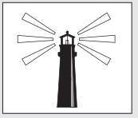

# Chương 8
## Thắp Lên Ngọn Lửa Nội Tâm

> *Hãy tin tưởng vào chính mình. Hãy tạo ra một cuộc sống khiến bạn vui vẻ và thoải mái. Hãy phát huy tất cả những gì được trao, bằng cách thổi bùng những đốm lửa tiềm năng nhỏ bé thành những ngọn lửa của thành tựu vĩ đại. *>
> – Foster C. McClellan

“Ngày Yogi Raman chia sẻ với tôi về câu chuyện ngụ ngôn bí ẩn của ông trên đỉnh Hy Mã Lạp Sơn thật sự rất giống với ngày hôm nay”, Julian nói.

“Thật ư?”

“Cuộc gặp của tôi và Yogi Raman bắt đầu vào buổi tối và kéo dài đến tận đêm khuya. Như tôi đã kể với anh, ngay từ phút đầu tiên gặp Raman, tôi có cảm giác như ông là người anh em của mình. Đêm nay, ngồi đây với anh và ngắm nhìn vẻ thích thú trên gương mặt anh, tôi cảm nhận được nguồn năng lượng và mối dây gắn kết tương tự. Đối với tôi, anh cũng như một người anh em của tôi. Thú thật, tôi nhìn thấy bản thân mình ở anh.”

“Anh là một luật sư tranh tụng tài năng hiếm có, Julian ạ. Tôi sẽ chẳng bao giờ quên được sự xuất sắc của anh trong công việc.”

Khi chia sẻ suy nghĩ này, tôi thấy Julian rõ ràng chẳng có hứng thú với việc nhắc đến quá khứ huy hoàng của anh.

“John, tôi muốn tiếp tục chia sẻ về các yếu tố khác trong câu chuyện ngụ ngôn của Yogi Raman với anh, nhưng trước hết, tôi cần xác nhận một điều. Vừa rồi anh đã học được một số chiến lược cực kỳ hiệu quả trong việc thay đổi bản thân, những chiến lược này sẽ mang đến nhiều điều kỳ diệu nếu anh kiên trì áp dụng chúng. Tối nay, tôi sẽ chia sẻ hết tất cả những gì tôi biết, bởi đó là nhiệm vụ tôi phải làm. Tôi chỉ muốn đảm bảo rằng anh hoàn toàn hiểu rõ tầm quan trọng của việc chia sẻ lại những tri thức này cho tất cả những ai đang tìm kiếm sự hướng dẫn giống như anh vậy. Chúng ta đang sống trong một thế giới phức tạp và khó khăn. Sự tiêu cực lan tràn khắp nơi và rất nhiều người trong xã hội chúng ta đang trôi dạt như những con tàu không người lái, những tâm hồn kiệt sức đang kiếm tìm một ngọn hải đăng để giúp họ tránh va vào những bờ đá gập ghềnh. Anh phải đóng vai trò của một thuyền trưởng. Tôi đặt trọn niềm tin vào anh, hãy chuyển thông điệp của các nhà hiền triết Sivana đến với những ai đang cần nó.”

Sau một hồi cân nhắc, tôi cam đoan với Julian rằng tôi sẽ nhận nhiệm vụ này. Rồi anh tiếp tục nói, một cách say sưa, “Cái hay của toàn bộ bài tập này nằm ở chỗ khi anh nỗ lực cải thiện cuộc sống của người khác, cuộc sống của chính anh cũng sẽ được nâng lên tầm cao mới. Chân lý này dựa trên một phương châm sống rất đặc biệt đã có từ ngàn xưa”.

“Tôi đang nghe đây.”

“Về cơ bản, các nhà hiền triết trên dãy Hy Mã Lạp Sơn sống theo một nguyên tắc đơn giản: ai phục vụ nhiều nhất thì sẽ thu hoạch nhiều nhất, cả về tình cảm, thể chất, trí tuệ lẫn tinh thần. Đây chính là con đường dẫn đến cảm giác bình an bên trong và sự thỏa mãn bên ngoài.”

Tôi đã từng đọc đâu đó rằng những người hiểu biết về người khác thì rất khôn ngoan, nhưng những người hiểu được chính mình mới thật sự thông thái và sáng suốt. Ngay tại nơi này, có lẽ là lần đầu tiên tôi mới được nhìn thấy một người thật sự hiểu bản thân họ như vậy, có lẽ còn hiểu cả bản thể cao nhất của họ nữa. Trong bộ trang phục giản dị và với nụ cười hiền từ luôn tỏa sáng trên gương mặt, Julian Mantle dường như đã có được tất cả: sức khỏe, hạnh phúc và một nhận thức rõ ràng về vai trò của mình trong vũ trụ muôn hình vạn trạng này. Dù thực tế anh chẳng sở hữu một thứ gì.

“Việc này khiến tôi nhớ đến ngọn hải đăng trong câu chuyện”, Julian nói, vẫn tập trung vào nhiệm vụ trước mắt.

“Tôi đang tự hỏi yếu tố đó đóng vai trò gì trong câu chuyện ngụ ngôn của Yogi Raman.”

“Tôi sẽ cố gắng giải thích cho anh”, Julian đáp, giọng điệu của anh giống như một giáo sư trên giảng đường hơn là một luật-sư-đã-trở- thành-tu-sĩ, một người đã từ bỏ thế giới trần tục này. “Giờ thì anh đã học được rằng tâm trí chúng ta giống như một khu vườn màu mỡ và để nó có thể phát triển tươi tốt nhất, anh phải chăm sóc nó mỗi ngày. Đừng bao giờ để cỏ dại là những suy nghĩ và hành động xấu xâm chiếm khu vườn tâm trí của mình. Hãy đứng canh gác ở cổng vào của tâm trí. Hãy giữ cho nó luôn khỏe khoắn và mạnh mẽ. Nó sẽ tạo nên những điều màu nhiệm trong cuộc sống của anh, nếu anh cho phép điều đó xảy ra.

Chắc anh nhớ là ở chính giữa khu vườn có một ngọn hải đăng đồ sộ. Biểu tượng này sẽ nhắc anh nhớ đến một nguyên tắc cổ xưa khác để khai sáng cuộc sống: mục đích của cuộc sống là sống có mục đích. Những ai thật sự giác ngộ biết những gì họ muốn có được từ cuộc sống này, về mặt cảm xúc, vật chất, thể chất và tinh thần. Những ưu tiên và mục tiêu được xác định rõ ràng trong mọi khía cạnh của cuộc sống đóng vai trò tương tự như ngọn hải đăng. Nó là ngọn đèn dẫn đường và cũng là nơi trú ẩn cho anh khi biển cả trở nên dữ dội. Anh thấy đó, John, bất cứ ai cũng có thể tạo ra một cuộc cách mạng toàn diện trong cuộc đời họ, một khi họ quyết tâm thay đổi hướng đi của mình. Nhưng nếu anh thậm chí còn không rõ mình đang đi đâu, thì làm sao anh biết được khi nào sẽ đến đích?”

Julian đưa tôi quay về thời điểm mà Yogi Raman phân tích nguyên tắc này cùng anh. Anh nhắc lại chính xác những lời mà nhà hiền triết đã nói,

“Cuộc đời thật buồn cười. Người ta thường cho rằng họ càng ít làm việc thì sẽ càng có thêm cơ hội để trải nghiệm hạnh phúc. Tuy nhiên, nguồn hạnh phúc đích thực có thể được diễn đạt qua một từ: thành tựu. Hạnh phúc bền vững đến từ việc kiên trì lao động để đạt được những mục tiêu của mình và tự tin tiến lên trên con đường hướng đến mục đích của cuộc đời. Đây chính là bí quyết để thắp lên ngọn lửa nội tâm đang âm ỉ cháy trong anh. Tôi hiểu rõ điều này có vẻ khá mỉa mai, khi anh đã đi hàng ngàn dặm khỏi một xã hội coi trọng thành tích để gặp cho được các bậc hiền triết sống ẩn dật trên dãy Hy Mã Lạp Sơn chỉ để học được một trong những bí quyết muôn đời cho cuộc sống hạnh phúc chính là thông qua thành tựu, nhưng đây là sự thật”.

“Những tu sĩ cuồng công việc ư?”, tôi đùa.

“Hoàn toàn ngược lại. Các nhà hiền triết là những người có hiệu suất làm việc đặc biệt cao, nhưng không phải theo kiểu quay cuồng với công việc. Thay vào đó, họ làm việc với thái độ bình thản, tập trung, giống như thiền vậy.”

“Làm thế nào để được như thế?”

“Mọi việc họ làm đều có mục đích. Mặc dù họ đã rời bỏ thế giới hiện đại để sống một cuộc sống thiên về tâm linh, nhưng họ cũng làm việc cực kỳ hiệu quả. Một số người dành thời gian để hoàn thiện những bộ triết luận, một số người khác thì sáng tác những bài thơ có cấu tứ phong phú để tự thử thách trí tuệ và làm mới óc sáng tạo của họ. Cũng có những người thì dành toàn bộ thời gian để suy ngẫm trong sự tĩnh lặng. Các nhà hiền triết Sivana không lãng phí thời gian. Lương tâm mách bảo họ rằng cuộc sống của họ có mục đích và họ có một nghĩa vụ cần thực hiện.

Đây là những gì Yogi Raman đã nói với tôi, ‘Tại Sivana, nơi mà thời gian dường như đứng yên, có thể anh sẽ thắc mắc các tu sĩ sống đơn sơ và không tài sản ở đây thì hy vọng đạt được những gì. Nhưng thật ra, thành tựu không nhất thiết phải là vật chất. Đối với cá nhân tôi, những mục tiêu của tôi là đạt được sự bình an nội tại, làm chủ bản thân và giác ngộ. Nếu tôi không đạt được những điều này vào lúc cuối đời, chắc chắn rằng tôi sẽ ra đi với cảm giác chưa hoàn thành nhiệm vụ và chưa được toại nguyện’.”

Julian nói với tôi rằng đó là lần đầu tiên anh ấy nghe một trong những vị thầy của mình ở Sivana nói về cái chết của chính họ. “Yogi Raman đã cảm nhận được điều đó từ vẻ mặt của tôi. Ông bảo, ‘Anh không cần phải lo lắng đâu, anh bạn. Tôi đã sống quá trăm tuổi và chưa có kế hoạch ra đi vội. Ý tôi chỉ đơn giản là khi anh biết rõ những mục tiêu mà mình muốn đạt được trong đời, có thể về vật chất, tình cảm, thể chất, hay tinh thần, và anh dành tất cả thời gian để hoàn thành những mục tiêu đó, thì cuối cùng anh sẽ tìm được niềm vui vĩnh cửu. Cuộc đời anh sẽ trở nên thú vị và tươi vui như cuộc đời tôi vậy – và anh sẽ nhận ra một hiện thực rực rỡ. Nhưng anh phải biết mục tiêu của đời mình và hiện thực hóa nó bằng cách kiên trì hành động. Chúng tôi gọi đó là Dharma, một từ trong tiếng Sanskrit có nghĩa là mục đích của cuộc đời’.”

“Vậy sự mãn nguyện của cuộc đời sẽ đến từ việc hoàn thành Dharma của tôi ư?”, tôi hỏi.

“Chắc chắn là vậy. Từ Dharma sẽ sinh ra sự hài hòa trong nội tâm và sự mãn nguyện lâu bền. Khái niệm Dharma dựa trên một nguyên tắc cổ xưa cho rằng mỗi người chúng ta đều có một sứ mệnh vĩ đại khi đến với thế giới này. Tất cả chúng ta đều được ban tặng những món quà độc đáo và tài năng thiên bẩm giúp chúng ta hoàn thành sứ mệnh của cuộc đời mình. Điểm mấu chốt là chúng ta phải khám phá ra chúng, và trong quá trình đó, chúng ta sẽ tìm ra mục tiêu chính của đời mình.”

Tôi ngắt lời Julian, “Nghe giống như điều mà anh đã nói khi nãy về việc chấp nhận mạo hiểm ấy nhỉ?”.

“Có thể đúng, có thể không.”

“Tôi chưa hiểu chỗ này lắm.”

“Đúng, là vì nhìn vào thì có vẻ như anh buộc phải chấp nhận một vài rủi ro để khám phá ra thế mạnh của bản thân và mục đích thật sự của đời mình. Nhiều người đã từ bỏ những công việc cản trở sự tiến bộ của họ ngay khi họ khám phá ra mục đích thật sự cho sự tồn tại của bản thân. Luôn có những rủi ro nhất định đi kèm với việc tìm hiểu bản thân và tự vấn lương tâm để nhìn nhận lại mình. Còn không đúng, là bởi vì việc khám phá bản thân và sứ mệnh của đời mình không bao giờ là một trò mạo hiểm. Biết rõ về bản thân chính là nền tảng cơ bản dẫn đến sự tự giác ngộ. Đây là một việc tốt, hay nói đúng hơn là một việc thiết yếu.”

“Thế Dharma của anh là gì, Julian?”, tôi lên tiếng hỏi, cố giấu sự hiếu kỳ như thiêu đốt trong lòng.

“Mục đích đời tôi đơn giản thôi: phục vụ người khác với lòng vị tha. Hãy nhớ điều này, anh sẽ không thể tìm thấy niềm vui thật sự khi ngủ, thư giãn hoặc hoang phí thời gian như một kẻ ăn không ngồi rồi. Như Benjamin Disraeli từng nói, ‘Bí quyết để thành công là kiên trì theo đuổi mục đích’. Niềm hạnh phúc mà anh đang tìm kiếm đến từ việc suy ngẫm kỹ càng về những mục đích xứng đáng với tất cả công sức mà anh sẽ bỏ ra để đạt được, và sau đó, hãy hành động mỗi ngày để tiến gần hơn đến chúng. Đây là sự ứng dụng trực tiếp của một triết lý vượt thời gian cho rằng ta không nên hy sinh những điều có ý nghĩa đặc biệt quan trọng vì những chuyện vặt vãnh. Ngọn hải đăng trong câu chuyện ngụ ngôn của Yogi Raman sẽ luôn nhắc nhở anh về sức mạnh của việc xác định các mục tiêu cụ thể, rõ ràng, và quan trọng nhất là anh phải có bản lĩnh để hành động nhằm đạt được những mục tiêu ấy.”

Trong vài giờ tiếp theo, tôi đã học được từ Julian rằng tất cả những người có tư duy phát triển và thực tế nhất đều hiểu rất rõ tầm quan trọng của việc khám phá tài năng của bản thân, tìm ra mục đích của riêng mình và sử dụng những món quà mình được ban tặng để thực hiện sứ mệnh ấy. Một số người thực hiện sứ mệnh phụng sự trong vai trò bác sĩ, một số khác thì trong vai trò nghệ sĩ. Một số người khám phá ra rằng họ có thế mạnh về truyền đạt thông tin, thế là họ trở thành những giáo viên tuyệt vời, trong khi một số người khác nhận ra những gì mà họ sở hữu sẽ tạo ra nhiều đổi mới trong lĩnh vực kinh doanh hay khoa học. Bí quyết là phải có tính kỷ luật và một tầm nhìn để nhận ra sứ mệnh cao cả của mình và đảm bảo rằng sứ mệnh đó sẽ phục vụ mọi người khi ta thực hiện nó.

“Đây có phải là một dạng thiết lập mục tiêu không?”

“Thiết lập mục tiêu là điểm khởi đầu. Việc lên kế hoạch chi tiết cho các mục tiêu cần phải đạt được sẽ giải phóng nguồn năng lượng sáng tạo giúp anh có thể đi trên con đường có ý nghĩa thật sự của đời mình. Bất kể anh có tin hay không, Yogi Raman và các nhà hiền triết khác rất hăng hái đối với các mục tiêu của họ đấy.”

“Anh đang đùa tôi đấy à. Những tu sĩ làm việc cực kỳ hiệu quả, sống sâu trong dãy Hy Mã Lạp Sơn, ngồi thiền suốt đêm và thiết lập mục tiêu suốt ngày. Tôi thích điều này rồi đấy!”

“John à, hãy luôn đánh giá dựa trên kết quả. Nhìn tôi đây này. Đôi khi nhìn vào gương, tôi thậm chí còn không nhận ra chính mình. Con người bất mãn của tôi ngày nào giờ đã được thay thế bởi một con người luôn hăng hái, thích phiêu lưu và có phần bí ẩn. Tôi đã trẻ lại và có được sức khỏe sung mãn. Tôi thật sự rất hạnh phúc. Những tri thức mà tôi đang chia sẻ với anh có một sức mạnh to lớn, hết sức quan trọng và có khả năng truyền sinh lực mạnh mẽ, nên anh phải mở rộng lòng mình để đón nhận nó.”

“Tôi đang rất cởi mở đấy, Julian, thật sự là như vậy. Mọi điều anh nói đều hoàn toàn hợp lý, mặc dù có vài phương pháp nghe hơi kỳ lạ. Nhưng tôi đã hứa sẽ thử thực hiện và tôi sẽ giữ lời. Tôi hoàn toàn đồng ý với anh rằng những thông tin này chứa đựng một sức mạnh vô cùng to lớn.”

“Nếu tôi có tầm nhìn xa hơn người khác, chẳng qua là bởi vì tôi đã được đứng trên đôi vai của những vị thầy vĩ đại”, Julian khiêm tốn đáp.

“Đây là một ví dụ khác. Yogi Raman là một cung thủ tài ba, một bậc thầy thực thụ. Để minh họa cho triết lý về tầm quan trọng của việc xác lập mục tiêu rõ ràng trong từng khía cạnh của cuộc sống và thực hiện sứ mệnh của đời mình, ông đã đưa ra một ví dụ minh họa mà tôi sẽ không bao giờ quên.

Gần chỗ chúng tôi ngồi có một cây sồi to. Nhà hiền triết rút một bông hoa hồng từ vòng hoa ông vẫn hay đeo và đặt nó vào giữa thân cây. Rồi ông lấy ra ba vật từ trong chiếc túi mà ông luôn mang bên mình như một người bạn đồng hành mỗi khi phiêu lưu đến những ngọn núi xa, giống ngọn núi mà chúng tôi đã ghé thăm vào hôm đó. Vật đầu tiên là cây cung yêu thích của ông, được làm từ gỗ đàn hương ngát hương thơm và cứng cáp. Vật thứ hai là một mũi tên. Vật thứ ba là một chiếc khăn tay màu trắng – loại khăn tôi hay xếp ở túi áo khi mặc mấy bộ com-lê đắt tiền để gây ấn tượng với các vị thẩm phán và bồi thẩm đoàn”, Julian nói thêm như để phân trần.

Rồi Yogi Raman yêu cầu Julian dùng chiếc khăn tay bịt mắt ông lại.

“Tôi đang đứng cách bông hoa hồng khoảng bao xa?”, Yogi Raman hỏi người học trò của mình.

“Khoảng ba mươi mét”, Julian ước chừng.

“Anh đã bao giờ quan sát những buổi luyện tập bắn cung hàng ngày của tôi chưa?”, nhà hiền triết hỏi dù đã biết rõ câu trả lời.

Julian nghiêm túc đáp, “Tôi đã thấy thầy bắn trúng tâm từ khoảng cách gần một trăm mét, và tôi không thể nhớ có lần nào thầy bắn trượt mục tiêu với khoảng cách hiện tại”.

Thế là, với đôi mắt bị chiếc khăn che kín, hai chân trụ vững trên mặt đất, người thầy dùng hết sức lực giương cung lên, nhắm thẳng hướng bông hoa hồng đang nằm trên thân cây và bắn mũi tên bay vút đi. Mũi tên cắm phập vào thân cây, cách mục tiêu một khoảng rất xa.

“Tôi cứ nghĩ thầy sẽ thể hiện thêm những khả năng kỳ diệu của mình chứ Yogi Raman. Điều gì đã xảy ra vậy thưa thầy?”

“Chúng ta đã cùng đến nơi hoang vu này vì một lý do duy nhất. Tôi đã đồng ý truyền dạy cho anh tất cả những tri thức của thế gian mà tôi biết. Ví dụ minh họa của ngày hôm nay nhằm củng cố lời khuyên của tôi về tầm quan trọng của việc thiết lập mục tiêu rõ ràng trong cuộc sống và sự hiểu biết chính xác về con đường mà mình đang đi. Những gì anh vừa thấy khẳng định nguyên tắc quan trọng nhất cho bất kỳ ai muốn đạt* được mục tiêu và thực hiện mục đích của đời mình: anh sẽ không thể *bắn trúng một mục tiêu mà anh không nhìn thấy. Người ta thường dành cả cuộc đời để ước ao mình sẽ trở nên hạnh phúc hơn, sống một cuộc sống vui tươi hơn với một niềm đam mê mãnh liệt. Thế nhưng, họ lại không nhìn thấy tầm quan trọng của việc dành ra chỉ mười phút mỗi tháng để viết xuống những mục tiêu của mình và suy nghĩ thấu đáo về ý nghĩa đời mình – Dharma của mình. Việc thiết lập mục tiêu sẽ khiến cuộc đời anh trở nên tươi đẹp rạng rỡ. Thế giới của anh sẽ trở nên phong phú hơn, thú vị hơn và diệu kỳ hơn.

Anh thấy đó, Julian, tổ tiên của chúng tôi đã dạy chúng tôi rằng việc thiết lập các mục tiêu rõ ràng để đạt được điều mình muốn về mặt trí tuệ, thể chất và tinh thần là yếu tố quyết định để những ước muốn ấy thành hiện thực. Trong thế giới trước đây của anh, mọi người đưa ra các mục tiêu về vật chất và tiền bạc. Chuyện đó chẳng có gì là sai trái cả nếu nó có giá trị với anh. Tuy nhiên, để đạt được sự tự chủ và giác ngộ, anh cũng phải đưa ra những mục tiêu cụ thể ở những khía cạnh khác. Anh có ngạc nhiên không nếu biết rằng tôi đã đặt ra những mục tiêu khá rõ ràng để có được sự bình an nội tại mà tôi mong muốn, nguồn sinh lực mà tôi dành cho mỗi một ngày và tình yêu thương mà tôi dành cho tất cả những người xung quanh mình? Việc thiết lập mục tiêu không chỉ dành cho những luật sư tài giỏi như anh – người đang sống trong một thế giới đầy những cám dỗ vật chất. Bất kỳ ai muốn cải thiện chất lượng của cuộc sống bên trong lẫn bên ngoài của mình đều phải lấy ra một mảnh giấy và bắt đầu viết xuống những mục tiêu của cuộc đời mình. Ngay khi việc này được hoàn thành, nguồn lực tự nhiên sẽ phát huy hiệu quả và biến những ước mơ thành hiện thực.”

Tôi hoàn toàn bị cuốn hút bởi những điều mình đang nghe. Khi tôi còn là một cầu thủ trong đội bóng ở trường trung học, huấn luyện viên của tôi đã liên tục nói về tầm quan trọng của việc biết rõ những gì mình muốn đạt được từ mỗi trận đấu. “Biết rõ điều mình muốn đạt được” là tín điều của ông, và đội bóng của chúng tôi đừng mơ được bước ra sân thi đấu khi chưa có kế hoạch tác chiến rõ ràng nhằm mang đến một chiến thắng vinh quang. Tôi thắc mắc không biết vì sao khi đã trưởng thành thì tôi không còn dành thời gian để lên ‘kế hoạch tác chiến’ cho chính cuộc đời mình nữa. Có thể Julian và Yogi Raman có một bí quyết nào đó mà tôi đang cần.

Tôi hỏi Julian, “Việc lấy ra một mảnh giấy và viết xuống đó các mục tiêu của mình thì có gì đặc biệt? Làm thế nào mà một hành động đơn giản như vậy có thể tạo nên sự khác biệt lớn?”.

Julian vui vẻ đáp, “Sự hứng thú rõ ràng của anh đã cho tôi cảm hứng để tiếp tục, John ạ. Lòng hăng say chính là một trong những yếu tố chính tạo nên sự thành công bền vững trong cuộc sống, và tôi rất vui khi thấy lòng hăng say của anh vẫn còn nguyên vẹn. Lúc nãy, tôi đã chia sẻ với anh rằng trung bình một ngày mỗi người chúng ta có khoảng 60.000 ý nghĩ. Bằng cách viết xuống những mong muốn và mục tiêu của mình trên một mảnh giấy, anh đã gửi một lá cờ đỏ đến tiềm thức của mình rằng những ý nghĩ này quan trọng hơn nhiều so với 59.999 ý nghĩ còn lại. Tâm trí anh sẽ bắt đầu tìm kiếm tất cả các cơ hội để hiện thực hóa định mệnh của anh, giống như một tên lửa được dẫn đường vậy. Đây thật sự là một quá trình rất khoa học, chỉ là hầu hết chúng ta không biết đến nó mà thôi”.

“Một vài cộng sự của tôi rất thích thiết lập mục tiêu. Nghĩ kỹ mới thấy, họ chính là những người thành công về tài chính nhất mà tôi được biết. Nhưng tôi không cho rằng họ có một cuộc sống cân bằng lắm đâu”, tôi nhận xét.

“Có lẽ họ đã không thiết lập đúng mục tiêu. Anh thấy đó, John, cuộc đời đã ban tặng cho anh hầu như mọi thứ anh thỉnh cầu. Đa số mọi người muốn vui vẻ hơn, có nhiều năng lượng hơn hoặc cảm thấy mãn nguyện hơn với cuộc sống. Thế nhưng, khi anh yêu cầu họ nói chính xác điều họ muốn là gì, thì họ lại không trả lời được. Cuộc sống của anh sẽ thay đổi ngay khi anh thiết lập những mục tiêu và bắt đầu tìm kiếm Dharma của đời mình”, Julian nói, đôi mắt anh sáng lấp lánh với những chân lý mà anh vừa chia sẻ.

“Anh đã bao giờ gặp một người nào đó có một cái tên lạ và rồi bắt đầu để ý thấy rằng cái tên ấy xuất hiện ở khắp mọi nơi: trên mặt báo, trên tivi, hoặc ở văn phòng chưa? Đây là ví dụ minh họa cho một nguyên tắc ngàn đời mà Yogi Raman gọi là joriki, hay còn gọi là sự tập trung tâm trí. Hãy tập trung tất cả nguồn năng lượng của tâm trí mình vào việc khám phá bản thân. Anh phải tìm hiểu xem mình có những khả năng nào vượt trội và điều gì khiến anh hạnh phúc. Có thể anh đang làm luật sư nhưng lẽ ra anh nên làm giáo viên, vì anh có tính kiên nhẫn và yêu thích việc dạy học. Có thể anh là một họa sĩ hoặc nhà điêu khắc đang bị giam hãm trong lớp vỏ bọc của một luật sư. Bất luận đó là gì, hãy tìm ra niềm đam mê của anh và theo đuổi nó.”

“Giờ khi nghiêm túc nghĩ về việc đó, tôi mới thấy sẽ thật đáng buồn nếu đến cuối đời mà tôi vẫn không nhận ra mình có một tài năng đặc biệt nào đấy có thể đánh thức tiềm năng của bản thân và giúp đỡ được những người khác – dù bằng những việc đơn giản nhất”. tôi thừa nhận.

“Đúng vậy. Thế nên từ giờ trở đi, anh cần phải nhận thức sâu sắc về mục đích của đời mình. Hãy đánh thức tâm trí để nhận ra vô vàn những cơ hội xung quanh. Hãy bắt đầu sống vui vẻ hơn. Tâm trí con người chính là một chiếc máy lọc lớn nhất thế giới. Khi được sử dụng đúng cách, nó sẽ lọc ra những gì mà anh cảm thấy không quan trọng và chỉ đưa những thông tin mà anh đang tìm kiếm vào thời điểm đó. Ngay thời điểm này đây, khi chúng ta ngồi trong phòng khách của anh, có hàng trăm, nếu không muốn nói là hàng ngàn việc khác đang diễn ra mà chúng ta không hề để tâm đến. Có tiếng rúc rích cười đùa của các đôi tình nhân khi đi dạo trên những con đường lót ván, tiếng của chú cá vàng đang bơi trong hồ ở sau lưng anh, tiếng gió từ máy điều hòa và thậm chí là cả tiếng đập của trái tim tôi nữa. Ngay khi quyết định tập trung vào nhịp tim của mình, tôi bắt đầu để ý đến nhịp điệu và các đặc tính khác của nó. Tương tự như vậy, khi anh quyết định tập trung tâm trí vào những mục đích chính của cuộc đời, thì tâm trí anh sẽ bắt đầu lọc ra những điều không quan trọng và chỉ tập trung vào những điều quan trọng mà thôi.”

“Thú thật với anh, không biết khi nào tôi mới tìm ra mục đích của đời mình”, tôi nói. “Xin đừng hiểu sai ý tôi, đúng là có rất nhiều điều tuyệt vời trong cuộc đời tôi. Nhưng chúng không khiến tôi thỏa mãn như tôi nghĩ. Nếu tôi có rời bỏ thế gian ngay hôm nay, tôi cũng chẳng thấy có gì khác biệt hơn so với mọi ngày.”

“Việc đó khiến anh cảm thấy thế nào?”

“Chán nản”, tôi thành thật thú nhận. “Tôi biết tôi có tài. Thật ra, tôi từng là một họa sĩ giỏi khi còn trẻ, cho đến khi nghề luật sư thu hút tôi với sự hứa hẹn về một cuộc sống ổn định hơn.”

“Anh có bao giờ ước mình đã theo đuổi nghề họa sĩ không?”

“Tôi thật sự chưa suy nghĩ nhiều đến chuyện đó. Nhưng tôi có thể nói chắc một điều. Khi vẽ, tôi thấy mình như đang ở Thiên Đường.”

“Điều đó thật sự truyền nhiệt huyết cho anh đúng không?”

“Hoàn toàn đúng. Tôi quên hết thời gian khi đang ở trong xưởng vẽ. Tôi sẽ đắm chìm trong khung tranh. Đó là một sự giải thoát thật sự đối với tôi. Cảm giác cứ như thể tôi vượt lên khỏi giới hạn của thời gian và đi vào một chiều kích khác vậy.”

“Đây chính là sức mạnh của sự tập trung tâm trí khi theo đuổi công việc mình yêu thích đấy John. Goethe từng nói, ‘Chúng ta được định hình và tạo dáng theo những gì chúng ta yêu thích’. Có thể Dharma của anh là thắp sáng thế giới này bằng những khung cảnh tươi đẹp. Ít nhất thì anh cũng nên dành một chút thời gian để vẽ mỗi ngày.”

“Vậy có cách nào để tôi áp dụng triết lý này vào những điều ít phức tạp hơn việc thay đổi cuộc đời không?”, tôi tươi cười hỏi.

“Tốt thôi”, Julian đáp. “Ví dụ như việc gì nào?”

“Ví dụ như một trong những mục tiêu của tôi, dù là nhỏ thôi, là làm sao để mất cái bụng bia mà tôi phải vác mỗi ngày. Tôi nên bắt đầu từ đâu đây?”

“Đừng ngại ngùng vì chuyện đó. Anh sẽ trở thành bậc thầy trong nghệ thuật thiết lập và đạt được mục tiêu bằng cách bắt đầu từ những việc nhỏ.”

“Hành trình vạn dặm bắt đầu từ một bước chân đúng không?”, tôi hỏi ngay.

“Chính xác là vậy. Việc đạt được những thành tựu nho nhỏ là một bước chuẩn bị để anh có thể thực hiện những mục tiêu lớn hơn. Thế nên, để trả lời một cách thẳng thắn cho câu hỏi của anh, thì không có gì sai trong việc đưa ra một loạt những mục tiêu nhỏ trong quá trình lên kế hoạch cho những mục tiêu lớn.”

Julian nói với tôi rằng các nhà hiền triết Sivana đã tạo ra một phương pháp năm bước để đạt được các mục tiêu của họ và thực hiện các sứ mệnh của đời mình. Phương pháp này rất đơn giản, thiết thực và hiệu quả. Bước đầu tiên là hình dung trong tâm trí một hình ảnh rõ ràng về kết quả mong muốn. Theo Julian, nếu kết quả đó là giảm cân thì mỗi sáng ngay sau khi thức dậy, tôi phải tưởng tượng bản thân mình là một người gọn gàng, săn chắc, đầy sức sống và dồi dào năng lượng. Hình ảnh này càng rõ nét chừng nào thì quá trình thực hiện sẽ càng hiệu quả chừng ấy. Anh bảo rằng tâm trí chúng ta chính là một nguồn sức mạnh, và hành động “hình dung” đơn giản này sẽ mở ra cánh cổng dẫn tới việc hiện thực hóa mong muốn ấy. Bước hai là tạo cho bản thân một ít áp lực tích cực.

“Nguyên nhân chính khiến người ta không thực hiện đến cùng các quyết tâm mà họ đưa ra là vì việc quay về lối mòn cũ quá dễ dàng. Áp lực không phải lúc nào cũng là điều xấu. Áp lực có thể tạo cảm hứng để anh gặt hái được những thành quả tuyệt vời. Người ta thường đạt được những điều vĩ đại khi họ bị dồn đến chân tường và buộc phải khai thác tiềm năng sẵn có bên trong.”

“Vậy làm sao để tôi tạo ra ‘áp lực tích cực’ này cho bản thân?”, tôi hỏi và bắt đầu suy nghĩ về những cách khả thi để áp dụng phương pháp này vào mọi thứ, từ việc thức dậy sớm cho đến việc trở thành một người cha kiên nhẫn và giàu tình thương hơn.

“Có rất nhiều cách để làm việc này. Một trong những cách tốt nhất là đưa ra một lời hứa công khai. Hãy nói với mọi người anh quen biết rằng anh sẽ giảm cân hoặc viết tiểu thuyết hoặc bất cứ điều gì, tùy vào mục tiêu của anh. Một khi anh đã công khai mục tiêu của mình với cả thế giới, lập tức sẽ có một áp lực thôi thúc anh thực hiện mục tiêu ấy, bởi chẳng ai muốn trở thành kẻ thất bại trong mắt người khác. Ở Sivana, các vị thầy của tôi còn dùng những cách dữ dội hơn để tạo ra áp lực tích cực này. Họ tuyên bố với nhau rằng nếu họ không thực hiện được cam kết của mình, ví dụ như nhịn ăn một tuần hoặc mỗi ngày thức dậy lúc bốn giờ sáng để ngồi thiền, thì họ sẽ phải đi xuống thác nước lạnh giá và đứng dưới dòng thác cho đến khi tay chân tê cóng. Đây là một minh họa rõ ràng nhất để chứng minh sức mạnh của loại áp lực này đối với việc xây dựng các thói quen tốt và đạt được các mục tiêu.”

“Cụm từ ‘rõ ràng nhất’ có vẻ chưa phản ánh đúng sự thật đâu, Julian. Phải gọi là một nghi thức kỳ quái!”

“Nhưng lại cực kỳ hiệu quả. Điểm chính yếu ở đây là khi anh rèn luyện để tâm trí liên kết niềm vui với thói quen tốt và sự trừng phạt với thói quen xấu thì những điểm yếu của anh sẽ nhanh chóng được gạt bỏ.”

“Anh bảo có năm bước tôi cần thực hiện để biến những mong muốn của mình thành hiện thực. Thế ba bước còn lại là gì?”, tôi nôn nóng hỏi.

“Đúng thế, John. Bước thứ nhất là hình dung rõ ràng về kết quả mong muốn. Bước thứ hai là tạo áp lực tích cực giúp cho bản thân luôn có cảm hứng để phấn đấu. Bước thứ ba khá đơn giản: đừng bao giờ đưa ra một mục tiêu mà không kèm theo một bảng tiến độ thực hiện. Để truyền sức sống cho mục tiêu, anh phải đưa ra thời hạn cụ thể để hoàn thành mục tiêu đó. Việc này cũng giống như khi anh chuẩn bị hồ sơ cho các vụ án vậy; anh sẽ luôn ưu tiên tập trung vào những vụ án mà thẩm phán đã lên lịch xét xử ngay ngày mai hơn là những vụ chưa có lịch xét xử.”

“À, nhân tiện”, Julian giải thích thêm, “hãy nhớ rằng một mục tiêu chưa được viết ra bằng giấy trắng mực đen thì chưa thể gọi là mục tiêu. Hãy đi mua một quyển nhật ký, một tập giấy ghi chú rẻ tiền cũng được. Hãy gọi nó là Quyển sổ Ước mơ của anh và viết vào đó tất cả những khát vọng, mục tiêu và mơ ước của mình. Hãy tìm hiểu bản thân để biết điều mà mình luôn mong muốn là gì”.

“Không phải là tôi đã hiểu bản thân rồi sao?”

“Hầu hết mọi người đều không thật sự hiểu chính mình. Họ chưa bao giờ dành thời gian để nhận biết những điểm mạnh, điểm yếu, hy vọng và ước mơ của bản thân. Người Trung Hoa đã định nghĩa hình ảnh của một người như sau. Có ba tấm gương tạo thành hình ảnh phản chiếu của một con người: tấm gương đầu tiên là cách bạn nhìn nhận bản thân, tấm gương thứ hai là cách người khác nhìn nhận về bạn, tấm gương thứ ba phản chiếu sự thật. Hãy nhận biết bản thân mình, John. Hãy nhận biết sự thật.

Hãy chia Quyển sổ Ước mơ của anh thành những phần riêng biệt cho các mục tiêu liên quan đến những lĩnh vực khác nhau của cuộc sống. Ví dụ, anh có thể dành những phần riêng cho các mục tiêu về sức khỏe thể chất, mục tiêu về tài chính, mục tiêu tăng cường các thế mạnh cá nhân, mục tiêu về xã hội và các mối quan hệ, có lẽ quan trọng nhất là những mục tiêu về tinh thần.”

“Nghe có vẻ thú vị đấy! Tôi chưa bao giờ nghĩ đến việc làm điều gì có tính sáng tạo như thế cho bản thân. Tôi thật sự cần bắt đầu thử thách bản thân nhiều hơn.”

“Tôi đồng ý. Một phương pháp hiệu quả khác mà tôi học được đó là hãy đưa vào Quyển sổ Ước mơ nhiều hình ảnh về những thứ anh mong muốn và cả hình ảnh của những người đã trau dồi các khả năng, tài năng và phẩm chất mà anh hy vọng có thể noi theo. Quay trở lại với anh và cái bụng bia của anh, nếu anh muốn giảm cân và có một thể hình nổi bật, hãy dán ảnh của một vận động viên ma-ra-tông hoặc một vận động viên thể thao xuất sắc vào Quyển sổ Ước mơ của mình. Nếu anh muốn trở thành người chồng tốt nhất thế giới thì sao không dán ảnh một người đại diện cho điều đó, cha anh chẳng hạn, và cho nó vào phần ‘các mối quan hệ’ trong quyển sổ. Nếu anh đang mơ về một căn biệt thự bên bờ biển hoặc một chiếc xe hơi thể thao, thì hãy tìm các bức ảnh khơi nguồn cảm hứng về những thứ ấy và đưa chúng vào Quyển sổ Ước mơ. Sau đó, anh phải xem lại quyển sổ ấy mỗi ngày, dù chỉ trong vài phút. Hãy biến nó thành một người bạn của anh. Các kết quả thu được sẽ khiến anh kinh ngạc đấy.”

“Đây quả là những hiểu biết mang tính đột phá, Julian ạ. Ý tôi là, mặc dù những ý tưởng này đã có từ nhiều thế kỷ trước, nhưng tất cả mọi người mà tôi biết ngày nay vẫn có thể cải thiện chất lượng cuộc sống của họ bằng cách áp dụng dù chỉ vài phương pháp trong số đó. Hẳn vợ tôi sẽ muốn có một Quyển sổ Ước mơ. Có thể cô ấy sẽ dán đầy quyển sổ những hình ảnh của tôi khi không có cái bụng bia này.”

“Thật ra nó cũng không to lắm đâu”, Julian nói với giọng an ủi.

“Thế thì tại sao Jenny lại gọi tôi là ‘Ông Bánh Vòng’ cơ chứ?”, tôi ngoác miệng cười.

Julian bắt đầu cười lớn, thế là tôi cũng cười theo. Chẳng mấy chốc mà cả hai chúng tôi đã cười lăn cười bò.

“Tôi đoán là nếu ta không thể cười chính mình thì ta có thể cười ai được chứ?”, tôi vừa nói vừa cười khúc khích.

“Rất đúng, anh bạn ạ. Khi tôi còn bị trói buộc trong lối sống trước kia của mình, một trong những vấn đề chính của tôi là luôn xem mọi thứ quá nghiêm trọng. Giờ thì tôi sống vui vẻ và vô tư hơn nhiều. Tôi tận hưởng tất cả những món quà của cuộc sống, dù chúng có nhỏ bé đến đâu.

Nhưng tôi đang đi lạc đề rồi. Tôi có rất nhiều điều để nói với anh và tất cả cứ tuôn ra cùng một lúc. Hãy quay lại với phương pháp năm bước để đạt được mục tiêu và hoàn thành các mục đích của đời mình. Một khi anh đã hình thành một hình ảnh rõ ràng trong tâm trí về kết quả mình mong muốn, tạo ra một ít áp lực đằng sau nó, đề ra thời hạn để thực hiện và nghiêm chỉnh viết ra giấy trắng mực đen, bước tiếp theo là áp dụng điều mà Yogi Raman gọi là Quy luật 21 Ngày Kỳ diệu. Những con người có tri thức ở thế giới của ông ấy tin rằng để một hành vi mới kết tinh thành một thói quen, người ta phải thực hiện nó trong hai mươi mốt ngày liên tục.”

“Có gì đặc biệt trong hai mươi mốt ngày đó à?”

“Các nhà hiền triết là những bậc thầy trong việc tạo ra những thói quen mới tốt đẹp, đóng vai trò dẫn dắt cuộc sống của họ. Yogi Raman từng nói với tôi rằng một thói quen xấu khi đã được hình thành thì sẽ không thể nào xóa đi được.”

“Nhưng chẳng phải suốt cả đêm nay anh đã khuyến khích tôi thay đổi cách sống của mình sao? Làm sao tôi có thể thực hiện điều đó nếu tôi không thể xóa đi bất cứ thói quen xấu nào của mình?”

“Tôi nói không thể xóa đi những thói quen xấu, chứ tôi không nói không thể thay thế những thói quen tiêu cực”, Julian nhấn mạnh.

“Ôi, Julian, anh đúng là sắc sảo về từ ngữ. Nhưng tôi nghĩ là mình đã hiểu ý anh rồi.”

“Cách duy nhất để thiết lập và duy trì một thói quen mới là hướng thật nhiều năng lượng tập trung vào nó đến nỗi thói quen cũ bị gạt ra như một vị khách không được hoan nghênh. Quá trình thiết lập này nhìn chung mất khoảng hai mươi mốt ngày, tương ứng với khoảng thời gian cần thiết để tạo ra một đường dẫn truyền thần kinh mới.”

“Giả sử tôi muốn bắt đầu thực hành phương pháp Tâm của Hoa hồng để loại bỏ thói quen lo lắng và có một nhịp sống bình yên hơn, thì tôi có phải thực hiện nó vào cùng một thời điểm mỗi ngày hay không?”* “Hỏi rất hay! Điều đầu tiên tôi phải nói với anh là anh không phải *làm bất cứ việc gì cả. Mọi thứ mà tôi chia sẻ đêm nay, tôi đều nói trong vai trò của một người bạn thật lòng quan tâm đến sự phát triển và tiến bộ của anh. Mỗi chiến lược, công cụ và phương pháp đều đã được kiểm chứng qua thời gian về hiệu quả và những kết quả thực tế có thể đo lường được. Điều này tôi có thể đảm bảo với anh. Mặc dù trong lòng tôi rất muốn nài nỉ anh thử hết tất cả những phương pháp của các nhà hiền triết, nhưng lương tâm lại bảo tôi hãy cứ đơn giản hoàn thành nhiệm vụ của mình và chia sẻ hết với anh những tri thức mà tôi được lĩnh hội, còn việc thực hiện chúng thế nào thì để anh quyết định. Quan điểm của tôi là thế này: đừng bao giờ làm việc gì chỉ vì anh buộc phải làm. Lý do duy nhất để làm một việc nào đó là vì anh thật sự muốn làm và vì anh biết đó là điều đúng đắn nên làm.”

“Rất hợp lý, Julian. Anh đừng lo, chưa lúc nào tôi cảm thấy anh đang nhồi nhét những kiến thức này vào đầu tôi cả. Dù sao thì thứ duy nhất mà tôi có thể nhồi nhét vào cơ thể mình những ngày này là một hộp bánh vòng – và chuyện đó thì có gì lớn lao đâu”, tôi bông đùa.

Julian cười vui vẻ. “Cảm ơn, anh bạn. Bây giờ, để trả lời câu hỏi của anh, tôi đề nghị anh thử thực hiện phương pháp Tâm của Hoa hồng vào cùng một thời điểm mỗi ngày và tại cùng một địa điểm. Có một sức mạnh to lớn ẩn chứa bên trong các hoạt động cố định. Các ngôi sao thể thao ăn cùng một chế độ hoặc buộc dây giày của mình theo cùng một kiểu trước một trận đấu lớn để mở ra nguồn sức mạnh của nghi thức. Các thành viên nhà thờ thực hiện cùng một nghi lễ, mặc cùng một loại lễ phục cũng là những người đang sử dụng sức mạnh của nghi thức. Thậm chí các doanh nhân luôn đi một con đường cố định, hay nói lại cùng một bài phát biểu trước một buổi thuyết trình lớn cũng đang áp dụng sức mạnh của nghi thức. Anh thấy đấy, khi anh thêm bất kỳ hoạt động nào vào thói quen sinh hoạt hàng ngày bằng cách thực hiện nó theo cùng một cách thức, vào cùng một thời điểm mỗi ngày, nó sẽ nhanh chóng trở thành một thói quen.

Ví dụ, hầu hết mọi người sẽ làm cùng một việc khi vừa thức dậy như một phản xạ không cần suy nghĩ. Họ mở mắt, ra khỏi giường, đi vào phòng tắm và bắt đầu đánh răng. Thế nên, hãy tập trung vào mục tiêu của mình trong khoảng thời gian hai mươi mốt ngày và thực hiện hoạt động mới vào cùng một thời điểm mỗi ngày trong khoảng thời gian này. Điều này sẽ biến nó thành một phần trong nếp sinh hoạt của anh. Rồi anh sẽ nhanh chóng hình thành được thói quen mới – dù đó là ngồi thiền, dậy sớm hoặc đọc sách khoảng một tiếng mỗi ngày – dễ dàng như cách anh đánh răng vậy.”

“Thế còn bước cuối cùng để đạt được mục tiêu và tiến gần hơn đến mục đích của đời mình là gì?”

“Bước cuối cùng trong phương pháp của các nhà hiền triết là một bước có tính khả dụng tương đương như cách anh tiến bước trên đường đời.”

“Tách trà của tôi vẫn cạn”, tôi nói với giọng nghiêm túc.

“Hãy tận hưởng quá trình. Các nhà hiền triết Sivana vẫn thường nói về triết lý này. Họ thật sự tin rằng một ngày không có tiếng cười, hay một ngày không có tình yêu thương là một ngày không có sự sống.”

“Tôi không chắc là mình theo kịp anh.”

“Tất cả những gì tôi đang nói là hãy chắc rằng anh cảm thấy vui vẻ khi tiến bước trên con đường dẫn đến những mục tiêu và ý nghĩa cuộc đời mình. Đừng bao giờ quên tầm quan trọng của việc sống với một lòng hân hoan vô hạn. Đừng bao giờ làm ngơ trước vẻ đẹp tuyệt vời của sự sống xung quanh mình. Ngày hôm nay và khoảnh khắc tôi và anh đang chia sẻ với nhau đây chính là một món quà. Hãy duy trì tinh thần hăng hái, vui vẻ và hiếu kỳ như thế này. Hãy tập trung vào mục đích đời mình và sống với tinh thần phục vụ mọi người không vị kỷ. Tất cả những chuyện còn lại đã có sự an bài của vũ trụ. Đây là một trong những quy luật tự nhiên chuẩn xác nhất.”

“Và không bao giờ hối tiếc những việc xảy ra trong quá khứ?”

“Chính xác. Không có sự hỗn loạn trong vũ trụ này. Mọi việc đã và sẽ xảy đến với anh đều có một ý nghĩa nhất định. Hãy nhớ những điều tôi đã nói với anh. Mỗi trải nghiệm đều mang đến những bài học. Thế nên hãy thôi tập trung quá nhiều vào những việc không quan trọng. Hãy tận hưởng cuộc sống.”

“Chỉ thế thôi sao?”

“Tôi vẫn còn rất nhiều tri thức khác để chia sẻ cùng anh. Anh có mệt không?”

“Không mệt chút nào. Thật ra tôi còn cảm thấy khá hưng phấn. Anh đúng là một người tạo động lực thúc đẩy mạnh mẽ, Julian ạ. Anh có bao giờ nghĩ đến một chương trình phóng sự quảng cáo chưa?”, tôi hỏi đùa.

“Tôi không hiểu”, Julian lịch sự trả lời.

“Đừng bận tâm, chỉ là một nỗ lực hài hước yếu kém của tôi thôi.”

“Được rồi. Trước khi chúng ta tiếp tục với câu chuyện ngụ ngôn của Yogi Raman, còn một điểm cuối cùng về việc vươn tới các mục tiêu và mơ ước mà tôi muốn nhấn mạnh với anh.”

“Anh cứ nói đi.”

“Có một từ mà các nhà hiền triết luôn nói về nó với một sự tôn kính.”

“Tôi đang nghe đây.”

“Từ này rất đơn giản và dường như chứa đựng một ý nghĩa sâu sắc đối với họ, nó thường xuyên xuất hiện trong những cuộc trò chuyện hàng ngày của họ. Từ mà tôi đang nói đến là ‘đam mê’ và đó là từ mà anh phải luôn đặt lên hàng đầu trong tâm trí mình khi theo đuổi sứ mệnh và đạt được các mục tiêu đề ra. Một niềm đam mê cháy bỏng chính là nguồn nhiên liệu mạnh mẽ nhất để anh thực hiện những ước mơ của mình. Trong xã hội ngày nay, chúng ta đã đánh mất niềm đam mê. Chúng ta làm việc không phải vì yêu thích công việc đó. Chúng ta làm vì cảm thấy buộc phải như vậy. Đây chính là yếu tố gây ra nỗi bất hạnh. Ở đây tôi không nói đến đam mê về tình ái, mặc dù nó cũng là một thành phần khác tạo nên cuộc sống thành công và giàu cảm hứng. Điều tôi đang nói đến là niềm đam mê đối với cuộc sống. Hãy lấy lại niềm vui sướng khi mỗi sáng thức giấc thấy mình đầy năng lượng và hân hoan. Hãy thổi ngọn lửa đam mê vào trong mọi việc anh làm. Anh sẽ nhanh chóng thu về những phần thưởng tuyệt vời, cả về vật chất lẫn tinh thần.”

“Anh nói nghe có vẻ đơn giản quá.”

“Thật sự đơn giản thế đấy. Kể từ đêm nay trở đi, hãy nắm toàn quyền kiểm soát cuộc đời mình. Anh phải kiên quyết làm chủ vận mệnh của chính mình. Hãy đua cuộc đua của riêng anh. Hãy khám phá sứ mệnh của anh trong cuộc đời này và bắt đầu trải nghiệm cảm giác ngất ngây của một cuộc sống tràn đầy cảm hứng. Cuối cùng, hãy luôn ghi nhớ rằng những gì ở phía sau và phía trước anh đều chẳng là gì so với những giá trị ở bên trong anh.”

“Cảm ơn anh, Julian. Tôi thật sự cần nghe những điều này. Tôi chưa bao giờ nhận ra các khiếm khuyết trong cuộc đời mình cho đến tận đêm nay. Tôi đã đi lang thang vô định qua cuộc đời này mà chẳng biết mục đích thật sự của mình là gì. Mọi thứ sẽ phải thay đổi. Tôi hứa với anh đấy. Tôi rất biết ơn vì những điều anh đã chia sẻ đêm nay.”* “Không có chi đâu, anh bạn. Tôi chỉ là đang hoàn thành mục đích của* chính mình đó thôi.”

---

### TÓM TẮT CHƯƠNG 8

**Biểu tượng: Nguyên tắc: **Theo đuổi mục đích đời mình** Bài học: **- Mục đích của cuộc sống là sống có mục đích.

- Việc khám phá và thực hiện sứ mệnh của đời mình sẽ mang đến một cuộc sống mãn nguyện lâu bền.

- Thiết lập những mục tiêu rõ ràng trong cuộc sống cá nhân, sự nghiệp lẫn đời sống tinh thần, và hãy can đảm thực hiện chúng.** Phương pháp:**

- Sức mạnh của việc tìm hiểu bản thân

- Phương pháp năm bước để đạt mục tiêu

> *Đừng bao giờ quên tầm quan trọng của việc sống với một lòng hân hoan vô hạn. Đừng bao giờ làm ngơ trước vẻ đẹp tuyệt vời của mọi sự sống quanh mình. Ngày hôm nay và khoảnh khắc này là một món quà. Hãy tập trung vào mục đích của đời mình. Vũ trụ sẽ an bài mọi sự còn lại.*
