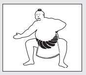

# Chương 9
## Nghệ Thuật Tự Lãnh Đạo

> *Người tài giỏi luôn không ngừng trau dồi bản thân. *>
> – Khổng Tử

“Thời gian trôi nhanh thật”, Julian nói trước khi tự rót thêm cho mình một tách trà. “Trời sẽ sáng rất nhanh thôi. Anh muốn tôi tiếp tục không, hay bao nhiêu đó đã đủ cho đêm nay?”

Không đời nào tôi lại để con người đang nắm giữ trong tay những viên ngọc tri thức quý giá này bỏ dở câu chuyện ở đây. Thoạt nghe thì câu chuyện của Julian giống như một sản phẩm của trí tưởng tượng. Nhưng khi thật sự lắng nghe và tiếp thu triết lý vượt thời gian mà anh đã được ban tặng, tôi đã trở nên vững tin vào những điều anh nói. Đây không phải là những lời nông cạn vì mục đích tư lợi của một con buôn rẻ tiền. Julian là một con người rất có uy tín. Anh nói được làm được, và thông điệp của anh hoàn toàn là sự thật. Tôi tin anh.

“Xin hãy tiếp tục, Julian, tôi có nhiều thời gian mà. Tối nay bọn trẻ ngủ ở nhà ông bà, còn Jenny thì phải vài giờ nữa mới thức dậy.”

Nhận thấy sự chân thành của tôi, anh tiếp tục với câu chuyện ngụ ngôn mà Yogi Raman đã kể nhằm minh họa cho những tri thức về việc vun đắp một cuộc sống ý nghĩa, phong phú và tươi sáng hơn.

“Tôi đã nói với anh rằng khu vườn trong câu chuyện đại diện cho khu vườn màu mỡ của tâm trí anh, một khu vườn đầy những báu vật và vô số của cải. Tôi cũng đã nói với anh về ngọn hải đăng như một biểu tượng đại diện cho sức mạnh của các mục tiêu và tầm quan trọng của việc khám phá ra sứ mệnh đời mình. Anh sẽ nhớ lại những điểm đó khi chúng ta tiếp tục câu chuyện này, khi cánh cửa của ngọn hải đăng chầm chậm mở ra và một võ sĩ sumo cao 2,7 mét, nặng hơn 400 ký oai vệ bước ra.”

“Nghe cứ như cảnh trong phim Godzilla.”

“Hồi nhỏ tôi rất mê bộ phim đó.”

“Tôi cũng thế. Nhưng đừng để tôi cắt ngang câu chuyện của anh”, tôi đáp.

“Vị võ sĩ sumo đại diện cho một yếu tố rất quan trọng trong hệ thống giúp thay đổi cuộc đời của các nhà hiền triết Sivana. Yogi Raman nói với tôi rằng nhiều thế kỷ trước ở phương Đông cổ đại, nhiều bậc thầy vĩ đại đã phát triển và hoàn thiện một triết lý gọi là kaizen. Từ tiếng Nhật này có nghĩa là sự cải tiến liên tục và không ngừng. Nó chính là dấu ấn cá nhân của những con người đang sống một cuộc đời tỉnh thức trọn vẹn và vượt trội.”

“Thế khái niệm kaizen này đã khiến cuộc sống của các nhà hiền triết thêm phong phú như thế nào?”, tôi hỏi.

“Như tôi đã từng đề cập đấy, John, thành công bên ngoài bắt nguồn từ thành công ở bên trong. Nếu anh thật sự muốn cải thiện thế giới bên ngoài của mình, dù đó là sức khỏe, các mối quan hệ, hay tình trạng tài chính, thì trước tiên anh phải cải thiện thế giới nội tâm của mình. Cách hiệu quả nhất để làm việc này là thực hành việc cải thiện bản thân liên tục. Làm chủ bản thân chính là yếu tố quyết định để làm chủ cuộc đời.”

“Julian, tôi hy vọng anh không phiền khi tôi nói điều này, nhưng đối với tôi, tất cả những gì anh nói về ‘thế giới nội tâm’ của một người nghe có vẻ rất khó hiểu. Anh nên nhớ tôi chỉ là một luật sư tầm trung sống ở vùng ngoại ô, sở hữu một chiếc xe bán tải nhỏ đỗ ở lối đi trước nhà và một chiếc máy cắt cỏ nằm trong ga-ra.

Những gì anh nói với tôi đến thời điểm này đều rất hợp lý. Thật sự thì hầu hết những gì anh đã chia sẻ đều có vẻ là những kiến thức rất phổ thông, mặc dù tôi biết rằng chúng không còn phổ biến lắm trong thời buổi này. Nhưng tôi phải nói với anh rằng tôi gặp chút khó khăn trong việc nắm bắt khái niệm kaizen và việc cải thiện thế giới nội tâm. Chính xác thì chúng ta đang nói về vấn đề gì vậy?”

Julian lập tức trả lời, “Trong xã hội của chúng ta, những người thiếu kiến thức thường bị gắn cho cái mác yếu kém. Tuy nhiên, chính những người thể hiện kiến thức yếu kém và tìm kiếm sự hướng dẫn đó mới là những người tìm ra con đường dẫn đến sự khai sáng trước bất kỳ ai khác. Những câu hỏi của anh rất chân thật và cho tôi thấy rằng anh rất cởi mở trước các ý tưởng mới. Sự thay đổi là nguồn lực mạnh mẽ nhất trong xã hội của chúng ta ngày nay. Hầu hết mọi người đều sợ nó, thế nhưng những người thông thái thì biết tận dụng nó. Nguyên tắc thiền truyền thống nói về tâm trí của một người mới bắt đầu như sau: những* người giữ cho tâm trí mình rộng mở trước mọi khái niệm mới – những *người mà tách trà của họ luôn cạn – sẽ luôn vươn đến các thành tựu và sự thỏa mãn cao hơn. Đừng bao giờ chần chừ với việc đưa ra câu hỏi, dù là những câu hỏi cơ bản nhất. Chúng chính là phương pháp hiệu quả nhất để mở ra những kiến thức mới”.

“Cảm ơn anh, nhưng tôi vẫn chưa hiểu rõ về kaizen.”

“Khi tôi nói đến việc cải thiện thế giới nội tâm, tôi chỉ đơn giản là nói về sự tự cải thiện và phát triển bản thân. Đó chính là điều tốt đẹp nhất anh có thể làm cho chính mình. Có thể anh nghĩ rằng mình quá bận rộn nên không thể làm những việc đó, nhưng suy nghĩ này là một sai lầm to lớn. Anh thấy đấy, khi anh dành thời gian để xây dựng một con người mạnh mẽ, đầy kỷ luật, năng lượng, sức mạnh và sự lạc quan thì anh sẽ có mọi thứ và làm được mọi điều mình muốn ở thế giới bên ngoài.

Khi anh đã vun đắp một lòng tin vững chắc vào khả năng của mình và một tinh thần bất khuất, thì không gì có thể ngăn cản anh thành công trong những việc mình đang theo đuổi và được sống với những thành quả xứng đáng. Việc dành thời gian để làm chủ tâm trí, chăm sóc cơ thể và nuôi dưỡng tâm hồn sẽ giúp anh phát triển cuộc sống thêm phong phú và tràn đầy sinh lực. Nó giống như điều mà Epictetus đã nói cách đây nhiều năm, ‘Không có con người tự do nào mà lại không tự làm chủ bản thân mình’.”

“Vậy kaizen thật ra là một khái niệm rất thiết thực.”

“Đúng vậy. Hãy nghĩ mà xem, John. Làm thế nào một người có thể lãnh đạo một công ty nếu anh ta thậm chí không lãnh đạo được chính mình? Làm thế nào anh có thể nuôi dưỡng một gia đình nếu anh chưa học cách nuôi dưỡng và chăm sóc chính mình? Làm thế nào anh có thể làm được việc tốt nếu tâm trạng anh không tốt? Anh hiểu ý tôi chứ?”

Tôi gật đầu đồng ý. Đây là lần đầu tiên tôi suy nghĩ nghiêm túc về tầm quan trọng của việc cải thiện bản thân. Tôi đã luôn nghĩ rằng tất cả những người mà tôi bắt gặp đang đọc những quyển sách có tựa đại loại* như: The Power of Positive Thinking (tạm dịch: Sức mạnh của Suy nghĩ *Tích cực) hoặc MegaLiving! (tạm dịch: Sống không giới hạn) ở ga tàu điện ngầm là những tâm hồn ưu phiền đang tuyệt vọng tìm kiếm một liều thuốc nào đó để giúp họ trở lại trạng thái bình thường. Giờ thì tôi nhận ra rằng những người dành thời gian để rèn luyện sức mạnh bản thân chính là những người mạnh mẽ nhất, và chỉ có thông qua việc cải thiện chính mình, chúng ta mới có thể hy vọng cải thiện được cuộc sống của nhiều người khác. Rồi tôi bắt đầu suy ngẫm về tất cả những việc mà tôi có thể thay đổi cho tốt hơn. Chắc chắn tôi có thể tận dụng nguồn năng lượng mới dồi dào hơn và một sức khỏe cường tráng mà việc tập thể dục mang lại. Việc kiềm chế tính nóng nảy và thói quen ngắt lời người khác có thể làm nên những kỳ tích trong mối quan hệ giữa tôi với vợ và các con. Và việc loại bỏ thói quen lo lắng sẽ mang đến cho tôi sự bình an nội tâm và niềm hạnh phúc viên mãn mà tôi luôn tìm kiếm. Càng nghĩ về việc này, tôi càng thấy mình có thể cải thiện được nhiều điều hơn.

Khi bắt đầu nhìn thấy tất cả những điều tích cực sẽ ào ạt chảy vào cuộc sống của mình thông qua việc trau dồi những thói quen tốt, tôi trở nên rất hào hứng. Nhưng tôi nhận ra điều mà Julian muốn nói đến không chỉ là tầm quan trọng của việc tập thể dục mỗi ngày, chế độ ăn uống lành mạnh và lối sống cân bằng. Những gì anh đã được lĩnh hội trên đỉnh Hy Mã Lạp Sơn có ý nghĩa sâu sắc và giá trị hơn nhiều so với những việc này. Anh đã nói về tầm quan trọng của việc xây dựng một cá tính mạnh mẽ, phát triển một ý chí bền bỉ và sống với lòng can đảm. Anh nói rằng ba phẩm chất này sẽ đưa người ta đến với một cuộc sống không chỉ đạo đức mà còn đầy thành tựu, sự mãn nguyện và cả bình yên nội tâm. Can đảm là một đức tính mà mọi người đều có thể nuôi dưỡng và nó chắc chắn sẽ mang đến những ích lợi to lớn về lâu dài.

“Vậy lòng can đảm có liên quan thế nào đến sự tự lãnh đạo và phát triển bản thân?”, tôi thắc mắc.

“Lòng can đảm cho phép anh làm chủ cuộc đua của mình. Lòng can đảm cho phép anh làm bất cứ việc gì anh muốn vì anh biết việc đó là đúng đắn. Lòng can đảm giúp anh tự kiểm soát bản thân để kiên trì trong những tình huống mà người khác đã thất bại. Cuối cùng, mức độ can đảm của anh tỷ lệ thuận với sự thỏa mãn mà anh sẽ nhận được. Nó giúp cho anh nhận ra những điều kỳ diệu tuyệt vời trong thiên anh hùng ca của đời mình. Và những ai làm chủ bản thân luôn có đầy lòng can đảm.”

“Được rồi. Tôi đang dần hiểu ra sức mạnh của việc trau dồi bản thân. Vậy tôi nên bắt đầu từ đâu?”

Julian trở lại với cuộc trò chuyện giữa anh và Yogi Raman trên đỉnh núi cao, vào một đêm mà theo anh nhớ là bầu trời đêm ấy lấp lánh muôn ngàn ánh sao tuyệt đẹp.

“Lúc đầu, bản thân tôi cũng cảm thấy khó khăn để hiểu đúng về khái niệm tự cải thiện này. Suy cho cùng, tôi là một luật sư cừ khôi được đào tạo tại Đại học Harvard danh giá, người chẳng có thời gian để cho những kẻ mà tôi cho là có kiểu tóc xấu xí thường lang thang ở các sân bay nhồi nhét mớ lý thuyết của Thời Đại Mới vào đầu mình. Nhưng tôi đã sai. Chính tư duy bảo thủ ấy đã kìm hãm cuộc đời tôi suốt nhiều năm qua. Càng lắng nghe Yogi Raman, tôi càng suy ngẫm nhiều hơn về nỗi đau và những thống khổ trong cuộc đời trước đây của mình. Và từ đó, tôi càng chào đón triết lý kaizen – sự cải tiến liên tục không ngừng của trí tuệ, cơ thể và tâm hồn – bước vào cuộc đời mới của mình”, Julian thừa nhận.

“Vì sao gần đây tôi thường nghe nhiều về ‘trí tuệ, cơ thể và tâm hồn’ thế nhỉ? Hầu như không lúc nào bật tivi lên mà không nghe ai đó đề cập đến những điều này.”

“Đây chính là bộ ba món quà mà anh được ban tặng khi sinh ra trên đời này. Chỉ cải thiện trí tuệ mà không chăm sóc cơ thể thì kết quả sau cùng cũng chỉ là chiến thắng rỗng tuếch. Nâng tầm trí tuệ và sức khỏe thể chất lên mức cao nhất mà không bồi dưỡng tâm hồn sẽ khiến anh thấy trống rỗng và không thỏa mãn. Nhưng khi anh dồn hết năng lượng của mình vào việc giải phóng toàn bộ tiềm năng của bộ ba này, anh sẽ tận hưởng được cảm giác ngây ngất mê ly của một cuộc đời được khai sáng.”

“Anh khiến tôi hào hứng lắm rồi đấy, anh bạn ạ.”

“Trở lại với câu hỏi nên bắt đầu từ đâu của anh, tôi hứa trong ít phút tiếp theo sẽ hướng dẫn anh một số phương pháp cổ xưa rất hiệu quả. Nhưng trước tiên, tôi phải chia sẻ một ví dụ minh họa thực tế này đã. Anh hãy vào vị trí chuẩn bị thực hiện động tác hít đất đi.”

Tôi thầm nghĩ, “Ôi trời, Julian trở thành một sĩ quan huấn luyện trong quân đội rồi”. Với sự hiếu kỳ và mong muốn giữ cho tách trà của mình luôn cạn, tôi làm theo yêu cầu của anh.

“Giờ thì hãy hít đất càng nhiều càng tốt. Đừng dừng lại cho đến khi anh thật sự chắc rằng mình không thể làm thêm được nữa.”

Tôi đã đánh vật với bài tập thể dục này. Thân hình hơn 90 ký của tôi chẳng mấy khi vận động, cùng lắm là tôi chỉ đi bộ đến cửa hàng McDonald's gần nhất với bọn trẻ hoặc múa vài đường golf với mấy cộng sự của mình. Mười lăm cái hít đất đầu tiên là một cực hình. Sức nóng của đêm mùa hè hôm ấy cùng với sự khó chịu khiến tôi vã mồ hôi như tắm. Tuy nhiên, tôi quyết tâm không để lộ bất kỳ dấu hiệu nào của sự yếu đuối và tiếp tục thực hiện cho đến khi sự kiêu căng của tôi phải đầu hàng trước đôi tay đã mỏi nhừ. Hít được hai mươi ba cái, tôi bỏ cuộc.

“Tôi không làm nổi nữa đâu, Julian. Mệt đến chết được. Anh đang cố nói với tôi điều gì vậy?”

“Anh có chắc là mình không thể thực hiện thêm nữa không?”

“Chắc chắn. Thôi nào, tha cho tôi đi. Bài học duy nhất mà tôi có thể học được từ việc này là cách sơ cứu một ca đau tim.”

“Hít thêm mười cái nữa đi. Sau đó, anh có thể nghỉ ngơi”, Julian ra lệnh.

“Hẳn là anh đang đùa!”

Nhưng rồi tôi vẫn tiếp tục. Một. Hai. Năm. Tám. Và cuối cùng cũng đến cái thứ mười. Tôi nằm dài trên sàn nhà, hoàn toàn kiệt sức.

“Tôi cũng đã có trải nghiệm giống y thế này với Yogi Raman, vào cái đêm ông ấy chia sẻ câu chuyện ngụ ngôn đặc biệt với tôi”, Julian nói.

“Ông ấy nói rằng nỗi đau chính là một người thầy tuyệt vời.”

Tôi vừa hỏi vừa thở hổn hển, “Thế người ta có thể học được gì từ một trải nghiệm như thế này?”.

“Về vấn đề này, Yogi Raman và các nhà hiền triết Sivana đều tin rằng con người phát triển nhiều nhất khi họ bước vào Vùng Ẩn Số.”

“Được rồi. Nhưng điều đó thì có liên quan gì đến việc bắt tôi phải hít đất thế kia?”

“Sau khi hít đất được hai mươi ba cái, anh nói là anh không thể hít thêm được nữa. Anh nói đây chính là giới hạn tuyệt đối của mình. Thế nhưng, khi tôi ra thử thách yêu cầu anh phải thực hiện thêm, anh đã đáp lại bằng mười cái hít đất nữa. Từ sâu thẳm bên trong, anh sở hữu nhiều hơn thế, và khi anh vươn tay đến những nguồn lực tiềm ẩn của mình, anh đã nhận được nhiều hơn. Yogi Raman đã giải thích một chân lý cơ* bản khi tôi còn là học trò của ông ấy, ‘Những giới hạn duy nhất trong *cuộc đời anh chính là những giới hạn anh tự đặt ra cho mình’. Khi anh dám bước ra khỏi vòng tròn thoải mái của bản thân và khám phá những điều chưa biết, anh bắt đầu giải phóng được tiềm năng đích thực trong con người mình. Đây là bước đầu tiên trên con đường tiến đến việc làm chủ bản thân và làm chủ mọi hoàn cảnh trong cuộc đời. Khi anh vượt qua được những giới hạn của mình, giống như anh đã làm trong ví dụ minh họa nho nhỏ vừa rồi, anh đã giải phóng được nguồn năng lượng dự trữ của thể chất lẫn tinh thần mà anh chưa từng nghĩ là mình có.”

“Thật ấn tượng!”, tôi nghĩ. Nói đến việc này, gần đây tôi có đọc một quyển sách nói rằng một người trung bình chỉ sử dụng một phần rất nhỏ năng lực bẩm sinh của mình. Tôi tự hỏi không biết chúng ta có thể làm được những gì nếu bắt đầu sử dụng được hết phần năng lực dự trữ còn lại.

Julian cảm nhận được anh đã đánh trúng tâm lý của tôi và đang đi đúng hướng.

“Anh thực hành nghệ thuật kaizen bằng cách thúc đẩy bản thân mỗi ngày. Hãy chăm chỉ cải thiện trí tuệ, sức khỏe thể chất và nuôi dưỡng tâm hồn mình. Hãy thử làm những việc luôn khiến anh sợ hãi. Hãy bắt đầu sống với nguồn năng lượng dồi dào và một lòng hăng say bất tận. Hãy ngắm mặt trời mọc hay khiêu vũ dưới cơn mưa. Hãy trở thành con người mà anh luôn mơ ước. Hãy làm những việc mà anh luôn mong muốn nhưng vẫn chưa thực hiện, vì anh đã tự đánh lừa khiến bản thân tin rằng mình quá trẻ, quá già, quá giàu hoặc quá nghèo để có thể làm được những việc đó. Anh hãy chuẩn bị để tận hưởng một cuộc sống* vươn xa hơn và luôn sinh động. Ở phương Đông, người ta có câu: may *mắn thường ưu ái những ai đã chuẩn bị tinh thần đón nhận nó. Còn bản thân tôi tin rằng cuộc sống này thường ưu ái những người đã chuẩn bị tốt tinh thần cho nhiều tình huống.”

Julian say sưa nói tiếp, “Hãy xác định những thứ đang kìm hãm anh. Anh sợ phải phát biểu ý kiến, hay anh đang gặp rắc rối trong các mối quan hệ? Anh đang có thái độ tiêu cực hay đang cần có thêm năng lượng? Hãy viết một danh sách những điểm còn yếu kém của bản thân. Những con người mãn nguyện thường suy ngẫm nhiều hơn những người khác. Hãy dành thời gian để suy ngẫm thấu đáo về những thứ có thể đang ngăn cản anh có được cuộc sống mà anh thật sự mong muốn và biết chắc rằng có thể đạt được. Một khi anh đã xác định được những điểm yếu của bản thân, bước tiếp theo là đương đầu với chúng và tấn công những nỗi sợ của anh. Nếu anh sợ phát biểu trước đám đông, hãy đăng ký phát biểu tại hai mươi sự kiện khác nhau. Nếu anh sợ khởi nghiệp hay sợ cái cảm giác phải thoát khỏi một mối quan hệ không như ý, hãy dồn hết quyết tâm để thực hiện chúng. Đây có thể là hương vị đầu tiên của sự tự do đích thực mà anh lần đầu trải nghiệm trong suốt nhiều năm qua. Nỗi sợ hãi thật ra cũng chỉ là một con quái vật do tâm trí anh tạo ra, một dòng chảy tiêu cực của ý thức”.

“Nỗi sợ hãi chỉ là dòng chảy tiêu cực của ý thức ư? Tôi thích điều này đấy. Ý anh là tất cả những nỗi sợ hãi của tôi chẳng qua là những con yêu tinh tưởng tượng đã lẻn vào trong tâm trí tôi suốt nhiều năm qua ư?”

“Chính xác là thế đấy John. Mỗi khi anh để chúng ngăn cản bản thân anh hành động, anh đã tiếp thêm sức mạnh cho chúng. Nhưng khi anh chế ngự được nỗi sợ hãi, anh chinh phục cuộc sống của mình.”

“Tôi cần một ví dụ cụ thể.”

“Được thôi. Hãy lấy việc phát biểu trước đám đông làm ví dụ. Đây là hoạt động mà hầu hết mọi người đều sợ hãi hơn cả cái chết. Khi còn là một luật sư tranh tụng, tôi từng gặp những luật sư rất sợ phải bước vào tòa. Họ sẽ làm bất cứ điều gì, kể cả việc dàn xếp với thân chủ những vụ lẽ ra nên để tòa xét xử, chỉ để tránh việc phải đặt chân vào một phòng xử án đông nghẹt người."

“Tôi cũng từng gặp những người như thế.”

“Anh có nghĩ rằng họ bẩm sinh đã có nỗi sợ đó không?”

“Tôi không nghĩ vậy.”

“Hãy quan sát một đứa trẻ. Nó hoàn toàn không có một giới hạn nào cả. Tâm trí nó là một khu vườn sum suê đầy tiềm năng và những điều khả dĩ. Nếu được vun trồng đúng cách, khu vườn ấy sẽ đưa đứa trẻ đạt đến sự vĩ đại. Nếu bị đổ đầy sự tiêu cực, khu vườn sẽ khiến đứa trẻ trở nên tầm thường. Điều tôi muốn nói ở đây là không một trải nghiệm nào – dù là phát biểu trước đám đông, yêu cầu sếp tăng lương, bơi trong một hồ nước đầy nắng hay đi dạo trên bãi biển vào một đêm sáng trăng – là đau khổ hoặc dễ chịu về bản chất. Chính suy nghĩ của chúng ta khiến chúng trở nên như thế.”

“Rất thú vị.”

“Một đứa trẻ có thể được dạy để xem một ngày nắng đẹp là rất đáng chán và nhìn một chú chó con như một loài vật xấu xa. Một người trưởng thành cũng có thể được dạy để xem ma túy là một phương tiện giải thoát dễ chịu. Vấn đề nằm ở sự huấn luyện thôi, đúng thế không?”

“Đúng vậy.”

“Nỗi sợ hãi cũng tương tự như thế. Sợ hãi là một phản xạ có điều kiện: một thói quen xấu có thể dễ dàng hút cạn nguồn năng lượng, óc sáng tạo và tinh thần của anh nếu anh không cẩn thận. Khi nỗi sợ hãi vừa trồi cái đầu xấu xí lên, hãy nhanh chóng đánh gục nó ngay. Cách tốt nhất để thực hiện điều đó là hãy làm những việc anh sợ. Hãy hiểu cốt lõi của nỗi sợ là gì. Nó là sự sáng tạo của chính anh mà thôi. Cũng như đối với bất kỳ một sản phẩm của trí tưởng tượng nào khác, anh có thể dễ dàng dựng nên nó thì cũng có thể dễ dàng phá bỏ nó. Hãy lần lượt tìm kiếm và tiêu diệt mọi nỗi sợ đã lẻn vào pháo đài tâm trí của anh. Chỉ riêng việc này thôi cũng mang đến cho anh sự tự tin, niềm hạnh phúc và bình an trong tâm hồn.”

“Liệu tâm trí của một người có thể hoàn toàn không biết sợ là gì không?”, tôi hỏi.

“Câu hỏi hay đấy. Câu trả lời rất rõ ràng và dứt khoát, ‘Có thể!’. Mỗi nhà hiền triết trong tất cả những nhà hiền triết Sivana đều không biết đến sự sợ hãi. Anh có thể nhìn thấy điều đó trong cách họ đi đứng, nói năng. Anh cũng có thể nhìn thấy điều đó khi nhìn sâu vào mắt họ. Để tôi nói cho anh nghe thêm điều này, John ạ.”

“Anh cứ nói tiếp đi”, tôi hoàn toàn bị lôi cuốn vào những gì mình đang được nghe.

“Bản thân tôi cũng không có nỗi sợ. Tôi hiểu bản thân mình và tôi đã thấy rằng bản thể tự nhiên của tôi là một nguồn sức mạnh bất khuất và nguồn tiềm năng vô hạn. Chỉ là thời gian qua tôi đã bị giam hãm bởi sự thờ ơ đối với bản thân và cách tư duy thiếu cân bằng. Tôi sẽ nói cho anh biết thêm việc này. Khi anh loại bỏ được nỗi sợ ra khỏi tâm trí, anh sẽ bắt đầu trẻ ra và sức khỏe cũng trở nên sung mãn hơn.”

“À, đây chính là mối liên hệ lâu đời giữa tâm trí và cơ thể”, tôi nói với hy vọng che giấu sự ngờ nghệch của mình.

“Đúng thế. Các nhà hiền triết phương Đông đã biết điều này hơn năm ngàn năm rồi. Chẳng phải điều gì thuộc ‘Thời Đại Mới’ đâu”, anh nở một nụ cười thật tươi khiến khuôn mặt anh càng thêm rạng rỡ.

“Các nhà hiền triết còn chia sẻ với tôi một nguyên tắc nữa mà tôi vẫn thường xuyên nghĩ đến. Tôi cho rằng đây sẽ là một tài sản vô giá đối với anh trên con đường tiến đến sự tự lãnh đạo và làm chủ bản thân. Nguyên tắc này đã mang đến cho tôi động lực vào những lúc tôi cảm thấy muốn dễ dãi với bản thân. Triết lý đó có thể được phát biểu một cách súc tích như sau: Điều tạo nên sự khác biệt giữa người phi thường và người bình thường đó là ngươi phi thường có thói quen làm những việc mà người bình thường không thích làm, mặc dù có thể chính họ cũng chẳng thích.

Những người thật sự giác ngộ và cảm nghiệm niềm hạnh phúc trọn vẹn mỗi ngày là những người đã chuẩn bị tinh thần để gác lại những thú vui ngắn hạn nhằm đạt được sự viên mãn dài lâu. Vậy là họ khắc phục được những yếu đuối và nỗi sợ hãi của mình, dù việc bước vào vùng xa lạ đã gây ra cho họ cảm giác bất an nhất định. Họ quyết tâm sống với sự thông thái của kaizen, nghĩa là không ngừng cải thiện mọi khía cạnh của bản thân. Sau một thời gian, những việc từng rất khó khăn cũng trở nên dễ dàng. Những nỗi sợ hãi từng cản trở không cho họ có niềm hạnh phúc, sức khỏe và sự thịnh vượng mà họ xứng đáng được nhận giờ đã biến mất.”

“Vậy có phải ý anh là tôi phải thay đổi bản thân trước khi thay đổi cuộc đời mình?”

“Đúng thế. Nó giống như một câu chuyện cũ mà một giáo sư tôi rất quý trọng từng kể lúc tôi còn học ở trường luật. Một buổi tối nọ, người cha đang ngồi đọc báo thư giãn sau một ngày dài làm việc mệt mỏi. Lúc này, cậu con trai cứ quấn lấy ông ta và ra sức nài nỉ cha chơi với mình. Cuối cùng, quá mệt mỏi, người cha xé bức ảnh quả địa cầu trên tờ báo ra làm hàng trăm mảnh nhỏ, đưa cho cậu con trai rồi nói, 'Này con trai, hãy xếp chúng lại thành hình dạng như ban đầu'. Ông hy vọng việc này sẽ khiến cậu bé bận rộn đủ lâu để ông có thể đọc xong tờ báo. Nhưng điều khiến ông kinh ngạc là cậu bé đã nhanh chóng ghép lại bức ảnh hoàn chỉnh chỉ trong vòng một phút. Khi người cha ngạc nhiên và hỏi con trai bằng cách nào mà lại hoàn thành công việc nhanh chóng như vậy, cậu con trai mỉm cười đáp, ‘Cha xem này, mặt sau của quả địa cầu có hình một người, nên khi con sắp xếp các mảnh ghép theo hình người đó thì sẽ ra hình quả địa cầu thôi’.”.

“Đó là một câu chuyện rất hay.”

“Anh thấy đó John, những con người thông thái nhất mà tôi từng gặp, từ các nhà hiền triết Sivana cho đến các giáo sư tại trường Luật Harvard, đều biết một công thức then chốt mang đến hạnh phúc.”

“Tiếp tục đi, Julian”, tôi nói với vẻ thiếu kiên nhẫn.

“Đó chính xác là điều tôi đã nói khi nãy: hạnh phúc đến từ quá trình hiện thực hóa một mục tiêu xứng đáng. Khi anh làm những gì mình thật sự yêu thích, chắc chắn anh sẽ tìm được cảm giác mãn nguyện sâu sắc.”

“Nếu hạnh phúc chỉ đơn giản là được làm những gì mình yêu thích, thì tại sao lại có quá nhiều người khổ sở thế kia?”

“Ý hay đấy, John. Việc làm những gì mình yêu thích, dù đó có nghĩa là từ bỏ công việc hiện tại để trở thành một diễn viên hoặc dành ít thời gian hơn cho những việc kém quan trọng để có thêm thời gian cho những việc thật sự ý nghĩa, đòi hỏi rất nhiều sự can đảm. Nó đòi hỏi anh phải bước ra khỏi vùng thoải mái của mình. Sự thay đổi bao giờ cũng hơi khó chịu vào lúc đầu. Nó cũng có nghĩa là anh phải chấp nhận nhiều rủi ro hơn. Nhưng phải nói rằng, đây là cách chắc chắn nhất để tạo ra một cuộc sống nhiều niềm vui.”

“Chính xác thì một người có thể xây dựng lòng can đảm bằng cách nào?”

“Giống như trong câu chuyện đã nêu: một khi anh hoàn thiện bản thân mình thì thế giới của anh sẽ ổn thôi. Một khi anh hiểu rõ tâm trí, cơ thể và đặc điểm tính cách của mình, hạnh phúc và sự thịnh vượng sẽ chảy vào cuộc sống của anh như một phép màu. Nhưng anh phải dành thời gian mỗi ngày để phát triển bản thân mình, dù chỉ trong mười hay mười lăm phút.”

“Vậy chàng võ sĩ sumo cao 2,7 mét, nặng hơn 400 ký trong câu chuyện ngụ ngôn của Yogi Raman đại diện cho điều gì?”

“Anh bạn lực lưỡng ấy sẽ là lời nhắc nhở liên tục đối với anh về sức mạnh của kaizen, một từ trong tiếng Nhật có ý nghĩa là sự mở rộng và phát triển bản thân không ngừng.”

Chỉ trong vòng vài giờ, Julian đã truyền đạt những kiến thức có sức mạnh đáng kinh ngạc mà tôi chưa từng nghe trong đời. Tôi đã học được sự kỳ diệu của tâm trí và tiềm năng quý giá của nó. Tôi đã học những phương pháp cực kỳ thiết thực để đạt tới sự tĩnh tâm và tập trung sức mạnh tâm trí vào những khát vọng và ước mơ của mình. Tôi đã học được tầm quan trọng của việc có một mục đích xác định trong đời và việc thiết lập những mục tiêu rõ ràng trong mọi khía cạnh của đời sống cá nhân, công việc lẫn thế giới nội tâm. Giờ tôi lại được học về nguyên tắc vượt thời gian của việc làm chủ bản thân: kaizen.

“Vậy làm cách nào tôi có thể luyện tập nghệ thuật kaizen?”

“Tôi sẽ chỉ cho anh mười nguyên tắc cổ xưa nhưng cực kỳ hiệu quả có thể giúp anh tiến xa trên con đường đạt đến sự tự chủ bản thân. Nếu anh áp dụng chúng mỗi ngày, tin tưởng vào tính thiết thực của chúng, anh sẽ quan sát thấy những kết quả đáng chú ý chỉ trong vòng một tháng kể từ hôm nay. Nếu anh tiếp tục áp dụng chúng, đưa các nguyên tắc này vào nếp sinh hoạt hàng ngày của mình, thì chắc chắn anh sẽ có được sức khỏe hoàn hảo, nguồn năng lượng vô hạn, hạnh phúc dài lâu và sự bình an nội tại. Cuối cùng, anh sẽ chạm đến định mệnh thiêng liêng của mình, bởi đây chính là quyền lợi cơ bản của anh.

Yogi Raman đã chia sẻ cùng tôi mười nguyên tắc này với niềm tin to lớn vào điều mà ông gọi là ‘sự tinh tế’ của chúng và tôi nghĩ anh sẽ đồng ý rằng tôi chính là bằng chứng sống cho sức mạnh của những thói quen này. Tôi chỉ đơn giản yêu cầu anh lắng nghe những gì tôi nói và tự mình đánh giá các kết quả.”

“Những kết quả thay đổi cuộc đời chỉ trong vòng ba mươi ngày thôi sao?”, tôi nghi ngờ hỏi lại.

“Đúng thế. Đổi lại, anh phải dành ít nhất một tiếng đồng hồ mỗi ngày trong ba mươi ngày liên tục để thực hành những chiến lược mà tôi sắp chia sẻ với anh đây. Sự đầu tư vào bản thân là tất cả những gì anh phải làm. Và làm ơn đừng nói là anh không có thời gian đấy nhé.”

“Nhưng tôi thật sự không có”, tôi thành thật nói. “Công việc của tôi đang chất cao như núi. Tôi thậm chí còn không dành được mười phút cho bản thân, nói chi là cả một giờ đồng hồ.”

“Như tôi đã nói, việc nói rằng anh không có thời gian để cải thiện bản thân, dù là cải thiện tâm trí hay nuôi dưỡng tâm hồn, cũng giống như anh đang nói mình không có thời gian dừng lại đổ xăng vì quá bận lái xe. Sớm muộn thì anh cũng phải dừng lại thôi.”

“Thật ư?”

“Chứ sao nữa.”

“Sao lại như vậy chứ?”

“Để tôi giải thích thế này nhé. Anh rất giống với một chiếc xe đua có giá hàng triệu đô-la; một cỗ máy cực kỳ tinh vi và được bảo dưỡng đều đặn.”

“Cảm ơn anh, Julian.”

“Tâm trí anh chính là kỳ quan tuyệt vời nhất của vũ trụ và cơ thể anh có khả năng tạo nên những kỳ tích khiến anh kinh ngạc.”

“Đồng ý.”

“Khi đã biết giá trị của cỗ máy đáng giá hàng triệu đô-la ấy, liệu có khôn ngoan không nếu chúng ta cứ mang nó ra chạy hết công suất mỗi ngày mà không hề dừng lại nghỉ cho động cơ được hạ nhiệt?”

“Chắc chắn là không.”

“À, thế thì tại sao anh lại không dành ít thời gian mỗi ngày để dừng lại nghỉ ngơi? Tại sao anh không dành thời gian để hạ nhiệt động cơ của tâm trí mình? Anh hiểu ý tôi chứ? Dành thời gian để làm mới bản thân là điều quan trọng nhất anh có thể làm. Nghịch lý là việc trích thời gian từ lịch làm việc điên cuồng để tự cải thiện và làm tăng giá trị bản thân sẽ giúp cải thiện hiệu quả công việc đáng kể khi anh trở lại làm việc.”

“Một giờ mỗi ngày trong vòng ba mươi ngày, tất cả chỉ có thế thôi ư?”

“Đó là công thức thần kỳ mà tôi đã luôn tìm kiếm. Rất có thể vào thời hoàng kim của mình, tôi sẽ trả hẳn vài triệu đô-la để mua công thức này nếu lúc đó tôi hiểu được tầm quan trọng của nó. Tôi đã không biết rằng cũng như những kiến thức vô giá khác, nó hoàn toàn miễn phí. Dù nói vậy, nhưng anh cần phải kỷ luật với bản thân và áp dụng các chiến lược trong công thức này mỗi ngày với niềm tin tuyệt đối vào giá trị của chúng.

Đây không phải là một thỏa thuận chóng vánh. Một khi đã bắt tay thực hiện, anh phải gắn bó với nó lâu dài.”

“Ý anh là sao?”

“Việc dành một giờ mỗi ngày để chăm sóc bản thân chắc chắn sẽ mang đến những kết quả ấn tượng, trong trường hợp anh thực hiện đúng. Một thói quen mới sẽ được thiết lập trong vòng một tháng. Sau khoảng thời gian này, các chiến lược và phương pháp này sẽ trở nên thân thuộc với anh như lớp da thứ hai. Điểm chính yếu ở đây là anh phải duy trì luyện tập mỗi ngày nếu anh muốn tiếp tục nhìn thấy kết quả.”

“Có vẻ hợp lý đấy”, tôi đồng tình. Julian rõ ràng đã khai mở được suối nguồn sinh lực và sự bình an nội tại trong cuộc đời anh. Cú lột xác của anh từ một luật sư già bệnh tật thành một triết gia thông thái đầy năng lượng thật sự chẳng khác nào phép màu. Ngay lúc đó, tôi quyết tâm sẽ dành một tiếng đồng hồ mỗi ngày để ứng dụng các phương pháp và nguyên tắc mà tôi sắp được nghe. Tôi quyết định phải nỗ lực cải thiện bản thân trước khi có thể thay đổi người khác theo thói quen của mình. Có thể chính tôi cũng sẽ trải qua một cú lột xác toàn diện giống như Julian. Điều đó chắc chắn xứng đáng để tôi phải thử một lần.

Đêm hôm ấy, khi ngồi trên sàn căn phòng khách chật hẹp của mình, tôi đã học được điều mà Julian gọi là “Mười nguyên tắc sống an vui”.

Một số nguyên tắc đòi hỏi tôi phải nỗ lực thực hiện. Một số khác thì tôi có thể dễ dàng làm được. Tất cả đều rất thú vị và hứa hẹn nhiều khả năng mang đến những điều phi thường.

“Chiến lược đầu tiên được các nhà hiền triết gọi là Nguyên tắc Cô độc. Nguyên tắc này không gì hơn là đòi hỏi anh luôn dành ra một khoảng thời gian yên tĩnh trong lịch làm việc mỗi ngày.”

“Anh nói rõ hơn được không?”

“Đó là một khoảng thời gian, ít nhất là mười lăm phút hoặc nếu nhiều hơn thì có thể là năm mươi phút, mà trong đó anh khám phá được sức mạnh chữa lành của sự thinh lặng và nhận ra mình thật sự là ai”, Julian giải thích.

“Kiểu như một khoảng thời gian dừng lại cho động cơ đang nóng bốc khói của tôi được nghỉ xả hơi ấy nhỉ?”, tôi vừa cười vừa nói.

“Đó là một cách nhìn khá chính xác. Anh đã từng lái xe đi chơi xa với gia đình chưa?”

“Có chứ. Mỗi mùa hè chúng tôi đều lái xe ra đảo ở vài tuần với cha mẹ của Jenny.”

“À, thế anh có ghé vào các trạm nghỉ dọc đường không?”

“Có. Chúng tôi dừng lại để mua thức ăn, hoặc nếu tôi cảm thấy buồn ngủ, tôi sẽ dừng lại chợp mắt một chút để hồi phục sức khỏe sau sáu giờ đồng hồ nghe bọn trẻ cãi nhau inh ỏi ở băng ghế sau.”

“Hãy nghĩ về Nguyên tắc Cô độc như một trạm dừng chân đối với tâm hồn mình. Mục đích của nó là để làm mới bản thân và việc này đạt được bằng cách dành thời gian ở một mình, hòa vào vẻ đẹp của sự thinh lặng.”

“Sự thinh lặng thì có gì đặc biệt?”

“Câu hỏi hay đấy John. Sự cô độc và thinh lặng kết nối anh với năng lượng sáng tạo của mình và giải phóng nguồn trí tuệ vô hạn của vũ trụ. Anh thấy đấy John, tâm trí cũng giống như một mặt hồ. Trong thế giới hỗn độn của chúng ta, hầu hết mọi người đều không thể giữ tâm trí tĩnh lặng. Nội tâm chúng ta đầy xáo động. Tuy nhiên, bằng cách dành thời gian ngồi yên lặng mỗi ngày, mặt hồ tâm trí sẽ trở nên tĩnh lặng như mặt gương. Sự tĩnh lặng nội tại này mang đến rất nhiều lợi ích, như cảm giác khỏe mạnh toàn diện, sự bình an nội tâm và nguồn năng lượng vô hạn. Anh thậm chí còn ngủ ngon hơn và tận hưởng cảm giác cân bằng được làm mới mỗi ngày trong mọi hoạt động thường nhật.”

“Vậy tôi nên đi đâu để có khoảng thời gian yên tĩnh này?”

“Trên lý thuyết thì anh có thể thực hiện nguyên tắc này ở bất cứ đâu, từ phòng ngủ cho đến phòng làm việc. Điều quan trọng là phải tìm một nơi thật sự yên tĩnh – và đẹp nữa.”

“Đẹp thì có liên quan gì?”

“Những hình ảnh đẹp sẽ xoa dịu một tâm hồn đang xáo động”, Julian nhận xét với một tiếng thở dài. “Một bó hoa hồng hay một nhánh hoa thủy tiên đơn sơ đều có tác dụng tích cực lên các giác quan của anh và giúp anh hoàn toàn thư giãn. Lý tưởng hơn, anh có thể tận hưởng vẻ đẹp đó trong một không gian đóng vai trò như Thánh địa của bản ngã.”

“Đó là gì?”

“Cơ bản thì nơi đó sẽ trở thành diễn đàn bí mật cho sự mở rộng trí tuệ và tâm hồn anh. Đó có thể là một phòng trống trong nhà hoặc đơn giản là một góc yên tĩnh nào đó trong căn hộ nhỏ. Cái chính ở đây là anh dành một chỗ để thực hiện các hoạt động làm mới của mình, một nơi thật yên tĩnh đợi chờ anh đến.”

“Nghe thích thật! Tôi nghĩ việc có một nơi yên tĩnh để nghỉ ngơi sau khi đi làm về sẽ tạo ra khác biệt rất lớn. Tôi có thể giảm bớt áp lực trong phút chốc và buông xả những căng thẳng của một ngày. Điều này hẳn sẽ khiến tôi trở thành một người dễ gần hơn.”

“Điều đó nhắc tôi nhớ đến một điểm quan trọng khác. Nguyên tắc Cô độc có hiệu quả nhất khi anh thực hành nó vào cùng một thời điểm mỗi ngày.”

“Tại sao lại như thế?”

“Bởi vì như thế nó sẽ trở thành một thói quen trong nếp sinh hoạt hàng ngày của anh. Dần dần anh sẽ không thể bỏ qua thói quen này. Những thói quen sống tích cực chắc chắn sẽ đưa anh đến định mệnh của mình.”

“Còn gì khác nữa không?”

“Nếu có thể, hãy hòa mình vào thiên nhiên mỗi ngày. Một chuyến đi dạo ngắn xuyên rừng hoặc thậm chí là vài phút vun xới vườn cà chua sau nhà cũng sẽ tái kết nối anh với suối nguồn bình yên của nội tâm, thứ mà hiện giờ có thể còn đang ngủ yên trong anh. Việc hòa mình vào thiên nhiên cũng giúp anh bắt nhịp với nguồn tri thức vô hạn của bản thể cao nhất của mình. Sự hiểu biết về bản thân này sẽ đưa anh đến những chiều kích chưa được biết đến trong sức mạnh cá nhân của anh. Đừng bao giờ quên điều này”, Julian khuyên tôi với một giọng hăng say.

“Nguyên tắc này có hiệu quả với anh không, Julian?”

“Cực kỳ hiệu quả. Tôi dậy lúc mặt trời mọc và đi ngay đến thánh địa bí mật của mình. Ở đó, tôi thực hành bài tập Tâm của Hoa hồng trong một khoảng thời gian vừa đủ. Có những ngày tôi dành nhiều giờ đồng hồ để lặng yên suy ngẫm. Cũng có những ngày tôi chỉ dành khoảng mười phút cho việc này. Kết quả mang lại gần như rất giống nhau: một cảm nhận sâu sắc về sự hài hòa trong nội tâm và nguồn năng lượng thể chất dồi dào. Điều này đưa tôi đến với nguyên tắc thứ hai: Nguyên tắc Rèn luyện thể chất.”

“Nghe thú vị đấy. Nguyên tắc ấy nói về điều gì?”

“Nguyên tắc ấy nói về sức mạnh của việc chăm sóc thân thể.”

“Hả?”

“Đơn giản thôi. Nguyên tắc Rèn luyện thể chất dựa trên một nguyên lý cho rằng khi anh chăm sóc cơ thể tức là anh chăm sóc cho tâm trí. Khi anh trang bị cho cơ thể nghĩa là anh chuẩn bị cho tâm trí. Khi anh rèn luyện cơ thể là anh đang rèn luyện tâm trí. Hãy dành một ít thời gian mỗi ngày để nuôi dưỡng ngôi đền thân thể thông qua những bài tập luyện giúp cơ thể cường tráng. Anh cần phải vận động cơ thể và giúp cho máu huyết lưu thông. Anh có biết mỗi tuần có 168 giờ không?”

“Thật sự là tôi không để ý.”

“Đúng như vậy đấy. Anh cần đầu tư ít nhất năm giờ đồng hồ vào một hoạt động thể chất bất kỳ. Các nhà hiền triết Sivana luyện tập bộ môn yoga cổ xưa để đánh thức tiềm năng thể chất của họ, cũng như để sống thật khỏe mạnh và năng động. Đó là một cảnh tượng đặc biệt khi những con người kỳ diệu này xoay xở để chống lại tuổi tác bằng cách cùng thực hiện tư thế đứng bằng đầu ở giữa làng!”

“Anh có thử tập yoga chưa, Julian? Jenny bắt đầu luyện tập bộ môn này từ mùa hè năm ngoái và bảo rằng nó giúp cô ấy sống lâu thêm năm năm.”

“Không có một chiến lược riêng lẻ nào có thể biến đổi cuộc sống của anh một cách thần kỳ cả John ạ, tôi phải nói trước với anh như thế. Sự thay đổi toàn diện và lâu bền đến từ việc liên tục áp dụng một số các phương pháp mà tôi đã chia sẻ với anh. Nhưng yoga là một cách cực kỳ hiệu quả để giải phóng nguồn sinh lực dự trữ của anh. Tôi tập yoga vào mỗi sáng và đó là một trong những điều tốt nhất mà tôi làm cho bản thân mình. Nó không chỉ làm trẻ hóa cơ thể mà còn giúp tôi tập trung tâm trí. Thậm chí, nó còn giải phóng khả năng sáng tạo trong tôi. Yoga quả là một phương pháp luyện tập rất tuyệt vời.”

“Các nhà hiền triết còn làm việc gì khác để chăm sóc cơ thể mình không?”

“Yogi Raman và các anh chị em của ông cũng tin rằng việc đi bộ hăng hái giữa khung cảnh thiên nhiên, cho dù là đi trên những con đường trên núi hay đi sâu vào rừng rậm, cũng tạo nên nhiều điều kỳ diệu trong việc giảm bớt mệt mỏi và giúp cơ thể phục hồi trạng thái đầy sinh lực tự nhiên của mỗi người. Khi thời tiết quá khắc nghiệt đến mức không thể đi bộ được, họ sẽ luyện tập trong những túp lều an toàn của mình. Họ có thể bỏ một bữa ăn, nhưng không bao giờ họ bỏ sót một buổi tập luyện nào.”

“Họ luyện tập thế nào trong lều? Họ có máy chạy bộ hả?”, tôi đùa.

“Không hẳn vậy. Đôi khi, họ tập vài tư thế yoga. Cũng có những lúc tôi bắt gặp họ thực hiện một hay hai hiệp hít đất bằng một tay. Tôi thật sự nghĩ rằng đối với họ, việc tập gì không quan trọng, miễn là họ có thể vận động cơ thể và hít thở sâu làn không khí trong lành của không gian tuyệt đẹp xung quanh.”

“Việc hít thở không khí trong lành thì có liên quan gì ở đây?”

“Tôi sẽ trả lời câu hỏi của anh bằng câu nói yêu thích của Yogi Raman, ‘Thở đúng cách là sống đúng cách’.”

“Hít thở quan trọng đến thế sao?”, tôi ngạc nhiên hỏi.

“Từ những ngày đầu ở Sivana, các nhà hiền triết đã dạy tôi rằng cách nhanh nhất để gia tăng nguồn năng lượng của mình lên gấp đôi hoặc thậm chí gấp ba là học nghệ thuật hít thở hiệu quả.”

“Nhưng chẳng phải tất cả chúng ta, kể cả những đứa trẻ sơ sinh, đều biết cách hít thở hay sao?”

“Không hẳn thế đâu John. Dù hầu hết chúng ta đều biết cách hít thở để sinh tồn, nhưng chúng ta chưa bao giờ học cách hít thở để vươn lên mạnh mẽ. Đa số chúng ta đều hít thở khá nông và vì vậy, chúng ta không nhận đủ ô-xy để cơ thể hoạt động ở mức tối ưu.”

“Nghe có vẻ như việc hít thở đúng cách cũng có liên quan đến khoa học.”

“Đúng thế. Các nhà hiền triết cũng nhìn nhận về nó như vậy. Triết lý của họ rất đơn giản: hãy nhận thêm nhiều ô-xy bằng cách hít thở hiệu quả và anh sẽ giải phóng được nguồn năng lượng dự trữ cùng với trạng thái đầy sinh lực tự nhiên của mình.”

“Được rồi. Vậy tôi bắt đầu từ đâu?”

“Việc này thật ra rất dễ. Hai hoặc ba lần mỗi ngày, hãy dành khoảng một vài phút để nghĩ về việc hít thở sâu hơn và hiệu quả hơn.”

“Làm sao tôi biết được khi nào thì tôi hít thở hiệu quả?”

“À, cơ bụng của anh phải giãn ra một chút. Điều này thể hiện rằng anh đang thở bằng bụng và thế là tốt. Một mẹo mà Yogi Raman đã dạy cho tôi là úp hai bàn tay lên bụng. Nếu khoảng cách giữa hai bàn tay giãn ra khi tôi hít vào thì tôi đã thực hiện đúng kỹ thuật.”

“Thú vị thật.”

“Nếu anh thích điều đó, thì rất có thể anh sẽ thích nguyên tắc thứ ba để sống an vui”, Julian nói.

“Nguyên tắc đó là gì?”

“Nguyên tắc Nuôi dưỡng Sự sống. Trong những ngày còn là luật sư, chế độ ăn uống của tôi chủ yếu là bít-tết, khoai tây chiên và các loại thức ăn nhanh khác. Tất nhiên là tôi đi ăn ở những nhà hàng sang trọng nhất nước, nhưng tôi vẫn đưa vào cơ thể mình những loại thức ăn độc hại. Thời điểm ấy tôi không biết đây chính là một trong những nguyên nhân chính dẫn đến sự bất mãn của tôi.”

“Thật thế ư?”

“Thật. Một chế độ ăn uống tồi tệ có ảnh hưởng rất rõ rệt đối với cuộc sống. Nó rút cạn nguồn năng lượng thể chất lẫn tinh thần của anh. Nó tác động đến tâm trạng và cản trở khả năng suy nghĩ sáng suốt. Yogi Raman nói về nó thế này, ‘Khi anh nuôi dưỡng thân thể là anh đang nuôi dưỡng tâm trí’.”

“Vậy là anh đã thay đổi chế độ ăn uống của mình phải không?”

“Thay đổi triệt để. Và điều đó đã tạo nên sự khác biệt đáng kinh ngạc trong sức khỏe và diện mạo của tôi. Tôi đã luôn nghĩ mình bị xuống sức vì những căng thẳng trong công việc và cũng bởi bàn tay nhăn nheo của tuổi già đã chạm đến tôi. Tại Sivana, tôi học được rằng phần lớn sự thiếu sức sống của mình là do lượng nhiên liệu mà tôi bơm vào cơ thể quá thấp.”

“Thế các nhà hiền triết ở Sivana ăn gì để duy trì sự trẻ trung và rạng rỡ của họ?”

“Thực phẩm có sự sống”, Julian nhanh chóng trả lời.

“Hả?”

“Thực phẩm có sự sống chính là câu trả lời. Thực phẩm có sự sống là thực phẩm chưa chết.”

“Thôi nào Julian. Thực phẩm có sự sống là gì?”, tôi hỏi với giọng thiếu kiên nhẫn.

“Về cơ bản, thực phẩm có sự sống là những thứ được tạo ra thông qua sự tương tác tự nhiên của mặt trời, không khí, đất và nước. Những gì tôi đang nói ở đây chính là chế độ ăn chay. Hãy ăn nhiều rau củ tươi, trái cây và ngũ cốc, anh sẽ có thể sống rất thọ luôn đấy.”

“Thật vậy hả?”

“Hầu hết các nhà hiền triết đều đã trên trăm tuổi và họ không có dấu hiệu nào của sự lão hóa. Mới tuần rồi, tôi có đọc trên báo về một nhóm người sống trên một hòn đảo nhỏ của tỉnh Okinawa, thuộc vùng Biển Hoa Đông. Các nhà nghiên cứu đã đổ xô về hòn đảo này vì họ rất thích thú khi biết đây là nơi tập trung nhiều người sống trên trăm tuổi nhất thế giới.”

“Thế họ đã phát hiện ra điều gì?”

“Chế độ ăn chay chính là một trong những bí quyết quan trọng để sống trường thọ.”

“Nhưng chế độ dinh dưỡng như thế có tốt cho sức khỏe không? Anh không nghĩ là nó mang đến sức mạnh thể chất cho anh đấy chứ? Hãy nhớ, tôi vẫn là một luật sư bận rộn, Julian ạ.”

“Đây chính là chế độ dinh dưỡng thuận theo tự nhiên. Nó cực kỳ lành mạnh và mang đến nguồn sinh lực dồi dào. Các nhà hiền triết đã sống bằng chế độ dinh dưỡng này suốt mấy ngàn năm qua. Họ gọi nó là ‘sattvic’, hay chế độ ăn thuần khiết. Đừng lo, anh không biết rằng những loài động vật khỏe mạnh nhất trên hành tinh này, từ gorilla cho đến loài voi, đều là những động vật ăn chay sao? Anh có biết một con gorilla mạnh gấp ba mươi lần so với con người không?”

“Cảm ơn anh vì thông tin quan trọng này.”

“Nghe này, các nhà hiền triết không phải là những người cực đoan. Tất cả những tri thức của họ đều dựa trên một nguyên tắc vượt thời gian, đó là ‘Sống cân bằng và không làm gì quá mức’. Vì vậy, nếu thích thì anh vẫn có thể tiếp tục ăn thịt. Chỉ cần anh nhớ rằng mình đang ăn thực phẩm chết. Nếu có thể, hãy giảm bớt lượng thịt đỏ mà anh nạp vào cơ thể. Thịt đỏ rất khó tiêu hóa, và bởi vì hệ tiêu hóa của chúng ta tiêu hao nhiều năng lượng nhất trong toàn cơ thể, chúng ta không nên dốc hết nguồn năng lượng dự trữ vào việc tiêu hóa thức ăn này. Anh hiểu ý tôi chứ? Hãy so sánh cảm giác của anh sau khi ăn bò bít-tết với sau khi ăn món rau trộn. Nếu anh không muốn trở thành một người ăn thuần chay thì chí ít hãy bắt đầu bằng việc ăn kèm một đĩa rau trộn vào mỗi bữa ăn và lựa chọn trái cây cho món tráng miệng. Chỉ điều này thôi cũng sẽ tạo nên một khác biệt rất lớn trong đời sống thể chất của anh.”

“Việc này có vẻ cũng không quá khó thực hiện”, tôi trả lời. “Tôi đã nghe nói rất nhiều về lợi ích của một chế độ ăn chay phong phú. Chỉ mới tuần trước, Jenny kể với tôi về một nghiên cứu ở Phần Lan chỉ ra rằng khoảng 38% những người mới chuyển sang chế độ ăn chay đã cho hay họ cảm thấy đỡ mệt mỏi và tỉnh táo hơn chỉ sau bảy tháng áp dụng chế độ dinh dưỡng này. Tôi nên thử ăn một đĩa rau trộn trong mỗi bữa ăn. Chỉ cần nhìn anh thôi là tôi có động lực để bắt đầu ăn rau trộn trong bữa chính rồi.”

“Hãy thử trong vòng một tháng và tự đánh giá kết quả. Anh sẽ có một cảm giác cực kỳ đặc biệt.”

“Được rồi. Nếu chế độ dinh dưỡng này tốt cho các nhà hiền triết, hẳn nó cũng tốt cho tôi. Tôi hứa với anh là tôi sẽ thử. Có vẻ tôi chẳng cần phải nỗ lực quá sức để có thể ăn theo chế độ này, và dù sao thì tôi cũng quá mệt mỏi với việc phải thổi lửa nướng thịt mỗi đêm.”

“Nếu tôi đã thuyết phục được anh với Nguyên tắc Nuôi dưỡng sự sống vừa rồi, tôi nghĩ anh sẽ thích nguyên tắc thứ tư.”

“Học trò của anh vẫn đang cầm chiếc tách cạn đây.”

“Nguyên tắc thứ tư được gọi là Nguyên tắc Làm giàu tri thức. Nguyên tắc này xoay quanh một khái niệm tổng thể về việc học hỏi cả đời và mở mang kiến thức của mình, vì lợi ích của bản thân cũng như mọi người xung quanh.”

“Đây là quan niệm lâu đời xem ‘tri thức là sức mạnh’ phải không?”

“Nó còn bao hàm nhiều ý nghĩa hơn thế nữa John ạ. Kiến thức chỉ là sức mạnh tiềm ẩn. Để sức mạnh ấy được bộc lộ, kiến thức đó phải được áp dụng. Hầu hết mọi người đều biết việc họ nên làm trong một tình huống nhất định, hay trong cuộc sống nói chung. Vấn đề là họ không kiên trì thực hành và áp dụng kiến thức mỗi ngày để thực hiện ước mơ của mình. Nguyên tắc Làm giàu tri thức có nghĩa là trở thành một học sinh trọn đời. Quan trọng hơn, nó đòi hỏi anh phải ứng dụng những gì mình đã học được từ sách vở vào đời sống thực tế.”

“Vậy Yogi Raman và các nhà hiền triết khác đã thực hành nguyên tắc này thế nào?”

“Mỗi ngày họ đều thực hiện rất nhiều thói quen phụ khác để có thể áp dụng Nguyên tắc Làm giàu tri thức. Đó là một trong những chiến lược quan trọng nhất, đồng thời cũng là một trong những chiến lược dễ dàng nhất. Anh có thể bắt đầu thực hiện nó ngay hôm nay.”

“Sẽ không tốn quá nhiều thời gian đâu phải không?”

Julian mỉm cười. “Những phương pháp, công cụ và cả những lời khuyên mà tôi đang chia sẻ sẽ giúp anh làm việc hiệu quả với năng suất cao hơn rất nhiều so với trước đây. Đừng tính già hóa non, anh bạn ạ.

“Hãy nghĩ đến những người bảo rằng họ không có thời gian để lưu trữ các tập tin dự phòng cho máy vi tính bởi vì họ đang quá bận làm việc trên máy. Nhưng đến lúc những chiếc máy tính đó bị hỏng và thành quả lao động quan trọng suốt nhiều tháng trời bị mất hết, họ sẽ hối tiếc vì đã không đầu tư một ít thời gian mỗi ngày để lưu dữ liệu lại. Anh hiểu ý tôi chứ?”

“Nghĩa là tôi phải làm ngay những việc ưu tiên hàng đầu?”

“Chính xác. Anh phải cố gắng không để cuộc đời mình bị trói buộc bởi lịch làm việc. Thay vào đó, hãy tập trung vào những việc mà lương tâm và trái tim mách bảo anh nên làm. Khi anh đầu tư vào bản thân và bắt đầu cống hiến hết mình để phát triển tâm trí, chăm sóc cơ thể và bồi đắp tính cách của mình đến tầm cao nhất, anh sẽ gần như cảm thấy mình có một hệ thống chỉ đường riêng ở bên trong, nói cho anh biết những việc anh phải làm để có thể nhìn thấy những kết quả tuyệt vời nhất và xứng đáng nhất. Anh sẽ thôi lo lắng về thời gian trên chiếc đồng hồ và bắt đầu sống cuộc đời của mình.”

“Tôi hiểu rồi. Thế những thói quen phụ đơn giản mà anh sắp dạy tôi là gì?”, tôi hỏi.

“Hãy đọc sách thường xuyên. Việc đọc sách ba mươi phút mỗi ngày sẽ mang đến cho anh những điều kỳ diệu. Nhưng tôi phải cảnh báo anh, đừng dễ dãi mà cái gì cũng đọc. Anh phải chọn lọc cẩn thận những điều mà anh đưa vào khu vườn tâm trí của mình. Chúng phải thật sự hữu ích. Hãy chọn lựa những gì giúp cải thiện cả bản thân anh và chất lượng cuộc sống của anh.”

“Vậy các nhà hiền triết đọc gì?”

“Họ dành rất nhiều thời gian trong ngày để đọc đi đọc lại những giáo huấn từ xa xưa của các bậc tổ tiên. Họ luôn nghiền ngẫm các quyển sách thuộc thể loại văn học triết học này. Tôi vẫn còn nhớ đã nhìn thấy những con người tuyệt đẹp ấy ngồi trên những chiếc ghế tre nhỏ, đọc những quyển sách được đóng gáy khác thường, miệng khẽ nở một nụ cười của sự giác ngộ. Chính ở Sivana tôi đã học được sức mạnh của sách và một nguyên tắc quý giá xem sách là người bạn thân nhất của những người thông thái.”

“Vậy tôi nên bắt đầu đọc mọi quyển sách hay mà mình có thể cầm đến?”

“Đúng và không đúng”, Julian trả lời. “Tôi sẽ không bao giờ khuyên anh đừng đọc nhiều sách. Nhưng hãy nhớ, một số quyển sách dành để nếm thử, một số khác dành để ngấu nghiến, và cuối cùng, có những quyển sách dành để nuốt trọn. Điều này lại nhắc tôi nhớ đến một vấn đề khác.”

“Anh cảm thấy đói bụng chăng?”

“Không đâu John”, Julian bật cười. “Tôi chỉ muốn nói với anh rằng để có thể rút ra những thông tin bổ ích nhất từ một quyển sách hay, anh cần phải nghiền ngẫm nó chứ không đơn thuần là đọc nó. Hãy nghiền ngẫm nó như cách anh xem xét những bản hợp đồng mà các thân chủ lớn mang đến để xin ý kiến chuyên môn của anh. Hãy nghiêm túc cân nhắc nội dung trong đó, hành động cùng nó và hòa làm một với nó. Các nhà hiền triết thường đọc những quyển sách chứa đựng nguồn tri thức uyên thâm trong thư viện khổng lồ của họ từ mười đến mười lăm lần. Họ xem những quyển sách này như những quyển Kinh Thánh, những tài liệu thần thánh có nguồn gốc thiêng liêng.”

“Ồ, việc đọc sách thật sự quan trọng đến thế sao?”

“Ba mươi phút mỗi ngày sẽ tạo nên một sự khác biệt thú vị trong cuộc đời anh, bởi vì anh sẽ sớm nhận ra nguồn kiến thức dự trữ bao la luôn sẵn có để anh sử dụng. Mọi câu trả lời cho tất cả các vấn đề mà anh phải đối mặt đều được in trên mặt giấy. Nếu anh muốn trở thành một luật sư, một người cha, người bạn hay người tình tốt hơn, thì đâu đó luôn có những quyển sách giúp anh đạt được những mục tiêu ấy ngay lập tức. Tất cả những sai lầm mà anh sẽ vấp phải trong cuộc sống đều đã từng xảy ra với những người đi trước. Chắc anh không nghĩ rằng các thử thách mà anh đang đối mặt chỉ xảy ra với mỗi mình anh thôi đấy chứ?”

“Tôi chưa bao giờ nghĩ về việc này, Julian. Nhưng tôi hiểu những gì anh đang nói và tôi biết anh nói đúng.”

“Tất cả những vấn đề mà bất kỳ ai trong chúng ta đã hoặc sẽ đối mặt trong đời đều đã từng có người gặp phải từ trước”, Julian quả quyết. “Quan trọng hơn, những câu trả lời và giải pháp của họ đều được ghi chép lại trong những trang sách. Hãy chọn đúng sách để đọc và học cách giải quyết của những người đi trước đối với các thử thách mà anh đang phải đương đầu. Hãy áp dụng các chiến lược để thành công của họ và anh sẽ kinh ngạc trước những tiến bộ rõ rệt trong đời mình.”

“Chính xác thì sách thế nào mới được xem là nên đọc?”, tôi hỏi khi nhanh chóng nhận thấy quan điểm mà Julian vừa đưa ra thật xuất sắc.

“Điều này tùy vào khả năng suy xét tài tình của anh đấy, anh bạn ạ. Đối với cá nhân tôi, từ khi trở về từ phương Đông, tôi dành phần lớn thời gian để đọc tiểu sử của những người mà tôi ngưỡng mộ và rất nhiều các tác phẩm văn học khác.”

“Có tựa sách nào anh có thể đề xuất cho một độc giả non trẻ như tôi không?”, tôi hỏi với một nụ cười toe toét.

“Có chứ. Anh sẽ học hỏi được rất nhiều từ tiểu sử của vĩ nhân người Mỹ, Benjamin Franklin. Tôi nghĩ anh cũng có thể tìm thấy nhiều* động lực từ tự truyện của Mahatma Gandhi, tựa đề là The Story of My Experiments with Truth (tạm dịch: Câu chuyện về những thí nghiệm chân *lý của tôi). Tôi cũng đề nghị anh nên đọc Siddhartha của tác giả Hermann Hesse, tác phẩm triết học mang tính thiết thực cao của Marcus Aurelius* và một vài tác phẩm của Seneca. Anh cũng có thể đọc Think and Grow *Rich (tựa tiếng Việt: Nghĩ giàu và Làm giàu) của Napoleon Hill. Tôi vừa đọc xong hồi tuần rồi và thấy đây là một quyển sách có ý nghĩa sâu sắc.”

“Nghĩ giàu và Làm giàu!”, tôi kêu lên. “Nhưng tôi tưởng anh đã bỏ hết những thứ đó lại sau lưng kể từ sau cơn đau tim rồi chứ. Tôi thật sự chán ngấy với mấy quyển sách hướng dẫn cách kiếm tiền nhanh chóng được rao bán ngoài kia bởi những tay bán hàng lừa bịp chuyên trục lợi từ những người yếu đuối.”

“Bình tĩnh nào anh bạn. Tôi hoàn toàn đồng ý với anh”, Julian nói với tất cả sự ấm áp và kiên nhẫn như một người ông thông thái đầy bao dung. “Bản thân tôi cũng muốn khôi phục lại giá trị đạo đức của xã hội chúng ta. Quyển sách nhỏ ấy không nói về việc kiếm thật nhiều tiền, mà nó nói về việc sống thật trọn vẹn. Tôi sẽ là người đầu tiên nói với anh rằng có một sự khác biệt to lớn giữa sự an lạc và giàu có. Tôi đã trải qua* và biết rõ nỗi đau của một cuộc sống bị dẫn dắt bởi đồng tiền. Nghĩ giàu *và Làm giàu là một quyển sách nói về sự thịnh vượng, kể cả sự thịnh vượng của tâm hồn, và cách để thu hút tất cả những điều tốt đẹp vào trong cuộc sống của anh. Anh rất nên đọc quyển này, nhưng tất nhiên tôi sẽ không ép buộc anh.”

“Xin lỗi nhé Julian, tôi không cố tình tỏ ra là một luật sư hung hăng như vậy”, tôi tỏ ý hối lỗi. “Tôi đoán là đôi lúc mình bị tính nóng nảy bên trong lấn át. Đây là một điểm nữa mà tôi cần phải cải thiện. Tôi thật sự rất biết ơn vì tất cả những điều anh đang chia sẻ với tôi.”

“Không có gì đâu, chuyện vừa rồi như nước chảy qua cầu ấy mà. Ý của tôi chỉ đơn giản là hãy đọc và tiếp tục đọc. Anh có muốn biết một việc khác thú vị hơn không?”

“Việc gì?”

“Không phải chỉ có những bài học rút ra từ các quyển sách mới có giá trị, chính những điều mà những quyển sách ấy khơi gợi lên trong anh mới có thể thay đổi cuộc đời anh. Anh thấy đó John, sách không thật sự dạy cho chúng ta điều gì mới mẻ cả.”

“Thật sao?”

“Thật. Sách chỉ đơn giản là giúp chúng ta nhìn thấy những gì đã có sẵn bên trong con người mình. Đó chính là sự giác ngộ. Sau cuộc hành trình khám phá của mình, tôi nhận thấy mình đã đánh một vòng tròn để quay về đúng xuất phát điểm ban đầu khi còn là một cậu bé. Nhưng bây giờ, tôi biết rõ bản thân mình, tôi biết tất cả những gì mình đang là và có thể trở thành.”

“Vậy Nguyên tắc Làm giàu tri thức chủ yếu nói về việc đọc sách và khám phá nguồn thông tin vô tận ngoài kia phải không?”

“Đúng một phần. Trước mắt, anh cứ đọc sách ba mươi phút mỗi ngày. Những điều còn lại sẽ đến một cách tự nhiên”, Julian nói với vẻ bí ẩn.

“Được rồi, thế nguyên tắc thứ năm để Sống an vui là gì?”

“Đó là Nguyên tắc Nhìn lại bản thân. Các nhà hiền triết tin tưởng chắc chắn vào sức mạnh của sự suy ngẫm về bản thân. Khi dành thời gian để tìm hiểu bản thân, anh sẽ kết nối được với một bản thể khác của chính mình mà anh chưa bao giờ biết đến.”

“Nghe thâm thúy quá!”

“Thật ra đó là một khái niệm rất thiết thực. Anh thấy đó, tất cả chúng ta đều có nhiều tài năng vẫn còn ngủ yên bên trong. Khi dành thời gian để tìm hiểu về chúng, chúng ta sẽ khơi dậy những tiềm năng đó. Tuy nhiên, việc suy ngẫm trong thinh lặng còn mang đến nhiều điều hơn thế. Nguyên tắc này sẽ giúp anh mạnh mẽ hơn, khôn ngoan hơn và cảm thấy thanh thản hơn với chính mình. Đây là một cách sử dụng tâm trí rất xứng đáng.”

“Tôi vẫn còn rất lơ mơ về khái niệm này, Julian ạ.”

“Cũng phải thôi. Khi nghe nói về nó lần đầu tiên, tôi cũng thấy rất lạ lẫm. Xét về cơ bản, nhìn lại bản thân thật ra chỉ đơn giản là một thói quen suy nghĩ mà thôi.”

“Nhưng chẳng phải tất cả chúng ta đều suy nghĩ hay sao? Chẳng phải việc đó là một phần của con người à?”

“À, hầu hết chúng ta đều suy nghĩ. Vấn đề nằm ở chỗ phần lớn mọi người chỉ suy nghĩ đủ để sống qua ngày. Thói quen mà tôi đang đề cập đến là suy nghĩ đủ để có thể vươn cao. Khi anh đọc tiểu sử của Ben Franklin, anh sẽ hiểu ý tôi. Mỗi tối, sau một ngày làm việc cật lực, ông sẽ lui vào một góc yên tĩnh trong nhà và suy ngẫm về ngày hôm đó. Ông sẽ cân nhắc mọi hành động của mình và xem liệu chúng có tích cực và mang tính xây dựng không, hoặc chúng có tiêu cực và cần được sửa chữa không. Khi biết rõ những gì mình đã làm sai sau mỗi ngày, ông có thể hành động ngay lập tức để cải thiện các việc đó và tiến xa hơn trên con đường làm chủ bản thân. Các nhà hiền triết cũng làm giống như vậy. Mỗi đêm, họ sẽ rút vào nơi trú ẩn trong những căn lều phủ đầy cánh hoa hồng thơm ngát của mình và ngồi suy ngẫm trong tĩnh lặng. Yogi Raman còn viết ra một bảng tóm tắt về ngày hôm đó của ông”.

“Ông ấy viết về những gì?”, tôi hỏi.

“Trước tiên, ông ấy liệt kê tất cả các hoạt động của mình, từ việc vệ sinh cá nhân buổi sáng đến những cuộc tiếp xúc với các nhà hiền triết khác, rồi cả những việc xảy ra trên đường ông vào rừng kiếm củi và thức ăn tươi mới. Điều thú vị là ông cũng sẽ viết ra những suy nghĩ xuất hiện trong tâm trí mình trong suốt một ngày ấy.”

“Việc đó chẳng phải rất khó hay sao? Tôi thậm chí không thể nhớ nổi mình đã nghĩ gì vào năm phút trước chứ đừng nói là cách đây mười hai giờ đồng hồ.”

“Việc đó hoàn toàn không khó, nếu anh luyện tập thói quen này mỗi ngày. Anh thấy đó, bất kỳ ai cũng có thể đạt được những kết quả giống như tôi. Bất kỳ ai. Vấn đề thật sự nằm ở chỗ quá nhiều người đang mắc phải chứng bệnh đáng sợ gọi là chứng viện cớ.”

“Tôi nghĩ có thể mình đã từng mắc chứng bệnh này trong quá khứ”, tôi hiểu rất rõ vấn đề mà người bạn thông thái của mình đang nói tới.

“Hãy ngừng viện cớ và hãy hành động đi!”, Julian nói to, giọng anh vang lên mạnh mẽ.

“Hành động gì?”

“Hãy dành thời gian để suy nghĩ. Anh cần thường xuyên tập luyện thói quen tự xét mình. Sau khi Yogi Raman đã liệt kê tất cả những việc làm và suy nghĩ của ông ra một cột trên trang giấy, ông sẽ thực hiện việc đánh giá ở một cột khác. Khi đối diện với những hành động và suy nghĩ của mình trên mặt giấy, ông tự hỏi chúng có tích cực về bản chất hay không. Nếu có, ông sẽ quyết tâm duy trì nguồn năng lượng quý giá dành cho chúng, vì chúng sẽ đem đến những lợi ích to lớn về lâu dài.”

“Còn nếu chúng mang tính tiêu cực thì sao?”

“Thì ông sẽ vạch ra kế hoạch hành động rõ ràng để loại bỏ chúng.”

“Tôi nghĩ một ví dụ cụ thể sẽ giúp tôi hiểu rõ hơn.”

“Một ví dụ mang tính cá nhân được không?”, Julian hỏi.

“Chắc chắn rồi. Tôi rất muốn biết một vài suy nghĩ sâu kín nhất của anh.”

“Thật ra thì tôi đang nghĩ về những suy nghĩ của anh.”

Chúng tôi nhìn nhau và bắt đầu khúc khích cười như những đứa trẻ.

“Ồ, được thôi. Lúc nào anh cũng dẫn dắt mọi việc theo ý mình.”

“Được rồi, chúng ta sẽ cùng xem xét một vài việc mà anh đã làm trong ngày hôm nay. Hãy viết chúng xuống tờ giấy trên bàn cà phê kia kìa”, Julian chỉ dẫn.

Tôi bắt đầu nhận ra một điều quan trọng sắp diễn ra. Đây là lần đầu tiên trong suốt nhiều năm qua tôi thật sự dành thời gian để không làm gì cả, ngoài việc suy ngẫm về những điều tôi đã làm và những ý nghĩ tôi đã có trong đầu. Tất cả những việc này thật lạ lùng nhưng cũng thật thông minh. Sau tất cả, làm thế nào tôi có thể hy vọng cải thiện bản thân và cuộc đời mình nếu tôi chưa từng dành thời gian để tìm ra những điều mà tôi nên cải thiện?

“Tôi nên bắt đầu từ đâu?”, tôi hỏi.

“Hãy bắt đầu từ những việc anh đã làm sáng nay và đi dần đến hết ngày hôm nay. Chỉ cần nêu ra một vài điểm nổi bật, chúng ta vẫn còn rất nhiều điều cần bàn đến và tôi muốn anh quay trở lại với câu chuyện ngụ ngôn của Yogi Raman sau vài phút nữa.”

“Được thôi. Tôi thức dậy lúc sáu giờ ba mươi sáng, nhờ tiếng gáy của chú gà trống điện tử”, tôi bông đùa.

“Nghiêm túc lại và tiếp tục nào”, Julian nghiêm giọng.

“Được rồi. Sau đó tôi đi tắm và cạo râu, nuốt vội cái bánh quế rồi hối hả đi làm.”

“Thế còn gia đình anh thì sao?”

“Tất cả họ đều còn ngủ. Khi đã đến văn phòng, tôi để ý thấy người có hẹn với tôi lúc bảy giờ ba mươi đã chờ ở đó từ lúc bảy giờ, và anh ta đang cáu bẳn.”

“Vậy anh đã phản ứng ra sao?”

“Tôi cự cãi lại, chứ anh nghĩ tôi phải làm sao? Để anh ta đe dọa rồi làm dữ với tôi à?”

“Ừm. Thôi được rồi. Thế rồi việc gì đã xảy ra?”

“Mọi việc vốn đã tệ lại càng trở nên tệ hơn. Tòa án gọi và báo với tôi rằng Thẩm phán Wildabest cần gặp tôi tại phòng làm việc của ông ấy và nếu tôi không có mặt ở đó trong vòng mười phút, tôi ‘sẽ phải trả giá đắt’. Hẳn anh vẫn còn nhớ Wildabest, phải không? Anh chính là người đã đặt cho ông ta biệt danh Thẩm phán Quái Vật(4) khi ông ta buộc tội anh vì đã đậu chiếc Ferrari vào chỗ đậu xe của ông ấy!”, tôi nhắc lại chuyện cũ và cười ngặt nghẽo.

---

(4) Nguyên văn là Thẩm phán Wild Beast – đọc trại từ tên Wildabest.

“Anh cứ phải nhắc lại chuyện đó mới được đúng không?”, Julian nói, đôi mắt anh ánh lên nét tinh quái từng khiến anh nổi tiếng một thời.

“Quay lại câu chuyện đang nói, sau khi nhận cú điện thoại ấy, tôi chạy vội đến tòa án và cãi nhau một trận nữa với viên thư ký ở đó. Đến lúc tôi về tới văn phòng của mình thì có khoảng hai mươi bảy tin nhắn thoại đang chờ sẵn, tất cả đều được đánh dấu ‘khẩn’. Tôi có cần tiếp tục nữa không?”

“Xin cứ tiếp tục.”

“Lúc tôi đang lái xe về nhà, Jenny gọi điện cho tôi và nhờ tôi ghé qua nhà mẹ cô ấy để lấy mấy chiếc bánh nướng, vốn là món sở trường của mẹ vợ tôi. Vấn đề là sau khi rẽ vào lối ra khỏi cao tốc để đến nhà mẹ vợ, tôi phát hiện mình bị mắc kẹt trong một vụ ùn tắc giao thông tệ hại nhất từ trước đến nay. Thế là tôi ở đó, kẹt cứng giữa đám ùn tắc ngay giờ cao điểm, trong cái nóng 35oC, hoàn toàn mất bình tĩnh vì căng thẳng và cảm thấy mình đang lãng phí quá nhiều thời gian.”

“Rồi anh phản ứng thế nào?”

“Tôi nguyền rủa đám kẹt xe đó”, tôi thành thật trả lời. “Tôi đã hét toáng lên trong xe. Anh có muốn biết tôi đã nói những gì không?”

“Tôi không nghĩ đó là những lời có giá trị nuôi dưỡng khu vườn tâm trí của tôi đâu”, Julian mỉm cười.

“Nhưng anh có thể dùng nó làm phân bón đấy.”

“Thôi, cảm ơn anh. Có lẽ chúng ta nên dừng lại ở đó. Hãy dành ít thời gian để nhìn lại một ngày của anh. Rõ ràng, khi nhìn lại những việc đã xảy ra, ít nhất cũng có vài việc mà anh sẽ làm khác đi nếu có cơ hội.”

“Chắc chắn rồi.”

“Ví dụ như việc gì nào?”

“Trước tiên, nếu trong thế giới hoàn hảo thì tôi sẽ dậy sớm hơn. Tôi không nghĩ việc vừa bước ra khỏi giường đã chạy trối chết như thế mang lại ích lợi gì cho bản thân. Tôi muốn có một chút yên bình vào buổi sáng và bắt đầu ngày mới trong tâm trạng thoải mái. Phương pháp Tâm của Hoa hồng mà anh chia sẻ với tôi nghe chừng sẽ rất thú vị. Đồng thời, tôi cũng muốn cùng ăn điểm tâm với gia đình, dù chỉ ăn một bát ngũ cốc thôi cũng được. Việc đó sẽ giúp tôi cảm thấy cân bằng hơn. Tôi luôn có cảm giác rằng mình chưa bao giờ dành đủ thời gian ở bên Jenny và bọn trẻ.”

“Nhưng thế giới này vốn dĩ đã hoàn hảo và anh cũng đang có một cuộc sống hoàn hảo đấy thôi. Anh có khả năng kiểm soát một ngày của mình. Anh có khả năng nghĩ đến những điều tốt đẹp. Anh hoàn toàn có thể thực hiện những ước mơ của mình!”, Julian hăng hái nói.

“Tôi đang dần nhận ra điều đó. Tôi thật sự bắt đầu cảm thấy mình có thể thay đổi.”

“Tốt lắm. Hãy tiếp tục suy ngẫm về một ngày của mình.”

“Tôi ước mình đã không to tiếng với thân chủ, không cãi nhau với viên thư ký tòa án và cũng không hét toáng lên khi bị kẹt giữa đám giao thông ùn tắc.”

“Dù sao thì tình trạng ùn tắc ấy cũng chẳng quan tâm đến anh đâu nhỉ?”

“Ùn tắc giao thông thì vẫn cứ tiếp tục ùn tắc thôi”, tôi đồng tình.

“Tôi nghĩ giờ đây anh đã nhận ra sức mạnh của Thói quen Nhìn lại bản thân. Khi nhìn vào những gì đang làm, những suy nghĩ đang có và cách bản thân sử dụng thời gian của một ngày, anh sẽ có mốc tiêu chuẩn để đánh giá sự tiến bộ của mình. Cách duy nhất để cải thiện ngày mai là biết rõ những gì mình đã làm sai trong hôm nay.”

“Và vạch ra một kế hoạch rõ ràng để đảm bảo những việc đó sẽ không tái diễn”, tôi bổ sung.

“Chính xác. Việc phạm lỗi chẳng có gì sai trái. Nó chính là một phần của cuộc sống và là yếu tố cần thiết cho sự phát triển. Giống như câu nói ‘Hạnh phúc đến từ những quyết định đúng đắn, quyết định đúng đắn đến từ kinh nghiệm, và kinh nghiệm đến từ những quyết định sai lầm’. Nhưng việc lặp lại một sai phạm hết lần này đến lần khác thì rõ ràng là bất ổn. Việc này cho thấy sự thiếu hiểu biết về bản thân, một đặc điểm phân biệt giữa con người và các loài động vật.”

“Tôi chưa bao giờ nghe nói đến việc này.”

“Ồ, sự thật là vậy đấy. Chỉ có con người mới có thể nhìn nhận vấn đề một cách khách quan và phân tích những gì mình làm là đúng hay sai. Một chú chó không thể làm việc này. Một con chim cũng không thể làm việc này. Thậm chí, cả loài khỉ tinh khôn cũng không thể làm được. Nhưng anh thì có thể. Đây chính là ý nghĩa của Nguyên tắc Nhìn lại bản thân. Hãy phân định những việc đúng sai trong một ngày và trong cả cuộc đời mình. Sau đó, đưa ra kế hoạch cải thiện ngay lập tức.”

“Có rất nhiều việc phải nghĩ đến đấy Julian. Rất nhiều”, tôi đáp với vẻ trầm tư.

“Vậy chúng ta hãy nghĩ về nguyên tắc thứ sáu để Sống an vui: Nguyên tắc Thức dậy sớm.”

“Chà, tôi nghĩ là mình biết nội dung của nguyên tắc này rồi.”

“Một trong những lời khuyên hay nhất mà tôi học được ở Sivana là hãy thức dậy lúc mặt trời mọc để bắt đầu một ngày mới thật tốt đẹp. Hầu hết chúng ta đều ngủ nhiều hơn mức cần thiết. Một người trung bình có thể ngủ khoảng sáu tiếng đồng hồ và vẫn duy trì được sức khỏe và sự tỉnh táo hoàn hảo. Giấc ngủ thật ra cũng chỉ là một thói quen và giống như bất cứ thói quen nào khác, anh có thể rèn luyện bản thân để đạt được kết quả mong muốn; trong trường hợp này là hãy ngủ ít lại.”

“Nhưng việc thức dậy quá sớm thật sự khiến tôi cảm thấy kiệt sức”, tôi nói.

“Trong vài ngày đầu, anh sẽ cảm thấy rất mệt mỏi. Tôi thừa nhận việc này. Thậm chí, anh có thể vẫn còn cảm giác đó trong suốt một tuần đầu khi luyện tập Nguyên tắc Thức dậy sớm. Cứ xem đây chỉ là một chút trở ngại trước khi đạt được những lợi ích to lớn lâu dài. Anh sẽ luôn cảm thấy hơi khó chịu mỗi khi thiết lập một thói quen mới. Việc này cũng giống như khi anh đi một đôi giày mới vậy – ban đầu sẽ hơi khó mang nhưng rồi chúng sẽ nhanh chóng trở nên vừa vặn. Như tôi đã nói khi nãy, khó khăn thường là tiền thân của sự phát triển cá nhân. Đừng sợ khó. Hãy trân trọng những khó khăn ấy.”

“Thôi được rồi. Tôi cũng thích ý tưởng rèn luyện bản thân thức dậy sớm hơn. Nhưng trước hết, tôi muốn hỏi anh ‘sớm’ ở đây là như thế nào?”

“Lại thêm một câu hỏi rất hay. Không có thời điểm nào là lý tưởng nhất. Cũng giống như những việc khác mà tôi đã nói với anh, hãy làm những gì phù hợp với bản thân mình. Hãy nhớ lời răn dạy của Yogi Raman, ‘Đừng làm việc gì quá mức, hãy giữ mọi thứ ở mức độ vừa phải’.”

“Thức dậy lúc mặt trời mọc nghe có vẻ hơi quá mức.”

“Thật ra, việc đó rất đỗi bình thường. Hiếm có điều gì hợp tự nhiên bằng việc thức dậy cùng những tia nắng rực rỡ đầu tiên của ngày mới. Các nhà hiền triết tin rằng ánh sáng mặt trời chính là quà tặng từ Thiên Đường, và tuy cũng cẩn thận không phơi nắng quá lâu, nhưng họ vẫn thường xuyên tắm nắng và còn nhảy múa vui vẻ trong nắng sớm. Tôi tin chắc đây chính là một bí quyết khác giúp họ trường thọ một cách phi thường như thế.

“Thế anh có tắm nắng không?”, tôi hỏi.

“Có chứ. Ánh nắng mặt trời giúp tôi trẻ lại. Khi tôi cảm thấy mệt mỏi, nó giữ cho tâm trạng tôi luôn tươi vui. Trong nền văn hóa cổ đại của phương Đông, mặt trời được ví như mối dây liên kết với tâm hồn. Người ta tôn thờ mặt trời vì nhờ mặt trời mà mùa màng tươi tốt và tinh thần con người phát triển sung mãn. Ánh sáng mặt trời sẽ giải phóng nguồn sức sống và khôi phục sức mạnh thể chất lẫn cảm xúc của anh. Nó như một vị bác sĩ tài ba nếu chúng ta sử dụng ở mức độ vừa phải. Ôi, tôi lại lạc đề rồi. Tóm lại, trọng tâm ở đây là hãy dậy sớm mỗi ngày.”

“Làm thế nào để tôi có thể đưa thói quen này vào nếp sinh hoạt hàng ngày của mình?”

“Đây là vài mẹo nhỏ. Trước tiên, đừng bao giờ quên rằng chất lượng của giấc ngủ mới quan trọng, chứ không phải số giờ dành để ngủ. Một giấc ngủ sâu kéo dài khoảng sáu giờ thì tốt hơn nhiều so với một giấc ngủ chập chờn kéo dài mười giờ. Mục đích chính của việc ngủ là cho cơ thể thời gian nghỉ ngơi, để các quá trình tự nhiên bên trong có thể điều chỉnh và khôi phục tình trạng sức khỏe ban đầu khi chưa bị hao tổn bởi những căng thẳng và xung đột hàng ngày. Rất nhiều thói quen của các nhà hiền triết đều dựa trên nguyên tắc mỗi người phải cố gắng nghỉ ngơi chất lượng hơn là dành thời gian để ngủ một giấc dài. Ví dụ, Yogi Raman không bao giờ ăn sau tám giờ tối. Ông ấy nói rằng hoạt động tiêu hóa sẽ làm giảm chất lượng của giấc ngủ. Một ví dụ khác là trước khi đi ngủ, các nhà hiền triết luôn ngồi thiền trong âm điệu du dương của tiếng đàn hạc.”

“Lý do đằng sau việc đó là gì?”

“Tôi hỏi anh điều này nhé John. Anh thường làm gì vào mỗi đêm trước khi đi ngủ?”

“Tôi xem thời sự với Jenny, giống như đa số những người khác mà tôi biết.”

“Tôi cũng nghĩ như thế”, Julian đáp với một vẻ bí ẩn ánh lên trong đôi mắt.

“Tôi không hiểu. Có gì bất ổn với việc xem một chút thời sự trước khi đi ngủ nào?”

“Khoảng thời gian mười phút trước khi ngủ và mười phút sau khi thức dậy có ảnh hưởng sâu sắc đến tiềm thức của anh. Đây là những thời điểm mà tâm trí của anh chỉ nên lập trình những ý nghĩ tươi sáng và truyền cảm hứng nhất.”

“Anh nói cứ như thể tâm trí là một chiếc máy tính vậy.”

“Đó cũng là một cách nhìn khá hợp lý. Những gì anh đưa vào chính là những gì anh nhận lại. Quan trọng hơn nữa, anh chính là một nhà lập trình. Bằng cách quyết định những ý nghĩ nào được phép đi vào tâm trí mình, anh cũng quyết định một cách chính xác những gì anh sẽ nhận lại từ đó. Vì vậy, ngay trước khi đi ngủ, đừng xem chương trình thời sự, đừng cãi nhau với ai và thậm chí là đừng suy ngẫm lại những việc đã diễn ra trong ngày. Hãy thư giãn. Anh có thể uống một tách trà thảo mộc nếu thích. Hãy nghe một vài bản nhạc cổ điển êm dịu và chuẩn bị chìm vào giấc ngủ thật ngon để hồi phục năng lượng.”

“Nghe rất hợp lý. Giấc ngủ càng chất lượng thì tôi càng không cần phải ngủ nhiều.”

“Chính xác. Hãy nhớ Quy luật 21 ngày cổ xưa: Nếu anh làm bất cứ việc gì trong vòng hai mươi mốt ngày liên tục, nó sẽ trở thành một thói quen. Vì thế, hãy duy trì thói quen thức dậy sớm trong vòng ba tuần trước khi anh có ý định từ bỏ chỉ vì việc đó khiến anh quá khó chịu. Đến lúc ấy, nó sẽ trở thành một phần trong cuộc sống của anh. Chỉ trong vòng một thời gian ngắn, anh sẽ có thể thức dậy lúc năm giờ ba mươi sáng hoặc thậm chí là năm giờ sáng một cách dễ dàng, và sẵn sàng tận hưởng vẻ đẹp rực rỡ của một ngày mới.”

“Được rồi, cứ cho là tôi sẽ thức dậy vào lúc năm giờ ba mươi sáng mỗi ngày. Rồi tôi sẽ làm gì nào?”

“Câu hỏi này cho thấy anh đang nghiêm túc suy nghĩ. Tôi rất lấy làm cảm kích. Sau khi thức dậy, có rất nhiều việc anh có thể làm. Nguyên tắc* cơ bản anh cần nhớ chính là tầm quan trọng của việc khởi đầu một ngày* mới thật suôn sẻ. Như tôi đã chia sẻ, những suy nghĩ và hành động của anh trong vòng mười phút đầu tiên sau khi thức dậy có tác động đáng kể đến toàn bộ thời gian còn lại trong ngày.”

“Thật sao?”

“Dĩ nhiên. Hãy suy nghĩ tích cực. Hãy tạ ơn vì tất cả những gì mình có. Anh cần viết ra một danh sách những điều khiến anh cảm thấy biết ơn. Hãy nghe vài bản nhạc hay. Hãy ngắm mặt trời mọc hoặc dành ít phút đi dạo giữa khung cảnh thiên nhiên, nếu anh cảm thấy thích. Các nhà hiền triết vẫn thường tự làm mình cười, dù họ thích hay không, chỉ để có được ‘dòng chảy hạnh phúc’ từ sáng sớm.”

“Julian, tôi đang rất cố gắng giữ cho tách trà của mình luôn cạn để đón nhận nguồn tri thức mới từ anh – và tôi nghĩ anh cũng đồng ý rằng tôi đã thể hiện khá tốt trong vai trò của một người học hỏi. Nhưng điều anh vừa nói nghe thật kỳ lạ, ngay cả đối với một cộng đồng tu sĩ sống ẩn dật trên dãy Hy Mã Lạp Sơn.”

“Thật ra cũng không đến nỗi kỳ lạ như anh nghĩ đâu John. Anh hãy đoán thử xem trung bình một đứa trẻ bốn tuổi cười bao nhiêu lần mỗi ngày.”

“Ai mà biết được chứ.”

“Tôi biết đấy, ba trăm lần. Giờ hãy đoán xem trung bình một người trưởng thành trong xã hội của chúng ta cười bao nhiêu lần mỗi ngày.”

“Năm mươi lần hả?”, tôi đoán.

“Tôi chỉ cần anh thử cười đủ mười lăm lần thôi”, Julian nói và nở một nụ cười mãn nguyện. “Anh hiểu ý tôi rồi chứ? Nụ cười chính là liều thuốc cho tâm hồn. Thậm chí dù anh không muốn cười, hãy cứ nhìn vào gương và cười trong vài phút. Chắc chắn anh sẽ cảm thấy rất tuyệt. William James đã nói, ‘Chúng ta không cười vì chúng ta hạnh phúc, mà chúng ta hạnh phúc vì chúng ta cười’. Thế nên, hãy bắt đầu một ngày mới bằng niềm vui. Hãy cười sảng khoái, vui đùa và thể hiện lòng biết ơn với tất cả những gì mình có. Mỗi ngày đều là một ngày thật đáng sống.”

“Vậy anh làm gì để có thể bắt đầu một ngày thật tích cực?”

“Thật ra, tôi đã rèn luyện được nếp sinh hoạt buổi sáng khá quy củ, bao gồm mọi thói quen tích cực từ thực hiện phương pháp Tâm của Hoa hồng, đến việc uống vài ly nước trái cây tươi. Nhưng có một chiến lược cụ thể mà tôi muốn chia sẻ với anh.”

“Nghe có vẻ quan trọng đây.”

“Đúng vậy. Ngay sau khi thức giấc, anh hãy đến nơi là thánh địa tĩnh lặng của mình. Hãy ngồi yên và tập trung. Sau đó, hãy tự hỏi câu này, ‘Tôi sẽ làm gì nếu hôm nay là ngày cuối cùng tôi còn sống?’. Điểm chính yếu là anh phải thật sự chú tâm vào ý nghĩa của câu hỏi. Hãy liệt kê trong đầu một danh sách tất cả những việc anh sẽ làm, những người anh sẽ gọi và những khoảnh khắc anh sẽ tận hưởng. Hãy hình dung bản thân đang thực hiện những điều đó với một nguồn năng lượng vĩ đại. Hãy tưởng tượng cách anh sẽ đối đãi với gia đình và bạn bè. Thậm chí, hãy hình dung cả cách anh sẽ đối xử với những người hoàn toàn xa lạ, nếu hôm nay là ngày cuối cùng của anh trên hành tinh này. Như tôi đã nói, khi anh sống mỗi ngày như thể đó là ngày cuối cùng của mình, cuộc sống của anh sẽ trở nên diệu kỳ.

Điều này cũng đưa tôi đến với nguyên tắc thứ bảy để Sống an vui: Nguyên tắc Nghe nhạc.”

“Tôi nghĩ mình sẽ thích nguyên tắc này đây.”

“Tôi chắc là anh sẽ thích. Các nhà hiền triết rất yêu thích âm nhạc. Giống như công dụng của mặt trời, âm nhạc giúp họ vực dậy tinh thần. Âm nhạc khiến họ cười vui, nhảy múa và hát ca. Nó cũng sẽ có tác động tương tự đối với anh. Đừng bao giờ quên sức mạnh của âm nhạc. Hãy dành một ít thời gian với nó mỗi ngày, dù chỉ là vài phút để nghe một bài nhạc nhẹ trên đường đi làm. Khi anh cảm thấy mệt mỏi hoặc chán nản, hãy mở vài bản nhạc. Đó là một trong những phương pháp tạo động lực tốt nhất mà tôi biết.”

“Anh cũng chính là một nguồn động lực tốt không kém!”, tôi thốt lên đầy chân thành. “Chỉ cần ngồi nghe anh nói thôi đã khiến tôi cảm thấy tuyệt vời vô cùng. Anh đã thật sự thay đổi, Julian ạ, không chỉ ở vẻ bề ngoài. Sự cay cú trước đây của anh đã biến mất. Sự tiêu cực trước đây của anh cũng không còn. Cả tính hung hăng của anh cũng vậy. Anh đã thật sự thanh thản với bản thân. Đêm nay anh thật sự khiến tôi xúc động.”

“Này, vẫn còn nhiều điều khác nữa đấy!”, Julian lên tiếng. “Chúng ta tiếp tục nào!”

“Tất nhiên rồi.”

“Được rồi. Nguyên tắc thứ tám để Sống an vui chính là Nguyên tắc về Ngôn từ. Các nhà hiền triết có một loạt câu thần chú mà họ luôn niệm vào buổi sáng, buổi trưa và buổi tối. Họ nói với tôi rằng phương pháp này cực kỳ hiệu quả trong việc giúp họ trở nên tập trung, mạnh mẽ và hạnh phúc.”

“Câu thần chú nghĩa là gì vậy?”, tôi hỏi.

“Câu thần chú thật ra chỉ là một tập hợp những từ ngữ được xâu chuỗi lại với nhau để tạo ra một hiệu ứng tích cực. Trong tiếng Sanskrit, từ ‘man’ có nghĩa là ‘tâm trí’ và ‘tra’ có nghĩa là ‘sự giải phóng’. Thế nên, ‘mantra’ (câu thần chú) là một cụm từ ngữ được tạo ra để giải phóng tâm trí. Và, tin tôi đi, những câu thần chú có sức mạnh phi thường để làm được điều đó.”

“Anh có niệm chú mỗi ngày không?”

“Có chứ. Những câu thần chú chính là những người bạn đồng hành trung thành, bất kể tôi đi đến đâu. Dù đang ở trên xe buýt, đi bộ đến thư viện hay ngồi trong công viên ngắm nhìn mọi người qua lại, thì tôi vẫn không ngừng khẳng định tất cả những điều tốt đẹp trong thế giới của mình bằng những câu thần chú.”

“Vậy những câu thần chú phải được nói ra thành lời ư?”

“Không nhất thiết phải như thế. Viết xuống những lời khẳng định tích cực cũng là một cách rất hiệu quả. Nhưng tôi nhận thấy việc niệm một câu thần chú thành tiếng tạo ra hiệu ứng đặc biệt đối với tinh thần của tôi. Khi cần có động lực, tôi sẽ tự nhủ, ‘Tôi tràn đầy cảm hứng, rất kỷ luật và dồi dào năng lượng’. Tôi sẽ lặp lại câu đó khoảng hai hoặc ba trăm lần. Để duy trì và nuôi dưỡng sự tự tin của mình, tôi lặp đi lặp lại, ‘Tôi mạnh mẽ, có năng lực và rất bình tĩnh’. Tôi thậm chí còn dùng các câu thần chú để giữ cho mình trẻ trung và đầy sinh lực”, Julian thừa nhận.

“Làm thế nào một câu thần chú có thể giúp anh giữ được sự trẻ trung?”

“Ngôn từ tác động đến tâm trí một cách sâu sắc. Bất luận là được viết xuống giấy hay nói thành lời, chúng cũng có những ảnh hưởng mạnh mẽ. Trong khi những điều anh nói với người khác đều quan trọng, thì những điều anh nói với bản thân mình còn quan trọng hơn nữa.”

“Tự nói chuyện với bản thân à?”

“Chính xác. Anh chính là kết quả của tất cả những điều mà anh suy nghĩ trong ngày. Anh cũng chính là kết quả của những điều mà anh nói với bản thân trong ngày. Nếu anh tự nói rằng mình già nua và mệt mỏi, thì câu thần chú này sẽ biến thành sự thật. Nếu anh nhủ rằng mình yếu đuối và thiếu nhiệt huyết, thì điều đó cũng sẽ trở thành bản chất của con người anh. Nhưng nếu anh nói rằng mình khỏe mạnh, năng động và đầy sức sống thì cuộc đời anh sẽ thay đổi hoàn toàn. Anh thấy đó, những lời anh tự nói với chính mình sẽ ảnh hưởng đến cách anh nhận thức bản thân, và cách anh nhận thức bản thân sẽ quyết định những hành động của anh. Ví dụ, nếu anh nhìn nhận mình là một người thiếu tự tin, không thể làm việc gì có giá trị, thì anh chỉ có thể thực hiện công việc theo hình ảnh mà anh tự tạo ra đó. Ngược lại, nếu anh tự nhận thấy mình là một cá nhân tỏa sáng và can đảm, thì tất cả mọi hành động của anh đều thể hiện phẩm chất này. Nhận thức của anh về bản thân là một lời tiên tri tự thành hiện thực.”

“Bằng cách nào chứ?”

“Nếu anh tin rằng mình không thể làm được một việc nào đấy, chẳng hạn như tìm một người bạn đời hoàn hảo hoặc sống một cuộc đời vô ưu, những niềm tin đó sẽ ảnh hưởng đến nhận thức của anh về bản thân. Tiếp đến, chính nhận thức ấy sẽ ngăn anh thực hiện những bước cần thiết để tìm người bạn đời hoàn hảo hoặc tạo ra một cuộc sống an vui cho chính mình. Nó sẽ ngấm ngầm phá hoại mọi nỗ lực khi anh cố gắng đạt được những mục tiêu ấy.”

“Tại sao lại như vậy?”

“Đơn giản thôi. Sự nhận thức của anh về bản thân có vai trò như một thủ lĩnh. Nó sẽ không bao giờ để anh có những hành động mâu thuẫn với nó. Điều tuyệt vời là anh có thể thay đổi nhận thức này, cũng giống như anh có thể thay đổi mọi thứ khác trong cuộc sống của mình, nếu chúng không giúp anh sống tốt hơn. Các câu thần chú là một cách tuyệt vời để hoàn thành mục tiêu thay đổi nhận thức về bản thân.”

“Và khi tôi thay đổi thế giới bên trong, tôi cũng sẽ thay đổi cả thế giới bên ngoài của mình nữa”, tôi nghiêm túc nói.

“Anh học nhanh đấy, anh bạn của tôi”, Julian nói rồi giơ ngón tay cái lên làm động tác khen ngợi, động tác mà anh đã từng sử dụng rất nhiều trong cuộc sống trước đây, khi còn là một siêu sao trong giới luật sư.

“Thế thì chúng ta còn chờ đợi gì mà không chuyển sang nguyên tắc thứ chín để Sống an vui. Đó là Nguyên tắc Nhất quán trong tính cách. Nguyên tắc này giống như một phần trong khái niệm tự nhận thức về bản thân mà chúng ta vừa bàn đến. Nói một cách đơn giản, nguyên tắc này đòi hỏi anh có những hành động tiến bộ mỗi ngày để xây dựng tính cách của mình. Việc củng cố tính cách ảnh hưởng đến cách anh nhìn nhận về bản thân và những việc anh làm. Những việc anh làm kết hợp lại với nhau sẽ hình thành các thói quen – điều này rất quan trọng, các thói quen sẽ tạo nên số phận của anh. Có lẽ Yogi Raman diễn giải nguyên tắc này hay nhất khi ông phát biểu, ‘Gieo ý nghĩ, gặt hành động. Gieo hành động, gặt thói quen. Gieo thói quen, gặt tính cách. Gieo tính cách, gặt số phận’.”

“Vậy tôi nên làm gì để tạo dựng tính cách?”

“Bất cứ điều gì giúp anh vun đắp những đức tính của mình. Trước khi anh hỏi ‘đức tính’ là gì, hãy để tôi làm rõ khái niệm này một chút. Những con người thông thái trên đỉnh Hy Mã Lạp Sơn tin rằng một cuộc sống đức hạnh là một cuộc sống có ý nghĩa. Thế nên họ kiểm soát mọi hành động của mình bằng một loạt các nguyên tắc vượt thời gian.”

“Nhưng tôi tưởng anh đã bảo rằng họ kiểm soát cuộc đời mình dựa trên mục đích của mình chứ?”

“Đúng là như thế, nhưng mục đích của đời họ bao gồm cả việc có lối sống nhất quán với những nguyên tắc đó – những điều mà tổ tiên họ đã trân trọng giữ gìn suốt mấy ngàn năm qua.”

“Đó là những nguyên tắc gì vậy, Julian?”

“Chúng đơn giản là sự siêng năng, lòng trắc ẩn, sự khiêm tốn, sự kiên nhẫn, sự trung thực và lòng can đảm. Khi tất cả hành động của anh đều nhất quán và tuân theo các nguyên tắc này, anh sẽ cảm nhận một sự hài hòa và bình an sâu lắng trong tâm hồn. Lối sống này chắc chắn sẽ đưa anh đến với sự thành công trong đời sống tinh thần. Lý do là vì anh sẽ chỉ làm những việc đúng đắn. Anh sẽ hành động theo quy luật của tự nhiên và quy luật của vũ trụ. Đây là lúc anh bắt đầu chạm đến nguồn năng lượng của một chiều không gian khác, có thể tạm gọi là một nguồn sức mạnh cao hơn. Đây cũng chính là lúc cuộc sống của anh sẽ chuyển từ bình thường sang phi thường, và anh bắt đầu cảm nhận được giá trị thiêng liêng trong sự tồn tại của mình. Đây là bước đầu tiên của sự giác ngộ trọn đời.”

“Anh đã từng có trải qua chuyện này chưa?”, tôi hỏi.

“Tôi đã trải qua rồi và tôi tin anh cũng sẽ như vậy. Hãy làm những điều đúng đắn. Hãy luôn hành động nhất quán với tính cách thật của mình và làm mọi việc với sự chính trực. Hãy để trái tim dẫn đường. Mọi việc còn lại sẽ đâu vào đấy cả thôi. Anh biết không, anh không bao giờ đơn độc.”

“Ý anh là sao?”

“Có lẽ tôi sẽ giải thích với anh vào dịp khác. Còn bây giờ, anh chỉ cần nhớ phải làm vài việc nhỏ mỗi ngày để tạo nên tính cách của riêng anh. Như Emerson đã nói, ‘Tính cách cao trọng hơn trí tuệ. Một tâm hồn vĩ đại sẽ đủ mạnh mẽ để sống, cũng như để tư duy.’ Tính cách của anh được dựng nên khi anh hành động dựa trên các nguyên tắc mà tôi vừa đề cập. Nếu anh không làm được như vậy, hạnh phúc đích thực sẽ mãi lẩn trốn anh.”

“Vậy nguyên tắc cuối cùng là gì?”

“Đây là một nguyên tắc mang tính quyết định – Nguyên tắc Sống đơn giản. Nguyên tắc này đòi hỏi anh sống một cuộc đời bình dị. Như Yogi Raman từng nói, ‘Đừng bao giờ sống trong mớ hỗn độn những việc vụn vặt. Hãy tập trung vào các ưu tiên hàng đầu, những điều thật sự có ý nghĩa đối với anh. Và cuộc sống của anh sẽ trở nên đơn giản, viên mãn, bình an đến lạ thường. Điều này tôi có thể hứa chắc với anh’.

Ông ấy đã đúng. Ngay khi bắt đầu tách những điều tốt đẹp ra khỏi cái vỏ xấu xí của nó, sự hài hòa đã tràn ngập vào trong cuộc sống của tôi. Tôi ngừng hẳn nhịp sống quay cuồng vốn đã quá quen thuộc. Tôi thôi không sống giữa tâm bão nữa. Thay vào đó, tôi sống chậm lại và dành thời gian để tận hưởng hoa thơm cỏ lạ của cuộc đời.”

“Vậy anh làm gì để vun đắp cho lối sống đơn giản?”

“Tôi không mặc quần áo đắt tiền nữa và cũng từ bỏ chứng nghiện đọc đến sáu tờ báo mỗi ngày. Tôi không còn ở trong tư thế sẵn sàng làm việc mọi lúc mọi nơi. Tôi chuyển sang ăn chay và ăn ít hơn. Về cơ bản, tôi cắt giảm các nhu cầu của mình. Anh thấy đó John, nếu không cắt giảm nhu cầu của bản thân, anh sẽ không bao giờ được thỏa mãn. Anh sẽ giống như một con bạc ở Las Vegas, cứ ngồi mọc rễ ở vòng quay ru- lét để ‘thử thêm một ván nữa’ với hy vọng con số may mắn của mình sẽ xuất hiện. Anh sẽ luôn muốn nhiều hơn những gì mình có. Thế thì làm sao anh hạnh phúc cho được?”

“Nhưng chẳng phải lúc nãy anh đã nói rằng hạnh phúc đến từ thành tựu đó sao. Giờ thì anh lại bảo tôi cắt giảm các nhu cầu của mình và nên cảm thấy thỏa mãn với những điều đơn giản hơn. Việc này chẳng phải là một nghịch lý hay sao?”

“Lý luận xuất sắc đấy, John. Thật sự rất sắc sảo đấy. Điều này thoạt nghe có vẻ mâu thuẫn, nhưng thật ra không phải thế đâu. Hạnh phúc của một đời người quả thật đến từ việc nỗ lực thực hiện những ước mơ của mình. Anh sẽ ở trạng thái tốt nhất khi anh tiến lên phía trước. Điểm mấu chốt là đừng để hạnh phúc của đời anh phụ thuộc vào việc đạt được mục đích cuối cùng hay không. Chẳng hạn, mặc dù tôi đã là một triệu phú, trước đây tôi vẫn tự nói với bản thân rằng thành công nghĩa là tôi phải có ba trăm triệu đô-la trong tài khoản ngân hàng. Và đây chính là yếu tố tạo ra thảm họa.”

“Ba trăm triệu đô-la cơ à?”, tôi hỏi lại, không thể tin vào điều vừa nghe.

“Đúng, ba trăm triệu đô-la. Thế nên, bất luận tôi có bao nhiêu tiền đi nữa, tôi cũng không bao giờ được thỏa mãn. Tôi luôn thấy không hạnh phúc. Chẳng qua đó là vì lòng tham. Giờ đây tôi có thể thoải mái thừa nhận điều này. Nó giống như câu chuyện về Vua Midas. Tôi chắc là anh đã từng nghe câu chuyện này rồi phải không?”

“Dĩ nhiên. Câu chuyện về một vị vua thích vàng đến nỗi ông cầu xin cho mọi thứ ông chạm vào đều biến thành vàng. Khi điều ước của ông thành hiện thực, ông đã rất vui sướng. Cho đến khi ông nhận ra mình không thể ăn được, vì món ăn nào ông vừa chạm đến cũng biến thành vàng.”

“Đúng rồi. Tương tự như vậy, tôi đã quá tham tiền đến nỗi không thể tận hưởng những gì mình đang có. Anh biết không, từng có thời gian tất cả những gì tôi ăn uống chỉ là bánh mì và nước lọc”, Julian nói, rồi trở nên yên lặng, trầm ngâm.

“Anh nói nghiêm túc đấy chứ? Tôi cứ tưởng anh luôn ăn ở những nhà hàng sang trọng nhất cùng với những người bạn danh tiếng của mình.”

“Đó là trong thời gian đầu. Không nhiều người biết chuyện này, nhưng chính lối sống quay cuồng, không thể kiếm soát ngày đó đã khiến tôi bị viêm loét dạ dày. Tôi thậm chí không thể ăn một cái bánh mì kẹp xúc xích mà không cảm thấy đau đớn. Cuộc đời thật trớ trêu! Tôi có biết bao nhiêu là tiền, thế mà tất cả những gì tôi có thể ăn được là bánh mì và nước. Tình cảnh lúc đó thật sự rất thảm hại.” Rồi Julian tự trấn tĩnh.

“Nhưng tôi không phải là người sống với quá khứ. Những chuyện đã qua là một bài học tuyệt vời khác trong cuộc sống. Như tôi đã nói, nỗi đau là người thầy tốt nhất của chúng ta. Để vượt qua nỗi đau, trước hết tôi phải trải nghiệm nó. Tôi sẽ không thể đạt đến vị trí hiện tại của mình nếu không có nó”, Julian nói với giọng điềm tĩnh.

“Anh có gợi ý nào giúp tôi đưa Thói quen Sống đơn giản vào trong cuộc sống hằng ngày của mình không?”, tôi hỏi.

“Có rất nhiều việc anh có thể làm. Dù những việc nhỏ thôi cũng sẽ tạo nên sự khác biệt.”

“Chẳng hạn như việc gì?”

“Hãy thôi trả lời điện thoại bất cứ khi nào nó reo, đừng lãng phí thời gian đọc thư rác, dừng ngay việc đi ăn ngoài ba lần mỗi tuần và hủy thẻ thành viên câu lạc bộ golf để dành nhiều thời gian hơn cho các con. Mỗi tuần, anh hãy dành một ngày không cần dùng đến đồng hồ và cứ vài hôm lại ngắm mặt trời mọc. Hãy bán chiếc điện thoại di động của anh và cũng đừng dùng máy nhắn tin nữa. Anh có cần tôi nói tiếp không?”

“Tôi hiểu ý anh rồi. Nhưng bán điện thoại di động sao?”, tôi lo lắng hỏi, tự hỏi không biết mình sẽ sống ra sao nếu không có chiếc điện thoại bên cạnh.

“Như tôi đã nói, nhiệm vụ của tôi là chia sẻ với anh những tri thức mà tôi đã lĩnh hội trong cuộc hành trình của mình. Anh không cần phải áp dụng tất cả những chiến lược này vào cuộc sống. Cứ thử qua hết và chọn phương pháp phù hợp với anh.”

“Tôi biết rồi. Không nên làm việc gì quá mức, mọi thứ nên ở mức độ vừa phải.”

“Chính xác là vậy.”

“Dù sao tôi cũng phải thừa nhận là mọi chiến lược của anh nghe rất tuyệt. Nhưng liệu chúng có thật sự mang đến sự thay đổi sâu sắc trong cuộc sống của tôi chỉ trong vòng ba mươi ngày không?”

“Có thể ít hơn hoặc nhiều hơn ba mươi ngày”, Julian nói rồi nhoẻn miệng cười tinh nghịch, để lộ lúm đồng tiền từ lâu đã trở thành thương hiệu của anh.

“Lại nữa rồi. Làm ơn giải thích thêm cho tôi đi, Ngài Thông Thái ạ.”

“Gọi tôi là ‘Julian’ được rồi, mặc dù nếu đề ‘Ngài Thông Thái’ trên đầu mỗi tờ giấy viết thư trước đây của tôi thì nghe cũng khá oách”, Julian đùa. “Tôi nói nó sẽ mất thời gian ít hơn ba mươi ngày bởi vì sự thay đổi trong cuộc sống diễn ra rất bất thình lình.”

“Bất thình lình ư?”

“Đúng vậy, nó diễn ra chỉ trong chớp mắt, ngay khoảnh khắc thâm tâm anh đưa ra quyết định sẽ nâng chất lượng cuộc sống lên tầm cao nhất. Chính trong khoảnh khắc đó, anh đã trở thành một con người khác, sẵn sàng tiến đến mục đích đời mình.”

“Còn tại sao lại lâu hơn ba mươi ngày?”

“Tôi hứa với anh là bằng cách thực hành các chiến lược và sử dụng các công cụ này, anh sẽ nhìn thấy những cải thiện đáng kể trong vòng một tháng tính từ thời điểm hiện tại. Anh sẽ có thêm năng lượng, bớt lo lắng, trở nên sáng tạo hơn và ít bị căng thẳng trong mọi phương diện của cuộc sống. Nhưng tôi phải nói rõ rằng phương pháp của các nhà hiền triết không phải là giải pháp tình thế. Chúng là những truyền thống lâu đời mà anh cần áp dụng mỗi ngày trong suốt phần đời còn lại. Nếu ngừng áp dụng chúng, anh sẽ thấy mình dần thụt lùi về vị trí ban đầu." Sau khi đã giải thích về Mười thói quen để Sống an vui, Julian dừng lại giây lát. “Tôi biết anh vẫn còn muốn nghe thêm, nên tôi sẽ nói tiếp. Vì rất tin tưởng vào những điều mình đang chia sẻ với anh, nên tôi không ngại bắt anh phải thức thâu đêm để lắng nghe đâu. Có lẽ bây giờ là thời điểm thích hợp để chúng ta đào sâu hơn một chút.”

“Chính xác thì ý anh là gì? Tôi nghĩ tất cả những điều tôi được nghe từ nãy đến giờ đều rất sâu sắc rồi chứ, cần đào sâu thêm nữa sao?”, tôi ngạc nhiên nói.

“Những bí quyết mà tôi vừa giải thích sẽ giúp anh, và tất cả những người có liên hệ với anh, tạo dựng cuộc sống mình mong muốn. Nhưng triết lý của các hiền triết Sivana còn mang nhiều ý nghĩa sâu xa hơn thế. Những điều mà tôi đã hướng dẫn anh đến thời điểm này đều rất thiết thực. Nhưng anh phải hiểu thêm về những giá trị tinh thần ẩn chứa bên trong các nguyên tắc đó. Hiện tại nếu anh chưa hiểu những gì tôi đang nói thì cũng không cần lo lắng quá. Cứ đón nhận và nghiền ngẫm chúng trong một thời gian, rồi sau này anh sẽ hiểu.”

“Khi học trò đã sẵn sàng thì người thầy sẽ xuất hiện đúng không?”

“Chính xác”, Julian mỉm cười. “Anh luôn là một học trò tiếp thu rất nhanh.”

“Được rồi, giờ chúng ta hãy nói về chuyện tinh thần đi”, tôi hào hứng nói, không nhận ra lúc bấy giờ đã là hai giờ ba mươi sáng.

“Bên trong anh có mặt trời, mặt trăng, bầu trời và tất cả các kỳ quan của vũ trụ. Nguồn trí tuệ tạo ra những kỳ quan này cũng chính là nguồn lực đã tạo ra anh. Mọi thứ xung quanh anh đều có cùng nguồn gốc. Tất cả chúng ta là một.”

“Tôi không chắc là tôi hiểu ý anh.”

“Mọi tạo vật, mọi thực thể trên trái đất này đều có linh hồn. Tất cả linh hồn đều chảy về một nguồn cội chung, đó là Linh hồn Vũ trụ. Anh thấy đó John, khi nuôi dưỡng tâm trí và tinh thần của chính mình, anh đang nuôi dưỡng Linh hồn Vũ trụ. Khi anh cải thiện bản thân, anh đang cải thiện cuộc sống của tất cả những người xung quanh mình. Khi anh có can đảm để tự tin tiến bước đến với những ước mơ của mình, anh bắt đầu tận dụng nguồn sức mạnh của vũ trụ. Như tôi đã nói, đời mang đến cho anh những gì anh muốn nó mang đến. Đời luôn lắng nghe.”

“Vậy việc làm chủ bản thân cùng với nghệ thuật kaizen sẽ khiến tôi có thể hỗ trợ người khác thông qua việc tôi tự giúp bản thân mình?”

“Gần giống như vậy. Khi anh làm giàu tâm trí mình, chăm sóc cơ thể và nuôi dưỡng tâm hồn mình, anh sẽ hiểu chính xác những gì tôi đang nói.”

“Julian, tôi biết là anh muốn tốt cho tôi. Nhưng làm chủ bản thân là một lý tưởng khá xa xỉ đối với một người đàn ông nặng hơn 90 ký đã có gia đình, người mà cho tới thời điểm này luôn dành nhiều thời gian để phát triển quan hệ khách hàng hơn là phát triển bản thân. Chuyện gì sẽ xảy ra nếu tôi thất bại?”

“Thất bại là khi anh không có can đảm để thử, chính xác là như vậy. Trở ngại duy nhất ngăn đa số mọi người và ước mơ của họ chính là nỗi sợ thất bại. Thế nhưng thất bại lại là điều cần thiết nếu anh muốn thành công trong bất kỳ phương diện nào. Thất bại thử thách ta và giúp ta trưởng thành. Nó mang đến những bài học và soi đường dẫn lối cho chúng ta trên con đường khai sáng. Các lão sư phương Đông nói rằng mỗi mũi tên bắn trúng hồng tâm là kết quả của hàng trăm mũi tên bắn trượt. Học hỏi từ thất bại là một quy luật cơ bản của tự nhiên. Đừng bao giờ sợ thất bại. Thất bại chính là bạn của anh.”

“Ý anh là trân trọng thất bại phải không?”, tôi ngờ vực.

“Vũ trụ ưu ái những người dũng cảm. Khi anh hạ quyết tâm nâng cuộc sống của mình lên tầm cao nhất, sức mạnh tinh thần sẽ dẫn đường cho anh. Yogi Raman tin số phận của mỗi người đã được sắp xếp từ khi chào đời. Con đường này luôn dẫn đến một nơi kỳ diệu đầy ắp những kho báu quý giá. Việc xây dựng lòng can đảm để bước đi trên con đường này là tùy vào mỗi người. Có một câu chuyện mà Yogi Raman đã kể với tôi, và tôi muốn chia sẻ lại với anh. Chuyện kể rằng ngày xưa, ở đất nước Ấn Độ cổ đại, một gã khổng lồ hung ác sở hữu một tòa lâu đài tráng lệ nhìn ra biển. Vì gã khổng lồ đã đi chiến đấu xa nhà nhiều năm, nên bọn trẻ làng bên thường đến khu vườn tuyệt đẹp của gã và chơi đùa vui vẻ ở đó. Một ngày nọ, gã khổng lồ trở về và đuổi tất cả bọn trẻ ra khỏi khu vườn. ‘Ta cấm các ngươi bén mảng đến đây!’, gã vừa gầm lên vừa giận dữ đóng sầm cánh cổng lớn bằng gỗ sồi. Sau đó, gã dựng lên một bức tường cao bằng đá cẩm thạch bao quanh khu vườn để ngăn bọn trẻ vào.

Mùa đông tới mang theo cái lạnh khắc nghiệt thường thấy ở những vùng phía bắc tiểu lục địa Ấn Độ, và gã khổng lồ ước khí hậu ấm áp sẽ mau chóng trở lại. Rồi mùa xuân đến với ngôi làng phía dưới tòa lâu đài, nhưng cái lạnh giá rét của mùa đông vẫn không chịu rời khỏi khu vườn của gã khổng lồ. Cuối cùng thì cũng đến ngày gã khổng lồ ngửi thấy hương vị mùa xuân và cảm nhận ánh mặt trời tỏa rạng qua những ô cửa sổ trong lâu đài của mình. ‘Mùa xuân trở về rồi!’, gã khổng lồ reo lên rồi chạy ngay ra vườn. Nhưng gã đã hết sức bất ngờ trước cảnh tượng đập vào mắt mình. Bằng cách nào đó, bọn trẻ trong làng đã leo qua bức tường đá cẩm thạch và đang chơi đùa trong khu vườn. Chính nhờ sự có mặt của bọn trẻ mà khu vườn đã biến đổi từ một mảnh đất hoang tàn lạnh lẽo thành một nơi cây cối sum suê với đầy hoa hồng, hoa thủy tiên và phong lan. Bọn trẻ cười đùa thật vui vẻ, chỉ trừ một đứa. Gã khổng lồ phát hiện thấy một cậu bé nhỏ con hơn nhiều so với mấy đứa trẻ còn lại. Mặt cậu bé đầm đìa nước mắt vì cậu không đủ sức leo qua bức tường để vào trong vườn. Gã khổng lồ cảm thấy tội nghiệp cho cậu bé, và lần đầu tiên trong đời, gã hối hận vì sự xấu xa của mình. ‘Ta sẽ giúp đứa bé này’, gã khổng lồ tự nhủ và tiến về phía cậu bé. Khi nhìn thấy gã khổng lồ đến, những đứa trẻ khác đều sợ hãi chạy tán loạn, nhưng cậu bé nhỏ thó kia vẫn đứng yên. ‘Mình sẽ hạ gục gã khổng lồ’, cậu bé lắp bắp. ‘Mình sẽ bảo vệ sân chơi này.’ Khi đến gần cậu bé, gã khổng lồ mở rộng vòng tay và nói, ‘Ta là bạn của cháu. Ta đến để giúp cháu leo qua bức tường để vào trong vườn. Từ bây giờ, khu vườn này là của cháu’. Cậu bé, bấy giờ đã trở thành người hùng của bọn trẻ, vỡ òa trong niềm hạnh phúc và tặng cho gã khổng lồ sợi dây chuyền vàng mà cậu luôn đeo ở cổ. ‘Đây là lá bùa may mắn của cháu. Cháu muốn tặng nó cho ông’.

Từ ngày đó trở đi, bọn trẻ chơi đùa cùng gã khổng lồ trong khu vườn tuyệt đẹp ấy. Nhưng cậu bé dũng cảm mà gã khổng lồ yêu thương nhất chưa từng trở lại. Thời gian dần trôi, gã khổng lồ ngã bệnh và trở nên rất ốm yếu. Bọn trẻ vẫn tiếp tục chơi trong vườn, nhưng gã khổng lồ không còn đủ sức để cùng chơi với chúng nữa. Trong những ngày lặng lẽ ấy, cậu bé nhỏ nhắn hôm nào chính là người mà gã khổng lồ nghĩ đến nhiều nhất.

Một ngày nọ, giữa mùa đông đặc biệt khắc nghiệt, gã khổng lồ nhìn ra cửa sổ và thấy một cảnh tượng màu nhiệm: dù phần lớn khu vườn đều bị tuyết phủ, ngay giữa khu vườn lại mọc lên một bụi hoa hồng xinh đẹp với những bông hoa rực rỡ. Đứng bên cạnh bụi hoa hồng đó chính là cậu bé mà gã khổng lồ hết mực yêu thương. Cậu bé mỉm cười ngọt ngào. Gã khổng lồ hân hoan và vội vã bước ra để ôm chầm lấy cậu bé. ‘Cháu đã đi đâu suốt ngần ấy năm qua vậy, cậu bạn nhỏ của ta? Ta nhớ cháu vô cùng.’ Cậu bé trả lời với giọng đầy quan tâm, ‘Nhiều năm trước, ông đã bế cháu qua bức tường để vào khu vườn kỳ diệu của ông. Giờ đây, cháu đến để đưa ông vào khu vườn của cháu’. Cũng trong ngày hôm đó, khi bọn trẻ đến thăm gã khổng lồ, chúng phát hiện gã đã nằm chết trên mặt đất. Từ đầu đến chân gã đều được phủ kín bởi hàng ngàn bông hoa hồng tuyệt đẹp.

Hãy luôn dũng cảm giống cậu bé ấy, John à. Hãy can đảm giữ vững lập trường của mình và theo đuổi những ước mơ trong đời. Chúng sẽ đưa anh đến với định mệnh của anh. Hãy theo đuổi định mệnh ấy, nó sẽ dẫn anh đến với những kỳ quan của vũ trụ. Và hãy luôn theo đuổi những kỳ quan của vũ trụ, vì chúng sẽ đưa anh đến một khu vườn đặc biệt đầy hoa hồng.”

---

### TÓM TẮT CHƯƠNG 9

**Biểu tượng:***Nguyên tắc:***Thực hành kaizen***
 **Bài học:**

- Làm chủ bản thân chính là yếu tố quyết định để làm chủ cuộc đời.

- Thành công bên ngoài bắt nguồn từ thành công bên trong.

- Sự khai sáng đến từ việc không ngừng nuôi dưỡng trí tuệ, cơ thể và tâm hồn. **Phương pháp:**

- Làm những việc mà bạn e sợ

- Mười thói quen để sống an vui

> *Vũ trụ ưu ái những người dũng cảm. Khi anh hạ quyết tâm nâng cuộc sống của mình lên tầm cao nhất, sức mạnh tinh thần sẽ dẫn đường cho anh đến một nơi kỳ diệu đầy ắp những kho báu quý giá.*
