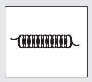

# Chương 10
## Sức Mạnh Của Tính Kỷ Luật

> *Tìm kiếm tự do – anh sẽ trở thành tù nhân của dục vọng. Tìm kiếm kỷ luật – anh sẽ trở nên tự do. *>
> – Frank Herbert

Julian tiếp tục dùng câu chuyện ngụ ngôn của Yogi Raman để đặt nền móng cho những tri thức mà anh đang chia sẻ với tôi. Tôi đã học về khu vườn trong tâm trí mình – một kho sức mạnh và tiềm năng. Thông qua biểu tượng ngọn hải đăng, tôi đã nhận ra tầm quan trọng tối cao của việc có mục đích rõ ràng trong cuộc sống và hiệu quả của việc thiết lập mục tiêu. Bằng hình ảnh võ sĩ sumo người Nhật cao 2,7 mét và nặng hơn 400 ký, tôi đã được chỉ dạy về khái niệm vượt thời gian kaizen và vô số lợi ích mà việc làm chủ bản thân mang lại. Lúc này, tôi chưa biết rằng những điều tốt đẹp nhất vẫn còn chờ đợi ở phía trước.

“Có lẽ anh vẫn còn nhớ anh bạn võ sĩ gần như khỏa thân trong câu chuyện phải không.”

“Chỉ trừ chiếc khố bằng dây cáp màu hồng che lấy vùng kín của anh ta”, tôi xen vào một cách ranh mãnh.

“Đúng vậy”, Julian tán thành. “Chiếc khố bằng dây cáp màu hồng sẽ nhắc nhở anh về sức mạnh của việc tự kiểm soát bản thân và tính kỷ luật trong việc xây dựng một cuộc sống ý nghĩa hơn, hạnh phúc hơn và an vui hơn. Các thầy của tôi ở Sivana chắc chắn là những người mạnh khỏe nhất, hạnh phúc nhất và thanh thản nhất mà tôi từng gặp. Họ cũng chính là những người kỷ luật nhất. Những nhà hiền triết này đã dạy tôi rằng đức tính tự kỷ luật giống như một sợi dây cáp. Anh đã bao giờ dành thời gian để nghiên cứu về dây cáp chưa, John?”

“Việc đó không nằm trong những ưu tiên hàng đầu của tôi”, tôi thú nhận.

“Lúc nào đó, anh hãy nhìn kỹ một sợi dây cáp. Anh sẽ nhận thấy bên trong nó gồm nhiều sợi dây cáp rất mảnh và nhỏ được đặt chồng lên nhau. Nếu tách ra, mỗi sợi sẽ rất mỏng manh và dễ đứt. Nhưng khi tập hợp lại với nhau, chúng trở nên cứng cáp hơn rất nhiều so với từng sợi nhỏ riêng lẻ, và sợi dây cáp ấy trở nên bền chắc hơn cả sắt thép. Sự tự kiểm soát bản thân và sức mạnh ý chí cũng giống như thế. Để có một ý chí sắt thép, chúng ta nhất thiết phải kết hợp nhiều hành động nhỏ lại với nhau để tạo nên đức tính kỷ luật cho bản thân. Khi được thực hiện đều đặn, những hành động nhỏ sẽ chồng chất lên nhau và dần tạo ra nguồn sức mạnh nội tại to lớn. Có lẽ điều này được diễn đạt hay nhất qua câu châm ngôn của người châu Phi, ‘Khi những chiếc mạng nhện kết lại với nhau, chúng có thể trói cả một con sư tử’. Khi sức mạnh ý chí được giải phóng, anh sẽ trở thành chủ nhân trong thế giới của mình. Khi anh tiếp tục thực hành nghệ thuật cổ xưa để tự quản lý bản thân, sẽ không có rào cản nào là quá cao đến mức anh không thể vượt qua, không có thách thức nào là quá khó đến mức không thể chinh phục, và không có khủng hoảng nào là quá rắc rối đến nỗi không thể giải quyết. Tính tự kỷ luật sẽ mang đến cho anh nguồn sức mạnh tinh thần cần thiết để bền chí trước những khúc quanh của cuộc đời.”

> “Tôi cũng phải cảnh báo anh về một sự thật rằng, thiếu sức mạnh ý chí là một căn bệnh tâm thần”, Julian nói một điều khiến tôi không khỏi ngạc nhiên. “Nếu anh mắc phải căn bệnh này, hãy ưu tiên chữa trị nó thật nhanh. Ý chí kiên cường và tính kỷ luật nghiêm khắc là những đặc điểm tính cách nổi bật của tất cả những ai có cá tính mạnh mẽ và cuộc sống tươi đẹp. Sức mạnh ý chí giúp anh thực hiện những điều anh đã nói vào thời điểm anh đã cam kết. Chính sức mạnh ý chí khiến anh thức dậy vào lúc năm giờ sáng để rèn luyện tinh thần thông qua việc suy ngẫm hoặc nuôi dưỡng tâm hồn bằng cách đi bộ trong rừng, dù chiếc giường ấm áp ra sức lôi kéo anh ngủ thêm trong một ngày mùa đông lạnh lẽo. Chính sức mạnh ý chí giúp anh giữ im lặng khi bị một kẻ hồ đồ xúc phạm hoặc khi họ làm một việc gì đấy mà anh không đồng tình. Chính sức mạnh ý chí thúc đẩy những ước mơ của anh tiến lên phía trước khi gặp phải những chướng ngại tưởng như không thể vượt qua được. Chính sức mạnh ý chí mang đến cho anh một nguồn sức mạnh từ bên trong để anh luôn giữ đúng những cam kết của mình với người khác và với chính bản thân anh
>
> – điều mà thậm chí còn quan trọng hơn.”

“Nó thật sự quan trọng đến thế sao?”

“Dĩ nhiên rồi, anh bạn. Nó là đức tính cơ bản nhất của bất kỳ ai đang có một cuộc sống đầy nhiệt huyết, triển vọng và bình yên.”

Rồi Julian cho tay vào áo choàng và lấy ra một chiếc mề đay bằng bạc sáng choang, món đồ mà bạn có thể nhìn thấy trong viện bảo tàng triển lãm các vật phẩm của Ai Cập cổ đại.

“Đừng nói vật này là của anh đấy nhé”, tôi đùa.

“Các nhà hiền triết Sivana đã tặng tôi món quà này vào đêm cuối cùng tôi ở với họ. Đó là một buổi liên hoan tràn ngập niềm vui và đầy yêu thương giữa các thành viên trong một gia đình có cuộc sống hết sức viên mãn. Đó là một trong những đêm tuyệt vời nhất nhưng cũng buồn nhất cuộc đời tôi. Tôi không muốn rời bỏ cõi Niết bàn Sivana. Đó chính là thánh địa của tôi – một vùng đất biệt lập nhưng chứa đựng tất cả những điều tốt đẹp trên thế giới này. Các nhà hiền triết đã trở thành những huynh đệ tinh thần của tôi. Tôi đã để lại một phần con người mình trên đỉnh Hy Mã Lạp Sơn vào đêm hôm ấy”, Julian nói với giọng xúc động.

“Chiếc mề đay khắc những gì vậy?”

“Đây, tôi sẽ đọc chúng cho anh nghe. Đừng bao giờ quên những lời này, John ạ. Chúng đã giúp tôi vượt qua những thời điểm khó khăn. Tôi mong sao chúng cũng sẽ giúp anh cảm thấy được an ủi trong những lúc tưởng chừng như bế tắc.* Thông qua kỷ luật thép, anh sẽ hun đúc một tính cách can đảm và điềm tĩnh. Thông qua sức mạnh ý chí, anh được định là sẽ vươn đến tầm cao lý tưởng nhất trong cuộc sống và có thể tận hưởng cảnh thiên đường đầy những điều tốt đẹp, vui vẻ và sinh động. Không có chúng, anh sẽ bị lạc như một thủy thủ không có la bàn và rồi cũng sẽ chìm theo con tàu của mình.” *“Tôi chưa bao giờ nghiêm túc suy nghĩ về tầm quan trọng của việc tự kiểm soát bản thân, mặc dù có nhiều lần tôi đã ước gì mình có tính kỷ luật hơn”, tôi thừa nhận. “Có phải ý anh muốn nói rằng tôi có thể xây dựng tính kỷ luật giống như cách cậu con trai tuổi teen của tôi tập cho lên cơ bắp ở phòng tập thể hình không?”

“Đó cũng là một cách ví von hay đấy. Anh rèn luyện ý chí của mình cũng giống như con trai anh rèn luyện cơ thể ở phòng tập thể hình vậy. Bất kỳ ai, dù yếu đuối hay lơ đễnh đến cỡ nào, cũng có thể trở nên kỷ luật trong một thời gian khá ngắn. Mahatma Gandhi là một tấm gương điển hình. Khi mọi người nghĩ đến vị thánh thời hiện đại này, họ nhớ đến một người có thể nhịn ăn nhiều tuần lễ để theo đuổi mục đích đời mình và chịu đựng đau đớn tột cùng để thể hiện đức tin mạnh mẽ. Nhưng khi nghiên cứu cuộc đời của Gandhi, anh sẽ thấy ông không phải lúc nào cũng là bậc thầy trong việc kiểm soát bản thân.”

“Anh không định nói với tôi Gandhi là một người nghiện sô-cô-la đấy chứ?”

“Không đâu, John. Khi còn là một luật sư trẻ ở Nam Phi, ông ấy rất hay có những cơn giận bộc phát, và những hình thức rèn luyện như nhịn ăn, thiền định đều rất xa lạ đối với ông. Ông cũng từng không quen với việc quấn chiếc khố trắng, tuy nhiên sau này chiếc khố đó lại trở thành một trong những đặc điểm nhận dạng của ông.”

“Có phải ý anh là nếu kết hợp sự rèn luyện và chuẩn bị một cách đúng đắn, ý chí của tôi có thể đạt đến mức độ giống như Mahatma Gandhi?”

“Mỗi người đều khác biệt. Một trong những nguyên tắc cơ bản mà Yogi Raman đã dạy tôi là những con người đã hoàn toàn được khai sáng sẽ không bao giờ cố gắng để giống người khác. Thay vào đó, họ nỗ lực để trở nên tốt hơn so với bản thân mình trước đây. Đừng chạy đua với người khác. Hãy chạy đua với chính mình”, Julian nói.

“Khi anh tự kiểm soát bản thân, anh sẽ có quyết tâm để làm những điều mà anh luôn muốn làm. Đối với anh, đó có thể là tập luyện để tham gia một cuộc thi ma-ra-tông, hoặc trở nên chuyên nghiệp trong môn chèo thuyền vượt thác, hay thậm chí là bỏ nghề luật sư để trở thành một họa sĩ. Bất luận anh đang mơ về điều gì, bất kể là vật chất hay tinh thần, tôi cũng không phán xét anh. Tôi chỉ đơn giản nói rằng tất cả những việc đó đều nằm trong tầm tay nếu anh chịu vun bồi cho nguồn sức mạnh ý chí dự trữ còn ngủ yên trong anh.”

Julian nói thêm, “Việc trau dồi khả năng tự kiểm soát bản thân và áp dụng tính kỷ luật vào trong cuộc sống của mình cũng sẽ mang đến cho anh một cảm giác tự do lạ thường. Chỉ riêng việc này thôi cũng sẽ thay đổi mọi thứ”.

“Ý anh là sao?”

“Hầu hết mọi người đều có tự do. Họ có thể đi đến nơi mình muốn và làm những việc mình thích. Nhưng quá nhiều người đã trở thành nô lệ cho sự thúc đẩy từ bên ngoài. Họ hành động để ứng phó chứ không phải chủ động giải quyết vấn đề, tức là họ giống như bọt biển ập vào bờ đá rồi rút đi về muôn ngả khác nhau tùy theo con nước. Nếu họ đang dành thời gian ở cùng gia đình và có ai đó ở chỗ làm gọi đến báo có việc gấp thì họ sẽ hớt hải chạy đi, không bao giờ chịu dừng lại để suy nghĩ xem hoạt động nào quan trọng hơn đối với sức khỏe và hạnh phúc lâu dài cũng như đối với mục đích của đời mình. Vì vậy, sau tất cả những gì tôi đã quan sát, cả ở phương Tây lẫn ở phương Đông, tôi có thể nói rằng những người như vậy có tự do nhưng vẫn bị trói buộc. Họ thiếu một thành phần quan trọng để có cuộc sống giàu ý nghĩa và được khai sáng: đó chính là sự tự do để nhìn thấy cả cánh rừng phía sau những hàng cây, sự tự do để lựa chọn điều đúng đắn thay vì những việc đang hối thúc.”

Tôi không thể không đồng tình với Julian. Dĩ nhiên, tôi không có gì nhiều để phàn nàn về cuộc sống. Tôi có một gia đình tuyệt vời, một ngôi nhà ấm cúng và một công việc luôn bận rộn. Nhưng tôi không thể thật sự nói rằng mình được tự do. Máy nhắn tin đã trở thành vật bất ly thân của tôi. Tôi luôn tất bật với công việc đến nỗi chẳng có thời gian để trò chuyện và chia sẻ với Jenny. Việc dành một khoảng thời gian yên tĩnh cho bản thân đối với tôi cũng khó như thắng giải ma-ra-tông của thành phố Boston vậy. Càng nghĩ kỹ, tôi càng nhận ra dường như mình chưa từng nếm qua hương vị ngọt ngào của sự tự do đích thực, kể cả trong những năm tháng của tuổi trẻ trước đây. Tôi đoán là tôi đã trở thành nô lệ của những tác động bên ngoài, bởi tôi vẫn luôn làm những việc mà mọi người xung quanh bảo tôi nên làm.

“Và việc rèn luyện sức mạnh ý chí sẽ mang đến cho tôi nhiều tự do hơn sao?”

“Tự do giống như một căn nhà. Anh xây dựng nó bằng từng viên gạch một. Viên gạch đầu tiên mà anh nên đặt vào chính là sức mạnh ý chí. Phẩm chất này sẽ truyền cảm hứng để anh luôn làm những việc đúng đắn vào bất cứ lúc nào. Nó tiếp cho anh nguồn năng lượng để hành động với lòng dũng cảm. Nó trao cho anh quyền kiểm soát để có thể tận hưởng một cuộc sống như mơ ước, thay vì phải chấp nhận cuộc sống đang có.”

Julian cũng nêu ra nhiều lợi ích mà việc xây dựng tính kỷ luật sẽ mang lại.

“Dù anh có tin hay không thì việc phát triển sức mạnh của ý chí có thể xóa đi thói quen lo lắng, giữ cho anh khỏe mạnh và mang đến nguồn năng lượng dồi dào mà anh chưa từng thấy. Anh thấy đó John, kiểm soát bản thân thật ra cũng chỉ là sự kiểm soát tâm trí. Ý chí chính là loại sức mạnh tinh thần quan trọng nhất. Khi làm chủ tâm trí thì anh cũng làm chủ cuộc đời mình. Việc làm chủ tâm trí bắt đầu từ việc có thể kiểm soát được mỗi ý nghĩ mà anh có. Khi anh phát triển được khả năng loại bỏ tất cả những ý nghĩ yếu kém và chỉ tập trung vào những ý nghĩ tích cực và tốt đẹp, thì những hành động tương ứng sẽ nối tiếp theo sau. Rồi anh sẽ sớm thu hút được tất cả những điều tích cực và tươi sáng đến với cuộc đời mình.

Đây là một ví dụ. Giả sử một trong những mục tiêu phát triển bản thân của anh là thức dậy vào lúc sáu giờ sáng và chạy bộ vòng quanh công viên phía sau nhà. Giả sử thời điểm này đang là giữa mùa đông và anh đang ngủ rất ngon thì bị tiếng chuông đồng hồ đánh thức. Phản ứng đầu tiên của anh là bấm nút tắt đồng hồ rồi ngủ tiếp. Có lẽ anh sẽ thực hiện quyết tâm tập thể dục vào ngày mai. Hành động này cứ thế tiếp tục trong vòng vài ngày cho đến khi anh tự nhủ rằng mình đã quá già nên không thể thay đổi thói quen sinh hoạt, và mục tiêu rèn luyện thể chất là quá thiếu thực tế.”

“Anh quá hiểu tôi rồi”, tôi thành thật nói.

“Giờ hãy xem xét một kịch bản thay thế. Vẫn là mùa đông khắc nghiệt đó. Chuông đồng hồ reo và anh bắt đầu nghĩ mình sẽ ngủ tiếp. Nhưng thay vì làm nô lệ cho thói quen, anh đã tự thử thách bản thân bằng những ý nghĩ mạnh mẽ hơn. Anh bắt đầu hình dung về việc mình sẽ trông thế nào, cảm thấy thế nào và hành động ra sao khi có được hình thể lý tưởng nhất. Anh tưởng tượng hình ảnh của mình săn chắc và gọn gàng, bước đi nhẹ nhàng đĩnh đạc trong công ty trước sự ngưỡng mộ và ngợi khen của các đồng nghiệp. Anh tập trung hoàn thành mọi việc với nguồn năng lượng vượt trội nhờ việc luyện tập thể dục thường xuyên mang lại. Không còn những đêm thức khuya xem tivi vì anh đã quá mệt mỏi sau cả ngày dài làm việc ở tòa án. Mỗi ngày của anh sẽ mang nhiều ý nghĩa, tràn đầy sức sống và niềm hăng say.”

“Nhưng giả sử tôi đã làm thế mà vẫn cảm thấy muốn ngủ nướng hơn là chạy bộ thì sao?”

“Trong vòng mấy ngày đầu, việc này sẽ hơi khó khăn và anh sẽ cảm thấy muốn quay lại thói quen cũ. Nhưng Yogi Raman hết sức tin tưởng vào nguyên tắc bất biến này: sự tích cực luôn chiến thắng sự tiêu cực. Vì vậy, nếu anh tiếp tục chiến đấu chống lại những ý nghĩ yếu kém đã lén lút đột nhập vào tòa lâu đài tâm trí của mình suốt nhiều năm qua, thì dần dần những ý nghĩ tiêu cực đó sẽ nhận ra chúng không được chào đón và lẳng lặng rời đi như những vị khách không mời.”

“Anh muốn nói là những ý nghĩ cũng giống như những thực thể vật chất ư?”

“Đúng vậy, và chúng hoàn toàn nằm trong tầm kiểm soát của anh. Việc có những ý nghĩ tích cực cũng dễ dàng như việc có những ý nghĩ tiêu cực thôi.”

“Thế thì tại sao trong thế giới chúng ta lại có quá nhiều người lo lắng và tập trung vào những thông tin tiêu cực như vậy?”

“Bởi vì họ chưa học cách tự kiểm soát bản thân và có tư duy kỷ luật. Hầu hết những người mà tôi từng bắt chuyện đều không biết họ có sức mạnh để kiểm soát mọi ý nghĩ của mình trong từng giây, từng phút, từng ngày. Họ tin các ý nghĩ tự xuất hiện và không nhận ra rằng nếu chúng ta không dành thời gian để bắt đầu kiểm soát suy nghĩ của mình thì chúng sẽ kiểm soát chúng ta. Khi anh dùng sức mạnh của ý chí kiên cường để tập trung vào những ý nghĩ tốt đẹp và từ chối suy nghĩ tiêu cực, tôi hứa với anh rằng chúng sẽ biến mất rất nhanh.”

“Vậy là, nếu tôi muốn có sức mạnh tinh thần để thức dậy sớm, đọc thêm nhiều sách, lo lắng ít lại, kiên nhẫn và yêu thương nhiều hơn, thì tất cả những gì tôi cần làm là sử dụng ý chí để thanh lọc các ý nghĩ hả?”

“Khi anh kiểm soát các ý nghĩ là anh kiểm soát tâm trí mình. Khi anh kiểm soát tâm trí là anh kiểm soát cuộc đời mình. Và một khi anh đã hoàn toàn kiểm soát được cuộc đời mình là anh đã làm chủ số phận của chính mình.”

Qua một đêm kỳ lạ nhưng tràn đầy cảm hứng như đêm nay, tôi đã thay đổi từ một luật sư đa nghi thành một tín đồ được khai sáng lần đầu tiên sau nhiều năm. Tôi ước gì Jenny có thể nghe được tất cả những điều này. Thật ra, tôi ước các con tôi cũng được nghe những tri thức này. Tôi biết nó sẽ tác động đến họ như đối với tôi. Tôi luôn lên kế hoạch để trở thành một người đàn ông tốt hơn của gia đình và sống trọn vẹn hơn, nhưng tôi lại tất bật lo giải quyết những việc cấp bách khác trong cuộc sống. Có lẽ đây chính là điểm yếu, một sự kém cỏi trong việc tự kiểm soát bản thân. Hay nói cách khác, tôi chỉ lo nhìn cây mà không thấy rừng. Cuộc sống trôi qua nhanh quá. Mới ngày nào tôi còn là một sinh viên luật trẻ tuổi giàu năng lượng và tràn đầy nhiệt huyết. Vào thời điểm đó, tôi đã ước mơ trở thành một nhà lãnh đạo chính trị, hoặc thậm chí là thẩm phán của tòa án tối cao. Nhưng khi thời gian trôi qua, tôi trở nên an phận với công việc thường nhật. Kể cả khi còn là một luật sư kiêu ngạo, Julian cũng từng nói với tôi “sự tự mãn sẽ giết chết chúng ta”. Càng nghĩ về việc đó, tôi càng nhận ra mình đã đánh mất nỗi khát khao trong đời. Không phải khát khao một căn nhà to hơn hay chiếc xe đắt tiền hơn. Nỗi khát khao của tôi sâu sắc hơn nhiều: tôi muốn được sống ý nghĩa hơn, vui vẻ hơn và mãn nguyện hơn.

Trong lúc Julian tiếp tục câu chuyện, tôi hình dung đến lúc tôi năm mươi, thậm chí sáu mươi tuổi. Liệu đến thời điểm đó tôi có còn bị mắc kẹt trong cùng một công việc, gặp gỡ những người đã quá quen mặt và đối diện với cùng một kiểu rắc rối hay không? Tôi sợ hãi khi nghĩ đến đây. Tôi đã luôn muốn cống hiến cho thế giới này bằng cách nào đó và tôi biết chắc rằng mình vẫn chưa thực hiện điều này. Tôi nghĩ, chính khoảnh khắc đó, khi cùng ngồi với Julian trong phòng khách vào cái đêm tháng Bảy oi bức ấy, tôi đã thay đổi. Người Nhật gọi đây là satori, nghĩa là sự giác ngộ tức thì, và đó chính xác là điều tôi đang trải qua. Tôi quyết tâm thực hiện những ước mơ của mình và làm cho cuộc sống trở nên ý nghĩa hơn bao giờ hết. Đó là cảm nhận đầu tiên của tôi về tự do đích thực – điều mà bạn sẽ có được khi quyết định chịu trách nhiệm cho tất cả mọi thứ trong cuộc sống của chính mình.

“Tôi sẽ chỉ cho anh một phương pháp để phát triển sức mạnh ý chí”, Julian nói, anh vẫn chưa biết gì về chuyển biến nội tâm mà tôi vừa trải qua. “Tri thức mà không có những công cụ thích hợp để ứng dụng thì không còn là tri thức nữa.”

Julian nói tiếp, “Mỗi ngày, khi anh đi bộ đến chỗ làm, tôi muốn anh lặp đi lặp lại vài từ đơn giản”.

“Đây có phải là một trong những câu thần chú mà anh đã nói với tôi không?”, tôi hỏi.

“Đúng vậy. Đây là một câu thần chú đã tồn tại trên năm ngàn năm, mặc dù chỉ có một cộng đồng nhỏ các tu sĩ ở Sivana biết đến nó. Yogi Raman đã nói với tôi là khi lặp đi lặp lại câu thần chú này, chỉ trong một thời gian ngắn tôi sẽ phát triển được khả năng tự kiểm soát bản thân và một ý chí bất khuất. Hãy nhớ, ngôn từ có sức ảnh hưởng rất to lớn. Ngôn từ là hiện thân bằng lời của sức mạnh. Khi đưa những từ ngữ mang màu sắc hy vọng vào tâm trí, anh sẽ trở nên lạc quan. Khi đưa những từ ngữ của sự tử tế vào tâm trí, anh sẽ trở nên ân cần và tốt bụng. Bằng cách đưa những ý nghĩ về sự can đảm vào tâm trí, anh sẽ trở nên dũng cảm. Ngôn từ thật sự có sức mạnh”, Julian phát biểu.

“Tôi đang chú ý lắng nghe đây.”

“Đây là câu thần chú mà tôi đề nghị anh nên lặp lại ít nhất ba mươi* lần mỗi ngày, ‘Tôi mạnh mẽ hơn vẻ bên ngoài, tất cả sức mạnh và quyền* lực của thế giới đều ở trong tôi’. Nó sẽ tạo nên những thay đổi hết sức rõ rệt trong cuộc sống của anh. Thậm chí, để nhanh thấy kết quả hơn, hãy kết hợp câu thần chú này với phương pháp tưởng tượng sáng tạo mà tôi đã đề cập đến lúc nãy. Ví dụ, hãy đến một nơi yên tĩnh, ngồi xuống và nhắm mắt lại. Đừng để tâm trí anh nghĩ vẩn vơ. Hãy ngồi yên lặng hoàn toàn, bởi biểu hiện rõ ràng nhất của một tinh thần yếu đuối là một cơ thể không thể ngồi yên. Giờ thì hãy niệm chú thành lời, lặp đi lặp lại nhiều lần. Trong khi làm vậy, hãy hình dung anh là một người mạnh mẽ, đầy kỷ luật, hoàn toàn kiểm soát được tâm trí, cơ thể và tinh thần của mình. Hãy tưởng tượng bản thân hành động như Gandhi hoặc Mẹ Teresa khi gặp khó khăn thử thách. Những kết quả đáng kinh ngạc chắc chắn sẽ đến với anh”, Julian khẳng định.

“Chỉ thế thôi sao?”, tôi bất ngờ trước sự đơn giản của phương pháp này. “Tôi có thể khai mở toàn bộ nguồn ý chí dự trữ của mình chỉ bằng bài tập đơn giản này ư?”

“Phương pháp này đã được các bậc thầy tâm linh ở phương Đông truyền dạy suốt nhiều thế kỷ qua. Nó vẫn tồn tại cho đến hôm nay bởi một lý do – nó hiệu quả. Hãy luôn đánh giá dựa trên kết quả. Nếu anh có hứng thú, vẫn còn hai bài tập khác mà tôi có thể chia sẻ để anh có thể giải phóng sức mạnh của ý chí và vun đắp tính kỷ luật. Nhưng tôi phải cảnh báo rằng thoạt đầu, chúng có thể khá lạ lùng với anh.”

“Này anh bạn, tôi hoàn toàn bị lôi cuốn bởi những điều mình được nghe. Anh đã đánh trúng tâm lý của tôi rồi, nên xin anh cứ tiếp tục.”

“Được thôi. Bài tập đầu tiên, hãy bắt đầu làm những việc mà anh không thích. Đối với anh, đó có thể đơn giản là sắp xếp lại giường ngủ vào buổi sáng hoặc đi bộ thay vì lái xe đến chỗ làm. Khi hình thành thói quen sử dụng ý chí, anh sẽ không còn là nô lệ của những tác động bên ngoài nữa.”

“Sử dụng nó hoặc sẽ đánh mất nó, đúng không?”

“Chính xác. Để có thể xây dựng ý chí và nội lực, trước tiên anh phải sử dụng chúng. Anh càng sử dụng và nuôi dưỡng hạt mầm của tính tự kỷ luật thì nó càng nhanh trưởng thành và mang đến những kết quả mà anh mong muốn. Bài tập thứ hai cũng là bài tập yêu thích của Yogi Raman. Ông ấy thường có những ngày không nói một lời nào, trừ khi phải trả lời cho câu hỏi trực tiếp nào đấy.”

“Kiểu như một lời thề giữ im lặng sao?”

“Chính xác là lời thề đó, John. Các tu sĩ Tây Tạng, những người đã truyền bá phương pháp tu hành này, tin rằng việc giữ im lặng trong một khoảng thời gian dài có hiệu quả nâng cao tính kỷ luật của một người.”

“Nhưng bằng cách nào?”

“Về cơ bản, khi anh giữ im lặng trong một ngày là anh đang buộc ý chí phải làm theo mệnh lệnh của mình. Mỗi lần cảm thấy muốn nói một điều gì đó, anh lại chủ động kìm nén sự thôi thúc ấy và tiếp tục giữ im lặng. Anh thấy đó, ý chí không có suy nghĩ của riêng nó. Nó chờ đợi anh đưa ra chỉ thị để thúc đẩy nó hành động. Anh càng kiểm soát được nó thì nó sẽ càng trở nên mạnh mẽ. Vấn đề nằm ở chỗ, hầu hết mọi người không dùng đến ý chí của mình.”

“Sao lại như thế?”, tôi hỏi.

“Có thể bởi vì phần lớn mọi người tin rằng họ không có sức mạnh ý chí. Họ đổ lỗi cho tất cả, trừ bản thân họ, vì điểm yếu rõ ràng này. Một người tính tình nóng nảy sẽ nói với anh rằng, ‘Tôi không thể cưỡng lại được, cha tôi cũng thế mà’. Những người lo lắng thái quá thì sẽ nói, ‘Không phải là lỗi của tôi, mà do công việc quá căng thẳng!’. Những người ngủ quá nhiều thì sẽ bảo, ‘Tôi có thể làm gì khác chứ? Cơ thể tôi cần được ngủ đủ mười tiếng mỗi đêm’. Những người như vậy thiếu trách nhiệm đối với bản thân. Họ không ý thức được tiềm năng phi thường nằm sâu trong mỗi người chúng ta, đang chờ đợi để được giải phóng. Khi nhận biết được những quy luật bất biến của tự nhiên, những quy luật chi phối sự vận hành của vũ trụ này và tất cả những gì sống trong đó, anh sẽ nhận ra mình có một quyền cơ bản là được trở thành tất cả những gì mình có thể trở thành. Anh có nguồn sức mạnh để vượt trội hơn môi trường xung quanh. Tương tự như vậy, anh có khả năng trở thành một người tốt hơn là một tù nhân của quá khứ. Để được như vậy, anh phải trở thành chủ nhân của ý chí.”

“Nghe khó hiểu quá.”

“Đây thật sự là một khái niệm rất thiết thực. Hãy tưởng tượng những việc anh có thể làm nếu anh tăng mức độ ý chí của mình lên gấp đôi hoặc gấp ba so với hiện tại. Anh có thể thực hiện chế độ tập luyện mà anh luôn ao ước sẽ có ngày bắt đầu; anh có thể sử dụng thời gian của mình hiệu quả hơn; anh có thể dứt khoát xóa bỏ thói quen lo lắng; hoặc anh có thể trở thành người chồng lý tưởng. Việc sử dụng ý chí cho phép anh tái tạo động lực và nguồn năng lượng trong cuộc sống mà anh cho rằng mình đã đánh mất. Đây là một lĩnh vực rất quan trọng mà chúng ta cần phải tập trung.”

“Vậy điều quan trọng nhất là tôi phải bắt đầu sử dụng sức mạnh ý chí của mình thường xuyên à?”

“Đúng vậy. Hãy quyết định làm những việc mà anh biết mình nên làm, thay vì chọn bước đi trên con đường ít chông gai nhất. Hãy bắt đầu chống lại lực hấp dẫn của các thói quen xấu và sự yếu đuối của bản thân, giống như một quả tên lửa vượt qua lực hút trái đất để bay vút lên các tầng mây. Hãy thúc đẩy bản thân và quan sát những gì sẽ xảy ra chỉ trong vòng vài tuần.”

“Và câu thần chú sẽ giúp ích cho tôi chứ?”

“Đương nhiên. Việc lặp đi lặp lại câu thần chú mà tôi đã chia sẻ cùng với việc luyện tập tưởng tượng về hình ảnh mơ ước của bản thân mỗi ngày sẽ mang đến cho anh sự hỗ trợ rất lớn trong quá trình tạo dựng một cuộc sống có kỷ luật, nguyên tắc và kết nối anh với những ước mơ. Anh không cần phải thay đổi thế giới của mình trong một ngày. Hãy bắt đầu từ những việc nhỏ thôi. Hành trình vạn dặm bắt đầu bằng việc đi bước đầu tiên. Rồi chúng ta sẽ dần dần tiến bộ. Chỉ riêng việc rèn luyện bản thân thức sớm hơn một giờ mỗi ngày và duy trì thói quen tốt đẹp đó cũng sẽ làm tăng sự tự tin của anh và tạo nguồn cảm hứng để anh vươn đến những mục tiêu cao hơn.”

“Tôi vẫn chưa nhìn ra được chúng có liên quan gì với nhau”, tôi thú nhận.

“Nhiều chiến thắng nhỏ tạo thành những thắng lợi lớn. Anh phải bắt đầu từ việc nhỏ để đạt tới thành tựu vĩ đại. Bằng cách thực hiện quyết tâm của mình, đơn giản như việc thức dậy sớm mỗi ngày, anh sẽ cảm nhận được niềm vui và sự thỏa mãn mà thành tựu mang đến. Anh đã thiết lập một mục tiêu và đã hoàn thành nó. Cảm giác này rất tuyệt vời. Bí quyết ở đây là đặt mục tiêu ngày càng cao hơn và không ngừng nâng tầm các tiêu chuẩn của mình. Việc này sẽ tạo đà để anh có động lực tiếp tục khám phá tiềm năng vô tận của mình. Anh có thích trượt tuyết không?”, Julian đột ngột hỏi.

“Rất thích. Lúc nào được là Jenny và tôi lại đưa bọn trẻ lên núi, nhưng những dịp như thế cũng khá hiếm hoi, và điều này đã khiến Jenny buồn lòng.”

“Được rồi. Anh chỉ cần nghĩ đến cảm giác khi trượt xuống từ trên ngọn đồi phủ đầy tuyết. Đầu tiên anh bắt đầu rất chậm. Nhưng chỉ trong vòng một phút, anh đã bay xuống đồi với tốc độ cực nhanh đúng không?”

“Anh có thể gọi tôi là Ninja trượt tuyết. Tôi rất mê tốc độ!”

“Điều gì khiến anh trượt nhanh đến vậy?”

“Chắc là do cơ thể thanh thoát của tôi?”, tôi hóm hỉnh đáp.

“Một nỗ lực không tồi, John”, Julian bật cười. “Động lực chính là câu trả lời tôi đang tìm kiếm. Động lực là một yếu tố bí mật để xây dựng tính tự kỷ luật. Như tôi đã nói, anh bắt đầu từ những việc nhỏ, dù đó là thức dậy dớm hơn một chút, đi bộ vòng quanh dãy nhà của mình mỗi tối, hoặc thậm chí chỉ đơn giản là tắt tivi khi biết mình đã xem đủ rồi. Những chiến thắng nho nhỏ này sẽ tạo động lực khiến anh hăng hái bước dài hơn trên con đường tiến tới bản thể cao nhất của mình. Anh sẽ nhanh chóng làm những việc mà anh thậm chí còn không biết là mình có khả năng, với sức mạnh và nguồn năng lượng mà anh không bao giờ nghĩ là mình có. Đó là một quá trình rất thú vị, John ạ, thật đấy! Sợi dây cáp màu hồng trong câu chuyện ngụ ngôn của Yogi Raman sẽ luôn nhắc nhở anh về sức mạnh của ý chí.”

Ngay khi Julian chia sẻ xong những suy nghĩ của anh về tính tự kỷ luật, tôi nhận thấy những tia nắng đầu tiên của ngày mới bắt đầu rọi vào phòng khiến cho màn đêm tan dần. “Hôm nay sẽ là một ngày tuyệt vời”, tôi nghĩ. “Ngày đầu tiên cuộc đời tôi bước sang trang mới.”

---

### TÓM TẮT CHƯƠNG 10

**Biểu tượng: Nguyên tắc: **Sống có kỷ luật** Bài học: **- Kỷ luật được xây dựng bằng việc kiên trì thực hiện những hành động dũng cảm nho nhỏ.

- Càng nuôi dưỡng hạt mầm của tính tự kỷ luật thì nó sẽ càng trưởng thành hơn.

- Sức mạnh ý chí là một yếu tố cơ bản để có cuộc sống viên mãn.** Phương pháp:**

- Các câu nói truyền động lực / Tưởng tượng sáng tạo

- Lời thề im lặng

> *Hãy chiến đấu chống lại những ý nghĩ yếu kém đã lén lút đột nhập vào tòa lâu đài tâm trí của bạn suốt nhiều năm qua. Những ý nghĩ tiêu cực đó sẽ nhận ra chúng không được chào đón và lẳng lặng rời đi như những vị khách không mời.*
