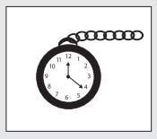

# Chương 11
## Tài Sản Quý Giá Nhất

> *Sự sắp xếp thời gian hợp lý là biểu hiện rõ ràng nhất của một cái đầu có tổ chức. *>
> – Isaac Pitman

“Anh có biết điều buồn cười của cuộc sống này là gì không?”, Julian hỏi tôi.

“Anh nói tôi biết đi.”

“Đến lúc mà đa số mọi người tìm ra điều họ thật sự muốn có và cách để đạt được nó thì thường đã quá muộn rồi. Câu nói ‘Giá như tuổi trẻ có thể biết, giá như tuổi già có thể làm’ quả rất đúng.”

“Có phải đó là ý nghĩa của chiếc đồng hồ bấm giờ trong câu chuyện ngụ ngôn của Yogi Raman không?”

“Đúng vậy. Võ sĩ sumo cao 2,7 mét và nặng hơn 400 ký, với sợi dây cáp màu hồng che lấy vùng kín cơ thể, đeo vội cái đồng hồ bấm giờ bằng vàng sáng loáng mà ai đó đã bỏ lại trong khu vườn xinh đẹp”, Julian nhắc lại nội dung câu chuyện.

“Làm sao tôi có thể quên được kia chứ”, tôi cười đáp lời.

Giờ thì tôi đã nhận ra câu chuyện ngụ ngôn huyền bí của Yogi Raman chính là một chuỗi những hình tượng dễ nhớ được tạo ra nhằm truyền đạt cho Julian về các yếu tố trong triết lý cổ xưa để có một cuộc sống được khai sáng. Tôi nói cho Julian nghe về phát hiện của mình.

“Anh nói gần đúng đấy. Phương pháp giảng dạy từ vị thầy thông thái của tôi thoạt đầu nghe có vẻ lạ lùng, và tôi đã phải nỗ lực để hiểu được tầm quan trọng của câu chuyện ấy hệt như anh đã tự hỏi tôi đang nói gì khi lần đầu tôi chia sẻ nó với anh. Nhưng tôi phải nói với anh điều này John à, tất cả bảy yếu tố trong câu chuyện, từ khu vườn, võ sĩ sumo gần như khỏa thân, những bông hoa hồng vàng, cho đến con đường trải kim cương – biểu tượng mà tôi sẽ nói đến ngay thôi – đều là những lời nhắc nhở quan trọng về những tri thức mà tôi đã học ở Sivana. Khu vườn giúp tôi tập trung vào những ý nghĩ khơi nguồn cảm hứng, ngọn hải đăng nhắc tôi rằng mục đích của cuộc sống là sống có mục đích, anh chàng võ sĩ sumo giúp tôi tập trung vào việc không ngừng khám phá bản thân, còn sợi dây cáp màu hồng nhắc tôi về những điều tuyệt vời của sức mạnh ý chí. Ngày nào tôi cũng suy nghĩ về câu chuyện ngụ ngôn này và ngẫm nghĩ những nguyên tắc mà Yogi Raman đã truyền dạy.”

“Vậy chính xác thì chiếc đồng hồ bấm giờ bằng vàng sáng loáng ấy đại diện cho điều gì?”

“Nó tượng trưng cho tài sản quan trọng nhất của chúng ta – thời gian.”

“Thế còn suy nghĩ tích cực, việc thiết lập mục tiêu và làm chủ bản thân thì sao?”

“Tất cả những điều đó đều vô nghĩa nếu không có thời gian. Khoảng sáu tháng sau khi tĩnh tâm trong khu rừng ở Sivana – ngôi nhà tạm trú của tôi – một trong những nhà hiền triết đã đến thăm căn lều hoa hồng trong lúc tôi đang học. Tên cô ấy là Divea. Cô là một phụ nữ xinh đẹp tuyệt trần với mái tóc đen nhánh dài tới thắt lưng. Bằng giọng nói dịu dàng và ngọt ngào, cô chia sẻ với tôi rằng cô là người trẻ tuổi nhất trong tất cả các nhà hiền triết sinh sống ở vùng núi hẻo lánh này. Cô đến gặp tôi theo sự chỉ đạo của Yogi Raman, người đã nói với cô rằng tôi là vị đệ tử giỏi nhất mà ông từng có.

Diave nói, ‘Có thể chính những nỗi đau mà anh phải chịu đựng trong cuộc sống trước đây đã giúp anh trân trọng những tri thức của chúng tôi với một trái tim rộng mở. Là người trẻ tuổi nhất trong cộng đồng này, tôi đã được yêu cầu mang đến cho anh một món quà. Món quà này đến từ tất cả các nhà hiền triết ở đây, và chúng tôi tặng nó như một biểu tượng của sự tôn trọng dành cho anh, người đã đi một chặng đường rất xa để đến học hỏi triết lý sống của chúng tôi. Anh không hề phán xét hay cười nhạo truyền thống của chúng tôi. Vì vậy, mặc dù anh đã quyết định sẽ rời đi trong vài tuần nữa, chúng tôi vẫn xem anh như một thành viên trong đại gia đình này. Chưa có người ngoài nào được nhận món quà mà tôi sắp trao cho anh’.”

“Món quà ấy là gì vậy?”, tôi nôn nóng hỏi.

“Divea lấy ra một vật từ trong chiếc túi bằng vải thô của cô và đưa nó cho tôi. Món quà được gói trong một loại giấy thơm mà tôi không bao giờ nghĩ mình có thể thấy ở nơi xa xôi hẻo lánh ấy. Đó là một chiếc đồng hồ cát cỡ nhỏ được làm từ thủy tinh và một mảnh gỗ đàn hương. Divea còn nói rằng mỗi nhà hiền triết đều từng được nhận dụng cụ này khi còn nhỏ. ‘Mặc dù chúng tôi chẳng có tài sản gì và sống hết sức giản dị, thuần khiết, chúng tôi vẫn rất trân trọng thời gian và ý thức rằng nó đang trôi qua. Những chiếc đồng hồ cát bé nhỏ này là lời nhắc nhở về sự chết, cũng như tầm quan trọng của việc sống những ngày trọn vẹn và hiệu quả trên con đường tiến đến mục đích đời mình’.”

“Hóa ra những tu sĩ trên đỉnh Hy Mã Lạp Sơn vẫn quan tâm đến thời gian kia à?”

“Tất cả họ đều hiểu tầm quan trọng của thời gian. Mỗi người trong số họ đã phát triển được thứ mà tôi gọi là ‘ý thức về thời gian’. Anh thấy đó, tôi đã học được rằng thời gian trôi qua kẽ tay chúng ta như những hạt cát, không bao giờ quay trở lại. Những ai sử dụng thời gian một cách khôn ngoan ngay từ khi còn trẻ sẽ được hưởng cuộc sống giàu có, phong phú và mãn nguyện. Những người chưa biết về nguyên tắc ‘làm chủ thời gian là làm chủ được cuộc đời’ sẽ không bao giờ nhận ra tiềm năng to lớn trong con người họ. Thời gian chính là vị thần công lý vĩ đại. Bất luận chúng ta thuộc tầng lớp nào trong xã hội, dù sống ở Texas hay Tokyo, chúng ta cũng đều có hai mươi bốn giờ trong một ngày như nhau. Điều tạo nên sự khác biệt giữa những người có cuộc sống phi thường và những người có cuộc sống bình thường chính là cách họ sử dụng khoảng thời gian ấy.”

“Tôi từng nghe cha tôi nói rằng chính những người bận rộn nhất mới có dư thời gian. Anh hiểu câu đó như thế nào?”

“Tôi đồng ý. Những người bận rộn và có hiệu suất làm việc cao thường sử dụng thời gian của mình rất hiệu quả – họ buộc phải như vậy để có thể sống sót. Là một người quản lý thời gian giỏi không có nghĩa là anh phải trở thành một người tham công tiếc việc. Mà ngược lại, việc làm chủ thời gian cho phép anh có nhiều thời gian hơn để làm những điều mình thích, những việc thật sự có ý nghĩa với anh. Việc làm chủ thời gian sẽ dẫn đến làm chủ cuộc đời. Hãy canh giữ thời gian của mình cẩn thận. Hãy nhớ, nó là một nguồn tài nguyên không thể phục hồi.

Để tôi cho anh một ví dụ. Giả sử vào một buổi sáng thứ Hai, lịch làm việc của anh đầy những cuộc hẹn, họp hành và những buổi ra tòa. Thay vì dậy vào lúc sáu giờ ba mươi như bình thường, uống vội tách cà phê và hối hả đi làm, rồi trải qua cả một ngày căng thẳng để bắt kịp lịch trình, thì tối hôm trước anh nên dành ra khoảng mười lăm phút để lên kế hoạch cho ngày làm việc của mình. Hoặc để hiệu quả hơn nữa, anh có thể dành khoảng một tiếng đồng hồ vào buổi sáng Chủ nhật yên tĩnh để sắp xếp thời gian cho cả tuần làm việc của mình. Trong bản kế hoạch hàng ngày của mình, anh nên viết xuống khi nào anh sẽ gặp gỡ các thân chủ, khi nào anh sẽ nghiên cứu thêm luật và khi nào anh trả lời các cuộc điện thoại. Quan trọng nhất là các mục tiêu phát triển cá nhân, phát triển quan hệ xã hội và phát triển tinh thần của anh cũng phải được đưa vào lịch trình đó. Việc làm đơn giản này chính là bí quyết để có một cuộc sống cân bằng. Bằng cách đưa tất cả những khía cạnh quan trọng trong cuộc sống vào lịch sinh hoạt hằng ngày, anh có thể đảm bảo một tuần sắp tới cũng như cuộc sống của anh sẽ có ý nghĩa và duy trì được sự yên bình.”

“Chắc là anh không định nói tôi nên nghỉ giải lao vào giữa ngày làm việc bận rộn để di dạo trong công viên hay ngồi suy ngẫm đấy chứ?”

“Sao lại không? Sao anh quá cứng nhắc bó buộc mình trong các quy tắc thế? Tại sao anh lại cảm thấy mình cần phải làm mọi việc giống như những người khác? Hãy chạy cuộc đua của riêng anh. Sao không bắt đầu làm việc sớm hơn một giờ để anh có thể nghỉ giải lao vào giữa buổi sáng và đi dạo trong công viên xinh đẹp ở đối diện văn phòng? Hoặc anh cũng có thể làm việc thêm vài giờ vào đầu tuần để đến ngày thứ Sáu anh có thể nghỉ sớm và dẫn bọn trẻ đi chơi. Ngoài ra, anh cũng có thể thử làm việc ở nhà hai ngày mỗi tuần để có thể gặp gỡ gia đình mình nhiều hơn. Tất cả những gì tôi đang nói là hãy lên kế hoạch cho một tuần của anh và quản lý thời gian một cách hiệu quả và sáng tạo. Hãy tự kỷ luật với bản thân để tập trung thời gian vào những ưu tiên của anh. Anh không nên đánh đổi những điều ý nghĩa nhất trong cuộc đời vì những chuyện vô nghĩa. Hãy nhớ, thất bại trong việc lên kế hoạch nghĩa là lên kế hoạch để thất bại. Bằng cách viết ra tất cả những cuộc hẹn với người khác và với bản thân mình – để đọc sách, thư giãn, hoặc viết một lá thư tình gửi cho vợ chẳng hạn – anh sẽ sử dụng thời gian hiệu quả hơn rất nhiều. Đừng bao giờ quên, dành thời gian ngoài giờ làm việc cho những hoạt động ý nghĩa thì không bao giờ là lãng phí. Nó giúp anh trở nên cực kỳ hiệu quả khi trở lại với công việc. Đừng sống một cuộc đời rời rạc và hãy hiểu rằng mọi điều anh làm sẽ tạo nên một thể thống nhất không thể tách rời. Cách anh hành xử ở nhà sẽ ảnh hưởng đến cách anh hành xử ở văn phòng. Cách anh đối xử với mọi người ở văn phòng sẽ ảnh hưởng đến cách anh đối xử với gia đình và bạn bè.”

“Hoàn toàn đồng ý với anh, nhưng tôi thật sự không có thời gian để nghỉ giải lao vào giữa ngày làm việc. Thông thường thì tôi làm việc vào hầu hết các buổi tối. Lịch làm việc của tôi gần đây thật sự dày đặc”, khi nói ra điều này, tôi cảm thấy lo lắng, bồn chồn vì nghĩ đến cả núi công việc đang chờ mình xử lý.

“Sự bận rộn không phải là cái cớ. Câu hỏi cần đặt ra là anh đang quá bận rộn với việc gì. Một trong những quy luật tuyệt vời mà tôi đã học từ vị thầy thông thái của mình là 80% những thành quả anh nhận được trong cuộc sống chỉ đến từ 20% các hoạt động chiếm mất thời gian của anh. Yogi Raman gọi đó là ‘Quy luật 20 cổ xưa’.”

“Tôi không chắc là tôi hiểu ý này của anh.”

“Được rồi. Hãy trở lại với ngày thứ Hai bận rộn của anh. Từ sáng đến tối, anh dành thời gian để làm đủ mọi việc, từ nói chuyện điện thoại với các thân chủ, soạn thảo nội dung bào chữa, đến việc đọc truyện để ru đứa con nhỏ nhất ngủ, hoặc đánh cờ với vợ. Đồng ý chứ?”

“Đồng ý.”

“Nhưng trong số hàng trăm hoạt động mà anh dành thời gian để thực hiện, chỉ có 20% sẽ tạo ra những kết quả có giá trị lâu bền. Chỉ 20% những việc anh làm có ảnh hưởng đến chất lượng cuộc sống. Đó là những hoạt động có ‘tác động mạnh’. Ví dụ, anh có thật sự nghĩ rằng trong mười năm tiếp theo, tất cả những khoảng thời gian anh đã dùng để nói chuyện phiếm ở bàn trà nước, hoặc ngồi trong một phòng ăn trưa ngập khói thuốc lá, hoặc xem tivi sẽ có ý nghĩa với bất kỳ việc gì không?”

“Không.”

“Đúng thế. Nên tôi tin anh cũng sẽ đồng ý rằng có một số hoạt động lại có giá trị ở mọi khía cạnh.”

“Ý anh muốn nói đến khoảng thời gian dành để trau dồi kiến thức, hay củng cố các mối quan hệ khách hàng và đầu tư cho việc trở thành một luật sư làm việc hiệu quả hơn hả?”

“Đúng thế, cả thời gian dành để vun đắp mối quan hệ với Jenny và bọn trẻ nữa. Anh cũng cần có thời gian để kết nối với thiên nhiên và thể hiện lòng biết ơn đối với tất cả những gì mình may mắn có được. Rồi còn thời gian để làm mới tâm trí, cơ thể và tinh thần anh nữa. Đây chỉ là vài hoạt động có tác động mạnh, cho phép anh tạo ra cuộc sống mà mình xứng đáng có được. Hãy dành tất cả thời gian của mình cho những hoạt* động thật sự ý nghĩa. Những người được khai sáng luôn làm việc theo* thứ tự ưu tiên. Đây chính là bí quyết để làm chủ thời gian.”

“Yogi Raman dạy anh tất cả những điều này sao?”

“Tôi đã trở thành học trò của cuộc sống này, John ạ. Yogi Raman chắc chắn là một vị thầy tuyệt vời mang đến nhiều cảm hứng và tôi sẽ không bao giờ quên ông vì điều đó. Nhưng tất cả những bài học mà tôi rút ra từ các trải nghiệm phong phú của mình giờ đây đã gắn kết lại với nhau như những mảnh ghép của một trò ghép hình khổng lồ, để cho tôi thấy con đường dẫn đến một cuộc sống tốt đẹp hơn.”

Julian nói thêm, “Tôi hy vọng anh sẽ học được từ những sai lầm trước đây của tôi. Một số người học từ sai lầm của người khác. Họ chính là những người khôn ngoan. Nhưng cũng có những người cảm thấy rằng học hỏi thật sự chỉ đến từ trải nghiệm cá nhân mà thôi. Những người như thế phải trải qua những nỗi đau và gian khổ không cần thiết trong suốt cuộc đời mình”.

Là một luật sư, tôi đã từng tham dự rất nhiều hội thảo về chủ đề quản lý thời gian. Thế nhưng tôi chưa bao giờ nghe nói đến triết lý làm chủ thời gian mà Julian đang chia sẻ với tôi. Quản lý thời gian không chỉ là việc mà chúng ta tập trung thực hiện khi ở văn phòng và dẹp sang bên khi hết giờ làm việc. Nó là một hệ thống có tính bao quát có thể giúp tất cả các khía cạnh trong cuộc sống của tôi trở nên cân bằng hơn và được thỏa mãn hơn, nếu tôi biết áp dụng một cách đúng đắn. Tôi đã học được rằng bằng cách lên kế hoạch cụ thể cho mỗi ngày và đảm bảo mình sử dụng thời gian một cách cân bằng, tôi sẽ không chỉ có hiệu suất làm việc cao hơn, mà còn hạnh phúc hơn rất nhiều.

“Vậy là cuộc sống giống như một miếng thịt xông khói ngon lành”, tôi phụ họa. “Chúng ta phải tách rời phần thịt ra khỏi phần mỡ để làm chủ được thời gian của mình.”

“Rất tốt. Anh đã nắm được vấn đề rồi đấy, John. Mặc dù là người ăn chay và muốn diễn đạt bằng cách khác, nhưng tôi phải thừa nhận mình rất thích cách ví von của anh, vì nó lột tả đúng bản chất vấn đề. Khi anh dành thời gian và năng lượng tinh thần quý giá của mình vào phần thịt, anh sẽ không lãng phí thời gian với phần mỡ. Đây là điểm mấu chốt để cuộc sống của anh chuyển từ bình thường sang phi thường. Đây chính là lúc anh bắt đầu khiến mọi việc diễn ra và những cánh cửa dẫn đến ngôi đền của sự khai sáng sẽ bất ngờ bật mở”, Julian nhận định.

“Điều này lại làm tôi nhớ đến một vấn đề nữa, đó là đừng để người khác đánh cắp thời gian của anh. Hãy cảnh giác với những kẻ trộm thời gian. Đó là những người thường gọi điện ngay khi anh vừa mới cho bọn trẻ đi ngủ và chuẩn bị ngả lưng vào chiếc ghế yêu thích để đọc quyển tiểu thuyết cực kỳ hấp dẫn mà anh đã nghe nói đến từ lâu. Đó cũng là những người hay ghé ngang qua văn phòng ngay khi anh vừa mới tìm được vài phút giải lao sau một ngày làm việc tất bật để hít thở và bình tâm lại. Anh có thấy những điều này quen thuộc không?”

“Anh luôn đúng, Julian ạ. Tôi đoán là tôi đã quá lịch sự nên đã không yêu cầu họ đi chỗ khác hoặc đóng cửa phòng lại”, tôi giãi bày.

“Anh hẳn là rất tàn nhẫn với thời gian của mình. Hãy học cách nói không. Việc có can đảm để nói ‘không’ với những chuyện nhỏ nhặt trong cuộc sống sẽ mang đến cho anh nguồn sức mạnh để nói ‘vâng’ với những vấn đề lớn. Hãy đóng cửa văn phòng khi anh cần vài giờ yên tĩnh để tập trung giải quyết một vụ án quan trọng. Hãy nhớ những gì tôi đã nói với anh. Đừng bắt điện thoại lên ngay mỗi khi nó reo. Chiếc điện thoại nằm ở đó để mang đến sự tiện lợi cho anh, chứ không phải cho người khác. Trớ trêu là người ta sẽ tôn trọng anh hơn khi nhận thấy anh là người biết trân trọng thời gian của mình. Họ sẽ nhận ra rằng thời gian của anh rất quý giá và họ cũng sẽ trân trọng nó.”

“Còn chuyện trì hoãn thì sao? Tôi rất hay trì hoãn những việc không thích làm, rồi nhận ra mình đang dùng thời gian để xem thư rác hoặc đọc lướt qua mấy quyển tạp chí luật. Có lẽ tôi đang giết thời gian?”

“Giết thời gian là phép ẩn dụ rất thích hợp trong trường hợp này. Đúng thế đấy, bản chất con người luôn muốn làm việc mình thích và tránh né những việc mình không thích. Nhưng như tôi đã nói, những người có hiệu suất làm việc cao nhất trên thế giới này đã tạo được thói quen làm những việc mà người có hiệu suất kém hơn không thích làm, mặc dù có thể bản thân họ cũng không thích làm mấy việc ấy.”

Tôi ngừng lại và suy nghĩ thật kỹ về nguyên tắc mà mình vừa nghe. Có lẽ sự trì hoãn không phải là vấn đề mà chỉ vì cuộc sống của tôi đã trở nên quá phức tạp. Julian nhận ra tôi đang băn khoăn.

“Yogi Raman đã nói rằng những người làm chủ thời gian sống rất đơn giản. Nhịp sống hối hả, quay cuồng không phải là điều tự nhiên. Dù ông vững tin rằng hạnh phúc dài lâu chỉ có thể đạt được bởi những người làm việc hiệu quả với các mục tiêu cá nhân rõ ràng, nhưng sống một cuộc đời đầy thành tựu và cống hiến như thế không có nghĩa là phải hy sinh sự bình an nội tại. Đây là điểm hết sức lôi cuốn trong vốn tri thức mà tôi được nghe. Nó giúp tôi làm việc với hiệu suất cao mà vẫn thỏa mãn những khao khát về mặt tinh thần của mình.”

“Anh đã luôn chân thành và thẳng thắn đối với tôi, nên tôi cũng sẽ như vậy với anh. Tôi không muốn từ bỏ công việc, nhà cửa và xe cộ để được hạnh phúc và thỏa mãn hơn. Tôi thích những món đồ chơi và mọi của cải vật chất mà mình đã làm ra. Chúng là phần thưởng cho tất cả những giờ làm việc vất vả của tôi trong ngần ấy năm, kể từ khi chúng ta gặp nhau lần đầu tiên. Nhưng tôi cảm thấy trống rỗng, thật sự là vậy. Tôi đã kể với anh về những ước mơ của mình khi còn ở trường luật. Còn có rất nhiều việc tôi có thể làm trong cuộc đời này. Anh biết đấy, tôi đã gần bốn mươi tuổi rồi mà vẫn chưa từng đặt chân đến Hẻm núi lớn(5) hay Tháp Eiffel. Tôi chưa từng đi bộ trên sa mạc hoặc lái ca-nô trên hồ nước yên ả vào một ngày mùa hè đẹp trời. Tôi chưa một lần cởi vớ và giày ra để đi chân trần qua công viên, lắng nghe tiếng bọn trẻ cười đùa và tiếng những chú chó sủa vang. Tôi thậm chí không thể nhớ nổi lần cuối cùng tôi đi dạo một mình thật lâu trên con đường yên tĩnh sau một trận tuyết rơi chỉ để nghe những âm thanh của tự nhiên và tận hưởng những xúc cảm tuyệt diệu là khi nào.”

---

(5) The Grand Canyon hay Hẻm núi lớn là một khe núi dốc được tạo ra từ con sông Colorado ở tiểu bang Arizona, Hoa Kỳ. Grand Canyon gần như nằm trọn trong Vườn Quốc gia Grand Canyon – một trong những vườn quốc gia đầu tiên được thành lập tại Hoa Kỳ. Độ dài của hẻm Grand Canyon là 446 km, rộng từ 0,4 đến 24 km tùy từng đoạn và có độ sâu tới 1.600 mét.

“Thế thì hãy đơn giản hóa cuộc sống của mình đi”, Julian đề nghị với giọng đầy cảm thông. “Hãy áp dụng Thói quen Sống đơn giản vào mọi khía cạnh trong cuộc đời anh. Bằng cách đó, chắc chắn anh sẽ có thêm thời gian để tận hưởng những kỳ quan rực rỡ ấy. Một trong những bi kịch lớn nhất mà bất kỳ ai cũng có thể gây ra cho chính mình đó là sống trì hoãn. Quá nhiều người thích mơ mộng về một vườn hồng kỳ diệu nào đó ở tận cuối chân trời, thay vì tận hưởng những bông hoa xinh đẹp trong khu vườn ở sân sau nhà mình. Quả là một bi kịch.”

“Anh có đề xuất gì không?”

“Việc đó còn tùy vào trí tưởng tượng của anh. Tôi đã chia sẻ với anh tất cả những chiến lược mà tôi học được từ các nhà hiền triết. Nếu anh có can đảm áp dụng, chúng sẽ tạo nên nhiều điều kỳ diệu. À, điều này làm tôi nhớ đến một việc khác mà tôi luôn thực hiện để giữ cho cuộc sống bình yên và đơn giản.”

“Việc gì?”

“Tôi thích có một giấc ngủ trưa ngắn. Tôi phát hiện ra nó giúp tôi có nhiều năng lượng, tươi tỉnh và trẻ trung hơn. Anh có thể xem như tôi cần có một giấc ngủ để giữ gìn nhan sắc”, Julian cười lớn.

“Sắc đẹp chưa bao giờ là một trong những thế mạnh của anh.”

“Còn hài hước thì luôn là một điểm mạnh của anh, tôi phải khen anh về điểm này. Hãy luôn ghi nhớ sức mạnh của nụ cười nhé. Giống như âm nhạc, nụ cười chính là liều thuốc bổ tuyệt vời để chữa lành những căng thẳng và mệt mỏi trong cuộc sống. Tôi nghĩ Yogi Raman đã diễn đạt điều này rất hay khi ông nói, ‘Tiếng cười mở rộng trái tim và xoa dịu tâm hồn. Không nên quá nghiêm trọng hóa cuộc sống này đến nỗi quên cười chính mình’.”

Julian muốn chia sẻ thêm một suy nghĩ khác của anh về chủ đề thời gian. “Có lẽ điều quan trọng nhất ở đây là hãy thôi hành động như thể anh có thể sống đến 500 năm, John ạ. Khi Divea mang chiếc đồng hồ cát bé nhỏ ấy đến tặng tôi, cô ấy đã đưa ra những lời khuyên mà tôi sẽ không bao giờ quên.”

“Cô ấy nói gì?”

“Cô ấy nói với tôi rằng thời điểm tốt nhất để trồng một cái cây là cách đây bốn mươi năm. Thời điểm tốt thứ hai là ngay hôm nay. Đừng lãng phí, dù chỉ một phút của cuộc đời này. Hãy luôn trong tâm thế của một người sắp chết.”

“Anh nói rõ lại được không?”, tôi choáng váng khi nghe một loạt từ ngữ đầy tính biểu tượng mà Julian vừa nhắc đến. “Tâm thế của người sắp chết là gì vậy?”

“Đó là một cách nhìn mới mẻ về cuộc sống, một mô hình giúp tăng cường sức mạnh. Nó nhắc anh rằng hôm nay có thể là ngày cuối cùng của anh, vì vậy hãy tận hưởng mọi thứ trọn vẹn nhất có thể.”

“Nghe có vẻ u ám quá. Nếu anh muốn tôi nói thật lòng, thì điều này khiến tôi nghĩ đến cái chết.”

“Thật ra thì đó là một triết lý về cuộc sống này. Khi anh sống trong tâm thế của người sắp chết, anh sẽ sống mỗi ngày như thể đó là ngày cuối cùng của mình. Hãy tưởng tượng việc thức dậy mỗi sáng và tự hỏi một câu đơn giản: ‘Tôi sẽ làm gì nếu hôm nay là ngày cuối cùng của tôi?’. Rồi sau đó, hãy nghĩ về cách anh sẽ đối xử với gia đình, đồng nghiệp và thậm chí với cả những người anh không quen biết. Hãy nghĩ xem anh sẽ hào hứng thế nào và trở nên hiệu quả ra sao khi được sống trọn vẹn trong từng khoảnh khắc. Chỉ riêng câu hỏi nhắc về cái chết rất đơn giản ấy cũng có sức mạnh thay đổi cuộc đời anh. Nó sẽ khiến cho cuộc sống của anh tràn trề năng lượng và mang đến tinh thần phấn chấn, hào hứng trong tất cả những việc anh làm. Anh sẽ bắt đầu tập trung vào những việc ý nghĩa mà anh đã trì hoãn bấy lâu nay. Anh sẽ thôi lãng phí thời gian vào những chuyện vặt vãnh đã kéo anh xuống vũng lầy của sự khủng hoảng và hỗn độn.”

Julian nói tiếp, “Hãy thúc đẩy bản thân làm nhiều việc hơn và trải nghiệm nhiều hơn. Hãy khai thác nguồn năng lượng của mình để bắt đầu mở rộng những ước mơ. Đúng vậy, hãy mở rộng những ước mơ của anh. Đừng chấp nhận một cuộc sống tầm thường khi anh đang nắm giữ tiềm năng vô hạn bên trong pháo đài tâm trí của mình. Hãy can đảm khai mở sự vĩ đại trong anh. Đây là quyền lợi cơ bản của anh!”.

“Thật là những điều có sức tác động mạnh mẽ.”

“Vẫn còn nhiều nữa. Có một cách đơn giản để hóa giải lời nguyền của sự tuyệt vọng đang đeo bám rất nhiều người.”

“Cái tách của tôi vẫn đang rỗng đây”, tôi khẽ nói.

“Hãy hành động như thể thất bại là chuyện không thể xảy ra và thành công của anh sẽ được đảm bảo. Hãy xóa bỏ mọi suy nghĩ về việc không đạt được các mục tiêu, dù đó là mục tiêu về vật chất hay tinh thần. Hãy dũng cảm và đừng tự giới hạn khả năng tưởng tượng của bản thân. Đừng trở thành tù nhân của quá khứ mà hãy trở thành một kiến trúc sư vẽ ra tương lai của chính mình. Anh sẽ hoàn toàn thay đổi.”

Khi thành phố bắt đầu tỉnh giấc và trời đã sáng hẳn, người bạn không tuổi của tôi cũng bắt đầu thể hiện những dấu hiệu đầu tiên của sự mệt mỏi sau một đêm thức trắng để chia sẻ kiến thức với một học trò say mê học hỏi. Tôi rất kinh ngạc trước sức chịu đựng tuyệt vời cũng như nguồn năng lượng dồi dào và sự nhiệt tình hết mực của Julian. Anh không chỉ nói suông, mà anh nói được làm được những gì anh nói.

“Chúng ta đã đi đến đoạn kết trong câu chuyện ngụ ngôn huyền bí của Yogi Raman và cũng đã đến lúc tôi phải đi”, Julian khẽ nói. “Tôi có rất nhiều việc phải làm và còn nhiều người khác mà tôi phải gặp.”

“Anh sẽ nói với các cộng sự rằng anh đã trở về chứ?”, tôi hỏi, không ngăn được sự tò mò.

Julian đáp, “Chắc là không. Tôi đã khác xa Julian Mantle mà họ từng biết. Tôi không còn suy nghĩ giống như trước đây, tôi cũng không ăn mặc giống trước đây và tôi không làm những việc mà trước đây tôi vẫn làm. Tôi đã hoàn toàn thay đổi. Họ sẽ không thể nhận ra tôi nữa”.

“Anh quả thật đã trở thành một con người mới”, tôi đồng tình, rồi tự cười thầm khi tưởng tượng ra cảnh vị tu sĩ thần bí đang đứng trước mặt đây mặc chiếc áo choàng truyền thống của Sivana và bước lên chiếc xe Ferrari màu đỏ nổi bật – một tài sản quý giá trong cuộc đời trước đây của anh.

“Một sự tồn tại mới có lẽ sẽ chính xác hơn.”

“Tôi không thấy sự khác biệt giữa hai khái niệm này”, tôi thú nhận.

“Có một câu ngạn ngữ cổ của Ấn Độ như thế này, ‘Chúng ta không phải là con người có trải nghiệm tâm linh. Chúng ta là những sự tồn tại tâm linh có trải nghiệm con người’. Giờ đây tôi đã hiểu ra vai trò của mình trong vũ trụ này. Tôi biết rõ mình là ai. Tôi không còn ở trong thế giới. Mà thế giới đang ở trong tôi.”

“Tôi sẽ phải nghiền ngẫm những điều này thêm một thời gian nữa”, tôi thành thật nói khi vẫn chưa thật sự lĩnh hội được điều Julian vừa chia sẻ.

“Được thôi. Tôi hoàn toàn có thể hiểu suy nghĩ của anh, anh bạn ạ. Rồi sẽ đến lúc anh thấy sáng tỏ về những gì tôi đang nói. Nếu anh làm theo các nguyên tắc mà tôi chia sẻ và áp dụng các phương pháp mà tôi cung cấp, chắc chắn anh sẽ tiến xa trên con đường đi đến sự khai sáng. Anh sẽ trở nên điêu luyện trong nghệ thuật tự quản lý bản thân. Anh sẽ nhìn cuộc sống này theo đúng bản chất của nó: một đốm sáng nhỏ trên bức tranh của sự vĩnh hằng. Rồi anh sẽ nhìn thấy rõ mình là ai và mục đích tối thượng của cuộc đời mình là gì.”

“Theo anh thì là gì?”

“Tất nhiên là để phụng sự. Dù có ở nhà to cỡ nào, đi xe xịn đến đâu, điều duy nhất mà anh có thể mang theo vào lúc cuối đời chính là lương tâm của anh. Hãy lắng nghe lương tâm mình và để nó hướng dẫn cho anh. Lương tâm biết điều nào là đúng. Nó sẽ nói rằng sứ mệnh của đời anh chính là phụng sự mọi người với lòng vị tha, bằng cách này hay cách khác. Đây chính là điều mà cuộc hành trình vừa qua đã dạy cho tôi. Giờ thì tôi cần phải gặp rất nhiều nguời khác, để phụng sự và chữa lành. Sứ mệnh của tôi là truyền bá tri thức cổ xưa quý giá của các nhà hiền triết Sivana đến với tất cả những ai cần nghe nó. Đây cũng chính là mục đích đời tôi.”

Ngọn lửa tri thức đã thắp sáng tâm hồn Julian – điều này quá rõ ràng, kể cả đối với một tâm hồn chưa được khai sáng như bản thân tôi. Anh hết sức say sưa, tận tụy và nhiệt tình đối với những điều anh đang nói, đến nỗi nó được thể hiện rất rõ qua ngôn ngữ cơ thể của anh. Sự biến đổi của anh từ một luật sư tranh tụng già nua yếu ớt thành vị thần Adonis(6) trẻ trung không đơn giản chỉ là kết quả của việc thay đổi chế độ dinh dưỡng và tập luyện thể chất cơ bản mỗi ngày. Mà đó chính là liều thuốc chữa bách bệnh Julian đã vô tình tìm thấy trên đỉnh Hy Mã Lạp Sơn hùng vĩ. Anh đã tìm ra một bí mật mà loài người dốc công tìm kiếm suốt nhiều thế hệ. Đó không chỉ là bí quyết trẻ mãi không già hay bí quyết về sự thỏa mãn hay hạnh phúc. Điều mà Julian đã khám phá ra chính là Bí mật của Bản ngã.

---

(6) Adonis: Vị thần của vẻ đẹp và khát vọng trong thần thoại Hy Lạp.

---

### TÓM TẮT CHƯƠNG 11

**Biểu tượng: Nguyên tắc: **Trân trọng thời gian của mình** Bài học: **- Thời gian là tài sản quý giá nhất và là nguồn tài nguyên không thể tái tạo.

- Hãy tập trung vào những ưu tiên của bản thân và duy trì sự cân bằng trong cuộc sống.

- Hãy đơn giản hóa cuộc sống của bạn.** Phương pháp:**

- Quy luật 20 cổ xưa

- Can đảm nói “Không”

- Tâm thế của người sắp chết

> *Thời gian trôi qua nhanh như cát trôi qua kẽ tay, chẳng thể nào quay lại. Những ai sử dụng thời gian một cách khôn ngoan ngay từ khi còn trẻ sẽ được hưởng cuộc sống giàu có, phong phú và mãn nguyện.*
