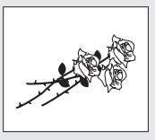

# Chương 12
## Mục Đích Tối Thượng Của Cuộc Đời

*Chuyến phiêu lưu của đời là học hỏi. Mục đích của đời là trưởng thành. Bản tính của đời là thay đổi. Thách thức của đời là vượt qua. Tinh túy của đời là quan tâm. Cơ hội của đời là phụng sự. Bí mật của đời là dám làm. Hương vị của đời là giúp đỡ. Vẻ đẹp của đời là cho đi. *- William Arthur Ward “Các nhà hiền triết Sivana không chỉ là những người trẻ trung nhất mà tôi từng gặp”, Julian nhận xét, “mà chắc chắn họ còn là những người tốt bụng nhất. Yogi Raman kể với tôi rằng lúc còn nhỏ, mỗi đêm trước khi đi ngủ, cha ông sẽ bước vào căn lều phủ đầy hoa hồng của ông và hỏi xem trong ngày hôm đó ông đã làm được những việc tốt gì. Anh tin được không, nếu ông trả lời rằng ông chưa làm được việc tốt nào, thì cha sẽ yêu cầu ông dậy để thực hiện một hành động tử tế nào đó để giúp đỡ người khác rồi mới được phép đi ngủ.” Julian nói tiếp, “Một trong những yếu tố thiết yếu để sống cuộc sống được khai sáng mà tôi có thể chia sẻ với anh là đến cuối đời, bất luận anh đã gặt hái được gì, có bao nhiêu ngôi nhà nghỉ mát, sở hữu bao nhiêu chiếc xe đắt tiền, thì chất lượng cuộc sống của anh vẫn được quyết định bởi những gì anh đã cống hiến”. “Điều này có liên quan gì đến những bông hoa hồng màu vàng tươi tắn trong câu chuyện ngụ ngôn của Yogi Raman không?” “Đương nhiên là có. Những bông hoa sẽ nhắc nhở anh về câu châm ngôn Trung Hoa cổ xưa, ‘Hương hoa luôn còn vương lại trên tay người tặng hoa’. Ý nghĩa của câu châm ngôn này khá rõ ràng: khi anh nỗ lực cải thiện cuộc sống của người khác thì anh cũng gián tiếp nâng tầm cuộc sống của mình. Khi anh để tâm thực hiện những việc tốt ngẫu nhiên mỗi ngày, cuộc sống của chính anh sẽ trở nên phong phú và ý nghĩa hơn. Để nâng giá trị thiêng liêng của mỗi ngày, hãy phụng sự mọi người theo một cách nào đó.” “Anh đang khuyến khích tôi tham gia hoạt động tình nguyện nào đó, phải không?” “Đó là một điểm khởi đầu tuyệt vời. Nhưng những gì tôi đang nói có* tính triết lý sâu xa hơn nhiều. Ý tôi muốn nói là anh nên có mộtnhân sinh *quan mới về vai trò của mình trên hành tinh này.” “Tôi lại không theo kịp nữa rồi. Làm ơn giải thích rõ hơn giúp tôi.” “Nhân sinh quan đơn giản là cách anh nhìn nhận về một tình huống nào đó hoặc về cuộc sống nói chung. Một số người nhìn cuộc đời này như ly nước đã vơi một nửa. Những người lạc quan thì thấy rằng ly nước vẫn còn đầy một nửa. Họ giải thích cùng một tình huống theo những cách khác nhau, bởi vì họ có nhân sinh quan khác nhau. Về cơ bản, nhân sinh quan cũng giống như những lăng kính mà anh đeo vào để nhìn các sự việc trong cuộc sống của mình, cả bên ngoài lẫn bên trong.” “Vậy khi anh nói tôi nên có một nhân sinh quan mới về mục đích trong cuộc sống, có phải ý anh là tôi nên thay đổi quan điểm của mình?” “Cũng gần như vậy. Để cải thiện chất lượng cuộc sống một cách đáng kể, anh phải phát triển một góc nhìn mới về lý do tồn tại của mình trên trái đất này. Anh phải nhận ra rằng bởi anh đến thế giới này với hai bàn tay trắng, nên anh đã được an bài để ra đi trắng tay. Như vậy, trong trường hợp này chỉ có một lý do đúng đắn nhất cho sự tồn tại của anh.” “Và lý do đó là...?” “Sống vì người khác và cống hiến những điều ý nghĩa cho cuộc đời”, Julian đáp. “Tôi không có ý nói rằng anh không thể có những thú vui của riêng mình, hay phải từ bỏ nghề luật và cống hiến cuộc đời cho những người kém may mắn trong xã hội, mặc dù gần đây tôi đã gặp những con người hành động như thế với một sự mãn nguyện tuyệt vời. Thế giới của chúng ta đang đứng giữa một sự thay đổi lớn. Con người đang đổi tiền bạc để nhận lại những giá trị ý nghĩa. Các luật sư từng đánh giá người khác dựa trên kích cỡ túi tiền thì nay đã chuyển sang đánh giá người khác dựa trên sự tận tình của họ với mọi người. Các giáo viên đã vượt ra khỏi giới hạn an toàn trong công việc để vun đắp cho sự phát triển trí tuệ của những đứa trẻ thiếu thốn sống trong những vùng chiến sự. Con người đã nghe thấy lời kêu gọi thống thiết phải thay đổi. Họ nhận ra sự tồn tại của bản thân là vì một mục đích nào đó và ý thức rằng mình đã được trao tặng những món quà đặc biệt để hoàn thành mục đích đó.” “Thế những món quà đặc biệt đó là gì?” “Chính là những gì mà tôi đã nói với anh suốt đêm qua: đó là khả năng tư duy phong phú, nguồn năng lượng vô tận, sự sáng tạo vô hạn, tính kỷ luật trong mọi việc và một suối nguồn bình an luôn chảy trong tâm hồn. Vấn đề ở đây đơn giản là chúng ta cần khai mở những tài sản quý giá này và sử dụng chúng vào những điều tốt đẹp chung trong cộng đồng.” “Tôi vẫn đang lắng nghe đây. Vậy làm thế nào một người có thể thực hiện những điều tốt đẹp đó?” “Ý tôi đơn giản là anh nên ưu tiên thay đổi thế giới quan của anh, thay vì xem bản thân như một cá thể riêng lẻ, hãy bắt đầu nhìn nhận mình là một phần của tổng thể.” “Vậy tôi cần phải trở nên tử tế và hòa nhã với mọi người hơn à?” “Hãy nhận ra rằng việc cao quý nhất mà anh có thể làm là phụng sự* mọi người. Các nhà hiền triết phương Đông gọi đây là quá trình ‘tháo bỏ* sự trói buộc của cái tôi’, nghĩa là từ bỏ cái tôi cá nhân và bắt đầu tập trung vào một mục đích cao cả hơn. Nó có thể được thể hiện qua việc cống hiến nhiều hơn cho những người xung quanh anh, dù là thời gian hay năng lượng: đây chính là hai nguồn tài nguyên giá trị nhất của anh. Nó có thể là một việc lớn lao như xin nghỉ phép một năm để phục vụ cho người nghèo, hoặc một việc nho nhỏ như nhường đường cho vài xe khác đi qua trước khi giao thông đang ùn tắc. Nghe có vẻ hơi cổ lỗ sĩ, nhưng điều mà tôi đã học được là cuộc sống sẽ phát triển theo một chiều kích kỳ diệu hơn khi anh bắt đầu nỗ lực để biến thế giới trở thành một nơi tốt đẹp hơn. Yogi Raman nói rằng lúc vừa được sinh ra, chúng ta khóc trong khi cả thế giới vui cười. Ông khuyên chúng ta nên sống sao để đến lúc lìa đời, thế giới phải khóc còn chúng ta thì thanh thản mỉm cười.” Tôi hiểu điều Julian nói rất có lý. Một trong những điều bắt đầu khiến tôi băn khoăn về nghề luật sư đó là tôi không thật sự cảm thấy mình có thể cống hiến. Thật ra, tôi từng tranh tụng một số vụ kiện mà bản án sau đó đã trở thành án lệ và nhờ vậy cũng tạo ra sự thúc đẩy tích cực cho những điều tốt đẹp hơn trong xã hội. Nhưng nghề luật sư đã dần trở thành một công việc kinh doanh đối với tôi hơn là một việc tôi làm vì đam mê, không vụ lợi. Giống như nhiều bạn đồng trang lứa khác, khi còn học ở trường luật tôi cũng là một người lý tưởng hóa mọi việc. Bên mấy tách cà phê nguội ngắt và những miếng pizza lạnh tanh trong phòng ký túc xá, chúng tôi đã lên kế hoạch thay đổi thế giới. Đã gần hai mươi năm trôi qua kể từ thời điểm đó, khát khao cháy bỏng ngày nào là tạo nên sự thay đổi đã nhường chỗ cho khát khao cháy bỏng ngày nay là thanh toán các khoản vay mua nhà và tích cóp tiền tiết kiệm cho lúc nghỉ hưu. Tôi nhận ra, sau một khoảng thời gian khá dài, tôi đã ẩn nấp trong cái kén của tầng lớp trung lưu – nơi che chở cho tôi giữa xã hội ngoài kia và là nơi mà tôi đã trở nên quá quen thuộc. “Để tôi chia sẻ một câu chuyện cũ, có thể nó sẽ giúp anh hiểu thấu vấn đề”, Julian tiếp tục. “Ngày xưa, có một bà góa đã rất già yếu. Từ lúc người chồng yêu dấu của bà qua đời, bà đã dọn đến sống cùng vợ chồng người con trai và đứa cháu gái. Ngày qua ngày, khả năng nghe và nhìn của bà đều yếu đi. Một hôm nọ, vì tay luôn run rẩy nên bà đã làm đổ hết đĩa thức ăn xuống sàn. Cậu con trai và cô con dâu của bà không khỏi bực mình trước chỗ thức ăn rơi vãi bẩn thỉu ấy và đến một ngày nọ, họ không thể kiên nhẫn thêm được nữa. Thế là họ kê cho bà một chiếc bàn nhỏ ở góc phòng, bên cạnh tủ cất chổi, và để bà dùng bữa ở đó một mình. Cứ đến giờ ăn, bà lại rơm rớm nước mắt nhìn sang phía các con ở bên kia căn phòng. Các con của bà không bao giờ nói chuyện với bà trong bữa ăn, chỉ trừ những lời la mắng khi bà đánh rơi muỗng nĩa. Một buổi tối nọ, ngay trước giờ ăn tối, khi đứa con gái nhỏ đang ngồi trên sàn nhà chơi trò lắp ráp thì cha cô bé sốt sắng hỏi, ‘Con đang làm gì vậy?’. Cô bé trả lời, ‘Con đang lắp ráp một cái bàn nhỏ cho cha và mẹ, để cha mẹ có thể tự ăn ở góc phòng một ngày nào đó khi con đã lớn’. Cha mẹ cô bé chết lặng một lúc lâu. Rồi họ bắt đầu bật khóc. Trong khoảnh khắc đó, họ đã nhận ra bản chất những hành động của mình và nỗi buồn mà họ đã gây ra cho mẹ. Đêm đó, họ đã dẫn người mẹ già đến vị trí mà bà xứng đáng được ngồi vào nơi chiếc bàn ăn lớn và kể từ đó trở đi, bà luôn dùng bữa cùng với con cháu của mình. Và nếu có một mẩu thức ăn rơi ra bàn, hoặc một cái nĩa rớt xuống sàn nhà, thì cũng không còn ai cảm thấy khó chịu nữa.” “Hai người cha mẹ trẻ trong câu chuyện này không phải là người xấu”, Julian nói. “Họ chỉ đơn thuần là cần một tia lửa nhận thức để thắp lên ngọn nến của lòng trắc ẩn. Lòng trắc ẩn và những hành động tử tế mỗi ngày sẽ khiến cho cuộc sống này đẹp hơn rất nhiều. Hãy dành thời gian mỗi buổi sáng để suy ngẫm về những việc tốt mà anh có thể làm được cho người khác trong ngày hôm đó. Lời khen chân thành gửi tới những ai ít trông đợi sẽ nhận được chúng nhất, cử chỉ ấm áp dành cho bạn bè trong lúc khó khăn, những món quà nhỏ thể hiện yêu thương dành cho các thành viên trong gia đình mà chẳng cần nhân dịp nào cả, tất cả những điều đó sẽ tạo ra một phong cách sống tuyệt vời hơn. Nhân tiện nói về tình bạn, hãy đảm bảo rằng anh dành thời gian lui tới với họ thường xuyên. Một người có khoảng ba người bạn thân đã là rất tốt rồi.” Tôi gật đầu. “Bạn bè làm tăng thêm sự hài hước, nét lôi cuốn và vẻ đẹp trong cuộc sống. Chẳng có mấy việc có thể giúp chúng ta trẻ trung trở lại như việc cùng cười sảng khoái với một người bạn cũ. Bạn bè giúp anh giữ sự khiêm tốn cần thiết khi anh trở nên quá tự phụ. Bạn bè khiến anh mỉm cười khi anh quá căng thẳng. Những người bạn tốt luôn ở bên cạnh giúp đỡ anh khi cuộc sống trở nên khắc nghiệt và mọi việc trở nên tồi tệ. Khi còn là một luật sư bận rộn, tôi không có thời gian cho bạn bè. Giờ thì ngoài anh ra, tôi chỉ có một mình, John ạ. Tôi không có ai để cùng đi dạo vào rừng khi những người khác đều đang say giấc trong tổ ấm của họ. Mỗi lúc đọc xong một quyển sách rất hay và cảm động, tôi không có ai để sẻ chia cảm nghĩ. Tôi cũng chẳng có ai để trải lòng khi những tia nắng của một ngày mùa thu rực rỡ sưởi ấm trái tim và đong đầy tâm hồn tôi với niềm hân hoan.” Rồi Julian nhanh chóng lấy lại tinh thần, “Tuy nhiên, tôi sẽ không dành thời gian của mình để tiếc nuối. Tôi đã học được từ các vị thầy của tôi ở Sivana rằng ‘Mỗi buổi bình minh đều là một ngày mới đối với một người đã được khai sáng’”. Tôi vẫn luôn xem Julian là một luật sư tranh tụng siêu phàm. Anh tấn công các luận điểm của đối thủ như cách một võ sĩ đấm vỡ các chồng gỗ được gia cố vững chắc. Tôi có thể thấy con người mà tôi từng gặp cách đây nhiều năm đã biến đổi thành một con người hoàn toàn khác. Con người đang đứng trước mặt tôi thật hòa nhã, tử tế và điềm tĩnh đến lạ thường. Trông anh có vẻ rất thanh thản với con người hiện tại. Không giống với bất kỳ ai mà tôi từng gặp, anh dường như xem nỗi đau trong quá khứ là một vị thầy thông thái, nhưng đồng thời anh cũng nhận thức rằng cuộc đời anh còn có nhiều ý nghĩa hơn, chứ không chỉ dựa vào tất cả những biến cố đã qua. Đôi mắt Julian sáng lấp lánh với niềm hy vọng về những điều sẽ đến. Tôi được bao bọc trong sự hân hoan của anh đối với những điều kỳ diệu trong thế giới này và cũng vui lây niềm vui vô hạn của anh đối với cuộc sống. Tôi nhận ra Julian Mantle, một cố vấn luật sắc lạnh và lợi hại của giới thượng lưu, đã thật sự được nâng tầm từ một con người chẳng quan tâm đến ai thành một sự tồn tại tâm linh đi qua cuộc đời này và hết mực quan tâm đến mọi người. Có lẽ đây cũng là con đường mà bản thân tôi sắp bước theo.

---

### TÓM TẮT CHƯƠNG 12

**Biểu tượng: Nguyên tắc: **Phụng sự mọi người với thái độ không vị kỷ** Bài học: **- Chất lượng cuộc sống của bạn được quyết định bởi những gì bạn đã cống hiến.

- Để nâng giá trị thiêng liêng trong mỗi ngày, hãy sống để cho đi.

- Khi nỗ lực cải thiện cuộc sống của người khác, bạn đã nâng cuộc sống của mình lên những tầm cao mới.** Phương pháp:**

- Thực hiện việc tốt mỗi ngày

- Giúp đỡ người gặp khó khăn

- Vun đắp cho các mối quan hệ tốt đẹp hơn

> *Việc cao quý nhất mà bạn có thể làm là phụng sự mọi người. Hãy bắt đầu tập trung vào mục đích cao cả hơn trong cuộc đời.*
