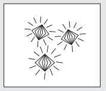

# Chương 13
## Bí Quyết Sống Một Đời Hạnh Phúc

> *Khi say sưa ngắm nhìn cảnh hoàng hôn tuyệt diệu hay vẻ đẹp của vầng trăng, tâm hồn tôi như rộng mở để suy tôn Đấng Sáng Tạo.*
>
> – Mahatma Gandhi

Đã hơn mười hai tiếng đồng hồ kể từ khi Julian đến nhà tôi vào đêm hôm trước để chia sẻ những tri thức mà anh đã lĩnh hội ở Sivana. Chắc chắn mười hai giờ đồng hồ ấy là khoảng thời gian quan trọng nhất cuộc đời tôi. Bỗng chốc tôi cảm thấy mình vừa phấn khởi, vừa tràn đầy động lực và được giải phóng. Julian về cơ bản đã thay đổi thế giới quan của tôi bằng câu chuyện ngụ ngôn của Yogi Raman và những đức tính có giá trị trường tồn mà nó đại diện. Tôi nhận ra mình thậm chí còn chưa bắt đầu khám phá những tiềm năng của bản thân. Tôi đã lãng phí những món quà mà cuộc sống ban tặng. Chính nguồn tri thức của Julian đã cho tôi cơ hội đối mặt với những vết thương đang cản trở tôi sống với tiếng cười, nguồn sinh lực và sự thỏa mãn mà tôi biết mình xứng đáng có được. Tôi cảm thấy xúc động vô cùng.

“Tôi sẽ phải tạm biệt anh thôi. Anh còn nhiều việc đang chờ ngoài kia và tôi cũng có việc riêng phải làm”, Julian nói với giọng luyến tiếc.

“Công việc của tôi có thể để sau mà.”

“Rất tiếc là việc của tôi thì không thể trì hoãn được”, anh mỉm cười nói.

“Nhưng trước khi đi, tôi phải nói về yếu tố cuối cùng trong câu chuyện ngụ ngôn huyền bí của Yogi Raman. Khi vị võ sĩ sumo bước ra từ ngọn hải đăng giữa khu vườn xinh đẹp, anh ta chỉ mặc chiếc khố bằng dây cáp màu hồng che lấy vùng kín cơ thể. Anh ta đeo chiếc đồng hồ bấm giờ bằng vàng vào và ngã xuống mặt đất. Sau một khoảng thời gian dài như vô tận, cuối cùng anh ta cũng tỉnh dậy khi ngửi thấy mùi hương thơm ngát của những bông hồng vàng. Anh ta mừng rỡ đứng lên, rồi hết sức kinh ngạc khi nhìn thấy một con đường dài quanh co được trải bằng hàng triệu viên kim cương nhỏ. Đương nhiên anh bạn võ sĩ sumo của chúng ta đã đi theo con đường này, và bằng cách đó, anh sống hạnh phúc suốt đời.”

“Nghe hay đó”, tôi khúc khích cười.

“Tôi hoàn toàn đồng ý là Yogi Raman có một trí tưởng tượng khá sinh động. Nhưng anh thấy rồi đấy, câu chuyện này có ý nghĩa riêng và những nguyên tắc mà nó tượng trưng không chỉ có tác động mạnh mẽ mà còn rất thiết thực.”

“Đúng vậy”, tôi đồng ý không chút do dự.

“Con đường trải kim cương sẽ nhắc nhở anh về đức tính cuối cùng để sống đời khai sáng. Bằng cách áp dụng nguyên tắc này vào công việc hàng ngày, anh sẽ khiến cuộc sống của mình trở nên phong phú đến mức tôi không biết dùng lời nào để diễn tả. Anh sẽ bắt đầu nhìn thấy nét đẹp diệu kỳ mà tinh tế trong những điều giản dị nhất và sẽ sống với niềm hạnh phúc ngất ngây mà anh xứng đáng có được. Bằng cách thực hiện lời hứa chia sẻ tri thức này cho những người khác, anh cũng sẽ giúp họ biến đổi thế giới của họ từ bình thường thành phi thường.”

“Liệu điều này có mất nhiều thời gian không?”

“Tự bản thân nguyên tắc này đã rất rõ ràng và dễ nắm bắt. Nhưng học cách áp dụng chúng hiệu quả trong toàn bộ khoảng thời gian tỉnh thức của mình thì sẽ cần vài tuần luyện tập kiên trì.”

“Được rồi, tôi rất nóng lòng muốn nghe.”

“Thật buồn cười khi nghe anh nói vậy, bởi vì đức tính thứ bảy và cũng là đức tính cuối cùng, lại nói về cách sống. Các nhà hiền triết Sivana tin rằng một cuộc sống thật sự hạnh phúc và xứng đáng chỉ có thể đến qua một quá trình mà họ gọi là ‘sống trong hiện tại’. Các bậc thầy này tin rằng quá khứ là nước chảy qua cầu và tương lai là vầng thái dương phía xa nơi chân trời của trí tưởng tượng. Khoảnh khắc quan trọng nhất chính là hiện tại. Hãy học cách sống với hiện tại và tận hưởng nó một cách trọn vẹn.”

“Tôi hiểu chính xác những gì anh đang nói, Julian à. Có vẻ tôi thường dành phần lớn thời gian trong ngày để gặm nhấm những sự kiện đã qua mà tôi không có khả năng thay đổi gì được nữa, hoặc để lo lắng về những việc sắp xảy đến, dù thật ra có khi chúng chẳng bao giờ xảy ra. Tâm trí tôi luôn đầy ắp hàng triệu ý nghĩ giằng xé tôi theo nhiều hướng khác nhau. Việc này thật sự khiến tôi chán nản vô cùng.”

“Tại sao lại như vậy?”

“Nó khiến tôi mệt mỏi! Tôi đoán là do tính tôi thiếu điềm tĩnh. Thế nhưng, tôi cũng đã từng trải nghiệm cảm giác hoàn toàn tập trung vào mỗi một việc ngay trước mắt. Thường thì điều này xảy ra khi tôi chịu áp lực phải hoàn tất bản tóm tắt một vụ kiện nào đấy, và tôi không có thời gian để suy nghĩ về bất cứ việc gì khác ngoài nhiệm vụ trước mắt. Ngoài ra, tôi cũng cảm nhận được sự tập trung cao độ này khi cùng chơi bóng đá với các con trai và tôi quyết tâm phải giành phần thắng. Thời gian trôi qua vùn vụt và tôi cảm thấy mình cực kỳ tập trung. Cứ như thể điều duy nhất quan trọng đối với tôi là những việc tôi đang làm vào ngay thời điểm đó. Mọi việc khác, những nỗi lo lắng, các hóa đơn, công việc, đều chẳng quan trọng nữa. Nghĩ kỹ thì đây cũng là những lúc tôi cảm thấy bình yên nhất.”

“Việc tập trung theo đuổi một công việc đầy thách thức chính là con đường chắc chắn nhất dẫn đến sự thỏa mãn cá nhân. Nhưng hãy ghi nhớ điều then chốt này, hạnh phúc là một hành trình chứ không phải đích đến. Hãy sống cho hôm nay, vì mỗi ngày đều là duy nhất”, Julian nói, rồi anh chắp hai tay lại như một lời cảm ơn vì mình đã được lĩnh hội những điều này.

“Đó có phải là nguyên tắc mà con đường trải kim cương trong câu chuyện ngụ ngôn của Yogi Raman đại diện không?”, tôi hỏi.

“Đúng vậy”, Julian đáp ngắn gọn. “Cũng như võ sĩ sumo đã tìm thấy sự mãn nguyện và niềm hạnh phúc vĩnh hằng bằng cách đi trên con đường trải kim cương, anh cũng sẽ có được cuộc sống mà anh xứng đáng có ngay khi anh bắt đầu nhận ra con đường mà mình đang đi trải đầy kim cương và nhiều kho báu vô giá khác. Đừng dành quá nhiều thời gian theo đuổi những khoái lạc trong cuộc đời mà phớt lờ biết bao niềm vui nhỏ bé. Hãy sống chậm lại. Hãy tận hưởng vẻ đẹp và sự thiêng liêng của mọi thứ xung quanh anh. Anh nợ bản thân mình điều đó.”

“Có phải điều này nghĩa là tôi nên dừng thiết lập những mục tiêu lớn cho tương lai và tập trung vào hiện tại hay không?”

“Không”, Julian trả lời chắc nịch. “Như tôi đã nói, mục tiêu và mơ ước cho tương lai là những yếu tố cơ bản để đạt được thành công đích thực trong cuộc sống. Hy vọng về những gì sẽ xuất hiện trong tương lai chính là yếu tố khiến anh bật dậy khỏi giường vào mỗi buổi sáng và mang đến cho anh một tâm trạng hứng khởi suốt cả ngày. Những mục tiêu khiến cuộc đời anh luôn tràn đầy năng lượng. Tóm lại, ý tôi đơn giản là đừng bao giờ trì hoãn hạnh phúc chỉ để theo đuổi thành tựu. Đừng bao giờ trì hoãn những điều quan trọng có thể mang đến sự an vui và khiến anh cảm thấy mãn nguyện. Hôm nay chính là một ngày để sống thật trọn vẹn, chứ không phải đợi đến lúc anh trúng số hay đến lúc nghỉ hưu. Đừng bao giờ trì hoãn việc sống đúng nghĩa!”

Julian đứng dậy và bắt đầu đi tới đi lui trong căn phòng khách như một luật sư dày dạn kinh nghiệm đang chuẩn bị tung đòn cuối để kết thúc cuộc tranh luận sôi nổi. “Đừng tự lừa dối bản thân với suy nghĩ rằng anh sẽ trở thành một người chồng biết yêu thương và biết trao đi nhiều hơn khi hãng luật tuyển thêm vài luật sư trẻ để san sẻ gánh nặng công việc. Đừng tự gạt mình rằng anh sẽ bắt đầu làm giàu tri thức, chăm sóc thân thể và nuôi dưỡng tâm hồn mình khi số tiền trong tài khoản ngân hàng của anh đủ nhiều và anh có nhiều thời gian rỗi hơn. Hôm nay chính là thời điểm để tận hưởng trái ngọt từ tất cả nỗ lực của mình. Hôm nay chính là lúc để nắm bắt từng khoảnh khắc và sống một cuộc sống thăng hoa nhất. Hôm nay chính là ngày để sống với những gì mình đã tưởng tượng và gặt hái những ước mơ. Và xin anh đừng bao giờ quên món quà gia đình.”

“Tôi không chắc là mình hiểu chính xác ý anh đâu, Julian ạ.”

“Hãy sống cùng tuổi thơ của các con anh”, Julian trả lời đơn giản.

“Hả?”, tôi hỏi nhỏ, hoàn toàn lúng túng trước điều mới nghe.

“Chẳng có mấy việc mang nhiều ý nghĩa như được trở thành một phần trong tuổi thơ của các con anh đâu. Việc leo lên những nấc thang thành công thì có ý nghĩa gì khi anh bỏ lỡ những bước đi đầu đời của con mình? Việc sở hữu một căn nhà to nhất phố thì có ý nghĩa gì nếu anh không dành thời gian để tạo dựng một mái ấm? Việc trở nên nổi tiếng khắp cả nước trong vai trò một luật sư sáng giá thì có tác dụng gì nếu các con anh thậm chí còn không biết về cha của chúng?”, giọng của Julian run run vì xúc động. “Tôi biết rõ mình đang nói gì.”

Câu nói cuối cùng của Julian khiến tôi chết lặng. Theo tất cả những gì tôi biết thì Julian là một luật sư siêu sao luôn đi cùng giới thượng lưu và những cô gái đẹp. Mấy cuộc hẹn hò tình tứ của anh cùng những cô người mẫu thời trang trẻ trung, khiêu gợi cũng mang tính huyền thoại không kém kỹ năng hùng biện của anh trước tòa. Anh chàng triệu phú hoang đàng ngày đó thì có thể biết gì về việc làm cha kia chứ? Làm sao anh ta có thể biết nỗi vất vả hằng ngày mà tôi phải đối mặt để đáp ứng nhu cầu của mọi người, để làm tròn vai trò một người cha tuyệt vời và một luật sư thành đạt? Nhưng trực giác của Julian đã đoán được những suy nghĩ của tôi.

Anh nói, “Tôi có biết về những thiên thần mà chúng ta gọi là những đứa con”.

“Nhưng tôi tưởng anh vẫn luôn là chàng độc thân sáng giá nhất thành phố trước khi anh từ giã nghề luật sư.”

“Trước khi tôi sa vào lối sống quay cuồng và nguy hiểm khiến tôi nổi tiếng một thời ấy, anh biết tôi từng kết hôn mà.”

“Đúng vậy.”

Rồi anh dừng lại trong chốc lát, như cách một đứa trẻ thường làm trước khi kể cho cậu bạn thân nghe bí mật ghê gớm nhất của mình.

“Điều anh không biết đó là tôi cũng có một cô con gái nhỏ. Con bé là người ngọt ngào nhất và dịu dàng nhất mà tôi từng được gặp trong cuộc đời mình. Hồi đó tôi rất giống anh lúc chúng ta mới gặp nhau lần đầu: tự mãn, đầy tham vọng và cũng đầy hy vọng. Tôi có mọi thứ mà bất kỳ ai cũng đều muốn sở hữu. Mọi người nói rằng tôi có một tương lai xán lạn, một người vợ xinh đẹp tuyệt trần và một cô con gái tuyệt vời. Thế nhưng chính vào lúc cuộc sống có vẻ rất hoàn hảo như vậy thì tôi lại mất tất cả chỉ trong nháy mắt.”

Lần đầu tiên kể từ khi trở về, gương mặt luôn rạng ngời niềm vui của Julian bị bao phủ bởi một nỗi buồn sâu sắc. Một giọt nước mắt lặng lẽ lăn dài trên gương mặt anh. Tôi không nói nên lời và thấy đau lòng khi nghe lời tâm sự của người bạn lâu năm.

“Anh không cần phải nói nữa đâu, Julian”, tôi nói với sự cảm thông và choàng tay qua vai anh để an ủi.

“Nhưng tôi phải tiếp tục, John à. Trong tất cả những người mà tôi quen biết trước đây, anh là người mà tôi thấy nhiều hứa hẹn nhất. Như tôi đã nói, anh khiến tôi nhớ về bản thân mình khi còn trẻ. Thậm chí đến tận bây giờ, anh vẫn còn nhận rất nhiều ưu ái từ cuộc đời. Nhưng nếu cứ duy trì lối sống hiện tại, anh sẽ rơi vào thảm họa. Tôi quay về nơi đây để cho anh thấy rằng có rất nhiều điều kỳ diệu ngoài kia đang chờ anh khám phá và rất nhiều khoảnh khắc để anh có thể tận hưởng.

Gã tài xế say rượu gây ra cái chết của con gái tôi không chỉ lấy đi một mạng sống quý giá vào buổi trưa tháng Mười đầy nắng ấy, mà hắn đã tước đoạt đến hai mạng sống. Sau khi con gái tôi qua đời, cuộc đời tôi vỡ nát. Tôi bắt đầu dành mọi phút giây tỉnh táo để làm việc, với niềm hy vọng mù quáng rằng công việc sẽ xoa dịu trái tim tan nát của mình. Có những ngày tôi ngủ luôn ở văn phòng bởi tôi rất sợ về nhà, nơi mà quá nhiều kỷ niệm ngọt ngào về con bé vẫn còn đó. Trong khi sự nghiệp ngày càng thăng hoa thì thế giới nội tâm của tôi lại trở thành một đống hỗn độn. Vợ tôi, người đã luôn đồng hành cùng tôi từ khi còn học ở trường luật, đã rời bỏ tôi bởi sự ám ảnh của tôi với công việc là giọt nước tràn ly đối với cô ấy. Sức khỏe của tôi tệ đi và tôi sa vào lối sống tai tiếng mà anh đã biết khi chúng ta gặp nhau lần đầu. Chắc chắn tôi đã có mọi thứ mà tiền có thể mua được. Nhưng tôi đã bán linh hồn mình cho chúng, thật sự là vậy”, Julian xúc động thổ lộ, giọng anh vẫn hết sức nghẹn ngào.

“Vậy khi anh nói ‘Hãy sống với tuổi thơ của các con’ nghĩa là anh đang khuyên tôi nên dành thời gian để nhìn chúng trưởng thành, phải vậy không?”

“Thậm chí đến tận hôm nay, hai mươi bảy năm kể từ khi con bé rời bỏ chúng tôi trong lúc chúng tôi lái xe đưa nó đến dự tiệc sinh nhật người bạn thân của nó, tôi vẫn sẽ sẵn sàng đánh đổi bất kỳ thứ gì để được một lần nghe lại tiếng con bé cười khúc khích hoặc được cùng chơi trốn tìm như chúng tôi vẫn thường hay chơi trong khu vườn sau nhà. Tôi ước gì lại được ôm con trong vòng tay và nhẹ nhàng mân mê những sợi tóc vàng óng của nó. Con bé đã ra đi và mang theo một phần trái tim tôi. Và mặc dù cuộc sống của tôi đã hồi sinh với một ý nghĩa mới, kể từ khi tôi tìm được con đường dẫn đến khai sáng và tự lãnh đạo bản thân ở Sivana, nhưng không ngày nào tôi không nhìn thấy gương mặt hồng hào của con bé trong tâm trí mình. Anh có những đứa con tuyệt vời, John ạ. Đừng chỉ thấy cây mà không thấy rừng. Món quà đáng quý nhất mà anh có thể trao tặng cho các con chính là tình yêu thương của mình. Hãy luôn tìm hiểu về chúng. Hãy cho chúng biết chúng quan trọng hơn rất nhiều so với những phần thưởng phù du mà anh có thể đạt được trong sự nghiệp. Rồi chúng sẽ lớn lên rất nhanh, tự tạo dựng cuộc sống và gia đình của riêng mình. Đến lúc đó sẽ là quá muộn, thời gian sẽ vuột đi mất.”

Julian đã đánh trúng tâm lý tôi một cách sâu sắc. Tôi đoán cũng có những lúc tôi nhận ra nhịp độ làm việc quay cuồng của tôi đã dần dần làm lỏng mối dây liên kết trong gia đình. Nhưng nó giống như hòn than âm ỉ cháy, lặng lẽ và chậm chạp tập trung nguồn năng lượng trước khi bộc phát hết tiềm năng hủy diệt của mình. Tôi biết các con cần tôi, kể cả khi chúng không nói với tôi điều đó. Tôi cần được nghe điều này từ Julian. Thời gian trôi vun vút và bọn trẻ đang lớn lên rất nhanh. Tôi không thể nhớ nổi lần cuối cùng tôi và con trai Andy lẻn dậy sớm vào một buổi sáng thứ Bảy trời hanh khô để đi câu cá tại một hồ nước mà thằng bé rất thích là khi nào. Có một thời gian mà cuối tuần nào chúng tôi cũng đi câu cá. Giờ đây, nếp sinh hoạt truyền thống ấy đã trở thành một ký ức xa lạ như của một người nào khác.

Càng nghĩ về việc đó, tôi càng thấy đau lòng. Những buổi biểu diễn piano, các buổi diễn kịch trong đêm Giáng sinh và giải vô địch bóng đá nhí đã được đánh đổi để tôi có sự thăng tiến trong công việc.

“Tôi đã làm gì thế này?”, tôi tự hỏi. Tôi thật sự đang trượt dốc như Julian nói. Ngay thời điểm ấy và tại căn phòng đó, tôi quyết tâm phải thay đổi.

“Hạnh phúc là một cuộc hành trình”, Julian lại hăng say nói tiếp. “Nó cũng là một lựa chọn mà anh đưa ra. Hoặc anh sẽ luôn ngạc nhiên trước những viên kim cương quý giá dọc đường, hoặc anh cứ cắm đầu đuổi theo những ảo ảnh hào nhoáng ở cuối con đường và cuối cùng nhận ra chẳng có gì ở đó cả. Hãy tận hưởng những khoảnh khắc đặc biệt mà mỗi ngày mang đến, bởi vì ngày hôm nay chính là tất cả những gì anh có.”

“Liệu chúng ta có thể học cách ‘sống với hiện tại’ không?”

“Chắc chắn là được. Bất luận hoàn cảnh hiện tại của anh có như thế nào, anh đều có thể rèn luyện bản thân để biết tận hưởng món quà của sự sống và đong đầy cuộc sống bằng những điều quý giá mỗi ngày.”

“Nhưng như thế có phải là quá lạc quan không? Thế còn những người vừa mới mất hết mọi thứ do thất bại trong việc làm ăn? Giả sử như họ không chỉ phá sản về mặt tiền bạc, mà còn phá sản về mặt cảm xúc nữa.”

“Kích cỡ ngôi nhà của anh và số tiền mà anh có trong tài khoản chẳng liên quan gì đến việc sống vui tươi và cởi mở trước những điều mới mẻ. Thế giới này có thừa những nhà triệu phú bất hạnh. Anh có nghĩ những nhà hiền triết mà tôi đã gặp ở Sivana có bận tâm gì đến chuyện phải có tài chính ổn định và phải sở hữu một căn nhà nghỉ hè ở miền nam nước Pháp không?”, Julian tinh nghịch hỏi.

“Được rồi, tôi đã hiểu ý anh.”

“Có một sự khác biệt hết sức to lớn giữa việc tạo ra thật nhiều tiền và việc sống thật chất lượng. Khi bắt đầu dành ra dù chỉ năm phút mỗi ngày để tập bày tỏ lòng biết ơn, anh sẽ vun đắp cuộc sống sung túc mà anh đang tìm kiếm. Ngay cả kẻ sa cơ thất thế trong ví dụ của anh cũng có rất nhiều thứ mà anh ta có thể biết ơn, dù đã rơi vào tình trạng tài chính khó khăn. Hãy hỏi anh ta xem có phải anh ta vẫn còn có sức khỏe, có gia đình thương yêu và vẫn còn uy tín trong cộng đồng không. Hãy hỏi xem có phải anh ta vẫn còn niềm hạnh phúc khi được là công dân của đất nước tuyệt vời này và vẫn còn một mái nhà che mưa che nắng không. Có thể anh ta chẳng còn tài sản gì ngoài kỹ năng làm việc chuyên nghiệp và có thể mơ những mơ ước lớn lao, nhưng đó cũng chính là những tài sản quý giá mà anh ta phải thấy biết ơn. Tất cả chúng ta đều có rất nhiều thứ để biết ơn. Thậm chí cả những chú chim hót líu lo ngoài cửa sổ vào một ngày hè tuyệt đẹp cũng có thể xem là một món quà đối với một người thông thái. Hãy nhớ, John ạ, rằng cuộc sống không phải lúc nào cũng mang đến những điều anh muốn, nhưng nó luôn mang đến những thứ anh cần.”

“Vậy bằng cách biết ơn tất cả những gì mình có, dù đó là tài sản vật chất hay tinh thần, thì tôi sẽ phát triển được thói quen sống với hiện tại ư?”

“Đúng vậy. Đây là phương pháp hiệu quả để mang giá trị sống đích thực vào cuộc đời anh. Khi tận hưởng ‘hiện tại’, anh nhóm lên ngọn lửa của cuộc sống, thứ sẽ giúp anh phát triển vận mệnh của chính mình.”

“Phát triển vận mệnh của tôi ư?”

“Đúng vậy. Tôi đã nói với anh rằng tất cả chúng ta đều được trao tặng những tài năng nhất định. Mỗi con người trên hành tinh này đều là một thiên tài.”

“Thế là anh không biết một số luật sư mà tôi làm việc cùng rồi”, tôi đùa.

“Tất cả mọi người”, Julian nhấn mạnh. “Tất cả chúng ta đều có sứ mệnh của mình. Tài năng của anh sẽ tỏa sáng thông qua sứ mệnh ấy, và hạnh phúc sẽ ngập tràn trong cuộc sống của anh ngay khi anh khám phá ra mục đích cao cả của đời mình và tập trung tất cả nguồn năng lượng của mình vào nó. Một khi anh đã kết nối được với sứ mệnh ấy, bất luận đó là trở thành một giáo viên tuyệt vời hay một họa sĩ đầy cảm hứng, thì tất cả những khát khao của anh sẽ được thỏa mãn một cách dễ dàng. Anh thậm chí chẳng cần phải cố gắng. Sự thật là càng gắng sức thì anh sẽ càng mất nhiều thời gian để đạt được mục tiêu của mình. Thế nên hãy cứ đi theo con đường mơ ước và cứ kỳ vọng những điều tốt đẹp nhất chắc chắn sẽ đến. Điều này sẽ đưa anh tới đích đến thiêng liêng của mình. Đây chính là điều tôi muốn nói khi tôi đề cập đến việc phát triển vận mệnh của anh”, Julian nói như một nhà hiền triết.

“Hồi tôi còn nhỏ, cha hay đọc cho tôi nghe một câu chuyện cổ tích có tựa ‘Peter và sợi dây thần kỳ’. Peter là một cậu bé rất hoạt bát. Mọi người, bao gồm gia đình, thầy cô và bạn bè, đều yêu quý cậu. Nhưng cậu vẫn có một điểm yếu.”

“Đó là gì?”

“Peter không thể sống trong hiện tại. Cậu không biết cách tận hưởng cuộc sống khi nó đang diễn ra. Khi ở trường, cậu mơ mộng được ra ngoài chơi. Khi được ra ngoài chơi, cậu lại mơ về kỳ nghỉ hè. Peter cứ tiếp tục mơ mộng giữa ban ngày như thế, cậu không bao giờ dành thời gian để thưởng thức những khoảnh khắc đặc biệt đầy ắp trong một ngày của mình. Một buổi sáng nọ, Peter đi dạo trong khu rừng ở gần nhà. Rồi cậu thấy mệt và quyết định nằm nghỉ trên một thảm cỏ và từ từ ngủ thiếp đi. Chỉ sau vài phút ngủ sâu, Peter nghe thấy ai đó đang gọi tên cậu, ‘Peter! Peter!’. Tiếng gọi lanh lảnh vang vọng từ bên trên. Khi cậu từ từ mở mắt ra, cậu kinh ngạc thấy một bà lão với vẻ ngoài hết sức ấn tượng đang đứng trước mặt mình. Bà ấy hẳn phải trên trăm tuổi, và mái tóc trắng như tuyết dài qua vai của bà đong đưa như một tấm chăn len. Trong đôi tay nhăn nheo của bà có một quả bóng nhỏ kỳ diệu với một cái lỗ ở chính giữa và từ trong cái lỗ ấy có một sợi dây bằng vàng đong đưa.

Bà lão nói, ‘Peter, đây là sợi dây của cuộc đời con. Nếu con kéo sợi dây một chút, một giờ sẽ trôi qua trong vòng vài giây. Nếu con kéo sợi dây mạnh hơn, nhiều ngày sẽ trôi qua chỉ trong vài phút. Và nếu con kéo mạnh hết sức, nhiều tháng, thậm chí là nhiều năm sẽ trôi qua chỉ trong vài ngày’. Peter trở nên hào hứng trước khám phá này. ‘Con có thể giữ nó không thưa bà?’, cậu bé hỏi. Bà lão cúi xuống và đưa quả bóng có sợi dây thần kỳ ấy cho cậu bé.

Ngày hôm sau, Peter đang ngồi trong lớp học, cảm thấy bồn chồn và buồn chán. Đột nhiên, cậu nhớ đến món đồ chơi mới của mình. Khi cậu kéo sợi dây bằng vàng một chút, cậu lập tức thấy mình đã ở nhà, đang chơi trong vườn. Nhận ra được quyền năng của sợi dây thần kỳ, Peter nhanh chóng cảm thấy mệt mỏi với việc làm một cậu học trò nhỏ, và cậu mong muốn trở thành một thiếu niên với tất cả những điều sôi nổi mà giai đoạn ấy của cuộc đời có thể mang đến. Thế là một lần nữa, cậu lấy quả bóng ra và kéo mạnh sợi dây bằng vàng.

Cậu bất ngờ thấy mình đã trở thành một thiếu niên với một cô bạn gái xinh đẹp tên là Elise. Nhưng Peter vẫn chưa thỏa mãn. Cậu chưa bao giờ học cách tận hưởng khoảnh khắc hiện tại và khám phá những điều tuyệt vời giản đơn trong từng giai đoạn của cuộc đời mình. Cậu mơ về việc trở thành một người trưởng thành. Thế là cậu lại kéo sợi dây và nhiều năm nữa trôi qua chỉ trong tích tắc. Giờ thì cậu thấy mình đã biến thành một người đàn ông trung niên. Elise lúc này đã là vợ của cậu và cậu đang ở trong một căn nhà đầy trẻ nhỏ. Nhưng Peter cũng đã nhận thấy một việc khác nữa. Mái tóc một thời đen nhánh của cậu giờ đã chuyển màu hoa râm. Người mẹ một thời trẻ trung mà cậu yêu thương hết mực giờ đã già yếu. Thế nhưng, Peter vẫn không thể sống với khoảnh khắc ấy. Cậu chưa bao giờ học cách ‘sống với hiện tại’. Vậy là một lần nữa, cậu kéo sợi dây thần kỳ và chờ những thay đổi xuất hiện.

Giờ thì Peter thấy mình đã trở thành một ông lão chín mươi. Mái tóc đen dày của cậu giờ đã trắng như tuyết. Cô vợ Elise xinh đẹp của cậu cũng đã già nua và qua đời trước đó vài năm. Những đứa con tuyệt vời của cậu cũng rời nhà để tự tạo lập cuộc sống của riêng chúng. Lần đầu tiên trong cả cuộc đời mình, Peter nhận ra cậu đã không dành thời gian để trân trọng những điều tuyệt diệu trong cuộc sống. Cậu đã không đi câu cá với các con, hay đi dạo dưới ánh trăng cùng Elise. Cậu chưa bao giờ trồng một khu vườn hay đọc những quyển sách hay mà mẹ cậu từng thích đọc. Thay vào đó, cậu hối hả lướt nhanh qua cuộc sống, chẳng bao giờ chịu dừng lại để nhìn thấy tất cả những điều tốt đẹp trên đường.

Peter rất buồn bã trước phát hiện này. Cậu quyết định đi đến khu rừng mà cậu thường đi dạo lúc còn nhỏ để đầu óc tỉnh táo và lấy lại tinh thần. Khi bước vào rừng, cậu nhận thấy rằng những cái cây non trong ký ức tuổi thơ giờ đã trở thành những cây sồi đồ sộ. Bản thân khu rừng cũng đã phát triển thành một thiên đường tự nhiên. Cậu nằm xuống một thảm cỏ nhỏ và ngủ thiếp đi. Sau chỉ một phút, cậu nghe thấy có ai đó đang gọi mình. ‘Peter! Peter!’, tiếng gọi vang lên. Cậu kinh ngạc nhìn lên và nhận ra đó chính là bà lão đã đưa cho cậu quả bóng với sợi dây thần kỳ bằng vàng cách đây nhiều năm.

‘Con có thích món quà đặc biệt của ta không?’, bà lão hỏi.

Peter trả lời thẳng thắn, ‘Ban đầu thì có, nhưng bây giờ thì con ghét nó. Cả cuộc đời đã trôi vụt qua trước mắt mà con chẳng có cơ hội được tận hưởng. Chắc chắn là sẽ có những khoảng thời gian buồn bã, cũng như những khoảng thời gian tuyệt vời, nhưng con chưa từng có cơ hội để trải nghiệm bất cứ khoảng thời gian nào cả. Con cảm thấy trong lòng mình trống rỗng. Con đã đánh mất món quà của việc sống đúng nghĩa’.

‘Con thật là vô ơn’, bà lão nói. ‘Thế nhưng, ta vẫn sẽ cho con một điều ước cuối cùng.’ Peter suy nghĩ trong khoảnh khắc rồi nhanh chóng trả lời, ‘Con muốn quay trở về làm cậu học trò và được sống cuộc đời mình thêm lần nữa’. Thế rồi, cậu lại ngủ thiếp đi.

Lại một lần nữa cậu nghe thấy tiếng ai đó gọi tên mình và cậu mở mắt ra. ‘Lần này thì có thể là ai đây?’, cậu tự hỏi. Khi vừa mở mắt, cậu vô cùng vui sướng khi thấy mẹ mình đang đứng bên cạnh giường ngủ. Mẹ trông trẻ trung, khỏe mạnh và rạng rỡ. Peter nhận ra rằng bà lão kỳ lạ trong rừng đã biến điều ước của cậu thành sự thật và cậu đã được trở về với cuộc sống trước đây của mình.

‘Nhanh lên Peter. Con ngủ quá nhiều rồi. Những giấc mơ sẽ khiến con bị trễ học nếu con không dậy ngay bây giờ’, mẹ cậu quở trách. Đương nhiên, vào buổi sáng hôm ấy, Peter bật dậy khỏi giường và bắt đầu sống theo cách mà cậu mong muốn. Cậu sống một cuộc đời thật trọn vẹn, với những niềm say mê, vui sướng và thành công vang dội. Nhưng tất cả đều bắt đầu khi cậu thôi bỏ phí giây phút hiện tại để mơ mộng về tương lai và bắt đầu sống trong khoảnh khắc mình đang có.”

“Thật là một câu chuyện tuyệt vời”, tôi nói.

“Đáng tiếc câu chuyện về Peter và sợi dây thần kỳ chỉ là chuyện cổ tích mà thôi. Chúng ta, ở trong thế giới thật này, sẽ không bao giờ có cơ hội thứ hai để sống cuộc đời mình thật trọn vẹn. Ngày hôm nay chính là cơ hội để anh tỉnh thức và nhận ra món quà của cuộc sống trước khi quá muộn. Thời gian thật sự đang trôi qua rất nhanh. Hãy để hôm nay trở thành khoảnh khắc minh định của cuộc đời anh, ngày anh đưa ra một quyết định dứt khoát để tập trung vào những điều thật sự quan trọng đối với bản thân. Hãy dành nhiều thời gian hơn cho những việc khiến cuộc sống của anh trở nên ý nghĩa. Hãy trân trọng những khoảnh khắc đặc biệt và đắm mình trong quyền năng của chúng. Hãy làm những việc mà anh luôn muốn làm. Hãy leo lên ngọn núi mà anh luôn muốn chinh phục, hoặc hãy học thổi kèn trumpet. Hãy khiêu vũ dưới cơn mưa hoặc tạo dựng một công việc kinh doanh mới. Hãy học cách yêu âm nhạc, học một ngôn ngữ mới và thắp sáng lại những niềm vui tuổi thơ của mình. Hãy thôi trì hoãn hạnh phúc. Thay vì vậy, sao ta lại không tận hưởng quá trình? Hãy phục hồi tinh thần và bắt đầu chăm sóc tâm hồn mình. Đây là một cách để đến được cõi Niết Bàn.”

“Niết Bàn ư?”

“Các nhà hiền triết Sivana tin rằng đích đến cuối cùng của tất cả những tâm hồn được khai sáng là nơi được gọi là Niết Bàn. Đó thật ra không đơn giản chỉ là một nơi chốn, mà là một trạng thái, một cảnh giới vượt trên bất cứ những gì mà họ từng biết trước đây. Ở cõi Niết Bàn, tất cả mọi điều đều có thể. Nơi ấy không có khổ đau, vũ điệu cuộc sống được diễn ra một cách hoàn hảo và thiêng liêng. Khi đạt đến cõi Niết Bàn, các nhà hiền triết cảm thấy như thể được bước vào chốn Thiên Đường trần gian. Đó chính là mục đích tối thượng trong cuộc sống của họ”, Julian nói, gương mặt anh rạng ngời nét thanh thản và bình an như một thiên thần.

“Tất cả chúng ta đều ở đây vì một lý do đặc biệt nào đó”, anh nói như một nhà tiên tri. “Hãy suy ngẫm về sứ mệnh thật sự của anh và cách mà anh có thể cống hiến cuộc đời mình vì lợi ích của mọi người. Hãy thôi làm tù nhân của những lực hút. Ngay hôm nay, hãy thắp lên ngọn lửa của sự sống và để nó cháy sáng. Hãy bắt đầu áp dụng các nguyên tắc và chiến lược mà tôi đã chia sẻ với anh. Hãy trở thành tất cả những gì anh có thể trở thành. Rồi sẽ đến lúc chính anh cũng được thưởng thức những hoa trái ngọt ngào nơi cõi Niết Bàn.”

“Làm sao tôi biết được khi nào thì mình đạt tới cảnh giới của sự khai sáng ấy?”

“Những dấu hiệu nhỏ sẽ xuất hiện để xác định điều đó. Anh sẽ bắt đầu nhận thấy sự thiêng liêng trong mọi thứ xung quanh mình: sự thiêng liêng của ánh trăng, sự quyến rũ của bầu trời xanh thẳm trong một ngày hè oi ả, hương thơm của một bông hoa cúc, hay tiếng cười của một đứa trẻ tinh nghịch.”

“Julian, tôi hứa với anh rằng thời gian anh đã dành cho tôi sẽ không bị lãng phí. Tôi sẽ dốc hết sức mình để sống bằng nguồn tri thức của các nhà hiền triết Sivana, và tôi sẽ giữ lời hứa với anh bằng cách chia sẻ tất cả những điều tôi đã học với những ai có thể hưởng lợi từ thông điệp của anh. Tôi đang nói bằng cả tấm lòng mình. Tôi xin cam đoan với anh điều đó”, tôi chân thành nói, lòng trào dâng cảm xúc.

“Hãy lan truyền di sản giá trị của các nhà hiền triết đến tất cả những người xung quanh anh. Họ sẽ nhanh chóng được hưởng lợi từ những hiểu biết này và cải thiện cuộc sống của họ, cũng như anh đã cải thiện cuộc sống của bản thân. Hãy nhớ, phải tận hưởng cuộc hành trình của mình. Quãng đường cũng tốt đẹp hệt như đích đến vậy.”

Rồi Julian nói tiếp, “Yogi Raman là một người kể chuyện tuyệt vời, nhưng có một câu chuyện ông kể với tôi nổi bật hơn tất cả các câu chuyện còn lại. Tôi chia sẻ nó với anh được không?”.

“Chắc chắn là được chứ.”

“Ngày xưa, ở đất nước Ấn Độ cổ đại có một vị vua muốn xây dựng một lăng mộ thật to cho người vợ của mình để thể hiện tình yêu sâu sắc mà ông dành cho bà. Ông muốn dựng lên một công trình kiến trúc chưa từng có trên thế giới, một công trình tỏa sáng lung linh dưới bầu trời sáng ánh trăng, một công trình mà loài người phải ngưỡng mộ suốt nhiều thế kỷ. Thế là mỗi ngày, từng phần của lăng mộ được dựng lên, các công nhân của ông làm việc quần quật ngoài trời nắng nóng. Mỗi ngày khối kiến trúc ấy lại trở nên rõ ràng hơn, vừa giống một đài tưởng niệm, vừa giống một biểu tượng của tình yêu sừng sững giữa nền trời Ấn Độ xanh ngắt. Cuối cùng, sau hai mươi hai năm nỗ lực bền bỉ mỗi ngày, công trình kiến trúc bằng đá cẩm thạch ấy đã được hoàn thành. Anh có đoán được tôi đang đề cập đến công trình nào không?”

“Tôi không biết.”

“Đó chính là lăng mộ Taj Mahal, một trong bảy kỳ quan thế giới”, Julian đáp. “Ý tôi rất đơn giản. Mỗi người trên hành tinh này đều là một kỳ quan của thế giới. Mỗi người chúng ta đều là một người hùng theo cách này hay cách khác. Mỗi người chúng ta đều có tiềm năng đạt được những thành tựu phi thường, niềm hạnh phúc và sự mãn nguyện vĩnh cửu. Tất cả những gì chúng ta cần làm là thực hiện từng bước nhỏ hướng đến những ước mơ của mình. Giống như lăng mộ Taj Mahal, một cuộc sống đầy những điều kỳ diệu phải được xây đắp mỗi ngày, từng chút, từng chút một. Nhiều chiến thắng nhỏ sẽ dẫn đến những chiến thắng vĩ đại. Những thay đổi và cải thiện nhỏ như những gì tôi đã đề nghị với anh sẽ tạo ra những thói quen tích cực. Những thói quen tích cực sẽ tạo ra kết quả. Những kết quả đó sẽ là động lực để anh tiếp tục thực hiện những thay đổi to lớn hơn. Hãy bắt đầu sống mỗi ngày như thể đó là ngày cuối cùng của anh. Hãy bắt đầu từ hôm nay, học hỏi nhiều hơn, cười nhiều hơn và làm những gì anh thật sự thích làm. Đừng chối bỏ số phận của mình. Bởi vì những gì ở sau lưng và những gì ở trước mặt đều không quan trọng bằng những gì ở bên trong anh.”

Không nói thêm lời nào, Julian Mantle – từng là luật sư triệu phú, giờ đã trở thành một tu sĩ giác ngộ – đứng dậy, ôm chầm lấy tôi như một người anh em và bước ra khỏi phòng khách rồi mất hút trong cái nóng của một ngày hè oi ả. Khi ngồi một mình và trấn tĩnh lại tinh thần, tôi nhận ra bằng chứng duy nhất mà tôi có thể tìm thấy về cuộc thăm viếng phi thường của vị ngôn sứ mà các nhà hiền triết đã gửi đến đang nằm yên trên bàn cà phê trước mặt tôi. Đó là chiếc tách rỗng của anh.

---

### TÓM TẮT CHƯƠNG 13

**Biểu tượng: Nguyên tắc: **Trân trọng hiện tại** Bài học: **- Sống với hiện tại. Tận hưởng món quà của hiện tại mang đến.

- Đừng bao giờ hy sinh hạnh phúc để đổi lấy thành tựu.

- Hãy tận hưởng cuộc hành trình và sống mỗi ngày như đó là ngày cuối cùng của bạn.** Phương pháp:**

- Hãy sống cùng tuổi thơ của con trẻ

- Thực hành việc thể hiện lòng biết ơn

- Phát triển vận mệnh của bản thân

> *Tất cả chúng ta đều ở đây vì một lý do đặc biệt nào đó. Hãy thôi làm tù nhân của quá khứ. Hãy trở thành một kiến trúc sư của tương lai chính mình.*
