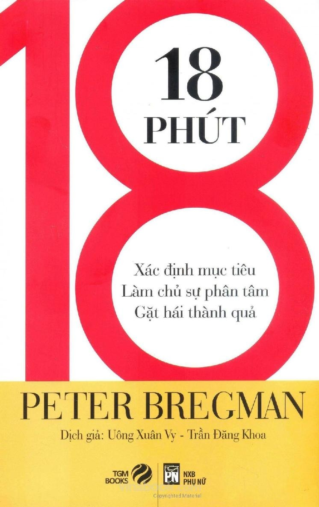

# 18 PHÚT: XÁC ĐỊNH MỤC TIÊU, LÀM CHỦ SỰ PHÂN TÂM VÀ GẶT HÁI THÀNH QUẢ

- **Tác giả:** Peter Bregman
- **Tên gốc:** 18 Minutes: Find Your Focus, Master Distraction, and Get the Right Things Done
- **Dịch giả:** Uông Xuân Vy, Trần Đăng Khoa
- **Nhà xuất bản:** NXB Phụ Nữ & TGM Books

---

---

## Lời Đề Tặng

> *Tặng em, Eleanor, và các con Isabelle, Sophia, Daniel.*  
> *Cả nhà đã truyền cảm hứng cho anh viết quyển sách này.*

---

## Giới Thiệu Tác Phẩm

Khi Molly đến văn phòng vào ngày đầu tiên để tiếp nhận công việc trưởng phòng nghiên cứu và phát triển của một ngân hàng đầu tư có quy mô vừa, cô mở máy vi tính lên, đăng nhập bằng mật khẩu công ty, mở hộp thư điện tử, và… há hốc mồm vì kinh ngạc.

Cô vừa nhận việc chưa đến một phút mà hộp thư của cô đã có đến 385 thư cần đọc. Phải mất nhiều ngày cô mới có thể xem xong những thông tin này. Khi đó ắt hẳn cô sẽ có thêm hàng trăm thư mới nữa.

Hãy nghĩ về cuộc chiến mỗi ngày của bạn với hàng đống trách nhiệm và nghĩa vụ. Đã bao giờ bạn cảm thấy kiệt sức khi mặt trời vừa tắt nắng và nhận ra mình chưa làm việc gì xong cả?

**18 PHÚT: Xác định mục tiêu, làm chủ sự phân tâm và gặt hái thành quả**

Dựa trên những bài viết nổi tiếng của chính tác giả cho tạp chí Harvard Business Review, quyển sách **18 PHÚT** nhẹ nhàng cho độc giả thấy cách vượt qua sự phân tâm thường nhật để tập trung vào những mục tiêu chủ chốt và ưu tiên hàng đầu trong cuộc sống.

Bregman đưa ra lập luận rằng cách tốt nhất để chống lại sự phân tâm không hữu ích là tạo ra những sự phân tâm hữu ích. Thông qua những chương sách ngắn gọn, dễ đọc dễ hiểu và lối kể chuyện hấp dẫn, thuyết phục, tác giả cho chúng ta thấy cách đi xuyên qua những email, tin nhắn, điện thoại và những cuộc họp dài vô tận để tập trung thời gian và năng lượng vào những gì chúng ta thật sự quan tâm.

### Về Tác Giả

**Peter Bregman** viết bài cho các tạp chí *Harvard Business Review*, *Fast Company* và *Forbes*. Ông cung cấp những bài bình luận cho đài CNN, là khách mời thường xuyên trên đài ra-đi-ô, và đi khắp thế giới để diễn thuyết về cách sống, làm việc và lãnh đạo hiệu quả. Là CEO của công ty Bregman Partners, ông có cơ hội làm việc với nhiều quản lý cấp cao đến từ những doanh nghiệp lớn xếp hạng trong Fortune 500 lẫn các công ty mới khởi nghiệp và những tổ chức phi lợi nhuận. Ông sống ở thành phố New York và có thể liên hệ thông qua trang web www.PeterBregman.com.

---

## Mục Lục Chi Tiết

- [Lời Giới Thiệu](01_loi_gioi_thieu.md)

### Phần I: Tạm Dừng
- [Phần I: Tạm Dừng – Bay lượn trên thế giới của bạn](phan_01_tam_dung.md)
- [Chương 1: Chuyển Động Chậm Lại](chuong_01_chuyen_dong_cham_lai.md)
- [Chương 2: Cô Bé Khiến Người Cá Sấu Dừng Lại](chuong_02_co_be_khien_nguoi_ca_sau_dung_lai.md)
- [Chương 3: Ngày Andy Rời Sở Làm Sớm](chuong_03_ngay_andy_roi_so_lam_som.md)
- [Chương 4: Lạnh Cóng Giữa Mùa Xuân](chuong_04_lanh_cong_giua_mua_xuan.md)
- [Chương 5: Đa Tính Cách Không Phải Là Một Chứng Rối Loạn](chuong_05_da_tinh_cach_khong_phai_la_mot_chung_roi_loan.md)
- [Chương 6: Tại Sao Chúng Ta Thích Susan Boyle](chuong_06_tai_sao_chung_ta_thich_susan_boyle.md)
- [Chương 7: Bạn Không Cần Phải Thích Anh Ta](chuong_07_ban_khong_can_phai_thich_anh_ta.md)

### Phần II: Làm Gì Trong Năm Nay?
- [Phần II: Làm Gì Trong Năm Nay? – Xác định mục tiêu](phan_02_lam_gi_trong_nam_nay.md)
- [Chương 8: Làm Gì Khi Bạn Không Biết Phải Làm Gì](chuong_08_lam_gi_khi_ban_khong_biet_phai_lam_gi.md)
- [Chương 9: Tái Lập Trò Chơi](chuong_09_tai_lap_tro_choi.md)
- [Chương 10: Tôi Sẽ Lấy Con Tôm](chuong_10_toi_se_lay_con_tom.md)
- [Chương 11: Những Chỗ Ngồi Ấm Áp](chuong_11_nhung_cho_ngoi_am_ap.md)
- [Chương 12: Vị Cơ Trưởng Cứu Mạng 155 Hành Khách](chuong_12_vi_co_truong_cuu_mang_155_hanh_khach.md)
- [Chương 13: Ai Cũng Có Thể Học Cách Trồng Cây Chuối](chuong_13_ai_cung_co_the_hoc_cach_trong_cay_chuoi.md)
- [Chương 14: Công Thức Để Tìm Thấy Công Việc Thích Hợp](chuong_14_cong_thuc_de_tim_thay_cong_viec_thich_hop.md)
- [Chương 15: Điều Gì Quan Trọng Đối Với Bạn?](chuong_15_dieu_gi_quan_trong_doi_voi_ban.md)
- [Chương 16: Tôi Là Bậc Cha Mẹ Mà Tôi Buộc Phải Trở Thành](chuong_16_toi_la_bac_cha_me_ma_toi_buoc_phai_tro_thanh.md)
- [Chương 17: Tôi Đã Hụt Hơn Chín Ngàn Lượt](chuong_17_toi_da_hut_hon_chin_ngan_luot.md)
- [Chương 18: Khi Tương Lai Không Rõ Ràng](chuong_18_khi_tuong_lai_khong_ro_rang.md)
- [Chương 19: Có Thể Vậy](chuong_19_co_the_vay.md)
- [Chương 20: Làm Gì Trong Năm Nay?](chuong_20_lam_gi_trong_nam_nay.md)

### Phần III: Làm Gì Trong Hôm Nay?
- [Phần III: Làm Gì Trong Hôm Nay? – Hoàn thành đúng việc](phan_03_lam_gi_trong_hom_nay.md)
- [Chương 21: Này Anh Bạn, Đã Xảy Ra Chuyện Gì?](chuong_21_nay_anh_ban_da_xay_ra_chuyen_gi.md)
- [Chương 22: Từng Chú Chim Một](chuong_22_tung_chu_chim_mot.md)
- [Chương 23: Đến Nhầm Tầng](chuong_23_den_nham_tang.md)
- [Chương 24: Ngày Mai Là Khi Nào?](chuong_24_ngay_mai_la_khi_nao.md)
- [Chương 25: Quy Luật 3 Ngày](chuong_25_quy_luat_3_ngay.md)
- [Chương 26: Bạn Là Ai?](chuong_26_ban_la_ai.md)
- [Chương 27: Bạn Sẽ Ngạc Nhiên Về Những Gì Bạn Phát Hiện Một Khi Bạn Chú Ý Đến](chuong_27_ban_se_ngac_nhien_ve_nhung_gi_ban_phat_hien_mot_khi_ban_chu_y_den.md)
- [Chương 28: 18 Phút Để Quản Lý Một Ngày Của Bạn](chuong_28_18_phut_de_quan_ly_mot_ngay_cua_ban.md)

### Phần IV: Làm Gì Trong Thời Điểm Này?
- [Phần IV: Làm Gì Trong Thời Điểm Này? – Làm chủ sự phân tâm](phan_04_lam_gi_trong_thoi_diem_nay.md)
- [Chương 29: Di Chuyển Cái Bàn](chuong_29_di_chuyen_cai_ban.md)
- [Chương 30: Đừng Bao Giờ Từ Bỏ Việc Ăn Kiêng Khi Đang Đọc Thực Đơn Tráng Miệng](chuong_30_dung_bao_gio_tu_bo_viec_an_kieng_khi_dang_doc_thuc_don_trang_mieng.md)
- [Chương 31: Giải Pháp Nintendo Wii](chuong_31_giai_phap_nintendo_wii.md)
- [Chương 31 (tiếp): Cú Đấm Kết Hợp](chuong_31_cu_dam_ket_hop.md)
- [Chương 32: Tôi Là Kiểu Người…](chuong_32_toi_la_kieu_nguoi.md)
- [Chương 33: Ong bắp cày đốt sưng tâm trí tôi](chuong_33_ong_bap_cay_dot_sung_tam_tri_toi.md)
- [Chương 34: Mối Quan Hệ Hợp Tác Mất Thời Gian](chuong_34_moi_quan_he_hop_tac_mat_thoi_gian.md)
- [Chương 35: Nhưng Bố Ơi…](chuong_35_nhung_bo_oi.md)
- [Chương 36: Lần Thứ Ba](chuong_36_lan_thu_ba.md)
- [Chương 37: Chúng Ta Vẫn Chưa Muộn](chuong_37_chung_ta_van_chua_muon.md)
- [Chương 38: Con Không Muốn Đến Lớp Học Trượt Tuyết](chuong_38_con_khong_muon_den_lop_hoc_truot_tuyet.md)
- [Chương 39: Chúng Tôi Sẽ Bê Trễ. Chúng Tôi Sẽ Quên Anh. Chúng Tôi Sẽ Thay Thế Anh.](chuong_39_chung_toi_se_be_tre_chung_toi_se_quen_anh_chung_toi_se_thay_the_anh.md)
- [Chương 41: Obama Có Đeo Dây Chuyền Ngọc Trai Không?](chuong_41_obama_co_deo_day_chuyen_ngoc_trai_khong.md)
- [Chương 42: Bạn Có Phê Thuốc Khi Đang Làm Việc Không?](chuong_42_ban_co_phe_thuoc_khi_dang_lam_viec_khong.md)
- [Chương 43: Vấn Đề Không Phải Là Những Kỹ Năng Ta Thật Sự Có](chuong_43_van_de_khong_phai_la_nhung_ky_nang_ta_that_su_co.md)
- [Chương 44: Vì Sao Điều Này Không Hiệu Quả Với Bạn?](chuong_44_vi_sao_dieu_nay_khong_hieu_qua_voi_ban.md)
- [Chương 45: Đừng Dùng Bóng Rổ Trong Sân Bóng Đá](chuong_45_dung_dung_bong_ro_trong_san_bong_da.md)

### Kết Luận
- [Kết Luận & Chương 46: Bạn Không Có 10 Cách Hành Xử Vàng](phan_ket_luan_chuong_46_ban_khong_co_10_cach_hanh_xu_vang.md)

### Lời Cảm Ơn
- [Lời Cảm Ơn](loi_cam_on.md)
