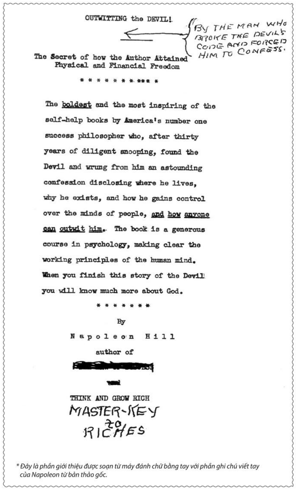
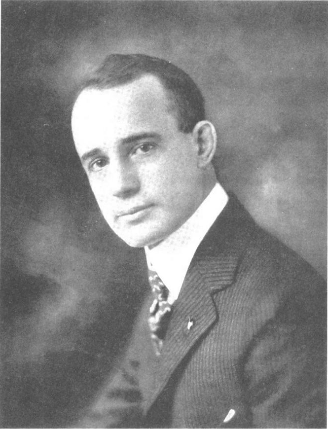

# CHIẾN THẮNG CON QUỶ TRONG BẠN
## Bí quyết tự do và thành công

**NHÀ XUẤT BẢN LAO ĐỘNG - XÃ HỘI**  
**NAPOLEON HILL**  
*TÁC GIẢ CỦA THINK AND GROW RICH*  
*CUỐN SÁCH VỀ THÀNH CÔNG BÁN CHẠY NHẤT MỌI THỜI ĐẠI*

---

> “**NỖI SỢ HÃI** là công cụ của quỷ dữ do con người tạo ra. **Tự tin vào chính bản thân mình** vừa là vũ khí giúp con người đánh bại quỷ dữ vừa là công cụ để con người tạo dựng nên một cuộc sống huy hoàng. Và còn nhiều hơn thế nữa. Tự tin còn là mắt xích kết nối con người với những sức mạnh không thể kiểm soát của vũ trụ - những sức mạnh đứng đằng sau những người luôn tin rằng mọi sai lầm và thất bại không là gì khác hơn ngoài những trải nghiệm tạm thời.”  
>  
> — **NAPOLEON HILL**

---

## Lời Khen Tặng Dành Cho CHIẾN THẮNG CON QUỶ TRONG BẠN

> “*Chiến thắng Con Quỷ trong bạn* một lần nữa lại chứng minh rằng thông điệp và triết lý của Napoleon Hill sẽ còn sống mãi với thời gian. Cuốn sách này ẩn chứa những nội dung sâu sắc về việc làm thế nào để thoát khỏi những thói quen và thái độ ngáng trở con đường đến với thành công, hạnh phúc và thịnh vượng của bạn. Nếu bạn muốn vượt qua những rào cản do chính bản thân mình tạo ra, hãy đọc cuốn sách này!”  
>  
> — **T. HARV EKER**, tác giả của cuốn sách bán chạy số một của New York Times - *Bí mật của Trí tuệ Triệu phú (Secrets of the Millionaire Mind)*

> “Có lẽ tôi là người nghiên cứu về các công trình của Napoleon Hill kỹ càng nhất trong số những người còn sống trên thế giới này. Đã 50 năm trôi qua kể từ ngày tôi cầm cuốn sách *Think and Grow Rich - 13 nguyên tắc nghĩ giàu, làm giàu* lên. Tôi luôn mang nó bên mình và đọc nó mỗi ngày. Khi Sharon Lechter gửi cho tôi một bản của cuốn sách *Chiến thắng Con Quỷ trong bạn*, tôi nghĩ Napoleon Hill lại làm được điều đó thêm một lần nữa - đây lại là một tác phẩm làm thay đổi cả thế giới.”  
>  
> — **BOB PROCTOR**, người sáng lập nên tổ chức Thành công Cuộc đời - [www.bobproctor.com](http://www.bobproctor.com)

> “Phần lớn mọi người đạt được những thành công vĩ đại ngay sau khi vượt qua những thất bại có vẻ như là thảm hại nhất của họ. Nếu cuốn sách *Think and Grow Rich - 13 nguyên tắc nghĩ giàu, làm giàu* là tấm bản đồ giúp bạn tìm đến thành công thì *Chiến thắng Con Quỷ trong bạn* sẽ giúp bạn vượt qua những rào cản ngăn bạn đến với thành công.”  
>  
> — **BRIAN TRACY**, tác giả cuốn sách *Đường đến thịnh vượng (The Way of Wealth)*

---

# NAPOLEON HILL
# CHIẾN THẮNG CON QUỶ TRONG BẠN
### Bí quyết đến với tự do và thành công
*Thanh Minh dịch*

  
**NHÀ XUẤT BẢN LAO ĐỘNG - XÃ HỘI**

---

## BẢN THẢO GỐC 1938 VÀ LỜI GIỚI THIỆU TỰ ĐÁNH MÁY

*\* Đây là phần giới thiệu được soạn từ máy đánh chữ bằng tay với phần ghi chú viết tay của Napoleon từ bản thảo gốc.*

> **OUTWITTING the DEVIL!**  
> **The Secret of how the Author Attained Physical and Financial Freedom**  
>  
> **BY THE MAN WHO BROKE THE DEVIL'S CODE AND FORCED HIM TO CONFESS.**  
> \*\*\*\*\*\*\*\*  
> The boldest and the most inspiring of the self-help books by America's number one success philosopher who, after thirty years of diligent snooping, found the Devil and wrung from him an astounding confession disclosing where he lives, why he exists, and how he gains control over the minds of people, and how anyone can outwit him. The book is a generous course in psychology, making clear the working principles of the human mind. When you finish this story of the Devil you will know much more about God.  
> \*\*\*\*\*\*\*\*  
> **By Napoleon Hill**  
> author of THINK AND GROW RICH, MASTER-KEY TO RICHES

### Dịch nghĩa:
> **CHIẾN THẮNG CON QUỶ TRONG BẠN!**  
> **(TÁC GIẢ ĐÃ GIẢI MÃ HÀNH VI CỦA CON QUỶ VÀ BẮT NÓ PHẢI THÚ TỘI)**  
> **Bí quyết giúp tác giả đạt được tự do vật chất và tài chính**  
> \*\*\*\*\*\*\*\*\*\*\*  
> Đây là cuốn sách táo bạo và truyền cảm hứng nhất trong những cuốn sách dạy về phát triển bản thân, tác giả của cuốn sách là nhà triết học về thành công hàng đầu của Mỹ. Sau 30 năm cần mẫn tìm tòi, ông đã tìm ra Con Quỷ, bắt nó phải thú tội và tiết lộ những sự thật kinh hoàng về nơi nó sống, tại sao nó lại tồn tại, cách nó kiểm soát tâm trí con người và làm sao để chiến thắng được nó. Cuốn sách là một khóa học tâm lý phong phú, làm rõ những nguyên tắc hoạt động của tâm trí con người. Khi đọc xong câu chuyện về Con Quỷ, bạn sẽ hiểu rõ hơn về Chúa.  
> \*\*\*\*\*\*\*\*\*  
> **Napoleon Hill**  
> *Tác giả của THINK AND GROW RICH - 13 NGUYÊN TẮC NGHĨ GIÀU, LÀM GIÀU*  
> *BÍ QUYẾT DẪN ĐẾN SỰ GIÀU CÓ*

---

  
*Chân dung của Napoleon Hill thời trẻ*

---

## MỤC LỤC

* **[Lời ngỏ](00_loi_ngo.md)** | 11
* **[Lời tựa](00_loi_tua.md)** | 15
* **[Chương Một: CUỘC GẶP GỠ ĐẦU TIÊN VỚI ANDREW CARNEGIE](01_chuong_mot_cuoc_gap_go_dau_tien_voi_andrew_carnegie.md)** | 17
  * Bắt đầu một cuộc đời mới | 22
  * Chuyển bại thành thắng | 28
  * Nghi ngờ | 29
  * Sự tình cờ (?) cứu sống cuộc đời tôi | 33
  * Giây phút tuyệt vời nhất cuộc đời tôi | 36
  * “Cái tôi khác” bắt đầu ra lệnh | 41
  * Tôi nhận được “các mệnh lệnh” lạ lùng từ một nguồn lạ lùng | 43
* **[Chương Hai: MỘT THẾ GIỚI MỚI MỞ RA TRƯỚC MẮT TÔI](02_chuong_hai_mot_the_gioi_moi_mo_ra_truoc_mat_toi.md)** | 45
  * Sau giờ khắc đen tối nhất, bình minh sẽ đến | 48
  * “Cái tôi khác” bù đắp cho tôi | 50
  * Trong cái rủi có cái may | 53
  * Với tôi, niềm tin bắt đầu có ý nghĩa mới | 55
  * Giá trị của việc Cho đi trước khi Nhận lại | 57
  * Cách cầu nguyện mới | 59
  * Một vài dấu hiệu chúng ta thường bỏ sót | 60
  * Niềm tin là điểm khởi đầu của mọi thành công vĩ đại nhất | 62
* **[Chương Ba: CUỘC PHỎNG VẤN KỲ LẠ VỚI CON QUỶ](03_chuong_ba_cuoc_phong_van_ky_la_voi_con_quy.md)** | 63
  * Một phép phân tích | 68
  * Bắt đầu từ đây sẽ là Cuộc phỏng vấn với Con Quỷ | 71
* **[Chương Bốn: BUÔNG THẢ CÙNG CON QUỶ](04_chuong_bon_buong_tha_cung_con_quy.md)** | 83
* **[Chương Năm: CON QUỶ TIẾP TỤC THÚ TỘI](05_chuong_nam_con_quy_tiep_tuc_thu_toi.md)** | 111
* **[Chương Sáu: NHỊP ĐIỆU THÔI MIÊN](06_chuong_sau_nhip_dieu_thoi_mien.md)** | 135
* **[Chương Bảy: MẦM MỐNG CỦA NỖI SỢ HÃI](07_chuong_bay_mam_mong_cua_noi_so_hai.md)** | 155
* **[Chương Tám: MỤC TIÊU XÁC ĐỊNH](08_chuong_tam_muc_tieu_xac_dinh.md)** | 163
* **[Chương Chín: GIÁO DỤC VÀ TÔN GIÁO](09_chuong_chin_giao_duc_va_ton_giao.md)** | 175
* **Chương Mười: KỶ LUẬT TỰ GIÁC** | 203
* **Chương Mười Một: HỌC TỪ NGHỊCH CẢNH** | 219
* **Chương Mười Hai: MÔI TRƯỜNG, THỜI GIAN, SỰ HÒA HỢP VÀ CẨN TRỌNG** | 239
* **Tổng kết** | 264
* **Lời bạt** | 274
* **Suy ngẫm** | 278
* **Lời cảm ơn** | 282
