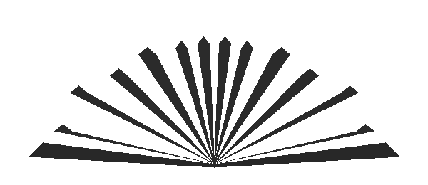

# Chương Bốn
# BUÔNG THẢ CÙNG CON QUỶ

**H:** TRƯỚC HẾT HÃY NÓI CHO TA BIẾT VỀ MƯU KẾ XẢO QUYỆT NHẤT CỦA NGƯƠI ĐI - thứ mưu kế ngươi đã dùng để gài bẫy không biết bao nhiêu người ấy.

**Đ:** Nếu ngươi bắt ta tiết lộ bí mật này, ta sẽ đánh mất đến hàng triệu người đang sống và thậm chí cả hàng triệu triệu người chưa được sinh ra nữa. Ta xin ngươi, cho phép ta không trả lời câu hỏi này.

**H:** Vậy là Vua Quỷ lại đi sợ một con người bình thường! Có đúng thế không?

**Đ:** Không phải đúng hay sai mà đó là sự thật. Ngươi không có quyền cướp đi cần câu cơm của ta. Ta đã thống trị con người hàng triệu năm bằng nỗi sợ hãi và ngu dốt. Giờ ngươi lại đến đây và hủy hoại việc ta sử dụng các vũ khí của mình bằng cách bắt ta nói ra ta đã sử dụng chúng như thế nào. Ngươi không nhận ra rằng ngươi sẽ phá vỡ gọng kìm ta đang siết chặt ở tất cả những người có chú ý đến sự thú tội mà ngươi đang ép ta phải thực hiện? Ngươi không có lòng tốt hay sao? Ngươi không có khiếu hài hước à? Ngươi không có tinh thần thượng võ ư?

**H:** Đừng có né tránh nữa mà hãy bắt đầu thú tội đi. Ngươi là ai mà dám cầu xin lòng tốt từ một người ngươi sẵn sàng hủy hoại nếu ngươi có thể? Ngươi là ai mà dám nói đến tinh thần thượng võ và khiếu hài hước? Ngươi - theo chính lời thú tội của mình - là kẻ đã gieo rắc cuộc sống như dưới địa ngục cho những con người vô tội bởi những nỗi sợ hãi và ngu dốt của họ. Còn công việc của ta là những gì ta đang làm - bắt ngươi khai ra quá trình ngươi kiểm soát tâm trí con người như thế nào. Công việc của ta - nếu có thể gọi nó là công việc - là giúp mọi người mở những cánh cửa trong những nhà tù do chính họ tạo ra bởi những nỗi sợ hãi ngươi đã gieo rắc vào tâm trí họ.

---

> Ngài Con Người có đủ quyền lực để bắt Con Quỷ phải trả lời những câu hỏi của mình. Tư duy độc lập và không biết sợ hãi là những vũ khí giúp ông bắt nó phải thú tội.

---

**Đ:** Vũ khí lợi hại nhất giúp ta chống lại con người bao gồm hai nguyên tắc bí mật mà qua đó, ta có thể kiểm soát được tâm trí của họ. Trước tiên, ta sẽ nói về nguyên tắc thói quen, nguyên tắc này giúp ta thâm nhập vào tâm trí con người trong thầm lặng. Khi thực hiện nguyên tắc này, ta sẽ thiết lập nên (ta ước gì mình có thể tránh dùng cách nói này) **thói quen buông thả**. Khi một người bắt đầu thể hiện thái độ buông thả với một vấn đề nào đó, anh ta đang tiến thẳng tới cánh cửa mà loài người các ngươi vẫn gọi là địa ngục.

**H:** Hãy miêu tả mọi cách thức ngươi sử dụng để xui khiến con người buông thả. Hãy đưa ra định nghĩa chính xác về từ đó và nói với ta chính xác ngươi nói thế là có ý gì.

**Đ:** Ta có thể định nghĩa chính xác nhất về từ “buông thả” bằng cách nói rằng những người biết suy nghĩ cho bản thân mình sẽ không bao giờ buông thả, còn những người chỉ biết suy nghĩ một chút hoặc hoàn toàn không suy nghĩ gì cho bản thân mình là những người dễ dàng buông thả nhất. Họ cho phép bản thân mình bị ảnh hưởng và kiểm soát bởi những hoàn cảnh bên ngoài tâm trí họ. Họ thà để ta chiếm đoạt tâm trí và lừa gạt suy nghĩ của mình còn hơn vướng vào rắc rối phải suy nghĩ cho bản thân mình. Họ chấp nhận bất cứ thứ gì cuộc đời ném vào cuộc sống của họ mà không hề phản kháng hay đấu tranh. Họ không hề biết mình muốn sống cuộc đời như thế nào và họ mất cả đời để làm chuyện đó. Họ có rất nhiều quan điểm nhưng đó không phải là quan điểm của riêng họ. Phần lớn những quan điểm đó là do ta mang đến cho họ.

Họ là những kẻ lười suy nghĩ, không chịu dùng bộ não của mình. Đó là lý do tại sao ta có thể kiểm soát suy nghĩ và gieo vào tâm trí họ những tư tưởng của riêng ta.

---

> **“Những người chỉ biết suy nghĩ một chút hoặc hoàn toàn không suy nghĩ gì cho bản thân mình là những người dễ dàng buông thả nhất. Họ cho phép bản thân mình bị ảnh hưởng và kiểm soát bởi những hoàn cảnh bên ngoài tâm trí họ.”**

---

**H:** Ta nghĩ là ta đã hiểu về những người chỉ biết buông thả này. Hãy nói cho ta biết chính xác về thói quen của những người mà ngươi có thể khiến họ buông thả cả cuộc sống của mình đi. Hãy bắt đầu bằng cách nói cho ta biết ngươi kiểm soát tâm trí con người vào thời điểm nào và ra làm sao?

**Đ:** Ta kiểm soát tâm trí con người khi người đó còn trẻ. Đôi khi ta đặt nền móng cho việc kiểm soát tâm trí của một người từ khi người đó chưa ra đời bằng cách điều khiển tâm trí của cha mẹ họ. Đôi khi ta còn lùi xa hơn và chuẩn bị cho việc kiểm soát của ta bằng thứ mà con người các ngươi vẫn gọi là “di truyền tự nhiên”. Do đó, ngươi thấy đấy, ta có hai cách tiếp cận với tâm trí con người.

**H:** Được rồi, hãy tiếp tục và miêu tả về hai cánh cửa giúp ngươi thâm nhập và kiểm soát tâm trí con người đi.

**Đ:** Như ta đã nói, ta giúp những người với não bộ yếu ớt đến với thế giới của các ngươi bằng cách trao cho họ - từ trước khi họ ra đời - nhiều khiếm khuyết nhất trong giới hạn có thể từ tổ tiên họ. Ngươi có thể gọi nguyên tắc này là “di truyền tự nhiên”. Khi con người được sinh ra, ta lợi dụng cái mà các ngươi gọi là “môi trường sống” như một phương tiện để kiểm soát con người. Đây là nơi mà nguyên tắc thói quen sẽ bắt đầu xâm nhập. Tâm trí của mỗi người chính là sự tổng hợp tất cả mọi thói quen của người đó. Từng bước một, ta thâm nhập vào tâm trí và thiết lập nên các thói quen và cuối cùng, chúng sẽ giúp ta hoàn toàn thống trị tâm trí của một người.

**H:** Hãy nói cho ta biết về những thói quen phổ biến nhất giúp ngươi kiểm soát tâm trí con người đi.

**Đ:** Đây chính là một trong những trò lợi hại nhất của ta: Ta thâm nhập vào tâm trí của con người qua những suy nghĩ mà họ tưởng rằng đó là những suy nghĩ của mình. Những thứ hữu ích nhất cho ta là **nỗi sợ hãi, mê tín, tính hám lợi, tham lam, thói dâm ô, sự trả thù, cơn giận dữ, sự phù phiếm và tính lười nhác**. Qua một hoặc nhiều hơn những đặc tính này, ta có thể thâm nhập vào bất cứ tâm trí nào, ở bất cứ độ tuổi nào, nhưng ta sẽ thu được những kết quả tốt nhất khi kiểm soát được một tâm trí còn trẻ, trước khi người chủ sở hữu nó học được cách đóng bất cứ cánh cửa nào trong chín cánh cửa này lại. Sau đó ta có thể thiết lập nên những thói quen giữ những cánh cửa này khép lại mãi mãi.

**H:** Ta đã hiểu những biện pháp của ngươi rồi. Giờ chúng ta hãy quay lại thói quen buông thả. Hãy nói cho ta biết tất cả về thói quen này vì ngươi đã nói rằng đó là trò lợi hại nhất giúp ngươi kiểm soát tâm trí con người.

**Đ:** Như ta đã nói từ trước, ta bắt đầu khiến con người buông thả từ khi họ còn trẻ. Ta xui khiến họ buông thả từ khi còn ngồi trên ghế nhà trường mà không biết nghề nghiệp mình sẽ theo đuổi trong cuộc sống là gì. Ta tóm được đa phần mọi người ở giai đoạn này. Các thói quen có mối liên hệ với nhau. Khi đã buông thả một hướng đi, chẳng mấy chốc ngươi sẽ buông thả mọi hướng đi. Ta cũng sử dụng thói quen liên quan đến môi trường sống để giúp ta tóm gọn được các nạn nhân của mình.

**H:** Ta hiểu rồi. Ngươi cố tình tập cho bọn trẻ thói quen buông thả bằng cách xui khiến chúng đến trường mà không hề có mục tiêu hay ý định nào cả. Nào, giờ thì ngươi hãy nói cho ta biết về những trò khác mà ngươi dùng để khiến con người trở nên buông thả đi.

**Đ:** Chà, trò hiệu quả thứ hai nhằm phát triển thói quen buông thả là ta thực hiện nó với sự giúp đỡ của cha mẹ, các thầy cô giáo và các nhà truyền giáo.

Ta cảnh cáo ngươi không được bắt ta nhắc đến trò này. Đừng tiết lộ nó. Nếu ngươi làm vậy, ngươi sẽ bị các đồng nghiệp của ta - những người giúp ta sử dụng trò này - ghét bỏ. Nếu ngươi xuất bản lời thú tội này dưới dạng một cuốn sách, nó sẽ bị cấm ở các trường học. Hầu hết các thủ lĩnh tôn giáo cũng sẽ liệt nó vào danh sách đen. Các bậc phụ huynh cũng sẽ không cho con cái mình đọc cuốn sách đó. Báo chí cũng sẽ không dám đưa ra nhận xét về cuốn sách của ngươi. Sẽ có hàng triệu người ghét ngươi vì cuốn sách đó.

Trên thực tế, sẽ không ai thích ngươi hoặc cuốn sách của ngươi, trừ những người biết tư duy, mà ngươi biết những người như thế ít ỏi như thế nào rồi đấy. Ta khuyên ngươi hãy bỏ qua những gì ta miêu tả về trò hiệu quả thứ hai này.

---

> Tác giả biết rằng quan điểm này sẽ là một trong những điểm gây tranh cãi nhất trong cuốn sách của mình. Trên thực tế, vợ ông đã lo lắng về chuyện công chúng sẽ tiếp nhận quan điểm đó như thế nào đến mức bà bắt ông phải hứa rằng ông sẽ không xuất bản nó. Thực tế là, chỉ đến bây giờ, sau khi bà qua đời, gia đình Napoleon Hill mới đồng ý chia sẻ nó với cả thế giới. Tôi khuyến khích các bạn nên theo dõi những bất đồng của Napoleon Hill về hệ thống giáo dục và các nhà truyền giáo rồi sau đó bạn hãy tự đưa ra ý kiến của riêng mình.

---

**H:** Vậy là vì lợi ích của ta mà ngươi không muốn nói về trò lợi hại thứ hai của mình. Sẽ không có ai thích cuốn sách của ta trừ những người biết tư duy, đúng không? Tốt thôi, hãy cứ tiếp tục trả lời đi.

**Đ:** Ngươi sẽ hối hận về chuyện này, Ngài Con Người ạ, nhưng trò đùa này lại nhắm vào ngươi. Với sai lầm này, ngươi sẽ chuyển sự chú ý từ ta sang ngươi. Hàng triệu đồng nghiệp của ta sẽ quên mất ta và căm ghét ngươi bởi ngươi đã phơi bày các biện pháp của ta.

**H:** Đừng bận tâm về ta. Hãy nói cho ta biết tất cả về trò lợi hại thứ hai giúp ngươi xui khiến mọi người buông thả cùng ngươi cho tới khi xuống địa ngục đi.

**Đ:** Thật ra đó không hẳn là trò lợi hại thứ hai của ta. Nó là trò lợi hại nhất! Nó xếp hạng nhất bởi nếu không có nó, ta sẽ không bao giờ kiểm soát được tâm trí của những người trẻ tuổi. Các bậc phụ huynh, các giáo viên, các nhà truyền giáo và rất nhiều những người lớn khác đã không hề biết rằng họ đã phục vụ cho mục đích của ta bằng cách giúp ta hủy hoại thói quen biết suy nghĩ cho bản thân mình của bọn trẻ. Họ thực hiện công việc của mình theo rất nhiều cách khác nhau và không bao giờ ngờ được rằng họ đang tác động đến tâm trí của bọn trẻ hoặc nguyên nhân thực sự đằng sau sai lầm của bọn trẻ là gì.

---

> Bạn đã bao giờ thấy bố mẹ giúp con hoàn thiện ý kiến của mình? Hay thấy bố mẹ giúp con làm xong bài tập về nhà của chúng? Bạn có nhớ rằng những kiến thức đó được chắp ghép tại trường học - nơi bọn trẻ rõ ràng nhận được rất nhiều sự “giúp đỡ” bên ngoài với những việc chúng làm? Bố và Mẹ có thể đã “giúp” chúng hơi nhiều một chút, nhưng từ trong sâu thẳm, họ biết rằng đứa trẻ sẽ đánh giá cao sự giúp đỡ đó và công nhận rằng họ đúng là những ông bố, bà mẹ tuyệt vời. Điều đó có đúng không? Thật ra, có thể đứa trẻ sẽ nghĩ rằng “Bố và Mẹ không tin rằng mình có thể tự làm được chuyện đó... vậy thì sao mình phải bận tâm!” Cuối cùng thì sự giúp đỡ từ phía cha mẹ sẽ hủy hoại sự tự tin của đứa trẻ. Bằng cách cho phép con cái thực sự chịu trách nhiệm, các bậc phụ huynh sẽ giúp những đứa trẻ của họ phát triển thói quen suy nghĩ cho chính bản thân mình!

---

**H:** Ta khó lòng mà tin được ngươi, tâu Bệ hạ. Ta luôn tin rằng những người bạn tốt nhất của bọn trẻ chính là những người gần gũi chúng nhất: cha mẹ, thầy cô giáo và cả các nhà truyền giáo nữa. Ai sẽ hướng dẫn bọn trẻ nếu không phải là những người chịu trách nhiệm về chúng?

**Đ:** Đó là lúc trí thông minh của ta xuất hiện. Đó là lời giải thích chính xác cách ta kiểm soát 98% con người trên thế giới này như thế nào. Ta chiếm đoạt con người khi họ còn trẻ, trước khi họ tự làm chủ được tâm trí của mình bằng cách lợi dụng những người chịu trách nhiệm về họ. Ta đặc biệt cần đến sự giúp đỡ của những người giảng dạy giáo lý cho bọn trẻ vì đây chính là lúc ta phá vỡ những tư duy độc lập và bắt đầu kéo con người vào thói quen buông thả bằng cách khiến tâm trí họ hoang mang về những tư tưởng không thể chứng minh được liên quan đến một thế giới mà họ chẳng biết gì về nó cả. Đây cũng chính là lúc ta gieo vào tâm trí bọn trẻ nỗi sợ hãi lớn nhất trong mọi nỗi sợ hãi - **nỗi sợ hãi phải xuống địa ngục**.

**H:** Ta hiểu rằng ngươi có thể dễ dàng làm bọn trẻ sợ hãi với mối đe dọa về địa ngục, nhưng ngươi làm thế nào để tiếp tục khiến chúng sợ hãi sau khi chúng lớn lên và học được cách suy nghĩ cho bản thân mình?

**Đ:** Bọn trẻ lớn lên, nhưng không phải lúc nào chúng cũng biết suy nghĩ cho bản thân mình! Một khi đã chiếm được tâm trí của một đứa trẻ, thông qua nỗi sợ hãi, ta làm suy yếu khả năng suy luận và suy nghĩ cho bản thân mình của đứa trẻ đó và điểm yếu này sẽ đồng hành cùng nó trong suốt cuộc đời mình.

**H:** Đó chẳng phải là ngươi đang lợi dụng con người một cách bỉ ổi bằng việc phá hỏng tâm trí của một người trước khi người đó hoàn toàn sở hữu nó ư?

**Đ:** Mọi thứ ta có thể sử dụng để đến gần mục tiêu của mình hơn đều đúng đắn hết. Ta chẳng có bất cứ giới hạn ngu ngốc nào về đúng hay sai cả. Lẽ phải luôn thuộc về ta. Ta lợi dụng mọi điểm yếu của con người mà ta biết được để kiểm soát và duy trì sự kiểm soát đó với tâm trí con người.

**H:** Ta hiểu bản chất quỷ dữ của ngươi. Giờ chúng ta hãy quay lại và thảo luận nhiều hơn về các phương pháp kéo con người buông thả mình đến địa ngục ở ngay trên Trái đất này của ngươi. Từ lời thú tội của ngươi, ta thấy ngươi đã chiếm đoạt bọn trẻ khi tâm trí chúng còn non yếu và dễ bị ảnh hưởng. Hãy nói cho ta biết nhiều hơn về cách ngươi đã sử dụng cha mẹ, thầy cô và các thủ lĩnh tôn giáo để kéo con người vào cái bẫy buông thả đó.

**Đ:** Một trong những trò ưa thích của ta là sắp đặt những nỗ lực của cha mẹ và các nhà truyền giáo để chúng cùng phối hợp với nhau và giúp ta hủy hoại khả năng suy nghĩ cho chính bản thân mình của bọn trẻ. Ta đã lợi dụng rất nhiều các nhà truyền giáo để làm suy yếu dần lòng can đảm và quyền năng của những tư duy độc lập trong bọn trẻ bằng cách dạy chúng phải sợ ta và ta lại lợi dụng cha mẹ chúng giúp các thủ lĩnh tôn giáo trong công trình vĩ đại này.

**H:** Làm sao mà cha mẹ lại giúp các thủ lĩnh tôn giáo hủy hoại khả năng biết suy nghĩ cho chính mình của bọn trẻ được? Ta chưa từng biết điều gì quái dị như vậy cả.

**Đ:** Ta làm được điều đó bằng một trò rất thông minh. Ta khiến các bậc phụ huynh dạy bọn trẻ tin tưởng vào những thứ mà chính họ cũng tin tưởng trong những vấn đề liên quan đến tôn giáo, chính trị, hôn nhân và những vấn đề quan trọng khác nữa. Theo cách này, như ngươi thấy, khi kiểm soát được tâm trí của một người, ta có thể dễ dàng duy trì sự kiểm soát đó bằng cách khiến người đó giúp ta buộc chặt nó vào tâm trí của con cái họ.

**H:** Ngươi còn những mưu kế nào nữa khi sử dụng cha mẹ để biến bọn trẻ thành những kẻ chỉ biết buông thả?

**Đ:** Ta khiến bọn trẻ trở thành những kẻ sống buông thả bằng cách để chúng noi theo cha mẹ mình, mà phần lớn trong đó đã bị ta kiểm soát và mãi mãi dính chặt vào mục đích của ta. Ở một vài nơi trên thế giới, ta làm chủ tâm trí của bọn trẻ và khuất phục sức mạnh ý chí của chúng y hệt như cách con người đánh bại và khuất phục các loài động vật kém thông minh hơn họ vậy. Với ta, chẳng có gì khác biệt trong khuất phục ý chí của một đứa trẻ, miễn là nó vẫn sợ điều gì đó. Ta sẽ thâm nhập vào tâm trí nó qua nỗi sợ hãi đó và giới hạn khả năng tư duy độc lập của đứa trẻ đó.

---

> Con Quỷ thâm nhập vào tâm trí của một đứa trẻ thông qua nỗi sợ hãi và sau đó giới hạn năng lực tư duy độc lập của nó. Tôi có thể nhớ rất nhiều các nhà truyền giáo mà tôi biết trong quá khứ và có thể ngay lập tức chia họ thành hai nhóm: các nhà truyền giáo lấy nỗi sợ hãi làm căn bản và các nhà truyền giáo lấy niềm tin làm căn bản. Trên thực tế, tôi vẫn cảm thấy ớn lạnh mỗi khi hồi tưởng lại “ngọn lửa trừng phạt dưới địa ngục” của một số bài thuyết giáo lấy nỗi sợ hãi làm căn bản tôi từng nghe khi còn là một đứa trẻ. Ngược lại, tôi cũng nhớ cảm giác thăng hoa của hy vọng và lòng can đảm từ những bài thuyết giáo lấy niềm tin là căn bản. Những lời khôn ngoan của Napoleon Hill thật sự rất đúng với tôi. Và liệu sau đó nỗi sợ hãi có làm tê liệt tư duy suy nghĩ độc lập hay không?

---

**H:** Có vẻ như ngươi muốn làm cho con người không còn khả năng tư duy nữa?

**Đ:** Đúng vậy. Những tư duy đúng đắn có thể giết chết ta. Ta không thể tồn tại trong tâm trí của những người biết tư duy đúng đắn. Ta không quan tâm đến việc con người suy nghĩ về điều gì, miễn sao họ chỉ nghĩ về các khía cạnh sợ hãi, bất lực, tuyệt vọng và hủy hoại. Khi họ bắt đầu nghĩ về những khía cạnh tích cực như niềm tin, hy vọng và mục tiêu xác định, ngay lập tức họ sẽ trở thành đồng minh của kẻ thù của ta và do đó, ta sẽ đánh mất họ.

**H:** Ta bắt đầu hiểu cách ngươi kiểm soát tâm trí của bọn trẻ với sự giúp đỡ của cha mẹ chúng và các nhà truyền giáo rồi, nhưng ta vẫn chưa hiểu các thầy cô giáo giúp ngươi làm công việc đáng nguyền rủa này như thế nào?

**Đ:** Các thầy cô giáo giúp ta kiểm soát tâm trí của bọn trẻ bằng những gì họ không dạy chúng chứ không phải những gì họ đã dạy chúng ở trường học. Toàn bộ hệ thống trường học công hoạt động trì trệ đến mức nó giúp ta thực hiện mục tiêu của mình bằng cách dạy bọn trẻ về hầu hết mọi thứ trừ cách tư duy độc lập và cách sử dụng trí tuệ của riêng chúng. Ta sống trong nỗi sợ hãi rằng một ngày nào đó, một ai đó thật dũng cảm sẽ đảo ngược hệ thống trường học hiện giờ và phá hủy mục tiêu của ta bằng cách cho phép các học sinh trở thành giáo viên, còn những người đang là giáo viên như hiện nay sẽ chỉ hướng dẫn bọn trẻ tạo ra các phương pháp và phương tiện phát triển trí tuệ của riêng chúng từ bên trong chính con người chúng. Khi thời điểm đó đến, các thầy cô giáo sẽ không còn là nhân viên của ta nữa.

---

> Đây là vấn đề cốt lõi trong những lời chỉ trích của Napoleon Hill về hệ thống giáo dục được viết vào năm 1938. Bạn có đồng ý với ông không? Hãy nghĩ đến những đứa trẻ còn đang học Mẫu giáo hoặc lớp Một. Chúng hăng say và tình nguyện làm mọi thứ, chúng luôn sẵn sàng giơ tay và háo hức học hỏi. Giờ thì hãy nghĩ đến mười năm sau đó và xem chính những đứa trẻ đó ở trường trung học - chúng ngồi phía cuối lớp, chẳng bao giờ liếc mắt nhìn thầy cô và chắc chắn là không bao giờ giơ tay phát biểu hay đưa ra bất cứ câu hỏi nào. Chúng đã không còn ở trong quá trình học hỏi nữa. Điều gì đã xảy ra với những đứa trẻ này sau mười năm ngồi trên ghế nhà trường? Chúng nghĩ rằng nếu mắc sai lầm, chúng sẽ bị chế nhạo và coi thường. Vậy nên chúng không tham gia vào quá trình học hỏi nữa là để bảo vệ bản thân mình. Chúng được dạy rằng giải pháp cho mọi vấn đề và xung đột không nằm trong đôi tay và khối óc của chúng, mà nằm trong đôi tay và khối óc của các thầy cô giáo - những người đại diện cho quyền lực. Nếu chúng hành động độc lập và mâu thuẫn, thầy cô sẽ ngay lập tức chỉ trích và trù dập chúng. Do đó, chúng bị ngăn cản không được tư duy độc lập và thấm nhuần quan niệm rằng chúng không có khả năng tự giải quyết vấn đề của chính mình. Dù hiện tại có rất nhiều giáo viên xuất sắc, nhưng những lời chỉ trích của Napoleon Hill dường như vẫn còn giá trị với tình hình giáo dục hiện nay. Nếu bạn đồng ý với ông, bạn sẽ làm gì để cải thiện tình trạng này? Chúng ta nên tìm kiếm các thầy cô giáo và những ngôi trường khuyến khích học sinh tư duy độc lập và tán thưởng họ vì sự dũng cảm đó.

---

**H:** Ta luôn có ấn tượng rằng mục tiêu của mọi trường lớp là giúp bọn trẻ biết tư duy.

**Đ:** Có thể đó chính là mục tiêu của tất cả các trường lớp nhưng hầu hết các trường học trên thế giới đều không thực hiện được mục tiêu đó. Bọn trẻ không được học cách phát triển và sử dụng trí tuệ của mình mà lại được học cách chấp nhận và áp dụng tư duy của những người khác. Kiểu trường học như thế này sẽ phá hủy khả năng tư duy độc lập, trừ một vài trường hợp hiếm hoi khi trẻ hoàn toàn dựa vào sức mạnh ý chí của chúng đến mức chúng không cho phép người khác tư duy hộ mình. Tư duy đúng đắn là việc của kẻ thù của ta chứ không phải của ta.

**H:** Mối liên hệ, nếu có, giữa kẻ thù của ngươi với các gia đình, nhà thờ hay trường học là gì? Chắc hẳn câu trả lời của ngươi sẽ rất thú vị đây.

**Đ:** Đây chính là lúc ta sử dụng một vài mưu mẹo thông minh nữa của mình. Ta khiến mọi người đều tưởng mọi thứ mà các bậc phụ huynh, các thầy cô giáo và các nhà truyền giáo thực hiện đều do kẻ thù của ta xui khiến.

Điều đó giúp ta tránh được sự chú ý khi ta điều khiển tâm trí của những người trẻ tuổi. Khi các nhà truyền giáo cố dạy bọn trẻ về đức hạnh của kẻ thù của ta, họ thường làm điều đó bằng cách lấy ta ra để dọa bọn trẻ. Đó là tất cả những gì ta cần ở chúng. Ta nhen nhóm ngọn lửa sợ hãi vào nơi sẽ hủy hoại khả năng tư duy đúng đắn của bọn trẻ. Tại trường học, các thầy cô giáo sẽ giúp ta đến gần mục đích của mình hơn bằng cách giữ bọn trẻ bận rộn với việc nhồi nhét những thông tin không cần thiết vào đầu chúng và chúng sẽ chẳng có cơ hội để tư duy đúng đắn hay phân tích chính xác những thứ các thầy cô giáo đã dạy mình.

**H:** Có phải ngươi đang khẳng định rằng tất cả những người đang bị vây hãm bởi thói quen buông thả đều nhằm phục vụ cho mục đích của ngươi?

**Đ:** Không, buông thả chỉ là một trong những trò ta dùng để tước đoạt sức mạnh của tư duy độc lập. Trước khi một người đã buông thả trở thành tài sản của ta vĩnh viễn, ta phải dẫn đường và khiến người đó mắc vào một cái bẫy khác. Ta sẽ nói với ngươi về nó sau khi ta miêu tả xong các biện pháp khiến con người buông thả mọi thứ.

**H:** Có phải ý ngươi là ngươi có một biện pháp có thể khiến con người trở nên buông thả xa khỏi quyền tự quyết của mình đến nỗi họ không bao giờ có thể tự cứu được bản thân mình được nữa?

**Đ:** Đúng vậy, đó là một biện pháp rất đáng tin cậy. Nó rất hiệu quả và chưa từng thất bại.

**H:** Ta hiểu rằng ngươi đang khẳng định rằng biện pháp của ngươi vô cùng hiệu quả và kẻ thù của ngươi không thể giành lại được những người mà ngươi đã gài bẫy họ trở nên buông thả vĩnh viễn, có đúng không?

**Đ:** Ta vừa khẳng định điều đó đấy. Ngươi có nghĩ rằng nếu kẻ thù của ta ngăn cản nổi ta thì ta có kiểm soát được nhiều người như vậy không? Không ai có thể ngăn ta kiểm soát mọi người, trừ chính bản thân họ.

**H:** Hãy tiếp tục và nói cho ta biết nhiều hơn về những biện pháp ngươi sử dụng để kéo con người buông thả tới địa ngục cùng với ngươi đi!

**Đ:** Ta khiến mọi người buông thả trong mọi vấn đề mà ta có thể kiểm soát được những suy nghĩ và tư duy độc lập. Hãy lấy vấn đề sức khỏe làm ví dụ. Ta khiến mọi người ăn thật nhiều thức ăn và toàn ăn những thực phẩm sai lầm. Điều này dẫn đến bệnh về tiêu hóa và nó sẽ phá hủy sức mạnh của tư duy đúng đắn. Nếu trường học và các nhà thờ dạy bọn trẻ cách ăn uống đúng, họ sẽ khiến mục tiêu của ta bị phá hủy nặng nề.

**Hôn nhân:** Ta khiến đàn ông và phụ nữ buông thả theo cuộc hôn nhân mà chẳng có bất cứ kế hoạch hay mục tiêu nào để khiến mối quan hệ đó trở nên hòa hợp. Đây là một trong những biện pháp hiệu quả nhất giúp ta khiến con người có thói quen buông thả. Ta khiến những người đã lập gia đình cãi nhau, chì chiết nhau về vấn đề tiền bạc. Ta khiến họ mâu thuẫn với nhau trong việc nuôi dạy con cái. Ta khiến họ tranh cãi kịch liệt về những mối quan hệ thân thiết và bất đồng về bạn bè và các hoạt động xã hội. Ta khiến họ luôn bận rộn tìm kiếm sai lầm ở người kia đến mức họ chẳng có thời gian làm bất cứ việc gì khác đủ lâu để phá vỡ thói quen buông thả.

**Công việc:** Ta dạy con người trở thành những kẻ buông thả bằng cách khiến họ buông thả từ khi học xong cho tới công việc đầu tiên họ tìm được mà chẳng có mục tiêu hay ý định nào rõ ràng ngoài việc để kiếm sống. Qua trò bịp này, ta đã khiến hàng triệu người cả đời luôn sợ sẽ phải sống trong cảnh nghèo đói. Thông qua nỗi sợ hãi này, ta dẫn họ đi chậm nhưng chắc cho đến khi tới ngưỡng mà không ai có thể phá vỡ nổi thói quen buông thả của mình.

**Tiết kiệm:** Ta khiến mọi người tiêu xài hoang phí hoặc dè xẻn hay không bao giờ dám tiêu tiền cho đến khi ta hoàn toàn kiểm soát được họ thông qua nỗi sợ nghèo đói.

**Môi trường:** Ta khiến mọi người buông thả những mối quan hệ không hòa hợp và khó chịu ở nhà, nơi làm việc, trong mối quan hệ với họ hàng và người quen và vẫn cứ duy trì như vậy cho đến khi ta khẳng định họ đã có thói quen buông thả.

**Những suy nghĩ chi phối:** Ta khiến mọi người buông thả theo thói quen tư duy tiêu cực. Điều đó sẽ dẫn đến những hành động tiêu cực và kéo con người vào các cuộc tranh cãi và lấp đầy tâm trí họ bằng những nỗi sợ hãi, từ đó sẽ dọn đường cho ta thâm nhập và kiểm soát tâm trí của họ. Khi đã thâm nhập vào tâm trí của họ rồi, ta chiếm đoạt tâm trí họ bằng cách lôi kéo họ nghĩ rằng những suy nghĩ tiêu cực đó là của chính họ. Ta gieo các hạt mầm suy nghĩ tiêu cực vào tâm trí con người thông qua các linh mục, báo chí, các bức tranh cảm động, các phương tiện truyền thông và tất cả các biện pháp phổ biến để lôi kéo tâm trí khác. Ta khiến mọi người để ta chi phối suy nghĩ của họ vì họ quá lười biếng và bàng quan để biết suy nghĩ cho chính bản thân mình.

**H:** Từ những gì ngươi nói thì ta có thể kết luận rằng buông thả và do dự là một, đúng không?

**Đ:** Đúng vậy. Bất cứ thói quen nào khiến một người trở nên do dự - trì hoãn đưa ra một quyết định rõ ràng - đều dẫn tới thói quen buông thả.

---

> Con Quỷ nói: “Ta khiến mọi người để ta chi phối suy nghĩ của họ vì họ quá lười biếng và bàng quan để biết suy nghĩ cho chính bản thân mình.”  
> \*\*\*\*\*\*\*\*\*\*  
> **Lười nhác + Bàng quan = Do dự = Buông thả**  
>  
> Công thức này của Napoleon Hill đã miêu tả chính xác về một người buông thả. Vì gần như suốt cuộc đời mình, tôi luôn là người hay do dự nên điều này vô cùng thân thuộc với tôi. Tôi thích sử dụng cách bao biện rằng tôi thường làm việc tốt nhất khi có áp lực - nhưng thật ra nó chỉ là lời bao biện cho lý do tại sao tôi lại luôn do dự mà thôi. Bạn có nhớ đã bao nhiêu lần bạn để sự lười biếng và bàng quan khiến bạn đi chệch khỏi con đường dẫn đến thành công hay không? Khi một cơ hội tuột khỏi tay bạn chỉ vì bạn nắm bắt nó quá chậm?

---

**H:** Có phải chỉ con người mới buông thả hay không?

**Đ:** Đúng vậy. Tất cả các sinh vật khác đều hoạt động phù hợp với các quy luật của tự nhiên. Riêng con người không tuân theo các quy luật đó và trở nên buông thả theo ý mình.

Mọi thứ bên ngoài tâm trí con người đều do kẻ thù của ta kiểm soát bằng các quy luật rõ ràng đến mức không thể trở nên buông thả được. Ta chỉ có thể kiểm soát được tâm trí con người khi họ có thói quen buông thả, nói theo cách khác có nghĩa là ta kiểm soát được tâm trí con người bởi họ không để tâm hoặc từ chối kiểm soát và sử dụng tâm trí của mình.

**H:** Vấn đề này hơi sâu sắc đối với một con người đơn thuần. Chúng ta hãy quay lại thảo luận về điều gì đó ít trừu tượng hơn. Làm ơn hãy nói cho ta biết thói quen buông thả này ảnh hưởng như thế nào đến con người trong từng lĩnh vực của cuộc sống hàng ngày và hãy nói với ta theo cách một người bình thường cũng có thể hiểu được ấy!

**Đ:** Ta thích cuộc phỏng vấn này cứ ở trên trời, giữa những vì sao hơn!

**H:** Tất nhiên là ngươi sẽ muốn như vậy rồi. Nó sẽ giúp ngươi không phải phơi bày bản chất của mình. Nhưng chúng ta hãy cùng đáp xuống mặt đất đi. Giờ thì hãy nói cho ta biết hiện tượng buông thả ảnh hưởng đến chúng ta, ở đây với tư cách là một quốc gia - Hoa Kỳ như thế nào đi.

**Đ:** Nói thật nhé, ta có thể nói với ngươi rằng ta ghét Hoa Kỳ, cực kỳ ghét.

**H:** Thú vị đấy. Tại sao ngươi lại ghét nước Mỹ đến vậy?

**Đ:** Chuyện bắt đầu từ ngày mùng 4 tháng Bảy năm 1776, khi 56 người cùng ký tên vào tài liệu, điều đó đã hủy hoại cơ hội kiểm soát cả đất nước này của ta. Ngươi biết rồi đấy, tài liệu đó chính là Bản Tuyên ngôn Độc lập[^1]. Nếu không vì ảnh hưởng của tài liệu đáng nguyền rủa đó, có lẽ giờ đây ta đã nắm quyền điều hành đất nước này tuyệt đối và ta sẽ không cho phép mọi người có quyền được tự do ngôn luận và tự do tư duy - những thứ đe dọa đến sự thống trị của ta trên thế giới này.

**H:** Có phải ta nên hiểu rằng ngươi đang nói các quốc gia trên thế giới đều bị điều khiển bởi những tên độc tài tự phong thuộc phe của ngươi không?

**Đ:** Không có bất cứ nhà độc tài tự phong nào cả. Tất cả là do ta bổ nhiệm. Hơn nữa, ta thao túng và điều khiển công việc của họ. Các quốc gia do các nhà độc tài của ta điều hành biết họ muốn gì và họ sẽ chiếm được nó bằng vũ lực. Hãy nhìn xem ta đã làm gì với nước Ý thông qua Mussolini[^2]. Hãy xem ta đã làm gì ở nước Đức qua Hitler[^3], ở nước Nga qua Stalin[^4]. Các nhà độc tài của ta điều hành đất nước của họ vì ta bởi người dân ở các nước đó đã bị khuất phục bởi thói quen buông thả mọi chuyện. Còn các nhà độc tài của ta thì không hề buông thả. Đó là lý do tại sao họ thống trị được cả hàng triệu người dưới quyền kiểm soát của mình cho ta.

**H:** Điều gì sẽ xảy ra nếu Mussolini, Stalin và Hitler trở thành những kẻ phản bội, từ bỏ ngươi và sự thống trị của ngươi?

**Đ:** Điều đó sẽ không xảy ra bởi ta đã hối lộ cho họ quá nhiều thứ. Ta đã hối lộ cho mỗi người bọn họ sự phù phiếm của chính mình, bằng cách khiến họ tin tưởng rằng họ đang hành động theo ý kiến của bản thân mình. Đó cũng là một mưu mẹo khác của ta.

**H:** Chúng ta hãy cùng quay lại với chủ đề nước Mỹ và tìm hiểu thêm về những việc ngươi làm để khiến con người có thói quen buông thả?

**Đ:** Ngay lúc này đây, ta đang dọn đường cho sự độc tài bằng cách gieo hạt mầm sợ hãi và bất an vào tâm trí của mọi người.

**H:** Ngươi định thực hiện công việc đó của mình qua ai?

**Đ:** Chủ yếu là qua Tổng thống. Ta đang hủy hoại ảnh hưởng của ông ta với người dân bằng cách khiến ông ta buông thả với vấn đề thỏa thuận làm việc giữa chủ lao động và người lao động. Nếu ta có thể khiến ông ta lâm vào tình trạng buông thả thêm một năm nữa, ông ta sẽ hoàn toàn bị mất tín nhiệm và ta có thể giao đất nước này vào tay một kẻ độc tài. Nếu Tổng thống tiếp tục buông thả, ta sẽ làm tê liệt sự tự do cá nhân ở Mỹ như ta đã làm ở Tây Ban Nha, Ý, Đức và Anh.

---

> Năm 1938, khi Napoleon Hill viết bản thảo này, vị tổng thống thời bấy giờ chính là Franklin D. Roosevelt[^5]. Liệu những lời Con Quỷ nói vẫn áp dụng được vào thời điểm hiện tại hay không? Bạn có nghĩ nếu Napoleon Hill còn sống thì bây giờ ông có viết ra những lời lẽ y hệt như ông đã viết cách đây 70 năm hay không?

---

**H:** Những gì ngươi vừa nói khiến ta rút ra kết luận rằng buông thả là một nhược điểm chắc chắn sẽ dẫn đến thất bại, dù là với mỗi cá nhân hay cả quốc gia. Có phải ngươi muốn khẳng định điều đó không?

**Đ:** Buông thả là một trong những nguyên nhân phổ biến nhất dẫn tới sai lầm trong mọi lĩnh vực của cuộc sống. Ta có thể kiểm soát bất cứ người nào bị ta xúi giục hình thành nên thói quen buông thả ở bất cứ lĩnh vực nào. Điều này có hai nguyên nhân. Trước hết, những người đã buông thả thường dựa dẫm vào ta quá nhiều, họ bị đúc theo bất cứ khuôn mẫu nào ta lựa chọn, vì buông thả sẽ hủy hoại khả năng sáng tạo của mỗi cá nhân. Thứ hai, họ không thể nhận được sự giúp đỡ từ kẻ thù của ta, bởi kẻ thù của ta không quan tâm tới những người quá yếu đuối và vô dụng.

**H:** Đó có phải là lý do tại sao có rất ít người giàu có còn phần lớn mọi người đều nghèo khó không?

**Đ:** Đó chính xác là nguyên nhân của hiện tượng đó. Nghèo khó - giống như các căn bệnh về mặt thể xác khác - rất dễ lây lan. Ngươi sẽ luôn nhận thấy nó ở giữa những người chỉ biết buông thả, chứ không bao giờ thấy nó ở giữa những người biết mình muốn gì và quyết tâm thực hiện điều đó cả. Có thể điều này sẽ có ý nghĩa gì đó với ngươi khi ta lưu ý với ngươi về sự thật rằng những người không buông thả - những người ta không thể kiểm soát được tình cờ lại chính là những người sở hữu phần lớn tài sản của cả thế giới này.

**H:** Ta đã luôn hiểu rằng tiền bạc là gốc rễ của mọi tội ác, rằng những người nghèo khổ và hiền lương sẽ được lên thiên đàng, còn những người giàu có sẽ bị rơi vào tay ngươi. Ngươi nghĩ gì về điều này?

**Đ:** Những người biết cách có được những tài sản vật chất trong cuộc đời mình thường cũng biết cách tránh được bàn tay của Quỷ dữ. Khả năng đạt được thứ gì đó cũng rất dễ lan truyền. Những người buông thả chẳng bao giờ đạt được thứ gì ngoài những thứ mà chẳng ai muốn cả. Càng nhiều người có những mục tiêu xác định và khao khát mạnh mẽ để có được sự giàu có về cả vật chất lẫn tinh thần, ta sẽ có càng ít nạn nhân hơn.

---

> Câu thơ thật sự trong Kinh Thánh nói về “sự tham tiền bạc”, chứ không phải bản thân tiền bạc:  
> *“Bởi chưng sự tham tiền bạc là cội rễ của mọi điều ác.”*  
> — **Timothy 6:10**

---

**H:** Từ những gì ngươi nói, ta đoán là ngươi không có mối giao hảo với các thủ lĩnh trong các ngành công nghiệp. Rõ ràng là họ không phải bạn hữu của ngươi?

**Đ:** Bạn hữu của ta ư? Ta sẽ nói cho ngươi biết bạn hữu của ta là kiểu người như thế nào. Họ “buộc” cả nước lại với nhau với những con đường rộng mở, từ đó giúp con người ở cả thành phố và nông thôn gần gũi nhau hơn. Họ biến quặng thành thép để từ đó có thể xây dựng nên bộ khung thép cho những tòa nhà chọc trời vĩ đại. Họ sử dụng nguồn năng lượng điện và khiến nó có đến cả hàng ngàn ứng dụng, tất cả đều được tạo ra để cho con người có thời gian tư duy. Họ đã cung cấp phương tiện giao thông cá nhân là ô tô cho cả những người bình thường nhất, giúp tất cả mọi người tự do đi lại. Họ giúp mang đến mọi ngôi nhà những thông tin thời sự về những gì đang xảy ra ở khắp mọi nơi trên thế giới với sự giúp đỡ của sóng ra-đi-ô.

---

> ... và bây giờ là ti vi, điện thoại thông minh, truyền hình vệ tinh và Internet!

---

Họ đã xây dựng nên các thư viện ở mọi thành phố, thị trấn, thôn xóm và lấp đầy chúng bằng những cuốn sách mang lại cho tất cả những ai đọc nó toàn bộ các đặc điểm chính của những kiến thức hữu dụng nhất mà loài người đã tập hợp lại được từ chính những trải nghiệm của mình. Họ đã trao cho cả những người dân bình thường nhất quyền được tự do ngôn luận về bất cứ vấn đề nào, tại bất cứ thời điểm nào, ở bất cứ nơi đâu mà không phải sợ sẽ bị quấy rầy và họ còn xem xét xem liệu mọi người dân có thể giúp họ làm luật, thu thuế và điều hành đất nước thông qua lá phiếu của mình không. Đó là một số việc mà các lãnh đạo của các ngành công nghiệp đã làm để trao cho mọi công dân đặc quyền trở thành những người không chấp nhận buông thả. Ngươi có nghĩ rằng họ đã giúp ta thực hiện mục đích của mình hay không?

**H:** Ngươi có thể kể ra một vài người không buông thả mà ngươi không thể kiểm soát được họ không?

**Đ:** Dù trong hiện tại hay quá khứ, ta đều không kiểm soát được những người không buông thả. Ta chỉ kiểm soát kẻ yếu, chứ không phải những người biết suy nghĩ cho chính bản thân mình.

**H:** Hãy tiếp tục miêu tả về một người buông thả điển hình đi. Hãy miêu tả từng đặc điểm một để khi gặp một người nào đó như thế, ta có thể nhận ra họ là người buông thả.

**Đ:** Điều đầu tiên ngươi sẽ nhận thấy ở một người buông thả là:

* Anh ta hoàn toàn thiếu một mục tiêu lớn trong cuộc sống.
* Ngươi sẽ dễ nhận ra sự thiếu tự tin của anh ta.
* Anh ta sẽ không bao giờ làm được chuyện gì đòi hỏi phải tư duy và nỗ lực.
* Nếu kiếm được tiền, anh ta sẽ tiêu bằng hết và thậm chí còn hơn thế nữa.
* Vì một vài lý do có thật hoặc chỉ có trong tưởng tượng, anh ta sẽ vô cùng đau khổ và cầu cứu đến cả Chúa nếu phải chịu đựng dù là nỗi đau nhỏ nhất về thể xác.
* Anh ta chỉ có thể tưởng tượng rất ít hoặc không có khả năng tưởng tượng.
* Anh ta thiếu nhiệt tình và sự chủ động để bắt đầu thực hiện bất cứ điều gì nếu anh ta không bị thúc ép và hiển nhiên là anh ta sẽ thể hiện nhược điểm của mình bằng cách chọn con đường dễ đi nhất bất cứ khi nào có thể làm vậy.
* Anh ta hay gắt gỏng và không kiểm soát nổi cảm xúc của mình.
* Tính cách của anh ta không hấp dẫn và chẳng thu hút được ai hết.
* Anh ta luôn đưa ra quan điểm về mọi vấn đề nhưng chẳng có kiến thức về lĩnh vực nào hết.
* Anh ta có thể làm trong mọi ngành nghề nhưng chẳng làm tốt việc gì cả.
* Anh ta không chú ý hợp tác với những người xung quanh mình, kể cả những người mà anh ta phụ thuộc để có thức ăn và chỗ ở.
* Anh ta sẽ lặp đi lặp lại một sai lầm và không bao giờ học hỏi được điều gì từ thất bại cả.
* Anh ta hẹp hòi và cố chấp trong mọi vấn đề, sẵn sàng đối xử tệ với những người bất đồng với mình.
* Anh ta trông đợi mọi thứ từ người khác nhưng không sẵn sàng cho đi bất cứ điều gì, dù là rất nhỏ.
* Anh ta có thể bắt đầu rất nhiều việc nhưng sẽ chẳng bao giờ hoàn tất được điều gì.
* Anh ta có thể lớn tiếng chỉ trích chính quyền nhưng lại chẳng bao giờ có thể nói cho bạn biết chính xác nó nên được cải thiện như thế nào.
* Anh ta sẽ không bao giờ đưa ra quyết định về bất cứ điều gì nếu có thể tránh được và nếu buộc phải quyết định thì anh ta sẽ quay ngược lại cơ hội đầu tiên.
* Anh ta sẽ ăn rất nhiều và chẳng mấy khi chịu luyện tập.
* Anh ta sẽ uống rượu nếu có người mời.
* Anh ta sẽ đánh bạc nếu được chơi nợ.
* Anh ta sẽ chỉ trích những người thành công trong nghề nghiệp họ lựa chọn.
* Nói ngắn gọn thì người buông thả sẽ nỗ lực để khỏi phải suy nghĩ trong khi phần lớn những người khác làm việc để có một cuộc sống tốt đẹp hơn.
* Anh ta thà nói dối còn hơn phải thú nhận rằng anh ta chẳng biết gì về một lĩnh vực nào đó.
* Khi làm việc cho người khác, anh ta sẽ chỉ trích sau lưng và nịnh bợ trước mặt họ.

**H:** Ngươi đã miêu tả rất sinh động về người buông thả cho ta rồi. Giờ thì làm ơn hãy miêu tả về những người không buông thả để ta có thể nhận ra họ khi gặp mặt.

**Đ:** Dấu hiệu đầu tiên của một người không buông thả là:

* Anh ta luôn thực hiện việc gì đó rõ ràng, qua một kế hoạch được chuẩn bị tốt và xác định. Anh ta có một mục tiêu lớn trong cuộc đời mà anh ta luôn nỗ lực vươn tới, anh ta cũng có rất nhiều các mục tiêu nhỏ mà tất cả chúng đều hướng tới kế hoạch chính của anh ta.
* Anh ta có giọng nói, bước đi nhanh nhẹn, đôi mắt sáng và những quyết định mau lẹ cho thấy anh ta rõ ràng là người biết chính xác mình muốn gì và quyết tâm thực hiện nó, dù anh ta có mất nhiều thời gian đến đâu và phải trả cái giá nào đi chăng nữa.
* Nếu bạn hỏi anh ta về vấn đề gì, anh ta sẽ cho bạn câu trả lời thẳng thắn và không bao giờ lẩn tránh hay thoái thác.
* Anh ta giúp đỡ rất nhiều người nhưng không nhận hoặc chỉ nhận lại rất ít sự giúp đỡ từ người khác.
* Khi tham gia một trò chơi hoặc một cuộc chiến, bạn sẽ thấy anh ta luôn đi đầu.
* Nếu không biết câu trả lời cho một vấn đề, anh ta sẽ nói thẳng điều đó.
* Anh ta có trí nhớ tốt và không bao giờ biện bạch cho sai lầm của mình.
* Anh ta không bao giờ buộc tội người khác về sai lầm của mình, dù họ có đáng bị như vậy hay không.
* Anh ta thường được mọi người biết đến với tư cách là người dám nghĩ dám làm, nhưng ở thời hiện đại, người ta gọi anh ta là người dám cho đi. Bạn sẽ thấy anh ta điều hành công việc kinh doanh lớn nhất trong thị trấn, sống ở phố đẹp nhất, lái chiếc xe tốt nhất và khiến mọi người biết đến sự hiện diện của mình ở bất cứ nơi đâu anh ta tình cờ xuất hiện.
* Anh ta là nguồn cảm hứng cho tất cả những người có liên hệ với tâm trí của anh ta.
* Điểm khác biệt lớn nhất của một người không buông thả là: **Anh ta có trí tuệ của riêng mình và sử dụng nó cho mọi mục tiêu của mình.**

---

> Người không buông thả  
> **“có trí tuệ của riêng mình và sử dụng nó cho mọi mục tiêu của mình”.**  
> \*\*\*\*\*\*  
> Bạn có biết ai phù hợp với những miêu tả này không? Đó có phải là người không buông thả không?

---

**H:** Liệu những người không buông thả sinh ra đã có những lợi thế về tinh thần hay thể chất mà những người buông thả không có không?

**Đ:** Không. Khác biệt lớn nhất giữa người buông thả và không buông thả là họ đều có những thứ giống hệt nhau. Mỗi người đều có quyền sử dụng trí tuệ của riêng mình và suy nghĩ cho bản thân mình.

**H:** Ngươi sẽ gửi một thông điệp ngắn gọn nào đến những người đang buông thả bản thân mình nếu ngươi muốn chữa thói quen xấu này cho họ?

**Đ:** Ta sẽ nhắc họ tỉnh giấc và bắt đầu cho đi!

**H:** Cho đi cái gì cơ?

**Đ:** Một việc gì đó có ích cho càng nhiều người càng tốt.

**H:** Và những người không buông thả cũng cần cho đi đúng không?

**Đ:** Đúng vậy, nếu anh ta muốn nhận lại. Anh ta phải cho đi trước khi được nhận lại!

**H:** Có người nghi ngờ về sự tồn tại của ngươi.

**Đ:** Nếu ta là ngươi thì ta sẽ không lo ngại về điều đó. Những người sẵn sàng để thay đổi thói quen buông thả sẽ nhận ra tính chân thật của cuộc phỏng vấn này bởi những lý lẽ lô-gíc của nó. Còn những người khác thì không thể đối mặt với những rắc rối để thay đổi thói quen của họ.

**H:** Tại sao ngươi không cố ngăn cản ta xuất bản sự thú tội ta đang cố moi ra từ ngươi?

**Đ:** Vì đó là cách chắc chắn nhất để bảo đảm ngươi sẽ xuất bản nó. Ta có một kế hoạch hay hơn là ngăn việc xuất bản lời thú tội của ta. Ta sẽ thuyết phục ngươi cứ xuất bản đi, sau đó ta sẽ ngồi xuống và xem ngươi sẽ phải chịu đựng những gì khi một vài người buông thả trung thành nhất của ta sẽ hủy diệt ngươi. Ta không cần phải phủ nhận câu chuyện của ngươi. Các môn đệ của ta sẽ làm điều đó thay ta - cứ xem xem họ có làm điều đó hay không.

---

> Biết rằng hơn 70 năm sau khi Napoleon Hill viết ra những điều này, cuốn sách mới được xuất bản, tôi vô cùng hứng thú và háo hức để khám phá xem ông sẽ còn tiết lộ điều gì nữa! Rất nhiều điều thú vị còn đang ở phía trước...

---

[^1]: Tuyên ngôn Độc lập của Hoa Kỳ là văn bản chính trị tuyên bố ly khai khỏi Anh của 13 thuộc địa Bắc Mỹ, được tuyên bố vào ngày mùng 4 tháng Bảy năm 1776.
[^2]: Benito Amilcare Andrea Mussolini (1883-1945): Là thủ tướng độc tài cai trị phát xít Ý.
[^3]: Adolf Hitler (1889-1945): Là Chủ tịch Đảng Công nhân Đức Quốc gia Xã hội chủ nghĩa từ năm 1921, Thủ tướng Đức từ năm 1933.
[^4]: Iosif Vissarionovich Stalin (1879-1953): Là Tổng Bí thư Đảng Cộng sản Liên Xô từ năm 1922 đến năm mất 1953.
[^5]: Franklin Delano Roosevelt (1882-1945, thường được gọi tắt là FDR): Là Tổng thống thứ 32 của Hoa Kỳ.
