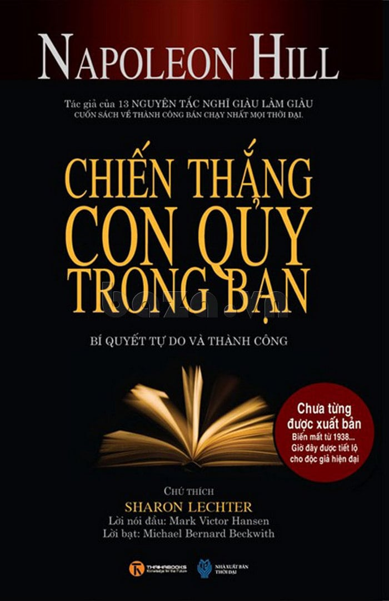

# Chiến Thắng Con Quỷ Trong Bạn (Outwitting the Devil)

**Tác giả:** Napoleon Hill  
**Dịch giả:** Thanh Minh  
**Thể loại:** Tâm lý học thành công & Phát triển bản thân  

---

> “**NỖI SỢ HÃI** là công cụ của quỷ dữ do con người tạo ra. **Tự tin vào chính bản thân mình** vừa là vũ khí giúp con người đánh bại quỷ dữ vừa là công cụ để con người tạo dựng nên một cuộc sống huy hoàng. Và còn nhiều hơn thế nữa. Tự tin còn là mắt xích kết nối con người với những sức mạnh không thể kiểm soát của vũ trụ - những sức mạnh đứng đằng sau những người luôn tin rằng mọi sai lầm và thất bại không là gì khác hơn ngoài những trải nghiệm tạm thời.”  
>  
> — **NAPOLEON HILL**

---

## 📖 Mục Lục

### Phần Mở Đầu
- [Giới thiệu & Bản thảo gốc 1938](00_gioi_thieu_va_muc_luc.md)
- [Lời ngỏ (Sharon Lechter)](00_loi_ngo.md)
- [Lời tựa (Mark Victor Hansen)](00_loi_tua.md)

### Nội Dung Chính
- [Chương 1: Cuộc gặp gỡ đầu tiên với Andrew Carnegie](01_chuong_mot_cuoc_gap_go_dau_tien_voi_andrew_carnegie.md)
- [Chương 2: Một thế giới mới mở ra trước mắt tôi](02_chuong_hai_mot_the_gioi_moi_mo_ra_truoc_mat_toi.md)
- [Chương 3: Cuộc phỏng vấn kỳ lạ với Con Quỷ](03_chuong_ba_cuoc_phong_van_ky_la_voi_con_quy.md)
- [Chương 4: Buông thả cùng Con Quỷ](04_chuong_bon_buong_tha_cung_con_quy.md)
- [Chương 5: Con Quỷ tiếp tục thú tội](05_chuong_nam_con_quy_tiep_tuc_thu_toi.md)
- [Chương 6: Nhịp điệu thôi miên](06_chuong_sau_nhip_dieu_thoi_mien.md)
- [Chương 7: Mầm mống của nỗi sợ hãi](07_chuong_bay_mam_mong_cua_noi_so_hai.md)
- [Chương 8: Mục tiêu xác định](08_chuong_tam_muc_tieu_xac_dinh.md)
- [Chương 9: Giáo dục và tôn giáo](09_chuong_chin_giao_duc_va_ton_giao.md)
