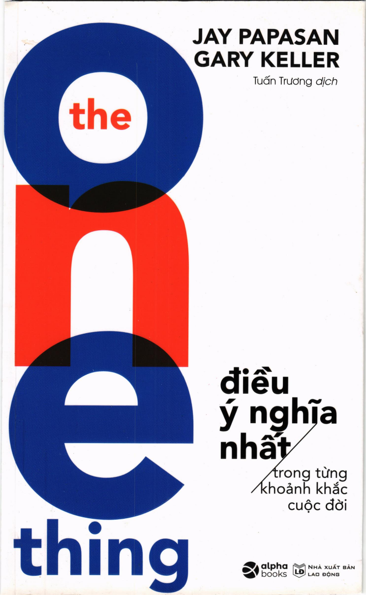

# THE ONE THING – ĐIỀU Ý NGHĨA NHẤT TRONG TỪNG KHOẢNH KHẮC CUỘC ĐỜI

- **Tác giả:** Gary Keller & Jay Papasan
- **Dịch giả:** Tuấn Trương
- **Nhà xuất bản:** NXB Lao Động
- **Đơn vị phát hành:** Alpha Books
- **Tên gốc:** The ONE Thing: The Surprisingly Simple Truth Behind Extraordinary Results

---

## Giới Thiệu Tác Phẩm

**The ONE Thing – Điều Ý Nghĩa Nhất Trong Từng Khoảnh Khắc Cuộc Đời** của Gary Keller và Jay Papasan là một trong những cuốn sách bán chạy nhất thế giới về hiệu suất cá nhân và kỹ năng tập trung tối thượng.

Trong một thế giới đầy rẫy sự xao nhãng và những danh sách việc cần làm dài vô tận, cuốn sách đưa ra một chân lý giản dị nhưng vô cùng mạnh mẽ: **Kết quả phi thường không đến từ việc làm thật nhiều thứ, mà đến từ việc thu hẹp sự tập trung vào điều duy nhất có ý nghĩa nhất trong từng thời điểm.**

Cuốn sách giúp bạn:
- Nhận diện và đập tan **6 sự dối trá** về thành công (sự đa nhiệm, sự cân bằng cuộc sống, sức mạnh ý chí vô hạn...).
- Làm chủ **Câu hỏi tập trung**: *"Điều quan trọng nhất tôi có thể làm là gì – nhờ đó mà mọi việc khác sẽ trở nên dễ dàng hơn hoặc không cần thiết nữa?"*
- Kích hoạt **Hiệu ứng Domino** để biến những nỗ lực nhỏ hàng ngày thành những thành tựu khổng lồ.
- Thiết lập 3 cam kết và đánh bại 4 kẻ trộm thời gian để bảo vệ năng suất tối đa.

---

## Mục Lục Chi Tiết

1. [Lời giới thiệu & Mục lục](00_gioi_thieu_va_muc_luc.md)
2. [Chương 1: Điều quan trọng nhất](chuong_01_dieu_quan_trong_nhat.md)
3. [Chương 2: Hiệu ứng domino](chuong_02_hieu_ung_domino.md)
4. [Chương 3: Các đầu mối thành công](chuong_03_cac_dau_moi_thanh_cong.md)
5. [Phần 1: Những dối trá đã làm mê muội và khiến chúng ta lạc lối](phan_01_nhung_doi_tra.md)
6. [Chương 4: Mọi thứ đều quan trọng như nhau](chuong_04_moi_thu_deu_quan_trong_nhu_nhau.md)
7. [Chương 5: Đa nhiệm vụ](chuong_05_da_nhiem_vu.md)
8. [Chương 6: Một lối sống có kỷ luật](chuong_06_mot_loi_song_co_ky_luat.md)
9. [Chương 7: “Cần là có, muốn là được” ý chí](chuong_07_can_la_co_muon_la_duoc_y_chi.md)
10. [Chương 8: Một cuộc sống cân bằng](chuong_08_mot_cuoc_song_can_bang.md)
11. [Chương 9: Lớn thì không tốt](chuong_09_lon_thi_khong_tot.md)
12. [Phần 2: Sự thật về con đường đơn giản dẫn đến thành công](phan_02_su_that_ve_con_duong_don_gian.md)
13. [Chương 10: Câu hỏi tập trung](chuong_10_cau_hoi_tap_trung.md)
14. [Chương 11: Thói quen thành công](chuong_11_thoi_quen_thanh_cong.md)
15. [Chương 12: Con đường dẫn đến những câu trả lời tuyệt vời](chuong_12_con_duong_dan_den_nhung_cau_tra_loi_tuyet_voi.md)
16. [Phần 3: Những kết quả đáng kinh ngạc khai phá các khả năng tiềm ẩn của bạn](phan_03_nhung_ket_qua_dang_kinh_ngac.md)
17. [Chương 13: Sống với mục đích](chuong_13_song_voi_muc_dich.md)
18. [Chương 14: Sống theo ưu tiên](chuong_14_song_theo_uu_tien.md)
19. [Chương 15: Sống vì hiệu quả](chuong_15_song_vi_hieu_qua.md)
20. [Chương 16: Ba cam kết](chuong_16_ba_cam_ket.md)
21. [Chương 17: Bốn kẻ trộm](chuong_17_bon_ke_trom.md)
22. [Chương 18: Cuộc hành trình](chuong_18_cuoc_hanh_trinh.md)
23. [Buộc điều ý nghĩa nhất phải mang lại hiệu quả](buoc_dieu_y_nghia_nhat_phai_mang_lai_hieu_qua.md)
