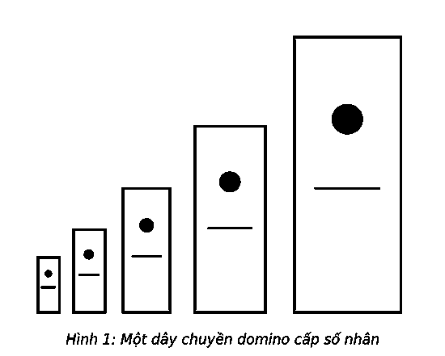
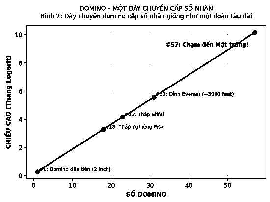

# 2. HIỆU ỨNG DOMINO

Tại Leeuwarden, Hà Lan vào ngày Domino, 13/11/2009, Weijers Domino Productions đã xác lập kỷ lục thế giới về hiệu ứng domino bằng cách sắp xếp hơn 4.491.863 quân domino thành một bức hình rực rỡ. Trong trường hợp này, chuỗi domino đổ tạo ra hiệu ứng domino đã giải phóng 94.000 jun năng lượng tích tụ tương đương với năng lượng được giải phóng khi một người đàn ông vóc dáng trung bình hít đất 545 lần.

> *“Mọi thay đổi lớn đều có khởi đầu như hiệu ứng domino.”*  
> — **BJ Thornton**

Mỗi domino chứa một lượng năng lượng nhỏ tiềm ẩn; bạn càng xếp được nhiều, năng lượng tiềm tàng tích lũy được càng lớn. Sau đó, chỉ với một cú chạm nhẹ, bạn đã tạo ra một phản ứng dây chuyền có sức mạnh đáng kinh ngạc. Và Weijers Domino Productions đã chứng minh điều đó. Khi “điều quan trọng nhất” được xếp đúng chỗ, chỉ cần tác dụng một lực nhỏ, nó có thể xô đổ rất nhiều thứ.

Nhưng đó chưa phải tất cả.

Năm 1983, Lorne Whitehead đã viết trên tạp chí *Vật lý Mỹ* rằng ông đã phát hiện ra hiệu ứng domino không những có thể xô đổ nhiều thứ, mà còn có khả năng xô đổ những thứ lớn hơn. Ông đã mô tả khả năng một domino có thể đánh đổ một domino khác có kích thước lớn gấp rưỡi nó như thế nào.

Vào năm 2001, một nhà vật lý đến từ Exploratorium của San Francisco đã mô phỏng thí nghiệm của Whitehead bằng cách tạo ra 8 domino làm từ gỗ dán, mỗi domino có kích thước lớn gấp rưỡi domino trước nó. Domino đầu tiên cao khoảng 5cm và domino cuối cùng cao khoảng 0,3m. Với một cú chạm nhẹ, hiệu ứng domino nhanh chóng kết thúc bằng một “tiếng rầm lớn”.

Vậy chuyện gì sẽ xảy ra nếu chuỗi domino này được kéo dài hơn? Nếu hiệu ứng domino thông thường là một chuỗi tuyến tính, thì thí nghiệm của Whitehead được mô tả là một chuỗi dây chuyền cấp số nhân. Kết quả có được nằm ngoài sức tưởng tượng. Domino thứ 10 sẽ cao gần bằng thủ quân đội bóng nhà nghề Peyton Manning. Domino thứ 18 có thể có chiều cao tương đương với tháp nghiêng Pisa. Domino thứ 23 cao hơn tháp Eiffel và domino thứ 31 sẽ cao hơn đỉnh Everest gần 1.000m (3000 feet). Domino thứ 57 thực tế có thể “bắc cầu” trái đất với mặt trăng!

### ĐẠT ĐƯỢC THÀNH QUẢ ĐÁNG KINH NGẠC

Vì vậy, khi nghĩ về thành công, hãy nhắm tới những điều không tưởng. Bạn hoàn toàn có thể đạt được chúng nếu bạn ưu tiên mọi thứ và dồn hết tâm sức của bản thân để hoàn thành điều quan trọng nhất. Đạt được những kết quả đáng kinh ngạc đồng nghĩa với việc tạo ra hiệu ứng domino trong cuộc sống của bạn.

Đánh đổ các domino không khó. Bạn xếp chúng đứng theo hàng và tác động một lực để đánh đổ domino đầu tiên. Tuy nhiên, hiệu ứng domino trong thực tế phức tạp hơn một chút. Bởi cuộc sống không sắp sẵn mọi thứ cho bạn và nói rằng, “Anh nên bắt đầu từ đây”. Những người gặt hái được thành công nắm rõ điều này. Vì vậy, họ sắp xếp lại các ưu tiên, tìm quân domino “chủ chốt”, và tác động đủ lực để đánh đổ nó.

Tại sao cách tiếp cận này lại hiệu quả đến vậy? Bởi những thành quả đáng kinh ngạc thường diễn ra theo tuần tự, nhưng không đồng thời. Những gì khởi đầu một cách tuyến tính sẽ dần trở thành dây chuyền cấp số nhân. Những việc làm đúng đắn sẽ được nối tiếp bởi những điều đúng đắn. Nó được tích tụ lớn dần theo thời gian, và tiềm năng thành công lũy tiến sẽ được giải phóng. Hiệu ứng domino được áp dụng cho bức tranh tổng thể như công việc hoặc doanh nghiệp của bạn; nó cũng được áp dụng cho những thời khắc ra quyết định nhỏ nhất trong ngày. Thành công nối tiếp thành công, và khi điều này được tái lặp theo thời gian, bạn sẽ đạt được tiềm lực thành công lớn nhất có thể.

Một người hiểu sâu biết rộng hẳn là đã trau dồi kiến thức theo thời gian. Một người thành thạo các kỹ năng chắc chắn đã thục luyện rất nhiều. Một người giàu có chắc chắn tích lũy trong nhiều năm.

Thời gian chính là chiếc chìa khóa quan trọng, là điểm mấu chốt của vấn đề. Thành công được xây dựng một cách tuần tự. Đó là “điều quan trọng nhất” tại từng thời điểm.
