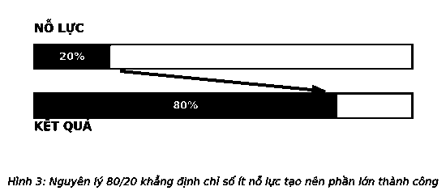
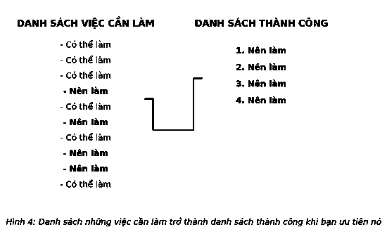
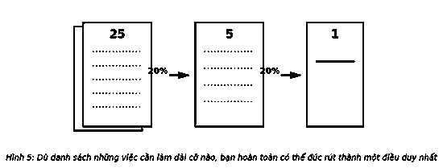
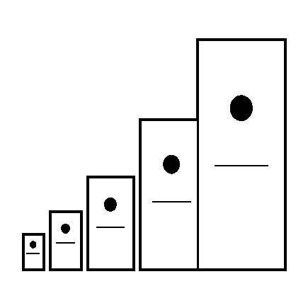

# 4. MỌI THỨ ĐỀU QUAN TRỌNG NHƯ NHAU

Sự công bằng là một lý tưởng đáng theo đuổi nhân danh công lý và nhân quyền. Tuy nhiên, trong thực tế, mọi thứ không bao giờ công bằng. Dù các nhà tổ chức có cố gắng phân minh ra sao các cuộc thi vẫn không đạt được sự công bằng. Dù mọi người có tài năng đến đâu hai người cũng không thể ngang tài ngang sức tuyệt đối.

Sự công bằng là lời dối trá.

Hiểu được điều này là cơ sở của mọi quyết định quan trọng.

> *“Những điều quan trọng nhất không bao giờ phó mặc quyền định đoạt cho những điều chẳng mấy quan trọng.”*  
> — **Johann Wolfgang von Goethe**

Vậy, bạn quyết định bằng cách nào? Khi có quá nhiều việc để làm trong ngày, bạn quyết định việc phải làm đầu tiên bằng cách nào? Khi còn bé, chúng ta thường đợi đến hạn chót mới vội vàng hoàn thành nốt những việc cần phải làm. Đã đến giờ ăn sáng. Đã đến giờ đi học, đến giờ làm bài tập về nhà, đến giờ làm việc nhà, giờ tắm, giờ đi ngủ. Nhưng khi lớn hơn, chúng ta được đặt ra một khung thời gian nhất định. Con có thể ra ngoài chơi miễn là con làm xong bài tập về nhà trước bữa tối. Sau đó, khi trưởng thành hơn, chúng ta được quyền tự lựa chọn. Và khi cuộc sống của chúng ta được hình thành dựa trên các lựa chọn, chúng ta phải làm sao để lựa chọn đúng đắn?

Thật phức tạp khi càng lớn, lại càng có nhiều cái cớ để chúng ta tin rằng mọi chuyện “đơn giản phải được thực hiện”. Kỳ vọng quá nhiều, vượt quá năng lực và cam kết thái quá. Tràn lan, đại trà đã trở thành tình trạng chung.

Đó là khi cuộc chiến tìm kiếm hành trình đúng đắn diễn ra quyết liệt. Thiếu công thức ra quyết định rõ ràng, chúng ta rơi vào trạng thái phản ứng và sa đà trở lại những cách thức ra quyết định quen thuộc và dễ dãi. Kết quả là, chúng ta tùy tiện chọn những cách tiếp cận làm xói mòn thành công của chính mình. Việc gấp rút thực hiện những công việc cần làm trong ngày biến chúng ta thành một nhân vật đang hoảng sợ trong một bộ phim kinh dị – luống cuống chạy lên cầu thang thay vì chạy ra cửa. Quyết định sáng suốt nhất được thay thế bằng bất kỳ quyết định nào, và những gì cần được tiến hành chỉ đơn giản trở thành một chiếc bẫy.

> *“Những điều quan trọng nhất không phải là những gì được rao giảng nhiều nhất.”*  
> — **Bob Hawke**

Ở tình trạng cấp bách và quan trọng, mọi thứ dường như công bằng. Chúng ta trở nên chủ động và bận rộn, nhưng điều đó không thực sự đưa chúng ta đến gần thành công hơn. Hành động thường không liên quan đến hiệu suất, và sự bận rộn hiếm khi ảnh hưởng tích cực đến hiệu quả công việc.

Như Henry David Thoreau từng nói: *“Bận rộn thôi không đủ, cần mẫn cũng vậy. Vấn đề là, chúng ta bận vì việc gì?”* Thà làm một việc có ý nghĩa còn hơn làm trăm việc vô nghĩa. Không phải mọi thứ đều quan trọng như nhau, và thành công không phải là phần thưởng dành cho kẻ làm nhiều nhất. Tuy nhiên, đó lại là những gì diễn ra hằng ngày.

### CHẲNG CÓ GÌ ĐỂ LÀM

Danh sách những việc cần làm là thành tố chính của khả năng thành công và quản lý thời gian. Với mong muốn của bản thân và ước muốn của người khác dồn dập ập đến chúng ta từ tứ phía, chúng ta vội vàng ghi chúng vào các mảnh giấy nhỏ một cách rõ ràng hoặc liệt kê chúng một cách có thứ tự vào các tập giấy in. Các nhà hoạch định thời gian dành thời gian quý giá cho các danh sách công việc hằng ngày, hằng tuần và hằng tháng. Nhiều ứng dụng điện thoại di động, và các chương trình phần mềm mã hóa chúng ngay vào bảng chọn. Có vẻ như chúng ta được khuyến khích tạo ra một danh sách việc cần làm – và cho dù những danh sách đó là tối ưu, nhưng chúng cũng có những hạn chế.

Dù việc cần làm được coi như những mục đích tốt đẹp nhất của chúng ta, nhưng chúng cũng áp chế chúng ta với những việc không quan trọng, tầm thường mà chúng ta cảm thấy bắt buộc phải hoàn thành – bởi chúng nằm trong danh sách những việc cần làm. Đó là lý do hầu hết chúng ta đều thích hoặc không thích danh sách những việc phải làm. Nếu được phép, chúng sẽ tự tạo ra các ưu tiên giống như cách hòm thư sắp đặt lịch trình hằng ngày cho chúng ta. Phần lớn những hộp thư đều tràn ngập những e-mail không quan trọng “giả dạng các ưu tiên”. Giải quyết công việc theo trình tự thời gian thư nhận được chẳng khác nào chiếc bánh xe cót két cần được tra dầu. Thủ tướng Úc, Bob Hawke, đã ghi nhận một cách đúng đắn, *“Những điều quan trọng nhất không phải là những gì được rao giảng nhiều nhất.”*

Những người thành công thường hành động khác biệt. Họ có con mắt rất tinh tường. Họ cân nhắc đủ kỹ lưỡng để xác định những gì quan trọng và sau đó cho phép chúng chi phối thời gian của họ. Những người thành công thường hoàn thành các công việc mà người khác dự định làm nhưng lại trì hoãn có thể là vô thời hạn và ngược lại, họ có thể trì hoãn hoặc không làm những gì người khác làm. Sự khác biệt không nằm ở dự định mà ở cách làm. Những người thành công luôn xuất phát với một ý thức rõ ràng về các ưu tiên.

Trong tình trạng nguyên bản, như một bản kiểm kê đơn giản, một danh sách những việc cần làm có thể dễ dàng khiến bạn lạc đường. Một danh sách những việc cần làm chỉ đơn giản là những việc bạn nghĩ mình cần phải thực hiện; việc đầu tiên trong danh sách chỉ là điều đầu tiên bạn nghĩ đến. Các danh sách những việc cần làm vốn đã thiếu định hướng thành công. Trong thực tế, hầu hết các danh sách những việc cần làm chỉ là “danh sách sống sót” – giúp bạn sống qua ngày, nhưng không tạo nên những bước đệm để giúp bạn dần tạo dựng cuộc sống thành công. Chúng ta dành rất nhiều thời gian để thực hiện các mục trong danh sách những việc cần làm nhưng đến cuối ngày chúng lại chẳng hề mang lại thành công. Thay vì một danh sách những việc cần làm, bạn cần một “danh sách thành công” với mục đích tạo ra những kết quả đột phá.

Các danh sách những việc cần làm thường rất dài, đưa bạn đến mọi hướng trong khi danh sách thành công lại khá ngắn nhưng lại vẽ cho bạn một hướng đi cụ thể. Một là thư mục hỗn độn và một là hướng dẫn có tổ chức. Nếu một danh sách không nhằm mục đích tạo dựng thành công, nó chắc chắn sẽ không mang lại thành công cho bạn. Nếu danh sách những việc phải làm của bạn là một mớ “hổ lốn”, thì nó có thể đưa bạn đến khắp nơi nhưng đó lại không phải nơi bạn thực sự muốn đến.

Vậy, một người thành công biến danh sách việc cần làm thành danh sách thành công bằng cách nào? Với rất nhiều điều có thể làm, bạn xác định được điều gì quan trọng nhất tại một thời điểm bất kỳ hoặc theo cách bất kỳ ra sao?

Hãy làm theo chỉ dẫn của Juran.

### JURAN BẺ MÃ KHÓA

Vào cuối những năm 1930, một nhóm nhà quản lý tại General Motors (GM) đã có một khám phá hấp dẫn mở ra bước đột phá tuyệt vời. Một đầu đọc thẻ của họ (thiết bị đầu vào cho dòng máy tính ban đầu) bắt đầu có dấu hiệu bị lỗi. Khi kiểm tra, họ khám phá ra một cách để mã hóa các thông điệp bí mật. Đây là một vụ lớn vào thời điểm đó. Từ khi những chiếc máy mã hóa Enigma tai tiếng của Đức lần đầu xuất hiện trong Thế chiến I, thì cả việc mã hóa và phá mã đều là vấn đề thuộc an ninh quốc gia và thậm chí đã dấy lên làn sóng tò mò trong công chúng. Ban quản lý của GM nhanh chóng bị thuyết phục rằng mật mã ngẫu nhiên của họ không thể bị bẻ gãy. Một tư vấn viên của Western Electric tỏ ra không đồng ý với điều đó. Anh ta đã lên tiếng thách thức bẻ mã, từ tối hôm trước và phá được khóa trước 3 giờ sáng ngày hôm sau. Anh ta tên là Joseph M. Juran.

Juran sau đó đã coi sự cố này là điểm khởi đầu cho quá trình bẻ một mã khóa lớn hơn và biến nó trở thành một trong những đóng góp lớn nhất của anh đối với khoa học và kinh doanh. Nhờ giải mã khóa thành công, anh đã được một nhà điều hành của GM mời đến xem xét lại nghiên cứu về bồi thường quản lý được dựa trên một công thức theo mô tả của nhà kinh tế Ý Vilfredo Pareto. Trong thế kỷ XIX, Pareto đã viết một mô hình toán học về phân bổ thu nhập không đồng đều tại Ý khẳng định 80% diện tích đất thuộc sở hữu của 20% dân số. Thực tế, theo Pareto, của cải thực sự tập trung theo cách có thể dự đoán được. Là người tiên phong về quản lý kiểm soát chất lượng, Juran nhận thấy rằng chỉ một số ít sai sót cũng tạo ra vô số sản phẩm lỗi. Sự mất cân bằng này không chỉ đúng với trải nghiệm của anh, mà anh còn cho rằng nó thậm chí có thể là một quy luật phổ quát và những gì Pareto quan sát được thậm chí còn nằm ngoài sức tưởng tượng của ông.

Khi viết cuốn sách chuyên đề *Sổ tay kiểm soát chất lượng* (*Quality Control Handbook*), Juran muốn đưa ra một cái tên ngắn gọn cho khái niệm “quan trọng thì ít mà tầm thường thì nhiều”. Một minh họa trong bản thảo của ông mang tên “nguyên tắc phân bổ không đồng đều của Pareto...” Khi người khác có thể gọi nó là Quy tắc của Juran, anh lại gọi nó là Nguyên tắc Pareto.

Nguyên tắc Pareto hóa ra giống như định luật hấp dẫn, nhưng hầu hết mọi người không nhìn thấy lực hấp dẫn của nó. Nó không chỉ đơn thuần là một lý thuyết – mà là sự chắc chắn có thể dự đoán, đã được chứng minh và là một trong những sự thật về hiệu suất lớn nhất từng được phát hiện. Richard Koch, trong cuốn sách của ông, *Nguyên lý 80/20*, đã nhận định: *“Nguyên lý 80/20 khẳng định số ít nguyên nhân, yếu tố đầu vào hoặc nỗ lực thường dẫn đến phần lớn kết quả, thành quả hoặc phần thưởng.”* Nói cách khác, trong thế giới của thành công, mọi thứ đều không công bằng. Số ít nguyên nhân tạo ra phần lớn kết quả. Chỉ cần đầu vào đúng đắn sẽ tạo ra phần lớn đầu ra. Nỗ lực có chọn lọc sẽ tạo ra đa phần phần thưởng xứng đáng.

Pareto đã chỉ cho chúng ta một hướng đi rất rõ ràng: Phần lớn những gì bạn muốn thường khởi nguồn từ phần nhỏ những gì bạn làm. Những kết quả đáng kinh ngạc đều được tạo ra một cách không tương xứng bởi số ít hành động so với khả năng nhận biết của con người.

Chân lý của Pareto nghiêng về sự bất bình đẳng, và dù được thể hiện thông qua tỷ lệ 80/20, nhưng cũng có thể có nhiều tỷ lệ khác nữa. Tùy thuộc vào từng trường hợp, có thể là 90/20, trong đó 90% thành công của bạn đến từ 20% nỗ lực. Hoặc 70/10 hay 65/5. Nhưng chúng ta phải hiểu rằng, về cơ bản, tất cả đều xuất phát từ cùng một nguyên tắc. Juran đã cho thấy tầm nhìn sâu sắc: không phải mọi thứ đều quan trọng như nhau, một số điều quan trọng hơn những điều khác – thậm chí hơn rất nhiều. Danh sách những việc phải làm sẽ trở thành danh sách thành công khi bạn áp dụng Nguyên tắc Pareto.

Nguyên lý 80/20 là một trong những quy tắc hướng dẫn thành công quan trọng nhất trong sự nghiệp của tôi. Nó mô tả các hiện tượng, giống như Juran, tôi đã quan sát thấy trong cuộc đời mình nhiều lần. Chỉ số ít các ý tưởng đã mang đến cho tôi phần lớn thành công. Một số khách hàng quan trọng hơn những người khác; chỉ vài người tạo ra thành quả kinh doanh của tôi; số ít các khoản đầu tư lại mang về lợi nhuận khổng lồ. Khái niệm phân bố không đồng đều xuất hiện mọi nơi. Nó càng xuất hiện nhiều, tôi càng chú ý – và tôi càng chú ý, nó càng xuất hiện nhiều. Cuối cùng, tôi từ bỏ suy nghĩ đó là một sự trùng hợp ngẫu nhiên và bắt đầu áp dụng nó như một nguyên tắc tuyệt đối về thành công – không chỉ đối với bản thân mà còn cả trong mối quan hệ với những người khác.

### PARETO CỰC ĐIỂM

Pareto đã chứng minh mọi thứ tôi vừa nhắc đến nhưng vẫn còn điểm chưa được. Nghiên cứu của ông chưa đủ sâu. Tôi muốn các bạn nghiên cứu sâu hơn nữa. Tôi muốn bạn đưa Nguyên lý Pareto đến cực điểm. Tôi muốn bạn đi vào chi tiết, bước từng bước nhỏ bằng cách làm rõ 20%, và sau đó tôi muốn bạn thậm chí đi sâu hơn bằng cách tìm ra những điều quan trọng nhất trong số ít những điều quan trọng. Nguyên lý 80/20 là định nghĩa đầu tiên, nhưng không phải cuối cùng, về thành công. Pareto đã bắt đầu, bạn phải có nhiệm vụ kết thúc. Thành công buộc bạn phải tuân theo Nguyên lý 80/20, nhưng không chỉ dừng lại đó.

Hãy nỗ lực hơn nữa. Bạn thực sự có thể chọn 20% của 20% của 20% và tiếp tục như thế cho đến khi bạn có được điều quan trọng nhất! (Hình 5). Dù đó là công việc, nhiệm vụ hay mục đích nào. Dù lớn hay nhỏ. Bắt đầu với một danh sách dài bao nhiêu tùy theo ý muốn của bạn, nhưng hãy hình thành suy nghĩ rút gọn dần danh sách của bạn từ những mục ít quan trọng nhất và không dừng lại cho đến khi chỉ còn điều cần thiết nhất. Một điều bắt buộc phải thực hiện. Một điều duy nhất.

Năm 2001, tôi tổ chức một buổi họp với đội ngũ điều hành chủ chốt. Dù phát triển nhanh và mạnh, chúng tôi vẫn không được những nhân vật đầu ngành công nhận. Tôi thử thách nhóm bằng cách buộc họ phải đưa ra 100 ý tưởng thay đổi hiện trạng. Chúng tôi đã mất cả ngày để đưa ra danh sách. Sáng hôm sau, chúng tôi thu hẹp danh sách còn 10 ý tưởng, và từ đó chúng tôi chọn ra một ý tưởng ấn tượng nhất. Ý tưởng đó là nền tảng để tôi viết nên cuốn sách về cách để trở thành một tổ chức ưu tú trong ngành. Nó rất hiệu quả. 8 năm sau, cuốn sách không chỉ bán chạy nhất, mà còn trở thành loạt sách được tiêu thụ hơn một triệu bản. Trong một ngành công nghiệp với khoảng một triệu người, “điều quan trọng nhất” đã làm thay đổi hình ảnh của chúng tôi mãi mãi.

Giờ đây, một lần nữa, hãy dừng lại một chút và thực hiện một phép toán. Một trong số 100 ý tưởng. Đó là Pareto cực điểm. Đó là nghĩ lớn, nhưng đi từng bước nhỏ. Đó là áp dụng “điều quan trọng nhất” vào thách thức kinh doanh theo một cách thực sự mạnh mẽ.

Nhưng điều này không chỉ áp dụng đối với lĩnh vực kinh doanh. Vào sinh nhật thứ 40, tôi bắt đầu học guitar và nhanh chóng dành 20 phút mỗi ngày để luyện tập. Lượng thời gian này không nhiều, vì vậy tôi biết mình phải thu hẹp những gì cần học. Tôi nhờ Eric Johnson một người bạn, một trong những nghệ sĩ guitar vĩ đại, tư vấn. Eric nói nếu có thể làm “một điều duy nhất”, thì tôi nên luyện tập theo thang âm của mình. Vì vậy, tôi đã lựa chọn gam thứ theo điệu blue. Tôi phát hiện ra nếu học theo thang âm đó, tôi có thể chơi được rất nhiều bản nhạc của các nghệ sĩ guitar rock cổ điển vĩ đại từ Eric Clapton cho đến Billy Gibbons và, có thể một ngày nào đó, là cả Eric Johnson nữa. Thang âm đó đã trở thành “điều quan trọng nhất” của tôi trong quá trình học guitar, và nó mở ra trước mắt tôi cả thế giới rock 'n' roll.

Sự bất công trong nỗ lực để thành công xuất hiện khắp nơi trong cuộc sống nếu bạn chịu tìm kiếm. Và nếu bạn áp dụng nguyên lý này, nó sẽ mang lại thành công mà bạn mong muốn trong bất cứ điều gì quan trọng với bạn. Sẽ luôn có một vài thứ quan trọng hơn những thứ còn lại, và trong số đó, một điều sẽ giữ vai trò quan trọng nhất. Tiếp thu khái niệm này cũng giống như việc bạn được giao cho một chiếc la bàn ma thuật. Bất cứ khi nào cảm thấy mất phương hướng, bạn có thể mang nó ra để nhắc nhở mình tìm kiếm điều quan trọng nhất.

---

> ### Ý TƯỞNG LỚN
>
> 1. **Đi từng bước nhỏ.** Đừng tập trung quá vào sự bận rộn, thay vào đó, hãy để mắt tới sự hiệu quả. Hãy để điều quan trọng nhất định hướng cho bạn mỗi ngày.
> 2. **Tiến đến cực điểm.** Khi đã tìm ra những điều thực sự quan trọng, hãy tiếp tục loại bỏ dần đến khi chỉ còn lại điều quan trọng nhất. Hành động cốt lõi đó đứng đầu danh sách thành công của bạn.
> 3. **Nói không.** Cho dù bạn nói “sau này” hay “không bao giờ”, nhưng vấn đề là phải nói “không phải bây giờ” với bất cứ điều gì bạn có thể làm đến khi việc quan trọng nhất của bạn được thực hiện.
> 4. **Đừng để bị mắc kẹt trong trò chơi “đánh dấu”.** Nếu tin rằng không phải mọi điều đều quan trọng như nhau, chúng ta phải có hành động phù hợp. Chúng ta đừng mong làm được mọi thứ, cũng đừng nghĩ mỗi lần hoàn thành một mục trong danh sách những điều cần làm là chúng ta đang tiến gần đến thành công. Không phải mọi thứ đều quan trọng như nhau và thành công chỉ xuất hiện trong quá trình thực hiện những gì quan trọng nhất.
>
> *Đôi khi đó là điều đầu tiên bạn làm hoặc điều duy nhất bạn làm. Nhưng dù là gì đi chăng nữa, việc thực hiện điều quan trọng nhất luôn là điều quan trọng nhất.*
>
> 
