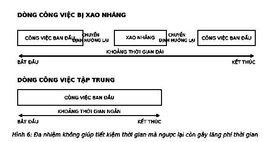

# 5. ĐA NHIỆM VỤ

Nếu việc thực hiện điều quan trọng nhất là điều quan trọng nhất, tại sao bạn phải cố gắng làm thêm bất cứ điều gì cùng lúc?

Mùa hè năm 2009, Clifford Nass đã đặt vấn đề để tìm cách trả lời câu hỏi đó. Nhiệm vụ của anh là tìm hiểu xem những người đa nhiệm tài ba đã làm nhiều việc cùng lúc bằng cách nào. Nass, Giáo sư tại Đại học Stanford, đã chia sẻ với tờ *New York Times* rằng ông “rất kinh ngạc về những người đa nhiệm và tự cho mình là một kẻ nghèo đói”. Vì vậy, ông và một nhóm các nhà nghiên cứu đã đưa ra bảng câu hỏi cho 262 sinh viên để xác minh tần suất làm nhiều việc cùng lúc của họ. Họ chia các đối tượng thử nghiệm thành hai nhóm gồm những người đa nhiệm nhiều và ít đồng thời bắt đầu với giả định rằng những người đa nhiệm thường xuyên sẽ làm việc hiệu quả hơn. Tuy nhiên, họ đã nhầm.

> *“Làm hai việc cùng lúc đồng nghĩa với không làm gì cả.”*  
> — **Publilius Syrus**

“Tôi chắc chắn họ có một khả năng bí mật nào đó”, Nass nói. “Nhưng hóa ra người đa nhiệm tần suất cao là người nghiện những điều không thích hợp.” Họ vượt trội hơn hẳn xét trên mọi tiêu chí. Mặc dù họ thuyết phục bản thân và những người xung quanh rằng họ giỏi “đa nhiệm” nhưng theo Nass, “những người đa nhiệm tệ hại ở mọi mặt.”

Làm nhiều việc cùng lúc là một lời dối trá.

Bởi gần như mọi người đều coi đó là một hành động hiệu quả, nó trở thành điều phổ biến đến mức mọi người thực sự nghĩ rằng đó là việc họ nên làm và làm càng thường xuyên càng tốt. Chúng ta không chỉ nghe nói về cách thực hiện điều đó, mà thậm chí còn được nghe về cách để làm nó tốt hơn. Hơn 6 triệu trang web đều đưa ra câu trả lời về cách làm điều đó; các trang web nghề nghiệp liệt kê “đa nhiệm” như một kỹ năng mà người lao động nên hướng đến và nên được liệt kê vào một trong các thế mạnh của nhân viên tiềm năng. Một số người còn tự hào về kỹ năng hỗ trợ đó và áp dụng nó như một cách sống. Nhưng thực tế, đó là một “lời dối trá” bởi sự thật là đa nhiệm vừa không hiệu quả vừa không phù hợp. Trong thế giới coi trọng kết quả, nó sẽ khiến bạn thất bại mọi lúc, mọi nơi.

> *“Đa nhiệm đơn giản là hành động tạo cơ hội phá hỏng nhiều hơn một việc trong cùng một thời điểm.”*  
> — **Steve Uzzell**

Khi cố gắng làm hai việc cùng lúc, bạn không thể hoặc sẽ không làm tốt được cả hai. Nếu nghĩ đa nhiệm là một cách làm việc hiệu quả thì bạn đã nhầm. Thực tế, đây là cách làm giảm hiệu quả công việc. Như Steve Uzzell nói: “Đa nhiệm đơn giản là hành động tạo cơ hội phá hỏng nhiều hơn một việc trong cùng một thời điểm.”

### TƯ DUY CON KHỈ

Khái niệm về việc con người có thể làm nhiều việc một lúc đã được nghiên cứu bởi các nhà tâm lý học từ những năm 1920, nhưng thuật ngữ “đa nhiệm” đã không được đề cập cho đến tận những năm 1960. Nó được sử dụng để mô tả máy tính thay vì con người. Tính đến thời điểm đó, tốc độ 10 MHz nhanh đến mức cần một từ hoàn toàn mới để mô tả khả năng thực hiện đó của máy tính. Khi nhìn lại, họ có thể đã đưa ra một lựa chọn tồi tệ, bởi phần giải thích cho khái niệm “đa nhiệm” vốn đã là một sự dối trá. Đa nhiệm là nhiều nhiệm vụ luân phiên chia sẻ một nguồn lực (CPU), nhưng trong quá trình thực hiện, nó được hiểu thành nhiều nhiệm vụ được thực hiện đồng thời bởi một nguồn lực (hoặc một người). Một biến đổi cụm từ thông minh có thể gây hiểu nhầm, bởi ngay cả máy tính cũng chỉ có thể xử lý được một đoạn mã tại một thời điểm. Khi làm nhiều việc cùng lúc, chúng ta di chuyển như con thoi, xen kẽ sự chú ý cho từng việc đến khi cả hai nhiệm vụ đều được hoàn thành. Tốc độ mà máy tính giải quyết nhiều nhiệm vụ khác nhau tạo ra ảo tưởng rằng mọi thứ xảy ra cùng lúc, vì vậy việc so sánh máy tính với con người có thể gây nhầm lẫn.

Con người thực sự có thể làm hai hay nhiều việc cùng lúc, như vừa đi vừa nói chuyện, hoặc vừa nhai kẹo cao su vừa đọc bản đồ, nhưng giống như máy tính, chúng ta không thể tập trung vào cả hai việc cùng lúc. Sự tập trung của chúng ta sẽ bị phân tán. Máy tính thì không có vấn đề gì, nhưng nó ảnh hưởng nghiêm trọng đến con người. Hai chiếc máy bay chuẩn bị hạ cánh trên cùng một đường băng. Một bệnh nhân bị kê đơn thuốc sai. Những bi kịch tiềm tàng này đều có chung một điểm là mọi người đang cố ôm đồm quá nhiều việc cùng lúc và quên làm điều họ nên làm.

Thật kỳ lạ, nhưng bằng cách nào đó theo thời gian, một người đa nhiệm đã trở thành hình ảnh về một người có lối sống hiện đại. Chúng ta nghĩ rằng chúng ta có thể, vì vậy chúng ta cho rằng chúng ta nên làm vậy. Học sinh vừa học vừa nhắn tin, nghe nhạc hoặc xem ti vi. Người lớn vừa lái xe vừa nói chuyện điện thoại, ăn uống, trang điểm. Những điều đó diễn ra không phải bởi chúng ta có quá ít thời gian để làm mọi việc cần làm, mà bởi chúng ta cảm thấy cần phải làm quá nhiều việc trong khoảng thời gian chúng ta có. Vì vậy, chúng ta tăng gấp đôi và gấp ba lượng việc làm với hy vọng làm được mọi thứ.

Các văn phòng hiện đại đầy rẫy những nhu cầu đa nhiệm gây sao nhãng. Trong khi bạn đang cố gắng hoàn thành nốt một dự án, một người nào đó ở ô bên cạnh ho và hỏi xem bạn có thuốc đau họng không. Hệ thống máy điện thoại văn phòng liên tục đổ chuông mà không ai sẵn sàng nghe máy. Màn hình máy tính của bạn liên tục thông báo có thư mới trong khi những thông tin cập nhật từ mạng xã hội thu hút hết sự chú ý của bạn đồng thời điện thoại di động lúc đó cũng rung báo tin nhắn mới. Một chồng thư chưa mở, hàng tá việc chưa giải quyết. Mất tập trung, sự quấy rầy, gián đoạn. Trên hết là sự mệt mỏi. Các nhà nghiên cứu đã ước tính rằng người lao động bị gián đoạn 11 phút một lần và dành 1/3 thời gian trong ngày để quay trở lại công việc sau những phiền nhiễu. Tuy nhiên, với thực tế đó chúng ta vẫn cho rằng mình có thể khắc phục được tình hình và làm những gì đã đề ra trong thời hạn cho phép.

Nhưng chúng ta đang tự lừa dối bản thân. Đa nhiệm là một trò lừa đảo. Nhà thơ Billy Collins tóm tắt rằng: *“Chúng tôi gọi đó là đa nhiệm, điều đó khiến nó nghe có vẻ giống khả năng làm được rất nhiều việc cùng lúc... Một tín đồ Phật giáo gọi đây là tư duy con khỉ.”* Chúng ta nghĩ rằng chúng ta làm chủ được khả năng đa nhiệm, nhưng thực tế chúng ta chỉ tự dẫn mình đến những quả chuối.

### TUNG HỨNG LÀ MỘT ẢO TƯỞNG

Chúng ta thường “đa nhiệm” một cách tự nhiên. Trung bình khoảng 4.000 suy nghĩ lướt qua đầu mỗi ngày, nên dễ thấy tại sao chúng ta lại cố gắng làm nhiều việc cùng lúc. Nếu suy nghĩ thay đổi với tần suất 14 giây một lần kéo theo thay đổi về phương hướng, thì rõ ràng chúng ta liên tục bị cám dỗ bởi việc cố gắng làm càng làm nhiều việc một lúc càng tốt. Khi làm một việc nào đó, chúng ta sẽ mất tập trung vào việc khác. Hơn nữa, lịch sử cho thấy sự tồn tại liên tục của chúng ta có thể đòi hỏi con người phải tiến hóa hơn để có thể bao quát nhiều nhiệm vụ cùng lúc. Tổ tiên của chúng ta không thể tồn tại lâu khi không ăn thịt thú rừng, hái lượm hoa quả, thuộc da hoặc không đốt lửa sau một ngày đi săn. Nỗ lực sắp xếp nhiều hơn một việc tại một thời điểm không chỉ là cốt lõi của cách chúng ta đang làm, mà rất có thể là điều cần thiết cho sự sống còn sau này.

Nhưng khả năng tung hứng không phải là khả năng đa nhiệm.

Tung hứng là một ảo tưởng. Đối với một người quan sát ngẫu nhiên, một nghệ sĩ xiếc đang tung hứng ba quả bóng cùng lúc. Trong thực tế, các quả bóng đang được ném lên và hứng tự do với sự luân chuyển rất nhanh. Bắt, ném, bắt, ném, bắt, ném. Mỗi quả bóng, một thời điểm. Đó là những gì các nhà nghiên cứu gọi là khả năng “luân chuyển công việc”.

Khi bạn chuyển từ việc này sang việc khác, tự nguyện hay không, có hai điều sẽ xảy ra. Điều đầu tiên diễn ra gần như tức thì: Bạn quyết định chuyển đổi. Điều thứ hai khó dự đoán hơn: Bạn phải kích hoạt các “quy tắc” đối với bất cứ điều gì bạn chuẩn bị làm (xem Hình 6). Chuyển đổi giữa hai nhiệm vụ đơn giản – như xem ti vi và gấp quần áo – diễn ra khá khẩn trương và dễ dàng. Tuy nhiên, nếu bạn đang làm việc trên một bảng tính và lúc đó, một đồng nghiệp ghé qua văn phòng của bạn để thảo luận về một vấn đề kinh doanh, sự phức tạp tương ứng liên quan đến các công việc khiến bạn gặp khó khăn trong việc chuyển đổi qua lại. Bạn luôn mất một chút thời gian để bắt đầu một nhiệm vụ mới và khởi động lại việc bạn vừa bỏ qua, không có gì đảm bảo rằng bạn sẽ quay trở lại chính xác phần công việc còn dang dở. Bạn phải trả giá cho việc này. *“Chi phí dưới dạng thời gian phụ trội do chuyển đổi công việc phụ thuộc vào mức độ phức tạp hay đơn giản của công việc,”* theo báo cáo nghiên cứu của Tiến sĩ David Meyer. *“Nó có thể tăng từ 25% thời gian hoặc ít hơn đối với những việc đơn giản đến hơn 100% đối với các việc phức tạp.”* Chuyển đổi công việc kéo theo một vài chi phí mà hiếm có người nhận ra mình đang phải trả.

### CÁC KÊNH TRONG NÃO BỘ

Như vậy, chuyện gì xảy ra khi chúng ta thực sự làm hai việc cùng lúc? Điều đó thật đơn giản. Chúng tôi đã tách riêng chúng. Não của chúng ta có nhiều kênh, và kết quả là chúng ta có thể xử lý các loại dữ liệu khác nhau trong các phần khác nhau của não bộ. Đây là lý do bạn có thể vừa nói chuyện vừa đi bộ. Không có sự giao thoa giữa các kênh. Nhưng có một cái bẫy: Bạn không thực sự tập trung vào cả hai hoạt động. Một hoạt động chính và một hoạt động phụ. Nếu bạn muốn nói chuyện với một hành khách ngồi ở hàng ghế DC-10, bạn sẽ phải dừng bước. Tương tự, nếu muốn đi qua cây cầu dây bắc qua một hẻm núi, bạn phải im lặng. Bạn có thể làm hai việc cùng lúc, nhưng bạn không thể tập trung hiệu quả vào cả hai.

Nhiều người nghĩ rằng bởi cơ thể họ hoạt động mà không ý thức được những điều đang xảy ra xung quanh, nên họ đang làm cùng lúc nhiều việc. Điều này cũng đúng, nhưng đó không phải là bản chất vấn đề. Rất nhiều hành động vật lý của chúng ta, như hô hấp, đang được điều khiển từ một phần khác của não bộ thay vì vùng điều khiển sự tập trung. Kết quả là, không có sự xung đột giữa các kênh. Chúng ta đã đúng khi nói một điều gì đó là “trung tâm của sự chú ý” hoặc “quan tâm hàng đầu”, bởi đó là vị trí sự tập trung diễn ra – thùy não trước. Khi tập trung, bạn thực sự có thể chú ý đến hai điều, nhưng đó là những gì được gọi là “sự chú ý phân tán”. Và không có sai sót nào cả. Làm cả hai việc, bạn sẽ bị phân tán sự chú ý. Làm thêm việc thứ ba, bạn sẽ mất hẳn sự tập trung vào một trong số những việc đó.

Vấn đề của việc cố gắng tập trung vào hai việc cùng lúc xuất hiện khi một việc đòi hỏi sự chú ý nhiều hơn việc còn lại hoặc nếu nó cắt ngang khu vực não bộ đang được sử dụng vào một việc khác. Khi vợ/chồng bạn mô tả cách sắp xếp lại đồ nội thất trong phòng khách, nhờ vỏ não thị giác, bạn tưởng tượng được hình ảnh đồ đạc trong tâm trí. Nếu đang lái xe lúc đó, thì sự can thiệp này đồng nghĩa với việc bạn đang nhìn thấy chiếc ghế sofa mới và kết quả là bạn không nhìn thấy chiếc ô tô đang đi chậm lại trước mặt. Đơn giản là bạn không thể tập trung hiệu quả vào cả hai điều cùng lúc.

Mỗi khi chúng ta cố gắng làm hai hay nhiều việc cùng lúc, chỉ đơn giản là phân chia sự tập trung và giảm thiểu kết quả của mọi việc trong quá trình thực hiện. Dưới đây là danh sách ngắn về việc đa nhiệm đã gián đoạn chúng ta như thế nào:

1. **Não chỉ có khả năng làm nhiều việc cùng lúc trong một khoảng thời gian nhất định.** Hãy cứ phân chia sự tập trung tùy ý, nhưng bạn sẽ phải trả giá về thời gian và hiệu quả.
2. **Bạn càng dành nhiều thời gian chuyển sang việc khác, bạn càng khó trở lại việc ban đầu.** Những điểm chưa thỏa đáng tồn đọng do đó.
3. **Bị kẹp giữa hai việc, bạn sẽ mất thời gian để thay đổi sự tập trung vào việc mới.** Thời gian lãng phí được cộng dồn ngày càng tăng. Các nhà nghiên cứu ước tính trung bình, chúng ta mất 28% thời gian mỗi ngày thiếu hiệu quả do đa nhiệm mang lại.
4. **Người “mắc bệnh đa nhiệm” sở hữu tư duy lệch lạc về thời gian cần đầu tư cho công việc.** Hầu hết họ đều tin rằng công việc cần nhiều thời gian để hoàn thành hơn dự kiến.
5. **Những người đa nhiệm thường phạm sai lầm nhiều hơn người không đa nhiệm.** Họ thường đưa ra những quyết định tồi hơn bởi họ thích thông tin mới hơn cũ, ngay cả khi thông tin cũ có giá trị hơn.
6. **Người đa nhiệm được tận hưởng cuộc sống ít hơn,** căng thẳng sẽ dập tắt niềm vui sống của họ.

Với nghiên cứu khá rõ ràng, có vẻ như thật mất trí khi biết những tác hại mà đa nhiệm gây ra nhưng chúng ta vẫn cố gắng đa nhiệm bằng mọi giá. Những nhân viên văn phòng sử dụng máy tính hằng ngày thường thay đổi cửa sổ hoặc kiểm tra e-mail hay các chương trình khác gần 37 lần một giờ. Làm việc trong môi trường gây sao nhãng khiến họ càng sao nhãng hơn. Người đa nhiệm về phương tiện truyền thông cảm thấy bị kích thích chuyển đổi việc – bùng phát dopamine (chất dẫn truyền thần kinh mang lại cảm giác hưng phấn tạm thời) – có thể gây nghiện. Nếu thiếu nó, họ sẽ cảm thấy chán nản. Dù vì bất cứ lý do gì, kết quả vẫn rõ ràng: Đa nhiệm kìm hãm và hạn chế khả năng tập trung của chúng ta.

### DẪN ĐẾN SỰ MẤT TẬP TRUNG

Năm 2009, phóng viên tờ *New York Times* Matt Richtel đã giành được giải thưởng Pulitzer về lĩnh vực Báo cáo quốc gia với một loạt bài báo (“Dẫn đến sự mất tập trung”) về sự nguy hiểm khi vừa lái xe vừa nhắn tin hoặc sử dụng điện thoại di động. Ông thấy rằng bị phân tâm khi lái xe chiếm 16% nguyên nhân dẫn đến các trường hợp tử vong do tai nạn giao thông tương đương với gần nửa triệu người bị thương hằng năm. Thậm chí một cuộc chuyện phiếm qua điện thoại khi lái xe cũng chiếm 40% sự tập trung của bạn và, ngạc nhiên thay, nó có ảnh hưởng tiêu cực ngang mức bị say rượu. Bằng chứng thuyết phục đến mức nhiều tiểu bang và thành phố đã cấm sử dụng điện thoại di động khi lái xe. Việc làm này rất có ý nghĩa. Chỉ cần một tin nhắn cũng có thể biến chiếc SUV gia đình trở thành đống đổ nát.

Chúng ta biết rằng đa nhiệm thậm chí có thể gây họa trong những tình huống nguy kịch. Trong thực tế, chúng tôi hoàn toàn mong đợi các phi công và bác sĩ phẫu thuật chỉ tập trung vào công việc của họ nếu không sẽ gây ảnh hưởng nghiêm trọng đến công việc. Chúng ta không tranh luận và không chấp nhận bất cứ điều gì ngoài sự tập trung hoàn toàn từ những chuyên gia này. Tuy nhiên, chúng ta thuộc đa số những người sống theo những chuẩn mực khác. Chúng ta không đánh giá cao công việc của mình hay coi trọng nó một cách nghiêm túc? Tại sao chúng ta lại làm nhiều việc cùng lúc khi đang thực hiện việc quan trọng nhất? Chỉ bởi công việc hằng ngày của chúng ta không liên quan đến phẫu thuật tim nhân tạo nên không cần tập trung vào bất kỳ điều gì không quan trọng đối với thành công của chúng ta hoặc thành công của người khác.

Công việc của bạn cũng xứng đáng được tôn trọng không kém. Tại thời điểm hiện tại, điều này có vẻ không như vậy, nhưng liên kết mọi thứ chúng ta làm đồng nghĩa với việc mỗi chúng ta không chỉ có một công việc để làm, mà còn là một công việc xứng đáng được đầu tư tâm sức. Hãy suy nghĩ theo cách này. Nếu trung bình chúng ta mất gần 1/3 ngày làm việc cho sự mất tập trung, vậy trong suốt sự nghiệp, chúng ta sẽ mất bao nhiêu thời gian? Những ngành nghề khác là bao nhiêu? Các doanh nghiệp thì thế nào? Khi xem xét vấn đề này, bạn chỉ có thể khám phá ra rằng nếu không tìm ra cách giải quyết vấn đề này, thực tế bạn có thể thất bại trong sự nghiệp hoặc có thể phá sản công ty. Hay tệ hơn, kéo theo những người khác cùng thất bại.

Ngoài công việc, sự phân tâm còn ảnh hưởng đến đời sống cá nhân của chúng ta? Tác giả Dave Crenshaw đã đúng khi viết, *“Những người chúng ta cùng sống và làm việc hằng ngày xứng đáng nhận được sự quan tâm đầy đủ từ chúng ta. Khi chúng ta quan tâm đến mọi người với sự ngắt quãng, gián đoạn, cái giá chúng ta phải trả không chỉ là thời gian. Chúng ta sẽ phá hỏng các mối quan hệ.”* Mỗi lần bắt gặp một cặp đôi đi ăn cùng nhau, một người đang cố nói chuyện nghiêm túc trong khi người kia lén gửi tin nhắn, tôi thường nhớ đến sự thật đơn giản về lời khẳng định của tác giả này.

---

> ### Ý TƯỞNG LỚN
>
> 1. **Mất tập trung là điều đương nhiên.** Đừng cảm thấy tồi tệ khi bạn bị phân tâm. Ai cũng bị sao nhãng.
> 2. **Đa nhiệm gây ra rất nhiều thiệt hại.** Dù tại nhà hay tại nơi làm việc, mất tập trung dẫn đến những lựa chọn thiếu sáng suốt, những sai lầm và căng thẳng không đáng có.
> 3. **Mất tập trung làm suy giảm các kết quả.** Khi cố gắng làm quá nhiều việc cùng lúc, bạn có thể không làm tốt được việc nào. Hãy tìm ra điều quan trọng nhất vào thời điểm đó và dành cho nó sự quan tâm trọn vẹn.
>
> *Để buộc nguyên tắc “điều quan trọng nhất” mang lại hiệu quả, bạn không thể dối mình rằng cố gắng làm hai việc cùng lúc là một ý tưởng tuyệt vời. Mặc dù đôi khi chúng ta hoàn toàn có thể đa nhiệm, nhưng không bao giờ chúng ta có thể làm điều đó một cách hiệu quả.*
>
> 
