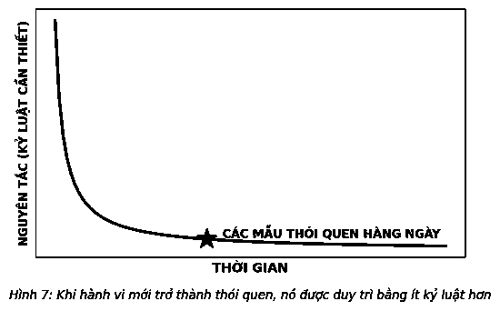

# 6. MỘT LỐI SỐNG CÓ KỶ LUẬT

Người ta thường cho rằng người thành công là “người có kỷ luật” sở hữu một “lối sống có kỷ luật”.

Đó là một lời dối trá.

Sự thật là chúng ta không cần bất cứ kỷ luật nào ngoài những gì chúng ta vốn có. Chúng ta chỉ cần điều khiển và quản lý nó tốt hơn.

> *“Kỷ luật tự giác là một trong những lời đồn đại phổ biến nhất trong nền văn hóa của chúng ta.”*  
> — **Leo Babauta**

Trái với niềm tin của đa số người, thành công không phải là một cuộc chạy đua của hành động có kỷ luật. Thành tích không buộc bạn phải là người luôn có kỷ luật với mọi hành động đều phải được trau chuốt, với sự kiểm soát là giải pháp cho mọi tình huống. Thành công thực sự là một cuộc chạy đua nước rút – được thúc đẩy bởi kỷ luật đủ để trở thành một thói quen giúp bạn làm chủ chính mình và hoàn cảnh.

Khi biết cần phải hoàn thành một việc gì đó nhưng chưa thực hiện được, chúng ta thường lấp liếm rằng, “tôi chỉ cần có kỷ luật hơn nữa”. Trên thực tế, chúng ta cần thói quen làm việc đó. Và chúng ta cần vừa đủ kỷ luật để tạo dựng thói quen.

Trong bất kỳ cuộc thảo luận nào về thành công, từ “kỷ luật” và “thói quen”, thường đan xen nhau. Dù có nghĩa hoàn toàn khác biệt, nhưng chúng gắn bó mật thiết để tạo nền tảng cho thành công – thường xuyên làm một việc gì đó đến khi nó mang lại lợi ích cho bạn. Khi có kỷ luật, bạn đã tự luyện bản thân hành động theo một cách nhất định. Hãy rèn luyện bản thân trong một thời gian đủ để kỷ luật trở thành thói quen. Vì vậy, khi thấy những người có vẻ “có kỷ luật”, bạn đang gặp những người đã tạo dựng được các thói quen trong cuộc sống. Điều này khiến họ có vẻ “có kỷ luật” hơn nhưng thực tế không phải vậy. Không ai là người “có kỷ luật”.

Vậy chúng ta muốn trở thành người như thế nào? Suy nghĩ về việc phải tôi luyện mọi hành vi trở thành thói quen vừa có vẻ bất khả thi vừa vô cùng nhàm chán. Hầu hết mọi người đều sẽ đi đến kết luận này, nhưng, do chẳng còn lựa chọn nào khác, họ phải nỗ lực gấp đôi để thực hiện điều tưởng chừng bất khả thi đó hoặc lẳng lặng từ bỏ. Thất vọng xuất hiện và cuối cùng họ có thể sẽ phải từ bỏ quyền lợi.

Bạn không cần phải trở thành một người có kỷ luật để thành công. Trong thực tế, bạn có thể thành công với rất ít kỷ luật so với tưởng tượng, vì một lý do đơn giản: Thành công là làm việc đúng đắn, thay vì làm đúng mọi việc.

Bí quyết để thành công là lựa chọn đúng thói quen và có đủ kỷ luật để tạo dựng thói quen đó. Đó là tất cả những kỷ luật bạn cần. Khi thói quen này trở thành một phần trong cuộc sống của bạn, bạn sẽ bắt đầu trông giống một người có kỷ luật, nhưng kỳ thực không phải vậy. Bạn sẽ là một người sử dụng kỷ luật có chọn lọc để tạo dựng thói quen mạnh mẽ.

### KỶ LUẬT CÓ CHỌN LỌC RẤT HIỆU QUẢ

Michael Phelps, một vận động viên Olympic về bơi lội, là một ví dụ về kỷ luật được lựa chọn. Khi còn là một đứa trẻ, anh được chẩn đoán mắc chứng ADHD (rối loạn tăng động giảm chú ý), cô giáo mầm non nơi anh theo học đã nói với mẹ anh rằng: *“Michael không thể ngồi yên. Michael không thể yên lặng... Cậu bé không có năng khiếu tự nhiên. Con trai chị sẽ không bao giờ tập trung được vào bất cứ điều gì.”* Bob Bowman, huấn luyện viên của Phelps từ năm cậu 11 tuổi nói rằng Michael đã dành rất nhiều thời gian ở bể bơi bên cạnh các nhân viên cứu hộ và có hành vi gây rối. Hành vi sai trái này cũng có thể xuất hiện bất cứ lúc nào trong cuộc đời anh.

Tuy nhiên, anh đã thiết lập hàng chục kỷ lục thế giới. Năm 2004, anh giành được 6 huy chương vàng và 2 huy chương đồng tại Thế vận hội Athens và sau đó, năm 2008, một kỷ lục 8 huy chương vàng tại Bắc Kinh, đã giúp anh vượt qua huyền thoại Mark Spitz. 18 huy chương vàng của anh đã thiết lập một kỷ lục mới đối với các vận động viên Olympic trong bất kỳ môn thể thao nào. Trước khi giải nghệ, chiến thắng của anh tại Thế vận hội năm 2012 diễn ra tại London đã đưa tổng số huy chương của anh lên con số 22 và mang về cho anh danh hiệu vận động viên Olympic thành công nhất trong lịch sử thể thao. Nói về Phelps, một phóng viên chia sẻ: “Nếu là một quốc gia, anh ấy đã được xếp hạng thứ 12 trong ba Thế vận hội gần đây nhất.” Ngày nay, mẹ anh khẳng định, “khả năng tập trung của Michael khiến tôi vô cùng ngạc nhiên”. Bowman gọi đó là “cá tính mạnh mẽ nhất của anh ấy”. Điều này đã xảy ra như thế nào? Làm sao một cậu bé “không bao giờ có thể tập trung vào bất cứ điều gì” lại đạt được những thành tựu đáng ngưỡng mộ đến vậy?

Phelps trở thành một người có kỷ luật chọn lọc.

Từ năm 14 tuổi đến Thế vận hội Bắc Kinh, Phelps đều luyện tập 7 ngày/tuần, 365 ngày/năm. Anh nghĩ bằng cách tập luyện vào các ngày Chủ nhật, anh có lợi thế cạnh tranh 52 ngày luyện tập. Anh đã dành 6 giờ ở dưới nước mỗi ngày. “Phân bổ nguồn năng lượng là một trong những điểm mạnh của cậu ấy”, Bowman nói. Không phải nói quá khi cho rằng Phelps đã tập trung mọi năng lượng của mình vào một kỷ luật mà sau đó nó đã phát triển thành một thói quen – bơi hằng ngày.

Thành quả có được từ việc phát triển thói quen đúng đắn khá rõ ràng. Nó giúp bạn có được thành công mà bạn đang tìm kiếm. Tuy nhiên, những gì bị bỏ qua đôi khi lại là một vận may tuyệt vời: Nó khiến cuộc sống của bạn trở nên đơn giản hơn. Cuộc sống của bạn rõ ràng và ít phức tạp hơn bởi bạn biết mình phải tập trung làm tốt những gì. Vấn đề là việc hướng tính kỷ luật vào thói quen đúng đắn sẽ buộc bạn phải bỏ qua các lĩnh vực khác, bạn sẽ được giải phóng khỏi việc kiểm soát mọi thứ.

### 66 NGÀY TÌM ĐƯỢC ĐIỂM MẠNH NHẤT

Kỷ luật và thói quen. Thành thật mà nói, hầu hết mọi người đều không bao giờ muốn nói về chuyện này. Hình ảnh những từ ngữ này luôn gợi lên trong đầu chúng ta hơi hướng của sự hà khắc và khó chịu. Chỉ cần đọc chúng đã tạo cho chúng ta cảm giác mệt mỏi. Nhưng thật may, để có được kỷ luật đúng đắn phải đi một chặng đường dài, và các thói quen chỉ khó khăn ở giai đoạn đầu. Sự thật là dần dần, thói quen của bạn ngày càng dễ duy trì hơn. Các thói quen đòi hỏi ít năng lượng và công sức để duy trì hơn lúc bắt đầu (xem Hình 7). Hãy theo đuổi kỷ luật đủ lâu để biến nó thành một thói quen, và hành trình của bạn sẽ trở nên khác biệt. Hãy biến một thói quen trở thành một phần cuộc sống của bạn, bạn sẽ thấy cuộc sống đơn giản hơn nhiều. Thói quen khiến những thứ khó khăn trở nên dễ dàng hơn.

Vậy bạn phải duy trì kỷ luật trong bao lâu? Các nhà nghiên cứu tại Đại học London đã đưa ra câu trả lời. Năm 2009, họ đặt ra câu hỏi: Để có được một thói quen mới mất bao lâu? Họ tìm kiếm thời điểm một hành vi mới tự động ăn sâu vào mỗi người. Điểm “tính tự động” đã xuất hiện khi những người tham gia chiếm 95% đường cong năng lượng và nỗ lực cần thiết để duy trì nó ở mức thấp nhất có thể. Họ đã yêu cầu các sinh viên duy trì chế độ ăn kiêng, tập thể dục trong một khoảng thời gian và theo dõi tiến bộ. Kết quả cho thấy phải mất trung bình 66 ngày để có được một thói quen mới. Số ngày nói chung khoảng từ 18 đến 254 ngày, nhưng 66 ngày đại diện cho điểm mạnh nhất với những hành vi dễ dàng hơn mất ít ngày hơn so với mức trung bình và những hành vi khó mất nhiều thời gian hơn. Các chu kỳ tự lực có xu hướng cho thấy phải mất 21 ngày để thực hiện một sự thay đổi, nhưng khoa học hiện đại không ủng hộ nhận định đó. Chúng ta cần thời gian để tạo dựng những thói quen đúng đắn, vì vậy đừng từ bỏ quá sớm. Quyết định lựa chọn đúng đắn, sau đó đầu tư thời gian cần thiết và áp dụng mọi kỷ luật bạn có để tập trung phát triển nó.

Megan Oaten và Ken Cheng, các nhà nghiên cứu người Australia, thậm chí còn tìm thấy một số bằng chứng về hiệu ứng halo xung quanh việc tạo ra thói quen. Trong các nghiên cứu của họ, những sinh viên đã thành công khi tạo dựng được một thói quen tích cực thường ít căng thẳng, chi tiêu ít bốc đồng, có thói quen ăn uống tốt hơn, hạn chế sử dụng bia rượu, thuốc lá và cà phê; ít xem ti vi hơn, và thậm chí để ít đĩa bẩn hơn. Duy trì kỷ luật đủ lâu về một thói quen không chỉ khiến những việc đó mà cả những việc khác cũng trở nên dễ dàng hơn. Đó là lý do những người có thói quen đúng đắn thường làm tốt hơn những người khác. Họ đang thường xuyên làm điều quan trọng nhất và vì thế mọi thứ khác cũng trở nên dễ dàng hơn.

---

> ### Ý TƯỞNG LỚN
>
> 1. **Đừng trở thành người có kỷ luật.** Hãy là một người của những thói quen lành mạnh và sử dụng kỷ luật chọn lọc để phát triển những thói quen đó.
> 2. **Tạo dựng từng thói quen một.** Thành công là một chuỗi liên tục thay vì diễn ra đồng thời. Không ai thực sự có kỷ luật để có được nhiều thói quen mới tích cực tại một thời điểm. Những người thành công lớn biết sử dụng kỷ luật chọn lọc để phát triển một vài thói quen nổi bật, lần lượt từng thói quen theo thời gian.
> 3. **Đầu tư đủ thời gian cho mỗi thói quen.** Gắn bó mật thiết với kỷ luật đủ lâu để biến nó trở thành thói quen. Trung bình cần 66 ngày để hình thành một thói quen. Một khi thói quen được thiết lập vững chắc, bạn có thể tạo dựng thành quả dựa trên thói quen đó hoặc, nếu phù hợp, hình thành nên thói quen mới.
>
> *Nếu bạn là tổng hòa của những hành động bạn lặp đi lặp lại nhiều lần, thì thành quả không phải hành động bạn làm mà là thói quen bạn rèn luyện trong cuộc sống. Bạn không cần phải tìm kiếm thành công. Hãy khai thác sức mạnh của kỷ luật chọn lọc để tạo dựng các thói quen đúng đắn, và những kết quả đáng kinh ngạc sẽ tìm đến bạn.*
>
> 
