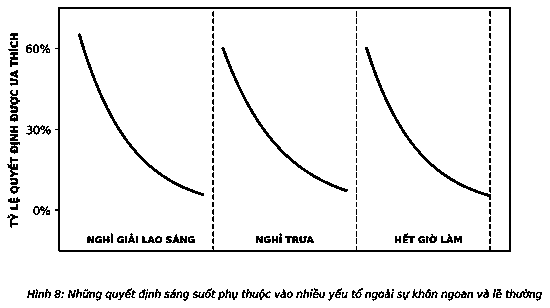

# 7. “CẦN LÀ CÓ, MUỐN LÀ ĐƯỢC” Ý CHÍ

Tại sao bạn từng phải chật vật làm một điều gì đó? Tại sao bạn từng lâm vào một hoàn cảnh hết sức bất lợi, cố lê bước giữa một bên là vách đá, một bên là vực sâu, hoặc cố làm việc gì đó khi tay bị khóa trái sau lưng? Hầu hết mọi người đều vô tình làm điều đó mỗi ngày. Khi trói thành công của mình bằng sức mạnh ý chí của bản thân mà không biết điều gì thực sự có nghĩa, chúng ta đã đặt mình vào thế lưỡng nan. Nhưng chúng ta hoàn toàn có thể đảo ngược tình thế.

> *“Odysseus biết sức mạnh ý chí sẽ tiêu tan khi ông ép phi hành đoàn của mình buộc ông vào cột buồm chiếc thuyền đang được điều khiển bởi những nàng tiên chim quyến rũ.”*  
> — **Patricia Cohen**

Thường được trích dẫn như một tuyên bố về quyết tâm tuyệt đối, câu tục ngữ cổ của Anh “Ở đâu có ý chí, ở đó có con đường” đã nhiều lần bị nhầm lẫn về sức mạnh ý chí. Nó được phát từ miệng, trôi tuột qua đầu chúng ta nhanh chóng đến mức hiếm ai dừng lại để hiểu hết ý nghĩa của nó. Được coi là nguồn lực duy nhất về sức mạnh cá nhân ở mọi nơi, người ta nhầm tưởng nó là “đơn thuốc” thành công duy nhất. Nhưng để có được cách thức hữu hiệu nhất, cần đến nhiều điều hơn thế. Coi sức mạnh ý chí chỉ là một lời kêu gọi nghị lực, bạn sẽ bỏ lỡ yếu tố không kém phần quan trọng khác: Đó là thời cơ – một nhân tố rất quan trọng.

Trong phần lớn cuộc đời mình, tôi không quan tâm nhiều đến sức mạnh ý chí. Một khi tôi đã làm, việc làm đó sẽ thu hút tôi. Khả năng kiểm soát bản thân để xác định hành động là một ý tưởng khá mạnh mẽ. Dựa vào việc rèn luyện và đó được gọi là kỷ luật. Nhưng hãy làm điều đó, đơn giản bởi bạn có khả năng, đó là năng lượng nguồn nguyên sơ của bạn. Sức mạnh của ý chí.

Điều này có vẻ quá đơn giản: Chỉ cần có ý chí, thành công sẽ xuất hiện. Tôi đang đi trên hành trình của mình. Đáng buồn thay, hành trang của tôi không nhiều, vì đó là một chuyến đi ngắn ngày. Khi tôi tìm cách áp đặt ý chí của mình vào những mục tiêu không có khả năng tự vệ, tôi nhanh chóng phát hiện ra một điều gây nản lòng: Không phải lúc nào tôi cũng có ý chí. Sức mạnh ý chí của tôi đến rồi đi như thể nó có một cuộc sống riêng. Tạo dựng thành công xung quanh thế mạnh, ý chí theo nhu cầu của cá nhân được chứng minh là không mang lại hiệu quả. Suy nghĩ ban đầu của tôi là, “Tôi làm sao vậy?” Tôi là một kẻ thua cuộc? Tôi mất hết can đảm. Không có sức mạnh nghị lực. Không có dũng khí. Do đó, tôi dồn tâm sức, quyết tâm, nỗ lực gấp đôi, và đi đến một kết luận khiêm nhường: Sức mạnh ý chí không phải “cần là có, muốn là được”. Mạnh mẽ như động lực, ý chí không chỉ ngồi đợi tôi hô hào, không phải lúc nào cũng ở tư thế sẵn sàng, túc trực để thực hiện bất cứ điều gì tôi muốn. Thật quá đỗi ngạc nhiên, bởi tôi luôn cho rằng nó lúc nào cũng ở đó. Tôi có thể tiếp cận nó bất cứ khi nào, có được bao nhiêu tùy ý. Tôi đã nhầm.

“Cần là có, muốn là được” ý chí là một lời dối trá.

Hầu hết mọi người cho rằng ý chí rất quan trọng, nhưng nhiều người không hoàn toàn đánh giá cao tầm quan trọng của nó với thành công. Một dự án nghiên cứu rủi ro lớn sẽ cho thấy tầm quan trọng thực sự của nó.

### THỬ THÁCH TRẺ NHỎ

Cuối những năm 1960, đầu những năm 1970, nhà nghiên cứu Walter Mischel đã bắt đầu “thử thách” có phương pháp các bé 4 tuổi tại trường mầm non Bing thuộc Đại học Stanford. Hơn 500 trẻ em được tình nguyện đưa vào tham gia chương trình thử thách này bởi chính cha mẹ chúng, nhiều người trong số họ, giống như hàng triệu người khác, đã cười không thương tiếc trước các video quay những đứa trẻ loay hoay, đau khổ. Thí nghiệm độc ác này được gọi là “Thí nghiệm kẹo dẻo”. Đó là một cách thú vị để quan sát sức mạnh ý chí.

Bọn trẻ được đưa cho một trong ba phần thưởng – một chiếc bánh quy xoắn, một chiếc bánh quy dẹt, hoặc một chiếc kẹo dẻo dở tệ. Bọn trẻ được biết các nhà nghiên cứu sẽ phải ra ngoài, và nếu có thể đợi 15 phút đến khi các nhà nghiên cứu quay lại, chúng sẽ được thưởng một chiếc bánh quy dẹt. Một món trước bây giờ hoặc hai món sau đó. (Mischel biết thiết kế các bài kiểm tra hiệu quả khi một vài đứa trẻ muốn từ bỏ ngay khi họ giải thích luật chơi.)

Bị bỏ lại một mình với chiếc kẹo dẻo không được phép ăn, bọn trẻ sử dụng mọi loại chiến lược trì hoãn, từ nhắm mắt, kéo tóc, quay đi, để lơ lửng trước mặt, ngửi và thậm chí vuốt ve món quà. Chúng “kiên trì” được trung bình chưa đầy 3 phút. Và chỉ có 3 trong số 10 đứa trẻ chờ được đến khi các nhà nghiên cứu trở lại. Rõ ràng hầu hết bọn trẻ đều vật lộn trì hoãn “thưởng thức” phần thưởng. Chúng thiếu ý chí.

Ban đầu, không ai cho rằng bất cứ điều gì về thành công hay thất bại trong bài thử nghiệm kẹo dẻo có thể nói về tương lai của một đứa trẻ. Tầm nhìn sâu sắc đó xuất hiện một cách hữu cơ. Những đứa trẻ kiên nhẫn đợi đến khi nhận được món quà thứ hai thường thành công hơn rất nhiều.

Từ năm 1981, Mischel bắt đầu theo dõi một cách có hệ thống các đối tượng ban đầu. Ông thu thập bảng điểm, lưu trữ hồ sơ và gửi bảng câu hỏi để đo tiến độ trong học tập và hành vi xã hội tương ứng của chúng. Linh cảm của ông đã đúng, sức mạnh ý chí hoặc khả năng trì hoãn ham muốn là một chỉ số góp phần rất lớn để tạo dựng thành công trong tương lai. Trong hơn 30 năm sau đó, Mischel và các đồng nghiệp đã công bố nhiều bài viết về cách “những người trì hoãn giỏi” duy trì tình trạng này tốt hơn bằng cách nào. Thành công của cuộc thử nghiệm dự đoán thành tích học tập nói chung cao hơn, coi trọng giá trị bản thân và quản lý căng thẳng tốt hơn. Mặt khác, “những người trì hoãn kém” có khả năng béo phì cao hơn 30% và có khả năng nghiện ma túy cao hơn. Khi mẹ của bạn nói với bạn rằng “mọi điều tốt đẹp chỉ đến với những ai biết chờ đợi”, bà hẳn đã không hề nói đùa.

Ý chí quan trọng đến mức nên liệt kê nó vào một trong những ưu tiên hàng đầu. Thật không may, do không phải lúc nào cũng có sẵn, nên để tận dụng nó tốt nhất bạn buộc phải quản lý nó. Sức mạnh ý chí là một vấn đề về thời gian. Khi có ý chí, bạn sẽ tìm được hướng đi. Mặc dù nghị lực là yếu tố thiết yếu của sức mạnh ý chí, nhưng chìa khóa để khai thác nó lại là thời điểm bạn sử dụng nó.

### NĂNG LƯỢNG TÁI TẠO

Hãy coi ý chí giống như cục pin điện thoại di động của bạn. Bạn bắt đầu mỗi sáng với “pin được sạc đầy”. Bạn sử dụng nó cả ngày. Vì vậy, vạch pin rút ngắn lại, công việc dần được giải quyết, và khi vạch pin báo đỏ, bạn có thể hoàn tất công việc trong ngày. Ý chí có một tuổi thọ hạn chế nhưng có thể được nạp đầy trong khoảng thời gian nhất định và có thể tái tạo. Do nguồn cung hạn chế nên mỗi hành động của ý chí sẽ tạo nên một tình huống thắng thua, trong đó việc sử dụng sức mạnh ý chí để chiến thắng sẽ khiến bạn bị thua trong tương lai vì càng về sau, sức mạnh của ý chí của bạn sẽ càng giảm.

Mọi người đều chấp nhận rằng các nguồn lực hạn chế phải được quản lý, nhưng chúng ta lại không nhận ra rằng sức mạnh ý chí là một trong số đó. Chúng ta hành động như thể nguồn lực sức mạnh ý chí là vô tận. Kết quả là, chúng ta không coi đó là một nguồn tài nguyên cá nhân cần được quản lý, như thức ăn hay giấc ngủ. Điều này nhiều lần đặt chúng ta vào hoàn cảnh khó khăn, khi cần đến ý chí nhất, nó lại không xuất hiện.

Nghiên cứu của Giáo sư Đại học Stanford Baba Shiv cho thấy ý chí của chúng ta chỉ có thể xuất hiện thoáng qua như thế nào. Ông chia 165 sinh viên thành hai nhóm và yêu cầu họ ghi nhớ số có hai hoặc bảy chữ số thập phân. Cả hai nhiệm vụ đều nằm trong khả năng nhận thức của một người bình thường, và họ có thể dùng tối đa thời gian cần thiết. Khi đã sẵn sàng, các sinh viên sẽ sang phòng khác để nhớ lại các con số. Họ ăn nhẹ trước khi tham gia vào nghiên cứu. Có hai lựa chọn là bánh sô-cô-la hoặc một bát sa lát hoa quả – ngon miệng hoặc có lợi cho sức khỏe. Đây là tác nhân kích thích: Các sinh viên được yêu cầu ghi nhớ số có bảy chữ số thập phân gần gấp đôi số người có thể chọn bánh. Chút nhận thức nhỏ này vừa đủ để ngăn chặn một lựa chọn khôn ngoan.

Những tác động của sức mạnh ý chí vô cùng đáng kinh ngạc. Chúng ta càng sử dụng tâm trí nhiều, sức mạnh ý chí càng ít. Ý chí giống một cơ vận động nhanh dẫn đến mệt mỏi và cần được nghỉ ngơi. Nó rất mạnh mẽ, nhưng không có sức chịu đựng dẻo dai. Như Kathleen Vohs mô tả trên tạp chí *Prevention* năm 2009, “Sức mạnh ý chí giống như xăng trong xe của bạn... Khi tăng số, xăng sẽ cạn. Bạn càng ga lớn, xăng càng hết nhanh.” Trong thực tế, tình huống trên với một số có thêm 5 chữ số thập phân nữa sẽ rút cạn ý chí của các sinh viên.

Trong các quyết định khai thác sức mạnh ý chí của chúng ta, thực phẩm cũng đóng một vai trò quan trọng trong các cấp độ sức mạnh ý chí.

### THỰC PHẨM CHO TƯ DUY

Não bộ chiếm 1/50 trọng lượng cơ thể chúng ta nhưng tiêu thụ đến 1/5 lượng calo chúng ta đốt cháy để tạo ra năng lượng. Nếu bộ não là một chiếc xe, xét về mức độ tiêu thụ nhiên liệu, nó tương đương với một chiếc Hummer. Phần lớn các hoạt động có ý thức của chúng ta đang xảy ra ở thùy não trước, một phần của bộ não chịu trách nhiệm cho sự tập trung, xử lý bộ nhớ ngắn hạn, giải quyết vấn đề và quản lý kiểm soát xung động. Đó là trung tâm của những gì biến chúng ta thành con người kiêm trung tâm kiểm soát điều hành và sức mạnh ý chí.

Dưới đây là một thực tế thú vị. Thuyết “vào sau cùng, ra trước tiên” rất có hiệu lực trong đầu chúng ta. Những phần phát triển sau cùng của bộ não chúng ta là phần đầu tiên bị ảnh hưởng nếu có sự thiếu hụt các nguồn dinh dưỡng bổ sung. Càng trưởng thành, các khu vực phát triển hơn của não bộ, như những vùng điều chỉnh hơi thở và các phản ứng thần kinh của chúng ta, được cung cấp máu đầu tiên và hầu như không bị ảnh hưởng nếu chúng ta bỏ bữa. Mặt khác, thùy não trước bị ảnh hưởng lớn nhất. Thật không may, đó là khu vực phát triển sau trên mỗi cơ thể con người, nó có tuổi đời nhỏ nhất.

Một nghiên cứu nâng cao khác cho chúng ta thấy tại sao vấn đề này lại quan trọng đến vậy. Một bài báo năm 2007 trên tạp chí *Personality and Social Psychology* đã chi tiết hóa 9 nghiên cứu riêng biệt về ảnh hưởng của dinh dưỡng và sức mạnh ý chí. Trong một nghiên cứu, các nhà nghiên cứu được giao nhiệm vụ cần đến hoặc không cần đến sức mạnh ý chí và đo lượng đường trong máu trước và sau mỗi nhiệm vụ. Những người sử dụng ý chí trong các nhiệm vụ cho thấy sự sụt giảm đáng kể tỷ lệ đường trong máu. Các nghiên cứu sau đó cho thấy ảnh hưởng của ý chí đến hiệu suất khi hai nhóm cùng hoàn thành một nhiệm vụ liên quan đến sức mạnh ý chí, sau đó thực hiện thêm một nhiệm vụ khác. Giữa các nhiệm vụ, một nhóm được cho dùng một ly nước chanh Kool-Aid ngọt với đường thực (*buzz*) và nhóm khác đã dùng một loại giả dược, nước chanh với Splenda (*buzzkill*). Nhóm dùng giả dược đã mắc gần gấp đôi số lỗi trong bài thi tiếp theo so với nhóm dùng đường thật.

Các nghiên cứu đã kết luận rằng sức mạnh ý chí là một cơ bắp tinh thần không có khả năng phục hồi nhanh chóng. Nếu sử dụng nó vào một việc, bạn sẽ có ít năng lượng có sẵn cho các nhiệm vụ tiếp theo trừ khi bạn tiếp thêm nhiên liệu cho nó. Để làm tốt nhất có thể, chúng ta phải bồi bổ tâm trí của mình, bổ sung năng lượng mới thay cho những năng lượng đã mất hay sử dụng “thực phẩm cho tâm trí”. Các loại thực phẩm gia tăng lượng đường trong máu trong thời gian dài, như carbohydrate và protein phức tạp, trở thành nhiên liệu chọn lọc cho những người thành đạt, hay nói theo nghĩa đen là “những gì bạn ăn”.

### PHÁN XÉT MẶC ĐỊNH

Một trong những thách thức thực sự mà chúng ta gặp phải đó là khi sức mạnh ý chí của chúng ta ở mức thấp, chúng ta có xu hướng rơi vào những hành vi mặc định sẵn. Các nhà nghiên cứu Jonathan Levav của trường Kinh doanh Stanford tại California, cùng với Liora Avnaim-Pesso và Shai Danziger của Đại học Ben Gurion ở Negev, đã tìm ra một cách sáng tạo để điều tra vấn đề này. Họ đã quan sát kỹ lưỡng tác động của sức mạnh ý chí đến hệ thống phóng thích ở Israel.

Các nhà nghiên cứu đã phân tích 1.112 buổi điều trần ban ân xá được giao cho 8 thẩm phán trong khoảng thời gian 10 tháng (tình cờ chiếm tới 40% tổng số yêu cầu tạm tha của Israel trong giai đoạn đó). Tốc độ diễn ra chậm. Các thẩm phán nghe lập luận và mất khoảng 6 phút để đưa ra quyết định về 14 đến 35 lệnh tạm tha mỗi ngày, và họ chỉ ăn 2 bữa – một bữa ăn nhẹ vào buổi sáng và bữa trưa muộn để nghỉ ngơi và tiếp năng lượng. Ảnh hưởng của lịch trình này vô cùng đặc biệt và đáng ngạc nhiên: Vào các buổi sáng và sau mỗi giờ nghỉ, cơ hội người được ân xá đạt mức cao nhất với 65%, và sau đó giảm dần xuống 0 ở cuối mỗi buổi (xem Hình 8).

Kết quả dường như gắn liền với sự giảm sút về tinh thần do quá trình ra quyết định tái lặp. Đây là những quyết định quan trọng đối với những người được ân xá và công chúng nói chung. Rủi ro lớn và nhịp độ liên tục đòi hỏi sự tập trung cao độ của các thẩm phán trong cả ngày. Khi năng lượng của họ cạn kiệt, phán quyết của họ trở thành “lựa chọn mặc định” mà hóa ra không có lợi cho các tù nhân đang tràn đầy hy vọng. Hơn nữa, nếu không cẩn thận, những hành vi mặc định cũng có thể kết tội bạn.

Khi sức mạnh ý chí cạn kiệt, chúng ta đều trở lại với các hành vi mặc định. Điều này đặt ra câu hỏi: Những hành vi mặc định của bạn là gì? Nếu ý chí cạn dần, bạn sẽ làm thế nào? Bạn sẽ tập trung vào công việc đang làm hay để tinh thần xuống dốc dẫn đến mất tập trung? Công việc quan trọng nhất của bạn được thực hiện khi sức mạnh ý chí của bạn suy yếu, hành vi mặc định sẽ xác định mức độ thành quả của bạn? Bạn chắc chắn chỉ đạt được kết quả ở mức trung bình.

### ĐỂ MẮT TỚI SỨC MẠNH Ý CHÍ MỖI NGÀY

Chúng ta đánh mất ý chí không phải bởi chúng ta nghĩ về nó mà vì chúng ta đã không làm vậy. Nếu không coi trọng ý chí, nó có thể đến và đi rất nhanh. Nếu không có chủ đích bảo vệ nó mỗi ngày, chúng ta đều sẽ đi vào ngõ cụt, khó có thể đạt đến thành công.

Giống như các vạch báo pin chuyển từ màu xanh sang màu đỏ, ý chí cũng vậy, nó cũng dần mất đi sức mạnh. Hầu hết mọi người sẽ không có đủ sức mạnh ý chí để vượt qua những thách thức quan trọng nhất mà không bao giờ nhận ra đó là những gì gây khó khăn cho họ. Khi chúng ta coi nó như một nguồn tài nguyên vô hạn, khi không trao cho nó những nhiệm vụ quan trọng nhất, khi không “sạc” nó thường xuyên, chúng ta đã tự đặt mình vào hành trình khó khăn nhất để tiến đến thành công.

Vậy, làm sao bạn có thể tận dụng được tối đa sức mạnh ý chí? Hãy nghĩ về nó. Hãy chú ý đến nó. Hãy tôn trọng nó. Hãy biến việc thực hiện những gì quan trọng nhất là một ưu tiên khi ý chí của bạn ở mức cao nhất. Nói theo cách khác, bạn hãy dành cho nó thời gian nhất định trong ngày.

#### NHỮNG GÌ CẦN ĐẾN Ý CHÍ:
* Thực hiện những hành vi ứng xử mới
* Thanh lọc phiền nhiễu
* Chống lại sự cám dỗ
* Kìm nén cảm xúc
* Hạn chế xung đột
* Thực hiện các bài kiểm tra
* Cố gắng gây ấn tượng với người khác
* Đối mặt với nỗi sợ hãi
* Làm việc bạn không thích
* Lựa chọn lợi ích dài hạn thay vì ngắn hạn

Mỗi ngày, do không nhận ra điều đó, chúng ta thường tham gia vào mọi hoạt động dẫn đến việc rút cạn sức mạnh của ý chí. Ý chí bị cạn kiệt khi chúng ta đưa ra các quyết định tập trung sự chú ý, kìm nén cảm xúc và xung động, hoặc thay đổi hành vi của chúng ta để theo đuổi các mục tiêu. Nó giống như việc bạn lấy một chiếc búa và đập vỡ đường ống dẫn khí. Chẳng bao lâu ý chí rò rỉ khắp mọi nơi và chúng ta chẳng còn chút ý chí nào để dành làm công việc quan trọng nhất. Vì vậy, giống như bất kỳ nguồn lực hạn chế nhưng quan trọng nào khác, sức mạnh ý chí phải được quản lý chặt chẽ.

Thời cơ là điều tiên quyết khi nói đến sức mạnh ý chí. Bạn sẽ cần sức mạnh ý chí ở mức cao nhất để đảm bảo khi đang làm điều đúng đắn, bạn sẽ không để bất cứ điều gì khiến bạn bối rối hoặc sao nhãng. Lúc này, bạn cần có đủ sức mạnh ý chí trong cả ngày để hỗ trợ hoặc tránh phá hoại những gì bạn đã thực hiện. Đó là ý chí bạn cần để thành công. Vì vậy, nếu bạn muốn đạt được hiệu quả cao nhất trong ngày, hãy thực hiện công việc quan trọng nhất của bạn – điều quan trọng nhất càng sớm càng tốt trước khi ý chí của bạn cạn kiệt.

---

> ### Ý TƯỞNG LỚN
>
> 1. **Đừng phân tán mỏng ý chí của bạn.** Bạn có một nguồn cung sức mạnh ý chí hạn chế trong ngày, vì vậy hãy quyết định những gì quan trọng nhất và “để dành” sức mạnh ý chí của bạn cho nó.
> 2. **Theo dõi máy đo lượng ý chí của bạn.** Sức mạnh ý chí mạnh mẽ cần một nguồn cung dồi dào. Đừng để những gì quan trọng nhất bị tổn hại đơn giản chỉ bởi bộ não của bạn đã cạn kiệt năng lượng. Hãy ăn uống đúng cách và bổ sung năng lượng thường xuyên.
> 3. **Cân đối thời gian cho công việc của bạn.** Làm những gì quan trọng nhất đầu tiên mỗi ngày khi ý chí của bạn ở mức cao nhất. Tối đa hóa sức mạnh ý chí đồng nghĩa với việc tối đa thành công.
>
> *Đừng lạm dụng sức mạnh ý chí của bạn. Lập kế hoạch hằng ngày dựa trên cách thức hoạt động của ý chí và để nó trở thành một phần cuộc sống của bạn. Ý chí không phải lúc nào cũng “cần là có, muốn là được”, nhưng khi dùng nó vào những gì quan trọng nhất, bạn hoàn toàn có thể trông cậy vào nó.*
>
> 
