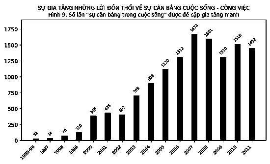
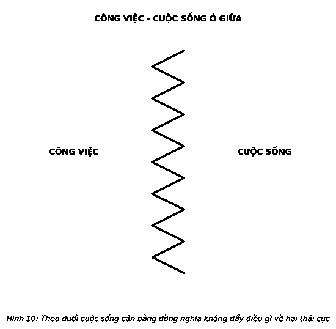
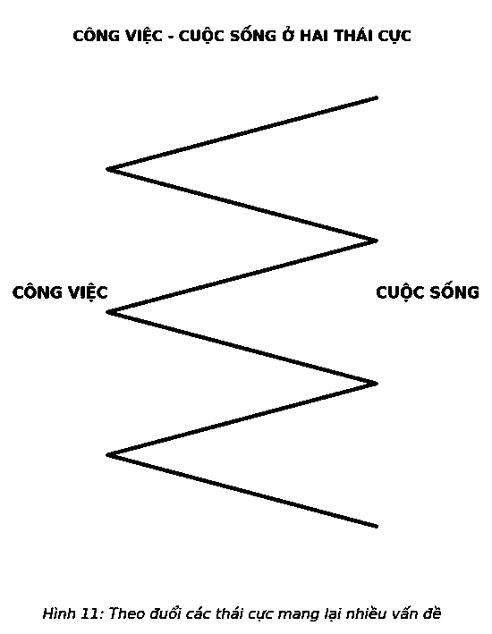
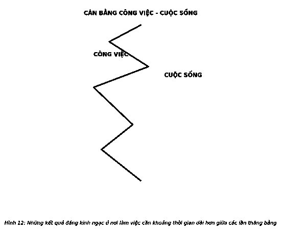

# 8. MỘT CUỘC SỐNG CÂN BẰNG

Không bao giờ tồn tại sự cân bằng tuyệt đối. Dù không cảm nhận được, nhưng những gì xuất hiện như một trạng thái cân bằng là thứ hoàn toàn khác: một hành động cân bằng. Được nhìn nhận như một danh từ, nhưng cân bằng thường được sử dụng dưới dạng động từ. Được xem như một điều gì đó cuối cùng chúng ta cũng đạt được, nên chúng ta ra sức cố gắng để đạt được nó. Một “cuộc sống cân bằng” là một điều chỉ có trong tưởng tượng – một khái niệm sai lầm được hầu hết mọi người chấp nhận như một mục tiêu xứng đáng và có thể đạt được mà không bao giờ dừng lại để thực sự xem xét nó. Tôi muốn các bạn phải xem xét, thách thức, từ chối nó.

Một cuộc sống cân bằng là lời dối trá.

Ý tưởng về sự cân bằng chính xác chỉ mãi là một ý tưởng. Sự cân bằng không tồn tại.

> *“Thực tế, cân bằng chỉ là điều nhảm nhí. Nó là giấc mơ viển vông khó thành. Tìm kiếm sự cân bằng giữa công việc và cuộc sống, như suy nghĩ của chúng ta, không chỉ là một kế hoạch thất bại mà còn là một tư tưởng gây tổn thương và phá hoại.”*  
> — **Keith H. Hammonds**

Đây là điều khó chấp nhận, khó tin, chỉ bởi một trong những than vãn thường xuyên nhất đó là “tôi cần cân bằng hơn”, một câu thần chú phổ biến biện hộ cho những mất mát trong cuộc sống của hầu hết mọi người. Sự cân bằng được nhắc nhiều đến mức tự động cho rằng đó chính xác là những gì chúng ta nên tìm kiếm. Không phải vậy. Mục đích, ý nghĩa, tầm quan trọng – đó là tất cả những gì tạo nên một cuộc sống thành công. Việc tìm kiếm chúng sẽ dẫn bạn đến một cuộc sống mất cân bằng, giúp loại bỏ bất kỳ ranh giới vô hình nào trong quá trình theo đuổi các ưu tiên trong cuộc sống.

Sống một cuộc sống đủ đầy bằng cách dành thời gian cho những điều quan trọng là một hành động cân bằng.

### NGUỒN GỐC CỦA SỰ LẦM TƯỞNG

Trước đây, cân bằng cuộc sống là một đặc ân quan trọng cần cân nhắc chu đáo. Nếu bạn không làm việc – săn bắt, hái lượm, chăn nuôi, trồng trọt – bạn sẽ không thể duy trì cuộc sống. Nhưng mọi thứ đã thay đổi. Tác phẩm giành giải thưởng Pulitzer của Jared Diamond, *Súng, Vi trùng và Thép* đã minh họa hình ảnh các xã hội thuần nông tạo ra một lượng thức ăn dư thừa dẫn đến sự gia tăng tỷ lệ chuyên môn hóa trong công việc như thế nào. “12.000 năm trước, mọi người trên trái đất chỉ chuyên săn bắn hái lượm trong tự nhiên, nhưng giờ đây hầu hết chúng ta đều là những người nông dân tự trồng trọt, chăn nuôi hoặc sử dụng các sản phẩm nông nghiệp đó.” Sự tự do thoát khỏi việc chăn nuôi hoặc trồng trọt cho phép con người trở thành các học giả và thợ thủ công. Một số làm việc để tạo ra lương thực phẩm trong khi những người khác tạo ra các đồ đạc.

Ban đầu, con người làm việc theo nhu cầu và mong muốn của họ. Thợ rèn không phải ở xưởng rèn cho đến 5 giờ chiều; họ có thể về nhà sau khi chân ngựa đã được đóng móng. Sau đó, công cuộc công nghiệp hóa thế kỷ XIX lần đầu tiên được chứng kiến lượng lớn nguồn nhân lực làm thuê. Câu chuyện đã chuyển thành một trong những ông chủ khó chiều, lịch trình làm việc quanh năm, các nhà máy luôn sáng đèn bất kể ngày đêm. Do đó, thế kỷ XX đã chứng kiến sự khởi đầu của phong trào nền tảng quan trọng nhằm bảo vệ người lao động và giới hạn giờ làm.

Tuy nhiên, thuật ngữ “cân bằng công việc - cuộc sống” không xuất hiện cho đến giữa những năm 1980 khi hơn một nửa số phụ nữ đã lập gia đình tham gia vào lực lượng lao động. Để tóm tắt lời nói đầu trong cuốn sách năm 2005 của Ralph E. Gomory, *Being Together, Working Apart: Dual-Career Families and the Work-Life Balance* (tạm dịch: *Sống một nơi, làm hai nơi: Những gia đình hai trụ cột và sự cân bằng công việc - cuộc sống*), một gia đình với một trụ cột và một người nội trợ chuyển thành gia đình có hai trụ cột và không có người nội trợ. Bất cứ ai cũng biết được gia đình kiểu nào sẽ gặp vấn đề với những công việc gia đình ngay từ đầu. Tuy nhiên, đến tận những năm 1990, cân bằng công việc - cuộc sống mới nhanh chóng trở thành một khẩu hiệu chung đối với nam giới. Một cuộc khảo sát của LexisNexis về 100 tờ báo và tạp chí hàng đầu thế giới cho thấy sự gia tăng đáng kể số lượng các bài viết về chủ đề này, từ 32 bài trong giai đoạn 1986-1996 đến 1.674 bài trong năm 2007 (xem Hình 9).

Không phải ngẫu nhiên khi xuất hiện sự gia tăng về công nghệ cùng với sự gia tăng về niềm tin rằng một cuộc sống của chúng ta đang dần mất điều gì đó. Không gian dễ dàng thẩm thấu và các ranh giới mờ nhạt là nguyên nhân dẫn đến hiện tượng đó. Bắt nguồn từ những thách thức thực tế, ý tưởng về sự cân bằng trong công việc và cuộc sống rõ ràng đã nắm bắt được tâm trí và trí tưởng tượng của chúng ta.

### QUẢN LÝ CÂN BẰNG KÉM HIỆU QUẢ

Mong muốn đạt đến sự cân bằng là điều dễ hiểu. Dành đủ thời gian cho mọi việc và mọi việc sẽ được hoàn thành kịp thời. Điều đó nghe có vẻ rất hấp dẫn đến mức chỉ nghĩ đến nó thôi cũng khiến chúng ta cảm thấy thanh thản và bình yên. Sự bình tĩnh này quá thực tế đến mức chúng ta biết đó là một cách sống. Nhưng không phải vậy.

Nếu bạn coi cân bằng là điểm giữa, thì mất cân bằng đồng nghĩa với việc vượt ra xa khỏi điểm này. Đi quá xa khỏi điểm giữa, bạn sẽ tiến về các thái cực. Vấn đề của việc sống ở điểm giữa đó là nó ngăn cản bạn đưa ra những cam kết đặc biệt về thời gian đối với bất cứ điều gì. Khi can dự vào mọi việc, bạn sẽ thấy chúng không được hoàn chỉnh và không gì được cân bằng.

Điều này đôi khi có thể ổn, đôi khi không. Biết rõ khi nào phải theo đuổi điểm giữa và khi nào nên tiến về các thái cực, về bản chất, là sự khởi đầu thực sự khôn ngoan. Những kết quả đáng kinh ngạc sẽ xuất hiện thông qua khả năng đàm phán với thời gian của bạn.

Lý do chúng ta không nên theo đuổi sự cân bằng là bởi sự kỳ diệu không bao giờ diễn ra ở điểm giữa mà ở các thái cực. Tuy nhiên, theo đuổi các thái cực sẽ mang lại nhiều thách thức. Chúng ta đều tự hiểu rằng thành công nằm ngoài các ranh giới, nhưng lại không biết làm thế nào để quản lý cuộc sống khi chúng ta vượt ra khỏi những lằn ranh đó.

Khi làm việc trong một thời gian dài, cuộc sống cá nhân của chúng ta cũng sẽ bị ảnh hưởng. Sa lầy vào niềm tin rằng càng làm nhiều càng tốt, chúng ta thật không công bằng khi đổ lỗi cho công việc bằng lời xảo biện, “Tôi không còn thời gian dành cho cuộc sống.” Thường thì, thực tế hoàn toàn ngược lại. Ngay cả khi không có sự can thiệp của công việc, đời sống cá nhân của chúng ta cũng đầy rẫy những “việc phải làm” để rồi chúng ta cũng lại đi đến cùng một kết luận tương tự: “Tôi không còn thời gian dành cho cuộc sống.”

Và đôi khi chúng ta bị tấn công từ cả hai phía. Chúng ta phải đối mặt với rất nhiều nhu cầu cá nhân lẫn công việc gây ảnh hưởng tiêu cực đến mọi khía cạnh. Sự cố xảy ra, và chúng ta lại một lần nữa tuyên bố, “Tôi không có thời gian dành cho cuộc sống.”

Giống như việc tập trung vào điểm giữa, việc tiến đến các thái cực là loại quản lý cân bằng vô cùng yếu kém diễn ra mọi lúc.

### THỜI GIAN KHÔNG CHỜ ĐỢI AI

Vợ tôi đã từng kể câu chuyện về một người bạn của cô ấy. Mẹ của người bạn đó là một giáo viên và cha cô ấy là một nông dân. Họ đã chắt bóp, sống tằn tiện cả đời để dành tiền dưỡng già và đi du lịch sau khi nghỉ hưu. Người bạn của vợ tôi vẫn nhớ như in các chuyến đi mua sắm thường xuyên với mẹ đến những cửa hàng vải địa phương để chọn vải và các mẫu quần áo. Người mẹ giải thích rằng khi nghỉ hưu, đây sẽ là quần áo để bà đi du lịch.

Bà đã không bao giờ được tận hưởng thời gian nghỉ hưu. Trong năm giảng dạy cuối cùng, bà mắc bệnh ung thư và qua đời. Người cha luôn cảm thấy không thoải mái nếu chi tiêu số tiền họ đã tiết kiệm được, với niềm tin rằng đó là tiền “của họ” và bây giờ bà không còn sống để cùng ông hưởng thụ. Khi ông qua đời, người bạn của vợ tôi đã dọn dẹp nhà cha mẹ mình và phát hiện ra một tủ quần áo đầy đủ các loại vải và mẫu đầm. Người cha đã không bao giờ bỏ chúng đi. Ông không thể. Nó mang quá nhiều ý nghĩa. Chúng chứa đựng quá nhiều lời hứa hẹn chưa thể thực hiện được đến mức không cam tâm bỏ chúng đi.

Thời gian không chờ đợi bất cứ ai. Đẩy một điều gì đó đến một thái cực, sự trì hoãn có thể trở thành vĩnh viễn.

Tôi từng biết một doanh nhân rất thành công đã từng dành cả tuần thậm chí cả ngày cuối tuần cho công việc trong suốt cuộc đời của mình với niềm tin chân thành rằng ông đang làm mọi thứ cho gia đình mình. Một ngày, khi ông nghỉ hưu, họ sẽ tận hưởng thành quả lao động đó, dành nhiều thời gian bên nhau, du lịch và làm tất cả những điều họ vẫn chưa từng thực hiện cùng nhau. Sau nhiều năm xây dựng công ty, ông đã bán nó gần đây và cân nhắc xem sẽ làm gì tiếp theo. Tôi hỏi ông cảm thấy thế nào và ông tự hào tuyên bố rằng ông cảm thấy rất thoải mái. “Khi còn điều hành công ty, tôi hiếm khi ở nhà và gặp mặt gia đình. Vì vậy, giờ đây tôi sẽ dành thời gian nghỉ ngơi bên họ để bù đắp lại thời gian đã mất. Anh hiểu ý tôi chứ? Bây giờ tôi có đủ tiền và thời gian để bù đắp lại những năm đã qua.”

Bạn có thực sự nghĩ mình có thể quay lại câu chuyện được nghe kể trước giờ đi ngủ hay một bữa tiệc sinh nhật thời thơ ấu? Liệu một bữa tiệc của một cậu nhóc 5 tuổi với những người bạn tưởng tượng có giống bữa tối với cậu bé ấy cùng các bạn bè trung học của mình? Liệu một ông bố, bà mẹ ngồi dự trận bóng đá của cậu con trai bé bỏng có giống việc chơi bóng đá với cậu con trai đã trưởng thành của mình? Bạn nghĩ rằng mình có thể thỏa thuận để thời gian đứng yên chờ bạn, trì hoãn bất cứ điều gì quan trọng cho đến khi bạn sẵn sàng thực hiện nó một lần nữa?

Khi đùa giỡn với thời gian, bạn đang đặt cược vào một cuộc chơi mà bạn cầm chắc phần thua. Ngay cả khi bạn chắc chắn mình có thể giành chiến thắng, hãy cẩn thận bởi bạn có thể sẽ sa lầy vào những gì bạn đã đánh mất.

Đùa giỡn với thời gian sẽ dẫn bạn đến chiếc bẫy không lối thoát. Tin vào lời dối trá này sẽ gây hại đến bạn bởi nó thuyết phục bạn làm những điều không nên làm và bỏ qua những điều bạn cần làm. Quản lý cân bằng thiếu hiệu quả có thể là một trong những hành động tiêu cực nhất bạn từng làm.

Vì vậy, nếu việc đạt được sự cân bằng là một lời dối trá, thì bạn sẽ làm gì?

Thay từ “cân bằng” bằng từ “thăng bằng”, trải nghiệm của bạn sẽ hoàn toàn khác biệt. Những gì chúng ta cho là phải cân bằng thực sự chỉ là sự thăng bằng. Các nữ diễn viên múa ba lê là một ví dụ điển hình. Khi đứng bằng đầu mũi chân, họ như nhẹ bẫng, bay trong không trung, tượng trưng cho khả năng cân bằng và sự uyển chuyển. Quan sát gần hơn, chúng ta sẽ thấy các đầu ngón chân của họ rung rất gấp gáp để điều chỉnh và giữ cân bằng. Thăng bằng là hình ảnh minh họa tuyệt vời cho sự cân bằng.

### THĂNG BẰNG: LÂU HAY NHANH

Khi nói rằng chúng ta mất cân bằng, chúng ta thường đề cập đến một cảm giác rằng một số ưu tiên – những điều quan trọng đối với chúng ta – đang hoặc chưa được đáp ứng. Vấn đề là khi tập trung vào những gì thật sự quan trọng, bạn buộc phải bỏ qua nhiều việc khác. Cho dù cố gắng đến đâu, bạn cũng không thể hoàn thành mọi việc vào cuối ngày, tuần, tháng, năm và cuối cuộc đời. Cố gắng làm mọi thứ là hành động điên rồ. Khi những điều quan trọng nhất đã được thực hiện, bạn sẽ vẫn còn nguyên cảm giác mọi thứ vẫn chưa được hoàn thành – cảm giác mất cân bằng. Bỏ ngỏ một số việc là sự lựa chọn cần thiết để có được những kết quả đáng kinh ngạc. Nhưng bạn không thể không hoàn thành mọi việc, đó là lúc sự thăng bằng xuất hiện. Thăng bằng đồng nghĩa với việc bạn không bao giờ đi quá xa đến mức không thể tìm được đường về hoặc ở đó quá lâu đến mức không có gì chờ đợi bạn khi bạn trở về.

Điều này quan trọng đến mức cuộc sống của bạn rất có thể được giữ ở mức thăng bằng. Một nghiên cứu kéo dài 11 năm về gần 7.100 công chức Anh kết luận rằng thời gian làm việc dài thường xuyên có thể gây chết người. Các nhà nghiên cứu cho thấy 67% các cá nhân làm việc hơn 11 giờ một ngày (một tuần làm việc hơn 55 giờ) có khả năng mắc bệnh tim. Thăng bằng không chỉ là về cảm giác hạnh phúc, mà là yếu tố cần thiết đối với hạnh phúc của bạn.

Có hai loại thăng bằng: cân bằng giữa công việc và cuộc sống cá nhân và cân bằng trong công việc hoặc trong cuộc sống cá nhân. Trong thành công về chuyên môn, vấn đề không phải lượng thời gian bạn đầu tư mà là thời gian tập trung liên tục. Để đạt được kết quả đáng kinh ngạc, bạn phải chọn những gì quan trọng nhất và đầu tư tối đa thời gian cho nó. Việc này đòi hỏi sự mất cân bằng hoàn toàn trong mối quan hệ tương quan với mọi việc khác, thay vào đó là sự thăng bằng không thường xuyên để làm rõ chúng. Trong thế giới riêng của mỗi người, nhận thức là yếu tố tiền quyết. Nhận thức về tinh thần và cơ thể, nhận thức về gia đình và bạn bè, nhận thức về nhu cầu cá nhân – bạn không thể bỏ qua bất cứ điều nào trong những điều này nếu muốn “sống”, vì vậy bạn sẽ không bao giờ được từ bỏ họ vì công việc hoặc vì một điều nào khác. Bạn có thể di chuyển qua lại nhanh chóng giữa những điều này và thậm chí kết hợp các hoạt động xung quanh chúng, nhưng bạn không thể bỏ bê bất kỳ ai quá lâu. Cuộc sống cá nhân của bạn đòi hỏi sự thăng bằng chặt chẽ.

Mất cân bằng hay không thực sự là một vấn đề nghi vấn. Câu hỏi đặt ra là: “Bạn bước ngắn hay dài?” Trong đời sống cá nhân, hãy bước những bước ngắn và tránh những khoảng thời gian dài có thể gây mất cân bằng. Bước đi ngắn cho phép bạn kết nối với mọi thứ quan trọng nhất và quy tụ chúng lại. Trong công việc, đi bước dài và hòa hoãn với ý tưởng rằng việc theo đuổi những kết quả đáng kinh ngạc có thể khiến bạn mất cân bằng trong thời gian dài. Đi từng bước dài cho phép bạn tập trung vào những gì quan trọng nhất, thậm chí bằng mọi giá với ít các ưu tiên hơn. Trong cuộc sống cá nhân, bạn không được phép bỏ lại bất cứ điều gì ở phía sau. Nhưng trong công việc, việc chọn lọc là điều cần thiết.

Trong cuốn tiểu thuyết của mình, *Suzanne's Diary for Nicholas* (tạm dịch: *Nhật ký của Suzanne dành cho Nicolas*), James Patterson đã khéo léo làm nổi bật các ưu tiên của chúng ta trong hành động cân bằng cuộc sống và công việc: “Hãy tưởng tượng cuộc sống là một trò chơi mà trong đó bạn đang tung hứng 5 quả bóng. Các quả bóng có tên công việc, gia đình, sức khỏe, bạn bè và sự toàn vẹn. Bạn thường xuyên tung 5 quả bóng này. Nhưng đến một ngày, bạn hiểu ra rằng công việc là một quả bóng cao su. Nếu bạn đánh rơi nó xuống đất, nó sẽ nảy lên. Bốn quả bóng khác gồm gia đình, sức khỏe, bạn bè, sự toàn vẹn được làm bằng thủy tinh. Nếu bạn trượt tay, chúng sẽ vỡ toang.”

### CUỘC SỐNG LÀ MỘT HÀNH ĐỘNG CÂN BẰNG

Câu hỏi về sự cân bằng thực sự là một câu hỏi về sự ưu tiên. Khi thay đổi ngôn ngữ từ cân bằng sang ưu tiên, bạn sẽ thấy các lựa chọn của mình rõ ràng hơn và giúp mở ra cánh cửa để thay đổi số phận. Những kết quả khác biệt buộc bạn phải đưa ra các ưu tiên và hành động dựa trên nó. Khi hành động dựa trên các ưu tiên, bạn sẽ tự động thoát ra khỏi sự cân bằng, dành thời gian cho việc này nhiều hơn việc khác. Thách thức sau đó không phải là việc mất cân bằng, bởi trong thực tế, bạn buộc phải vậy. Thách thức nằm ở thời gian bạn dành cho điều được ưu tiên. Để làm rõ các ưu tiên ngoài công việc, cần xác định rõ ưu tiên công việc quan trọng nhất để thực hiện nó. Sau đó nắm rõ những ưu tiên của bạn tại nhà để có thể trở lại nơi làm việc.

Khi phải làm việc, hãy làm việc, và khi cần nghỉ ngơi, hãy nghỉ ngơi. Bạn sẽ “chơi với trên dây” nếu để những ưu tiên của mình bị lộn xộn.

---

> ### Ý TƯỞNG LỚN
>
> 1. **Hãy cân nhắc cả hai bên cán cân.** Đặt công việc và cuộc sống cá nhân vào hai bên đĩa cân – không phải để phân biệt chúng, mà chỉ để giữ thăng bằng. Mỗi bên đều có các mục tiêu và cách tiếp cận thăng bằng riêng.
> 2. **Giữ thăng bằng trong công việc của bạn.** Quan sát công việc trong mối tương quan với các kỹ năng hoặc kiến thức cần phải trau dồi, mài giũa. Việc này sẽ khiến bạn phải phân bổ thời gian không cân xứng cho điều quan trọng nhất và để những công việc khác trong ngày, tuần, tháng, năm liên tục rơi vào trạng thái mất cân bằng. Mảng công việc được chia thành hai khu vực riêng biệt – điều quan trọng nhất và những việc còn lại. Bạn sẽ phải đẩy những gì quan trọng đến các thái cực, phần còn lại sẽ ổn thỏa. Thành công trong công việc là vậy.
> 3. **Giữ thăng bằng cuộc sống cá nhân của bạn.** Thừa nhận rằng cuộc sống của bạn có nhiều mảng khác nhau và mỗi mảng cần sự quan tâm tối thiểu để cảm nhận rằng bạn đang “có một cuộc sống ý nghĩa”. Bỏ sót bất kỳ lĩnh vực nào, bạn sẽ thấy hậu quả ngay lập tức. Điều này đồng nghĩa với việc bạn phải luôn để mắt đến mọi thứ. Bạn không bao giờ được đi quá dài hoặc quá xa mà không giữ chúng thăng bằng sao cho chúng đều là các lĩnh vực hoạt động tích cực trong cuộc sống của bạn. Cuộc sống cá nhân của bạn cần điều đó.
>
> *Hãy bắt đầu làm chủ cuộc sống thăng bằng của bạn. Hãy làm những việc cần ưu tiên trước.*  
> *Cuộc sống khác biệt là một hành động giữ thăng bằng.*
>
> 
