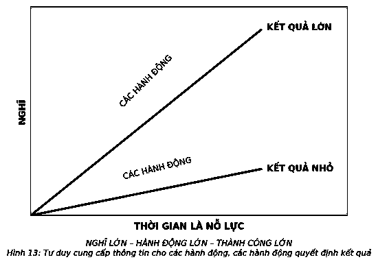
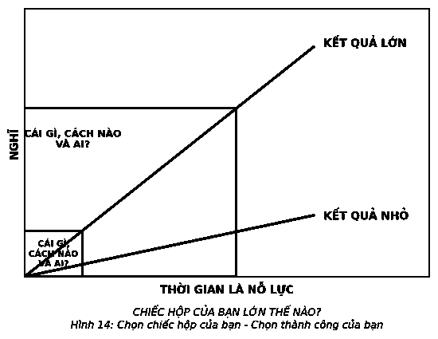

# 9. LỚN THÌ KHÔNG TỐT

Từ các câu chuyện cổ tích đến các bài hát dân ca đều cho rằng lớn và không tốt luôn song hành và trở thành một chủ đề phổ biến xuyên suốt lịch sử đến nỗi nhiều người nghĩ rằng chúng là từ đồng nghĩa. Thực tế, không phải vậy. Lớn có thể không tốt, không tốt có thể lớn, nhưng chúng không phải là một và không giống nhau.

Một cơ hội lớn tốt hơn một cơ hội nhỏ, nhưng một vấn đề nhỏ tốt hơn một vấn đề lớn. Lớn và xấu không gắn chặt với nhau.

> *“Chúng ta không thực hiện được mục tiêu của mình, không phải do trở ngại mà do con đường thông thoáng dẫn đến một mục tiêu thấp hơn dự định.”*  
> — **Robert Brault**

Lớn thì không tốt là một lời dối trá.

Đó là lời dối trá tồi tệ nhất bởi nếu bạn sợ thành công lớn, thì bạn vừa né tránh nó vừa không nỗ lực để đạt được nó.

### AI SỢ LỚN THÌ KHÔNG TỐT?

Đặt những thứ lớn và các kết quả vào cùng một phòng nhiều người đi lại và chọn lọc. Khi nhắc đến thành tích lớn, suy nghĩ đầu tiên của họ là khó khăn, phức tạp và tốn thời gian. Khó đạt được điều đó và phức tạp khi thực hiện là các quan điểm của họ. Căng thẳng và đáng sợ là những gì họ cảm nhận. Vì lý do nào đó họ lo ngại rằng thành công lớn mang theo áp lực và căng thẳng, rằng việc theo đuổi chúng sẽ đánh cắp thời gian bên gia đình và bạn bè, và lấy đi cả sức khỏe của họ. Không chắc chắn về điều đúng đắn giúp mang lại được thành tựu to lớn, hoặc sợ thất bại, họ quay cuồng trong suy nghĩ về nó và nghi ngờ khả năng đạt được thành công to lớn.

Tất cả những điều này củng cố những lo lắng về thành công lớn. Những cảm giác đó được gọi là *megaphobia* – nỗi sợ hãi vô lý về thành công lớn.

Khi coi lớn là không tốt, chúng tôi đã thu hẹp tư duy lại. Việc hạ thấp tiêu chuẩn của chúng ta sẽ mang lại cảm giác an toàn hơn. Ở nguyên vị trí hiện tại khiến chúng ta cảm thấy yên tâm hơn. Nhưng ngược lại: Khi lớn được cho là không tốt, các quy tắc nghĩ nhỏ sẽ chi phối bạn và khả năng nghĩ lớn bị đè nén hoàn toàn.

### HOÀN TOÀN SAI LẦM

Có bao nhiêu con thuyền không được hạ thủy do niềm tin rằng trái đất này phẳng? Bao nhiêu tiến bộ đã bị cản trở bởi con người cho rằng không thể thở dưới nước, bay trong không trung hoặc du hành vào vũ trụ? Trong lịch sử, chúng ta đã tiến hành những động thái ít ỏi để ước tính các giới hạn của bản thân. Tuy nhiên, tin tốt là khoa học không phải sự phán đoán mà là nghệ thuật của sự tiến bộ.

Và cuộc sống của bạn cũng vậy.

Không ai trong số chúng ta biết được giới hạn của mình. Các ranh giới có thể rõ ràng trên bản đồ, nhưng khi chúng ta áp dụng vào cuộc sống, chúng lại trở nên mập mờ. Khi được hỏi liệu nghĩ lớn có khả quan, tôi đáp: “Hãy để tôi hỏi anh một câu: Anh biết các giới hạn của mình là gì chứ?” “Không”, người đặt câu hỏi đáp. Vì vậy, tôi cho rằng câu hỏi đó không thích hợp. Không ai biết giới hạn thành tích tương lai của mình, vì vậy lo lắng về nó sẽ chỉ gây lãng phí thời gian. Chuyện gì sẽ xảy ra nếu ai đó nói rằng bạn không bao giờ có thể vượt qua một giới hạn nào đó? Rằng bạn được yêu cầu vượt qua một giới hạn cao hơn mức “nào đó”? Bạn sẽ chọn mức nào? Mức thấp hay cao hơn? Tôi nghĩ rằng chúng ta biết rõ câu trả lời. Trong tình huống này, tất cả chúng ta đều sẽ làm điều tương tự – chọn mức cao hơn. Bởi bạn không muốn giới hạn mình.

Khi cho phép bản thân chấp nhận thử thách lớn, bạn sẽ nhìn nhận nó theo hướng khác biệt.

Trong bối cảnh này, lớn là phần giữ chỗ cho những gì bạn có thể gọi là bước nhảy vọt về khả năng. Đó là khả năng một nhân viên tập sự hình dung về vị trí của mình trong phòng họp ban giám đốc hoặc một người nhập cư không xu dính túi mường tượng ra một cuộc cách mạng kinh doanh. Đó là khả năng các ý tưởng táo bạo có thể đe dọa đến các vùng thoải mái của bạn nhưng đồng thời cũng phản ánh cơ hội lớn nhất của bạn. Tin tưởng vào sự to lớn giúp bạn tự do đặt ra các câu hỏi đa dạng, đi theo những con đường khác nhau và thử sức với những điều mới mẻ. Điều này sẽ dẫn đến các khả năng chưa được đánh thức trong bạn.

Sabeer Bhatia đến Mỹ với 250 đô-la trong túi, nhưng ông không hề đơn độc. Sabeer có những kế hoạch lớn lao và niềm tin rằng ông có thể phát triển một doanh nghiệp tăng trưởng nhanh hơn bất kỳ doanh nghiệp nào trong lịch sử. Và ông đã làm được điều đó. Ông đã tạo ra Hotmail. Microsoft, một nhân chứng đối với sự phát triển nhanh chóng của Hotmail, cuối cùng đã mua lại công ty này với giá 400 triệu đô-la.

Theo cố vấn của ông, Farouk Arjani, thành công của Sabeer liên quan trực tiếp đến khả năng dám nghĩ lớn. “Những gì khiến Sabeer khác biệt so với hàng trăm doanh nhân tôi đã gặp nằm ở khát khao cháy bỏng của ông. Thậm chí, ngay cả trước khi có một sản phẩm, trước khi có vốn đầu tư, ông đều tin rằng mình sẽ xây dựng được một công ty lớn trị giá hàng trăm triệu đô-la. Ông không có ý định xây dựng một công ty tầm thường như các công ty tại Thung lũng Silicon. Và qua thời gian, tôi nhận ra, thật đáng kinh ngạc, ông đã làm được điều đó.”

Đến năm 2011, Hotmail được xếp là một trong những nhà cung cấp dịch vụ e-mail trực tuyến thành công nhất thế giới, với hơn 360 triệu người sử dụng.

### ĐI BƯỚC LỚN

Nghĩ lớn là việc làm rất cần thiết để đạt được những kết quả đáng kinh ngạc. Thành công đòi hỏi hành động, và hành động đòi hỏi suy nghĩ. Nhưng những hành động duy nhất trở thành bàn đạp cho thành công lớn là những hành động được dẫn lối bởi khả năng nghĩ lớn. Hãy để mắt đến mối liên hệ này, và tầm quan trọng của khả năng nghĩ lớn sẽ xuất hiện.

Ai cũng có lượng thời gian như nhau và công việc khó khăn vẫn là công việc khó khăn. Kết quả là, những gì bạn làm trong thời gian làm việc quyết định thành quả bạn đạt được. Và do những gì bạn làm bị chi phối bởi những gì bạn nghĩ, nên khả năng nghĩ lớn sẽ trở thành bệ phóng cho mức độ thành công của bạn.

Hãy suy nghĩ về điều đó theo cách này. Mỗi cấp thành tích đòi hỏi sự kết hợp của những gì bạn làm, cách bạn thực hiện chúng, và những người cùng làm với bạn. Vấn đề là sự kết hợp những gì, cách nào, và với ai đưa bạn đến một mức độ thành công nhất định sẽ không tự nhiên phát triển thành sự kết hợp cấp cao hơn dẫn đến thành công tiếp theo cũng ở cấp cao hơn. Làm việc gì đó theo cách sáng tạo giúp thực hiện việc gì đó tốt hơn, và một mối quan hệ với một người cũng không tự động thiết lập bước đệm cho mối quan hệ tốt đẹp hơn với người khác. Không may thay, những điều này không được xây dựng dựa trên nhau. Nếu học làm điều gì đó theo một cách, lần lượt và với một tập hợp các mối quan hệ, bạn sẽ đạt được thành tựu lớn hơn. Đó là lúc bạn khám phá ra bạn vừa tạo ra một giới hạn giả về thành tích khó có thể vượt qua cho chính mình. Trong thực tế, bạn đã tự kìm hãm bản thân dù có một cách rất đơn giản để tránh nó. Hãy mạnh dạn nghĩ lớn nhất có thể và dựa trên những gì bạn làm, cách bạn thực hiện và người cùng làm với một mức thành công nhất định. Bạn có thể mất cả cuộc đời mới có thể chạm đến các giới hạn của chiếc hộp lớn đến vậy.

Khi mọi người nói về khả năng “tái tạo” sự nghiệp hoặc doanh nghiệp của họ, những chiếc hộp nhỏ thường là nguyên nhân sâu xa của vấn đề. Những gì bạn xây dựng hôm nay hoặc sẽ trao quyền hoặc hạn chế bạn trong tương lai. Nó sẽ trở thành bước đệm cho các cấp độ thành công tiếp theo của bạn hoặc như một chiếc bẫy chờ trực bạn dù bạn ở bất kỳ đâu.

Những suy nghĩ lớn cung cấp cho bạn cơ hội tốt nhất để đạt được những kết quả đáng kinh ngạc hôm nay và trong tương lai. Khi Arthur Guinness thành lập nhà máy ủ bia đầu tiên của mình, ông đã ký một hợp đồng thuê địa điểm 9.000 năm. Khi J. K. Rowling viết *Harry Potter*, bà đã nghĩ lớn và dành 7 năm tại trường Hogwarts trước khi viết chương đầu tiên của bộ truyện 7 cuốn. Trước khi Sam Walton mở cửa hàng Wal-Mart đầu tiên, ông đã hình dung ra một doanh nghiệp lớn đến mức ông cảm thấy cần phải đi trước một bước và đưa ra kế hoạch bất động sản tương lai của mình nhằm hạn chế thuế thừa kế. Nhờ nghĩ lớn, rất lâu trước khi ông biến công ty thành doanh nghiệp lớn thực sự, ông đã tiết kiệm cho gia đình mình khoảng từ 11 đến 13 tỷ đô-la các loại thuế bất động sản.

> *“Các bậc thang không bao giờ là nơi dừng chân, mà chỉ giữ chân một người đủ lâu để anh ta có thể tiến lên nấc thang cao hơn.”*  
> — **Thomas Henry Huxley**

Nghĩ lớn không chỉ cần thiết trong kinh doanh. Candace Lightner đã thành lập Mother Against Drunk Driving (MADD) vào năm 1980 sau khi con gái bà thiệt mạng trong một vụ tai nạn xe và người lái xe say rượu gây tai nạn rồi bỏ trốn. Ngày nay, MADD đã cứu được hơn 300.000 sinh mạng. Khi lên 6 tuổi vào năm 1998, Ryan Hreljac được truyền cảm hứng bởi những câu chuyện của cô giáo về việc góp phần mang nước sạch tới châu Phi. Ngày nay tổ chức của ông, Ryan's Well, đã cải thiện các điều kiện và giúp đưa nước sạch đến hơn 750.000 người tại 16 quốc gia. Derreck Kayongo đã nhận ra cả các giá trị bỏ phí và giá trị tiềm ẩn trong việc đưa xà phòng mới vào các khách sạn mỗi ngày. Vì vậy, trong năm 2009, ông tạo ra Dự án Xà phòng toàn cầu, chịu trách nhiệm cung cấp hơn 250.000 bánh xà phòng tại 21 quốc gia, giúp hạn chế tỷ lệ tử vong ở trẻ em đơn giản bằng cách cho người nghèo có cơ hội được rửa tay.

Những câu hỏi lớn có thể khó trả lời. Các mục tiêu lớn có vẻ khó đạt được từ đầu. Tuy nhiên, đã bao lần bạn lập kế hoạch làm một việc gì tiềm năng khả thi ngay tức khắc, chỉ để phát hiện ra rằng nó dễ thực hiện hơn nhiều so với bạn nghĩ? Đôi khi mọi chuyện dễ dàng hơn chúng ta tưởng, nhưng thành thực mà nói, đôi khi chúng cũng gây khó khăn hơn nhiều. Đó là khi việc nhận ra trên cuộc hành trình tiến đến những thành công lớn lao rất quan trọng, bạn sẽ nhận được những thành quả lớn hơn. Thành công lớn cần sự phát triển, và một khi bạn đạt được nó, bạn cũng sẽ gây dựng được vị thế lớn hơn! Suy nghĩ, kỹ năng, mối quan hệ, cảm giác của bạn về những gì có thể xảy ra và những gì cần thiết sẽ dần lớn lên trên hành trình tiến đến sự lớn lao.

Bạn càng trải nghiệm thử thách lớn, bạn càng thành công lớn.

### VỤ THỎA THUẬN QUAN TRỌNG

Trong hơn 4 thập kỷ, Carol S. Dweck, nhà tâm lý học Stanford đã nghiên cứu về ảnh hưởng trực tiếp từ quan niệm đến hành động của chúng ta như thế nào. Nghiên cứu của cô đã mang lại cái nhìn sâu sắc về lý do tại sao việc nghĩ lớn lại là một vụ thỏa thuận lớn đến vậy.

Nghiên cứu của Dweck với đối tượng trẻ em tiết lộ hai kiểu tư duy về hành động – tư duy “khả biến” ở những trẻ thường nghĩ lớn và tìm kiếm sự tăng trưởng và trẻ có tư duy “bất biến” đặt ra các giới hạn giả và né tránh thất bại. Theo cô, các sinh viên có tư duy khả biến đã sử dụng những chiến lược học tập tốt hơn, cần ít sự giúp đỡ hơn, bỏ ra ít nỗ lực tích cực hơn, và có thành tích cao hơn so với các bạn đồng môn có tư duy bất biến. Họ ít phải đặt ra các giới hạn trong cuộc sống và có nhiều cơ hội tiếp cận tiềm năng của mình.

Dweck chỉ ra rằng các loại tư duy có thể và chắc chắn sẽ tạo ra sự thay đổi. Giống như bất kỳ thói quen nào khác, bạn đặt tâm trí mình vào đó đến khi tư duy đúng đắn thực sự trở thành thói quen.

Khi Scott Forstall bắt đầu tuyển dụng nhân tài cho đội ngũ mới thành lập của mình, ông cảnh báo rằng dự án tối mật sẽ cung cấp nhiều cơ hội “mắc sai lầm và tranh đấu, nhưng chúng ta sẽ làm một điều gì đó vang danh trong cuộc đời”. Ông đưa ra ý tưởng gây tò mò này tới các “siêu sao” trong toàn công ty, nhưng chỉ chọn những người chấp nhận thử thách ngay lập tức. Ông tìm kiếm những người có tư duy “khả biến”, như ông chia sẻ với Dweck sau khi đọc cuốn sách của cô. Dù bạn có thể không bao giờ nghe về Forstall, nhưng chắc chắn bạn biết những gì nhóm ông tạo ra. Forstall là Phó Chủ tịch cấp cao của Apple, và đội của ông đã tạo ra thứ mà các bạn vẫn gọi là iPhone.

### THỔI BÙNG NGỌN LỬA CUỘC SỐNG CỦA BẠN

Lớn tượng trưng cho sự vĩ đại – những kết quả đáng kinh ngạc. Theo đuổi một cuộc sống lớn đồng nghĩa với việc bạn đang theo đuổi cuộc sống vĩ đại nhất theo quan điểm của bạn. Để sống lớn, bạn phải nghĩ lớn. Bạn phải cởi mở với khả năng rằng cuộc sống của bạn và những gì bạn thực hiện có thể trở nên vĩ đại. Thành tích và sự giàu có xuất hiện là kết quả tất yếu của những việc làm đúng đắn bất chấp các giới hạn.

Đừng sợ lớn. Hãy sợ sự tầm thường. Sợ sự hoang phí. Hay sợ không được sống cuộc sống đầy đủ nhất theo quan điểm của bạn. Khi sợ lớn, chúng ta sẽ vô tình hoặc cố ý chống lại nó. Chúng ta có thể không đạt được kết quả và cơ hội như mong muốn hoặc chỉ đơn giản là chạy thoát khỏi những thành công và cơ hội lớn. Nếu can đảm không phải là sự thiếu vắng của sợ hãi, hãy vượt qua nó, nếu nghĩ lớn không phải là sự vắng mặt của những hồ nghi, hãy vượt qua chúng. Sống lớn cho phép bạn trải nghiệm cuộc sống thực sự và tiềm năng sự nghiệp to lớn.

---

> ### Ý TƯỞNG LỚN
>
> 1. **Hãy nghĩ lớn.** Tránh kiểu tư duy cố định thay vào đó, chỉ đơn giản đặt ra câu hỏi: “Tôi phải làm gì tiếp theo?” Lúc này, tốt nhất bạn chậm rãi hướng đến thành công và tệ nhất là đang ở giai đoạn khó khăn. Hãy đặt ra các câu hỏi lớn hơn. Quy tắc ngón tay cái là tăng gấp đôi mục tiêu trong cuộc sống của bạn. Nếu mục tiêu của bạn là 10, hãy đặt câu hỏi: “Làm thế nào tôi có thể đạt được 20?” Đặt ra mục tiêu xa hơn những gì bạn muốn để xây dựng được một kế hoạch đảm bảo mục tiêu ban đầu của bạn một cách có cơ sở.
> 2. **Đừng gọi từ thực đơn.** Chiến dịch quảng cáo “Tư duy khác biệt” nổi tiếng của Apple năm 1997 có biểu tượng giống như Ali, Dylan, Einstein, Hitchcock, Picasso, Gandhi, và những người “quan sát mọi thứ dưới góc nhìn khác biệt” và những người tiếp tục nỗ lực biến đổi thế giới. Vấn đề là họ không chọn các tùy chọn có sẵn, họ tưởng tượng ra những kết quả mà không ai khác có thể nghĩ ra. Họ “bỏ qua trình đơn và đặt hàng” từ sự sáng tạo của mình. Như quảng cáo nhắc nhở chúng ta, “Những người đủ điên rồ để nghĩ rằng họ có thể thay đổi thế giới là những người duy nhất làm được điều đó.”
> 3. **Hành động táo bạo.** Những suy nghĩ lớn lao không thể tách biệt khỏi các hành động táo bạo. Mỗi khi được hỏi một câu hỏi lớn, hãy dừng lại để tưởng tượng ra cuộc sống của bạn sẽ ra sao với câu trả lời đó. Nếu vẫn không thể tưởng tượng ra, hãy học hỏi những người đã đạt được nó. Các mô hình, hệ thống, thói quen và mối quan hệ của những người khác, những người đã tìm thấy câu trả lời là gì? Giống như việc chúng ta muốn tin rằng tất cả chúng ta đều khác biệt, những gì hiệu quả đối với người khác sẽ luôn hiệu quả đối với chúng ta.
> 4. **Không sợ thất bại.** Thất bại là một phần của cuộc hành trình dẫn đến những kết quả mang tên thành công. Áp dụng tư duy tăng trưởng, và để nó dẫn lối cho bạn. Những kết quả đáng kinh ngạc không chỉ được xây dựng hoàn toàn dựa trên chính nó. Chúng còn được hình thành dựa trên cả những thất bại. Trong thực tế, chúng ta thất bại để thành công. Khi thất bại, chúng ta dừng lại, tự hỏi bản thân cần làm gì để thành công, học hỏi từ những sai lầm của chúng ta, và tiến bước. Hãy xem thất bại như là một phần của quá trình học hỏi và tiếp tục phấn đấu để đạt được tiềm năng thực sự của bạn.
>
> *Đừng để những suy nghĩ nhỏ mọn hạn chế các phạm vi cuộc sống của bạn. Hãy nghĩ lớn, đề ra mục tiêu cao và hành động táo bạo. Và xem bạn có thể thổi bùng ngọn lửa cuộc sống của mình như thế nào.*
>
> 
