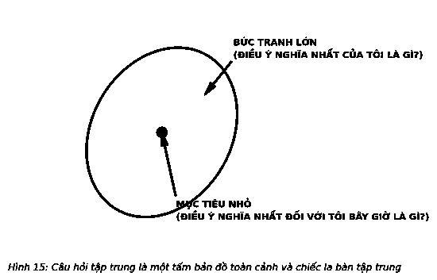

# 10. CÂU HỎI TẬP TRUNG

Vào ngày 23/6/1885, tại thành phố Pittsburgh, bang Pennsylvania, Andrew Carnegie đã có bài nói chuyện với các sinh viên của Đại học Thương mại Curry. Tại đỉnh cao thành công trong sự nghiệp kinh doanh, Công ty Thép Carnegie là doanh nghiệp công nghiệp lớn nhất và thu lợi nhuận lớn nhất trên thế giới. Carnegie sau này trở thành người giàu thứ hai trong lịch sử, chỉ sau John D. Rockefeller. Bài nói chuyện của Carnegie có tựa đề “Hành trình kinh doanh thành công”, ông đã chia sẻ về cuộc sống của mình như một doanh nhân thành đạt và đưa ra lời khuyên:

> *“Có một nghệ thuật giúp xóa bỏ sự hỗn độn và tập trung vào những gì quan trọng nhất. Nó rất đơn giản và có thể nhượng lại được. Nó chỉ đòi hỏi sự can đảm dám chọn một cách tiếp cận khác.”*  
> — **George Anders**

*“Điều kiện tiên quyết để thành công, một bí mật vĩ đại nằm ở khả năng tập trung toàn bộ năng lượng suy nghĩ và nguồn vốn của bạn vào công việc mà bạn đang thực hiện. Bắt đầu với một việc, nỗ lực với việc đó và dẫn đầu nó, thông qua mọi cải tiến, có cơ chế tốt nhất và am hiểu nhiều nhất về nó. Những mối quan tâm không được thực hiện là những mối quan tâm đã phân tán nguồn lực của họ, đồng nghĩa với việc dàn mỏng sự tập trung. Họ đầu tư vào nhiều việc, ở nhiều nơi. ‘Đừng để tất cả trứng vào một giỏ’ là ý tưởng hoàn toàn sai lầm. Tôi khuyên bạn nên ‘đặt tất cả trứng vào một giỏ, và sau đó hãy trông chừng chiếc giỏ đó’. Hãy nhìn quanh và chú ý; những người làm vậy, hiếm khi thất bại. Việc quan sát và xách một giỏ trứng rất đơn giản. Nhưng nếu bạn mang vác quá nhiều, khả năng bạn đánh vỡ hết số trứng sẽ rất cao.”*

Vì vậy, làm thế nào để bạn chọn đúng giỏ? Một câu hỏi tập trung rất hay.

Mark Twain cũng đồng tình với Carnegie về quan điểm này:

*“Bí mật giúp tiến lên phía trước nằm ở khả năng bắt đầu đặt những bước đi đầu tiên. Để bắt đầu, hãy chia các nhiệm vụ quá phức tạp thành các nhiệm vụ nhỏ có thể quản lý và sau đó bắt đầu từ nhiệm vụ đầu tiên.”*

Vậy, làm thế nào để bạn biết cần làm gì đầu tiên? Đó là câu hỏi tập trung.

Bạn có nhận thấy cả hai người đàn ông vĩ đại này đều coi lời khuyên của họ là một “bí mật”? Tôi không nghĩ đó là một bí mật như mọi người vẫn nghĩ và lại không có sức nặng cũng như tầm quan trọng. Hầu hết mọi người đã quen thuộc với các câu ngạn ngữ Trung Quốc “Hành trình vạn dặm bắt đầu bằng một bước chân”. Họ không bao giờ dừng lại để đánh giá đầy đủ rằng liệu điều này có đúng đắn hay không, vậy nên bước sai lầm đầu tiên sẽ khởi đầu cho cuộc hành trình có thể dẫn đến một điểm kết khác xa nơi mà họ muốn đến. Câu hỏi tập trung giúp bảo vệ bước đầu tiên khỏi sai lầm.

### CUỘC SỐNG LÀ MỘT CÂU HỎI

Bạn có thể hỏi rằng, “Tại sao việc tập trung vào câu hỏi khi nào chúng ta thực sự khao khát lại là một câu trả lời?” Thật đơn giản. Các câu trả lời đến từ các câu hỏi, và chất lượng của bất kỳ câu trả lời trực tiếp được quyết định bởi chất lượng các câu hỏi. Đặt ra câu hỏi sai lầm, sẽ nhận về những câu trả lời sai lầm và ngược lại. Đặt ra câu hỏi mạnh mẽ nhất, và câu trả lời sẽ làm thay đổi cuộc đời bạn.

Voltaire từng viết: *“Đánh giá một người bởi những câu hỏi của anh ta thay vì những câu trả lời.”* Francis Bacon nói thêm: *“Một câu hỏi thận trọng là một nửa của sự khôn ngoan.”* Indira Gandhi thì kết luận rằng *“Sức mạnh của việc đặt câu hỏi là cơ sở cho mọi tiến bộ của nhân loại.”* Những câu hỏi lớn rõ ràng là con đường nhanh nhất để dẫn đến những câu trả lời tuyệt vời. Mọi nhà khám phá và phát minh bắt đầu nhiệm vụ của mình bằng một câu hỏi có sức mạnh biến đổi. Phương pháp khoa học đặt ra các câu hỏi về vũ trụ ở dạng giả thuyết. Phương pháp Socratic với hơn 2.000 tuổi, hướng dẫn thông qua các câu hỏi, vẫn được chấp nhận bởi các nhà giáo dục vĩ đại từ trường Luật Harvard đến các lớp mẫu giáo địa phương. Các câu hỏi liên quan đến tư duy phê phán của chúng ta. Nghiên cứu cho thấy việc đặt ra các câu hỏi cải thiện khả năng học hỏi và hiệu suất đến 150%. Cuối cùng thật khó để tranh luận với tác giả Nancy Willard, người đã viết, *“Đôi khi những câu hỏi quan trọng hơn các câu trả lời”*.

Một trong những khoảnh khắc mạnh mẽ nhất trong đời tôi xuất hiện khi tôi nhận ra cuộc sống là một câu hỏi và cách chúng ta sống là câu trả lời. Cách chúng ta nhóm các câu hỏi tự nhủ chi phối các câu trả lời cuối cùng định hình nên cuộc sống của chúng ta.

Tuy nhiên, câu hỏi đúng đắn không phải lúc nào cũng rõ ràng. Hầu hết mọi thứ chúng ta muốn đều không đi kèm với một bản đồ hoặc một tập hợp các hướng dẫn, vì vậy, rất khó để có thể đưa ra một câu hỏi đúng đắn. Sự rõ ràng đến từ phía chúng ta. Có vẻ như chúng ta phải hình dung ra cuộc hành trình của mình, tự phác thảo ra các bản đồ và tạo ra la bàn riêng. Để có được những câu trả lời đang tìm kiếm, chúng ta phải đưa ra câu hỏi đúng đắn. Vậy, làm thế nào để làm được điều này? Làm thế nào để bạn đưa ra những câu hỏi khác biệt đưa bạn đến những câu trả lời ấn tượng?

Bạn đặt ra câu hỏi: **Câu hỏi tập trung.**

Bất cứ ai mơ ước một cuộc sống khác biệt cuối cùng cũng phát hiện ra rằng không có sự lựa chọn nào ngoài việc tìm được cách tiếp cận khác biệt đối với cuộc sống. Câu hỏi tập trung là cách tiếp cận khác biệt. Trong một thế giới không có hướng dẫn, nó sẽ trở thành công thức đơn giản cho việc tìm kiếm những câu trả lời khác biệt dẫn đến thành công.

> ### ĐIỀU DUY NHẤT TÔI CÓ THỂ LÀM NHỜ ĐÓ VIỆC THỰC HIỆN MỌI THỨ KHÁC SẼ TRỞ NÊN DỄ DÀNG HƠN HOẶC KHÔNG CẦN THIẾT NỮA LÀ GÌ?

Câu hỏi tập trung đơn giản đến mức sức mạnh của nó có thể dễ dàng bị bác bỏ bởi bất cứ ai không kiểm chứng nó chặt chẽ. Nhưng đó là sai lầm. Câu hỏi tập trung có thể dẫn bạn đến việc trả lời câu hỏi lớn (*Tôi sẽ đi đâu? Mục tiêu của tôi là gì?*) nhưng cũng tập trung vào những câu hỏi nhỏ (*Tôi phải làm gì ngay bây giờ để đi trên con đường đúng đắn tiến đến mục tiêu lớn? Điểm trọng tâm là gì?*). Nó sẽ cho thấy không chỉ những gì bạn cần mà còn cho thấy bước đầu tiên để đạt được nó. Nó cho bạn thấy cuộc sống của bạn có thể lớn đến mức nào và bạn có thể đi những bước nhỏ ra sao để tiến đến đó. Đó là cả một chiếc bản đồ cho mục tiêu tổng thể và là chiếc la bàn nhỏ cho động thái tiếp theo của bạn.

Các kết quả đáng kinh ngạc hiếm khi tình cờ xuất hiện. Chúng đến từ các lựa chọn mà chúng ta đưa ra và những hành động chúng ta thực hiện. Câu hỏi tập trung luôn nhắm vào bạn từ mọi hướng bằng cách buộc bạn làm những điều cần thiết để thành công – hay đưa ra quyết định đúng đắn. Nhưng không phải là bất cứ quyết định nào – nó thúc đẩy bạn đưa ra quyết định tốt nhất. Nó bỏ qua những gì có thể thực hiện được và đào sâu vào những gì cần thiết, đến những gì quan trọng nhất. Nó dẫn bạn đến domino đầu tiên.

Để luôn bám sát ngày, tháng, năm, hoặc sự nghiệp có tiềm năng nhất, bạn phải liên tục đặt ra các câu hỏi tập trung. Hãy liên tục đặt câu hỏi đó, và nó buộc bạn phải sắp xếp các nhiệm vụ theo thứ tự quan trọng. Sau đó, mỗi khi đặt câu hỏi đó, bạn sẽ thấy ưu tiên tiếp theo của mình. Cách tiếp cận này buộc bạn phải hoàn thành một nhiệm vụ này trước một nhiệm vụ khác. Khi thực hiện nhiệm vụ đúng đắn trước, bạn sẽ xây dựng được định hướng đúng đắn đầu tiên, kỹ năng đúng đắn đầu tiên, và mối quan hệ đúng đắn đầu tiên. Được hỗ trợ bởi câu hỏi tập trung, hành động của bạn sẽ tiến triển tự nhiên đầu tiên trong quá trình xây dựng điều đúng đắn này dựa trên điều đúng đắn trước. Khi điều này xảy ra, bạn đang được trải nghiệm sức mạnh của hiệu ứng domino.

### PHÂN TÍCH CÂU HỎI

Câu hỏi tập trung đánh đổ mọi câu hỏi khác là: *“Điều quan trọng nhất tôi có thể làm nhờ đó thực hiện mọi việc khác sẽ trở nên dễ dàng hơn hoặc không cần thiết là gì?”*

#### PHẦN THỨ NHẤT: “ĐIỀU QUAN TRỌNG NHẤT TÔI CÓ THỂ LÀM...”
Câu hỏi này thắp sáng hành động tập trung. “Điều quan trọng nhất” cho bạn biết câu trả lời sẽ là điều quan trọng nhất so với nhiều điều còn lại. Nó buộc bạn hướng tới một điều cụ thể. Nó sẽ cho bạn biết ngay từ đầu rằng, mặc dù bạn có thể cân nhắc nhiều lựa chọn, nhưng bạn cần phải thực hiện điều này một cách nghiêm túc bởi bạn không thể thực hiện nhiều hành động cùng lúc. Bạn không thể bảo đảm cho vụ đặt cược của mình. Bạn được phép chọn một điều duy nhất.

Cụm từ cuối cùng “có thể làm” là một yêu cầu buộc bạn phải hành động. Mọi người thường muốn thay đổi điều này thành “nên làm”, “đáng lẽ nên làm”, hoặc “sẽ làm” nhưng những lựa chọn này đều bỏ lỡ một điểm. Có rất nhiều điều chúng ta nên, có thể, hoặc sẽ làm nhưng không bao giờ làm. Hành động mà bạn “có thể làm” khẳng định việc thực hiện ý định bất cứ khi nào.

> *“Những thứ sẽ làm, có thể làm và nên làm đều bỏ chạy và núp sau lưng một hành động mang lại kết quả nhỏ bé.”*  
> — **Shel Silverstein**

#### PHẦN HAI: “... NHỜ ĐÓ...”
Điều này đưa ra một tiêu chí mà câu trả lời của bạn phải đáp ứng. Nó là cầu nối giữa việc làm một điều gì đó và làm một điều gì đó vì một mục đích cụ thể. “Nhờ đó...” sẽ cho bạn biết phải đào sâu, bởi khi thực hiện điều quan trọng nhất, một điều khác sẽ xảy ra.

#### PHẦN BA: “... VIỆC THỰC HIỆN NHỮNG VIỆC KHÁC SẼ TRỞ NÊN DỄ DÀNG HƠN HOẶC KHÔNG CÒN CẦN THIẾT NỮA LÀ GÌ?”
Archimedes từng nói: *“Hãy cho tôi một điểm tựa, tôi sẽ nâng cả trái đất lên”* và đây chính xác là những gì phần cuối này mách bảo bạn phải tìm kiếm. “Mọi việc khác sẽ trở nên dễ dàng hơn hoặc không còn cần thiết” là thử nghiệm thúc đẩy cuối cùng. Nó cho bạn biết thời điểm bạn tìm thấy domino đầu tiên. Nó cho bạn biết rằng khi bạn làm điều quan trọng nhất, những việc cần thiết khác để giúp hoàn thành mục tiêu của bạn đều có thể thực hiện được bằng nỗ lực ít hơn hoặc thậm chí không cần thiết phải thực hiện nữa.

Câu hỏi tập trung yêu cầu bạn tìm domino đầu tiên và tập trung vào nó để đánh đổ nó. Nhờ vậy, bạn sẽ thấy một hàng domino đằng sau sẽ tự động đổ theo.

---

> ### Ý TƯỞNG LỚN
>
> 1. **Những câu hỏi lớn là đường dẫn đến các câu trả lời tuyệt vời.** Câu hỏi tập trung là một câu hỏi lớn được thiết kế để tìm ra một câu trả lời tuyệt vời. Nó sẽ giúp bạn tìm thấy domino đầu tiên cho công việc của bạn, doanh nghiệp của bạn, hoặc bất kỳ lĩnh vực khác mà bạn muốn đạt được thành công.
> 2. **Câu hỏi tập trung là một câu hỏi hai nhiệm vụ.** Nó có hai dạng: bức tranh toàn cảnh và sự tập trung vào điểm nhỏ. Một là về việc tìm kiếm đúng hướng trong cuộc sống và hai là tìm các hành động đúng đắn.
> 3. **Câu hỏi bức tranh toàn cảnh: “Điều quan trọng nhất của tôi là gì?”** Sử dụng nó để phát triển một tầm nhìn cho cuộc sống của bạn và định hướng sự nghiệp hoặc tình hình phát triển của công ty, nó là chiếc la bàn chiến lược của bạn. Nó cũng mang lại hiệu quả khi bạn cần xem xét những gì bạn muốn làm chủ, những gì bạn muốn gửi tới người khác và cộng đồng của bạn. Nó buộc bạn phải luôn để mắt đến bạn bè, gia đình, các đồng nghiệp và giúp hành động hàng ngày của bạn luôn đi đúng hướng.
> 4. **Câu hỏi tập trung nhỏ: “Điều quan trọng nhất hiện nay của tôi là gì?”** Đặt ra câu hỏi này khi bạn thức giấc vào sáng sớm và trong suốt cả ngày. Nó giúp bạn tập trung vào công việc quan trọng nhất, và bất cứ khi nào bạn cần, giúp bạn tìm “hành động thúc đẩy” hoặc domino đầu tiên trong bất kỳ hoạt động nào. Câu hỏi tập trung nhỏ chuẩn bị cho bạn tuần làm việc hiệu quả nhất có thể. Nó cũng giữ vai trò quan trọng trong cuộc sống cá nhân, giúp bạn chú ý tới các nhu cầu quan trọng trước mắt, cũng như những người quan trọng nhất trong cuộc sống của mình.
>
> *Thành công có được nhờ khả năng đặt ra các câu hỏi tập trung. Đó là cách mà bạn sẽ phác thảo cuộc sống và công việc của mình, và làm thế nào bạn có được tiến bộ lớn nhất trong công việc quan trọng nhất của mình.*  
> *Cho dù bạn tìm kiếm câu trả lời lớn hay nhỏ, thì việc đặt câu hỏi tập trung luôn là thói quen của thành công tương lai cho cuộc sống của bạn.*
>
> 
