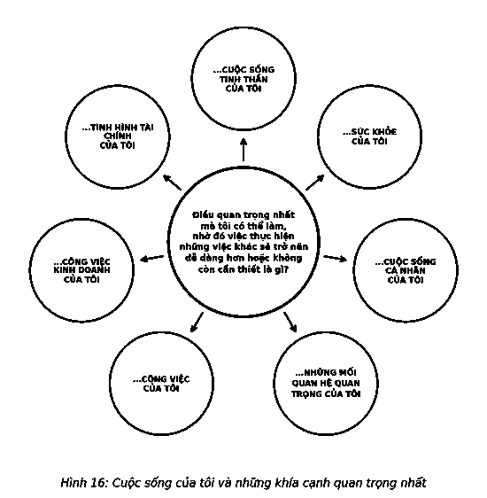

# 11. THÓI QUEN THÀNH CÔNG

Bạn biết về các thói quen. Chúng rất khó phá vỡ – và cũng khó hình thành. Nhưng chúng ta đang vô tình hình thành những thói quen mới. Khi chúng ta bắt đầu và duy trì một lối suy nghĩ hay một kiểu hành động trong một thời gian đủ dài, chúng ta tạo ra một thói quen mới. Lựa chọn mà chúng ta phải đối mặt đó là chúng ta muốn hình thành các thói quen đưa chúng ta đến nơi cần đến hay không. Để làm vậy, câu hỏi tập trung phải trở thành thói quen thành công mạnh mẽ nhất mà chúng ta có thể có.

> *“Thành công rất đơn giản. Làm những gì đúng đắn, theo đúng cách, vào đúng thời điểm.”*  
> — **Arnold H. Glasow**

Đối với tôi, câu hỏi tập trung là một cách sống. Tôi dùng nó để tìm kiếm ưu tiên quan trọng nhất của mình, tận dụng tối đa thời gian, và nhận được thành tựu to lớn. Tôi đặt ra câu hỏi khi thức dậy và bắt đầu một ngày mới, khi bắt đầu làm việc, và một lần nữa khi trở về nhà: *“Điều quan trọng nhất mà tôi có thể làm, nhờ đó việc thực hiện những việc khác sẽ trở nên dễ dàng hơn hoặc không còn cần thiết là gì?”* Và khi biết câu trả lời, tôi tiếp tục hỏi cho đến khi có thể nhìn thấy các mối liên hệ và mọi domino của tôi được xếp thành hàng.

Rõ ràng, bạn có thể tự thúc đẩy bản thân phân tích mọi khía cạnh trong mọi việc bạn làm. Hãy bắt đầu với những việc lớn và quan sát nơi nó đưa bạn đến. Bạn sẽ dần phát triển được ý thức về thời gian nên sử dụng các câu hỏi toàn cảnh và thời gian nên sử dụng các câu hỏi nhỏ tập trung.

Câu hỏi tập trung là thói quen tôi thường sử dụng để đạt được thành công và có một cuộc sống ý nghĩa. Tôi sử dụng nó trong một số việc chứ không phải tất cả. Tôi áp dụng nó vào các lĩnh vực quan trọng trong cuộc sống: đời sống tinh thần, sức khỏe, đời sống cá nhân, các mối quan hệ quan trọng, công việc, hoạt động kinh doanh và tình hình tài chính. Tôi còn thực hiện chúng theo thứ tự mỗi lĩnh vực là một nền tảng cho lĩnh vực tiếp theo.

Bởi muốn cuộc sống của tôi giữ vai trò trọng tâm, nên tôi tiếp cận từng lĩnh vực bằng cách thực hiện những gì quan trọng nhất trong lĩnh vực đó. Tôi coi chúng như những nền tảng trong cuộc sống và nhận ra rằng khi tôi đang làm những gì là quan trọng nhất trong từng lĩnh vực, cuộc sống của tôi như đang hoạt động với công suất tối đa.

Câu hỏi tập trung có thể hướng bạn đến điều quan trọng nhất trong các lĩnh vực khác nhau của cuộc đời bạn. Đơn giản chỉ cần điều chỉnh lại câu hỏi tập trung bằng cách thêm lĩnh vực cần tập trung vào. Bạn cũng có thể đưa một khung thời gian, chẳng hạn như “ngay bây giờ” hoặc “trong năm nay”, để cung cấp cho câu trả lời với mức độ thời gian thích hợp, hoặc “trong 5 năm” hoặc “một ngày nào đó” để tìm một câu trả lời tổng thể hướng bạn đến các kết quả mục tiêu.

Dưới đây là một số câu hỏi tập trung để bạn tự hỏi. Chọn lĩnh vực trước, sau đó tuyên bố câu hỏi, bổ sung khung thời gian, và kết thúc bằng cách thêm cụm từ “nhờ đó việc thực hiện những điều khác sẽ trở nên dễ dàng hơn hoặc không còn cần thiết là gì?” Ví dụ: *“Trong công việc của tôi, điều quan trọng nhất tôi có thể làm để đảm bảo đạt được mục tiêu của mình trong tuần này nhờ đó việc thực hiện những điều khác sẽ dễ dàng hơn hoặc không cần thiết nữa là gì?”*

#### ĐỐI VỚI ĐỜI SỐNG TINH THẦN...
* Điều quan trọng nhất tôi có thể làm để giúp đỡ người khác là gì...?
* Điều quan trọng nhất tôi có thể làm để cải thiện vận may của mình là gì...?

#### ĐỐI VỚI SỨC KHỎE...
* Điều quan trọng nhất tôi có thể làm để đạt được mục tiêu ăn kiêng của mình là gì...?
* Điều quan trọng nhất tôi có thể làm để đảm bảo việc tập luyện thể thao là gì...?
* Điều quan trọng nhất tôi có thể làm để giải tỏa căng thẳng là gì...?

#### ĐỐI VỚI CUỘC SỐNG CÁ NHÂN...
* Điều quan trọng nhất tôi có thể làm để cải thiện kỹ năng của tôi trong lĩnh vực... là gì?
* Điều quan trọng nhất tôi có thể làm để có thời gian dành cho bản thân là gì?

#### ĐỐI VỚI CÁC MỐI QUAN HỆ QUAN TRỌNG...
* Điều quan trọng nhất tôi có thể làm để cải thiện mối quan hệ của tôi với vợ/chồng mình là gì...?
* Điều quan trọng nhất tôi có thể làm để cải thiện kết quả học tập của các con tôi là gì...?
* Điều quan trọng nhất tôi có thể làm để tỏ lòng biết ơn của tôi với cha mẹ là gì...?
* Điều quan trọng nhất tôi có thể làm để khiến gia đình tôi gắn bó hơn là gì...?

#### ĐỐI VỚI CÔNG VIỆC...
* Điều quan trọng nhất tôi có thể làm để đảm bảo đạt mục tiêu của mình là gì...?
* Điều quan trọng nhất tôi có thể làm để cải thiện kỹ năng của tôi là gì...?
* Điều quan trọng nhất tôi có thể làm để giúp đội ngũ của tôi thành công là gì...?
* Điều quan trọng nhất tôi có thể làm để thăng tiến hơn trong sự nghiệp là gì...?

#### ĐỐI VỚI DOANH NGHIỆP...
* Điều quan trọng nhất tôi có thể làm để khiến công ty có được lợi thế cạnh tranh hơn là gì...?
* Điều quan trọng nhất tôi có thể làm để khiến sản phẩm của chúng tôi trở thành tốt nhất là gì...?
* Điều quan trọng nhất tôi có thể làm để khiến chúng tôi thu về lợi nhuận cao hơn là gì...?
* Điều quan trọng nhất tôi có thể làm để cải thiện trải nghiệm khách hàng là gì...?

#### ĐỐI VỚI TÌNH HÌNH TÀI CHÍNH...
* Điều quan trọng nhất tôi có thể làm nhằm tăng giá trị tài sản của tôi là gì...?
* Điều quan trọng nhất tôi có thể làm để cải thiện dòng tiền đầu tư của tôi là gì...?
* Điều quan trọng nhất tôi có thể làm để thanh toán hết nợ thẻ tín dụng của tôi là gì...?

---

> ### Ý TƯỞNG LỚN
>
> Vì vậy, làm thế nào để biến điều quan trọng nhất trở thành một phần thói quen hằng ngày? Làm thế nào để khiến nó đủ mạnh giúp mang về thành công trong công việc lẫn các khía cạnh khác trong cuộc sống? Dưới đây là một danh sách cho người mới bắt đầu được rút ra từ kinh nghiệm của chúng tôi và các mối quan hệ hợp tác giữa chúng tôi và những người khác.
>
> 1. **Hiểu và tin vào điều quan trọng nhất.** Bước đầu tiên là phải hiểu được khái niệm về điều quan trọng nhất, sau đó tin rằng nó có thể mang lại sự khác biệt trong cuộc sống của bạn. Nếu không hiểu và tin, bạn sẽ không thể hành động.
> 2. **Sử dụng điều quan trọng nhất.** Hãy tự đặt ra cho mình câu hỏi tập trung. Bắt đầu ngày mới bằng cách hỏi, *“Điều quan trọng nhất tôi có thể làm hôm nay cho [bất cứ điều gì bạn muốn] nhờ đó việc thực hiện những điều khác sẽ trở nên dễ dàng hơn hoặc thậm chí không còn cần thiết là gì?”* Khi đó, hướng đi của bạn sẽ rõ ràng hơn. Công việc của bạn sẽ hiệu quả hơn và cuộc sống cá nhân của bạn trở nên ý nghĩa hơn.
> 3. **Biến điều quan trọng nhất trở thành thói quen.** Khi biến việc đặt câu hỏi tập trung trở thành thói quen, bạn đã tận dụng toàn bộ năng lực của nó để đạt được thành công như mong muốn. Đó là một nhân tố tạo ra sự khác biệt. Cho dù bạn mất vài tuần hay vài tháng, hãy gắn bó với nó cho đến khi nó trở thành thói quen. Nếu không nghiêm túc trong việc học hỏi thói quen thành công, bạn không thể nghiêm túc trong việc đạt được những kết quả đáng kinh ngạc.
> 4. **Thúc đẩy các công cụ nhắc nhở.** Thiết lập các cách thức để nhắc nhở bản thân sử dụng câu hỏi tập trung. Một trong những cách tốt nhất để làm điều này là tạo ra bảng nhắc nhở tại nơi làm việc với nội dung, *“Cho đến khi điều quan trọng nhất được thực hiện – mọi thứ khác đều gây xao nhãng.”* Sử dụng bản ghi chú, màn hình, lịch để kết nối các thói quen thành công và kết quả bạn đang tìm kiếm. Đưa ra lời nhắc nhở như, *“Điều quan trọng nhất = Kết quả đáng ngạc nhiên”* hoặc *“Thói quen thành công sẽ đưa tôi đến mục tiêu của mình”*.
> 5. **Kêu gọi sự hỗ trợ.** Nghiên cứu cho thấy những người xung quanh có ảnh hưởng rất lớn đến bạn. Thành lập một nhóm hỗ trợ thành công nhỏ gồm một số đồng nghiệp có thể giúp truyền cảm hứng cho tất cả cùng thực hành thói quen thành công mỗi ngày. Hãy kéo thêm sự tham gia của gia đình. Chia sẻ điều quan trọng nhất của bạn. Sử dụng để họ thấy thói quen thành công có thể tạo sự khác biệt trong công việc của họ ở trường, thành tích cá nhân, hoặc bất kỳ lĩnh vực nào trong cuộc sống của họ.
>
> *Thói quen này có thể trở thành nền tảng cho nhiều thói quen khác, vì vậy hãy giữ thói quen thành công của bạn luôn mạnh mẽ. Sử dụng các chiến lược được thảo ra trong Phần 3: Các kết quả đáng kinh ngạc, để thiết lập mục tiêu và ngăn ô thời gian nhằm có được những kết quả khác biệt mỗi ngày trong cuộc sống của bạn.*
>
> 
