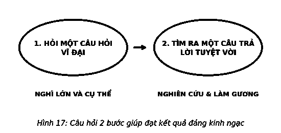
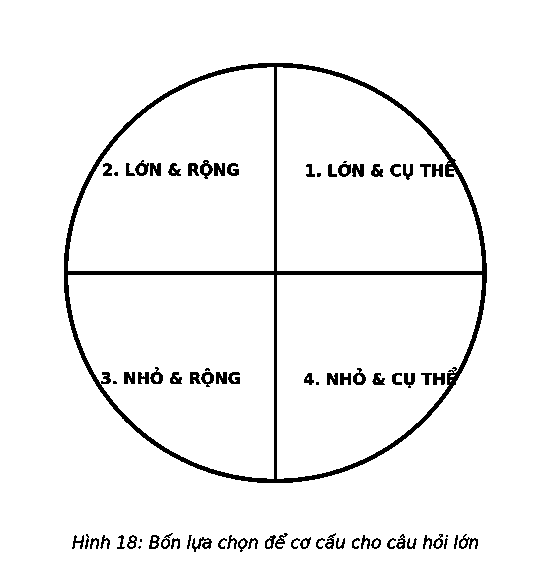
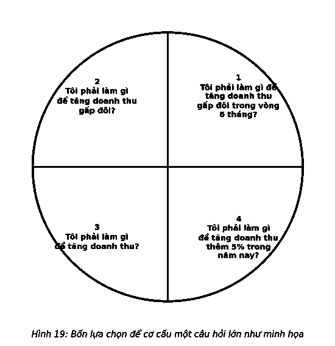
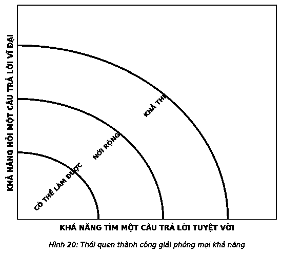
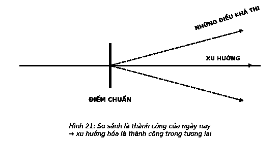

# 12. CON ĐƯỜNG DẪN ĐẾN NHỮNG CÂU TRẢ LỜI TUYỆT VỜI

Câu hỏi tập trung giúp bạn xác định điều quan trọng nhất của bạn trong mọi tình huống. Nó sẽ làm rõ những gì bạn muốn trong các lĩnh vực quan trọng trong cuộc sống của bạn và sau đó đào sâu vào những gì cần thiết để đạt được chúng. Nó thực sự là một quá trình đơn giản: Bạn đặt ra một câu hỏi lớn, sau đó tìm ra câu trả lời tuyệt vời. Đó là thói quen thành công của bạn.

> *“Mọi người không quyết định tương lai của họ, họ quyết định thói quen và thói quen đó quyết định tương lai của họ.”*  
> — **F. M. Alexander**

### 1. ĐẶT RA CÂU HỎI LỚN

Câu hỏi tập trung giúp bạn đặt ra câu hỏi lớn. Các câu hỏi lớn như những mục tiêu lớn đều mang tính vĩ mô và cụ thể. Chúng thúc đẩy và hướng bạn đến các câu trả lời lớn cụ thể. Và bởi chúng được cơ cấu để có thể đo lường được, nên rất dễ ước lượng được kết quả.

Nhìn vào ma trận “câu hỏi lớn” (Hình 18) để thấy được tiềm lực của câu hỏi tập trung.

Hãy coi việc tăng doanh thu như một cách để chia nhỏ mỗi góc phần tư, sử dụng câu hỏi “Tôi có thể làm gì để tăng gấp đôi doanh thu trong 6 tháng?” như một cách để giữ chỗ cho phần Lớn & Cụ thể (Hình 19).

Giờ đây, chúng ta hãy kiểm chứng những ưu và khuyết điểm của mỗi góc phần tư câu hỏi, và kết thúc ở nơi bạn muốn đến – Lớn & Cụ thể.

* **Góc phần tư thứ 4. Nhỏ & cụ thể:** *“Tôi có thể làm gì để tăng doanh thu thêm 5% trong năm nay.”* Câu hỏi này hướng bạn theo hướng cụ thể, nhưng không tạo được thách thức. Đối với hầu hết các nhân viên bán hàng, 5% mức tăng trưởng về doanh số bán hàng có thể được coi là một chỉ tiêu dễ đạt được. Xét theo góc độ tốt nhất có thể, đó là phần tăng lợi nhuận, thay vì bước nhảy vọt có tiềm năng thay đổi cuộc sống tương lai. Các mục tiêu thấp không đòi hỏi những hành động khác biệt, vì thế hiếm khi dẫn đến những kết quả vượt trội.
* **Góc phần tư thứ 3. Nhỏ & rộng:** *“Tôi có thể làm gì để tăng doanh số?”* Đây không thực sự là một câu hỏi về thành tích nói chung. Nó giống một câu đố hơn. Tốt nhất nên liệt kê ra danh sách các lựa chọn nhưng phải thu hẹp các lựa chọn và đi từng bước nhỏ. Bạn muốn tăng doanh số bán hàng lên bao nhiêu? Vào thời điểm nào? Thật không may, đây là loại câu hỏi mà hầu hết mọi người thường hỏi và sau đó thắc mắc không hiểu tại sao câu trả lời của họ lại không mang đến những thành công.
* **Góc phần tư thứ 2. Lớn & rộng:** *“Tôi có thể làm gì để tăng gấp đôi doanh số bán hàng?”* Đây là một câu hỏi lớn, nhưng không cụ thể. Một xuất phát điểm tốt, nhưng thiếu chi tiết dẫn đến nhiều nghi vấn hơn câu trả lời khiến bạn không biết bắt đầu từ đâu. Tăng gấp đôi doanh thu trong 20 năm tới khác hoàn toàn so với việc đạt được mục tiêu tương tự trong 1 năm hoặc ít hơn.
* **Góc phần tư thứ 1. Lớn & cụ thể:** *“Tôi có thể làm gì để tăng doanh số bán hàng gấp đôi trong 6 tháng?”* Bấy giờ bạn đã có đủ yếu tố của một câu hỏi lớn. Đó là một mục tiêu lớn và cụ thể. Bạn sẽ tăng gấp đôi doanh số bán hàng – một việc không hề dễ dàng. Bạn phải thực hiện mục tiêu đó trong 6 tháng, đó sẽ là một thách thức. Bạn sẽ cần một câu trả lời lớn. Bạn sẽ phải phân tích điều bạn tin là có thể và có tầm nhìn vượt ra khỏi những ranh giới các giải pháp tiêu chuẩn thông thường của mình.

Bạn có thấy sự khác biệt? Khi đặt ra câu hỏi lớn, bạn đặt mình vào vị trí đang theo đuổi một mục tiêu lớn. Và bất cứ khi nào làm điều này, bạn sẽ thấy cùng một khuôn mẫu – Lớn & Cụ thể. Một câu hỏi lớn và cụ thể dẫn đến một câu trả lời lớn và cụ thể, một điều rất cần thiết để giúp bạn đạt được một mục tiêu lớn.

Vậy, nếu “Tôi có thể làm gì để tăng gấp đôi doanh số bán hàng trong 6 tháng?” là một câu hỏi lớn, thì làm thế nào bạn có thể tận dụng được tiềm lực của nó? Chuyển nó thành câu hỏi tập trung: *“Điều quan trọng nhất tôi có thể làm để tăng gấp đôi doanh số bán hàng trong 6 tháng nhờ đó việc thực hiện những điều khác sẽ trở nên dễ dàng hơn hoặc không cần thiết nữa là gì?”* Việc biến nó thành câu hỏi tập trung sẽ hướng vào trung tâm của thành công bằng cách buộc bạn làm rõ những gì quan trọng nhất và bắt đầu từ đó. Tại sao lại vậy?

Bởi đó cũng là điểm khởi nguồn của thành công đột phá.

### 2. TÌM ĐÁP ÁN LỚN

Thách thức trong việc đặt một câu hỏi lớn đó là, một khi đã hỏi, bạn phải đối mặt với việc tìm kiếm một câu trả lời lớn.

Câu trả lời có ba loại: có thể thực hiện được, linh hoạt và có tiềm năng. Câu trả lời đơn giản nhất bạn có thể tìm kiếm đó là một câu trả lời nằm trong hiểu biết, kỹ năng và kinh nghiệm của bạn. Với loại đáp án này, bạn có thể đã biết cách thực hiện nó và không phải thay đổi nhiều để nắm được cốt lõi của nó. Hãy coi đây là loại đáp án “có thể thực hiện được” và có tính khả thi nhất.

Cấp độ tiếp theo là câu trả lời linh hoạt. Loại câu trả lời này vẫn nằm trong tầm tay của bạn, nhưng có thể ở tầm xa nhất. Bạn rất có thể sẽ phải làm một số nghiên cứu và khảo sát về những gì người khác đã làm để tiếp cận được câu trả lời này. Loại đáp án này có thể không chắc chắn bởi bạn sẽ phải phân tán đến các giới hạn về khả năng hiện tại. Hãy coi nó là loại đáp án hoàn toàn có thể đạt được và có thể xảy ra, tùy thuộc vào nỗ lực của bạn.

Những người thành đạt hiểu rõ hai tuyến đường đầu tiên này nhưng từ chối không sử dụng chúng. Không bằng lòng với thứ tầm thường khi khả năng cho phép họ đạt được những kết quả vượt trội, họ đã đặt ra một câu hỏi lớn và muốn có được câu trả lời tốt nhất.

Kết quả ngoài sức tưởng tượng cần một câu trả lời tốt nhất.

Những người thành công chọn sống vượt ngoài các ranh giới thành tích. Họ không chỉ mơ mà hơn thế còn khao khát mãnh liệt vượt khỏi tầm với của họ. Họ biết loại câu trả lời này khó với tới nhất, nhưng cũng biết rằng chỉ bằng cách nỗ lực tìm kiếm chúng họ mới có thể mở rộng và làm phong phú thêm cuộc sống của mình.

Nếu muốn tận dụng tối đa câu trả lời của mình, bạn phải nhận ra rằng nó nằm ngoài vùng thoải mái của bạn. Một câu trả lời lớn, tiềm năng nằm ngoài những gì được biết đến và được thực hiện. Cùng với một mục tiêu linh hoạt, bạn có thể bắt đầu bằng cách nghiên cứu và khảo sát cuộc sống của những người thành đạt khác. Nhưng bạn không thể dừng lại ở đó bởi trong thực tế, hành trình tìm kiếm của bạn chỉ mới bắt đầu. Dù học hỏi được điều gì, bạn cũng nên sử dụng nó để làm những gì mà chỉ những người có thành tích cao nhất thường làm: so sánh và xu hướng hóa.

Một câu trả lời tuyệt vời về cơ bản là một câu trả lời mới. Đó là một bước nhảy vọt qua mọi câu trả lời hiện tại trong cuộc tìm kiếm câu trả lời tiếp theo và được tìm thấy sau hai bước. Bước đầu tiên giống như khi bạn mở rộng. Bạn phát hiện ra nghiên cứu tốt nhất và khảo sát những người có thành tích cao nhất. Bất cứ lúc nào bạn không biết câu trả lời, giải pháp lúc đó là đi tìm câu trả lời đó. Nói theo cách khác, theo mặc định, điều quan trọng nhất đầu tiên là tìm kiếm các manh mối và các mô hình vai trò chỉ cho bạn đi đúng hướng. Điều đầu tiên cần làm là đặt câu hỏi, “Có ai đã nghiên cứu hoặc thực hiện điều này hay điều tương tự chưa?” Thực tế, đáp án cho câu trả lời này luôn ở thể khẳng định, vì vậy cuộc điều tra của bạn nên bắt đầu bằng cách tìm hiểu những gì người khác đã biết trước đó.

Một trong những lý do tôi đọc rất nhiều sách trong những năm qua bởi sách là một nguồn tài nguyên tuyệt vời. Học hỏi những người đã thực hiện những gì bạn hy vọng đạt được trong thực tế và trong sách vở cung cấp rất nhiều tài liệu và hình mẫu cho thành công. Internet cũng nhanh chóng trở thành một công cụ vô giá. Dù ngoại tuyến hay trực tuyến, bạn cũng sẽ tìm được những người đã đi trên hành trình bạn đang đi, vì vậy bạn có thể nghiên cứu, mô hình hóa, so sánh và xu hướng hóa kinh nghiệm của họ. Một giáo sư đại học đã từng nói với tôi, “Gary, anh thông minh, nhưng mọi người có kinh nghiệm hơn anh. Anh không phải là người đầu tiên có ước mơ lớn, vì vậy anh nên nghiên cứu một cách khôn ngoan những gì người khác đã học hỏi được, và sau đó hành động dựa trên những bài học của họ.” Ông ấy đã nói đúng. Và ông ấy cũng khuyên các bạn nên như vậy.

Nghiên cứu và kinh nghiệm của người khác là xuất phát điểm tốt nhất để bắt đầu hành trình tìm kiếm câu trả lời của bạn. Trang bị kiến thức này giúp bạn thiết lập một chuẩn mực, điểm mốc quan trọng cho những gì được biết đến và đang được thực hiện. Với một cách tiếp cận linh hoạt, đây là điểm cao nhất của bạn, nhưng hiện tại nó là điểm thấp nhất. Nó không phải là tất cả những gì bạn sẽ làm, nhưng nó sẽ trở thành đỉnh điểm, nơi bạn sẽ đứng để xem mình có thể tiến đến điểm tiếp theo hay không. Điều này được gọi là xu hướng hóa, và đó là bước thứ hai. Bạn đang tìm kiếm điều tiếp theo có thể làm theo mà những người làm tốt nhất cũng đang hướng đến, hoặc nếu cần thiết, theo một hướng hoàn toàn mới.

Đây là cách giải quyết những vấn đề lớn và vượt qua những thách thức lớn, bởi các câu trả lời tốt nhất hiếm khi xuất phát từ một quá trình tầm thường. Dù đó là việc tìm ra cách đi tắt đón đầu trong cuộc cạnh tranh, tìm ra phương thuốc chữa trị, hoặc đưa ra bước hành động tiếp theo để đạt được một mục tiêu cá nhân, thì so sánh và xu hướng hóa vẫn là lựa chọn tốt nhất của bạn. Nếu câu trả lời của bạn độc đáo, có thể bạn sẽ phải đổi mới chính mình theo một cách nào đó trong quá trình thực hiện nó. Một câu trả lời mới thường đòi hỏi hành vi mới, do đó, đừng ngạc nhiên nếu trong hành trình đi đến thành công, bạn phải thay đổi chính mình. Nhưng đừng để điều đó ngăn cản bạn.

Đây là nơi sự kỳ diệu sẽ xảy ra và các khả năng là vô hạn. Dù đầy thách thức, nhưng việc trở thành người tiên phong trong hành trình tiến tới thành công này luôn xứng đáng được đầu tư, bởi khi chúng ta tối đa hóa tầm với của mình đồng nghĩa với việc chúng ta sẽ tối đa hóa cuộc sống.

---

> ### Ý TƯỞNG LỚN
>
> 1. **Nghĩ lớn và cụ thể.** Đưa ra một mục tiêu mà bạn có ý định đạt được giống như đặt ra một câu hỏi. Đó là một bước đơn giản từ “tôi muốn làm điều đó” đến “Làm sao tôi có thể đạt được điều đó?” Câu hỏi tốt nhất – theo mặc định là mục tiêu tốt nhất – phải lớn & cụ thể: Lớn, bởi bạn đang theo đuổi các kết quả vượt trội; Cụ thể, bởi nó hướng bạn đến mục đích cụ thể và không có chỗ để bạn suy nghĩ có nên cố gắng hay không. Một câu hỏi lớn & cụ thể, đặc biệt là dưới hình thức câu hỏi tập trung, giúp bạn có được câu trả lời tốt nhất.
> 2. **Đưa ra các khả năng.** Đặt ra một mục tiêu khả thi gần giống việc tạo ra một nhiệm vụ để tích vào danh sách. Một mục tiêu linh hoạt khó khăn hơn rất nhiều. Nó dẫn bạn đến điểm kết của các khả năng hiện tại, và bạn phải vươn rộng hơn nữa để đạt được nó. Hãy khám phá ra các khả năng. Khi bạn thấy mọi người và các doanh nghiệp trải qua những cuộc chuyển đổi, hãy coi đó là xuất phát điểm của bạn.
> 3. **So sánh và xu hướng hóa để có được câu trả lời tốt nhất.** Không ai có khả năng tiên tri, nhưng với sự thục luyện, bạn có thể dự đoán chính xác được các kết quả tiềm năng. Những ai đến đích đầu tiên thường thưởng thức phần thưởng lớn cùng với số ít đối thủ cạnh tranh nếu có. So sánh và xu hướng hóa để tìm câu trả lời khác biệt cần thiết nhằm mang lại những kết quả tuyệt vời.
>
> 
