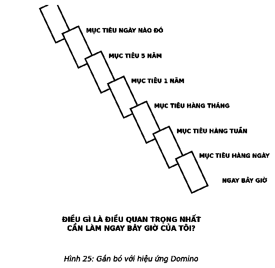

# 14. SỐNG THEO ƯU TIÊN

“Ông có thể vui lòng cho tôi biết tôi phải đi theo hướng nào để đến đó không ạ?”  
“Điều đó phụ thuộc vào việc cô muốn đến đâu”, con mèo Cheshire trả lời.  
“Tôi không quan tâm đến đích đến,” Alice nói.  
“Thế thì đường đi có gì quan trọng,” con mèo nói.  

Cuộc gặp gỡ giữa Alice với mèo Cheshire trong *Alice ở xứ sở thần tiên* của Lewis Carroll đã tiết lộ mối liên hệ chặt chẽ giữa mục đích và ưu tiên. Sống có mục đích giúp bạn định hình đích đến. Sống theo ưu tiên giúp bạn biết được phải làm gì để đến đó.

> *“Lập kế hoạch mang tương lai đến hiện tại để bạn có thể thực thi nó ngay bây giờ.”*  
> — **Alan Lakein**

Khi bắt đầu một ngày mới, mỗi chúng ta đều có một lựa chọn. Chúng ta có thể hỏi, “Tôi phải làm gì?” hoặc “Tôi nên làm gì?” Nếu không có đường hướng, không mục đích, bất cứ điều gì bạn “sẽ làm” luôn đưa bạn đến một nơi nào đó. Nhưng khi có chủ đích, bạn “nên làm” điều để đến được nơi bạn *phải* đi. Khi có mục đích sống, việc sống theo ưu tiên là một lựa chọn ưu việt.

### ĐẶT RA MỤC TIÊU CHO HIỆN TẠI

Như Ebenezer Scrooge đã khám phá ra, cuộc sống của chúng ta được thúc đẩy bởi mục đích sống của mỗi người. Tuy nhiên, ông cũng vẫn phải đối mặt với khó khăn trong cuộc sống. Mục đích có khả năng định hình cuộc sống của chúng ta tỷ lệ thuận với sức mạnh của những ưu tiên mà chúng ta trao cho nó. Mục đích sẽ vô ích nếu không có ưu tiên.

Chính xác, từ *ưu tiên* (*priority*) – thay vì *các ưu tiên* (*priorities*) – có nguồn gốc từ thế kỷ XIV, xuất phát từ *prior* trong tiếng Latin có nghĩa là “đầu tiên”. Nếu điều gì ở mức quan trọng nhất thì đó là một “ưu tiên hàng đầu”. Thật kỳ lạ, ưu tiên vẫn không được số hóa cho đến khoảng thế kỷ XX, khi thế giới hạ thấp nghĩa chung của nó xuống thành “điều quan trọng” và từ *các ưu tiên* bắt đầu xuất hiện. Do mất nghĩa ban đầu, nên nhiều câu nói như “vấn đề cấp bách nhất”, “mối quan tâm chính” và “vấn đề quan trọng” đều có ý ám chỉ nghĩa gốc. Ngày nay, chúng ta đưa ý nghĩa ban đầu trở lại bằng cách thêm các từ như “nhất”, “hàng đầu”, “đầu tiên”, “chính” và “quan trọng nhất” vào sau nó. Có vẻ như ưu tiên đã trải qua một cuộc hành trình thú vị.

Vì vậy, hãy cân nhắc ngôn từ của bạn. Có nhiều cách để nói về ưu tiên, nhưng dù bạn chọn từ nào đi chăng nữa, để đạt được kết quả đáng kinh ngạc, ý nghĩa của từ được dùng đều phải có chung nghĩa – điều quan trọng nhất.

Bất cứ khi nào dạy về cách thiết lập mục tiêu, tôi luôn đưa nó lên vị trí ưu tiên hàng đầu để chứng tỏ một điều rằng mục tiêu và ưu tiên có liên hệ tương quan. Tôi làm vậy bằng cách hỏi, “Tại sao chúng ta lại đặt ra mục tiêu và lập các kế hoạch?” Dù nhận được câu trả lời chuẩn xác ra sao, thì sự thật vẫn là chúng ta có những mục tiêu và kế hoạch chỉ vì một lý do – chúng phù hợp trong những khoảnh khắc cuộc sống mà chúng ta thấy quan trọng nhất. Dù có thể hồi tưởng quá khứ và dự báo tương lai, cuộc sống duy nhất của chúng ta vẫn là những giây phút hiện tại. *Ngay bây giờ* là tất cả những gì chúng ta cần. Thời khắc qua đi là quá khứ trong khi giây phút sắp tới là tương lai. Để làm rõ hơn luận điểm này, tôi bắt đầu đề cập đến cách tạo ra ưu tiên như “đặt ra mục tiêu cho hiện tại” để nhấn mạnh lý do chúng ta phải tạo ra ưu tiên ngay từ đầu.

Thành công thực chất là khả năng chúng ta đạt được những chuỗi kết quả đáng kinh ngạc trong tương lai. Việc làm của bạn trong bất kỳ thời điểm nào xác định những gì bạn sẽ trải nghiệm trong thời gian kế tiếp. Không thể phủ nhận, hiện tại và tương lai được quyết định bởi các ưu tiên của bạn trong thời điểm hiện tại. Yếu tố quyết định cách bạn thiết lập ưu tiên là người chiến thắng trong trận chiến giữa bản thân bạn ở hiện tại và bạn trong tương lai.

Nếu được đưa ra một đề nghị 100 đô-la ngay hôm nay hoặc 200 đô-la trong năm tới, bạn sẽ lựa chọn thế nào? 200 đô-la? Bạn sẽ làm vậy nếu mục tiêu của bạn là kiếm được nhiều tiền nhất có thể từ cơ hội này. Nhưng kỳ lạ thay, hầu hết mọi người không đưa ra lựa chọn đó.

Các nhà kinh tế từ lâu đã biết rằng dù thích những phần thưởng lớn, nhưng mọi người lại muốn được thưởng ngay thay vì đợi đến ngày mai – dù phần thưởng của ngày mai lớn hơn rất nhiều. Đó là một điều hết sức bình thường, được gọi là *hội chứng suy giảm hypebol* – phần thưởng càng được trao xa thời điểm hiện tại, nó càng tạo ra ít động lực tức thời khiến người nhận mong muốn đạt được nó. Có lẽ do các mục tiêu càng ở xa có kích thước càng nhỏ, nên mọi người nhầm lẫn khi cho rằng thực tế, chúng nhỏ như vậy dẫn đến việc giảm giá trị của chúng. Đó là lý do rất nhiều người sẽ chọn 100 đô-la hôm nay thay vì số tiền gấp đôi sau một năm. Thực tế “thiên vị hiện tại” sẽ lấn át mọi logic, và bỏ qua bức tranh toàn cảnh lớn kèm theo các kết quả đáng kinh ngạc. Giờ đây hãy tưởng tượng những ảnh hưởng tiêu cực mỗi ngày của thực tế cuộc sống này đến tương lai của bạn. Chúng ta cần một cách tư duy đơn giản hóa để tự thoát khỏi chính mình, thiết lập quyền ưu tiên và tiến gần hơn đến việc hoàn thành mục đích cuối cùng của chính chúng ta.

Đặt ra mục tiêu cho hiện tại sẽ giúp bạn tiến gần hơn đến đích.

Bằng cách tư duy thông qua bộ lọc “đặt ra mục tiêu cho hiện tại”, bạn cũng đang đặt ra mục tiêu cho tương lai và sau đó đào sâu một cách có phương pháp vào những gì bạn cần phải làm ngay bây giờ. Điều này có nét tương đồng với con búp bê Matryoshka của Nga trong đó điều quan trọng nhất “ngay bây giờ” được lồng trong điều quan trọng nhất ngày hôm nay, và điều quan trọng nhất ngày hôm nay được lồng trong điều quan trọng nhất tuần này và điều quan trọng nhất tuần này được lồng trong điều quan trọng nhất tháng này... Đó là cách mà một điều nhỏ bé có thể thực sự trở thành một điều lớn lao.

Hãy học cách nghĩ lớn nhưng đi từng bước nhỏ.

Bỏ qua các bước bằng cách tự hỏi, “Điều quan trọng nhất tôi có thể làm ngay bây giờ để đi đúng hướng giúp tôi đạt được mục tiêu một ngày nào đó của tôi là gì?” sẽ không bao giờ mang lại hiệu quả. Thời điểm này quá xa tương lai để bạn thấy rõ được ưu tiên hàng đầu của mình. Thực tế, bạn có thể tiếp tục bổ sung các mốc thời gian như trong ngày hôm nay, tuần này, v.v.., nhưng bạn sẽ không thể thấy được các ưu tiên mạnh mẽ mà bạn tìm kiếm cho đến khi thêm các mốc thời gian vào mọi bước. Đó là lý do hầu hết mọi người không bao giờ có thể tiến gần đến mục tiêu của họ. Họ đã không kết nối hôm nay với mọi mục tiêu ngày mai để đạt được thành công như ý muốn.

Kết nối ngày hôm nay với mọi mục tiêu ngày mai. Đó là điều quan trọng nhất.

Nghiên cứu đã hỗ trợ nhận định này. Trong ba nghiên cứu riêng biệt, các nhà tâm lý học đã quan sát 262 sinh viên để khảo sát tác động của khả năng hình dung đến các kết quả. Các sinh viên này được yêu cầu hình dung theo một trong hai cách: Những người trong nhóm 1 được yêu cầu hình dung ra kết quả (như nhận được điểm “A” trong một kỳ thi) và những người còn lại được yêu cầu hình dung ra quá trình cần thiết để đạt được một kết quả như mong muốn (như các buổi học cần thiết để đạt được điểm “A” trong kỳ thi). Cuối cùng, các học sinh hình dung ra quá trình có được kết quả tốt hơn – họ nghiên cứu sớm hơn và thường xuyên hơn đồng thời đạt điểm cao hơn so với những người chỉ đơn giản hình dung ra kết quả.

Con người có xu hướng quá lạc quan về những gì họ có thể làm, và do đó hầu hết đều không nghĩ kết quả có được thông qua các cách thực hiện. Các nhà nghiên cứu gọi đây là “ảo tưởng hoạch định”. Hình dung ra quá trình – chia mục tiêu lớn thành các bước nhỏ cần thiết để đạt được nó – giúp bạn tham gia vào quá trình tư duy chiến lược cần thiết để lập kế hoạch và đạt được các kết quả đáng kinh ngạc. Đây là lý do việc thiết lập mục tiêu cho hôm nay mang lại hiệu quả.

Tôi nói chuyện này với mọi người mỗi ngày. Nó rất hiệu quả khi họ hỏi tôi họ nên làm gì. Tôi nhìn quanh và nói, “Trước khi trả lời câu hỏi của anh/chị, hãy để tôi hỏi anh/chị một điều: Anh đang đi đâu và anh muốn đến đâu vào một ngày nào đó?” Sau đó, khi tôi đưa họ đến với quy trình thiết lập mục tiêu cho hiện tại, họ nắm bắt vấn đề một cách nhanh chóng và đưa ra câu trả lời riêng của mình, cho tôi biết điều quan trọng nhất họ cần phải làm ngay bây giờ.

Bước cuối cùng là hãy viết ra câu trả lời của bạn. Rất nhiều người đã viết về việc liệt kê ra các mục tiêu và thực tế, nó mang lại hiệu quả rất cao.

Năm 2008, Tiến sĩ Gail Matthews của Đại học Dominican, California, đã tuyển 267 người từ rất nhiều ngành nghề khác nhau (luật sư, kế toán, nhân viên phi lợi nhuận, các nhà tiếp thị, v.v..) tại nhiều nước khác nhau tham gia vào một nghiên cứu. Những người viết ra mục tiêu của họ có tiềm năng thực hiện chúng hơn những người không viết ra là 39,5%.

Viết ra mục tiêu và ưu tiên quan trọng nhất của bạn là bước cuối cùng để sống theo ưu tiên.

---

> ### Ý TƯỞNG LỚN
>
> 1. **Chỉ có một điều quan trọng nhất.** Ưu tiên quan trọng nhất của bạn là điều quan trọng nhất bạn có thể làm ngay bây giờ và sẽ giúp bạn đạt được những gì quan trọng nhất với bạn. Bạn có thể có nhiều “ưu tiên”, nhưng hãy đào sâu hơn nữa và bạn sẽ khám phá ra rằng luôn có một điều quan trọng nhất, ưu tiên hàng đầu của bạn.
> 2. **Đặt ra mục tiêu cho hiện tại.** Nắm rõ mục tiêu tương lai là cách bạn bắt đầu. Xác định các bước cần phải thực hiện trong suốt hành trình sẽ giúp bạn có tư duy rõ ràng đồng thời khám phá ra các ưu tiên đúng đắn cần thực hiện ngay.
> 3. **Viết ra các mục tiêu (và luôn để mắt đến chúng).** Mang theo mục tiêu của bạn suốt hành trình đến ưu tiên duy nhất được xây dựng bởi việc đặt ra mục tiêu cho hiện tại và điều quan trọng nhất bạn có thể làm nhờ đó việc thực hiện mọi điều khác sẽ trở nên dễ dàng hơn hoặc không cần thiết nữa sẽ cho bạn biết cách để đạt được các kết quả đáng kinh ngạc.
>
> *Và một khi bạn biết phải làm gì, điều duy nhất còn lại chính là biến ý tưởng đó thành hành động.*
>
> 
