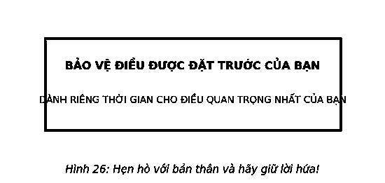
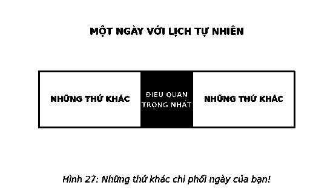
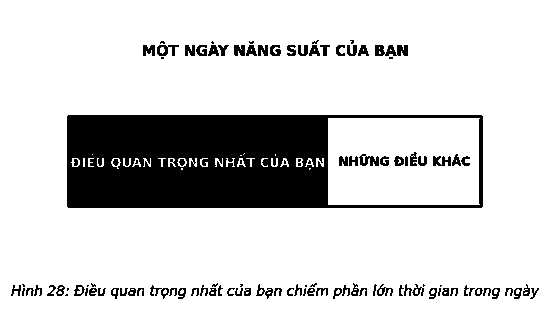
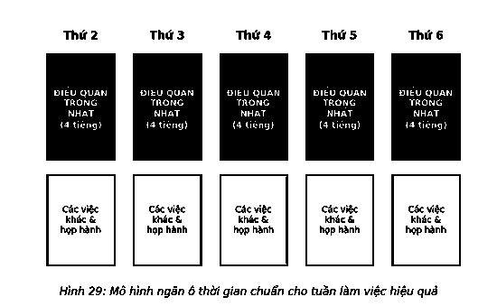
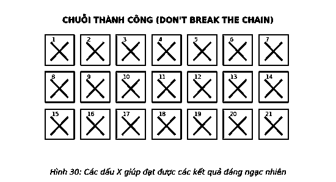

# 15. SỐNG VÌ HIỆU QUẢ

Câu chuyện của Ebenezer Scrooge cho chúng ta thấy một điều – ông ta đã hành động. Đam mê mục đích mới mẻ và được khuyến khích bởi ưu tiên hoàn thành nó đã giúp ông ta đứng dậy và hành động.

Hành động hiệu quả làm thay đổi cuộc sống.

> *“Hiệu quả không có nghĩa là bạn phải làm việc vất vả, luôn bận rộn hay phải thức đến nửa đêm... Nó liên quan nhiều đến các ưu tiên, lập kế hoạch và quyết tâm bảo vệ thời gian của bạn.”*  
> — **Margarita Tartakovsky**

“Hãy luôn hành động thật hiệu quả!” không phải là lựa chọn đầu tiên mà một huấn luyện viên hoặc quản lý nói chung dùng như một lời kêu gọi phổ biến để khơi gợi cảm xúc và truyền cảm hứng cho các học viên. Nó cũng không phải là những gì bạn tự nhủ khi đối mặt với thách thức hay cạnh tranh. Và Dickens đã không bao giờ để Scrooge thốt ra những lời này khi ông làm chủ cuộc sống sau khi đã thay đổi. Tuy nhiên, *hiệu quả* chính xác những gì Scrooge đã làm được, và không có từ nào chuẩn xác hơn từ *hiệu quả* khi mô tả thành quả bạn muốn đạt được, khi kết quả là yếu tố quan trọng nhất.

Khi việc chúng ta làm giữ vai trò quan trọng, chúng định hình cuộc sống của chúng ta hơn bất kỳ điều gì khác. Cuối cùng, để có một cuộc sống được gầy dựng nên từ các kết quả đáng kinh ngạc thường đơn giản chỉ là nỗ lực đạt được thành quả tối đa từ những gì bạn làm, khi những điều đó giữ vai trò quan trọng.

Sống vì hiệu quả tạo ra những kết quả đáng kinh ngạc.

Bất cứ khi nào dạy về hiệu quả, tôi luôn bắt đầu bằng câu hỏi: “Bạn sử dụng loại hệ thống quản lý thời gian nào?” Các câu trả lời rất đa dạng: lịch giấy, lịch điện tử, lịch theo ngày, lập kế hoạch hằng tuần... Sau đó tôi hỏi, “Vậy, các anh/chị chọn nó bằng cách nào?” Lý do đưa ra cũng vô cùng phong phú. Nhưng họ luôn mô tả những định dạng thay vì chức năng – những gì họ đang có chứ không phải cách họ làm. Vì vậy, khi tôi nói: “Thật tuyệt vời, nhưng các anh chị sử dụng loại hệ thống nào?”, câu trả lời tôi nhận được luôn là: “Ý anh là gì?”

“Thật vậy, ai cũng có một lượng thời gian như nhau nhưng một số người lại kiếm được nhiều tiền hơn người khác,” tôi hỏi, “vậy có thể nói rằng cách chúng ta sử dụng thời gian quyết định số tiền chúng ta kiếm được không?” Mọi người đều đồng ý, vì vậy tôi tiếp tục: “Nếu điều này đúng thời gian là tiền bạc, thì cách tốt nhất để mô tả một hệ thống quản lý thời gian là nhờ vào số tiền mà nó tạo ra. Vậy, bạn có nghĩ rằng mình đang sử dụng hệ thống 10.000 đô-la một năm? 20.000 đô-la một năm? 50.000 đô-la một năm? 100.000 đô-la một năm hay 500.000 đô-la một năm? Bạn có đang sử dụng hệ thống hơn 1 triệu đô-la một năm?”

Một người lên tiếng: “Chúng tôi biết điều đó bằng cách nào?”

Tôi trả lời: “Các anh/chị kiếm được bao nhiêu?”

Nếu tiền là một phép ẩn dụ cho việc tạo ra các kết quả, thì rõ ràng thành công của một hệ thống quản lý thời gian có thể được đánh giá bằng hiệu quả mà nó tạo ra.

Điều kỳ lạ là tôi chưa từng làm việc cho ai không phải là một triệu phú hoặc không trở thành một triệu phú. Và điều quan trọng nhất mà tôi học được từ những trải nghiệm này là những người thành công làm việc hiệu quả nhất.

> *“Mục tiêu của tôi không còn là làm được nhiều việc hơn, mà là có ít việc để làm hơn.”*  
> — **Francine Jay**

Những người này làm được nhiều việc hơn, đạt được kết quả tốt hơn, và kiếm được nhiều hơn trong cùng khoảng thời gian so với những người khác. Họ làm vậy bởi họ tận dụng tối đa thời gian để thực hiện các ưu tiên hàng đầu của họ – điều quan trọng nhất. Họ dành một lượng thời gian cho điều quan trọng nhất và sau đó bảo vệ khối thời gian đó đến cùng. Họ đã kết nối các điểm giữa việc tận dụng những khối thời gian của mình một cách nhất quán và các kết quả đáng kinh ngạc mà họ tìm kiếm.

### NGĂN Ô THỜI GIAN

Đôi lúc, tôi thấy mình giống một con rùa hơn con thỏ. Mặt khác, một số người làm việc với tôi thật may mắn với năng lượng mà họ có. Thật ngạc nhiên, họ có thể làm việc trong nhiều giờ kéo dài và không bao giờ mệt mỏi. Khi tôi cố gắng bắt chước họ, trong vòng chưa đầy một tuần, cơ thể tôi đã rã rời. Tôi phát hiện ra, dù cố gắng đến đâu, tôi cũng không thể sử dụng nhiều thời gian như một phương tiện chính để làm được nhiều việc hơn. Vì vậy, tôi đã phải tìm cách khác để đạt được hiệu quả lớn nhất với lượng thời gian tôi bỏ ra.

Hầu hết mọi người đều nghĩ rằng họ không bao giờ có đủ thời gian để thành công nhưng điều đó hoàn toàn khả thi khi bạn ngăn ô thời gian. Chia thời gian là một cách thức định hướng kết quả để quan sát và sử dụng thời gian. Đó là một cách để đảm bảo một người đã hoàn thành những gì cần thực hiện. Alexander Graham Bell từng nói: *“Tập trung mọi suy nghĩ của bạn vào việc đang làm.”* Ngăn ô thời gian khai thác triệt để năng lượng của bạn và tập trung nó vào công việc quan trọng nhất của bạn. Đó là công cụ quyền lực lớn nhất của sự hiệu quả.

Vì vậy, hãy cầm lịch của bạn lên và ngăn ô lượng thời gian cần thiết để thực hiện điều quan trọng nhất. Nếu đó là điều quan trọng nhất một lần, hãy ngăn ô thời gian phù hợp. Nếu đó là một việc thường xuyên, hãy ngăn ô thời gian hằng ngày để biến nó trở thành một thói quen. Những việc khác – các dự án khác, các thủ tục giấy tờ, e-mail, cuộc gọi, thư từ, các cuộc họp và tất cả những việc khác – phải xếp hàng chờ.

Thật không may, nếu như hầu hết những người khác, một ngày điển hình của bạn có thể giống Hình 27, khi bạn thấy mình ngày càng có ít thời gian hơn nữa để tập trung vào những gì quan trọng nhất.

Một ngày của những người hiệu quả nhất rất khác biệt (Hình 28).

Nếu một hành động mang lại những kết quả không cân xứng thì bạn cũng phải dành thời gian không cân xứng cho nó. Hãy đặt ra một câu hỏi tập trung về thời gian được ngăn ô của bạn hằng ngày. Thực hiện điều quan trọng có tính đòn bẩy nhất ngày hôm nay để từng bước thực hiện được điều quan trọng nhất của cuộc đời bạn.

Đây là cách kết quả trở nên đáng kinh ngạc.

Những người làm được điều này, theo kinh nghiệm của tôi, là những người không chỉ trở nên hoàn hảo nhất, mà còn có cơ hội nghề nghiệp lớn nhất. Chậm nhưng chắc, họ trở nên nổi tiếng trong tổ chức vì điều quan trọng nhất của họ và trở nên “không thể thay thế”.

Một khi đã thực hiện được điều quan trọng nhất trong ngày, bạn có thể dành phần thời gian còn lại trong ngày cho những việc khác. Chỉ cần sử dụng câu hỏi tập trung để xác định ưu tiên tiếp theo và dành thời gian phù hợp để thực hiện việc đó. Lặp lại phương pháp này cho đến khi mọi việc trong ngày của bạn được thực hiện hết. Thực hiện “những việc khác” giúp bạn yên tâm hơn nhưng không giúp bạn thăng tiến.

Để đạt được những kết quả đáng kinh ngạc và trải nghiệm sự tuyệt vời, ngăn ô thời gian cho ba điều này theo thứ tự sau:

1. **Thời gian nghỉ ngơi của bạn.**
2. **Thời gian cho điều quan trọng nhất.**
3. **Thời gian lập kế hoạch của bạn.**

#### 1. THỜI GIAN NGHỈ NGƠI CỦA BẠN
Những người thành công bắt đầu năm mới bằng cách dành thời gian để lập kế hoạch thời gian nghỉ ngơi cho mình. Tại sao? Họ biết sẽ cần đến nó và sẽ đầu tư thời gian và tiền bạc để thực thi điều đó. Thực tế, những người thành công nhất chỉ đơn giản là xem mình đang làm việc giữa các kỳ nghỉ. Những người khác lại không dành thời gian nghỉ ngơi, bởi họ không nghĩ mình xứng đáng được nghỉ ngơi hoặc có đủ khả năng làm điều đó. Bằng việc lập kế hoạch nghỉ ngơi trước, bạn có thể quản lý được thời gian làm việc. Việc này cũng để người khác biết trước kế hoạch của bạn để họ đưa ra kế hoạch phù hợp.

Hãy dành thời gian nghỉ ngơi để nạp năng lượng. Ngăn ô những ngày cuối tuần dài và kỳ nghỉ dài, sau đó dành thời gian để tận hưởng. Bạn sẽ có nhiều thời gian nghỉ ngơi hơn, thoải mái hơn và làm việc hiệu quả hơn.

#### 2. THỜI GIAN CHO ĐIỀU Ý NGHĨA NHẤT
Sau khi ngăn ô thời gian để nghỉ ngơi, hãy ngăn ô thời gian cho điều quan trọng nhất của bạn. Việc quan trọng nhất của bạn đứng thứ hai. Bởi bạn không thể duy trì thành công trong công việc nếu bỏ bê việc làm mới và nạp năng lượng cho bản thân.

Những người làm việc hiệu quả nhất thường thiết kế ngày của mình xoay quanh việc thực hiện điều quan trọng nhất. Cuộc hẹn hò quan trọng nhất của họ mỗi ngày là với chính mình, và họ không bao giờ bỏ lỡ nó. Nếu họ hoàn thành điều quan trọng nhất trước hạn định, họ không coi như đã hoàn thành xong ngày của mình. Họ sử dụng câu hỏi tập trung để tận dụng khoảng thời gian còn lại.

> *“Một ngày hay khoảng thời gian 24 giờ thường được dùng sai mục đích.”*  
> — **Ambrose Bierce**

Tương tự như vậy, nếu có mục tiêu cụ thể cho điều quan trọng nhất, họ có thể kết thúc nó bất cứ lúc nào. Trong cuốn *Địa lý thời gian*, Robert Levine đã chỉ ra phần lớn mọi người làm việc dựa trên “thời gian đồng hồ” (“Tôi sẽ gặp anh vào 5 giờ ngày mai”), trong khi những người khác làm việc theo “thời gian sự kiện” – Người nông dân nuôi bò sữa không nghỉ tay vào thời gian nhất định, ông ta về nhà khi bò đã được vắt sữa. Việc này giống như bất kỳ vị trí nào trong các nghề nghiệp coi trọng kết quả. Những người làm việc hiệu quả nhất thường làm việc dựa trên thời gian sự kiện. Họ không từ bỏ cho đến khi điều quan trọng nhất của họ được thực hiện.

Chìa khóa khiến việc này mang lại hiệu quả là ngăn ô thời gian sớm nhất có thể trong ngày. Hãy cho bản thân từ 30 phút đến một giờ để dành cho những ưu tiên trong buổi sáng, sau đó chuyển sang điều quan trọng nhất.

Tôi nghĩ nên ngăn thời gian trong ngày thành các khoảng, mỗi khoảng tối thiểu gồm 4 giờ. Trong cuốn *On Writing* (tạm dịch: *Bàn về công việc viết văn*), Stephen King mô tả công việc của mình: *“Lịch trình của tôi khá rõ ràng. Buổi sáng được dành cho những điều mới mẻ – thành phần hiện tại. Buổi chiều dành cho giấc ngủ trưa và các lá thư. Buổi tối để đọc, cho gia đình, cho chương trình Red Sox trên truyền hình, và cho bất kỳ sửa đổi cần thiết ngay nào. Về cơ bản, các buổi sáng là thời gian để viết của tôi.”* Bất cứ khi nào tôi kể câu chuyện này, luôn có một người nói với tôi rằng: “Vâng, điều đó chắc chắn dễ dàng đối với ông bởi ông là Stephen King.” Tôi đơn giản đáp rằng: “Tôi nghĩ anh/chị nên tự hỏi mình rằng: Ông ấy có thành quả này bởi ông là Stephen King hay ông ấy làm được những điều này và tạo nên một Stephen King?”

> *“Hiệu quả là làm đúng việc. Thành công là làm việc đúng.”*  
> — **Peter Drucker**

Giống như nhiều nhà văn thành công khác, ngay từ đầu trong sự nghiệp của mình, King đã tìm cách phân chia thời gian – buổi sáng, buổi tối, thậm chí giờ nghỉ trưa – bởi công việc trong ngày của ông không chứa đựng tham vọng của ông về cuộc sống. Khi các kết quả đáng kinh ngạc bắt đầu xuất hiện và ông có thể kiếm sống từ điều quan trọng nhất, ông có thể chuyển các ô ngăn thời gian sang khoảng thời gian ổn định hơn.

Một trợ lý điều hành trong nhóm của chúng tôi gần đây chuyển sang ngăn các ô lớn thời gian cho một dự án. Tuy nhiên, e-mail, các đồng nghiệp ghé qua, các thành viên trong đội đề nghị được gặp riêng cô ấy không ngừng. Đó không phải phiền nhiễu mà là công việc của cô ấy. Cuối cùng, cô ấy đã phải trốn vào phòng họp để tránh những yêu cầu ngẫu nhiên và không khẩn cấp. Nhưng chỉ trong vòng một tuần, mọi người đã quen với việc không thể gặp được cô ấy thường xuyên. Họ đã điều chỉnh, cơ cấu lại tình hình rất nhanh chóng. Và cô ấy có một bước nhảy lớn về hiệu quả.

Dù bạn là ai, những ô ngăn thời gian lớn đều mang lại hiệu quả.

Bài luận năm 2009 của Paul Graham “Lịch trình của Maker, lịch trình của nhà quản lý” nhấn mạnh vào sự cần thiết của việc ngăn ô lớn về thời gian. Graham, một trong những nhà sáng lập công ty đầu tư mạo hiểm đổi mới Y Combinator, đã cho rằng văn hóa kinh doanh thông thường đi vào hành trình tìm kiếm sự hiệu quả theo cách mọi người lên lịch trình thời gian truyền thống (hoặc được phép làm như vậy).

Graham chia mọi công việc thành hai nhóm: **nhà sản xuất** (làm hoặc tạo ra) và **nhà quản lý** (giám sát hoặc hướng dẫn). Thời gian “nhà sản xuất” đòi hỏi nhiều thời gian để viết mã hóa, phát triển ý tưởng, tuyển người, sản xuất sản phẩm hoặc thực thi các dự án và kế hoạch. Ô thời gian này có xu hướng được chia theo nửa ngày. “Thời gian quản lý”, mặt khác, được chia theo giờ. Ô thời gian này thường chuyển từ cuộc họp này đến cuộc họp khác, bởi những người giám sát hoặc chỉ đạo có xu hướng có quyền hạn hơn, nên “họ có thể khiến mọi người phải làm theo họ”. Điều này có thể tạo ra một cuộc xung đột lớn nếu thời gian của nhà sản xuất bị đẩy vào các cuộc họp thêm giờ, phá hủy các ô thời gian rất cần thiết để thúc đẩy bản thân họ và công ty. Graham sử dụng tầm nhìn này và tạo ra một nền văn hóa doanh nghiệp tại Y Combinator hoạt động hoàn toàn dựa theo kế hoạch của nhà sản xuất. Tất cả các cuộc họp được thực hiện vào cuối ngày.

Để trải nghiệm các kết quả đáng kinh ngạc, hãy là một nhà sản xuất vào buổi sáng và một người quản lý vào buổi chiều. Mục tiêu của bạn là “điều quan trọng nhất và được thực hiện”. Nhưng nếu bạn không ngăn ô thời gian mỗi ngày để làm điều quan trọng nhất, điều quan trọng nhất của bạn sẽ không được thực hiện.

#### 3. THỜI GIAN LẬP KẾ HOẠCH CỦA BẠN
Ưu tiên phân chia thời gian cuối cùng được dành cho việc lập kế hoạch. Đây là lúc bạn suy xét về vị trí hiện tại của mình và đích đến mong muốn. Đối với kế hoạch hằng năm, lập lịch trình thời gian này trong năm đủ muộn để bạn có cảm giác về hành trình, nhưng không quá muộn đến mức bạn bỏ lỡ xuất phát điểm cho hành trình sau đó. Hãy xem lịch trình một ngày nào đó và các mục tiêu 5 năm để đánh giá tiến độ bạn phải thực hiện trong năm tiếp theo. Bạn thậm chí có thể phải bổ sung các mục tiêu mới, hình dung lại những mục tiêu cũ, hoặc loại bỏ bất cứ mục tiêu nào không còn phản ánh mục đích hoặc các ưu tiên của bạn.

Ngăn ô một giờ mỗi tuần để xem xét các mục tiêu hằng năm và hằng tháng của bạn. Đầu tiên, hãy hỏi cần làm gì trong tháng này để bạn luôn bám sát mục tiêu hằng năm. Sau đó hãy hỏi cần làm gì trong tuần này để đạt được mục tiêu tháng. *“Dựa vào vị trí hiện tại, điều quan trọng nhất tôi cần phải làm trong tuần này để theo sát mục tiêu hằng tháng của tôi và để tiếp tục theo đuổi mục tiêu hằng năm của tôi là gì?”* Bạn đang xếp các quân domino cho mình. Quyết định thời gian cần thiết để đạt được điều này, và bảo vệ lượng thời gian đó trên lịch trình.

Vào tháng 7 năm 2007, nhà phát triển phần mềm Brad Isaac đã chia sẻ một bí mật về sự hiệu quả mà ông học hỏi được từ diễn viên hài Jerry Seinfeld. Trước khi Seinfeld là một cái tên quen thuộc và vẫn thường xuyên đi lưu diễn, Isaac đã tình cờ gặp anh ta tại một câu lạc bộ hài kịch mở cửa miễn phí và xin anh ta tư vấn về cách trở thành một diễn viên hài kịch tốt hơn. Seinfeld nói với Isaac rằng vấn đề nằm ở khả năng viết truyện cười (gợi ý: điều quan trọng nhất của anh) mỗi ngày. Anh ta đã thực hiện điều đó bằng cách treo một lịch lớn hằng năm trên tường và đánh dấu X màu đỏ lớn vào mỗi ngày làm xong việc quan trọng nhất. *“Sau một vài ngày, bạn sẽ có một chuỗi”*, Seinfeld cho biết. *“Hãy tiếp tục làm vậy, chuỗi này sẽ ngày càng dài hơn, đặc biệt sau vài tuần. Việc duy nhất của bạn là đừng phá vỡ chuỗi.”*

Tôi thích phương pháp của Seinfeld bởi nó có thể được sử dụng trong mọi việc đúng đắn. Rất đơn giản, nó dựa trên hành động thực hiện điều quan trọng nhất, và tạo ra động lực của chính nó. Bạn có thể nhìn vào lịch và bị choáng ngợp: “Làm thế nào tôi có thể cam kết với việc này trong cả năm?” Tuy nhiên, hệ thống này được thiết kế để mang mục tiêu lớn nhất của bạn đến hiện tại và chỉ đơn giản tập trung vào việc đánh dấu X tiếp theo. Như Walter Elliot cho biết, *“Sự kiên trì không phải là một cuộc đua dài; nó gồm rất nhiều cuộc đua ngắn.”* Khi bạn hoàn thành những cuộc đua ngắn và có được một chuỗi các cuộc đua, việc đạt được cuộc đua dài sẽ trở nên dễ dàng hơn.

Tất cả những gì bạn phải làm là tránh phá vỡ chuỗi cho đến khi tạo ra một thói quen mới mạnh mẽ hơn trong cuộc sống: thói quen ngăn ô thời gian.

### BẢO VỆ Ô THỜI GIAN CỦA BẠN

Để các ô thời gian thực sự có hiệu quả, chúng phải được bảo vệ. Mặc dù khả năng ngăn ô thời gian không khó, nhưng bảo vệ được các ô thời gian đó thì ngược lại. Thế giới không biết mục đích hay ưu tiên của bạn và không chịu trách nhiệm về chúng. Vậy, bạn là người bảo vệ ô thời gian của bạn khỏi tất cả những người không biết điều quan trọng nhất đối với bạn, và khỏi chính bạn khi bạn quên nó.

Cách tốt nhất để bảo vệ ô thời gian của bạn là chấp nhận suy nghĩ rằng chúng bất di bất dịch. Vì vậy, khi ai đó cố gắng chiếm phần lớn thời gian của bạn, chỉ cần nói, “Xin lỗi, tôi đã có một cuộc hẹn vào lúc đó rồi”, và đưa ra các lựa chọn khác. Nếu người đó thất vọng, bạn có thể xin lỗi nhưng đừng đổi ý. Những người coi trọng các kết quả khác biệt – những người có nhu cầu lớn nhất về thời gian của họ – thường làm điều này mỗi ngày. Họ không bao giờ thất hẹn trong cuộc hẹn quan trọng nhất với chính mình.

Phần khó khăn nhất là xử lý các yêu cầu cấp cao. Làm thế nào để từ chối những người quan trọng – sếp, khách hàng quan trọng hay mẹ của bạn – người muốn bạn làm điều gì đó gấp? Bạn có thể đồng ý và hỏi: “Nếu việc đó được thực hiện vào lúc [một thời gian cụ thể trong tương lai] có được không?” Thông thường, những yêu cầu này liên quan đến nhu cầu thực hiện một nhiệm vụ thay vì cần làm ngay, do đó họ chỉ quan tâm đến kết quả công việc. Tuy nhiên, đôi khi những việc đó cần thực hiện gấp, bạn sẽ phải dời lịch trình lại để làm chúng. Trong trường hợp này, bạn ngay lập tức phải sắp xếp lại các ô thời gian của mình.

Tiếp theo là chính bạn. Nếu bạn cảm thấy đang phải làm quá nhiều việc và quá sức, thì khó có thể bám sát được các ô thời gian. Khó có thể thực hiện được những việc khác nếu dành quá nhiều thời gian cho điều quan trọng nhất. Quan trọng là hiệu ứng domino đạt sức mạnh tối đa khi điều quan trọng nhất của bạn được thực hiện, và hãy nhớ mọi thứ khác bạn có thể làm hoặc phải làm sẽ trở nên dễ dàng hơn hoặc không cần thiết. Khi lần đầu ngăn ô thời gian, điều hiệu quả nhất mà tôi đã làm là viết một khẩu hiệu với nội dung “Cho đến khi điều quan trọng nhất của tôi được thực hiện – mọi thứ khác đều là sự mất tập trung!” Hãy thử cách đó. Đặt nó vào nơi bạn và những người khác có thể nhìn thấy rõ nó. Sau đó biến nó thành câu thần chú của bạn và những người khác. Lúc đó, những người khác sẽ bắt đầu hiểu cách bạn làm và hỗ trợ bạn. Hãy quan sát kết quả nó mang lại.

Điều cuối cùng có thể khiến việc ngăn ô thời gian thất bại đó là khi bạn không thể giải phóng tâm trí của mình. Bạn làm những việc khác thay vì điều quan trọng nhất có thể là thách thức lớn nhất cần vượt qua. Cuộc sống không đơn giản hóa chính nó ngay khi bạn đơn giản hóa sự tập trung của bạn; luôn có những việc khác cần làm. Vì vậy, khi một việc nào đó nảy ra trong đầu bạn, hãy ghi nó vào danh sách công việc cần làm và quay trở lại những gì bạn đang phải làm. Sau đó để nó rời khỏi tâm trí đến khi bạn có thời gian dành cho nó.

Cuối cùng, việc ngăn ô thời gian có thể mang lại những tác động ngược theo nhiều cách. Dưới đây là bốn cách đã được kiểm chứng nhằm đánh bại các phiền nhiễu và giúp bạn tập trung vào điều quan trọng nhất:

1. **Xây dựng “hầm trú ẩn”.** Tìm một nơi làm việc có thể giúp bạn tránh gián đoạn và phiền nhiễu. Nếu bạn có văn phòng, hãy đặt biển “Không làm phiền”. Nếu phòng có vách kính, hãy buông rèm. Khi làm việc theo ô, chọn một nơi kín đáo khác. Ernest Hemingway đã giữ một lịch trình bằng văn bản nghiêm ngặt bắt đầu từ 7 giờ sáng trong phòng ngủ của mình. Dan Heath đã “mua một chiếc máy tính xách tay cũ, xóa mọi trình duyệt, gỡ bỏ mạng không dây” và mang nó đến một quán cà phê yên tĩnh để tránh phiền nhiễu. Giữa hai thời cực, bạn chỉ có thể tìm được một khoảng trống và đơn giản nhất là hãy đóng cửa lại.
2. **Quét sạch tất cả các nguồn gây phiền nhiễu.** Tắt điện thoại, e-mail và thoát khỏi trình duyệt Internet. Công việc quan trọng nhất xứng đáng nhận được hoàn toàn sự tập trung của bạn.
3. **Tranh thủ sự hỗ trợ.** Nói với những người có khả năng sẽ tìm bạn về những gì bạn đang làm và khi nào bạn rảnh. Họ sẽ hiểu vấn đề và biết khi nào họ có thể gặp được bạn.

---

> ### Ý TƯỞNG LỚN
>
> 1. **Kết nối các điểm.** Các kết quả đáng kinh ngạc trở nên khả thi khi nơi bạn muốn đi hoàn toàn phù hợp với những gì bạn làm hôm nay. Tận dụng mục đích của bạn và cho phép sự can thiệp rõ ràng vào các ưu tiên của bạn.
> 2. **Ngăn thời gian cho điều quan trọng nhất.** Cách tốt nhất để thực thi điều quan trọng nhất là thường xuyên hẹn hò với chính mình. Ngăn ô thời gian ngay từ đầu ngày, và ngăn thành những phần lớn, không ít hơn bốn tiếng một ô!
> 3. **Bảo vệ các ô thời gian của bạn bằng mọi giá.** Ngăn ô thời gian chỉ hiệu quả khi bạn luôn tâm niệm rằng “Không điều gì và không ai có quyền khiến tôi xao nhãng khỏi điều quan trọng nhất.” Thật không may, sự quyết tâm của bạn chẳng ảnh hưởng gì đến thế giới, vì vậy hãy sáng tạo khi bạn có thể và kiên định khi cần thiết. Các ô thời gian của bạn là cuộc họp quan trọng nhất trong ngày của bạn, vì vậy hãy làm bất cứ điều gì để bảo vệ nó.
>
> *Những người đạt được các kết quả đáng kinh ngạc đạt được điều đó bằng cách làm việc hiệu quả hơn trong cùng một thời gian làm việc.*  
> *Ngăn ô thời gian là một chuyện, ngăn ô thời gian hiệu quả là một chuyện khác.*
>
> 
