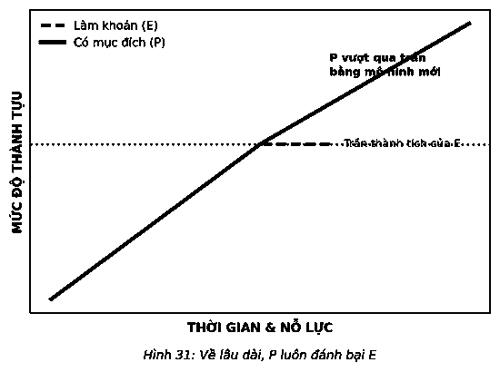

# 16. BA CAM KẾT

Đạt được các kết quả phi thường thông qua việc ngăn ô thời gian cần ba cam kết. Trước tiên, bạn phải chấp nhận suy nghĩ về một người nào đó đang tìm kiếm sự tinh thông. Sự tinh thông là một cam kết để trở thành người giỏi nhất, từ đó đạt được những kết quả ngoài sức tưởng tượng, bạn phải chấp nhận nỗ lực hết mình để đạt được chúng. Thứ hai, bạn phải liên tục tìm kiếm những cách thức tốt nhất để làm mọi việc. Không gì vô ích hơn việc kết quả không tương xứng với nỗ lực đã bỏ ra. Và cuối cùng, bạn phải sẵn sàng trở thành người có trách nhiệm để làm mọi thứ trong khả năng nhằm thực hiện điều quan trọng nhất. Sống với những cam kết này, bạn đã cho mình một cơ hội để có được những trải nghiệm khác biệt.

### BA CAM KẾT VỚI ĐIỀU Ý NGHĨA NHẤT

1. **Đi theo con đường của sự tinh thông**
2. **Di chuyển từ “E” đến “P”**
3. **Sống có trách nhiệm**

---

### 1. ĐI THEO CON ĐƯỜNG CỦA SỰ TINH THÔNG

Sự tinh thông không phải là thứ chúng ta thường xuyên nghe thấy, nhưng lại giữ vai trò rất quan trọng trong việc đạt được các kết quả đáng kinh ngạc. Sự tinh thông giống như một con đường thay vì một điểm đến, và thoạt đầu nó có vẻ đáng sợ nhưng đến cùng trở nên dễ tiếp cận và có thể đạt được. Phần lớn mọi người cho rằng sự tinh thông là kết quả cuối cùng nhưng xét về cốt lõi, sự tinh thông là một cách suy nghĩ, cách hành động và một cuộc hành trình mà bạn trải nghiệm. Khi những điều bạn chọn và thực hiện chúng thành thạo là đúng đắn, thì việc theo đuổi sự tinh thông sẽ khiến mọi việc khác cần thực hiện trở nên dễ dàng hơn hoặc không còn cần thiết. Đó là lý do những gì bạn lựa chọn để làm thành thạo lại quan trọng đến vậy.

Sự tinh thông đóng một vai trò quan trọng trong chuỗi domino.

> *“Không một ai từng nỗ lực hết mình lại tỏ ra hối hận về điều đó.”*  
> — **George Halas**

Tôi tin rằng quan điểm lành mạnh về sự tinh thông đồng nghĩa với việc tận dụng những điểm mạnh nhất của bạn để giúp bạn thực hiện được tốt nhất công việc quan trọng nhất của mình. Đây là con đường dành cho một người có cơ hội học hỏi và tái học hỏi những điều cơ bản trong hành trình không hồi kết để có được trải nghiệm và chuyên môn cao hơn. Cũng như, ở một điểm nào đó, các võ sinh đai trắng được đào tạo nâng bậc sẽ biết được các động tác cơ bản của cấp đai đen. Sự sáng tạo của một võ sĩ đai đen xuất phát từ sự tinh thông các nguyên tắc cơ bản ở cấp đai trắng. Nói cách khác, chúng ta trở thành bậc thầy của những gì chúng ta đã thông thạo và là người chập chững học hỏi những gì chưa thành thạo hoặc hoàn toàn mới. Đây là lý do sự tinh thông là một cuộc hành trình.

Năm 1993, nhà tâm lý học K. Anders Ericsson công bố tác phẩm “Vai trò của thực hành có chủ ý trong việc tiếp thu hiệu suất chuyên gia” trên tạp chí *Psychological Review*. Khi so sánh để hiểu rõ hơn về sự tinh thông, bài viết này đã vạch trần ý tưởng rằng một người xuất sắc là do có năng khiếu bẩm sinh. Về cơ bản, Ericsson đã cho chúng ta biết những kiến thức thực sự đầu tiên về sự tinh thông và đưa ra ý tưởng về “quy tắc 10.000 giờ”. Nghiên cứu của ông cho thấy một mô hình phổ biến về việc thực hành thường xuyên và có chủ ý thông qua khóa nghiên cứu trong nhiều năm về những người xuất sắc đã biến họ trở thành con người như hiện nay – thực sự xuất sắc. Trong một nghiên cứu, các nghệ sĩ violin ưu tú đã tách mình ra khỏi những người khác bằng việc tích lũy hơn 10.000 giờ luyện tập trước tuổi 20. Rất nhiều nhân vật ưu tú đã hoàn thành cuộc hành trình của họ trong khoảng 10 năm, trong đó, nếu bạn làm một phép toán: trung bình khoảng 3 giờ luyện tập có chủ ý hằng ngày trong 365 ngày của năm. Bây giờ nếu điều quan trọng nhất liên quan đến công việc và bạn phải làm việc 250 ngày một năm (5 ngày một tuần trong 50 tuần), để bắt kịp cuộc hành trình tinh thông bạn sẽ phải dành trung bình 4 giờ mỗi ngày. Đó không phải là một con số ngẫu nhiên. Đó là số lượng thời gian cần thiết để phân chia thời gian mỗi ngày cho điều quan trọng nhất của bạn.

Sự thành thạo đi liền với thời gian được đầu tư hơn bất cứ điều gì khác. Michelangelo từng nói: *“Nếu mọi người biết tôi đã vất vả ra sao để đạt được sự thông thạo của mình, họ sẽ thấy mọi chuyện chẳng có vẻ gì là tuyệt vời cả.”* Quan điểm của ông rất rõ ràng. Sự thục luyện bao giờ cũng đánh bại tài năng.

Khi ngăn ô thời gian dành cho điều quan trọng nhất, hãy chắc chắn bạn tiếp cận nó bằng sự tinh thông. Điều này sẽ mang lại cho bạn cơ hội tốt nhất để làm việc hiệu quả nhất, cuối cùng trở thành người giỏi nhất. Và thật thú vị khi: càng làm việc hiệu quả, bạn càng có nhiều khả năng nhận được những phần thưởng mà bạn có thể đã bỏ lỡ.

Trên con đường dẫn đến sự tinh thông cả sự tự tin và năng lực thành công của bạn cũng sẽ phát triển. Bạn sẽ khám phá ra rằng: con đường dẫn đến sự tinh thông không quá khác so với việc theo đuổi con đường tiếp theo. Bạn có thể ngạc nhiên trước việc dành thời gian để thành thạo việc quan trọng nhất như bước đệm để thực hiện hoặc tăng tốc quá trình thực hiện những việc khác như thế nào. Hiểu biết đem lại hiểu biết và các kỹ năng tạo nên kỹ năng. Đó là những gì khiến các quân domino tương lai dễ dàng đổ hơn.

Sự tinh thông là đam mê xứng đáng được theo đuổi, bởi đó là hành trình không hồi kết. Trong cuốn sách *Mastery* (tạm dịch: *Sự tinh thông*), George Leonard kể câu chuyện về Jigoro Kano, người sáng tạo ra môn Judo. Theo truyền thuyết, khi Kano sắp qua đời, ông đã gọi các học trò lại và yêu cầu họ chôn cất ông cùng với chiếc đai trắng của mình. Võ sư của môn phái đã mang theo biểu tượng của người mới nhập môn trong suốt cuộc sống cho tới khi đã nhắm mắt xuôi tay, bởi đối với ông hành trình học hỏi để thành công dường như dài vô tận.

---

### 2. ĐI TỪ “E” ĐẾN “P”

Khi huấn luyện cho các giám đốc điều hành cấp cao, tôi thường hỏi, “Các anh làm điều này chỉ đơn giản là làm hết khả năng hay làm điều đó tốt nhất có thể?” Mặc dù đó không phải là một câu hỏi đánh đố, nhưng nó có thể khiến mọi người mắc bẫy. Nhiều người nhận ra rằng dù nỗ lực hết sức, nhưng họ cũng không thể làm tốt nhất có thể, bởi họ không sẵn sàng thay đổi những gì họ đang làm. Hành trình tinh thông một điều gì đó là sự kết hợp giữa nỗ lực lớn nhất của bạn với khả năng thực hiện việc đó tốt nhất có thể. Tiếp tục cải thiện cách bạn làm một việc gì đó giữ vai trò tối quan trọng giúp tận dụng tối đa việc ngăn ô thời gian.

Đó là hành trình đi từ “E” đến “P”.

Khi thức giấc vào buổi sáng và bắt đầu giải quyết mọi việc trong ngày, chúng ta thường làm theo một trong hai cách: **Làm khoán** (“E” – Entrepreneurial) hoặc **Có mục đích** (“P” – Purposeful). Làm khoán là cách tiếp cận tự nhiên của chúng ta. Nó cho thấy thứ chúng ta muốn làm hoặc cần phải làm và nỗ lực làm điều đó với sự nhiệt tình, năng lượng và khả năng thiên bẩm. Cho dù đó là việc gì, mọi khả năng thiên bẩm đều là giới hạn của thành tích, năng suất và thành công hạn định. Mặc dù điều này tùy thuộc vào từng người, từng nhiệm vụ, nhưng ai cũng có những giới hạn tự nhiên đối với mọi việc trong cuộc sống. Đưa cho vài người một chiếc búa, họ có thể sử dụng nó thành thạo. Đưa cho tôi một chiếc búa, tôi có thể đập vỡ mọi thứ. Nói theo cách khác, một số người có thiên hướng sử dụng chiếc búa rất tốt mà hầu như không cần hướng dẫn hoặc thực hành, nhưng có những người như tôi có những hạn chế về thành tích. Nếu kết quả từ những nỗ lực của bạn có thể được chấp nhận ở bất cứ mức độ thành tích nào bạn đạt đến, xin chúc mừng bạn nên tiếp tục nỗ lực hơn nữa. Nhưng khi tiến dần đến điều quan trọng nhất, bạn phải thách thức bất cứ giới hạn thành tích nào, và điều này đòi hỏi một cách tiếp cận khác biệt – tiếp cận có mục đích.

Những người thành đạt không chấp nhận mọi giới hạn của phương pháp tiếp cận tự nhiên như quyết định cuối cùng về thành công của họ. Khi chạm tới giới hạn thành tích, họ tìm kiếm các mô hình và các hệ thống mới, các cách tốt hơn để làm mọi việc nhằm thúc đẩy họ nỗ lực hơn nữa. Họ dừng đủ lâu để kiểm chứng các lựa chọn của họ, họ chọn phương án tốt nhất, và sau đó họ nhanh chóng tiếp cận nó. Hãy đề nghị một người có tư tưởng làm khoán “E” đốn một ít củi, họ sẽ vác rìu đi thẳng vào rừng. Thế nhưng những người có mục đích “P” sẽ hỏi, *“Tôi có thể lấy một chiếc cưa máy ở đâu?”* Với tư duy “có mục đích”, bạn có thể đạt được những đột phá và thực hiện mọi việc vượt xa khả năng thiên bẩm của bạn. Chỉ cần bạn sẵn sàng làm bất cứ điều gì có thể.

Bạn không thể đặt ra các giới hạn về những gì bạn sẽ làm. Bạn phải cởi mở với các ý tưởng mới và thực hiện mọi việc theo cách mới mẻ nếu muốn có những bước đột phá trong cuộc sống. Khi đi trên con đường dẫn đến sự tinh thông, bạn sẽ thấy bản thân liên tục được thử thách làm những điều mới mẻ. Người có mục đích đi theo quy tắc đơn giản “một kết quả khác biệt cần một hành động khác biệt”. Biến điều này thành câu thần chú của bạn và chờ đón những bước tiến đột phá.

Quá nhiều người đạt đến cấp độ hiệu suất “đủ tốt” và sau đó không tiếp tục nỗ lực hơn nữa. Mọi người trên con đường dẫn đến sự tinh thông đã tránh điều này bằng cách liên tục nâng cao mục tiêu của họ, thách thức bản thân phá vỡ các giới hạn hiện tại. Đó là những gì nhà văn kiêm bậc thầy ghi nhớ Joshua Foer gọi là “Trạng thái bình ổn”. Ông đã minh họa nó bằng việc đánh máy. Nếu thời gian thực hành là tất cả những gì quan trọng nhất, trong suốt quá trình học tập, với hàng triệu bản ghi nhớ và e-mail đánh máy, chúng ta sẽ từ một người mò mẫm tiến bộ thành người đánh được 100 từ/phút. Nhưng điều đó không xảy ra. Chúng ta đạt đến kỹ năng chúng ta cho là có thể chấp nhận được và sau đó ngừng việc học hỏi. Chúng ta tiếp tục hành trình thời điểm tự động và chạm đến các giới hạn thành tích phổ biến nhất: trạng thái bình ổn.

Khi tìm kiếm các kết quả đáng kinh ngạc, việc chấp nhận một trạng thái bình ổn hoặc bất cứ giới hạn thành tích nào khác không hề ổn khi áp dụng nó vào điều quan trọng nhất của bạn. Khi bạn muốn phá vỡ trạng thái bình ổn và các giới hạn, chỉ có một phương pháp – “sống có mục đích”.

Trong kinh doanh cũng như cuộc sống, chúng ta đều bắt đầu với tinh thần làm khoán. Chúng ta theo đuổi một điều gì đó với mức độ khả năng, năng lượng, kiến thức và nỗ lực hiện tại – xét trong ngắn hạn, mọi thứ đều dễ dàng. Tuy vậy, nó cũng có rất nhiều hạn chế.

Khi “E” là phương pháp tiếp cận duy nhất, chúng ta tạo ra các giới hạn giả cho những gì có thể đạt được và người chúng ta có thể trở thành. Nếu giải quyết một việc bằng “E” và sau đó chạm đến giới hạn thành tích, chúng ta chỉ đơn giản chạm vào nó và nảy ngược lại hết lần này đến lần khác cho đến khi chúng ta tuyệt vọng, chán nản với thành tích tối đa duy nhất chúng ta có thể đạt được. Cuối cùng chúng ta sẽ nhanh chóng chuyển hướng sang mục tiêu khác. Khi nghĩ mình đã nỗ lực hết sức, chúng ta cho rằng “bắt đầu lại” là phương án tối ưu duy nhất để tiến lên phía trước. Vấn đề là điều này trở thành một chu kỳ luẩn quẩn khi chúng ta làm việc gì đó mới mẻ tiếp theo với sự nhiệt tình, năng lượng, khả năng tự nhiên và nỗ lực đã được đổi mới, rồi lại đạt đến các giới hạn, kèm theo sự thất vọng và chán nản tái lặp. Và sau đó, lại là những hướng đi mới tiếp theo.

Đưa “P” đến giới hạn tương tự và mọi thứ sẽ hoàn toàn khác biệt. Những người sở hữu phương pháp tiếp cận có mục đích cho rằng: “Tôi vẫn đang cam kết để ngày càng phát triển hơn nữa, vậy các quyền chọn của tôi là gì?” Sau đó, bạn sử dụng câu hỏi tập trung để thu hẹp các lựa chọn khi chỉ còn điều tiếp theo nên làm. Bạn có thể làm theo một mô hình mới, có được một hệ thống mới, hoặc cả hai. Nhưng hãy sẵn sàng. Thực hiện những điều này có thể cần đến tư duy mới, những kỹ năng mới và thậm chí cả các mối quan hệ mới. Có lẽ không điều nào trong số những điều này mang thiên hướng bẩm sinh, nhưng khi cam kết đạt được các kết quả đáng kinh ngạc, bạn hãy làm bất cứ điều gì có thể.

Khi nỗ lực hết sức nhưng kết quả chắc chắn không phải tốt nhất, hãy chuyển từ “E” sang “P”. Hãy tìm kiếm những mô hình và hệ thống tốt hơn, hay các cách có thể đưa bạn tiến xa hơn. Sau đó chấp nhận phương pháp tư duy mới, những kỹ năng mới, và các mối quan hệ mới để giúp bạn hành động. Trở thành người có mục đích trong quá trình phân chia thời gian và mở khóa tiềm năng của bạn.

---

### 3. SỐNG CÓ TRÁCH NHIỆM

Một kết nối không thể phủ nhận giữa những gì bạn làm và những gì bạn nhận được. Hành động xác định các kết quả và kết quả thông tin cho hành động. Sống có trách nhiệm cùng với vòng phản hồi này sẽ giúp bạn khám phá ra những điều bạn phải làm để đạt được những kết quả đáng kinh ngạc. Đó là lý do cam kết cuối cùng của bạn là sống có trách nhiệm.

Để sở hữu toàn bộ kết quả, bạn phải là người duy nhất chịu trách nhiệm về chúng để thúc đẩy thành công của bạn. Trách nhiệm giữ vai trò quan trọng nhất trong ba cam kết. Nếu không có nó, cuộc hành trình dẫn đến sự tinh thông sẽ gián đoạn khi bạn gặp phải thách thức. Nếu không có nó, bạn sẽ không tìm ra cách phá vỡ các giới hạn thành tích gặp phải. Những người có trách nhiệm thừa nhận thất bại và kiên trì nỗ lực. Họ coi trọng kết quả và không bao giờ biện hộ cho hành động, các kỹ năng, mô hình, hệ thống hoặc các mối quan hệ không giúp hoàn thành công việc.

Bạn chỉ có hai lựa chọn – trách nhiệm hoặc vô trách nhiệm. Điều này nghe có vẻ khắc nghiệt, nhưng đó là sự thật. Mỗi ngày tùy thuộc vào sự lựa chọn cách tiếp cận này hay cách khác, và hậu quả sẽ mãi theo sau chúng ta.

Để minh họa sự khác biệt, hãy nghe câu chuyện về hai nhà quản lý hai doanh nghiệp cạnh tranh cùng trải nghiệm sự thay đổi đột ngột trong thị trường. Một hàng dài khách hàng trước cửa hàng trong tháng này. Thế nhưng tháng sau không có bóng dáng một ai. Phản ứng của mỗi quản lý tạo nên sự khác biệt rất lớn.

Người quản lý có trách nhiệm ngay lập tức lên tiếng: *Có vấn đề gì đó?* Cô điều tra chính xác những gì mình đang phải đương đầu. Người quản lý còn lại từ chối thừa nhận những gì đang xảy ra. Đó là một sự phiền nhiễu, một trục trặc, một sự bất thường. Anh nhún vai coi nó chỉ đơn giản là một “tháng làm ăn không tốt”. Trong khi đó, người quản lý có trách nhiệm đã phát hiện ra các đối thủ cạnh tranh đang dần chiếm thị phần của họ và nói, “đó là vấn đề”. Tâm thế sẵn sàng làm rõ vấn đề đã mang lại cho cô một lợi thế cạnh tranh rất lớn. Nó khiến cô bắt đầu cân nhắc để tạo ra sự khác biệt.

Người quản lý còn lại liên tục phủ nhận thực tế. Anh ta đưa ra một cách nhìn khác biệt, đổ trách nhiệm cho người khác: *Nếu mọi người trong công ty chịu làm tốt công việc của họ, chúng tôi sẽ không gặp vấn đề như thế!*

Người quản lý có trách nhiệm tìm kiếm các giải pháp. Quan trọng hơn, cô tự thừa nhận là một phần của giải pháp: *Tôi có thể làm gì?* Khi tìm ra chiến thuật đúng đắn, cô bắt đầu hành động. Người quản lý còn lại, đổ lỗi cho những người khác, biện minh cho sai sót của bản thân: *Đó không phải là việc của tôi*, ông tuyên bố, và hy vọng mọi thứ sẽ tốt lên.

Cứ như vậy, sự khác biệt giữa họ rất rõ rệt. Một người tích cực cố gắng để làm chủ số phận của mình. Một người chỉ đơn giản phó mặc. Một người hành động có trách nhiệm, người kia tự biến mình thành nạn nhân. Một người mong muốn thay đổi kết quả còn một người thì không.

Tôi chỉ đang mô tả thái độ, chứ không phải con người. Tuy nhiên nếu có thái độ này trong một khoảng thời gian đủ lâu, “nạn nhân” sẽ chỉ cả thái độ lẫn con người. Không ai ngay từ khi sinh ra đã là một nạn nhân, đó chỉ đơn giản là một thái độ hoặc một cách tiếp cận. Nhưng nếu được phép tồn tại, điều này sẽ trở thành một thói quen. Ngược lại, bất cứ ai cũng có thể trở thành người có trách nhiệm – càng sống có trách nhiệm, bạn càng ứng phó được với mọi nghịch cảnh.

Người thành công hiểu rất rõ về vai trò của họ trong các mốc của cuộc đời. Họ biết đây là cách duy nhất để phát hiện ra những giải pháp mới, áp dụng chúng và trải nghiệm một thực tế khác biệt, vì vậy họ sống có trách nhiệm và đồng hành cùng chúng. Họ coi các kết quả là thông tin có thể sử dụng để cơ cấu cho hành động tốt hơn nhằm có được kết quả tốt hơn. Đó là một chu kỳ đi từ hiểu biết đến sử dụng thực tế để đạt được các kết quả đáng kinh ngạc.

Một trong những cách nhanh nhất để đưa trách nhiệm vào cuộc sống của bạn là tìm một đối tác tin cậy. Trách nhiệm có thể đến từ một nhà cố vấn, bạn bè hoặc ở dạng thức cao nhất, một huấn luyện viên. Dù vậy, bạn vẫn phải có được một mối quan hệ có trách nhiệm và cho đối tác thấy được sự chân thành của bạn. Một đối tác có trách nhiệm không phải là thành viên đội cổ vũ, dù anh ta có thể là người động viên bạn. Anh ta sẽ đưa ra những phản hồi thẳng thắn, khách quan về hiệu suất làm việc của bạn, tạo ra kỳ vọng về sự tiến bộ liên tục, và đưa ra quan điểm, thậm chí hiểu biết cá nhân khi cần thiết. Đối với tôi, một huấn luyện viên hoặc một cố vấn là sự lựa chọn tốt nhất để trở thành một đối tác có trách nhiệm. Dù đồng nghiệp hoặc bạn bè hoàn toàn có thể giúp bạn thấy rõ những điều bạn không quan sát được, nhưng tinh thần trách nhiệm liên tục tốt nhất xuất phát từ một người mà bạn cảm nhận được tính trách nhiệm thực sự từ họ. Đó là bản chất của mối quan hệ, và từ đây các kết quả tốt nhất sẽ xuất hiện.

Trước đây, tôi đã thảo luận về kết quả nghiên cứu của Tiến sĩ Gail Matthews cho rằng các cá nhân sở hữu những mục tiêu được viết ra có 39,5% khả năng thành công hơn người khác. Nhưng câu chuyện không chỉ dừng lại ở đó. Các cá nhân viết ra mục tiêu của mình và gửi báo cáo tiến độ đến bạn bè có 76,7% khả năng thành công. Cũng hiệu quả như việc viết ra các mục tiêu, hành động chia sẻ sự tiến bộ về việc hướng tới các mục tiêu của bạn tới ai đó thường xuyên, thậm chí chỉ cần là một người bạn, sẽ mang lại hiệu quả gấp đôi.

Nghiên cứu của Ericsson về hiệu suất chuyên gia xác nhận mối quan hệ tương tự giữa hiệu quả xuất sắc và huấn luyện. Ông quan sát thấy rằng “sự khác biệt quan trọng duy nhất giữa những người nghiệp dư và ba nhóm người có hiệu quả làm việc xuất sắc đó là các nghệ sĩ ưu tú tương lai tìm kiếm các giáo viên và huấn luyện viên đồng thời tham gia vào đào tạo giám sát, trong khi các tay nghiệp dư hiếm khi tham gia vào các hoạt động tương tự.”

Một đối tác có trách nhiệm sẽ ảnh hưởng tích cực đến năng suất của bạn. Họ sẽ giúp bạn luôn trung thực và đi đúng hướng. Chỉ cần biết họ đang chờ đợi báo cáo tiến bộ của bạn sẽ thúc đẩy bạn có được kết quả tốt hơn. Lý tưởng nhất, một huấn luyện viên có thể “huấn luyện” bạn cách tối đa hóa hiệu suất theo thời gian. Đây là cách tốt nhất để trở thành người giỏi nhất.

Huấn luyện viên sẽ giúp bạn bằng cả ba cam kết về điều quan trọng nhất. Trong thực tế, bạn khó có thể tìm thấy ai có khả năng xuất sắc mà không có sự hỗ trợ của một huấn luyện viên về mọi lĩnh vực.

Không bao giờ quá sớm hoặc quá muộn để có được một huấn luyện viên. Hãy cam kết đạt được các kết quả phi thường và bạn sẽ tìm thấy một huấn luyện viên có khả năng cung cấp cho bạn cơ hội tốt nhất.

---

> ### Ý TƯỞNG LỚN
>
> 1. **Cam kết nỗ lực hết mình.** Những kết quả khác biệt chỉ xảy ra khi bạn nỗ lực hết mình để trở thành người giỏi nhất trong công việc quan trọng nhất của bạn. Về bản chất, đây là con đường dẫn đến sự tinh thông và do sự tinh thông cần có thời gian, nên chúng ta cũng cần phải cam kết mới đạt được nó.
> 2. **Hướng tới điều quan trọng nhất một cách có mục đích.** Đi từ “E” đến “P”. Bám sát nhiệm vụ và các mô hình và các hệ thống có thể đưa bạn tiến xa nhất có thể. Đừng ngồi chờ những gì đến tự nhiên – hãy cởi mở với những tư duy mới, kỹ năng mới và mối quan hệ mới. Nếu con đường dẫn đến sự tinh thông là cam kết nỗ lực hết mình của bạn, thì sống có mục đích là cam kết áp dụng các phương pháp tiếp cận tốt nhất.
> 3. **Giám sát các kết quả của bạn.** Nếu kết quả đáng kinh ngạc là những gì bạn muốn, thì việc trở thành một nạn nhân sẽ không mang lại hiệu quả. Sự thay đổi chỉ diễn ra khi bạn có trách nhiệm. Vì vậy hãy rời khỏi ghế hành khách và cầm lái chiếc xe cuộc đời bạn.
> 4. **Tìm một huấn luyện viên.** Bạn khó có thể tìm thấy bất cứ ai đạt được những kết quả đáng kinh ngạc khi không có sự hỗ trợ của một huấn luyện viên.
>
> *Hãy nhớ rằng chúng ta không nói về các kết quả thông thường mà là sự khác biệt. Loại năng suất đó có vẻ khó đạt nhất, nhưng không phải vậy. Khi bạn ngăn ô thời gian cho điều quan trọng nhất, hãy bảo vệ khối thời gian đó, và tận dụng nó hiệu quả nhất, bạn sẽ đạt được hiệu quả tối đa.*  
> *Giờ đây, bạn chỉ cần tránh không bị lạc lối.*
>
> 
