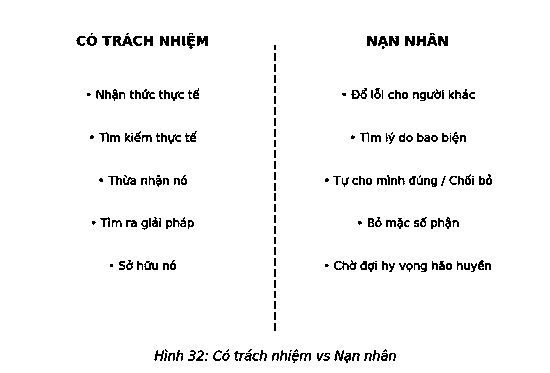
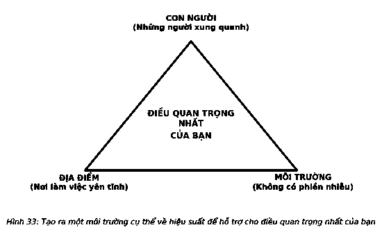

# 17. BỐN KẺ TRỘM

Năm 1973, một nhóm sinh viên trường dòng tình cờ tham gia vào một nghiên cứu lớn được gọi là “Thí nghiệm người làm phúc”. Những sinh viên này được tuyển chọn để xem các nhân tố bên ngoài có ảnh hưởng đến việc họ sẽ giúp đỡ một người lạ bị nạn hay không? Họ sẽ phải chuẩn bị cho một buổi nói chuyện về các công việc ở trường dòng. Một số người trong nhóm được cho biết họ sắp bị trễ và phải gấp rút đến chỗ hẹn, trong khi một số người được cho biết là họ có thể thoải mái vì còn rất nhiều thời gian. Các nhà nghiên cứu đã đưa người của họ vào hành trình – anh ta đi chậm chạp, ho nhiều và có vẻ vừa gặp nạn.

> *“Tập trung liên quan đến việc quyết định những gì bạn sẽ không làm.”*  
> — **John Carmack**

Cuối cùng gần một nửa các sinh viên đã dừng lại để giúp đỡ. Nhưng yếu tố quyết định không phải là nhiệm vụ mà là thời gian: 90% các sinh viên được thúc giục đã không dừng lại và giúp đỡ người lạ. Một số thậm chí còn vội vàng bước qua anh ta để có thể đến đúng giờ.

Rõ ràng những ý định tốt nhất của chúng ta có thể dễ dàng không được thực hiện. Sẽ có 4 kẻ trộm có thể phình phình và đánh cắp hiệu suất của bạn. Và do chẳng ai ở đó để bảo vệ bạn, nên bạn là người duy nhất tự ngăn chặn những tên trộm này để tránh bị tấn công.

### BỐN KẺ TRỘM HIỆU SUẤT

1. **Không có khả năng nói “Không”**
2. **Sợ sự xáo trộn**
3. **Các thói quen ảnh hưởng tiêu cực đến sức khỏe**
4. **Môi trường không hỗ trợ cho các mục tiêu của bạn**

---

### 1. KHÔNG CÓ KHẢ NĂNG NÓI “KHÔNG”

Có người từng nói với tôi rằng một cái gật đầu phải được đánh đổi bằng 1.000 lần nói “không”. Khi mới khởi nghiệp, tôi không hiểu điều này. Giờ đây, tôi hiểu rằng đó là một cách nói giảm nói tránh. Để bảo vệ những gì bạn đồng ý và luôn đạt được hiệu quả, bạn phải nói không với bất cứ ai hay bất cứ điều gì có thể khiến bạn xao nhãng.

Các đồng nghiệp sẽ hỏi tư vấn từ bạn. Họ muốn bạn ở trong nhóm của họ. Bạn bè cần sự hỗ trợ của bạn. Những người lạ sẽ khiến bạn mất tập trung. Các lời mời và sự gián đoạn sẽ bủa vây bạn. Cách bạn xử lý tất cả những điều này quyết định thời gian bạn có thể dành cho điều quan trọng nhất và kết quả cuối cùng bạn tạo ra.

Vấn đề là khi bạn nói có với một việc gì đó, bắt buộc bạn phải hiểu những gì bạn nói không. Nhà soạn kịch Sidney Howard, tác giả của tác phẩm kinh điển *Cuốn theo chiều gió*, khuyên bạn rằng: *“Một nửa của việc biết những gì bạn muốn là biết những gì bạn phải từ bỏ trước khi bạn có được nó.”* Cuối cùng cách tốt nhất để thành công lớn là đi từng bước nhỏ. Và khi bạn đi từng bước nhỏ, bạn nói không nhiều lần hơn bạn tưởng.

Steve Jobs là người làm được điều đó tốt nhất. Trong hai năm sau khi trở lại vào năm 1997, ông đã giảm số lượng sản phẩm của công ty từ 350 sản phẩm xuống còn 10 sản phẩm. Ông đã nói không với 340 sản phẩm, không kể đến bất cứ lời đề xuất mới nào trong suốt thời gian đó. Tại Hội nghị các nhà phát triển MacWorld năm 1997, ông giải thích, *“Khi nghĩ về sự tập trung, bạn nghĩ rằng ‘Ồ, tập trung là nói có.’ Không! Tập trung là nói không.”* Jobs theo đuổi các thành tựu đáng kinh ngạc và ông biết chỉ có một cách duy nhất để đạt được điều đó. Jobs là người dám nói “không”.

Nghệ thuật nói “có”, theo mặc định, là nghệ thuật nói không. Nói có với tất cả không khác nào việc không dám nói không với bất cứ điều gì. Mỗi nhiệm vụ bổ sung sẽ bào mòn sự hiệu quả trong mọi việc khác. Càng làm nhiều, bạn càng ít thành công. Bạn không thể làm hài lòng mọi người, do đó, đừng cố gắng làm vậy. Thực tế, khi cố gắng làm điều đó, người duy nhất bạn không làm hài lòng chính là bản thân bạn.

Hãy nhớ rằng nói có với điều quan trọng nhất là ưu tiên hàng đầu của bạn. Miễn bạn coi đây là mục tiêu của mình, việc nói không với bất cứ điều gì gây xao nhãng cho bạn là điều có thể chấp nhận được. Sau đó, vấn đề chỉ là cách thực hiện.

Tất cả chúng ta đều tranh đấu đến mức độ nào đó với việc nói không. Có rất nhiều lý do. Chúng ta muốn trở nên hữu ích, không muốn làm tổn thương ai, muốn được chăm sóc và quan tâm. Và chúng ta không muốn có vẻ nhẫn tâm, lạnh lùng. Tất cả những điều này hoàn toàn dễ hiểu. Được người khác cần đến và giúp đỡ người khác mang lại cảm giác vô cùng thoải mái. Tập trung vào các mục tiêu của mình đến mức bỏ bê những việc khác, đặc biệt là những hoạt động và những người chúng ta coi trọng nhất, có thể tạo cảm giác ích kỷ. Nhưng không phải vậy.

Bậc thầy marketing Seth Godin từng nói: *“Bạn có thể từ chối bằng sự tôn trọng, bạn có thể nói không ngay lập tức và bạn có thể nói không kèm một lời chỉ dẫn đến những người có thể nói có. Nói có vì bạn không thể chịu đựng được sự khó chịu tạm thời của việc nói không sẽ không giúp bạn làm việc hiệu quả.”* Bạn có thể đưa ra những lời nói có và nói không theo cách mang lại hiệu quả cho bạn và cho những người khác.

Tất nhiên, bất cứ khi nào bạn cũng có thể nói không khi cần. Trong thực tế, đây sẽ là sự lựa chọn đầu tiên của bạn ở mọi lúc. Nhưng nếu bạn cảm thấy có những lúc cần phải nói không một cách hữu ích, thì có rất nhiều cách để nói mà vẫn có thể hướng mọi người tiến về phía mục tiêu của mình.

Bạn có thể hỏi họ những câu hỏi khiến họ tìm đến sự giúp đỡ cần thiết ở bất cứ đâu. Bạn có thể đưa ra cách tiếp cận khác mà không cần bất kỳ sự trợ giúp nào. Bạn có thể không biết họ có khả năng làm gì khác nữa, vì vậy bạn có thể giúp họ bằng cách nhẹ nhàng khuyến khích họ tự đưa ra ý tưởng. Bạn có thể chuyển hướng yêu cầu của họ một cách lịch sự sang những người khác để người đó hỗ trợ họ tốt hơn.

Bây giờ nếu bạn phải nói có, có rất nhiều cách sáng tạo để làm điều đó. Nói cách khác, bạn có thể tận dụng những lời nói có của bạn. Những bàn trợ giúp, các trung tâm hỗ trợ và những nguồn thông tin không thể tồn tại nếu không có loại tư duy chiến lược này. Các kịch bản in sẵn, các trang câu hỏi hoặc tệp dữ liệu thường được hỏi, những bản giải thích được viết ra, các hướng dẫn được lưu lại, các thông tin được đăng lên, các bản danh sách, danh mục, thư mục và các lớp đào tạo được lên lịch trước đều có thể được sử dụng hiệu quả để nói có trong khi vẫn bảo vệ được ô thời gian của bạn. Tôi bắt đầu áp dụng điều này vào công việc đầu tiên của tôi ở vị trí quản lý bán hàng. Tôi thúc đẩy các khóa đào tạo để lọc ra các câu hỏi thường được đặt ra, và sau đó bằng cách in hoặc ghi lại chúng tôi đã tạo ra một thư viện các câu trả lời mà đội của tôi có thể sử dụng bất cứ khi nào tôi không thể có mặt để giúp đỡ họ.

Bài học lớn nhất tôi học được đó là nó sẽ giúp tôi có được một triết lý và một cách tiếp cận để quản lý thời gian của tôi. Theo thời gian, tôi phát triển những gì tôi gọi là “quy tắc 1m”. Khi tôi dang cánh tay ra, từ cổ đến các ngón tay của tôi cách nhau khoảng 1m. Tôi đã biến nó trở thành sứ mệnh quản lý thời gian để hạn chế mọi người và những gì tôi có thể nhìn thấy trong vòng 1m. Quy tắc rất đơn giản: Một yêu cầu phải được kết nối với điều quan trọng nhất để tôi xem xét. Nếu không, tôi hoặc nói không hoặc sẽ sử dụng bất cứ một trong những cách tiếp cận mà tôi chia sẻ ở trên để chuyển hướng nó sang nơi khác.

Học cách nói không không phải là một cách để trở thành một người sống khép kín. Ngược lại, đó là cách để có được sự tự do lớn nhất và linh hoạt nhất. Tài năng và khả năng của bạn là nguồn lực hạn chế. Thời gian của bạn cố định. Nếu bạn không gắn cuộc sống của bạn với những gì bạn nói có, thì nó sẽ đi theo hướng những gì bạn định nói không.

Trong một bài báo năm 1977 trên tạp chí *Ebony*, diễn viên hài nổi tiếng Bill Cosby, khi gây dựng sự nghiệp của mình, đã đọc một số lời khuyên mà ông luôn khắc cốt ghi tâm: *“Tôi không biết chìa khóa để thành công nhưng chìa khóa để thất bại là cố gắng làm hài lòng tất cả mọi người.”* Nếu không thể nói không, bạn sẽ không bao giờ thực sự đạt được điều quan trọng nhất của mình.

---

### 2. SỢ SỰ XÁO TRỘN

Sự xáo trộn là thực tế xảy ra trên suốt hành trình dẫn đến kết quả đáng kinh ngạc. Tình trạng bất ổn. Xáo trộn. Rối loạn. Khi chúng ta làm việc không ngừng nghỉ để tận dụng khối thời gian của mình, sự xáo trộn sẽ tự động cư trú xung quanh chúng ta.

Xáo trộn là điều không thể tránh khỏi khi bạn chỉ tập trung vào điều quan trọng nhất. Khi bạn chuyên tâm vào việc quan trọng nhất, thế giới sẽ không chờ đợi bạn. Nó thay đổi nhanh chóng theo từng ngày và mọi thứ sẽ rối tung khi bạn tập trung vào số ít các ưu tiên. Bạn không thể khiến cuộc sống chậm hay ngừng lại. Một trong những tên trộm năng suất lớn nhất là việc không sẵn sàng để sự hỗn loạn hoặc thiếu sáng tạo xuất hiện trong quá trình xử lý tên trộm đó.

Tập trung vào điều quan trọng nhất đồng nghĩa với việc những thứ khác sẽ không được thực hiện. Sẽ luôn có những người và dự án không phải là một phần trong ưu tiên lớn nhất của bạn nhưng vẫn khá quan trọng. Bạn sẽ cảm thấy chúng cũng cần sự chú ý của bạn. Sẽ luôn có những công việc không được hoàn thành và chưa kết thúc luẩn quẩn đâu đó để lôi kéo sự tập trung của bạn. Khi điều này xảy ra, khi bạn tạo áp lực về bất cứ sự hỗn loạn nào không được chú ý đến, đó là sự giải phóng hoàn toàn không mang lại hiệu suất.

> *“Nếu một chiếc bàn lộn xộn là dấu hiệu của một tâm trí lộn xộn, thì một chiếc bàn trống không là dấu hiệu của điều gì?”*  
> — **Albert Einstein**

Thực tế, đó là một thỏa thuận trọn gói. Khi bạn cố gắng để đạt đến điểm tốt nhất, sự hỗn loạn chắc chắn sẽ xuất hiện. Các lĩnh vực khác trong cuộc sống của bạn có thể gặp sự hỗn loạn tỷ lệ thuận với thời gian bạn đầu tư vào điều quan trọng nhất. Vấn đề là bạn chấp nhận điều này thay vì chiến đấu với nó. Francis Ford Coppola, đạo diễn từng đoạt giải Oscar, đã cảnh báo chúng ta rằng “bất cứ điều gì bạn xây dựng với quy mô lớn hoặc có niềm đam mê mãnh liệt sẽ gây ra sự hỗn loạn”. Nói cách khác, hãy làm quen với điều đó và hãy vượt qua nó.

Trong cuộc sống hoặc công việc của bất kỳ ai, có những thứ không thể bỏ qua: gia đình, bạn bè, vật nuôi, các cam kết cá nhân hoặc các dự án công việc quan trọng. Tại bất kỳ thời điểm nào, bạn có thể đưa một vài hoặc tất cả những điều này vào khối thời gian của bạn. Bạn không thể từ bỏ sức mạnh thời gian của bạn, đó là điều đương nhiên. Vậy, bạn sẽ làm gì?

Mọi người hỏi tôi rất nhiều về điều này: “Tôi sẽ phải làm gì nếu là một bà mẹ đơn thân?” “Chuyện gì xảy ra nếu tôi có cha mẹ già sống phụ thuộc vào mình?” “Tôi có nhiều việc phải tự làm, vậy tôi phải làm gì?” Đây rõ ràng là những câu hỏi rất ấn tượng. Tôi nói với họ như sau:

Tùy thuộc vào từng hoàn cảnh, khối thời gian của bạn ban đầu có vẻ khác biệt so với những người khác. Tình huống của mỗi người đều đa dạng. Tùy thuộc vào việc bạn đang ở địa vị, vị trí nào, thời gian riêng tư của bạn có thể khác ở từng thời điểm trong ngày. Bạn có thể phải đánh đổi thời gian với những người khác để họ bảo vệ khối thời gian của bạn còn bạn bảo vệ thời gian của họ. Bạn thậm chí có thể nhờ con cái hoặc cha mẹ mình ngăn ô thời gian giúp bạn.

> *“Nghệ thuật của sự khôn ngoan là nghệ thuật biết cách bỏ qua.”*  
> — **William James**

Nếu cần cầu xin, hãy cứ cầu xin. Nếu phải trao đổi, hãy cứ trao đổi. Nếu phải sáng tạo, đừng ngại sáng tạo. Chỉ cần bạn không tự biến mình thành nạn nhân của hoàn cảnh. Đừng hy sinh thời gian của bạn do suy nghĩ rằng “tôi không thể làm được việc đó”. Hãy làm rõ nó. Hãy tìm ra cách. Hãy biến nó thành hiện thực.

Khi bạn cam kết với điều quan trọng nhất mỗi ngày, các kết quả đáng kinh ngạc cuối cùng cũng sẽ xuất hiện. Lúc đó, điều này tạo ra cơ hội quản lý sự hỗn loạn. Vì vậy, đừng để tên trộm này móc túi hiệu suất của bạn. Vượt qua nỗi sợ hỗn loạn, học cách đối phó với nó và tin tưởng rằng điều quan trọng nhất sẽ mang lại thành công cho bạn.

---

### 3. CÁC THÓI QUEN CÓ HẠI CHO SỨC KHỎE

Mọi người từng hỏi tôi, “Nếu không biết cách chăm sóc bản thân, bạn sẽ sống ra sao?” Tôi đã chiến đấu với sự đau đớn của bệnh viêm bàng quang kẽ và phải đối mặt với chứng run chân liên tục, một tác dụng phụ gây suy nhược của việc đốt cháy statin cholesterol. Khả năng vận động của tôi bị tổn hại rất lớn, và để khắc phục được điều này sẽ rất khó khăn. Bác sĩ của tôi đã đưa ra một số lựa chọn và hỏi tôi muốn làm gì. Câu trả lời là thay đổi các thói quen ảnh hưởng tiêu cực đến sức khỏe của tôi. Đó cũng là lúc tôi phát hiện ra một trong những bài học lớn nhất về các kết quả đáng kinh ngạc.

Không quản lý được các thói quen có hại cho sức khỏe là một tên trộm năng suất thầm lặng.

Khi không biết cách bảo vệ năng lượng của mình, chúng ta có thể sẽ cạn kiệt năng lượng và dẫn đến quá tải. Bạn sẽ thường xuyên gặp phải tình trạng này. Khi mọi người không hiểu được sức mạnh của điều quan trọng nhất, họ sẽ cố gắng ôm đồm nhiều việc và bởi điều này không bao giờ có hiệu quả dài hạn, nên họ sẽ thực hiện một sự thương thảo bất lợi với chính mình. Họ hy sinh sức khỏe để đổi lấy thành công. Họ thức khuya, bỏ bữa hoặc ăn uống kém, và hoàn toàn bỏ qua việc tập thể dục. Năng lượng cá nhân sẽ trở thành suy nghĩ muộn màng khiến sức khỏe và cuộc sống gia đình bị ảnh hưởng và coi đó như một mặc định. Nỗ lực đạt được mục tiêu dẫn đến suy nghĩ rằng việc lừa dối chính mình là một lựa chọn tốt đẹp, nhưng họ không hề biết rằng họ đang nắm chắc phần thua trong canh bạc này. Thật nguy hiểm khi cho rằng sức khỏe và gia đình sẽ chờ bạn trở lại và tận hưởng bất cứ lúc nào.

Thành tích cao và những kết quả đáng kinh ngạc đòi hỏi nguồn năng lượng rất lớn. Hãy học cách có được nó và gìn giữ nó.

Vậy, bạn có thể làm gì? Hãy coi mình như một cỗ máy sinh học tuyệt vời và cân nhắc việc lập kế hoạch năng lượng hằng ngày để đạt được hiệu suất cao nhất.

Hãy dùng bữa ăn quan trọng nhất trong ngày: một bữa sáng bổ dưỡng để cung cấp năng lượng cho cả ngày làm việc của bạn. Bạn không thể có một ngày làm việc với cái bụng rỗng. Hãy lên lịch cho thực đơn các bữa ăn hằng ngày của bạn một tuần một lần.

Tập thể dục để giảm căng thẳng và tăng cường sức dẻo dai của cơ thể. Tất cả những việc này mang lại cho bạn năng lực tối đa cần thiết để có được hiệu suất cao nhất. Vào cuối ngày, nếu bạn chưa đi được ít nhất 10.000 bước mỗi ngày, hãy biến nó thành bài tập thể dục ý nghĩa nhất để đạt được mục tiêu 10.000 bước trước khi đi ngủ. Thói quen này sẽ thay đổi cuộc sống của bạn.

Hãy gần gũi, chuyện trò và dành thời gian cho những người thân yêu của bạn thường xuyên. Điều đó sẽ thúc đẩy bạn đạt được hiệu quả cao nhất và hoàn thành công việc sớm nhất. Những người làm việc hiệu quả có năng lượng cảm xúc mạnh mẽ; họ luôn vui vẻ và tự tin.

Tiếp theo, hãy lên kế hoạch cho một ngày của bạn. Chắc chắn bạn biết những gì quan trọng nhất, và đảm bảo những điều đó sẽ được thực hiện. Quan sát những gì bạn phải làm, ước tính thời gian cần thiết để thực hiện chúng và lập kế hoạch thời gian phù hợp. Điều này sẽ giúp bạn có được năng lượng tinh thần tuyệt vời nhất. Nhờ đó, tâm trí bạn sẽ được giải phóng khỏi lo lắng về việc không thực hiện được điều gì đó và truyền cảm hứng cho những việc bạn sẽ làm. Đó là khi bạn dành thời gian cho những kết quả đáng kinh ngạc mà chúng có cơ hội thể hiện.

Đến lúc thực hiện, hãy tập trung vào điều quan trọng nhất. Nếu có một số ưu tiên cho buổi sáng, bạn phải thực hiện chúng trước, dành thời gian quan trọng nhất để làm chúng. Đừng xao nhãng hoặc chậm chạp. Đến khoảng giữa trưa, hãy nghỉ ngơi, ăn trưa và chuyển sự chú ý của bạn sang những việc còn lại bạn có thể làm trước khi hết ngày.

Cuối cùng vào buổi tối, dành đủ 8 tiếng để ngủ. Bạn cần nghỉ ngơi để hồi phục lại năng lượng chuẩn bị cho ngày mới. Hiếm có ai ngủ ít nhưng vẫn làm việc hiệu quả. Hãy bảo vệ giấc ngủ của bạn bằng cách xác định thời gian nghỉ ngơi. Nếu có thể dậy muộn vào sáng hôm sau, bạn có thể thức khuya nhưng đừng lặp lại việc đó thường xuyên.

#### KẾ HOẠCH NĂNG LƯỢNG HẰNG NGÀY CỦA MỘT NGƯỜI LÀM VIỆC HIỆU QUẢ CAO:
1. Ăn uống đúng cách, tập thể dục và ngủ nghỉ hợp lý.
2. Dành thời gian trò chuyện, gần gũi với những người thân yêu để có cảm xúc dâng trào, tạo ra nguồn năng lượng mới.
3. Đưa ra mục tiêu, kế hoạch và lịch trình cho năng lượng tinh thần.
4. Ngăn ô thời gian cho điều quan trọng nhất để có năng lượng hợp lý.

Đây là bí mật về hiệu suất của kế hoạch: khi bạn dành những giờ đầu tiên trong ngày để tiếp thêm sinh lực cho mình, bạn sẽ có một ngày làm việc mà không cần nỗ lực quá nhiều. Đừng tập trung vào việc có một ngày hoàn hảo, thay vào đó, là có một khởi đầu tràn đầy sinh lực. Nếu có được nửa đầu ngày hiệu quả, phần còn lại của ngày sẽ trôi qua êm xuôi hơn. Năng lượng tích cực tạo đà cho năng lượng tích cực. Cơ cấu thời gian buổi sáng thích hợp hằng ngày là cách đơn giản nhất để có được kết quả đáng kinh ngạc.

---

### 4. MÔI TRƯỜNG KHÔNG HỖ TRỢ CÁC MỤC TIÊU CỦA BẠN

Một bà mẹ đơn thân của hai đứa con đang tuổi đến trường đã ngồi trước mặt tôi và khóc. Gia đình cô đã nói rằng họ sẽ ủng hộ công việc mới của cô miễn là cô phải thu xếp ổn thỏa việc ở nhà. Chuẩn bị các bữa ăn, đưa con đi học, hay bất cứ việc gì trong gia đình đều không được gián đoạn. Cô đã đồng ý nhưng cô nhận ra rằng cô không thể thực hiện được cam kết của mình. Khi được nghe chia sẻ, tôi chợt nhận ra mình đang được nghe kể về một tên trộm hiệu suất mà gần như mọi người đều không nhận thấy.

Môi trường xung quanh phải hỗ trợ cho mục tiêu của bạn.

Môi trường của bạn chỉ đơn giản là những người bạn nhìn thấy và những gì bạn trải nghiệm mỗi ngày. Những người đã quen thuộc, những nơi thoải mái. Bạn tin tưởng các yếu tố của môi trường và thậm chí coi đó là điều đương nhiên. Nhưng hãy lưu ý. Bất cứ ai và bất cứ điều gì vào bất cứ lúc nào đều có thể trở thành một tên trộm, chuyển hướng sự chú ý của bạn khỏi công việc quan trọng nhất của bạn và ăn cắp hiệu suất của bạn ngay trước mắt bạn. Để đạt được các kết quả đáng kinh ngạc, môi trường và những người xung quanh bạn phải hỗ trợ các mục tiêu của bạn.

Không ai sống và làm việc một cách độc lập. Mỗi ngày, bạn tiếp xúc với nhiều người và bị ảnh hưởng từ họ. Những cá nhân này ảnh hưởng đến thái độ của bạn, sức khỏe của bạn và cuối cùng là hiệu suất của bạn.

Những người xung quanh bạn giữ vai trò quan trọng hơn bạn nghĩ. Thực tế, bạn có thể học hỏi được thái độ của những người khác bằng cách làm việc, giao lưu với họ, hoặc đơn giản là ở quanh họ. Nếu đồng nghiệp, bạn bè, gia đình thường có thái độ bi quan hoặc trốn tránh việc gì đó, bạn cũng sẽ bị ảnh hưởng. Không ai đủ mạnh để tránh được những ảnh hưởng tiêu cực mãi mãi. Vì vậy, hãy khiến xung quanh mình chỉ có những người đúng đắn, những người trợ giúp sẽ khuyến khích hoặc hỗ trợ bạn. Cuối cùng việc trở thành những người có tư duy thành công tạo ra “vòng xoáy thành công tích cực” theo định nghĩa của các nhà nghiên cứu, chúng có thể nâng bạn lên và đặt bạn vào con đường của riêng bạn.

Những người bạn thường xuyên tiếp xúc cũng có ảnh hưởng rất lớn đến các thói quen sức khỏe của bạn. Tiến sĩ Nicholas A. Christakis của Đại học Harvard và Đại học California, Phó Giáo sư James H. Fowler của Đại học San Diego đã viết cuốn sách về ảnh hưởng từ mạng xã hội đến mức độ hạnh phúc của chúng ta như thế nào. Cuốn sách, *Connected: The Surprising Power of Our Social Networks and How They Shape Our Lives* (tạm dịch: *Kết nối: Sức mạnh bất ngờ của mạng xã hội và cách chúng định hình cuộc sống của chúng ta*), đã kết nối các dấu chấm giữa những mối quan hệ của chúng ta với việc sử dụng ma túy, mất ngủ, hút thuốc lá, uống rượu, ăn uống và thậm chí là cả hạnh phúc. Ví dụ, nghiên cứu năm 2007 của họ về bệnh béo phì cho thấy rằng nếu một trong những người bạn thân của bạn béo phì, sẽ có 57% khả năng bạn cũng mắc bệnh đó vậy. Tại sao? Những người chúng ta gặp mặt có thể thiết lập nên tiêu chuẩn của chúng ta về những gì được cho là thích hợp.

Lúc đó, bạn bắt đầu suy nghĩ, hành động và thậm chí có thiên hướng giống những người bạn tiếp xúc. Không chỉ thái độ và thói quen sức khỏe của họ ảnh hưởng đến bạn, thành công của họ cũng vậy. Nếu những người mà bạn tiếp xúc nhiều có thành tích cao, thành tích của họ sẽ ảnh hưởng đến bạn. Một nghiên cứu đặc trưng trong tạp chí tâm lý học *Social Development* cho thấy, trong số gần 500 người tham gia ở độ tuổi đi học với các mối quan hệ bạn thân nhất, “bọn trẻ kết bạn và duy trì mối quan hệ với các học sinh đạt thành tích cao có xu hướng đạt điểm cao hơn”. Chơi cùng với những người tìm kiếm thành công sẽ tăng cường động lực và thúc đẩy tích cực hiệu suất của bạn.

“Chọn bạn mà chơi”, bởi việc chọn sai bạn có thể ngăn cản và khiến bạn xao nhãng khỏi quá trình thực hiện những việc quan trọng nhất trong cuộc sống. Hãy chú ý đến những người xung quanh bạn. Tìm kiếm những người sẽ hỗ trợ mục tiêu của bạn, và cởi mở với những người không mang lại được sự trợ giúp nào. Tạo cơ hội cho họ và chắc chắn họ đang ảnh hưởng tích cực đến bạn và giúp bạn đi đúng hướng.

> *“Hãy bao quanh mình bằng những người có thể nâng bạn lên cao hơn nữa.”*  
> — **Oprah Winfrey**

Nếu con người là ưu tiên hàng đầu trong việc tạo ra một môi trường hỗ trợ, thì nơi đó không được quá xa. Khi môi trường không tương thích với các mục tiêu của bạn, bạn có thể gặp khó khăn khi bắt đầu.

Tôi biết điều này nghe có vẻ hơi đơn giản, nhưng để thực hiện thành công điều quan trọng nhất, bạn phải xác định được điều đó, và môi trường xung quanh bạn đóng một vai trò quan trọng trong việc bạn có làm được điều đó hay không. Nếu môi trường của bạn có quá nhiều sự phiền nhiễu và thay đổi thì trước khi có thể giúp chính mình, bạn sẽ làm một việc gì đó không nên làm, không đến được nơi bạn cần phải đến. Hãy coi đó như việc bạn phải đi trên một lối đi đầy kẹo mỗi ngày trong khi đang cố gắng giảm cân. Một số người có thể xử lý điều này dễ dàng, nhưng hầu hết chúng ta đều nhón tay lấy một vài chiếc kẹo trên đường.

Thế giới xung quanh bạn sẽ hướng bạn tới việc ngăn ô thời gian hoặc phân tán bạn. Việc này bắt đầu từ lúc bạn thức dậy và tiếp tục cho đến khi bạn có thể ngăn ô được thời gian của mình. Những gì bạn thấy và nghe từ khi chuông báo thức rung đến khi các ô thời gian được phân định rõ ràng quyết định khả năng bạn có đến được đó hay không, khi đến đó, liệu bạn có sẵn sàng mang lại hiệu quả khi làm việc đó không. Vì thế, hãy làm một cuộc thử nghiệm. Chọn con đường bạn đi mỗi ngày, và bỏ qua mọi tầm nhìn và âm thanh mà bạn thấy. Đối với tôi, những tên trộm ở nhà đơn giản là e-mail, những tờ báo sáng, tin tức truyền hình buổi sáng, những người hàng xóm dắt chó đi dạo. Tất cả những điều đó đều rất tuyệt vời, nhưng không hề tuyệt vời khi tôi có một cuộc hẹn với chính mình để thực hiện điều quan trọng nhất. Vì vậy, tôi bỏ báo e-mail, không bao giờ xem báo, tắt ti vi và chọn lái xe đi theo con đường quen thuộc. Ở nơi làm việc, tôi không uống cà phê hay đọc các bảng tin. Tôi có thể làm điều đó vào cuối ngày. Tôi học được rằng khi dọn đường thông thoáng để dẫn đến thành công là lúc bạn đến đó thường xuyên hơn.

Đừng để môi trường xung quanh khiến bạn lạc đường. Môi trường xung quanh rất quan trọng và những người xung quanh bạn cũng rất quan trọng. Một môi trường không hỗ trợ mục tiêu của bạn rất phổ biến, và thật không may, đó lại là một tên trộm hiệu suất thường xuyên. Như nữ diễn viên hài Lily Tomlin từng nói, *“Con đường dẫn đến thành công luôn ở tình trạng đang được xây dựng”*. Vì vậy, đừng để bản thân được chệch hướng khỏi điều quan trọng nhất. Hãy mở đường cho mình bằng đúng người, đúng chỗ.

---

> ### Ý TƯỞNG LỚN
>
> 1. **Bắt đầu nói “không”.** Hãy luôn nhớ rằng khi nói có với điều gì đó, bạn đang nói không với mọi thứ khác. Đó là bản chất của việc giữ cam kết. Bắt đầu từ chối mọi yêu cầu khác hoặc nói: “Không, vì hiện tại...” để không gì có thể khiến bạn xao nhãng khỏi ưu tiên hàng đầu. Học cách nói không là cách giúp bạn có được thời gian dành cho điều quan trọng nhất của mình.
> 2. **Chấp nhận sự hỗn loạn.** Nhận ra việc theo đuổi điều quan trọng nhất đồng nghĩa với việc dẹp bỏ những thứ khác sang một bên. Sao nhãng đích đến tạo ra những chiếc bẫy, mang lại nhiều rắc rối trên hành trình của bạn. Sự hỗn loạn này không thể tránh khỏi nên hãy học cách đối mặt với nó. Thành công khi hoàn thành điều quan trọng nhất sẽ chứng minh bạn đã có quyết định đúng đắn.
> 3. **Quản lý năng lượng của bạn.** Đừng hy sinh sức khỏe của bạn bằng cách cố gắng thực hiện quá nhiều việc. Cơ thể của bạn là một cỗ máy tuyệt vời, nhưng bạn không thể tháo rời từng bộ phận hoặc việc sửa chữa nó có thể rất tốn kém. Vì vậy, hãy quản lý năng lượng của bạn để đạt được những gì bạn muốn, và sống một cuộc sống như bạn mong muốn.
> 4. **Làm chủ môi trường của bạn.** Hãy chắc chắn môi trường và những người xung quanh bạn sẽ hỗ trợ mục tiêu của bạn. Những người phù hợp trong cuộc sống và một môi trường xung quanh hằng ngày sẽ hỗ trợ cho những nỗ lực của bạn để giúp bạn sớm đạt được điều quan trọng nhất. Khi cả hai yếu tố này liên kết với điều quan trọng nhất, chúng sẽ mang lại sự lạc quan và tạo ra lực đẩy cần thiết để biến điều quan trọng nhất thành hiện thực.
>
> *Nhà soạn kịch Leo Rosten đã nói rằng “Tôi không thể tin được rằng mục đích của cuộc sống là được hạnh phúc. Tôi nghĩ đó là sống hữu ích, có trách nhiệm và từ bi. Trên hết, đó là để quan tâm, ủng hộ cho một điều gì đó, để tạo ra sự khác biệt gắn bó với bạn cả đời.” Sống có mục đích, sống bằng ưu tiên và sống cho hiệu suất. Theo đuổi ba mục đích này với cùng lý do giúp bạn thực hiện được ba cam kết và tránh được bốn tên trộm. Bạn muốn cuộc sống của mình có ý nghĩa.*
>
> 
