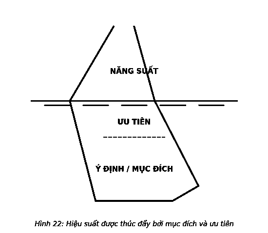
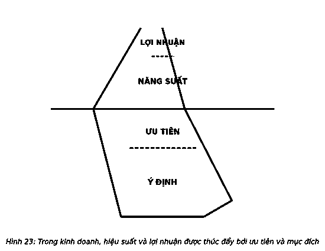

# PHẦN 3: NHỮNG KẾT QUẢ ĐÁNG KINH NGẠC KHAI PHÁ CÁC KHẢ NĂNG TIỀM ẨN CỦA BẠN

---

### NHỮNG KẾT QUẢ ĐÁNG KINH NGẠC

Một nhịp điệu tự nhiên trong cuộc sống của chúng ta có tiềm năng trở thành một công thức đơn giản trong quá trình thực thi điều quan trọng nhất và đạt được những kết quả đáng kinh ngạc: mục đích, ưu tiên và hiệu suất. Khi được kết hợp, cả ba yếu tố này kết nối mãi mãi và liên tục xác nhận sự tồn tại của nhau trong cuộc sống của chúng ta. Liên kết giữa chúng dẫn đến hai lĩnh vực, nơi bạn áp dụng điều quan trọng nhất – một điều lớn và một điều nhỏ.

Điều quan trọng lớn nhất là mục đích và điều nhỏ là ưu tiên hành động để đạt được điều quan trọng lớn. Những người thành công nhất xuất phát với hành trang là mục đích và sử dụng nó như la bàn định hướng. Họ để mục đích là kim chỉ nam giúp xác định ưu tiên thúc đẩy hành động của họ. Đây là con đường dẫn thẳng đến thành công.

> *“Ngay cả khi đang đi đúng hướng, bạn cũng sẽ bị xe cán nếu chỉ ngồi im một chỗ.”*  
> — **Will Rogers**

Hãy coi mục đích, ưu tiên và năng suất là ba phần của một tảng băng trôi.

Thường chỉ có 1/9 tảng băng lộ trên mặt nước, đó là bề nổi của mọi vấn đề. Đây chính xác là liên kết giữa năng suất, ưu tiên và mục đích. Những gì bạn quan sát thấy được xác định bởi những gì bạn không nhìn thấy.

Những người càng thành đạt, mục đích, ưu tiên càng thúc đẩy và dẫn dắt họ. Với kết quả gia tăng kèm lợi nhuận, hoạt động kinh doanh cũng vậy. Những gì được công khai – hiệu suất và lợi nhuận – luôn được thúc đẩy bởi nền tảng của công ty gồm mục đích và ưu tiên. Tất cả doanh nhân đều muốn có được hiệu suất và lợi nhuận, nhưng quá nhiều người không nhận ra con đường tốt nhất để đạt được chúng là thông qua ưu tiên được định hướng bởi mục đích.

Hiệu suất cá nhân là nền tảng của mọi lợi nhuận trong tổ chức. Cả hai yếu tố này đều không thể tách rời. Một doanh nghiệp với những nhân viên có năng suất lao động kém sẽ không thể sinh lợi cao. Các doanh nghiệp lớn được tạo dựng từ những nguồn lực hiệu quả. Và không ngạc nhiên, khi những người có năng suất lao động cao nhất nhận được phần thưởng lớn nhất từ các doanh nghiệp.

Kết nối mục đích, ưu tiên và hiệu suất xác định vị trí của các cá nhân thành công và các doanh nghiệp sinh lợi. Hiểu được điều này là cốt lõi của việc tạo ra thành công.
