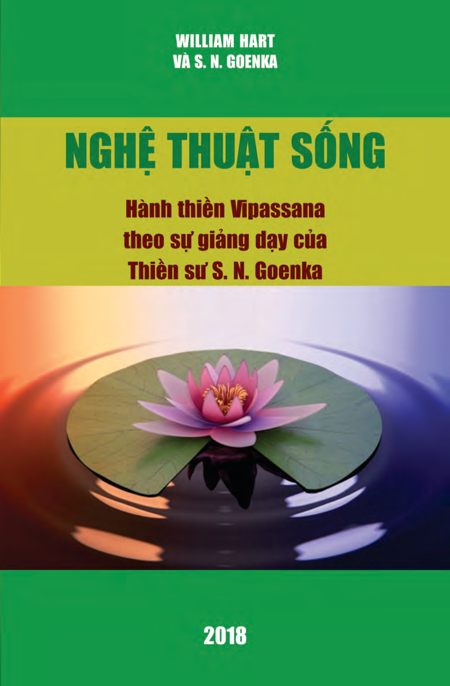

# NGHỆ THUẬT SỐNG

## Hành Thiền Vipassana Theo Sự Giảng Dạy Của Thiền Sư S. N. Goenka

---

### Thông Tin Sách

- **Nguyên tác:** *The Art of Living: Vipassana Meditation as taught by S. N. Goenka*
- **Tác giả:** William Hart và S. N. Goenka
- **Nhà xuất bản:** United Buddhist Publisher - 2018
- **ISBN 13:** 978-1-7293-4825-3
- **ISBN 10:** 1-7293-4825-4

---

> *Trí tuệ là điểm chính  
> vì vậy hãy cố đạt được trí tuệ;  
> thì bạn sẽ hiểu được mọi điều.*  
>  
> — *Proverbs, iv. 7 (KJV)*

---

## Mục Lục Chi Tiết

- [Lời nói đầu](00_loi_noi_dau.md)
- [Tựa](00_tua.md)
- [Dẫn nhập](00_dan_nhap.md)
- [Chương 1. Tìm kiếm](chuong_01.md)
- [Chương 2. Điểm khởi đầu](chuong_02.md)
- [Chương 3. Nguyên nhân trực tiếp](chuong_03.md)
- [Chương 4. Căn nguyên của vấn đề](chuong_04.md)
- [Chương 5. Tu tập giới hạnh](chuong_05.md)
- [Chương 6. Tu tập định tâm](chuong_06.md)
- [Chương 7. Rèn luyện trí tuệ](chuong_07.md)
- [Chương 8. Ý thức và bình tâm](chuong_08.md)
- [Chương 9. Mục đích](chuong_09.md)
- [Chương 10. Nghệ thuật sống](chuong_10.md)
- [Phụ lục A: Tầm quan trọng của vedanā (cảm giác) trong giáo huấn của Đức Phật](phu_luc_a.md)
- [Phụ lục B: Những đoạn kinh nói về cảm giác](phu_luc_b.md)
- [Bảng chú giải từ ngữ Pāli](bang_chu_giai_tu_ngu_pali.md)
- [Giới thiệu về Vipassana](gioi_thieu_ve_vipassana.md)
