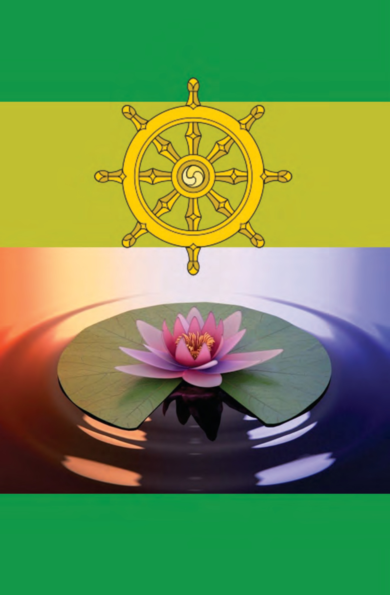

# GIỚI THIỆU VỀ VIPASSANA

## Kỹ Thuật Thiền Cổ Xưa Mang Lại Sự Bình An Đích Thực Cho Tâm

Vipassana-bhavana, “sự phát triển tuệ giác”, là tinh túy trong giáo huấn của Đức Phật. Con đường này do Thiền sư S. N. Goenka dạy, dẫn đến sự tự ý thức, rất đặc biệt vì tính chất giản dị, không có tính cách giáo điều, và nhất là có kết quả. Phương pháp Vipassana có thể áp dụng thành công cho bất cứ người nào.

Cuốn sách “Nghệ Thuật Sống” này đã được viết dưới sự hướng dẫn trực tiếp của Thiền sư S. N. Goenka, dựa trên những bài giảng và những bài viết của thiền sư. Cuốn sách trình bày kỹ thuật này có thể được dùng như thế nào để giải quyết các vấn đề, để phát triển khả năng không được dùng tới, và để sống một cuộc sống an bình và phong phú. Những mẩu chuyện và những lời giải đáp thắc mắc cho các thiền sinh của Thiền sư S. N. Goenka đã truyền đạt được ý nghĩa sống động của điều ông dạy.

Những khóa thiền Vipassana của Thiền sư S. N. Goenka đã lôi cuốn hàng ngàn người thuộc đủ mọi thành phần. Thiền sư S. N. Goenka, độc nhất trong số các thiền sư, là một kỹ nghệ gia và là một cựu lãnh tụ của cộng đồng Ấn Độ ở Miến Điện. Mặc dầu chỉ là một cư sĩ, sự giảng dạy của ông đã được các vị cao tăng ở Miến Điện, Ấn Độ, và Tích Lan chấp nhận, và một số trong các vị này đã theo các khóa học dưới sự chỉ dẫn của ông. Dù ông có sức lôi cuốn, nhưng ông không có ý muốn là một “guru” (đạo sư). Trái lại, ông chỉ dạy người ta phải tự mình có trách nhiệm đối với chính mình. Cuốn sách này là tài liệu đầu tiên được hệ thống hóa, được viết bằng Anh ngữ.

Tác giả, William Hart, học thiền Vipassana được nhiều năm. Từ năm 1982, ông làm thiền sư phụ tá cho Thiền sư S. N. Goenka, hướng dẫn các khóa thiền ở phương Tây.

---

## GIỚI THIỆU VỀ VIPASSANA

Các khóa thiền Vipassana theo sự giảng dạy của Thiền sư S. N. Goenka thuộc truyền thống Sayagyi U Ba Khin được tổ chức thường xuyên tại nhiều quốc gia trên khắp thế giới.

Để có thêm thông tin và lịch tổ chức các khóa thiền trên toàn cầu cũng như mẫu đơn đăng ký tham dự, vui lòng ghé thăm website: [www.dhamma.org](https://www.dhamma.org).

---

