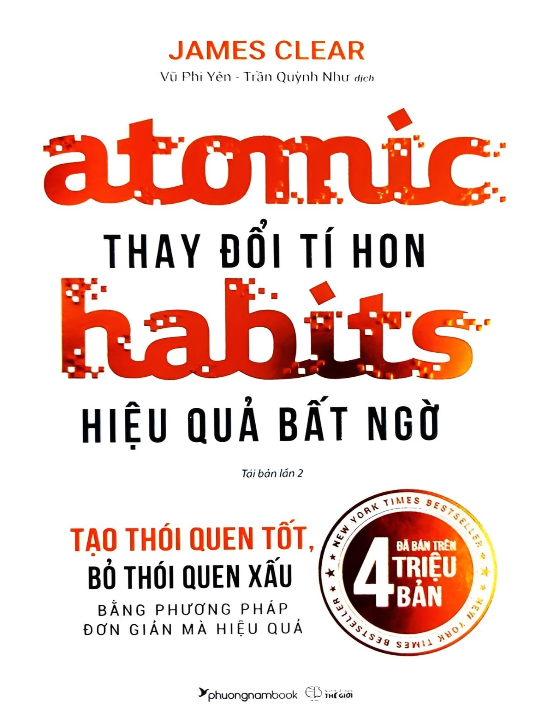
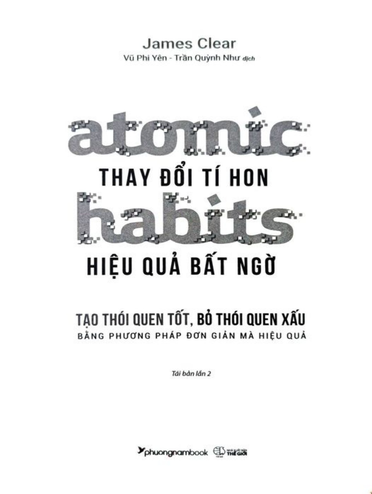

# BẮT ĐẦU

---

“THAY ĐỔI TÍ HON - HIỆU QUẢ BẤT NGỜ”

Atomic Habits: An Easy & Proven Way to Build Good Habits & Break Bad Ones Copyright © 2018 by James Clear All rights reserved including the right of reproduction in whole or in part in any form. This edition published by arrangement with Avery, an imprint of Penguin Publishing Group, a division of Penguin Random House LLC

Bản tiếng Việt © 2019, Công ty TNHH MTV Sách Phương Nam Mọi sao chép, trích dẫn phải có sự đồng ý của Công ty TNHH MTV Sách Phương Nam. atomic ǝ'tämik 1. một lượng cực nhỏ của sự vật; đơn vị không thể tách nhỏ hơn nữa của một hệ thống lớn hơn. 2. khởi thủy của nguồn năng lượng hay sức mạnh to lớn. habit 'habǝt một nếp sinh hoạt hay thực hành theo định kỳ; một phản xạ tự động đối với tình huống cụ thể.
