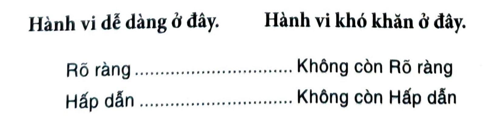

# KẾT LUẬN: BÍ QUYẾT TẠO RA KẾT QUẢ BỀN VỮNG

Có một câu chuyện ngụ ngôn cổ Hy Lạp được biết đến với tên gọi Nghịch lý Sorites[^94], nói về tác động của một hành động nhỏ nếu nó được lặp đi lặp lại đủ nhiều. Công thức của nghịch lý này như sau: Một đồng có làm cho một người giàu không? Nếu bạn đưa cho một người một chồng mười đồng, bạn không thể nói rằng người đó đã giàu được. Nhưng nếu cứ thêm một đồng? Rồi lại một đồng? Rồi lại một đồng? Đến một lúc nào đó, bạn phải công nhận là không ai có thể giàu có nếu không có một đồng quyết định nào đó làm cho họ trở nên giàu có.

Ta có thể nói điều tương tự với thói quen nguyên tử. Một thay đổi tí hon có thể biến đổi cuộc đời bạn không? Hẳn là khó đồng ý với điều đó. Nhưng nếu bạn thay đổi thêm một chút? Một chút nữa? Rồi thêm một chút nữa? Đến một lúc nào đó, bạn phải công nhận rằng cuộc sống của mình đã chuyển biến nhờ vào một thay đổi nhỏ.

Chén thánh của thay đổi thói quen không nằm ở 1% cải thiện, mà ở hàng ngàn cải thiện như vậy. Chính là tầng tầng lớp lớp thói quen nguyên tử chồng chất lên nhau, mỗi một cái đều là đơn vị nền tảng của toàn hệ thống.

Lúc mới đầu, một cải thiện nhỏ trông có vẻ như chẳng có ý nghĩa gì bởi nó bị quét sạch bởi sức nặng của hệ thống. Giống như một đồng không làm bạn giàu có, một thay đổi tích cực như tập thiền một phút hay đọc một trang sách mỗi ngày khó có khả năng tạo ra một khác biệt đáng chú ý.

Nhưng mà dần dần, khi bạn tiếp tục chồng thêm một lớp lại một lớp thay đổi nhỏ như vậy, cán cân cuộc đời bắt đầu dịch chuyển. Mỗi cải thiện nhỏ giống như bỏ thêm một hạt cát vào phía bên tích cực của chiếc cân, chậm rãi nghiêng về phía có lợi cho bạn. Cuối cùng, nếu bạn gắn bó với nó, bạn sẽ chạm đến điểm bùng phát. Đột nhiên, duy trì thói quen tốt trở nên dễ hơn rất nhiều. Sức nặng của hệ thống thay vì chống lại bạn thì đang phục vụ cho bạn.

Qua hành trình của quyển sách này, chúng ta đã cùng nhau xem xét rất nhiều câu chuyện về những người có thành tích hàng đầu. Chúng ta đã nghe về những vận động viên đạt huy chương vàng Olympic, những nghệ sĩ đoạt giải, những nhà lãnh đạo doanh nghiệp, những bác sĩ cứu sống người khác, và các danh hài đã áp dụng khoa học của thói quen nhỏ để tinh thông chuyên môn, và vươn lên đứng đầu trong lĩnh vực của mình. Mỗi một cá nhân, đội ngũ, công ty đã đối mặt với những hoàn cảnh khác nhau, nhưng cuối cùng đã phát triển theo cùng một cách: Qua con đường cam kết với những cải thiện nhỏ bé bền bỉ và vững chắc.

Thành công không phải là mục tiêu cần đạt tới hay một lằn ranh cần vượt qua. Nó là một hệ thống cho ta tiến bộ, một quá trình tinh chỉnh không ngừng. Trong Chương 1 tôi đã nói thế này, “Nếu bạn gặp khó khăn trong việc thay đổi thói quen của mình thì vấn đề không phải ở bạn. Vấn đề nằm ở hệ thống bạn đang có. Thói quen xấu cứ tái diễn hết lần này đến lần khác không phải do bạn không muốn thay đổi, mà vì bạn có một hệ thống thay đổi chưa chính xác.”

Khi quyển sách này đi đến hồi kết thúc, tôi hy vọng điều ngược lại sẽ đúng. Với Bốn Nguyên tắc Thay đổi Hành vi, bạn có một bộ công cụ và chiến lược để xây dựng hệ thống tốt hơn và định hình các thói quen tốt hơn. Đôi khi thật khó để ghi nhớ một thói quen, và cái bạn cần là khiến nó rõ ràng. Lúc khác thì bạn thấy không muốn bắt đầu, vậy bạn cần khiến nó hấp dẫn. Trong trường hợp khác, có thể bạn thấy một thói quen quá khó, vậy thì bạn cần khiến nó dễ dàng. Và thỉnh thoảng, khi bạn không muốn duy trì nó, hãy khiến nó tạo cảm giác thỏa mãn.

*Bạn nên đẩy các thói quen tốt về phía bên trái trong phổ trên, bằng cách làm cho chúng rõ ràng, hấp dẫn, dễ dàng và tạo cảm giác thỏa mãn. Đồng thời, bạn nên đẩy các thói quen xấu về phía bên phải bằng cách làm cho chúng không còn rõ ràng, không còn hấp dẫn, không còn dễ dàng và không còn tạo cảm giác thỏa mãn.*

Đây là quá trình không ngừng nghỉ. Không có vạch đích. Không có giải pháp vĩnh viễn. Bất cứ khi nào bạn tìm kiếm cải thiện, bạn có thể xoay quanh Bốn Nguyên tắc Thay đổi Hành vi cho đến khi tìm thấy nút cổ chai tiếp theo. Khiến nó rõ ràng. Khiến nó hấp dẫn. Khiến nó dễ dàng. Khiến nó tạo cảm giác thỏa mãn. Xoay quanh xoay quanh. Luôn luôn tìm cách để tốt hơn 1%.

Bí quyết đạt được kết quả bền vững là không bao giờ ngừng cải tiến. Cái bạn xây nên sẽ có kết quả đáng kể nếu bạn không dừng lại. Công ty bạn lập ra sẽ đáng kể nếu bạn không ngừng làm việc. Sự rèn luyện cơ thể sẽ đáng kể nếu bạn không ngừng luyện tập. Kiến thức bạn thu nạp sẽ đáng kể nếu bạn không ngừng học hỏi. Tài sản bạn tích lũy sẽ đáng kể nếu bạn không ngừng tiết kiệm. Tình bạn mà bạn xây dựng trong đời sẽ đáng kể nếu bạn không ngừng quan tâm. Thói quen nhỏ không chỉ cộng thêm. Chúng cộng gộp.

Đó là sức mạnh của thói quen nguyên tử. Thay đổi tí hon. Hiệu quả bất ngờ.

---

## Chú thích

[^94]: Sorites phái sinh từ một từ Hy Lạp - sorós - có nghĩa là đồng hay chồng. (ND)
