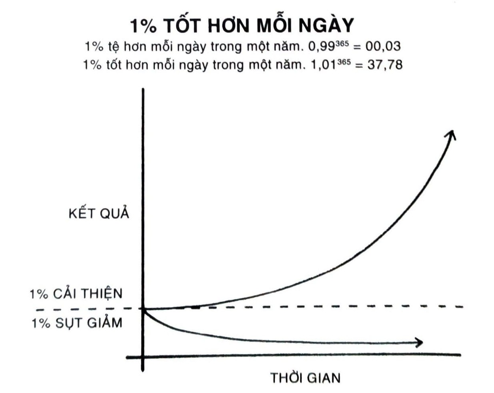
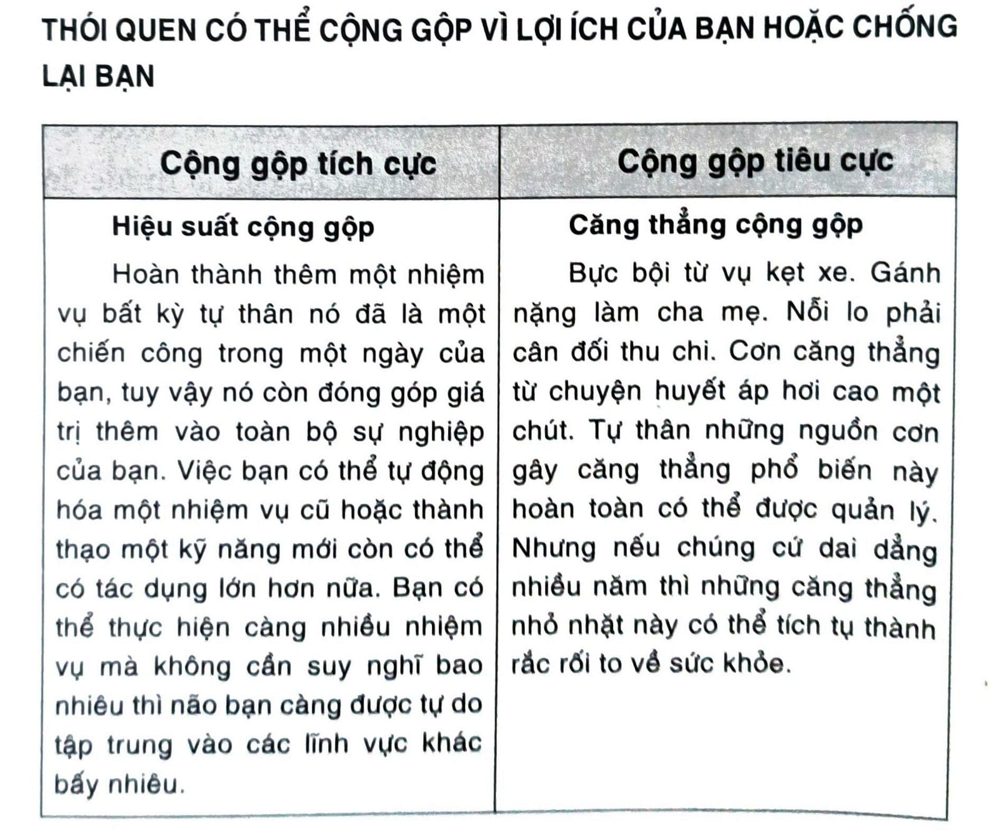
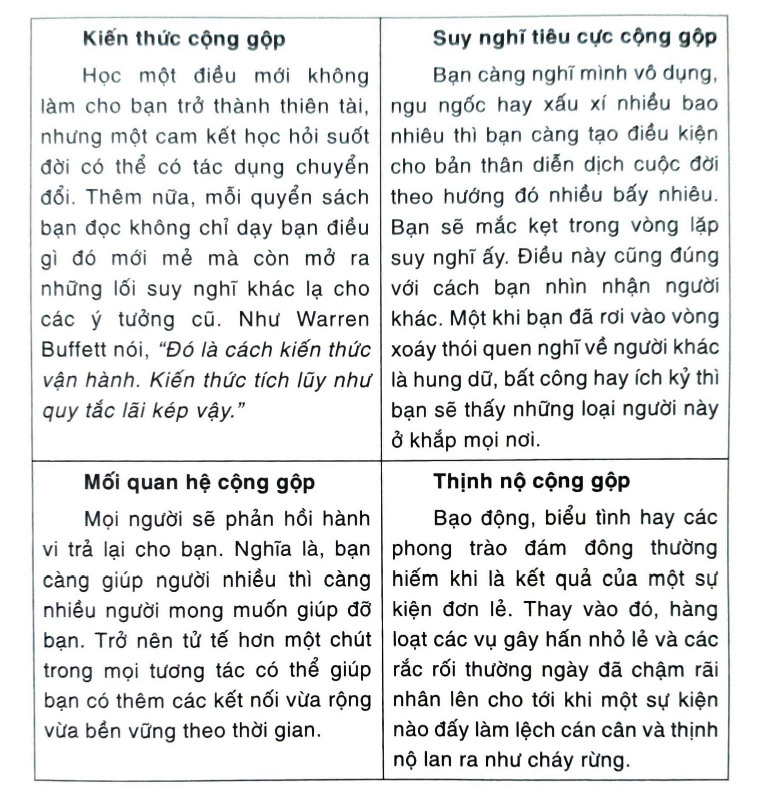
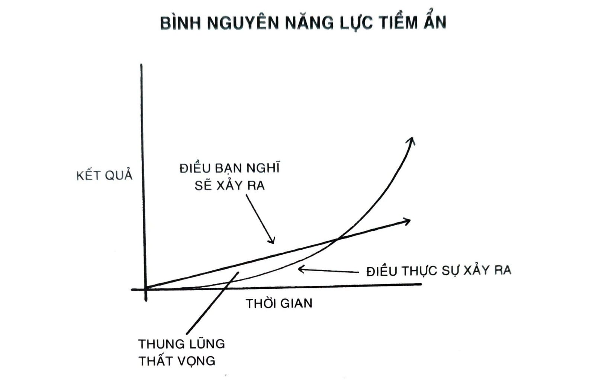

# PHẦN 1: KIẾN THỨC NỀN TẢNG
## Vì Sao Các Thay Đổi Nhỏ Có Thể Dẫn Đến Khác Biệt Lớn

---

# CHƯƠNG 1: SỨC MẠNH ĐÁNG KINH NGẠC CỦA THÓI QUEN NGUYÊN TỬ

Số phận của British Cycling thay đổi vào một ngày năm 2003. Tổ chức này, vốn là cơ quan quản lý vận động viên đua xe đạp chuyên nghiệp ở Great Britain[^12], lúc ấy vừa mới thuê Dave Brailsford về làm giám đốc hiệu năng[^13]. Vào lúc đó, các tay đua chuyên nghiệp ở Great Britain đã phải chịu đựng sự tầm thường gần một trăm năm. Từ năm 1908, các tay đua nước Anh chỉ giành được một huy chương vàng ở các kỳ Thế vận hội, và thậm chí thành tích của họ còn tệ hơn trong cuộc đua xe đạp lớn nhất hành tinh - Tour de France. Trong 110 năm, không có tay đua Anh nào thắng giải này.

Thực tế là thành tích của các tay đua Anh đã kém ấn tượng đến mức một trong những hãng sản xuất xe đạp hàng đầu châu Âu đã từ chối bán xe đạp cho đội tuyển bởi vì họ lo sợ bị ảnh hưởng doanh số nếu các tay đua chuyên nghiệp khác nhìn thấy đội Anh dùng đồ của hãng mình.

Brailsford được thuê về để đưa British Cycling vào quỹ đạo mới. Điều làm ông khác biệt với các huấn luyện viên khác là cam kết bền bỉ của ông với chiến lược mà ông gọi là “lợi ích cộng gộp”[^14], vốn là triết lý tìm kiếm những cải thiện vi tiểu trong mọi thứ bạn làm. Brailsford nói, “Toàn bộ nguyên lý đến từ ý tưởng rằng nếu bạn chia nhỏ mọi thứ bạn có thể nghĩ đến về việc chạy xe đạp, thì khi bạn cải thiện từng mẩu nhỏ ấy dù chỉ 1%, bạn sẽ nhận được sự gia tăng đáng kể khi bạn ghép mọi thứ trở lại với nhau.”

Brailsford và các huấn luyện viên của mình bắt đầu thi hành các điều chỉnh nhỏ mà bạn hẳn là mong đợi từ một đội đua xe đạp chuyên nghiệp. Họ thiết kế lại các yên xe sao cho dễ chịu hơn và bôi cồn vào lốp xe để bám dính tốt hơn. Họ yêu cầu các tay đua mặc loại quần đùi gia nhiệt bằng điện[^15] để duy trì nhiệt độ lý tưởng cho cơ bắp trong khi đạp xe và dùng cảm biến phản hồi sinh học để giám sát phản ứng của mỗi vận động viên với một loại bài tập nhất định. Đội ngũ đã thử nghiệm nhiều loại vải khác nhau trong một đường hầm thổi gió và yêu cầu các tay đua ngoài trời chuyển sang bộ trang phục đua xe trong nhà, được chứng minh là nhẹ hơn và tối ưu hơn về mặt khí động học.

Nhưng họ không dừng ở đấy. Brailsford và đội của ông còn tiếp tục tìm kiếm 1% cải thiện ở những khía cạnh đã bị coi nhẹ lẫn các khía cạnh không ai ngờ tới. Họ thử nhiều loại gel xoa bóp để xem loại nào giúp hồi phục cơ bắp nhanh nhất. Họ thuê một bác sĩ hướng dẫn cho mỗi tay đua cách rửa tay tốt nhất để giảm thiểu nguy cơ bị cảm cúm. Họ chọn loại gối và nệm mang đến giấc ngủ ngon nhất cho mỗi tay đua. Họ thậm chí còn sơn màu trắng bên trong thành xe tải của đội tuyển, để giúp đội phát hiện các hạt bụi nhỏ xíu dễ dàng bị bỏ qua nhưng hoàn toàn có thể làm giảm giá trị hiệu năng của những chiếc xe đạp đã được tinh chỉnh tối ưu.

Khi tất cả hàng trăm cải thiện nhỏ nhặt này tích tụ lại, kết quả ập đến nhanh hơn tưởng tượng của bất kỳ ai.

Chỉ năm năm sau khi Brailsford nắm quyền, đội British Cycling chiếm lĩnh các hạng mục đua xe đạp đường trường và đua xe đạp trong nhà tại Olympic 2008 ở Bắc Kinh, tại đó họ đã đạt thành tích đáng kinh ngạc là giành được 60% huy chương vàng của bộ môn. Bốn năm sau, khi Olympic đến London, người Anh đã nâng tầm bản thân bằng chín kỷ lục Olympic và bảy kỷ lục thế giới.

Cùng năm đó, Bradley Wiggins trở thành cua-rơ người Anh đầu tiên thắng giải Tour de France. Năm tiếp theo, đồng đội của anh Chris Froome cũng thắng cuộc đua, và anh ấy thắng tiếp các giải năm 2015, 2016, và 2017, giúp đội Anh đạt thành tích năm lần thắng giải Tour de France trong sáu năm.

Chỉ trong mười năm từ 2007 đến 2017, các tay đua nước Anh đã vô địch thế giới 178 lần và giành được sáu mươi sáu huy chương vàng Olympic, Paralympic, và năm lần quán quân Tour de France, trong một cuộc chạy đua thành công nhất của lịch sử đua xe đạp[^16].

Điều này xảy ra như thế nào? Làm sao một đội tuyển có thành tích bình thường trước đây lại chuyển mình thành nhà vô địch thế giới chỉ nhờ những thay đổi nhỏ nhặt, mà trông thoáng qua có vẻ chỉ mang lại tối đa là một khác biệt khiêm tốn? Vì sao những cải thiện nhỏ tích lũy thành kết quả đáng kể, và làm sao để bạn có thể tái tạo lại phương pháp này trong cuộc sống của mình?

## VÌ SAO THÓI QUEN NHỎ TẠO KHÁC BIỆT LỚN

Thật dễ cho ta đánh giá cao tầm quan trọng của một khoảnh khắc xác định nào đó và coi nhẹ giá trị của việc tạo ra các tiến bộ nhỏ hằng ngày. Rất thường khi, ta tự thuyết phục bản thân rằng thành công lớn cần phải có hành động lớn. Từ việc giảm cân, tạo dựng sự nghiệp, viết một quyển sách, cho đến thắng một chức vô địch, hay đạt được mục tiêu bất kỳ nào khác, chúng ta đều luôn ép buộc bản thân phải tạo ra một cải tiến kinh thiên động địa khiến ai cũng nhớ tới.

Trong khi đó, cải thiện 1% lại chẳng đáng kể - đôi khi nó còn chẳng được nhận thấy - nhưng nó có thể vô cùng ý nghĩa, đặc biệt là về lâu về dài. Khác biệt mà một tiến bộ nho nhỏ có thể tạo ra theo thời gian là rất đáng nể. Đây là cách bài toán được tính: Nếu bạn có thể đạt được 1% tốt hơn vào mỗi ngày trong vòng một năm, bạn sẽ đạt được kết cuộc tốt hơn ba mươi bảy lần khi hoàn thành. Ngược lại, nếu mỗi ngày bạn tệ đi 1% thì trong một vòng một năm bạn sẽ suy giảm xuống gần như bằng không. Thứ mới đầu là một chiến thắng nho nhỏ hay một trở ngại vụn vặt sẽ tích tụ thành cái gì đó lớn hơn.

*Hình 1: Tác động của các thói quen nhỏ tích lũy theo thời gian. Ví dụ, nếu bạn có thể đạt được chỉ 1% tốt hơn mỗi ngày, thì sau một năm bạn sẽ đạt một kết quả tốt hơn gấp gần 37 lần.*

Thói quen là lợi nhuận cộng gộp của sự cải thiện bản thân. Tương tự như tiền bạc tăng theo cấp số nhân thông qua lãi kép, tác động của thói quen sẽ nhân lên khi bạn lặp lại chúng. Thoạt trông chúng có vẻ tạo ra rất ít khác biệt trong một ngày bất kỳ nào đấy, nhưng tác động của chúng tính theo tháng và năm có thể rất to lớn. Chỉ khi nhìn lại hai năm, năm năm, hay thậm chí là mười năm sau đó thì giá trị của thói quen tốt và cái giá phải trả cho thói quen xấu mới trở nên thật rõ ràng trước mắt.

Khái niệm này có thể khó được đánh giá cao trong đời sống thường nhật. Chúng ta thường bỏ phí các thay đổi nhỏ bởi trông chúng chẳng có giá trị mấy tại thời điểm đó. Nếu bạn bắt đầu tiết kiệm ngay bây giờ, bạn vẫn chưa thành triệu phú ngay được. Nếu bạn đến phòng tập gym ba ngày liên tiếp, bạn chưa thể lập tức thon thả. Nếu bạn học tiếng Quan Thoại một giờ liền tối nay, bạn cũng chưa thể thành thạo một ngôn ngữ. Chúng ta thay đổi một ít, nhưng kết quả dường như không bao giờ đến ngay, thế là ta trượt trở lại nếp cũ.

Không may là, tốc độ chuyển biến chậm lại là điều kiện thuận lợi cho thói quen xấu trượt dài. Nếu hôm nay bạn ăn một bữa kém lành mạnh, kim đo của cái cân không dịch chuyển mấy. Nếu tối nay bạn làm việc muộn và bỏ quên gia đình mình, họ sẽ tha thứ cho bạn thôi. Nếu bạn trì hoãn dự án của mình tới ngày mai, rồi cũng sẽ có đủ thời gian cho bạn hoàn thành sau đó. Rất dễ hủy bỏ một quyết định đơn lẻ.

Nhưng khi chúng ta lặp lại 1% sai sót, ngày qua ngày, bằng cách lặp lại các quyết định tệ hại, nhân bản các sai lầm vụn vặt, và hợp lý hóa những cái cớ nhỏ nhặt, thì các lựa chọn độc hại sẽ ghép lại thành kết cuộc độc hại. Đó là quá trình tích lũy rất nhiều bước đi sai lầm - 1% sụt giảm đây đó - cuối cùng dẫn đến một rắc rối to.

Tác động gây ra bởi một thay đổi trong các thói quen của bạn tương tự với tác động gây ra khi bạn dịch chuyển chỉ vài độ quỹ đạo của một chiếc máy bay. Hãy tưởng tượng bạn đang bay từ Los Angeles đến thành phố New York. Nếu một phi công từ sân bay LAX điều chỉnh hướng bay chỉ 3,5 độ về phía Nam, bạn sẽ hạ cánh ở Washington, D.C., thay vì New York. Một thay đổi nhỏ như thế gần như khó nhận ra được khi cất cánh - mũi máy bay chỉ chệch đi một vài mét - nhưng khi khuếch đại lên toàn bộ nước Mỹ thì bạn sẽ đáp xuống một nơi cách đó hàng trăm cây số.[^17]

Tương tự, một thay đổi nhỏ trong thói quen thường ngày có thể hướng cuộc đời bạn đến một điểm hạ cánh rất khác. Đưa ra một quyết định tốt hơn 1% hay tệ hơn 1% dường như vô nghĩa vào thời điểm ấy, nhưng trải qua một khoảng thời gian đủ dài để tạo nên một đời người, các lựa chọn này sẽ quyết định sự khác biệt giữa việc bạn là ai và bạn đã có thể là ai. Thành công là sản phẩm của thói quen hằng ngày - không phải của một cuộc biến hình một-lần-trong-đời.

Điều đó nghĩa là, không cần biết hiện tại bạn thành công hay thất bại như thế nào. Điều thật sự có giá trị là liệu thói quen của bạn có đang đặt bạn trên con đường dẫn đến thành công hay không. Bạn nên quan tâm đến quỹ đạo hiện giờ của mình hơn là kết quả hiện tại. Nếu bạn tiêu xài vượt mức thu nhập mỗi tháng thì quỹ đạo của bạn vẫn không ổn, dù cho bạn là triệu phú. Nếu các thói quen tiêu xài này không đổi, kết cuộc sẽ chẳng tốt lắm đâu. Ngược lại, dù là bạn đang phá sản nhưng nếu bạn chịu khó tiết kiệm một ít mỗi tháng, thì bạn đang trên con đường dẫn đến tự do tài chính - kể cả khi bạn đang di chuyển chậm hơn mình mong muốn.

Kết quả của bạn chính là thước đo chậm cho các thói quen của bạn. Giá trị ròng của bạn chính là thước đo chậm của các thói quen tài chính. Cân nặng của bạn là thước đo chậm của thói quen ăn uống. Kiến thức của bạn là thước đo chậm của thói quen học hỏi. Đồ đạc của bạn là thước đo chậm của thói quen dọn dẹp. Bạn nhận được từ chính những hành động lặp đi lặp lại của mình.

Nếu bạn muốn dự đoán điểm đến của bạn trong đời, điều cần làm chính là lần theo đường cong quỹ đạo của các thành tựu nhỏ hoặc thất bại nhỏ, và xem xem lựa chọn hằng ngày của bạn gộp lại sau mười hay hai mươi năm sẽ như thế nào. Bạn có đang tiêu nhiều hơn số tiền mình kiếm được mỗi tháng? Bạn có đang chịu khó đến phòng tập gym mỗi tuần? Bạn có đang đọc sách và học hỏi điều mới mỗi ngày? Những trận chiến nho nhỏ như vậy chính là điều sẽ định nghĩa cái tôi tương lai của bạn.

Thời gian sẽ phóng đại đường biên giữa thành công và thất bại. Nó sẽ nhân lên bất kỳ thứ gì bạn nuôi dưỡng. Thói quen tốt biến thời gian trở thành đồng minh. Thói quen xấu biến thời gian trở thành kẻ thù.

Thói quen chính là con dao hai lưỡi. Thói quen xấu có thể bào mòn bạn bao nhiêu thì thói quen tốt có thể bồi đắp bạn lên bấy nhiêu, điều này là lý do vì sao việc hiểu cặn kẽ chi tiết là điểm mấu chốt. Bạn cần hiểu được cách thức thói quen hoạt động và làm thế nào thiết kế chúng theo cách bạn ưa thích, để tránh nửa nguy hiểm kia của lưỡi dao.

## TIẾN TRÌNH DIỄN RA NHƯ THẾ NÀO

Tưởng tượng bạn đang có một viên nước đá nằm trên bàn ngay trước mặt. Căn phòng thì lạnh, bạn có thể thấy được hơi thở lạnh của mình. Nhiệt độ phòng đang là hai mươi lăm độ[^18]. Thật chậm rãi, nhiệt độ phòng bắt đầu tăng lên.

Hai mươi sáu độ.

Hai mươi bảy.

Hai mươi tám.

Viên đá vẫn nằm nguyên xi trên bàn trước mặt bạn.

Hai mươi chín độ.

Ba mươi.

Ba mươi mốt.

Vẫn không có gì xảy ra.

Thế rồi, ba mươi hai độ[^19]. Viên đá bắt đầu tan. Chỉ xê dịch một độ, dường như không có khác biệt nào xảy ra trong các lần điều chỉnh nhiệt độ trước đó, nhưng đã dần mở khóa cho một biến đổi lớn lao.

Thời điểm đột phá thường là kết quả của vô số hành động trước đó, chúng tích lũy thành tiềm năng cần thiết để khơi nguồn cho một thay đổi lớn. Mô thức này xuất hiện ở mọi nơi. Ung thư dành 80% đời mình sống trong lặng lẽ không ai phát hiện, thế rồi đột phát chiếm lĩnh cơ thể người bệnh chỉ trong vài tháng. Bạn khó có thể phát hiện ra một mầm tre trong năm năm đầu đời bởi vì chúng mọc một bộ rễ sâu trong lòng đất trước khi vươn lên mặt đất hơn 27m chỉ trong sáu tuần.

Tương tự, thói quen thường không tạo ra khác biệt cho tới khi bạn vượt qua ngưỡng tới hạn và mở khóa một tầng hiệu năng mới. Đâu đó trong giai đoạn đầu và giữa của mỗi cuộc hành trình, thường thường sẽ có một Thung lũng Thất vọng. Bạn kỳ vọng mình sẽ tăng tiến theo một con đường tuyến tính và thật là bực mình khi các thay đổi dường như chẳng có tác dụng gì trong những ngày đầu tiên, những tuần hay thậm chí là những tháng đầu. Cảm giác như mình chẳng đi đến đâu cả. Nhưng nó chính là con dấu xác nhận của bất kỳ một quá trình tích lũy nào: Các kết quả mạnh mẽ nhất đang đợi đằng sau.

Đây là một trong những nguyên nhân cốt lõi vì sao ta khó xây dựng thói quen bền vững như vậy. Mọi người tạo ra các thay đổi nhỏ, không nhìn thấy kết quả hữu hình, và quyết định dừng lại. Bạn nghĩ, “Mình đã chạy bộ mỗi ngày suốt cả tháng, vì sao mình không thấy cơ thể có chút thay đổi nào hết vậy?” Một khi loại suy nghĩ này xuất hiện thì ta rất dễ gạt bỏ thói quen tốt qua một bên. Thế nhưng để tạo ra một khác biệt có ý nghĩa thì thói quen cần phải tồn tại đủ lâu để đột phá giai đoạn bình nguyên này - tôi gọi đó là Bình nguyên Năng lực tiềm ẩn[^20].

Nếu bạn thấy mình đang vật lộn mãi với một thói quen mới có lợi hay là phá bỏ một thói quen cũ có hại, thì điều đó không có nghĩa là bạn đã đánh mất khả năng cải thiện. Thường đó là do bạn vẫn chưa vượt qua được Bình nguyên Năng lực tiềm ẩn. Than thở về chuyện mình chưa thành công dù đã nỗ lực thì cũng tựa như đang càm ràm vì sao cục nước đá không tan ra khi bạn gia nhiệt cho nó từ hai mươi lăm lên ba mươi mốt độ. Công sức của bạn không hề bỏ phí đâu; nó chỉ là đang tích lũy. Tất cả biến đổi sẽ xảy ra vào độ thứ ba mươi hai.

Một khi bạn đột phá tầng Bình nguyên Năng lực tiềm ẩn, người đời sẽ gọi đó là thành công trong một đêm. Người ngoài sẽ chỉ thấy được biến cố kịch tính nhất thay vì những sự kiện âm thầm diễn ra trước đó. Chỉ có bạn biết đó là toàn bộ công sức mình đã kiên trì từ rất lâu - cả khi bạn cảm thấy mình không tiến bộ chút nào - đã làm cho bước nhảy hôm nay trở nên khả dĩ.

Điều này tựa như áp lực địa chất phiên bản con người vậy. Hai mảng kiến tạo có thể va chạm xay xát với nhau trong hàng triệu năm, áp lực dần dần tích tụ theo thời gian. Rồi một ngày nào đó, chúng cọ xát lên nhau thêm một lần nữa, theo cùng một kiểu đã diễn ra từ trước tới giờ, nhưng lần này sức ép trở nên quá lớn. Một trận động đất nổ ra. Thay đổi có thể mất rất nhiều năm trước khi toàn bộ xảy ra một lần.

Thành thạo một cái gì đó đòi hỏi sự nhẫn nại. Đội San Antonio Spurs, một trong những đội bóng rổ thành công nhất lịch sử giải NBA, treo một câu trích ngôn từ nhà cải cách xã hội Jacob Riis trong phòng thay đồ của họ: “Khi dường như không có thứ gì hiệu quả, thì tôi đi ra ngoài quan sát một người cắt đá đang đập vào tảng đá, có lẽ cũng phải trăm lần mà không thấy có một vết nứt nào cả. Vậy mà vào lần gõ thứ một trăm lẻ một, tảng đá nứt làm đôi, và tôi hiểu rằng không phải cái nhát gõ cuối cùng đó làm nó vỡ ra - mà là toàn bộ những gì xảy ra trước đó.”

*Hình 2: Chúng ta thường kỳ vọng tiến trình sẽ diễn ra tuyến tính. Hoặc giả ít nhất là ta muốn nó xảy ra nhanh. Thực tế là kết quả từ nỗ lực của ta thường có độ trễ nhất định. Phải đến nhiều tháng hay nhiều năm sau ta mới nhận ra giá trị thực sự của công sức đã bỏ ra trước đó. Điều này có thể dẫn đến “thung lũng thất vọng”, nơi người ta cảm thấy thoái chí sau khi đã bỏ ra hàng tuần hàng tháng trời nỗ lực mà không đạt được kết quả gì. Tuy vậy, công sức này không hề bỏ phí. Chỉ đơn giản là công sức đang được tích lũy. Phải đến rất lâu sau đó thì giá trị trọn vẹn của các nỗ lực trước đây mới lộ diện.*

Những điều lớn lao luôn đến từ các khởi đầu nho nhỏ. Hạt mầm của mỗi thói quen đều bắt nguồn từ một quyết định nhỏ lẻ. Nhưng khi quyết định ấy được lặp đi lặp lại, một thói quen sẽ nảy nòi và lớn mạnh. Rễ của nó sẽ bám vào đất và cành nhánh sẽ phát triển. Nhiệm vụ phá bỏ một thói quen có hại cũng tựa như đào bỏ tận gốc một cây sồi lâu năm bên trong chúng ta. Và xây dựng một thói quen tốt cũng giống như khi bạn đang tưới tắm một bông hoa xinh xắn tại thời điểm này.

Nhưng điều gì quyết định liệu ta có thể gắn bó với một thói quen đủ lâu để vượt qua Bình nguyên Năng lực tiềm ẩn và đột phá bờ bên kia? Điều gì đã khiến cho một số người trượt vào các thói quen không mong muốn trong khi người khác thì đang tận hưởng các tác động kép của thói quen tốt?

## TẠM QUÊN ĐI MỤC TIÊU, CHÚ TÂM VÀO HỆ THỐNG

Có một niềm tin phổ biến cho rằng cách tốt nhất để đạt được cái mình muốn trong đời - chẳng hạn như lấy lại vóc dáng, kiến tạo một sự nghiệp thành công, thư giãn hơn và bớt lo âu, dành thêm thời gian ở với gia đình và bạn bè - là phải đặt ra các mục tiêu cụ thể và thi hành được.

Trong nhiều năm, đây cũng từng là cách tôi xây dựng thói quen cho mình. Mỗi cái đều là một mục tiêu cần hoàn thành. Tôi lập mục tiêu cho điểm số tôi muốn trong trường, mục tiêu cho số cân tôi muốn nâng trong phòng tập, mục tiêu cho lợi nhuận muốn kiếm được cho công ty. Tôi hoàn thành được một số, nhưng đa phần là thất bại. Cuối cùng thì tôi bắt đầu nhận ra kết quả của mình có rất ít sự liên quan đến mục tiêu mình đặt ra, và lại cực kỳ liên quan đến hệ thống mà tôi đã theo.

Điểm khác biệt giữa hệ thống và mục tiêu là gì? Tôi học được điều này từ Scott Adams, họa sĩ đứng sau bộ truyện tranh Dilbert. Mục tiêu là về các kết quả bạn muốn đạt được. Hệ thống là về quá trình dẫn đến các kết quả ấy. Nếu bạn là một huấn luyện viên, mục tiêu của bạn hẳn là giành một chức vô địch. Hệ thống là cách thức bạn tuyển mộ cầu thủ, quản lý các trợ huấn, và thi hành chương trình tập luyện. Nếu bạn là một doanh nhân, mục tiêu của bạn hẳn là xây dựng một doanh nghiệp triệu đô. Hệ thống có thể là cách bạn thử nghiệm các ý tưởng sản phẩm, thuê nhân viên, và chạy các chiến dịch tiếp thị. Nếu bạn là một nhạc công, mục tiêu của bạn có thể là chơi một tác phẩm mới. Hệ thống của bạn có thể là tần suất bạn luyện tập, cách bạn chia nhỏ và xử lý những phân đoạn khó, và cách bạn nhận phản hồi từ nhạc sư.

Bây giờ đến câu hỏi thú vị: Nếu bạn hoàn toàn phớt lờ mục tiêu và chỉ tập trung vào hệ thống thôi, thì bạn có thành công không? Lấy ví dụ, nếu bạn là một huấn luyện viên bóng rổ và bạn bỏ qua hoàn toàn mục tiêu giành chức vô địch, bạn chỉ tập trung vào những mục mà đội bạn tập luyện hằng ngày, thì bạn vẫn đạt được kết quả ấy chứ?

Tôi cho là được.

Mục tiêu của mọi môn thể thao là hoàn thành với số điểm cao nhất, thế nhưng thật là kỳ cục nếu suốt cả trận đấu ta chỉ chăm chăm nhìn vào bảng hiển thị điểm số. Cách thức duy nhất để thực sự chiến thắng là làm cho mình tốt hơn mỗi ngày. Nhà vô địch Super Bowl[^21] ba lần Bill Walsh từng nói, “Điểm số tự nó đến.” Điều này cũng đúng cho các lĩnh vực khác trong đời. Nếu bạn muốn kết quả tốt hơn thì bạn nên quên việc đặt mục tiêu đi. Thay vì vậy hãy tập trung vào hệ thống.

Ý tôi là gì? Mục tiêu hoàn toàn vô dụng à? Tất nhiên là không phải thế. Mục tiêu có tác dụng rất tốt trong việc định hướng, nhưng hệ thống mới thực sự hiệu quả cho việc tiến bộ. Hàng đống vấn đề sẽ phát sinh nếu bạn dành quá nhiều thời gian nghĩ về mục tiêu và không còn đủ thời giờ thiết kế hệ thống thực hiện mục tiêu ấy nữa. Vấn đề 1: Người thắng lẫn kẻ thua đều có cùng mục tiêu

Việc thiết lập mục tiêu đang là nạn nhân của định kiến về người sống sót. Chúng ta tập trung vào người đã chiến thắng - những kẻ sống sót - và hiểu sai rằng các mục tiêu tham vọng dẫn tới thành công của họ chính là nguyên nhân của chiến thắng, trong khi đã bỏ qua những người có cùng mục tiêu đấy nhưng đều không thành công.

Mỗi một vận động viên Olympic đều mong muốn giành được huy chương. Mỗi một ứng viên tìm việc đều mong muốn giành được vị trí. Và nếu người thành công lẫn người thất bại đều chia sẻ cùng một mục tiêu, thì mục tiêu không phải là thứ phân biệt người thắng với kẻ bại. Không phải mục tiêu thắng giải Tour de France là lực đẩy cho các tay đua nước Anh vươn lên vị trí dẫn đầu. Có lẽ mỗi một năm trước khi thật sự bước lên bục vinh quang, họ đều mong mỏi thắng cuộc - như tất cả các đội thi đấu khác. Mục tiêu đã luôn ở đó. Chỉ khi họ thi hành hệ thống các cải tiến nhỏ liên tục thì họ mới đạt được kết quả khác đi. Vấn đề 2: Đạt được mục tiêu chỉ là một thay đổi tạm thời

Tưởng tượng bạn có một căn phòng bừa bộn và bạn đặt mục tiêu dọn dẹp nó. Nếu bạn gom đủ năng lượng để thu dọn thì bạn sẽ có một căn phòng sạch sẽ gọn gàng - vào lúc này. Nhưng nếu bạn tiếp tục duy trì tính luộm thuộm hoặc vẫn giữ thói tích trữ đồ đạc từ lúc đầu đã dẫn tới một căn phòng lộn xộn như bây giờ, thì sớm muộn gì bạn cũng sẽ lại thấy một núi đồ linh tinh, và ngồi cầu mong mình có thêm một liều động lực nào đấy. Bạn sẽ thấy mình mãi chạy theo một kết quả như cũ bởi vì bạn không thay đổi hệ thống đằng sau nó. Bạn xử lý một triệu chứng mà không xem xét nguyên nhân.

Đạt được mục tiêu chỉ thay đổi cuộc sống của bạn trong khoảnh khắc. Đó là quan niệm phản trực giác về sự cải thiện. Ta nghĩ ta cần phải thay đổi kết quả, nhưng kết quả không phải là vấn đề. Cái chúng ta thật sự cần thay đổi là các hệ thống đã dẫn tới kết quả này. Khi bạn xử lý vấn đề trên bình diện kết quả, bạn chỉ giải quyết được ở mức độ tạm thời. Để cải thiện được tốt hơn, bạn cần giải quyết vấn đề ở cấp độ hệ thống. Sửa chữa đầu vào rồi thì đầu ra tự chúng sẽ thay đổi. Vấn đề 3: Mục tiêu sẽ giới hạn hạnh phúc của bạn

Có một giả định ngầm đằng sau mỗi mục tiêu là: “Chừng nào tôi đạt được mục tiêu, tôi mới hạnh phúc.” Vấn đề trong trạng thái tinh thần của người đặt-mục-tiêu-lên-hàng-đầu đó là, họ liên tục đặt hạnh phúc qua một bên cho đến khi đạt được cột mốc tiếp theo. Tôi đã rơi vào cái bẫy này nhiều lần tới mức tôi đã thôi không đếm nữa. Hàng năm trời với tôi, hạnh phúc luôn là thứ gì đó xa vời mà chỉ có cái tôi tương lai mới được hưởng. Tôi tự hứa với lòng là, khi nào tôi lên được mười ký phần cơ, hoặc giả công ty của tôi được lên báo New York Times thì mình sẽ được thư giãn.

Thêm nữa, mục tiêu tạo ra một mâu thuẫn “hoặc cái này - hoặc cái kia”: Hoặc bạn đạt được mục tiêu mình đề ra và thành công, không thì bạn thất bại và đáng thất vọng. Bạn tự đóng khung tinh thần mình vào một phiên bản hạn hẹp về hạnh phúc. Đây là một sai lầm. Thường thì con đường đời thực sự của ta hiếm khi sẽ khớp hoàn toàn với hành trình ban đầu ta vẽ ra trong đầu. Giới hạn mức độ hài lòng của bản thân vào một kịch bản trong khi có rất nhiều con đường dẫn đến thành công, thì thật vô lý.

Trạng thái tinh thần của người đặt-hệ-thống-lên-hàng-đầu lại có chứa thuốc giải. Khi bạn yêu cái quá trình hơn là sản phẩm thì bạn không cần đợi bản thân cho phép mình hạnh phúc. Bạn hài lòng khi thấy hệ thống của mình đang vận hành. Và một hệ thống có thể thành công trong nhiều hình thái khác nhau, không chỉ theo một cách mà bạn hình dung ban đầu. Vấn đề 4: Mục tiêu sẽ trục trặc với các quá trình dài hạn

Sau cùng thì, một tư duy hướng tới mục tiêu có thể tạo ra hiệu ứng “yo-yo”[^22]. Rất nhiều tay đua luyện tập vất vả hàng tháng trời, nhưng khi họ vượt qua vạch đích thì họ thôi không tập luyện nữa. Cuộc đua không còn ở đó để làm động lực cho họ. Khi tất cả khổ luyện của bạn chỉ tập trung vào một mục tiêu nhất định thì sau khi mục tiêu ấy đã đạt được, cái gì còn lại để thúc đẩy bạn tiến bước? Đây là lý do rất nhiều người phát hiện bản thân mình trượt về các thói quen cũ sau khi hoàn thành một mục tiêu.

Mục đích của việc đặt mục tiêu là thắng cuộc chơi. Mục đích của việc xây dựng hệ thống là để tiếp tục cuộc chơi. Tư duy dài hạn thực sự là phải giảm tư duy gắn với mục tiêu. Nó không phải chỉ là chuyện hoàn thành một mục tiêu đơn lẻ nào. Nó là câu chuyện về vòng tuần hoàn của việc cải thiện liên tục và tinh chỉnh bất tận. Sau cùng thì, chính sự cam kết của bạn với quá trình mới là thứ quyết định tiến trình của bạn.

## HỆ THỐNG CÁC THÓI QUEN NGUYÊN TỬ

Nếu bạn đang gặp khó khăn trong việc thay đổi thói quen thì vấn đề có khi không nằm ở bạn, mà ở hệ thống bạn đang có. Các thói quen xấu lặp đi lặp lại không phải vì bạn không muốn thay đổi, mà vì bạn đang có một hệ thống thay đổi chưa phù hợp.

Đừng vươn đến tầm mục tiêu. Hãy đặt chân trên bình diện hệ thống.

Hãy tập trung vào hệ thống tổng thể hơn là một mục tiêu đơn lẻ, đó chính là chủ đề cốt lõi của quyển sách này. Nó cũng là một trong những ý nghĩa sâu xa đằng sau cụm từ nguyên tử. Đến lúc này, bạn hẳn đã nhận ra thói quen nguyên tử là từ để chỉ một thay đổi nhỏ, một lợi nhuận biên, một cải thiện 1%. Thế nhưng thói quen nguyên tử không phải chỉ là một thói quen cũ bất kỳ nào, dù nhỏ bao nhiêu. Chúng là những thói quen nhỏ, thành phần của một hệ thống lớn hơn. Cũng giống như nguyên tử là khối thành phần tạo nên phân tử, thì thói quen nguyên tử chính là khối thành phần tạo nên các kết quả phi thường.

Thói quen cũng tương tự như nguyên tử trong đời sống chúng ta vậy. Mỗi thói quen là một đơn vị nền tảng đóng góp vào sự tiến bộ chung của bạn. Đầu tiên, các nếp sinh hoạt nhỏ này dường như không đáng kể, nhưng nhanh thôi chúng sẽ bồi đắp lẫn nhau và thúc đẩy các thành công lớn hơn, rồi nhân lên đến một mức độ vượt xa khỏi giá trị đầu tư ban đầu của chúng. Chúng vừa nhỏ lại vừa vĩ đại. Đây chính là ý nghĩa của cụm thói quen nguyên tử - một nếp sống hoặc một thói quen thường xuyên không chỉ nhỏ và dễ làm, mà còn là khởi nguồn của một sức mạnh phi thường; một thành tố của hệ thống tăng trưởng cộng gộp.

## Tóm tắt chương

- Thói quen là lợi nhuận cộng gộp của việc phát triển bản thân. Đạt được 1% tốt hơn mỗi ngày sẽ vô cùng có lợi về lâu dài.

- Thói quen là một con dao hai lưỡi. Chúng có thể làm việc cho bạn, nhưng cũng có thể chống lại bạn, đó là lý do vì sao việc hiểu rõ ngọn ngành là cần thiết.

- Các thay đổi nhỏ thường có vẻ như không tạo nên khác biệt mấy cho tới khi bạn vượt qua ngưỡng tới hạn. Kết quả mạnh mẽ nhất của bất kỳ quá trình cộng gộp nào cũng có độ trễ. Bạn cần nhẫn nại.

- Một thói quen nguyên tử là một thói quen nhỏ, thành phần của một hệ thống lớn hơn. Giống như nguyên tử là khối thành phần tạo nên phân tử, thói quen nguyên tử chính là khối thành phần tạo nên các kết quả phi thường.

- Nếu bạn muốn kết quả tốt hơn, thì hãy quên việc đặt mục tiêu đi. Thay vào đó, hãy tập trung vào hệ thống.

- Đừng vươn đến tầm mục tiêu. Hãy đặt chân trên bình diện hệ thống.

---

## Chú thích

[^12]: Great Britain (Đại Anh, đảo Anh) bao gồm England (nước Anh), Scotland và Wales. (BT)

[^13]: Performance director.

[^14]: The aggregation of marginal gains.

[^15]: Electrically heated overshorts.

[^16]: Vào thời điểm quyển sách này được in (bản gốc năm 2018 - ND), đã có thêm tin tức mới về đội British Cycling được đăng tải. Bạn có thể đọc thêm về suy nghĩ của tôi tại trang atomichabits.com/cycling. (TG)

[^17]: Tôi rất rất phấn khích và đã thực sự ngồi tính thử. Washington, D.C., cách thành phố New York tầm 225 dặm (~362km). Giả thiết rằng bạn đang bay trên một chiếc 747 hoặc Airbus A380, điều chỉnh hướng bay chỉ 3,5 độ khi bạn rời khỏi Los Angeles nhiều khả năng làm cho mũi máy bay dịch chuyển khoảng từ 7,2 đến 7,6 feet, hoặc từ 86 đến 92 inches (~2,2 - 2,3m). Một điều chỉnh rất nhỏ trong phương hướng có thể dẫn tới một thay đổi đáng kể ở điểm đến. (TG)

[^18]: 25 độ F gần bằng -4 độ C. (ND)

[^19]: 32 độ F = 0 độ C. (ND)

[^20]: Plateau of Latent Potential.

[^21]: Super Bowl là trận chung kết tranh ngôi vô địch bóng bầu dục thường niên của Liên đoàn Bóng bầu dục Quốc gia của Mỹ (NFL - National Football League). (ND)

[^22]: “Yo-yo” effect (hiệu ứng yo-yo): chỉ vòng lặp giảm cân - tăng cân khi một người ăn kiêng quá mức khiến cho cơ thể tăng cân trở lại nhanh chóng. (ND)
