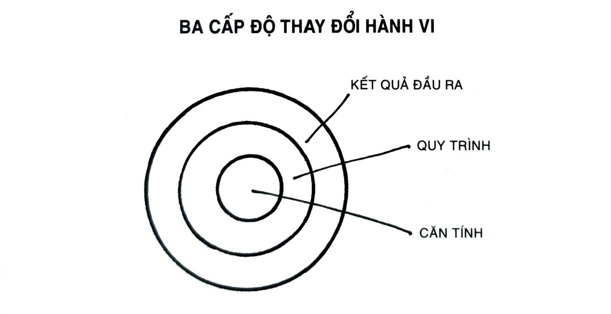
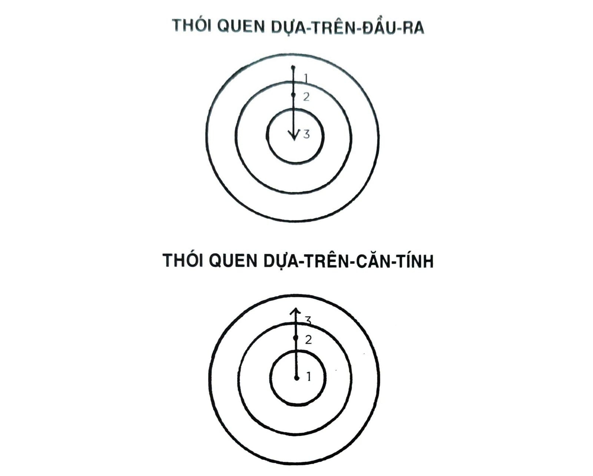

# CHƯƠNG 2: THÓI QUEN ĐỊNH HÌNH CĂN TÍNH CON NGƯỜI BẠN NHƯ THẾ NÀO (VÀ NGƯỢC LẠI)

THÓI QUEN ĐỊNH HÌNH CĂN TÍNH CON NGƯỜI BẠN

## NHƯ THẾ NÀO (VÀ NGƯỢC LẠI)

Vì sao lại dễ lặp lại một thói quen xấu và khó hình thành một thói quen tốt đến như vậy? Chẳng mấy thứ có thể có ảnh hưởng mạnh mẽ đến cuộc sống của bạn nhiều cho bằng việc cải thiện thói quen hằng ngày. Vậy mà vào thời điểm này năm tới, nhiều khả năng là bạn vẫn sẽ làm cùng một thứ như bây giờ thay vì điều gì đó tốt hơn.

Thông thường ta sẽ cảm thấy khó khăn để duy trì các thói quen tốt quá vài ngày, ngay cả với nỗ lực thực tâm và động lực thi thoảng bùng phát. Các thói quen như rèn luyện thân thể, thiền tập, viết nhật ký, hay nấu ăn, thường sẽ dễ dàng trong một hai ngày, rồi sau đó sẽ trở thành một mối phiền phức.

Tuy vậy, một khi thói quen được hình thành, chúng dường như sẽ gắn bó mãi với ta - đặc biệt là các thói quen không mong muốn. Bất chấp dự định của ta tốt đẹp thế nào, các thói quen kém lành mạnh như ăn vặt, xem tivi quá nhiều, trì hoãn, hay hút thuốc, dường như không thể nào loại bỏ được.

Thay đổi thói quen là một việc khó bởi hai lý do: (1) Chúng ta đang cố gắng thay đổi sai việc; và (2) Chúng ta đang cố gắng thay đổi thói quen sai cách. Trong chương này, tôi sẽ thảo luận điểm đầu tiên. Và trong các chương tiếp theo, tôi sẽ trả lời ý thứ hai.

Sai lầm đầu tiên của ta là cố thay đổi sai việc. Để hiểu ý tôi đang nói, mời bạn xem xét ba cấp độ mà thay đổi có thể diễn ra. Bạn có thể hình dung nó giống như các lớp của củ hành.

*Hình 3: Có ba lớp cấp độ trong việc thay đổi hành vi: thay đổi kết quả đầu ra, thay đổi quá trình, hoặc thay đổi trong căn tính con người bạn.*

Lớp đầu tiên là thay đổi kết quả đầu ra. Cấp độ này liên quan đến thay đổi kết quả: giảm cân, xuất bản một quyển sách, giành chức vô địch. Phần lớn các mục tiêu bạn đề ra sẽ gắn với cấp độ thay đổi này.

Lớp thứ hai là thay đổi quy trình. Cấp độ này gắn với thay đổi thói quen và hệ thống: thực hiện một kế hoạch rèn luyện mới ở phòng gym, giải phóng bàn làm việc để tiến trình công việc trôi chảy hơn, thực hành thiền tập. Đa phần các thói quen bạn xây dựng được sẽ gắn với cấp độ này.

Lớp thứ ba và là lớp sâu nhất, đó là thay đổi căn tính. Cấp độ này liên quan đến việc thay đổi niềm tin: thế giới quan của bạn, sự tự nhận thức về bản thân, sự đánh giá của bạn về mình và người khác. Phần lớn các niềm tin, giả định và thiên kiến bạn có đều gắn với cấp độ này.

Đầu ra là cái mà bạn muốn có. Quy trình là cái bạn làm. Và căn tính là cái bạn tin. Khi nói đến việc xây dựng thói quen bền vững - khi nói đến chuyện xây dựng một hệ thống cải thiện 1% - thì vấn đề không nằm ở chỗ cấp độ nào “tốt hơn” hay “tệ hơn” cấp độ kia. Tất cả các cấp độ thay đổi đều hữu hiệu theo cách riêng của nó. Vấn đề nằm ở phương hướng thay đổi.

Nhiều người bắt đầu quá trình thay đổi thói quen bằng cách tập trung vào cái họ muốn đạt được. Điều này dẫn ta đến thói quen dựa-trên-đầu-ra. Nên thay thế bằng việc xây dựng thói quen dựa-trên-căn-tính. Với cách này, chúng ta bắt đầu bằng việc tập trung vào con người mà ta muốn trở thành.

*Hình 4: Với thói quen dựa-trên-đầu-ra, trọng tâm được đặt trên cái mà bạn muốn đạt được. Với thói quen dựa-trên-căn-tính, trọng tâm được đặt trên con người mà bạn muốn trở thành.*

Bạn hãy tưởng tượng hai người đang cai thuốc. Khi được mời một điếu, người đầu tiên nói, “Không, cảm ơn. Tôi đang cố cai thuốc”. Nghe có vẻ là một câu trả lời hợp lý, nhưng trong thâm tâm người này vẫn tin rằng mình là một người hút thuốc đang cố gắng trở nên khác đi. Họ đang hy vọng hành vi của mình sẽ thay đổi trong khi vẫn giữ niềm tin cũ.

Người thứ hai từ chối bằng câu trả lời, “Không, cảm ơn. Tôi không hút thuốc.” Đây chỉ là một khác biệt nhỏ, nhưng câu phát biểu này là dấu hiệu cho một sự chuyển đổi trong căn tính. Hút thuốc là một phần của đời sống cũ, chứ không phải con người bây giờ của người này. Họ không còn định nghĩa bản thân là một người hút thuốc nữa.

Phần đông mọi người thậm chí còn không nhận ra được sự thay đổi này trong căn tính khi họ bắt đầu tiến bộ. Họ chỉ nghĩ rằng, “Tôi muốn thon thả hơn (đầu ra) và nếu tôi kiên trì chế độ ăn kiêng này thì tôi sẽ thon thả (quá trình).” Họ đặt ra mục tiêu và quyết định hành động cần phải thực thi để đạt được mục tiêu mà không ý thức về các niềm tin thúc đẩy các hành động này. Họ không thay đổi cách họ nhìn về mình, và không nhận ra rằng căn tính cũ có thể phá hỏng mọi kế hoạch thay đổi của bản thân.

Đằng sau mỗi hệ thống hành động đều có một hệ thống niềm tin. Ví dụ như hệ thống dân chủ được xây dựng trên nền tảng các niềm tin như tự do, luật của đa số, và bình đẳng xã hội. Chế độ độc tài có một hệ thống niềm tin rất khác như quyền lực tuyệt đối và phục tùng nghiêm ngặt. Bạn có thể tưởng tượng ra nhiều cách để lôi kéo nhiều phiếu bầu trong một thể chế dân chủ, nhưng hành vi như thế không bao giờ xảy ra trong chế độ độc tài cả. Đó không phải là căn tính của chế độ ấy. Bầu cử là hành vi không thể thi hành trong một hệ thống niềm tin như vậy.

Một mô thức tương tự diễn ra khi chúng ta thảo luận về cá nhân, tổ chức, hay xã hội. Luôn luôn có một hệ thống niềm tin và giả định định hình một hệ thống, và một căn tính đằng sau các thói quen.

Hành vi mà không tương thích với cái tôi thì sẽ không bền vững. Có thể bạn muốn có nhiều tiền, nhưng nếu căn tính của bạn là một người thích tiêu thụ hơn tạo tác, thì bạn sẽ tiếp tục bị hút về phía tiêu pha nhiều hơn là kiếm tiền. Bạn có thể mong muốn khỏe hơn, nhưng nếu bạn tiếp tục ưu tiên cảm giác nhàn hạ hơn là cảm giác thành tựu, thì bạn sẽ bị hút về phía thư giãn hơn là rèn luyện. Rất khó thay đổi hành vi nếu như bạn không thay đổi các niềm tin bên dưới, những niềm tin đã dẫn bạn đến hành vi quá khứ. Bạn có một mục tiêu mới và một kế hoạch mới, nhưng bạn vẫn chưa đổi con người hiện tại của bạn.

Câu chuyện của Brian Clark, một doanh nhân từ Boulder, Colorado, là một ví dụ tốt. “Kể từ khi bắt đầu nhớ được thì tôi đã thấy mình có thói quen cắn móng tay.” Clark kể với tôi. “Ban đầu là một thói quen lúc căng thẳng khi tôi còn bé, rồi nó dần dần biến thành một nghi thức chải chuốt không mong muốn. Một ngày nọ, tôi quyết định ngừng gặm móng tay đến khi chúng dài ra được một tí. Chỉ nhờ vào sức mạnh ý chí, tôi đã xoay xở làm được.”

Sau đó Clark đã làm được một điều đáng kinh ngạc.

“Tôi nhờ vợ đặt cho một buổi chăm sóc móng đầu tiên trong đời”, anh kể. “Suy nghĩ của tôi lúc ấy là nếu như tôi bắt đầu chăm chút cho móng tay của mình thì tôi sẽ không cắn chúng nữa. Và nó hiệu quả thật, nhưng không phải vì lý do tiền bạc. Điều xảy ra là buổi chăm sóc móng làm cho móng tay tôi trông rất đẹp, lần đầu tiên trong đời. Nhân viên chăm sóc móng còn bảo rằng - thay vì gặm móng - tôi thật sự đã có một bộ móng tay khỏe mạnh và thu hút. Thế là đột nhiên tôi rất tự hào về bộ móng tay của mình. Và thậm chí tôi chưa từng hứng thú với chuyện làm móng này nọ, vậy mà nó đã thực sự tạo nên sự khác biệt. Từ lúc ấy trở đi, tôi chưa bao giờ cắn móng tay trở lại; không một lần nào. Chính bởi vì bây giờ tôi rất tự hào khi chăm sóc chúng đúng cách.”

*Hình thức sau cùng của động lực nội tại là khi một thói quen trở*

thành một phần trong căn tính của bạn. Phát biểu “Tôi là kiểu người muốn điều này” là một chuyện. Còn nói rằng “Tôi chính là kiểu người này” là một chuyện rất khác.

Bạn càng cảm thấy tự hào một khía cạnh nào đấy trong căn tính của mình thì bạn càng có động lực để duy trì các thói quen gắn với nó. Nếu bạn tự hào về mái tóc của mình, bạn sẽ dần dần hình thành các kiểu thói quen chăm sóc và bảo dưỡng tóc. Nếu bạn tự hào về cơ bắp tay của mình thì bạn sẽ làm mọi thứ để đảm bảo mình không bỏ buổi tập luyện các nhóm cơ thân trên nào. Nếu bạn tự hào về những chiếc khăn choàng mình đan thì bạn sẽ bỏ ra hàng đống giờ ngồi đan móc hàng tuần. Một khi lòng tự hào của bạn lâm trận, bạn sẽ hạ gục thôi thúc muốn gặm móng tay được ngay để duy trì thói quen của mình.

Thay đổi hành vi đích thực chính là thay đổi về căn tính. Có thể lúc mới đầu bạn bắt đầu một thói quen là do động lực, nhưng lý do duy nhất giúp bạn kiên trì được với nó chính là thói quen ấy đã trở thành một phần căn tính của bạn. Bất kỳ ai cũng có thể thuyết phục bản thân đến phòng tập hoặc ăn uống lành mạnh một đôi lần, nhưng nếu bạn không thay đổi niềm tin đằng sau một hành vi, thì bạn sẽ rất khó duy trì được thay đổi dài hạn. Tiến bộ sẽ chỉ có tính tạm bợ nếu như nó không trở thành một phần con người bạn. Mục tiêu không phải là đọc một quyển sách, mục tiêu là trở thành một người đọc sách. Mục tiêu không phải là tham gia một cuộc chạy marathon, mục tiêu là trở thành một người chạy bộ. Mục tiêu không phải là học chơi một nhạc cụ, mục tiêu là trở thành một người chơi nhạc cụ.

Hành vi của bạn thường là một tấm gương phản ánh căn tính của bạn. Những gì bạn làm, đó là dấu chỉ về kiểu người mà bạn tin mình đang là - cả về mặt ý thức lẫn phi ý thức[^23]. Đã có nghiên cứu cho thấy một người tin vào một khía cạnh nào đấy trong căn tính của họ, thì nhiều khả năng họ sẽ hành động tương ứng với niềm tin ấy. Ví dụ, một người định nghĩa bản thân là “một cử tri” thì nhiều khả năng sẽ đi bầu hơn là người chỉ đơn thuần phát biểu mình muốn thực hiện hành động “đi bầu cử”. Tương tự, một người tích hợp việc tập thể dục vào căn tính của mình thì chẳng bao giờ phải thuyết phục bản thân đi rèn luyện. Làm việc đúng bao giờ cũng dễ. Sau cùng thì, khi hành vi của bạn và căn tính của bạn hoàn toàn nhất quán với nhau, bạn sẽ không còn cần phải theo đuổi việc thay đổi hành vi. Bạn chỉ đơn giản là đang hành động như loại người mà bạn đã tin đó chính là bản thân mình.

Hẳn nhiên, như tất tần tật mọi thứ về tạo lập thói quen, đây cũng là một con dao hai lưỡi. Khi làm việc cho bạn, thay đổi căn tính là một nguồn lực mạnh mẽ cho việc tự cải thiện. Khi chống lại bạn, thay đổi căn tính chính là một lời nguyền. Một khi bạn đã nhận lấy một căn tính, lòng trung thành của bạn đối với căn tính sẽ rất dễ dàng ảnh hưởng đến khả năng thay đổi của bạn. Nhiều người bước qua cuộc đời mình trong một cơn mê muội nhận thức, mù quáng đi theo các chuẩn mực gắn với căn tính của họ. “Tôi rất kém định hướng.” “Tôi không phải là kiểu người dậy sớm.” “Tôi rất dở nhớ tên người.” “Tôi lúc nào cũng trễ.” “Tôi không giỏi công nghệ.” “Tôi rất dở tính toán.”

... và hàng ngàn biến thể khác.

Khi bạn lặp đi lặp lại một câu chuyện với bản thân mình nhiều năm trời, thì có khó hiểu đâu khi bạn trượt vào các khe rãnh tâm trí này và chấp nhận chúng như sự thật hiển nhiên. Rồi đến lúc bạn bắt đầu kháng cự lại một số hành động nhất định, bởi vì “đó có phải con người tôi đâu”. Trong con người bạn luôn có một áp lực nội tại phải duy trì hình ảnh bản thân và cư xử theo một cách nhất quán với niềm tin. Bạn sẽ tìm mọi cách để có thể tránh phải tự xung đột với bản thân mình.

Một suy nghĩ hay một hành động nào đấy càng gắn chặt với căn tính của bạn bao nhiêu, thì thay đổi nó càng khó bấy nhiêu. Có lẽ, việc tin vào cái mà nền văn hóa của ta tin tưởng (căn tính nhóm) hoặc làm gì đó để giữ vững hình ảnh bản thân (căn tính cá nhân) mang lại sự dễ chịu, ngay cả khi nó sai. Rào cản lớn nhất ngăn trở thay đổi tích cực ở bất kỳ cấp độ nào - cá thể, đội nhóm, hay xã hội - chính là xung đột căn tính. Thói quen tốt có thể nghe có lý vô cùng, nhưng nếu mâu thuẫn với căn tính của bạn, bạn sẽ thất bại khi muốn đưa chúng vào hành động.

Có thể vào một ngày nọ, bạn đang phải vật vã duy trì một thói quen nào đấy vì bạn quá bận, quá mệt hay quá tải, hay vì hàng đống lý do khác. Nhưng về lâu về dài, lý do thực sự khiến bạn thất bại trong việc giữ vững thói quen chính là hình ảnh bản thân đã xen vào cuộc chơi. Đây là lý do vì sao bạn không nên gắn quá chặt vào một phiên bản căn tính nào cả. Tiến trình luôn đòi hỏi quá trình quên-đi-những-gì-đã-học[^24]. Trở thành phiên bản tốt nhất của bản thân đòi hỏi bạn phải liên tục chỉnh sửa, điều chỉnh các niềm tin, cũng như nâng cấp và mở rộng căn tính của mình.

Điều này đưa ta đến với câu hỏi quan trọng: Nếu niềm tin và thế giới quan của ta có tầm quan trọng như vậy trong hành vi, vậy thì ngay từ đầu chúng từ đâu ra? Chính xác là căn tính của ta hình thành như thế nào? Và làm sao để tô đậm các khía cạnh mới của căn tính có lợi cho ta, cũng như xóa bỏ các chi tiết đang níu chân ta lại?

## QUÁ TRÌNH HAI BƯỚC TRONG THAY ĐỔI CĂN TÍNH

Căn tính trồi lên từ các thói quen. Bạn không được sinh ra với các niềm tin có sẵn. Mỗi một niềm tin, bao gồm cả những niềm tin về bản thân, đều được học và quy định thông qua kinh nghiệm[^25].

Nói cho đúng hơn, thói quen bạn có chính là cách mà bạn biểu hiện căn tính của mình ra ngoài. Khi bạn dọn giường mỗi ngày, bạn thể hiện căn tính của một người ngăn nắp. Khi bạn viết mỗi ngày, bạn thể hiện căn tính của một người sáng tạo. Khi bạn rèn luyện mỗi ngày, bạn biểu hiện căn tính của một người năng vận động.

Bạn càng lặp đi lặp lại một hành vi bao nhiêu thì bạn càng củng cố căn tính gắn với hành vi ấy bấy nhiêu. Thực tế là thuật ngữ identity (căn tính) có nguồn gốc phái sinh từ một từ Latinh, essentitas, nghĩa là being (sự tồn tại), và indentidem nghĩa là lặp đi lặp lại. Căn tính của bạn về mặt nghĩa đen có nghĩa là “sự tồn tại lặp đi lặp lại”.

Dù cho hiện tại căn tính của bạn là thế nào, bạn chỉ tin vào nó khi bạn có bằng chứng về nó. Nếu bạn đi nhà thờ mỗi Chủ nhật liên tục trong hai mươi năm, thì bạn có chứng cớ rằng mình là người ngoan đạo. Nếu bạn học bài môn sinh học một giờ mỗi tối, bạn có bằng chứng cho thấy mình chăm chỉ. Nếu bạn duy trì tới phòng tập kể cả khi trời đổ tuyết, thì bạn có bằng chứng cho thấy bạn cam kết rèn luyện thân thể. Bạn có càng nhiều bằng cớ cho một niềm tin thì bạn tin vào nó càng mạnh mẽ.

Trong phần lớn giai đoạn thanh thiếu niên, tôi chưa bao giờ coi mình là một tác giả. Nếu bạn hỏi bất kỳ giáo viên trung học hay giảng viên nào ở đại học của tôi, họ sẽ trả lời rằng tôi chỉ là một người viết tàm tạm, nhiều nhất là vậy, chắc chắn không phải là người nổi bật. Khi tôi bắt đầu nghiệp viết của mình, tôi xuất bản một bài viết mỗi thứ Hai và thứ Năm trong vài năm đầu tiên. Khi bằng chứng tăng lên thì căn tính tác giả trong tôi mới đậm lên. Tôi chưa bao giờ bắt đầu như một tác giả. Tôi đã trở thành một tác giả thông qua thói quen của mình.

Dĩ nhiên thói quen của bạn không phải là hành động duy nhất ảnh hưởng đến căn tính, nhưng với tác dụng của tần suất, thường chúng lại là yếu tố quan trọng nhất. Mỗi một kinh nghiệm bạn trải qua trong đời đều sẽ điều chỉnh hình ảnh bản thân bạn có, nhưng hiếm khi nào bạn định nghĩa mình là một cầu thủ bóng đá chỉ vì đã đá quả bóng một đôi lần, hay xem mình là họa sĩ chỉ bởi mình đã nguệch ngoạc ra một bức tranh. Tuy nhiên khi bạn lặp lại hành động này, chứng cớ sẽ tích lũy và hình ảnh bản thân bạn bắt đầu chuyển dịch. Tác dụng của các trải nghiệm một lần có xu hướng mờ đi trong khi tác dụng của thói quen sẽ được tăng cường theo thời gian, điều đó nghĩa là thói quen đóng góp phần lớn bằng chứng cho việc định hình căn tính. Theo cách này, quá trình xây dựng thói quen thực sự chính là quá trình hình thành cái tôi.

Đây là một tiến trình tiến hóa dần dần. Chúng ta không thay đổi bằng cách ngồi nhịp ngón tay và quyết định rằng mình sẽ trở thành một con người hoàn toàn mới. Chúng ta thay đổi từng chút một, từng ngày một, từng thói quen một. Cái tôi của chúng ta liên tục trải qua công việc tiến hóa từng bước nhỏ.

Mỗi một thói quen đều giống như một sự gợi ý: “Nè, có khi đây chính là mình.” Nếu bạn hoàn thành một quyển sách, có khi bạn là kiểu người thích đọc. Nếu bạn đến phòng tập, có khi bạn là kiểu người thích vận động. Nếu bạn tập chơi guitar, có khi bạn là người thích âm nhạc.

Mỗi một hành động bạn thực thi là một lá phiếu cho loại người bạn muốn trở thành. Không có một khoảnh khắc đơn lẻ nào biến đổi niềm tin của bạn đâu, chỉ có các lá phiếu dồn lại, và bằng chứng về phần căn tính mới này hình thành. Đây cũng là một lý do vì sao các thay đổi có ý nghĩa không đòi hỏi tính triệt để. Các thói quen nhỏ có thể làm nên khác biệt ý nghĩa bằng cách cung cấp bằng chứng cho một căn tính mới. Và nếu một thay đổi có ý nghĩa, tức đó là thay đổi lớn. Ấy chính là nghịch lý về việc tạo ra các tiến bộ nhỏ.

Kết hợp những điều này lại, bạn có thể thấy rằng thói quen là con đường dẫn đến thay đổi căn tính. Con đường thực tế nhất để thay đổi con người hiện tại của bạn chính là thay đổi điều bạn làm. Mỗi khi bạn viết được một trang, bạn là tác giả. Mỗi khi bạn luyện tập violin, bạn là người chơi nhạc. Mỗi khi bạn bắt đầu rèn luyện thân thể, bạn là vận động viên. Mỗi khi bạn khích lệ nhân viên của mình, bạn là thủ lĩnh.

Mỗi một thói quen không chỉ dẫn đến một kết quả nào đấy mà còn trao cho bạn một điều vô cùng quan trọng: Tin vào bản thân. Bạn bắt đầu tin rằng mình có thể thực sự hoàn thành được những điều này. Khi các lá phiếu đầy dần lên và bằng chứng bắt đầu biến đổi, câu chuyện bạn tự nói với bản thân cũng bắt đầu thay đổi.

Tất nhiên điều ngược lại cũng đúng. Mỗi khi bạn chọn làm theo một thói quen xấu, nó chính là một lá phiếu cho phần căn tính đó. Tin tốt là bạn không cần phải hoàn hảo. Trong bất kỳ cuộc bầu cử nào, luôn luôn có lá phiếu cho cả hai bên. Bạn không cần một số phiếu tuyệt đối thì mới thắng cử, bạn chỉ cần đa số phiếu. Nếu có lỡ bỏ vài phiếu cho hành vi bất lợi hay thói quen kém hiệu quả thì cũng không sao cả. Mục tiêu của bạn đơn giản chỉ là thắng trong đa số thời gian.

Căn tính mới đòi hỏi bằng chứng mới. Nếu bạn tiếp tục bỏ các lá phiếu như trước giờ, bạn sẽ gặt được kết quả giống với trước giờ. Nếu không có gì thay đổi thì sẽ chẳng có điều gì khác đi.

Sau đây là quá trình hai bước: 1. Quyết định kiểu người mà bạn muốn trở thành. 2. Chứng minh với bản thân bằng các thắng lợi nho nhỏ.

Đầu tiên, bạn hãy quyết định xem bạn muốn trở thành người thế nào. Điều này đúng cho mọi tầm mức - mức độ cá thể, đội nhóm, cộng đồng, hoặc tầm mức một quốc gia. Bạn muốn đấu tranh cho điều gì? Nguyên tắc và giá trị của bạn là gì? Bạn mong muốn trở thành ai?

Đây là những câu hỏi lớn, và nhiều người không chắc mình nên bắt đầu từ đâu - nhưng họ lại biết chắc bản thân muốn loại kết quả nào: cơ bụng sáu múi, bớt lo âu hơn, hoặc là gấp đôi số lượng hiện thời. Điều này cũng tốt thôi. Hãy bắt đầu từ chỗ đó và quay ngược trở lại một chút, từ các kết quả mà bạn muốn, kiểu người sẽ cho bạn loại kết quả này là người như thế nào. Hãy hỏi bản thân, “Ai sẽ cho tôi các kết quả mà tôi mong muốn?” Kiểu người nào sẽ đánh bay được gần hai mươi kí-lô? Ai sẽ học được một ngoại ngữ mới? Loại người như thế nào sẽ khởi nghiệp thành công?

Lấy ví dụ, “Kiểu người nào sẽ viết được một quyển sách?” Đó hẳn phải là người kiên định và đáng tin cậy. Vậy bây giờ mối bận tâm của bạn sẽ chuyển từ việc viết một quyển sách (dựa trên kết quả) sang trở thành kiểu người có tính cách nhất quán và đáng tin (dựa trên căn tính).

Quá trình này có thể dẫn đến các niềm tin như: “Tôi là kiểu giáo viên sẽ đứng ra bảo vệ các em học sinh của mình.” “Tôi là kiểu bác sĩ sẽ kiên nhẫn và thấu cảm với bệnh nhân của mình.” “Tôi là kiểu quản lý sẽ ủng hộ nhân viên của mình.”

Một khi bạn đã nắm bắt được kiểu người mà mình muốn trở thành, bạn có thể bắt đầu đặt những bước chân nhỏ vào con đường ấy và củng cố căn tính mong muốn của mình. Tôi có một người bạn, cô ấy đã giảm được khoảng bốn mươi lăm kí-lô bằng cách tự vấn, “Một người khỏe mạnh thường làm gì?” Suốt cả ngày, cô dùng câu hỏi này làm kim chỉ nam. Một người khỏe mạnh thì đi bộ hay đón taxi? Sẽ gọi một chiếc burrito[^26] hay ăn một phần salad? Cô phát hiện ra là nếu cô hành xử như một người có lối sống lành mạnh đủ lâu thì cuối cùng cô sẽ trở thành người đó. Cô ấy đúng.

Cái khái niệm về thói quen dựa-trên-căn-tính là bước đầu tiên giới thiệu ta đến với một chủ đề quan trọng khác trong quyển sách này: Vòng lặp phản hồi. Thói quen của bạn định hình căn tính, và căn tính của bạn sẽ định hình thói quen. Đó là con đường hai chiều. Sự hình thành tất cả thói quen đều là một vòng lặp phản hồi (chúng ta sẽ tìm hiểu sâu hơn về khái niệm này trong chương tiếp theo), nhưng điều quan trọng nằm ở chỗ, hãy để giá trị của bạn, nguyên tắc của bạn và căn tính của bạn thúc đẩy dòng chảy của vòng lặp thay vì các kết quả. Trọng tâm chú ý nên được đặt vào việc trở thành một kiểu người nào đấy, chứ không phải để đạt được một kết quả cá biệt.

## LÝ DO THỰC SỰ VÌ SAO THÓI QUEN LẠI QUAN TRỌNG

Thay đổi căn tính là sao bắc đẩu của việc thay đổi thói quen. Phần còn lại của quyển sách sẽ cung cấp cho bạn các hướng dẫn theo từng bước, nhằm xây dựng các thói quen tốt hơn về bản thân, gia đình, đội nhóm, công ty, cũng như bất kỳ lĩnh vực nào bạn muốn. Nhưng câu hỏi thực sự ở đây là: “Bạn có đang trở thành con người bạn muốn trở thành không?” Bước đầu tiên không phải là cái gì hay như thế nào, mà là ai. Bạn cần biết rõ mình muốn trở thành ai. Không thì công cuộc thay đổi của bạn sẽ như con thuyền mất lái. Và đó là lý do vì sao chúng ta bắt đầu từ chỗ này.

Bạn luôn có trong mình sức mạnh thay đổi niềm tin của bạn về bản thân. Căn tính không phải là thứ đã tạc vào đá. Bạn luôn có lựa chọn trong bất kỳ phút giây nào. Bạn có thể chọn phần căn tính bạn muốn củng cố cùng với thói quen bạn chọn ngay hôm nay. Và điều này đưa ta đến mục đích sâu xa hơn của quyển sách, cũng như lý do thực sự vì sao thói quen lại quan trọng đến vậy.

Xây dựng thói quen tốt hơn không phải là chuyện lấp đầy một ngày của mình bằng các mẹo vặt cuộc sống, xỉa răng mỗi tối, tắm nước lạnh mỗi sáng, hay cố gắng ăn mặc cho đồng bộ ngày qua ngày. Cũng không phải việc đạt được các thước đo bên ngoài như kiếm được nhiều tiền hơn, giảm nhiều cân hơn, hay giảm căng thẳng tốt hơn. Thói quen có thể giúp bạn đạt được hết thảy những điều này, nhưng về cơ bản thì thói quen không phải là chuyện có được cái gì đó, mà là về việc trở thành ai đó.

Sau cùng, thói quen quan trọng là vì chúng giúp ta trở thành kiểu người mà ta mong ước trở thành. Chúng là con đường phát triển các niềm tin về bản thân sâu thẳm nhất bên trong. Có thể nói một cách nôm na, chúng ta trở thành thói quen của chính mình.

## Tóm tắt chương

- Có ba cấp độ thay đổi: thay đổi kết quả đầu ra, thay đổi quy trình, và thay đổi căn tính.

- Cách hiệu quả nhất để thay đổi thói quen là tập trung vào con người mà bạn muốn trở thành, không phải vào cái bạn muốn đạt được.

- Căn tính của bạn trồi lên từ các thói quen. Mỗi một hành động là một lá phiếu cho kiểu người mà bạn muốn trở thành.

- Trở thành phiên bản tốt nhất của bản thân đòi hỏi bạn phải liên tục điều chỉnh niềm tin, cũng như nâng cấp và mở rộng căn tính.

- Lý do thực sự vì sao thói quen quan trọng, không phải vì chúng có thể giúp bạn có được kết quả tốt hơn (mặc dù chúng có tác dụng như vậy), mà vì thói quen có thể thay đổi niềm tin của bạn về bản thân.

---

## Chú thích

[^23]: Các thuật ngữ unconscious (vô thức), nonconscious (phi ý thức), và subconscious (tiềm thức) đều được dùng để mô tả sự vắng mặt của nhận thức hoặc suy nghĩ. Ngay cả trong giới học thuật thì các từ này cũng thường được dùng thay thế cho nhau mà không gây ra tranh cãi nào (dù một lần). Tôi sẽ dùng nonconscious (phi ý thức) vì từ này đủ rộng để bao hàm các quá trình tâm trí mà ta không bao giờ truy cập được bằng ý thức và cả các khoảnh khắc chỉ đơn giản là ta đang không tập trung vào sự việc chung quanh. Nonconscious (phi ý thức) mô tả về bất cứ sự thể nào mà bạn đang không nghĩ đến bằng ý thức. (TG)

[^24]: Unlearning (quên-đi-những-gì-đã-học); quá trình có chủ đích loại bỏ những gì đã học được, đặc biệt là những điều sai hoặc không tốt. (ND)

[^25]: Hiển nhiên, có một số khía cạnh trong căn tính của ta có khuynh hướng không đổi theo thời gian - ví dụ như định dạng của ai đó là cao hay thấp. Nhưng ngay cả với những tính chất hay đặc điểm cố định như vậy, cái cách bạn nhìn chúng là tích cực hay tiêu cực cũng được quyết định bằng các kinh nghiệm bạn có trong đời. (TG)

[^26]: Loại bánh truyền thống của Mexico, thường có nhiều loại nhân khác nhau. (ND)
