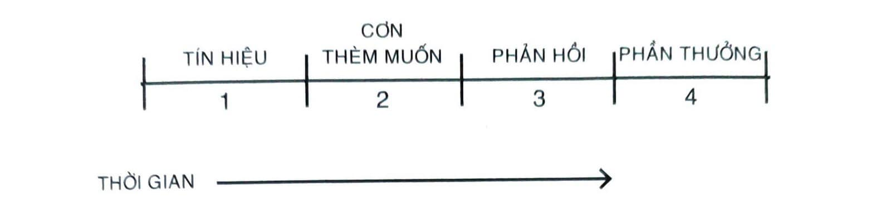
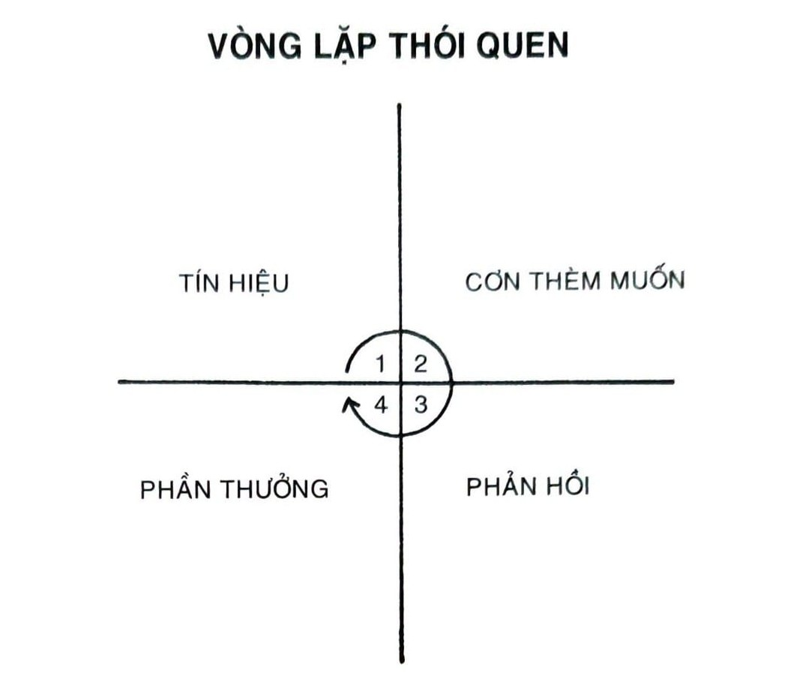
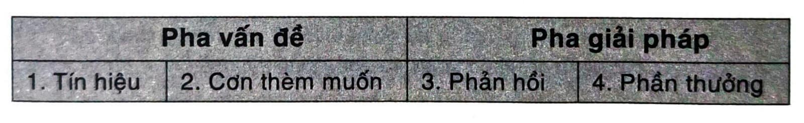
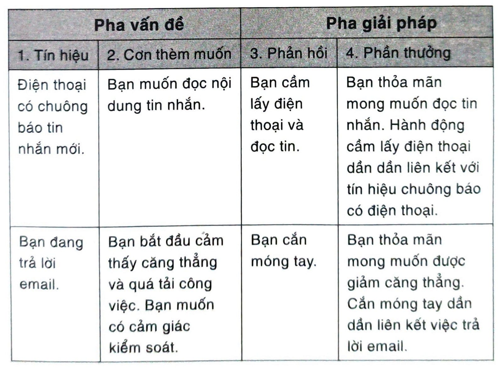
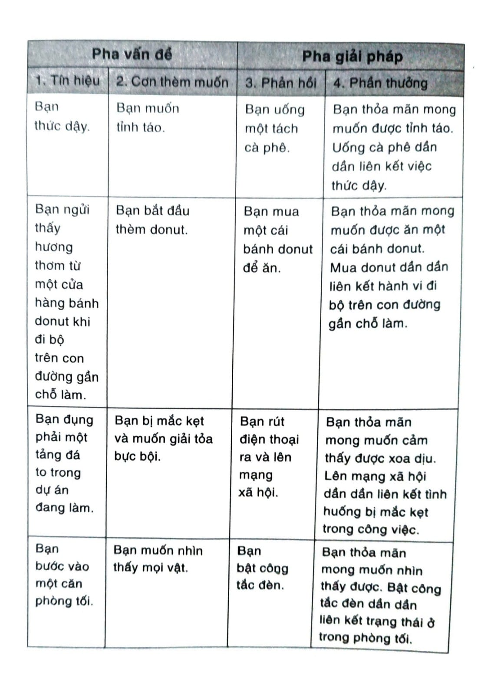
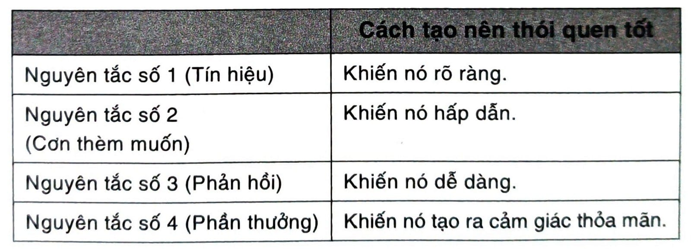
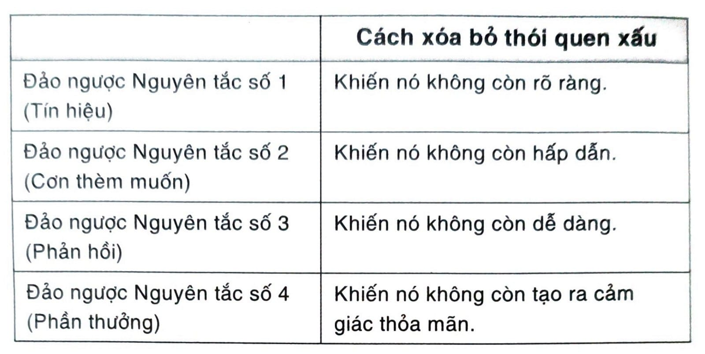

# CHƯƠNG 3: XÂY DỰNG THÓI QUEN TỐT HƠN TRONG BỐN BƯỚC ĐƠN GIẢN

XÂY DỰNG THÓI QUEN TỐT HƠN TRONG BỐN BƯỚC

## ĐƠN GIẢN

Năm 1898, một nhà tâm lý học tên Edward Thorndike đã tiến hành một thực nghiệm đặt nền tảng cho hiểu biết nhân loại về quá trình hình thành thói quen, cũng như các nguyên tắc dẫn hướng hành vi con người. Thorndike có niềm say mê nghiên cứu hành vi động vật, và ông khởi đầu bằng việc nghiên cứu mèo.

Ông đặt mỗi con mèo vào một thiết bị gọi là hộp mê cung. Thiết kế của chiếc hộp khiến con mèo chỉ có thể thoát ra bằng một cái cửa, mà cánh cửa này sẽ mở ra “bằng một hành động đơn giản, chẳng hạn như kéo một mẩu thòng lọng, gạt một cái cần, hay giẫm lên một cái bục”. Ví dụ, chiếc hộp chứa một cái cần mà khi gạt xuống, cửa bên thành hộp sẽ mở ra. Khi đó, con mèo có thể lỉnh ra và chạy tới một tô thức ăn.

Đa số mèo muốn thoát khỏi hộp ngay khi bị nhốt vào bên trong. Chúng sẽ chõ mũi vào các góc, chọt móng qua các khe hở và cào cào các vật thể lỏng lẻo. Sau vài phút khám phá, mấy con mèo sẽ vô tình nhấn vào chiếc cần ma thuật, cánh cửa mở ra và chúng có thể thoát ra được.

Thorndike ghi chép lại hành vi của mỗi con mèo qua nhiều lần thử. Lúc mới đầu, mấy con mèo đi lại vòng vòng ngẫu nhiên quanh chiếc hộp. Nhưng ngay khi chiếc cần được nhấn xuống và cửa mở ra, quá trình học tập bắt đầu khởi động. Dần dần, mỗi con mèo đều học được cách gắn hành động nhấn vào cần với phần thưởng là thoát khỏi chiếc hộp và có thức ăn.

Sau chừng hai mươi đến ba mươi lần thử, hành vi này trở nên tự động và thành thói quen, con mèo có thể thoát ra chỉ trong vài giây. Ví dụ, Thorndike ghi nhận, “Con mèo số 12 tốn bao nhiêu đây thời gian để thực thi hành động. 160 giây, 30 giây, 90 giây, 60, 15, 28, 20, 30, 22, 11, 15, 20, 12, 10, 14, 10, 8, 8, 5, 10, 8, 6, 6, 7.”

Trong ba lần thử đầu tiên, con mèo thoát ra trong trung bình 1,5 phút. Trong ba lần thử cuối cùng, nó thoát ra trong trung bình 6,3 giây. Bằng luyện tập, mỗi con mèo đều phạm ít lỗi hơn, cũng như hành động của chúng trở nên nhanh hơn và tự động hơn. Thay vì lặp lại cùng một lỗi, con mèo bắt đầu nhảy ngay đến giải pháp.

Từ nghiên cứu của mình, Thorndike mô tả quá trình học tập bằng phát biểu sau, “Hành vi theo sau bởi hệ quả vừa ý có xu hướng lặp đi lặp lại, và các hành vi gắn với hệ quả khó chịu có xu hướng ít lặp lại hơn.” Công trình của Thorndike cung cấp điểm khởi đầu hoàn hảo cho ta thảo luận về cách hình thành thói quen trong đời sống. Nó cũng trả lời cho các câu hỏi cốt lõi như: Thói quen là gì? Và rốt cuộc vì sao bộ não lại chịu khó xây dựng như thế?

## TẠI SAO BỘ NÃO XÂY DỰNG THÓI QUEN

Thói quen là một hành vi được lặp đi lặp lại đủ lâu để trở nên tự động. Quá trình hình thành thói quen bắt đầu bằng việc thử và sai. Bất cứ khi nào bạn bước vào một tình cảnh mới trong đời, não bạn sẽ ra quyết định. Ta sẽ phản ứng thế nào với điều này? Lần đầu tiên bạn vượt qua một vấn đề, bạn không chắc mình giải quyết như thế nào. Như con mèo của Thorndike, bạn chỉ đang thử xem cái nào có tác dụng.

Hoạt động thần kinh của não bộ trong giai đoạn này khá là cao. Bạn cẩn thận phân tích tình huống và đưa ra các quyết định có ý thức về cách hành động tiếp theo. Bạn tiếp nhận hàng tấn thông tin mới và cố gắng mọi mặt trong đó. Não bạn bận bịu học hỏi các đường hướng hành động hiệu quả nhất.

Thông thường, như con mèo ấn vào cái cần, bạn vô tình đụng phải giải pháp. Bạn cảm thấy lo lắng, và thấy là chạy vòng vòng sẽ giúp mình bình tĩnh lại. Tinh thần bạn mệt mỏi sau một ngày dài làm việc và bạn thấy chơi game sẽ giúp thư giãn. Thế là bạn mò mẫm, khám phá, khám phá, khám phá, và rồi - BENG - phần thưởng.

Sau khi bạn vô tình va vào một phần thưởng bất ngờ thì lần sau bạn đổi chiến thuật khác. Não bạn ngay lập tức bắt đầu xếp loại, liệt kê các sự kiện đứng trước phần thưởng. Chờ đã - chuyện này thật tuyệt. Mình đã làm gì trước đó nhỉ?

Đây chính là vòng lặp phản hồi đằng sau mọi hành vi con người: thử, thất bại, học, thử cái khác. Bằng luyện tập, các khoảnh khắc vô dụng sẽ dần tiêu biến và các hành động hữu ích bắt đầu được củng cố. Đấy chính là quá trình hình thành thói quen.

Bất kỳ lúc nào bạn đối mặt với một vấn đề lặp đi lặp lại, não bạn bắt đầu tự động hóa quy trình giải quyết vấn đề ấy. Thói quen chẳng qua là một chuỗi các giải pháp tự động cho những rắc rối và căng thẳng bạn phải đối mặt thường ngày. Như nhà khoa học hành vi Jason Hreha đã nói, “Thói quen đơn giản là các giải pháp đáng tin cho các vấn đề tái đi tái lại trong môi trường sống của chúng ta.”

Khi thói quen được tạo ra, mức độ hoạt động trong não giảm xuống. Bạn đã học được cách tập trung vào các tín hiệu báo trước thành công và bỏ qua những thứ khác. Khi một tình huống tương tự nảy sinh trong tương lai, bạn biết chắc cần phải tìm kiếm điều gì. Bạn không còn cần phải phân tích mọi góc độ của tình huống nữa. Não bạn bỏ qua quá trình thử và sai, và tạo ra một quy luật tinh thần: Nếu thế này, thì mình sẽ làm thế kia. Các kịch bản nhận thức này có thể được thi hành một cách tự động bất kỳ lúc nào tình huống tương ứng xảy ra. Thế là bây giờ, khi nào thấy căng thẳng bạn lại nóng lòng muốn chạy bộ. Khi vừa mới đi làm về, bạn chộp ngay lấy tay cầm chơi video game. Bạn từng cần phải nỗ lực để lựa chọn, giờ đây trở nên tự động. Một thói quen đã hình thành.

Thói quen chính là lối tắt học được từ kinh nghiệm. Theo nghĩa đó, thói quen chỉ là một mẩu ghi nhớ về các bước bạn từng thực hiện để giải quyết một vấn đề xảy ra trong quá khứ. Bất cứ khi nào các điều kiện hội tụ đủ, bạn có thể rút ra mẫu ký ức này và tự động áp dụng vào tình huống tương tự. Lý do chính mà não bạn ghi nhớ quá khứ là để dự đoán tốt hơn những gì sẽ có tác dụng trong tương lai.

Việc hình thành thói quen là cực kỳ hữu ích bởi vì phần ý thức của tâm trí là phần thắt cổ chai của não. Nó chỉ có thể tập trung vào một vấn đề trong một lúc. Kết quả là, não bạn luôn phải hoạt động để lưu trữ sức chú ý có ý thức cho các nhiệm vụ trọng yếu nhất. Bất cứ khi nào có thể, phần tâm trí có ý thức đều muốn đẩy nhiệm vụ sang cho phần tâm trí phi ý thức làm tự động. Đây chính xác là điều xảy ra khi thói quen được hình thành. Thói quen giảm bớt các gánh nặng nhận thức và giải phóng dung lượng hoạt động tinh thần, để bạn có thể phân bố sức chú ý của mình cho những nhiệm vụ khác.

Bất chấp hiệu năng của thói quen, nhiều người vẫn băn khoăn về lợi ích của chúng. Các lập luận thường thấy như là: “Thói quen có làm cuộc sống của tôi nhàm chán không? Tôi không muốn nhét mình vào một lối sống mà tôi không thích. Quá nhiều nếp sống thường lệ liệu có lấy đi sự sinh động hay tính ngẫu hứng của đời sống chăng?” Hiếm khi. Những thắc mắc như vậy đã tạo ra một thế lưỡng phân giả hiệu. Chúng khiến bạn nghĩ rằng mình phải chọn lựa giữa hai thứ, tạo lập thói quen và đạt được tự do. Trong khi đó, thực tế là hai thứ này đi cùng với nhau.

Thói quen không hạn chế tự do. Thậm chí còn tạo ra tự do. Thực tế là những người không kiểm soát được thói quen của mình thường chính là những người có ít tự do nhất. Nếu không có thói quen tài chính tốt, bạn sẽ luôn phải vật lộn đi kiếm từng đồng từng cắc tiếp theo. Nếu không có thói quen sức khỏe lành mạnh, bạn sẽ luôn cảm thấy mình thiếu năng lượng. Nếu không có thói quen học hỏi tốt, bạn sẽ luôn cảm thấy như mình tụt hậu so với thế giới. Nếu luôn bị buộc phải ra quyết định cho những nhiệm vụ giản đơn - khi nào nên đi tập thể dục, nên đi đâu viết lách, khi nào nên trả tiền hóa đơn - thì bạn sẽ có ít thời gian tự do hơn. Chỉ khi khiến các quy tắc cơ bản của đời sống trở nên đơn giản hơn thì bạn mới có thể tạo ra đủ không gian tinh thần cho mình suy nghĩ và tự do sáng tạo.

Đổi lại, khi thói quen của bạn đã vào guồng, căn bản cuộc sống đã được thu xếp và hoàn tất, thì tâm trí bạn sẽ tự do tập trung vào các thử thách mới và lên đường thu phục các tầng vấn đề mới. Tạo lập thói quen ở hiện tại cho phép bạn làm được nhiều hơn những gì bạn muốn trong tương lai.

## KHOA HỌC VỀ CÁCH VẬN HÀNH CỦA THÓI QUEN

Quá trình hình thành một thói quen có thể được chia thành bốn bước đơn giản sau: tín hiệu, cơn thèm muốn, phản hồi, và phần thưởng[^27]. Chia nhỏ quá trình thành các thành phần cơ bản có thể giúp ta hiểu được một thói quen, nó vận hành như thế nào, và cách cải thiện.

*Hình 5: Tất cả thói quen đều tiến triển qua bốn giai đoạn theo một trật tự như sau: tín hiệu, cơn thèm muốn, phản hồi, và phần thưởng.*

Mô hình bốn bước này là xương sống của mọi thói quen, và não bạn đi qua các bước này theo cùng một trật tự giống nhau mỗi lần như thế.

Đầu tiên, có một tín hiệu nảy ra. Tín hiệu kích hoạt não bạn khởi động một hành vi. Đó là một mẩu thông tin báo trước một phần thưởng. Các tổ tiên tiền sử của chúng ta tập trung chú ý vào các dấu hiệu thông báo địa điểm của một phần thưởng cơ bản hàng đầu, chẳng hạn như thức ăn, nước uống, và tình dục. Ngày nay, chúng ta tiêu tốn phần lớn thời gian cho việc học tập các dấu hiệu báo trước các phần thưởng thứ cấp như tiền tài và danh tiếng, quyền lực và địa vị, lời khen và sự tán thưởng, tình yêu và các mối quan hệ, hoặc cảm giác thỏa mãn cá nhân. (Tất nhiên các mưu cầu này cũng gián tiếp cải thiện cơ hội sống sót và tái sinh sản, vốn chính là động lực thúc đẩy sâu thẳm đằng sau mọi thứ ta làm.)

Tâm trí của bạn đang liên tục phân tích tình trạng nội tại lẫn môi trường bên ngoài để tìm kiếm các dấu hiệu chỉ dẫn về vị trí phần thưởng. Bởi vì tín hiệu là dấu chỉ đầu tiên cho thấy ta đang ở gần một phần thưởng, thông thường nó sẽ dẫn đến sự khao khát.

Cơn thèm muốn/ lòng khao khát là bước thứ hai, và chúng là nguồn động lực thúc đẩy đằng sau mọi thói quen. Nếu không có động lực thúc đẩy hoặc mong mỏi mãnh liệt đến một mức độ nào đó - nếu không thèm muốn sự thay đổi - chúng ta chẳng có lý do gì để hành động. Cái bạn khát khao không phải là bản thân thói quen, thay vào đó là sự thay đổi hiện trạng mà thói quen ấy mang lại. Bạn không phải là đang thèm hút thuốc, bạn thèm cảm giác dễ chịu mà nó mang lại. Bạn có thôi thúc phải đánh răng không phải bởi bản thân hành động đánh răng, chính cảm giác răng miệng sạch sẽ khiến bạn làm vậy. Không phải bạn muốn bật tivi, cái bạn muốn là sự giải trí. Mỗi cơn thèm muốn đều gắn với một mong muốn thay đổi nào đó trong trạng thái nội tại. Đây là một điểm quan trọng, chúng ta sẽ thảo luận sâu hơn về nó sau.

Mỗi người có cơn thèm muốn không giống nhau. Về lý thuyết, mỗi một mẩu thông tin đều có thể kích hoạt một cơn thèm muốn, nhưng trong thực tế, con người không bị thôi thúc hành động bởi cùng một tín hiệu. Với một tay cờ bạc thì âm thanh máy quay số có thể là một kích thích tiềm tàng làm xẹt lên làn sóng khao khát mãnh liệt. Còn với người hiếm khi cờ bạc thì tiếng leng keng soàn soạt của sòng bài chỉ là tạp âm lao xao của phông nền mà thôi. Tín hiệu là vô nghĩa cho đến khi chúng được giải mã. Suy nghĩ, tâm tư, cảm xúc của người quan sát chính là thứ chuyển hóa tín hiệu thành cơn thèm muốn.

Bước thứ ba là phản hồi. Phản hồi là thói quen thực tế bạn biểu hiện, có thể dưới hình dạng một suy nghĩ hoặc một hành động. Một phản hồi xảy ra phụ thuộc vào mức độ bạn bị thôi thúc và có bao nhiêu lực cản gắn với hành vi này. Nếu một hành động cụ thể đòi hỏi nhiều nỗ lực thể chất hay tinh thần hơn mức bạn sẵn sàng bỏ ra, thì bạn sẽ không làm. Phản ứng của bạn còn phụ thuộc vào năng lực của bạn. Nghe có vẻ đơn giản, nhưng một thói quen chỉ có thể đến khi bạn có đủ khả năng thực hiện nó. Nếu bạn muốn làm một cú úp rổ nhưng lại nhảy không đủ cao để chạm tới rổ bóng thì, úi, xui rồi.

Cuối cùng, phản hồi sẽ đưa đến phần thưởng. Phần thưởng chính là mục tiêu cuối của mọi thói quen. Tín hiệu có nhiệm vụ báo động về phần thưởng. Cơn thèm muốn là lòng khao khát muốn có phần thưởng. Phản hồi là về việc đạt được phần thưởng. Chúng ta đuổi theo bởi vì phần thưởng phục vụ hai mục đích: (1) Chúng thỏa mãn ta và (2) Chúng dạy ta.

Mục đích đầu tiên của phần thưởng là để thỏa mãn cơn khát của ta. Phải, phần thưởng bản thân nó đã có lợi ích. Thức ăn và nước uống cho bạn năng lượng cần thiết để sống sót. Thăng tiến sẽ mang lại tiền bạc và danh vọng. Giữ dáng có thể cải thiện sức khỏe cũng như tiềm năng hẹn hò của bạn. Thế nhưng lợi ích trực tiếp nhất nằm ở chỗ phần thưởng thỏa mãn cơn thèm ăn, đạt tới địa vị xã hội hoặc được công nhận. Ít nhất, tạm thời thì phần thưởng trao cho ta cảm giác hài lòng và làm dịu cơn thèm muốn.

Thứ nhì, phần thưởng dạy ta biết hành động nào thì đáng được ghi nhớ trong tương lai. Não bạn là một máy dò phần thưởng. Khi bạn bước ra đời, hệ thần kinh cảm giác của bạn liên tục dò tìm xem hành động nào sẽ thỏa mãn các khát vọng và đem tới niềm vui. Cảm giác thích thú và thất vọng là một phần của cơ chế phản hồi giúp não bạn phân biệt hành vi hữu dụng và hành vi vô ích. Phần thưởng có vai trò kết thúc vòng lặp phản hồi và hoàn tất một vòng chu kỳ thói quen.

Nếu một hành vi cho thấy nó không đủ hiệu dụng trong bất kỳ bước nào của bốn giai đoạn, nó sẽ không trở thành một thói quen. Loại bỏ đi tín hiệu thì thói quen của bạn sẽ không bao giờ bắt đầu hình thành. Giảm bớt cơn thèm muốn, bạn không bao giờ có đủ động lực để hành động. Hoặc giả làm cho hành vi trở nên khó khăn thì bạn cũng không thể thực hiện nó được. Và cuối cùng, nếu phần thưởng không đủ sức thỏa mãn cơn thèm muốn, bạn sẽ không có lý do để lặp lại hành động ấy trong tương lai. Thiếu ba bước đầu tiên, hành vi sẽ không xảy ra. Thiếu cả bốn, hành vi sẽ không lặp lại.

Tóm lại, tín hiệu kích hoạt cơn thèm muốn, từ đó làm động lực cho phản hồi, dẫn đến phần thưởng, phần thưởng sẽ thỏa mãn cơn thèm khát, và sau cùng sẽ tạo nên liên kết với tín hiệu. Cùng với nhau, bốn bước này hợp thành một vòng lặp phản hồi của hệ thần kinh - tín hiệu, cơn thèm muốn, phản hồi, phần thưởng; tín hiệu, cơn thèm muốn, phản hồi, phần thưởng - chính vòng lặp này giúp bạn tạo nên các thói quen tự động. Vòng chu kỳ này được gọi là vòng lặp thói quen.

*Hình 6: Bốn giai đoạn của thói quen được mô tả rõ nhất bằng vòng lặp phản hồi. Chúng tạo nên một chu kỳ khép kín bất tận xoay quanh mỗi khoảnh khắc trong đời bạn. “Vòng lặp thói quen” này liên tục dò quét môi trường sống, đưa ra dự đoán điều sẽ xảy ra tiếp theo, thử nghiệm các phản hồi khác nhau, và học tập từ kết quả.28*

Quy trình bốn bước này không phải thi thoảng mới xảy ra, thay vì vậy nó là một vòng lặp phản hồi vô tận luôn vận động không ngừng quanh mỗi một khoảnh khắc trong đời sống của ta - kể cả ngay lúc này. Bộ não liên tục quét qua môi trường, dự đoán điều sắp xảy ra, thử nghiệm các phản ứng khác nhau, và học tập từ kết quả. Toàn bộ quy trình hoàn tất chỉ trong tích tắc của giây, và ta sử dụng quy trình này lặp đi lặp lại mà không nhận ra mọi thứ đã được gói ghém vào trong khoảnh khắc trước đó.

Chúng ta có thể chia bốn bước này thành hai pha chính: pha vấn đề và pha giải pháp. Pha vấn đề bao gồm tín hiệu và cơn thèm muốn, đó là khi bạn nhận ra có một cái gì đó cần được thay đổi. Pha giải pháp bao gồm phản hồi và phần thưởng, và đó là khi bạn bắt đầu hành động và đạt được thay đổi mong muốn.

Mọi hành vi đều được thúc đẩy bằng một khao khát giải quyết vấn đề. Đôi khi vấn đề có thể là bạn nhận ra điều tốt và muốn đạt được. Đôi lúc vấn đề lại là bạn đang bị đau ở đâu đấy và muốn làm dịu cơn đau. Dù là kiểu nào thì mục đích của mọi thói quen cũng đều muốn giải quyết vấn đề bạn đang gặp phải.

Trong bảng ở trang tiếp theo, bạn có thể xem một số ví dụ thực tế của các vấn đề này.

Hãy tưởng tượng bạn bước vào một căn phòng tối và mò mẫm đến công tắc đèn. Bạn thực thi thói quen đơn giản này nhiều lần đến mức nó xảy ra mà không cần suy nghĩ. Bạn đi qua bốn giai đoạn chỉ trong một phần nhỏ của giây. Thôi thúc hành động ập tới không cần suy nghĩ.

Khi đã trưởng thành, ta hiếm khi nhận ra các thói quen đang vận hành cuộc sống của mình. Phần đông chúng ta không hề suy nghĩ lại về chuyện mình thắt dây giày theo cùng một kiểu mỗi sáng, hay đắn đo xem có nên rút điện máy nướng bánh sau khi sử dụng, hay lúc nào cũng thay đồ thoải mái sau khi đi làm về. Sau hàng thập kỷ của việc lập trình tinh thần, chúng ta tự động lẻn vào các mô hình suy nghĩ và hành động này.

## BỐN NGUYÊN TẮC THAY ĐỔI HÀNH VI

Trong các chương tiếp theo, chúng ta sẽ xem xét cách bốn giai đoạn - tín hiệu, cơn thèm muốn, phản hồi, phần thưởng - ảnh hưởng gần như mọi thứ ta làm mỗi ngày lặp đi lặp lại nhiều lần như thế nào. Nhưng trước đó, chúng ta cần biến bốn bước này thành một bộ khung thực tiễn để ứng dụng thiết kế nên các thói quen có lợi, cũng như xóa bỏ các thói quen bất lợi.

Tôi gọi bộ khung này là Bốn Nguyên tắc Thay đổi Hành vi, và nó cung cấp một bộ quy tắc đơn giản giúp ta hình thành các thói quen tốt và bỏ đi thói quen xấu. Bạn có thể xem mỗi nguyên tắc như một cần gạt tác động lên hành vi con người. Khi cần gạt đã vào vị trí, tạo thói quen tốt trở nên rất dễ dàng. Còn khi sai vị trí thì gần như bất khả thi.

Chúng ta có thể đảo ngược các nguyên tắc này vào việc xóa bỏ thói quen bất lợi.

Sẽ hơi vô trách nhiệm nếu tôi nói rằng bốn nguyên tắc này là bộ khung thấu đáo có thể thay đổi bất kỳ một hành vi nào của con người, nhưng mà tôi nghĩ rằng nó đã rất gần. Rồi bạn sẽ thấy, Bốn Nguyên tắc Thay đổi Hành vi áp dụng cho gần như mọi lĩnh vực, từ thể thao đến chính trị, từ nghệ thuật đến y khoa, từ hài kịch đến quản lý. Các nguyên tắc này có thể được ứng dụng cho bất kể vấn đề nào bạn đang gặp phải. Không nhất thiết phải có chiến lược hoàn toàn khác nhau cho mỗi thói quen.

Bất kỳ khi nào bạn muốn thay đổi hành vi của mình, chỉ cần hỏi bản thân: 1. Làm sao để khiến nó trở nên rõ ràng? 2. Làm sao để khiến nó trở nên hấp dẫn? 3. Làm sao để khiến nó trở nên dễ dàng? 4. Làm sao để khiến nó tạo ra cảm giác thỏa mãn?

Nếu bạn từng thắc mắc rằng, “Tại sao mình không làm những điều mình nói là mình sẽ làm? Tại sao mình không giảm cân, hay cai thuốc, hay tiết kiệm cho sau này về hưu, hay lập một công ty phụ? Tại sao mình bảo cái đó quan trọng nhưng chưa bao giờ thực sự dành thời gian cho nó?”, thì câu trả lời cho các vấn đề trên có thể nằm đâu đó trong bốn nguyên tắc đã nêu. Chìa khóa tạo nên thói quen tốt cũng như xóa bỏ thói quen xấu nằm ở việc thấu hiểu các nguyên tắc căn bản này và cách tùy biến chúng theo nhu cầu cá nhân mình. Mỗi một mục tiêu đều sẽ thất bại nếu nó chống lại bản chất cốt lõi của con người.

Thói quen của bạn được định hình bởi các hệ thống trong đời bạn. Trong các chương tiếp theo, chúng ta sẽ thảo luận các nguyên tắc này từng cái một, và cho bạn thấy cách áp dụng chúng để tạo nên một hệ thống, trong đó các thói quen có lợi nảy nòi một cách tự nhiên và thói quen xấu sẽ tàn lụi.

## Tóm tắt chương

- Thói quen là một hành vi được lặp đi lặp lại đủ lâu để trở nên tự động.

- Mục đích tối hậu của thói quen là giải quyết vấn đề trong đời sống với ít năng lượng và nỗ lực nhất có thể.

- Mọi thói quen đều có thể chia thành một vòng lặp phản hồi gồm có bốn bước: tín hiệu, cơn thèm muốn, phản hồi, phần thưởng.

- Bốn Nguyên tắc Thay đổi Hành vi là một bộ quy tắc đơn giản giúp ta hình thành các thói quen tốt hơn. Bộ nguyên tắc này gồm có (1) khiến cho thói quen trở nên rõ ràng, (2) khiến cho thói quen trở nên hấp dẫn, (3) khiến cho thói quen trở nên dễ dàng, và (4) khiến cho thói quen tạo nên cảm giác thỏa mãn.

---

## Chú thích

[^27]: Độc giả quyển The Power of Habit của tác giả Charles Duhigg sẽ thấy quen với các thuật ngữ này. Duhigg đã viết một  quyển sách xuất sắc về thói quen, ý định của tôi là tiếp tục phần việc ở nơi ông ấy đã dừng lại bằng cách tổng hợp các giai đoạn này thành bốn nguyên tắc đơn giản giúp bạn ứng dụng vào việc xây dựng thói quen tốt hơn trong đời sống và công việc. (TG)
