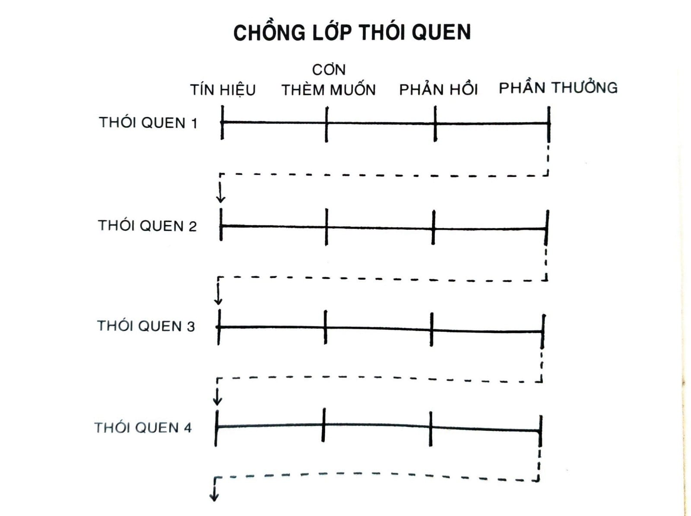

# CHƯƠNG 5: CÁCH TỐT NHẤT BẮT ĐẦU MỘT THÓI QUEN

Năm 2001, các nhà nghiên cứu ở Great Britain đã tiến hành làm việc với 248 người nhằm tạo thói quen tập thể dục tốt hơn trong một khóa huấn luyện hai tuần. Đối tượng tham gia được chia thành ba nhóm.

Nhóm đầu tiên là nhóm kiểm soát. Họ được yêu cầu đơn giản là theo dõi và ghi nhận lại tần suất tập thể dục của mình.

Nhóm thứ hai là nhóm “tạo động lực”. Ngoài việc ghi nhận lại quá trình tập luyện, họ còn được yêu cầu đọc một số tài liệu về lợi ích của việc tập thể dục. Nhà nghiên cứu còn giải thích với nhóm này cách thức tập thể dục có thể giảm bớt nguy cơ mắc bệnh tim mạch vành và cải thiện sức khỏe tim mạch ra sao.

Cuối cùng là nhóm thứ ba. Các đối tượng trong nhóm này được nghe trình bày giống như nhóm thứ hai, nhằm đảm bảo họ có cùng mức độ được tạo động lực như nhóm hai. Tuy nhiên, họ còn được yêu cầu lên một kế hoạch cụ thể là họ sẽ tập thể dục vào lúc nào và ở đâu vào tuần sau đó. Cụ thể là, mỗi thành viên nhóm ba sẽ điền vào câu sau: “Trong tuần tiếp theo, tôi sẽ cùng tham gia ít nhất 20 phút bài tập gắng sức vào [NGÀY] lúc [THỜI GIAN] ở [NƠI CHỐN].”

Trong nhóm một và nhóm hai, 35 đến 38% thành viên luyện tập ít nhất một lần một tuần. (Thú vị là bài giảng động lực cho nhóm hai dường như không có tác động đáng kể lên hành vi.) Nhưng 91% trong nhóm ba tập thể dục ít nhất một lần một tuần - hơn gấp đôi tỷ lệ thông thường.

Câu phát biểu họ điền vào là cái mà các nhà nghiên cứu gọi là dự định thực thi, là một kế hoạch bạn lên trước về thời gian và nơi chốn sẽ hành động. Nghĩa là, cái cách bạn dự định sẽ thực thi một thói quen nào đấy.

Tín hiệu có thể kích hoạt một thói quen có thể đến dưới rất nhiều dạng - cảm giác điện thoại rung trong túi, mùi thơm từ bánh quy sô-cô-la, âm thanh còi xe cấp cứu - nhưng hai hình thức tín hiệu thông dụng nhất chính là thời gian và nơi chốn. Dự định thực thi là đòn bẩy cho hai tín hiệu này. Nói rộng ra, công thức tạo ra dự định thực thi là: “Khi tình huống X xảy ra, tôi sẽ thực hiện phản ứng Y.”

Hàng trăm nghiên cứu đã cho thấy dự định thực thi rất hiệu quả trong việc kiên trì mục tiêu, bất kể là viết xuống ngày giờ cụ thể khi nào bạn sẽ đi tiêm phòng cúm hay là ghi lại thời gian cuộc hẹn nội soi ruột của mình. Chúng gia tăng khả năng người ta duy trì các thói quen như đạp xe đạp, học bài, đi ngủ sớm, hay cai thuốc lá.

Các nhà nghiên cứu đã phát hiện thấy số lượng phiếu bầu tăng lên khi người đi bầu bị buộc tạo ra dự định thực thi bằng cách trả lời các câu hỏi như: “Bạn dự định đi đến điểm bỏ phiếu bằng đường nào? Mấy giờ bạn định sẽ đi? Bạn đi xe buýt số mấy đến đó?” Các chương trình thành công khác của chính phủ đã nhắc nhở công dân lập một kế hoạch rõ ràng trong việc đóng thuế đúng hạn, hoặc cung cấp chỉ dẫn cụ thể về thời gian và nơi chốn đóng các hóa đơn giao thông trễ hạn.

Câu chốt ở đây quá rõ: Người lập kế hoạch rõ ràng ở đâu và khi nào sẽ thực thi một thói quen mới thì có nhiều khả năng sẽ theo đến cùng hơn. Có rất nhiều người cố gắng thay đổi thói quen mà không làm rõ các chi tiết cơ bản này. Ta cứ nhủ thầm, “Mình sẽ ăn uống lành mạnh hơn” hay “Mình sẽ viết nhiều hơn”, nhưng ta chưa bao giờ làm rõ ở đâu hay khi nào thì các thói quen này sẽ xảy ra. Ta để mặc cho nó hú họa và hy vọng là mình sẽ “nhớ ra để làm”, hoặc là khi nào đó sẽ có đủ động lực hành động. Dự định thực thi sẽ quét sạch các ý niệm mờ mịt như “Mình sẽ tập thể dục nhiều hơn”, “Mình muốn hiệu quả hơn” hay “Mình nên đi bỏ phiếu”, và chuyển hóa chúng thành một kế hoạch hành động cụ thể.

Nhiều người nghĩ họ thiếu động lực trong khi cái họ thiếu thực sự là tính tường minh. Không phải lúc nào cũng rõ ràng nơi chốn và thời gian cho ta hành động. Nhiều người sống cả đời chờ đợi một thời điểm đúng để thực thi một cải tiến.

Một khi dự định thực thi được đề ra, bạn không cần đợi có cảm hứng mới bắt đầu. Mình sẽ viết một chương hôm nay hay là không? Mình sẽ thiền vào buổi sáng hay buổi trưa? Khi thời điểm hành động trờ đến, không cần phải quyết định nữa. Chỉ cần theo sát kế hoạch đã đặt ra là xong. Cách đơn giản để áp dụng chiến lược này vào thói quen là điền vào câu sau:

Tôi sẽ [HÀNH VI NÀO ĐÓ] vào lúc [THỜI GIAN] ở [NƠI CHỐN]. Thiền. Tôi sẽ thiền một phút vào 7 giờ sáng trong nhà bếp. Học bài. Tôi sẽ học tiếng Tây Ban Nha hai mươi phút vào 6 giờ tối trong phòng mình. Tập thể dục. Tôi sẽ tập thể dục một tiếng vào lúc 5 giờ chiều ở phòng tập gym trong khu dân cư. Đời sống hôn nhân. Tôi sẽ pha một tách trà cho bạn đời của mình vào lúc 8 giờ sáng trong nhà bếp.

Nếu bạn không chắc nên bắt đầu thói quen khi nào, hãy thử vào ngày đầu tuần, đầu tháng, hay ngày đầu năm mới. Người ta thường có xu hướng hành động vào các thời điểm này bởi vì lúc này hy vọng thường là cao hơn. Nếu ta có hy vọng, ta có lý do để hành động. Một khởi đầu mới luôn tạo cảm giác có động lực.

Đề ra dự định thực thi còn có một lợi ích khác. Bạn càng cụ thể về cái mình muốn và cách mình sẽ đạt được nó, bạn càng dễ nói không với những thứ làm chệch hướng tiến trình, sao nhãng tâm trí và khiến bạn trật khỏi đường đi. Chúng ta thường chấp nhận các yêu cầu nhỏ không đáng kể bởi vì ta chưa rõ về những việc cần phải làm. Khi ước mơ của bạn còn chưa rõ ràng thì thật dễ hợp lý hóa những ngoại lệ nho nhỏ trong ngày, và không bao giờ chạm đến những việc cụ thể ta cần làm được để thành công.

Bạn hãy cho các thói quen của mình một chút thời gian và không gian tồn tại trong đời bạn. Mục tiêu là làm cho thời gian và nơi chốn trở nên thật rõ ràng, để khi nhận đủ sự tái diễn, bạn sẽ có được thôi thúc làm đúng việc vào đúng thời điểm, ngay cả khi bạn không thể giải thích tại sao. Như tác giả Jason Zweig đã nói, “Dĩ nhiên là bạn chẳng thể nào giải quyết được việc gì mà không có tư duy về mặt ý thức. Thế nhưng, như con chó chảy nước bọt khi nghe tiếng chuông, có lẽ bạn bắt đầu hoảng loạn thường ngay vào lúc bắt đầu giải quyết vấn đề.”

Có nhiều cách áp dụng dự định thực thi vào cuộc sống và công việc. Cách của tôi là một phương pháp học được từ giáo sư BJ Fogg của trường Stanford, và nó là chiến lược tôi gọi là chồng lớp thói quen.

## CHỒNG LỚP THÓI QUEN: KẾ HOẠCH ĐẠI TU THÓI QUEN ĐƠN GIẢN

Triết gia người Pháp Denis Diderot sống gần như cả đời trong nghèo khó, nhưng tất cả thay đổi vào một ngày năm 1765.

Con gái của Diderot sắp kết hôn mà ông thì không thể nào chi trả nổi cho đám cưới. Dù túng thiếu nhưng Diderot nổi danh trong vai trò đồng sáng lập và tác giả của Encyclopédie, một trong những bộ từ điển bách khoa toàn diện nhất thời bấy giờ. Khi Catherine Đại đế, Nữ hoàng Nga, nghe về các vấn đề tài chính của Diderot, trái tim bà cảm thương cho ông. Bà là một người yêu thích đọc sách và vô cùng hâm mộ bộ bách khoa từ điển của Diderot. Bà đề nghị mua lại thư viện riêng của Diderot với giá 1.000 bảng Anh - hơn 150.000 đô-la Mỹ theo thời giá bây giờ[^32]. Thế là bất thình lình, Diderot có một khoản tiền kếch xù. Với cục tiền mới này, ông không những chi trả được cho đám cưới mà còn mua được cho mình một chiếc áo choàng màu đỏ tươi.

Tấm áo choàng màu đỏ của Diderot vô cùng xinh đẹp. Thực tế là nó đẹp tới mức ngay lập tức ông nhận thấy nó thật chỏi với mấy thứ xoàng xĩnh mà ông có trong nhà. Ông viết rằng có gì đó “không còn tương thích, không còn thống nhất, không còn đẹp đẽ” giữa tấm áo choàng thanh nhã và toàn bộ đồ đạc còn lại của mình.

Rất nhanh chóng Diderot cảm thấy thôi thúc phải nâng cấp đồ dùng của mình. Ông thay tấm thảm cũ bằng một tấm từ Damascus. Ông trang hoàng lại nhà với mấy tác phẩm điêu khắc đắt tiền. Ông mua một tấm gương đặt phía trên bệ lò sưởi, và một chiếc bàn bếp ngon lành hơn. Ông vứt chiếc ghế mây của mình đi, thay bằng một chiếc ghế bọc da. Như hàng cờ domino ngã đổ dây chuyền, ông mua hết món này đến món khác.

Hành vi của Diderot không hiếm gì. Trong thực tế, xu hướng hết mua món này đến món khác có một tên gọi riêng cho nó: Hiệu ứng Diderot. Hiệu ứng Diderot phát biểu rằng việc sở hữu một món đồ mới thường tạo ra một vòng xoáy tiêu thụ và dẫn tới những đợt mua hàng thêm nữa.

Bạn có thể nhận thấy mô thức này ở khắp mọi nơi. Bạn mua một chiếc đầm và phải mua thêm một đôi giày mới và hoa tai mới cho đồng điệu. Bạn mua một chiếc sofa và đột nhiên đắn đo về bố cục toàn bộ phòng ngủ của mình. Bạn mua một món đồ chơi cho con và nhanh chóng phát hiện ra mình đã mua toàn bộ phụ kiện đi kèm với nó. Đó là phản ứng mua sắm dây chuyền.

Rất nhiều hành vi con người đi theo vòng tròn này. Bạn thường quyết định mình cần làm gì tiếp theo dựa trên việc mình vừa hoàn thành trước đó. Bước vào nhà tắm dẫn tới việc rửa tay và hong khô tay, việc này lại nhắc bạn nhớ mình cần phải cho mớ khăn bẩn vào thùng giặt, thế là bạn thêm xà phòng giặt đồ vào danh sách đi chợ, và cứ thế. Không có hành vi nào xảy ra độc lập. Mỗi một hành động đều là tín hiệu kích hoạt hành vi tiếp theo.

Tại sao điều này lại quan trọng?

Khi nói đến việc tạo lập thói quen, bạn có thể tận dụng đặc tính liên kết của hành vi để có lợi cho mình. Một trong những cách tốt nhất để xây dựng một thói quen mới là định vị nó với một thói quen bạn đang thực hiện mỗi ngày và sau đó xếp hành vi mới này lên đầu. Đây được gọi là chồng lớp thói quen.

Chồng lớp thói quen là một hình thức đặc biệt của dự định thực thi. Thay vì kết nối thói quen mới của mình với thời gian và địa điểm cụ thể, bạn có thể gắn nó với một thói quen bạn đang có. Phương pháp này, được tạo ra bởi BJ Fogg trong một phần chương trình Thói quen Tí hon[^33] của ông, có thể được dùng để thiết kế một tín hiệu rõ ràng cho gần như mọi thói quen[^34]. Công thức chồng lớp thói quen này là: “Sau khi làm [THÓI QUEN HIỆN TẠI], tôi sẽ làm [THÓI QUEN MỚI].”

Ví dụ: Thiền. Sau khi rót một tách cà phê mỗi sáng, tôi sẽ thiền một phút. Tập thể dục. Khi cởi giày đi làm ra, tôi sẽ ngay lập tức thay đồ tập thể dục. Lòng biết ơn. Sau khi ngồi xuống ăn tối, tôi sẽ nói một lời biết ơn về chuyện đã xảy ra trong ngày. Đời sống hôn nhân. Khi lên giường đi ngủ mỗi đêm, tôi sẽ hôn người bạn đời của mình một cái. An toàn. Sau khi mang giày chạy bộ, tôi sẽ nhắn tin cho một người bạn hoặc một người thân về nơi tôi sẽ chạy bộ và sẽ chạy mất bao lâu.

Chìa khóa ở đây là hãy gắn hành vi mong muốn của bạn vào điều gì đó bạn đã và đang làm mỗi ngày. Khi bạn đã nhuần nhuyễn cấu trúc cơ bản này, bạn có thể bắt đầu tạo ra các lớp chồng lớn hơn bằng cách xâu chuỗi các thói quen nhỏ lại với nhau. Điều này cho phép bạn lợi dụng quán tính vận động tự nhiên từ một hành vi để dẫn đến hành vi tiếp theo - một phiên bản tích cực của Hiệu ứng Diderot.

*Hình 7: Chồng lớp thói quen làm tăng khả năng bạn sẽ gắn với một thói quen bằng cách xếp một hành vi mới lên trên một hành vi cũ. Quá trình này có thể lặp đi lặp lại để xâu chuỗi các thói quen lại với nhau, mỗi thói quen hoạt động như tín hiệu kích hoạt cái tiếp theo.*

Lớp thói quen theo thông lệ mỗi sáng của bạn có thể giống như thế này: 1. Sau khi rót một tách cà phê, tôi sẽ thiền sáu mươi giây. 2. Sau khi thiền sáu mươi giây, tôi sẽ viết ra danh sách công tác trong ngày. 3. Sau khi viết danh sách công tác trong ngày, tôi sẽ ngay lập tức thực hiện việc đầu tiên.

Hoặc là, có thể xem một lớp thói quen ví dụ vào buổi tối như sau: 1. Sau khi ăn tối, tôi sẽ cho chén bát vào máy rửa bát ngay. 2. Sau khi dọn chén bát, tôi sẽ ngay lập tức lau dọn quầy bếp. 3. Sau khi dọn dẹp quầy bếp, tôi sẽ chuẩn bị sẵn tách cà phê cho sáng mai.

Bạn có thể chèn hành vi mới vào giữa các nếp sinh hoạt thường ngày hiện tại của mình. Ví dụ, bạn hẳn đang có một trình tự sinh hoạt vào buổi sáng như thế này: Thức dậy > Dọn giường > Tắm rửa. Ví dụ bạn muốn có thói quen đọc sách thêm vào mỗi tối. Bạn có thể mở rộng chồng lớp thói quen bằng cách thử thêm vào: Thức dậy > Dọn giường > Đặt một quyển sách lên gối > Tắm rửa. Thế là bây giờ, khi bạn leo lên giường mỗi đêm, một quyển sách đã sẵn sàng ở đó chờ bạn thưởng thức.

Nhìn chung, chồng lớp thói quen có thể giúp bạn tạo ra một bộ quy tắc đơn giản dẫn dắt hành vi tương lai của mình. Nó giống như bạn luôn có sẵn một kế hoạch hành động tiếp theo như trong game. Một khi bạn thoải mái với cách thức này rồi, bạn có thể phát triển các chồng lớp thói quen tổng quát dẫn hướng cho bạn mỗi khi tình huống tương ứng xảy ra: Tập thể dục. Khi nhìn thấy bậc thang, tôi sẽ đi thang bộ thay vì thang máy. Kỹ năng xã hội. Khi bước vào một buổi tiệc, tôi sẽ giới thiệu bản thân với ai đó tôi chưa biết. Tài chính. Khi muốn món gì đó hơn 100 đô, tôi sẽ đợi hai mươi bốn tiếng nữa mới mua. Ăn uống lành mạnh. Khi dọn phần ăn cho mình, tôi sẽ luôn lấy rau vào đĩa mình trước. Chủ nghĩa tối giản. Khi mua một món đồ mới, tôi sẽ cho đi một thứ khác. (“Một vào, một ra”) Khí chất. Khi điện thoại reo lên, tôi sẽ hít một hơi thở sâu và mỉm cười trước khi bắt máy. Tính hay quên. Khi rời khỏi một nơi công cộng, tôi sẽ kiểm tra lại bàn ghế để đảm bảo mình không bỏ quên thứ gì.

Bất kể là bạn áp dụng chiến lược này theo cách nào, bí mật tạo ra chồng lớp thói quen thành công nằm ở chỗ chọn đúng tín hiệu để khởi động mọi thứ. Không giống một dự định thực thi đặc biệt chỉ ra thời gian và địa điểm cho một hành vi cho sẵn, chồng lớp thói quen ngầm bao hàm thời gian và địa điểm bên trong nó. Thời điểm và nơi chốn bạn chọn chèn một thói quen vào nếp sinh hoạt hằng ngày có thể tạo nên khác biệt lớn. Nếu bạn đang cố gắng thêm hoạt động thiền tập vào trình tự thường lệ mỗi sáng, nhưng buổi sáng của bạn là một đống hỗn loạn với bọn trẻ chạy khắp phòng, thì đó có lẽ chưa phải là thời gian và địa điểm thích hợp. Hãy cân nhắc lúc bạn có cơ hội thành công cao nhất. Đừng ép buộc bản thân thực hiện một thói quen vào lúc việc gì đó đang choán hết tâm trí bạn.

Tín hiệu của bạn cũng nên có cùng tần suất với thói quen mong muốn của mình. Nếu bạn muốn thực hiện một thói quen mỗi ngày, nhưng lại xếp thói quen đó vào chồng thói quen chỉ xảy ra vào thứ Hai mỗi tuần, thì không phải là lựa chọn khôn ngoan.

Cách để tìm được nút bấm kích hoạt đúng cho chồng lớp thói quen là động não liệt kê một danh sách các thói quen mình đang có. Bạn có thể dùng luôn Bảng điểm Thói quen trong chương trước làm điểm khởi đầu. Hoặc giả bạn có thể tạo ra một danh sách hai cột. Trong cột đầu, hãy viết xuống các thói quen bạn không bao giờ bỏ lỡ mỗi ngày[^35].

Ví dụ: Rời giường

- Tắm rửa

- Đánh răng

- Thay đồ

- Pha một tách cà phê

Ăn sáng Đưa bọn trẻ tới trường Bắt đầu ngày làm việc Ăn trưa Kết thúc ngày làm việc

- Thay đồ đi làm ra

Ngồi xuống ăn tối Tắt đèn Vào giường đi ngủ

Bạn có thể có danh sách dài hơn, nhưng đại để ý tưởng là vậy. Trong cột hai, bạn hãy viết xuống tất cả những việc chắc chắn xảy ra mỗi ngày với bạn. Ví dụ: Mặt trời mọc Bạn có tin nhắn Bài hát bạn đang nghe kết thúc Mặt trời lặn

Với hai danh sách này, bạn có thể bắt đầu tìm kiếm vị trí tốt nhất để đặt thói quen mới vào cuộc sống của mình.

Chồng lớp thói quen hiệu quả nhất khi tín hiệu vô cùng đặc hiệu và ngay lập tức có thể thực thi được ngay. Nhiều người chọn các tín hiệu quá mơ hồ. Tôi cũng từng phạm lỗi này. Khi tôi muốn bắt đầu thói quen hít đất, chồng lớp thói quen của tôi lúc đó là: “Khi nghỉ ăn trưa, mình sẽ hít đất mười cái.” Thoạt nghe thì thấy khá hợp lý. Nhưng rất nhanh tôi nhận ra tín hiệu kích hoạt này không rõ ràng. Tôi sẽ hít đất trước khi ăn trưa? Hay sau khi ăn? Tôi sẽ hít đất ở đâu? Sau một vài lần không nhất quán, tôi đổi lại thành: “Khi đóng laptop lại để ăn trưa, mình sẽ hít đất mười cái ngay bên cạnh bàn làm việc.” Sự mơ hồ biến mất.

Thói quen như “đọc nhiều hơn” hay “ăn uống lành mạnh” luôn là mục tiêu đáng giá, nhưng mấy điều này không cung cấp hướng dẫn rõ ràng về thời gian và cách thức hành động. Hãy cụ thể và rõ ràng: Sau khi mình đóng cửa. Sau khi mình đánh răng. Sau khi mình ngồi xuống bàn. Tính cụ thể là rất quan trọng. Thói quen mới của bạn gắn vào một tín hiệu cụ thể càng chặt chẽ thì cơ hội bạn nhận ra thời điểm hành động càng cao.

Nguyên tắc số 1 của Thay đổi Hành vi là khiến nó rõ ràng. Các chiến lược như dự định thực thi và chồng lớp thói quen là các cách thực tiễn nhất giúp tạo ra tín hiệu rõ ràng cho thói quen và thiết kế một kế hoạch trọn vẹn về thời gian và địa điểm thực thi hành động.

## Tóm tắt chương

- Nguyên tắc số 1 của Thay đổi Hành vi là khiến nó rõ ràng.

- Hai hình thức tín hiệu thông dụng nhất chính là thời gian và nơi chốn.

- Tạo ra một dự định thực thi là chiến lược dùng để gắn một thói quen mới với thời gian và địa điểm cụ thể.

- Công thức dự định thực thi là: Tôi sẽ [HÀNH VI NÀO ĐÓ] vào lúc [THỜI GIAN] ở [NƠI CHỐN].

- Chồng lớp thói quen là chiến lược dùng để gắn một thói quen mới với một thói quen đang có.

- Công thức chồng lớp thói quen là: Sau khi làm [THÓI QUEN HIỆN TẠI], tôi sẽ làm [THÓI QUEN MỚI].

---

## Chú thích

[^32]: Ngoài món tiền trả cho thư viện, Catherine Đại đế còn yêu cầu Diderot bảo quản những quyển sách bà cần, và trả lương  hằng năm cho ông như người thủ thư của bà. (TG)

[^33]: Tiny Habits program - BJ Fogg.

[^34]: Fogg gọi chiến lược này là “công thức Thói quen Tí hon”, nhưng tôi sẽ gọi nó là công thức chồng lớp thói quen trong quyển sách này. (TG)

[^35]: Nếu bạn cần thêm ví dụ và hướng dẫn, bạn có thể tải xuống mẫu Chồng lớp Thói quen ở trang atomichabits.com/habitstacking. (TG)
