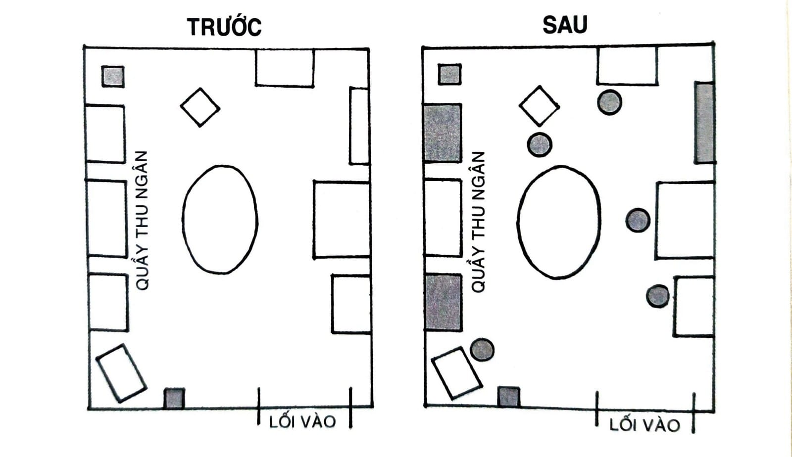

# CHƯƠNG 6: ĐỘNG LỰC ĐANG BỊ THỔI PHỒNG; MÔI TRƯỜNG CÓ Ý NGHĨA HƠN

Anne Thorndike, một bác sĩ chăm sóc sức khỏe sơ kỳ[^36] tại Bệnh viện Tổng quát Massachusetts ở Boston, có một ý tưởng điên rồ. Bà tin là mình có thể cải thiện thói quen ăn uống của hàng ngàn nhân viên bệnh viện và khách thăm bệnh mà không cần tác động lên ý chí hay động lực của họ chút xíu nào. Thực tế là bà còn không định nói tí gì về việc này.

Thorndike và đồng sự thiết kế một nghiên cứu sáu tháng nhằm thay đổi “cấu trúc lựa chọn” trong căn tin bệnh viện. Họ bắt đầu bằng việc điều chỉnh cách thức sắp xếp món uống trong phòng. Ban đầu, các tủ lạnh đặt bên cạnh quầy thu ngân trong căn tin chỉ chứa soda. Các nhà nghiên cứu thêm lựa chọn nước lọc vào trong mỗi tủ. Ngoài ra, họ còn đặt các giỏ nước đóng chai bên cạnh mỗi quầy thức ăn khắp trong phòng ăn. Soda vẫn nằm trong tủ lạnh chính, nhưng bây giờ nước lọc có mặt tại mọi điểm uống nước.

Trong ba tháng tiếp theo, doanh số soda tiêu thụ trong bệnh viện giảm 11,4%. Trong khi đó, doanh số nước đóng chai tăng 25,8%. Họ cũng thay đổi tương tự với thức ăn trong căn tin và thấy kết quả tương tự. Chẳng ai nói câu nào với người dùng bữa ở đó cả.

*Hình 8: Đây là hình minh họa thể hiện cách bố trí căn tin trước (trái) và sau (phải) khi thay đổi trong môi trường được thực hiện. Các ô màu xám thể hiện khu vực có nước đóng chai trong mỗi hình. Do lượng nước lọc trong môi trường sinh hoạt tăng lên, hành vi tự động điều chỉnh một cách tự nhiên mà không cần động lực phụ thêm.*

Người ta thường chọn các sản phẩm nào đó không phải vì nó là cái gì, mà vì nó đang ở đâu. Nếu tôi bước vào bếp và thấy một đĩa bánh quy trên quầy, tôi sẽ bốc một nắm và bắt đầu nhâm nhi, mặc dù trước đó tôi không hề nghĩ tới chúng và cũng không hẳn là đang cảm thấy đói. Nếu chiếc bàn chung trong văn phòng lúc nào cũng đầy donut và bánh vòng, thì làm sao mà cưỡng lại một hai chiếc lúc này lúc kia. Thói quen của bạn thay đổi phụ thuộc vào căn phòng bạn đang ở và các gợi ý trước mắt bạn.

Môi trường là bàn tay vô hình nhào nặn hành vi con người. Mặc dù tính cách của mỗi người chúng ta là độc nhất vô nhị, nhưng một số hành vi nhất định sẽ có xu hướng trồi lên lặp đi lặp lại trong các điều kiện môi trường nhất định. Trong nhà thờ, người ta có xu hướng nói chuyện thầm thì. Trong một con đường tối, người ta thường sẽ trở nên thận trọng và cảnh giác. Theo cách này, dạng thức thay đổi thông dụng nhất không phải từ bên trong mà là ngoại lai: Chúng ta thay đổi bởi thế giới xung quanh ta. Mỗi một thói quen đều phụ thuộc hoàn cảnh.

Năm 1936, nhà tâm lý học Kurt Lewin đã viết một đẳng thức đơn giản có thể trình bày thành một phát biểu mạnh mẽ như sau: Hành vi là hàm số của một Con người trong Môi trường của người đó, hay là B = ƒ (P,E).

Chẳng mất nhiều thời gian cho đẳng thức của Lewin được kiểm chứng trong doanh nghiệp. Vào năm 1952, nhà kinh tế học Hawkins Stern đã mô tả một hiện tượng mà ông gọi là Thôi thúc mua sắm do gợi ý (Suggestion Impulse Buying), là hiện tượng “được kích hoạt khi một người đi mua sắm lần đầu tiên nhìn thấy một sản phẩm và tượng hình nhu cầu về nó”. Nói cách khác, khách hàng thỉnh thoảng sẽ mua món gì đó không phải bởi vì họ muốn chúng mà vì cách thức chúng được bày ra trước mắt họ.

Ví dụ, các món hàng ở ngang tầm mắt có xu hướng được tiêu thụ nhiều hơn những món ở vị trí thấp hơn ở gần sàn. Vì lý do này, bạn dễ dàng nhận thấy các nhãn hàng đắt đỏ thường được trưng bày ở nơi dễ lấy trên kệ, bởi vì chúng sẽ thúc đẩy doanh số cao nhất, trong khi các món rẻ hơn thì bị nhồi nhét vào những góc khó thấy hơn. Điều tương tự xảy ra với hàng hóa chưng trên các kệ hàng đầu lối đi[^37]. Các kệ đầu hàng là những cỗ máy kiếm tiền cho nhà bán lẻ bởi vì chúng nằm ở vị trí đắc địa có lưu lượng khách hàng qua lại rất cao. Ví dụ, 45% doanh số của Coca-Cola đặc biệt đến từ các kệ hàng đầu lối đi này.

Một món hàng hay dịch vụ càng dễ dàng nhìn thấy bao nhiêu thì khả năng bạn dùng thử nó cao bấy nhiêu. Người ta uống Bud Light bởi vì nó có mặt ở mọi quán bar, và luôn đến Starbucks bởi vì nó nằm trên mọi góc đường. Con người thích nghĩ là chúng ta đang nắm quyền kiểm soát. Nếu ta chọn nước lọc thay vì soda, ta cho rằng đó là vì ta muốn thế. Thế nhưng sự thực là vô số hành động ta có mỗi ngày được định hình không phải do thôi thúc và lựa chọn có chủ đích, mà do đó là các lựa chọn dễ thấy nhất.

Mỗi một sinh thể trên trái đất này đều có cách thức cảm giác và thấu hiểu thế giới riêng của nó. Đại bàng có tầm nhìn xa đáng nể. Rắn có thể ngửi bằng cách “nếm không khí” với chiếc lưỡi vô cùng mẫn cảm của mình. Cá mập có khả năng dò thấy một lượng xung điện và rung động rất nhỏ trong nước bởi mấy con cá đang ở gần gây ra. Thậm chí vi khuẩn cũng có các thụ thể hóa học - các tế bào cảm giác vi tiểu cho phép chúng phát hiện hóa chất độc hại trong môi trường sống.

Ở loài người, năng lực tri giác do hệ thần kinh cảm giác điều khiển. Chúng ta cảm thụ thế giới thông qua thị giác, thính giác, khứu giác, xúc giác và vị giác. Ngoài ra ta còn có các cách thức cảm thụ tác nhân kích thích khác nữa. Ví dụ, bạn có thể “cảm” được khi nhiệt độ hạ xuống trước một cơn bão, hay khi đau đớn cuộn lên từ gan ruột trong một cơn đau dạ dày, hay cảm giác mất thăng bằng khi bước đi trên con đường đá lởm chởm. Thụ thể trong cơ thể bạn tiếp nhận một dải rộng các tác nhân kích thích từ bên trong, chẳng hạn như lượng muối trong máu hay nhu cầu uống nước khi khát.

Tuy vậy, khả năng mạnh nhất trong chức năng cảm giác của con người lại là thị giác. Cơ thể loài người có khoảng mười một triệu thụ thể cảm giác. Khoảng mười triệu trong số đó dành cho thị giác. Một số chuyên gia còn ước tính phân nửa nguồn lực của bộ não là dành cho hoạt động nhìn. Xét tới việc chúng ta phụ thuộc vào thị giác nhiều hơn bất kỳ một giác quan nào khác, sẽ không có gì ngạc nhiên khi biết rằng tín hiệu thị giác chính là chất xúc tác mạnh nhất cho hành vi loài người. Bởi thế mà một thay đổi nhỏ trong cách bạn nhìn có thể dẫn tới một dịch chuyển to lớn trong cái bạn làm. Kết quả là, bạn có thể tưởng tượng ra việc sống và làm việc trong một môi trường chứa đầy tín hiệu hữu hiệu và tránh đi các tín hiệu kém hiệu quả là quan trọng đến mức nào.

Phúc thay, có tin tốt trong khía cạnh này. Bạn không cần phải là nạn nhân của môi trường mình sống. Thậm chí bạn có thể là kiến trúc sư cho nó.

## CÁCH THIẾT KẾ MÔI TRƯỜNG SỐNG ĐỂ THÀNH CÔNG

Trong cuộc khủng hoảng năng lượng và cấm vận dầu mỏ vào thập niên 1970, các nhà nghiên cứu Hà Lan bắt đầu chú tâm vào mức độ sử dụng năng lượng của đất nước. Trong một vùng ngoại ô gần Amsterdam, họ phát hiện một số hộ dân sử dụng năng lượng ít hơn 30% so với các nhà lân cận - mặc dù các nhà này có kích thước tương tự, và cũng mua điện với giá tương đương.

Lý do hóa ra là các nhà trong vùng này gần như giống hệt nhau chỉ trừ một điểm: Vị trí của đồng hồ đo điện. Vài nhà đặt đồng hồ đo trong tầng hầm. Một số nhà khác thì đặt trong nhà ở ngay lối đi chính. Hẳn là bạn đoán được, những hộ đặt đồng hồ đo điện trong lối đi chính sử dụng điện ít hơn. Khi mức sử dụng năng lượng ở ngay trước mặt và dễ dàng tra cứu thì người ta thay đổi hành vi.

Mỗi một hành vi đều theo sau một tín hiệu, và chúng ta có xu hướng dễ nhận thấy các tín hiệu nổi bật. Không may là môi trường nơi ta sống và làm việc thường làm cho việc thực thi hành động nào đấy không dễ xảy ra bởi lẽ không có tín hiệu rõ ràng nào có ở đó để kích hoạt hành vi. Thật là dễ để không luyện đàn guitar khi nó bị nhét trong tủ. Thật là dễ để không đọc sách khi kệ sách nằm trong góc phòng ngủ của khách. Thật là dễ để không uống vitamin khi chúng nằm ngoài tầm nhìn trong tủ thực phẩm. Khi một tín hiệu kích hoạt một thói quen bị khuất hay quá nhỏ, chúng dễ dàng bị bỏ qua.

Bằng cách so sánh, việc tạo ra tín hiệu dễ thấy có thể lôi kéo chú ý của bạn về phía thói quen mong muốn. Đầu những năm 1990, đội ngũ vệ sinh ở Sân bay Schiphol tại Amsterdam đã dán một miếng nhãn dán có hình trông như một con ruồi vào vị trí gần chính giữa mỗi bồn tiểu. Thế là khi các quý ông bước tới bồn tiểu, họ sẽ nhắm tới cái mà họ nghĩ là con bọ. Miếng nhãn dán này đã cải thiện tầm nhắm của các quý ông và giảm thiểu đáng kể độ “tung tóe” quanh bồn tiểu. Một phân tích sâu hơn đã xác nhận miếng nhãn dán cắt giảm 8% chi phí lau dọn vệ sinh mỗi năm.

Bản thân tôi đã trải nghiệm qua sức mạnh của tín hiệu rõ ràng trong đời mình. Tôi thường mua táo ở cửa hàng, bỏ vào ngăn trữ dưới cùng trong tủ lạnh, và cuối cùng quên béng đi mất. Lúc nhớ ra thì táo đã hỏng. Tôi không nhìn thấy táo nên tôi chẳng bao giờ ăn chúng.

Sau cùng, tôi áp dụng lời khuyên của chính mình, tôi tự bố trí lại môi trường sống của mình. Tôi mua một cái tô trưng bày to, đặt nó ngay chính giữa quầy bếp. Lần sau có mua táo, tôi sẽ cho ngay vào đấy - lộ thiên ở nơi mà tôi có thể nhìn thấy. Thần kỳ vô cùng, tôi bắt đầu ăn vài quả táo mỗi ngày đơn giản chỉ vì chúng ở nơi dễ thấy hơn.

Sau đây là một số cách bạn có thể áp dụng để bày biện lại môi trường của mình và khiến các tín hiệu khởi phát thói quen mong muốn trở nên rõ ràng hơn: Nếu bạn muốn nhớ uống thuốc mỗi tối, hãy đặt lọ thuốc bên cạnh vòi nước uống. Nếu bạn muốn nhớ luyện đàn guitar thường xuyên hơn, hãy đặt cây đàn ngay chính giữa phòng khách. Nếu bạn muốn mình nhớ gửi nhiều ghi chú cảm ơn hơn, hãy chuẩn bị sẵn một bộ văn phòng phẩm trên bàn làm việc. Nếu bạn muốn uống nhiều nước hơn, hãy rót đầy bình nước vào mỗi sáng và đặt các bình nước ở những nơi thông dụng khắp nhà.

Nếu bạn muốn biến thói quen trở thành một phần cuộc sống, hãy làm cho tín hiệu trở thành một phần to lớn trong môi trường. Các hành vi bền vững nhất thường có nhiều hơn một tín hiệu kích hoạt. Bạn thử nghĩ xem có bao nhiêu cách khác nhau có thể thôi thúc một người nghiện thuốc lá châm một điếu: lái xe trên đường, nhìn thấy một người bạn hút thuốc, bị căng thẳng trong công việc, v.v...

Chiến lược tương tự có thể áp dụng cho thói quen tốt. Bằng cách gieo rắc các nút bấm kích thích trong môi trường xung quanh, bạn có thể gia tăng cơ hội nhớ đến thói quen của mình trong một ngày. Hãy đảm bảo các lựa chọn tốt nhất đều dễ thấy nhất. Thực hiện một quyết định sẽ dễ dàng và tự nhiên nếu các tín hiệu kích hoạt thói quen tốt ở ngay trước mặt bạn.

Thiết kế môi trường hữu hiệu không phải chỉ bởi nó ảnh hưởng cách ta dự phần vào thế giới mà còn vì chúng ta hiếm khi làm điều đó. Phần đông người ta sống trong một thế giới được tạo sẵn ra cho mình. Nhưng mà bạn luôn có thể cải đổi không gian nơi bạn sống và làm việc để tăng độ tiếp xúc với các tín hiệu tích cực và giảm độ phơi nhiễm với các tác nhân xấu. Thiết kế môi trường cho phép bạn lấy lại quyền kiểm soát và trở thành kiến trúc sư của đời mình. Hãy tự mình thiết kế nên thế giới cho bản thân, đừng chỉ là người tiếp nhận thụ động.

## HOÀN CẢNH CHÍNH LÀ TÍN HIỆU

Tín hiệu kích hoạt thói quen ban đầu có thể khởi phát rất cụ thể, nhưng theo thời gian thói quen của bạn sẽ bắt đầu liên kết với không chỉ một tác nhân đơn lẻ, mà với toàn bộ hoàn cảnh xung quanh hành vi ấy.

Ví dụ, nhiều người hay uống rượu trong các cuộc xã giao hơn là uống một mình. Tác nhân ở đây hiếm khi chỉ là một tín hiệu đơn lẻ, mà là toàn bộ bối cảnh lúc này: nhìn bạn bè gọi đồ uống, nghe nhạc trong quán, nhìn thấy bia trên vòi rót.

Tâm trí chúng ta gắn thói quen với địa điểm nhất định khi nó xảy ra: nhà, văn phòng, phòng gym. Mỗi nơi lại phát triển các liên kết với những thói quen và lề thói nhất định. Có các mối tương quan nhất định liên kết bạn với vật dụng trên bàn làm việc, đồ dùng trong quầy bếp, đồ đạc trong phòng ngủ.

Hành vi của ta không phải được định dạng bằng những vật thể trong môi trường mà bằng các liên kết ta có với chúng. Trên thực tế, có một cách hữu hiệu giúp ta hình dung được tầm ảnh hưởng của môi trường lên hành vi của mình. Bạn đừng nghĩ về môi trường như kiểu nó đang chứa đầy vật thể. Hãy hình dung nó đang chứa đầy các mối dây liên kết. Nghĩ về nó theo cách bạn tương tác với các khối không gian chung quanh. Với một người, ghế sofa là nơi cô ấy có thể đọc sách một giờ mỗi đêm. Với một người khác, sofa lại là nơi anh xem tivi và nhâm nhi một tô kem sau giờ làm việc. Người khác nhau sẽ có ký ức khác nhau - và do vậy mà có thói quen khác nhau - gắn với cùng một nơi chốn.

Tin tốt là? Bạn có thể huấn luyện bản thân kết nối một thói quen nào đó với một hoàn cảnh nhất định.

Trong một nghiên cứu, các nhà khoa học hướng dẫn những người mất ngủ chỉ được vào giường khi họ mệt rồi. Nếu họ không ngủ được, họ được yêu cầu ngồi trong một căn phòng khác cho đến khi cảm thấy buồn ngủ. Theo thời gian, các đối tượng nghiên cứu bắt đầu gắn bối cảnh giường ngủ với hành động đi ngủ, và khi họ leo lên giường thì rất nhanh họ sẽ cảm thấy buồn ngủ. Não của họ học được rằng ngủ là hành động duy nhất xảy ra trong căn phòng đó, chứ không phải lướt điện thoại, không phải xem tivi, hay nhìn chằm chằm vào đồng hồ.

Sức mạnh của bối cảnh còn tiết lộ một chiến lược quan trọng: Thói quen có thể dễ dàng được cải biến bởi môi trường mới. Điều này giúp bạn thoát ra khỏi các nút kích hoạt hay tín hiệu tinh vi đang đẩy bạn vào các thói quen đang có. Hãy đi đến một nơi mới - một quán cà phê mới, một băng ghế trong công viên, một góc phòng bạn ít khi dùng - và tạo lập một nếp sinh hoạt mới ở đó.

Liên kết một thói quen mới với hoàn cảnh mới sẽ dễ hơn là xây dựng thói quen mới ngay trước mặt các tín hiệu đầy cạnh tranh. Sẽ khó có thể đi ngủ sớm khi mà mỗi tối bạn đều nằm trên giường xem tivi. Sẽ khó thể nào học bài trong phòng khách mà không bị phân tâm nếu đó là nơi bạn thường chơi điện tử. Nhưng khi bạn bước ra khỏi môi trường thông lệ, bạn sẽ bỏ lại các xu hướng hành vi cũ ở đằng sau. Bạn không cần phải chống lại các tín hiệu môi trường cũ, điều này giúp cho thói quen mới hình thành mà không bị ngăn trở.

Bạn muốn suy nghĩ sáng tạo hơn? Hãy tới một căn phòng rộng hơn, hoặc lên khu vực sân thượng, hoặc một tòa nhà có kiến trúc rộng mở. Hãy tạm xa không gian cũ nơi bạn thường làm việc hằng ngày vốn đã gắn chặt với các mô thức tư duy hiện tại.

Muốn ăn uống lành mạnh hơn? Có vẻ như bạn đang trong chế độ mua sắm tự động ở siêu thị thường đi thì phải. Hãy đến một cửa hàng rau quả mới. Bạn sẽ thấy mình dễ dàng tránh được các thực phẩm kém lành mạnh khi não không còn tự động biết được nơi chúng được bày bán trong cửa hàng mới nữa.

Nếu bạn chưa thể thu xếp một môi trường mới hoàn toàn, hãy định nghĩa lại hoặc sắp xếp lại môi trường hiện tại. Tạo ra một khu vực riêng biệt cho công việc, học hành, tập thể dục, giải trí và nấu ăn. Câu thần chú tôi thấy hữu dụng là “Mỗi nơi, một công dụng”.

Khi tôi bắt đầu sự nghiệp kinh doanh, tôi thường làm việc tại nhà trên sofa hay tại bàn bếp. Tôi rất khó ngừng việc lại vào buổi tối. Chẳng có đường biên rõ ràng nào ngăn cách điểm kết thúc thời gian làm việc và điểm bắt đầu thời gian cá nhân của mình. Cái bàn ăn này là bàn làm việc hay nơi mình dùng bữa tối đây? Cái sofa này là chỗ mình nghỉ ngơi hay là nơi gửi email? Mọi thứ diễn ra trong cùng một chỗ.

Vài năm sau cuối cùng tôi cũng đã có thể chuyển tới một căn hộ mới có phòng riêng để làm văn phòng. Thế là đột nhiên, công việc trở thành một thứ chỉ diễn ra “ở trong này” và cuộc sống riêng tư thì chỉ diễn ra “ở ngoài kia”. Tự nhiên giờ đây tôi thật dễ dàng tắt đi phần công tác chuyên nghiệp trong não mình khi đã xuất hiện một đường ngăn cách rõ ràng giữa công việc và cuộc sống riêng. Mỗi căn phòng đều có mục đích sử dụng chính. Nhà bếp là dành cho nấu nướng. Văn phòng là để làm việc.

Bất cứ khi nào có thể, bạn hãy tránh trộn lẫn bối cảnh của các thói quen với nhau. Khi bắt đầu trộn hoàn cảnh, bạn sẽ bắt đầu trộn thói quen - rồi thì những thói quen dễ xảy ra sẽ chiến thắng. Đây là lý do vì sao tính linh hoạt của công nghệ hiện đại có thể vừa là thế mạnh vừa là thách thức. Bạn có thể dùng điện thoại vào đủ loại tác vụ khác nhau, biến nó thành một công cụ mạnh mẽ. Nhưng khi bạn có thể dùng điện thoại làm mọi thứ như thế, nó lại trở nên khó gắn bó với chỉ một nhiệm vụ. Bạn muốn hiệu quả, nhưng mỗi khi bật điện thoại lên, bạn cũng bị tạo điều kiện cho việc lướt mạng xã hội, kiểm tra thư, và chơi điện tử. Điện thoại trở thành một mớ tín hiệu hỗn độn.

Bạn có lẽ đang nghĩ, “Anh chẳng hiểu gì cả. Tôi sống ở New York. Phòng riêng của tôi chính là chiếc điện thoại thông minh. Tôi cần mỗi phòng phải có nhiều chức năng.” Cũng dễ hiểu. Nếu không gian của bạn hạn hẹp, hãy chia phòng mình thành các khu vực hoạt động riêng biệt: một chiếc ghế ngồi đọc sách, một cái bàn ngồi viết, một cái bàn để ăn. Bạn cũng có thể làm tương tự với không gian kỹ thuật số. Tôi biết một tác giả chỉ dùng máy tính cho việc viết lách, máy tính bảng chỉ dành để đọc các thứ, và điện thoại chỉ dành cho mạng хã hội và nhắn tin. Mỗi một thói quen cần có một căn nhà riêng.

Nếu bạn có thể thu xếp làm quen với chiến lược này, thì mỗi bối cảnh sẽ bắt đầu gắn với một thói quen nhất định và một cách thức tư duy nhất định. Thói quen phát triển tốt trong các hoàn cảnh dễ đoán như vậy. Sức tập trung sẽ tự động đến khi bạn ngồi vào bàn làm việc. Sự thư giãn đến dễ dàng hơn khi bạn ngồi vào không gian dành riêng cho nó. Giấc ngủ đến nhanh hơn khi đó là hoạt động duy nhất được xảy ra trong phòng ngủ. Nếu bạn muốn hành vi trở nên ổn định và dễ đoán, bạn cần một môi trường ổn định và dễ đoán.

Một môi trường ổn định là nơi mọi thứ có chỗ riêng của nó, theo từng mục đích cụ thể, sẽ dễ dàng tạo điều kiện cho thói quen hình thành.

## Tóm tắt chương

- Thay đổi nhỏ trong hoàn cảnh có thể dẫn đến thay đổi lớn trong hành vi theo thời gian.

- Mỗi thói quen đều theo sau một tín hiệu. Chúng ta có xu hướng dễ nhận thấy các tín hiệu nổi bật.

- Hãy làm cho các tín hiệu kích hoạt thói quen tốt trở nên rõ ràng trong môi trường của mình.

- Dần dần, thói quen của bạn sẽ bắt đầu liên kết với không chỉ một tác nhân đơn lẻ mà với toàn bộ hoàn cảnh xung quanh hành vi ấy. Hoàn cảnh trở thành tín hiệu.

- Xây dựng thói quen mới trong một môi trường mới sẽ dễ dàng hơn bởi vì bạn không cần phải chống lại các tín hiệu cũ.

---

## Chú thích

[^36]: Primary care physician: bác sĩ khám chẩn đầu tiên trước khi bệnh nhân đến gặp bác sĩ chuyên khoa. (ND)

[^37]: End caps: những kệ hàng xếp ngay đầu lối đi trong cửa hàng hay siêu thị. (ND)
