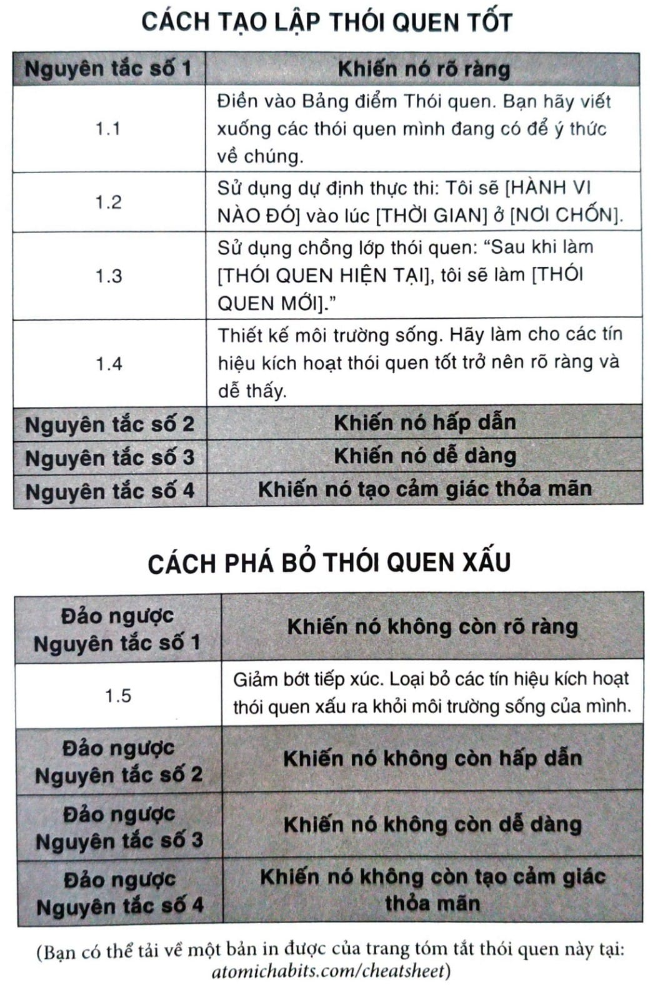

# CHƯƠNG 7: BÍ MẬT ĐẰNG SAU KHẢ NĂNG TỰ CHỦ

Năm 1971, cuộc chiến Việt Nam bước vào năm thứ mười sáu, nghị sĩ Robert Steele bang Connecticut và nghị sĩ Morgan Murphy bang Illinois đã có một phát hiện làm rúng động công chúng Mỹ. Trong thời gian ghé thăm doanh trại quân đội, họ phát hiện ra hơn 15% lính Mỹ đóng quân ở đó nghiện heroin. Nghiên cứu tiếp nối sau đó đã tiết lộ con số 35% quân nhân đang phục vụ ở Việt Nam từng thử heroin và có đến 20% đang nghiện - vấn đề còn nghiêm trọng hơn họ nghĩ lúc đầu.

Phát hiện này dẫn tới một trận náo động ở Washington, gồm có việc thành lập một đơn vị là Văn phòng Hành động Đặc biệt về Phòng chống Lạm dụng Ma túy[^38] trực tiếp dưới quyền Tổng thống Nixon, nhằm thúc đẩy công tác phòng ngừa, tái hòa nhập và theo dõi các quân nhân bị nghiện khi họ phục viên.

Lee Robins là thành viên đội nghiên cứu. Trong một báo cáo lật đổ hoàn toàn niềm tin đã phổ biến rộng rãi về hành vi nghiện, Robins phát hiện ra trong những binh lính đã từng nghiện quay trở về nhà, chỉ có 5% trong số đó tái nghiện trong vòng một năm, và chỉ 12% tái lại trong vòng ba năm. Nói cách khác, xấp xỉ chín trên mười quân nhân từng dùng heroin ở Việt Nam đã hoàn toàn dứt bỏ việc nghiện của họ gần như chỉ trong một đêm.

Phát hiện này mâu thuẫn với các quan điểm phổ biến trước đó bấy giờ, vốn xem việc nghiện heroin là tình trạng vĩnh viễn và không thể đảo ngược. Thay vào đó, Robins tuyên bố rằng nghiện có thể được hóa giải một cách tự nhiên nếu có một thay đổi triệt để trong môi trường. Tại Việt Nam, binh lính suốt ngày đều đối mặt với các tín hiệu kích hoạt hành vi dùng heroin: quá dễ tiếp cận, bị cắn nuốt bởi căng thẳng triền miên từ chiến tranh, họ lại còn làm bạn cùng với những đồng đội đã từng sử dụng ma túy, và họ cách xa quê hương hàng ngàn dặm. Nhưng ngay khi trở về Mỹ, người lính lại thấy bản thân mình ở trong môi trường hoàn toàn vắng bóng các tác nhân kích thích này. Khi hoàn cảnh thay đổi, thói quen thay đổi theo.

Hãy so sánh tình huống này với trường hợp một người nghiện ma túy điển hình. Một người bị nghiện ở nhà hoặc với bạn bè, đến một trung tâm cai nghiện để thanh lọc - vốn không có toàn bộ các tác nhân từ môi trường gây ra thói quen này - sau đó quay về nơi sinh sống cũ với toàn bộ tín hiệu trước đây đã khiến họ nghiện. Chẳng có gì ngạc nhiên khi thỉnh thoảng bạn lại thấy các số liệu cho thấy tình hình trái ngược hoàn toàn với các báo cáo nghiên cứu Việt Nam. Thông thường có 90% người nghiện heroin tái nghiện sau khi trở về nhà từ trung tâm cai nghiện.

Các nghiên cứu Việt Nam đi ngược lại nhiều niềm tin trong văn hóa của ta về thói quen xấu bởi vì nó thách thức mối liên kết thông thường gắn hành vi không lành mạnh với sự nhu nhược về đạo đức. Nếu bạn thừa cân, nghiện thuốc lá, hay nghiện ma túy, thì hẳn cả đời này bạn đã nghe đầy tai rằng đó là do bạn thiếu tự chủ - thậm chí có khi bạn là người kém cỏi. Ý tưởng rằng một chút ít kỷ luật có thể giải quyết hết mọi vấn đề đã thật sự ăn sâu vào văn hóa của ta.

Tuy nhiên, nghiên cứu gần đây đã cho thấy một điều khác. Khi các nhà khoa học phân tích những người có vẻ như có tính tự chủ ghê gớm thì họ thấy rằng các cá nhân này không khác mấy những người đang vật lộn. Thay vào đó, những người “khuôn phép” này giỏi hơn trong việc kiến thiết cuộc sống của mình sao cho nó không đòi hỏi ý chí và tính tự chủ phi thường. Nói khác đi, họ ít tiêu tốn thời gian hơn vào các tình huống có tính cám dỗ.

Những người kiểm soát bản thân tốt nhất thông thường lại là người ít phải dùng tới tính tự chủ của mình nhất. Thực hành tự kiềm chế hẳn nhiên sẽ dễ dàng khi bạn không cần phải kiềm chế quá thường xuyên. Vì thế nên, đúng vậy, lòng kiên trì, tính bền bỉ và sức mạnh ý chí là điều thiết yếu cho thành công, nhưng cách cải thiện các phẩm chất này không phải là ngồi cầu nguyện cho bản thân trở thành người có kỷ luật hơn, mà bằng cách tạo ra môi trường có khuôn phép hơn.

Suy nghĩ theo lẽ thường này sẽ dần dần có lý hơn một khi bạn hiểu được chuyện xảy ra trong bộ não khi thói quen được hình thành. Một thói quen khi đã được mã hóa vào tâm trí thì sẽ sẵn sàng bật ra mỗi khi tình huống tương ứng nảy sinh. Khi Patty Olwell, một nhà trị liệu từ Austin (Texas), bắt đầu hút thuốc, cô thường sẽ đốt một điếu vào lúc cưỡi ngựa với bạn. Sau cùng cô đã bỏ thuốc và cai được vài năm. Cô cũng ngưng cưỡi ngựa. Vài chục năm sau, cô leo lên lưng ngựa trở lại và bỗng cảm thấy cơn thèm thuốc kéo đến lần đầu tiên sau từng ấy năm. Tín hiệu đã được nhập nội hóa và vẫn còn ở đó; mặc dù cô đã ngừng tiếp xúc với tín hiệu một thời gian dài.

Một khi thói quen đã được mã hóa, sẽ kéo theo thôi thúc hành động bất kỳ lúc nào tín hiệu theo môi trường xuất hiện trở lại. Đây là một lý do vì sao các kỹ thuật thay đổi hành vi có thể phản tác dụng. Làm cho người béo phì cảm thấy xấu hổ bằng các buổi giảng giải về giảm cân có thể khiến họ căng thẳng, và kết quả là khi bị căng thẳng nhiều người sẽ quay trở lại với cách đối phó ưa thích của mình: Ăn quá độ. Chìa các bức hình phổi nám đen ra trước mắt những người hút thuốc càng làm tăng mức độ lo âu, và khiến càng nhiều người muốn châm một điếu. Nếu không cẩn thận với tín hiệu, bạn có thể sẽ kích hoạt hành vi mà mình muốn phá bỏ.

Thói quen xấu tự nó có thể tạo ra phản ứng: Quá trình này tự nuôi dưỡng chính nó. Thói quen xấu dung dưỡng các cảm xúc mà chúng muốn làm tê liệt. Bạn cảm thấy tồi tệ nên bạn ăn vặt. Bởi vì bạn ăn vặt nên bạn cảm thấy tồi tệ. Xem tivi làm bạn cảm thấy lờ đờ uể oải, thế là bạn xem tivi nhiều hơn vì không có đủ năng lượng để làm chuyện gì khác. Lo ngại về sức khỏe làm bạn lo âu, và lại khiến bạn hút thuốc nhiều hơn để giảm lo âu, và điều này làm cho sức khỏe bạn càng lúc càng kém, rất nhanh chóng bạn lại cảm thấy lo lắng hơn. Nó là một vòng xoáy đi xuống, con đường trốn chạy của thói quen xấu.

Các nhà nghiên cứu gọi hiện tượng này là “thèm muốn do tín hiệu gợi ý”[^39]: Một tác nhân kích hoạt bên ngoài gây ra cơn thèm muốn bức bách sự tái diễn thói quen xấu. Khi bạn chú ý đến cái gì đó, bạn bắt đầu muốn nó. Quá trình này xảy ra suốt - ta lại thường không để ý đến. Các nhà khoa học phát hiện thấy chỉ cần cho người nghiện xem một bức ảnh về cocaine trong 0,033 giây cũng đủ để kích thích lộ tuyến đi đến phần thưởng trong não họ và kích hoạt cơn thèm muốn. Tốc độ này quá nhanh để bộ não kịp ghi nhận về ý thức - người nghiện thậm chí còn không thể nói ra họ đã thấy cái gì - họ vẫn có thể lên cơn thèm ma túy như thường.

Câu chốt là thế này: Bạn có thể phá bỏ một thói quen, nhưng nhiều khả năng bạn sẽ không quên nó được. Một khi các rãnh thói quen đã khắc ghi vào não bạn, thì bạn gần như không thể xóa sạch nó hoàn toàn - ngay cả khi chúng đã không hoạt động một thời gian. Và điều đó có nghĩa là chỉ đơn thuần chống lại cám dỗ không phải là chiến lược hiệu quả. Thật khó mà duy trì trạng thái định tâm trong một đời sống chỉ toàn sao nhãng. Tốn quá nhiều sức lực. Trong một lúc ngắn bạn còn có thể lựa chọn chế ngự cám dỗ, chứ còn về lâu về dài, chúng ta sẽ trở thành sản phẩm của môi trường đang sống. Nói thẳng ra thì tôi chưa bao giờ gặp được ai có thể luôn luôn duy trì được thói quen tốt trong một môi trường tiêu cực.

Có một phương thức đáng tin cậy hơn, đó là đào tận gốc thói quen xấu. Một trong những cách thực tế hơn để phá bỏ thói quen xấu là giảm bớt tiếp xúc với tín hiệu gây ra nó. Nếu bạn dường như chẳng bao giờ hoàn thành được việc gì, hãy bỏ điện thoại qua phòng khác trong vài giờ. Nếu bạn liên tục cảm thấy mình không đầy đủ, hãy từ bỏ theo dõi các tài khoản mạng xã hội kích thích lòng ghen tị hay đố kỵ của bản thân. Nếu bạn tốn quá nhiều thời gian xem tivi, hãy chuyển tivi ra khỏi phòng ngủ. Nếu bạn tốn quá nhiều tiền vào đồ điện tử, hãy ngưng đọc các đánh giá sản phẩm công nghệ tiên tiến. Nếu bạn chơi điện tử quá nhiều, hãy ngắt điện tay cầm điều khiển và cất vào tủ sau mỗi lần chơi.

Phương pháp này là đảo ngược của Nguyên tắc số 1 trong Thay đổi Hành vi. Thay vì khiến nó rõ ràng, bạn có thể làm cho nó không còn rõ ràng. Tôi thường rất kinh ngạc về tính hiệu quả các thay đổi nhỏ này mang lại. Loại bỏ một tín hiệu nhỏ thôi và toàn bộ thói quen thường sẽ biến mất.

Tự kiềm chế chỉ là một chiến lược ngắn hạn, không thể dùng lâu dài. Bạn có thể kháng cự cám dỗ một hai lần, nhưng bạn khó có khả năng lúc nào cũng có thể tập trung sức mạnh ý chí vào việc đè bẹp cơn thèm muốn của mình. Thay vì cứ phải huy động một liều ý chí mới vào mỗi lần mình muốn làm chuyện đúng đắn, năng lượng của ta nên dồn vào việc tối ưu hóa môi trường sẽ tốt hơn. Đây chính là bí mật đằng sau khả năng tự chủ. Hãy làm cho tín hiệu kích hoạt thói quen tốt trở nên rõ ràng trước mắt, và biến các tín hiệu kích hoạt thói quen xấu trở nên vô hình.

## Tóm tắt chương

- Nghịch đảo của Nguyên tắc số 1 trong Thay đổi Hành vi là khiến nó trở nên không còn rõ ràng.

- Một khi thói quen đã hình thành, khả năng nó bị lãng quên rất thấp.

- Những người có tính tự chủ cao có xu hướng tiêu tốn ít thời gian hơn vào các tình huống có tính cám dỗ. Tránh đi cám dỗ thì dễ hơn là chống lại nó.

- Một trong những cách thực tế hơn để phá bỏ thói quen xấu là giảm bớt tiếp xúc với tín hiệu gây ra nó.

- Tự kiềm chế chỉ là một chiến lược ngắn hạn, không thể dùng lâu dài.

---

## Chú thích

[^38]: Special Action Office of Drug Abuse Prevention.

[^39]: Cue-induced wanting.
