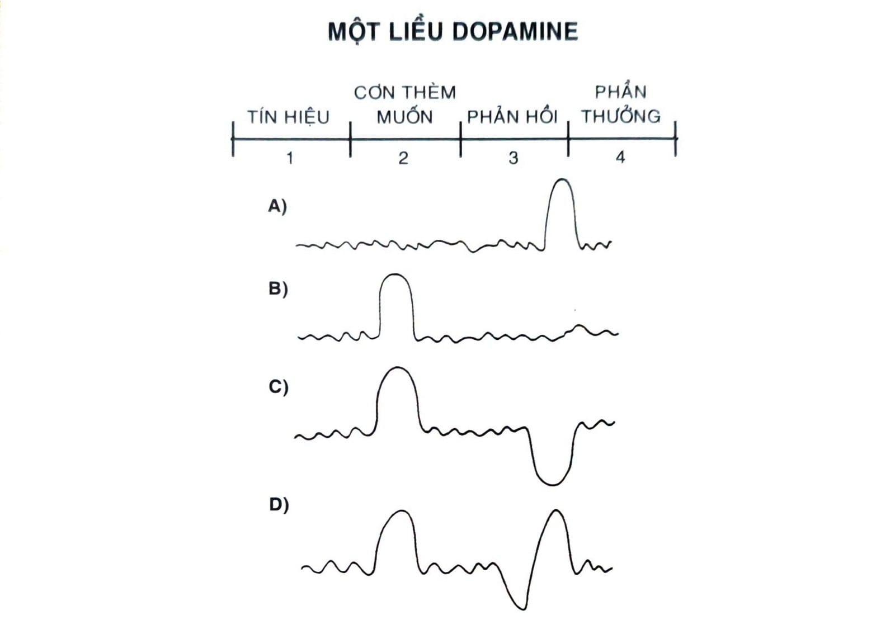

# NGUYÊN TẮC SỐ 2: KHIẾN NÓ HẤP DẪN

---

# CHƯƠNG 8: BIẾN MỘT THÓI QUEN TRỞ NÊN KHÓ CƯỠNG

Vào thập niên 1940, một nhà khoa học Hà Lan tên Niko Tinbergen đã thực hiện một chuỗi thực nghiệm làm thay đổi hiểu biết của ta về động lực hành động. Tinbergen - người sau này được trao giải Nobel cho công trình của mình - nghiên cứu loài mòng biển cá trích (herring gull), một loài chim biển màu trắng và xám thường bắt gặp dọc bờ biển Bắc Mỹ.

Mòng biển cá trích trưởng thành có một đốm đỏ nhỏ trên mỏ cứng, và Tinbergen để ý thấy những con chim non mới nở thường mổ vào điểm này khi chúng muốn được ăn. Bắt đầu thí nghiệm, ông làm một bộ mỏ chim giả bằng giấy bìa cứng, chỉ có cái đầu không có thân. Khi chim bố mẹ bay đi, ông sẽ tiếp cận cái tổ và đưa mấy cái mỏ giả này cho chim non. Chiếc mỏ là giả cho nên ông giả thiết rằng chim non sẽ từ chối toàn bộ.

Tuy nhiên, khi con mòng biển non thấy điểm đỏ trên mỏ bìa giả, chúng mổ vào đó như thể điểm này gắn với chim mẹ. Rõ ràng chúng đặc biệt chú ý đến những điểm đỏ này - giống như việc này đã được lập trình bẩm sinh sẵn trong gien. Không lâu sau Tinbergen phát hiện ra điểm màu đỏ càng lớn thì chim non mổ càng nhanh. Cuối cùng ông làm một cái mỏ giả với ba điểm đỏ lớn. Khi ông đặt vào tổ thì lũ chim con vui sướng điên cuồng. Chúng mổ vào mấy đốm đỏ như thể đó là cái mỏ tuyệt vời nhất trên đời mà chúng từng thấy.

Tinbergen và đồng sự phát hiện thấy hành vi tương tự cũng xảy ra ở các loài khác. Ví dụ, ngỗng xám (greylag goose) là một loài chim làm tổ trên mặt đất. Thông thường khi con mẹ đi xung quanh cái tổ, trứng ngỗng sẽ lăn ra ngoài và yên vị trên cỏ gần bên cạnh. Khi chuyện này xảy ra, ngỗng mẹ sẽ lạch bạch chạy lại, dùng mỏ và cổ lăn quả trứng vào trong tổ trở lại.

Tinbergen phát hiện con ngỗng mẹ sẽ kéo bất kỳ vật thể tròn tròn nào xung quanh vào tổ, tỉ như trái banh bi-da hay cái bóng đèn. Vật thể càng lớn, phản ứng của chúng càng mãnh liệt. Có một con ngỗng còn phi thường nỗ lực kéo một quả bóng chuyền vào tổ và ngồi lên trên. Như mấy con mòng biển non tự động mổ vào các điểm đỏ, ngỗng xám cũng có một quy tắc bản năng: Bất kể khi nào mình thấy một vật thể tròn tròn ở gần bên, mình phải lăn lại vào tổ. Vật thể càng to, mình càng phải nỗ lực.

Dường như bộ não của mỗi loài vật đều được tải sẵn một vài quy tắc hành vi nhất định, và khi bắt gặp một phiên bản phóng to của quy tắc đó, chúng sáng bừng lên như cây thông Giáng sinh. Các nhà khoa học gọi các tín hiệu phóng đại này là tác nhân bất thường. Tác nhân bất thường là một phiên bản cường điệu của hiện thực - giống như cái mỏ giả với ba điểm đỏ hay quả trứng có kích cỡ bằng quả bóng chuyền - và nó gợi lên phản ứng mạnh hơn bình thường.

Loài người cũng có xu hướng bị hút về các phiên bản hiện thực cường điệu. Ví dụ như thức ăn vặt có thể đẩy hệ thần kinh phụ trách phần thưởng trong não ta vào cơn điên cuồng. Sau hàng trăm ngàn năm săn bắt hái lượm thực phẩm trong hoang dã, bộ não người đã tiến hóa đến mức độ vô cùng coi trọng muối, đường và chất béo. Các thực phẩm như vậy có hàm lượng ca-lo đậm đặc và rất hiếm có trong thời tổ tiên cổ đại của ta lang thang qua các thảo nguyên hoang vu. Khi bạn không biết chắc được bữa ăn tiếp theo từ đâu ra thì ăn càng nhiều càng tốt chính là chiến lược sống còn khôn ngoan.

Tuy vậy, ngày nay chúng ta đang sống trong một môi trường quá giàu ca-lo. Thực phẩm thừa mứa khắp nơi, vậy mà não ta vẫn tiếp tục thèm muốn thức ăn như thể nó rất quý hiếm. Coi trọng muối đường và chất béo không còn có lợi cho sức khỏe của ta nữa, nhưng cơn thèm muốn vẫn còn dai dẳng bởi trung tâm phần thưởng trong não người đã không thay đổi chút nào trong tầm năm mươi ngàn năm qua. Ngành công nghiệp thực phẩm hiện đại đang sống nhờ việc lợi dụng các bản năng thời đồ đá của chúng ta vào những thứ nằm ngoài mục đích tiến hóa.

Mục tiêu chính của ngành khoa học thực phẩm là tạo ra các sản phẩm ngày càng hấp dẫn với khách hàng. Gần như mọi loại thực phẩm đóng trong túi, hộp, hay chai lọ từ đó đến nay đều được cải tiến theo cách nào đấy, ấy là nếu tính cả hương liệu phụ gia. Các công ty bỏ ra hàng triệu đô-la vào việc tìm ra độ giòn gây thỏa mãn nhất cho món bánh khoai tây giòn tan, hay là lượng sủi bọt hoàn hảo nhất cho soda. Toàn bộ sức lực của tất cả phòng ban đều đổ vào công cuộc tối đa hóa cảm giác của một sản phẩm trong miệng người dùng - một đặc tính sản phẩm gọi là cảm giác nếm trong miệng (orosensation). Lấy ví dụ, món khoai tây chiên là một sự kết hợp của bộ đôi đầy uy lực - vẻ ngoài vàng ruộm giòn tan đi kèm với bên trong mềm mại nhẹ bẫng.

Các thực phẩm chế biến sẵn khác còn cải thiện độ tương phản động lực (dynamic contrast), những sản phẩm có sự kết hợp của các cảm giác khác nhau, như độ giòn và độ béo ngậy. Hãy tưởng tượng độ dính của phô mai tan chảy trên bề mặt đế pizza giòn rụm, hay độ giòn của một chiếc bánh Oreo kết hợp cùng sự mềm mại của nhân kem bên trong. Với thực phẩm tự nhiên chưa qua chế biến, bạn sẽ có khuynh hướng trải nghiệm cùng một cảm giác giống nhau như mọi lần - miếng cải xoăn thứ mười bảy kia tạo cảm giác thế nào? Sau vài phút, não bạn bắt đầu chán và bạn bắt đầu thấy no. Nhưng thực phẩm có độ tương phản động lực cao thì khiến cho trải nghiệm ăn lúc nào cũng mới lạ và thú vị, do vậy khích lệ chúng ta ăn nhiều hơn.

Sau cùng thì, các chiến lược như vậy cho phép các nhà khoa học thực phẩm tìm ra “điểm sung sướng” cho mỗi sản phẩm - sự kết hợp chuẩn xác của muối, đường và chất béo kích thích bộ não và giữ cho bạn quay trở lại với sản phẩm nhiều hơn. Hẳn nhiên kết quả là bạn ăn uống quá độ bởi các thức ăn siêu cấp ngon miệng kia quá hấp dẫn, não người khó mà cưỡng lại được. Như Stephan Guyenet, một nhà khoa học thần kinh chuyên nghiên cứu về hành vi ăn uống và béo phì đã phát biểu, “Nói về kích thích ham muốn bản thân thì chúng ta quá rành.”

Ngành công nghiệp thực phẩm hiện đại sinh ra các thói quen ăn uống quá độ, là một ví dụ của Nguyên tắc số 2 trong Thay đổi Hành vi: Khiến nó hấp dẫn. Cơ hội càng hấp dẫn bao nhiêu thì khả năng hình thành thói quen cao bấy nhiêu.

Hãy nhìn xung quanh xem. Xã hội có đầy các phiên bản hiện thực được cơ khí hóa trông hấp dẫn hơn nhiều so với thế giới mà tổ tiên ta từng sống và tiến hóa. Cửa hàng trưng bày các cô ma-nơ-canh khoe eo hông và bộ ngực cường điệu để bán quần áo. Mạng xã hội cung cấp nhiều cái “like” và tung hô chỉ trong vài phút, nhiều và nhanh hơn ta từng nhận được trong văn phòng hay ở nhà. Phim khiêu dâm trên mạng ghép nối các cảnh kích thích lại với tần suất gần như không thể mô phỏng trong đời thực. Quảng cáo được tạo ra với một sự kết hợp hoàn hảo của ánh sáng, trang điểm chuyên nghiệp, và chỉnh sửa hậu kỳ - thậm chí cả người mẫu trông chẳng còn giống chút nào với cái người trong hình ảnh sau cùng. Đây chính là các tác nhân bất thường của thế giới hiện đại. Chúng phóng đại các đặc tính vốn có tính hấp dẫn tự nhiên với chúng ta, và kết quả là bản năng của ta phát cuồng theo, đẩy ta vào các thói quen mua sắm, lướt mạng xã hội, xem phim khiêu dâm, ăn uống vô độ, và nhiều thứ khác nữa.

Nếu xem lịch sử là cẩm nang hướng dẫn, thì các cơ hội trong tương lai sẽ còn hấp dẫn hơn bây giờ nữa. Xu hướng là phần thưởng sẽ trở nên cô đặc hơn và tác nhân kích thích sẽ lôi cuốn hơn. Thức ăn vặt là một hình thức giàu ca-lo hơn thực phẩm tự nhiên. Rượu mạnh là một phiên bản có độ cồn đậm đặc hơn so với bia. Trò chơi điện tử là hình thức đậm tính giải trí hơn các loại trò chơi thẻ bài. Khi đem so với tự nhiên, rõ ràng các trải nghiệm nén đầy khoái lạc này rất khó cưỡng lại. Chúng ta thừa hưởng bộ não từ tổ tiên mình nhưng phải đương đầu với các cám dỗ mà họ không phải đối mặt.

Nếu bạn muốn tăng cơ hội xảy ra một hành vi, bạn cần phải khiến cho nó hấp dẫn hơn. Thông qua thảo luận về Nguyên tắc số 2, mục tiêu của ta là học cách biến các thói quen trở nên khó cưỡng. Nếu không thể chuyển hóa từng thói quen thành tác nhân bất thường thì ta có thể khiến chúng trở nên lôi cuốn hơn. Để làm được vậy, chúng ta phải bắt tay vào tìm hiểu cơn thèm muốn là gì và cách thức nó hoạt động trước.

Để bắt đầu, hãy xem xét một dấu ấn sinh học mà tất cả các thói quen đều có - một liều dopamine.

## VÒNG LẶP PHẢN HỒI THÚC ĐẨY BỞI DOPAMINE

Các nhà khoa học có thể lần ra dấu vết của khoảnh khắc chính xác một cơn thèm muốn xảy ra bằng cách đo nồng độ một hóa chất dẫn truyền thần kinh tên là dopamine[^40]. Tầm quan trọng của dopamine trở nên rõ hơn bao giờ hết vào năm 1954 khi nhà khoa học thần kinh James Olds và Peter Milner thực hiện một thí nghiệm tiết lộ quá trình thần kinh đằng sau cơn thèm muốn và dục vọng. Bằng cách cấy các điện cực vào não của chuột, các nhà nghiên cứu chặn lại sự tiết ra dopamine. Trước sự kinh ngạc của các khoa học gia, mấy con chuột mất hết ý chí sinh tồn. Chúng không ăn. Chúng không giao phối. Chúng không thèm muốn bất kỳ điều gì nữa. Chỉ trong vài ngày, các con vật chết vì khát.

Trong các nghiên cứu theo sau đó, các nhà khoa học khác cũng ức chế khu vực tiết ra dopamine trong bộ não, nhưng lần này họ nhỏ một vài giọt đường vào miệng những con chuột bị tước đoạt dopamine. Mấy con chuột nhỏ sáng bừng với vẻ đầy thỏa mãn từ dòng chất lỏng ngon lành. Ngay cả khi dopamine đã bị chặn, chúng vẫn thích đường nhiều như trước đây; chúng chỉ không còn muốn nó nữa. Khả năng trải nghiệm khoái lạc vẫn còn, nhưng nếu không có dopamine thì cơn thèm muốn cũng chết. Và khi không còn thèm muốn, hành động cũng dừng.

Khi các nhà nghiên cứu khác đảo ngược quá trình và làm tràn ngập trung tâm phần thưởng của não bằng dopamine, các con vật thực hiện thói quen với tốc độ chóng mặt. Trong một nghiên cứu, con chuột sẽ nhận một liều mạnh dopamine mỗi lần chúng chọt mũi vào một cái hộp. Trong vài phút, lũ chuột bắt đầu hình thành một cơn thèm muốn mạnh tới mức chúng bắt đầu chọt mũi vào cái hộp tám trăm lần một giờ. (Con người cũng không khác mấy: Một người chơi xổ số trung bình gạt vòng quay sáu trăm lần mỗi giờ.)

Thói quen là một vòng lặp phản hồi thúc đẩy bởi dopamine. Mỗi một hành vi có khả năng cao sẽ trở thành thói quen - như dùng ma túy, ăn vặt, chơi điện tử, lướt mạng xã hội - gắn với nồng độ dopamine khá cao. Điều tương tự cũng có thể phát biểu cho các hành vi theo thói quen căn bản của ta như ăn, uống nước, làm tình, và tương tác xã hội.

Trong nhiều năm liền, các nhà khoa học cho rằng dopamine chỉ là câu chuyện về khoái lạc, nhưng giờ chúng ta đã biết nó còn đóng vai trò trung tâm trong nhiều quá trình thần kinh, bao gồm động lực, học tập và ghi nhớ, trừng phạt và ác cảm, cũng như vận động tự giác.

Khi nói đến thói quen, điểm quan trọng cần nhớ là: Dopamine được tiết ra không chỉ khi bạn đang kinh qua khoái lạc, mà còn khi bạn dự cảm được khoái lạc. Những tay nghiện cờ bạc có một liều dopamine ngay trước khi họ đặt cược, không phải sau khi đã thắng. Với người nghiện cocaine thì dopamine cuộn lên khi họ nhìn thấy thứ bột đó, không phải sau khi đã hít. Bất kỳ khi nào bạn đoán trước một cơ hội nhận phần thưởng, nồng độ dopamine tăng lên trong dự cảm. Và bất kỳ khi nào dopamine dâng lên, động lực hành động cũng tăng theo.

Chính sự dự cảm phần thưởng - chứ không phải sự hoàn thành - đã thôi thúc ta hành động.

Thú vị là, trung tâm phần thưởng khởi phát trong não khi bạn nhận một phần thưởng cũng chính là hệ thống được kích hoạt khi bạn dự cảm một phần thưởng. Đây là một lý do vì sao sự dự cảm một trải nghiệm thường có thể tạo cảm giác tuyệt hơn là sự đạt thành. Khi ta còn bé, cảm giác mong nghĩ về buổi sáng Giáng sinh có khi còn tuyệt vời hơn là khi mở quà. Khi ta lớn rồi thì mơ mộng ban ngày về một kỳ nghỉ sắp tới có thể khoan khoái hơn cả khi ta thực sự ở trong kỳ nghỉ. Các nhà khoa học gọi đây là khác biệt giữa “muốn có” và “ưa thích”.

Não của bạn có nhiều mạch thần kinh phân bố cho thèm muốn phần thưởng hơn là ưa thích chúng. Trung tâm thèm muốn trong não khá rộng: bao gồm cuống não, vùng nucleus accumbens, vùng ventral tegmental, vùng dorsal striatum, hạch hạnh nhân, và một phần của vỏ não trán trước. Khi so sánh tương quan ta sẽ thấy vùng phụ trách ưa thích trong não nhỏ hơn nhiều. Chúng thường được gọi là “điểm nóng khoái lạc”, phân bổ rải rác như những hòn đảo tí hon khắp não. Ví dụ, các nhà nghiên cứu đã phát hiện thấy 100% vùng nucleus accumbens được kích hoạt khi cơn thèm muốn xảy ra. Trong khi đó, chỉ có 10% cấu trúc được kích hoạt khi cơn ưa thích xảy ra.

*Hình 9: Trước khi một thói quen được học (A), dopamine tiết ra khi phần thưởng được trải nghiệm lần đầu tiên. Lần tiếp theo (B), dopamine tăng lên trước khi hành động xảy ra, ngay sau khi tín hiệu kích hoạt hành động được nhận biết. Liều dopamine này dẫn đến cảm giác thèm muốn và thôi thúc hành động bất kỳ khi nào tín hiệu lộ diện. Khi thói quen đã được học, dopamine sẽ không dâng lên khi trải nghiệm phần thưởng nữa vì bạn đã biết chắc phần thưởng rồi. Tuy vậy, nếu bạn thấy tín hiệu và mong chờ phần thưởng, nhưng nếu không nhận được thì liều dopamine này sẽ sụt xuống trong thất vọng (C). Độ nhạy của phản ứng dopamine có thể thấy rõ khi một phần thưởng xuất hiện trễ (D). Đầu tiên, tín hiệu được định vị và dopamine tăng lên khi cơn thèm hình thành. Tiếp theo, một phản hồi xảy ra nhưng phần thưởng không đến nhanh như mong đợi và dopamine bắt đầu sụt xuống. Cuối cùng, khi phần thưởng đến hơi trễ hơn mong đợi của bạn, dopamine lại dâng lên. Như thể bộ não đang muốn nói: “Đó thấy chưa, mình biết mình đúng mà. Đừng quên lặp lại hành động này lần tới.”*

Thực tế bộ não phân bố một lượng không gian quý giá khá lớn cho các vùng phụ trách cơn thèm muốn và khao khát, cho thấy các bằng chứng về vai trò cốt yếu của các quá trình này. Thèm muốn là động cơ thúc đẩy hành động. Mỗi một hành động được thi hành là vì sự dự cảm xảy ra trước đó. Chính cơn thèm muốn đã dẫn tới phản ứng.

Các hiểu biết này tiết lộ tầm quan trọng của Nguyên tắc số 2 trong Thay đổi Hành vi. Chúng ta cần làm cho thói quen của mình trở nên hấp dẫn bởi vì chính sự mong đợi một trải nghiệm mang tính tưởng thưởng đã tạo động lực cho ta hành động vào lúc ban đầu. Đây chính là lúc một chiến lược gọi là bao bọc cám dỗ lên sân khấu.

## SỬ DỤNG BAO BỌC CÁM DỖ ĐỂ LÀM CHO THÓI QUEN TRỞ NÊN HẤP DẪN

Ronan Byrne, một sinh viên cơ khí điện tử ở Dublin (Ireland), thích xem Netflix, nhưng anh cũng biết là mình cần phải vận động nhiều hơn. Lợi dụng kỹ năng cơ khí, Byrne cải biến chiếc xe đạp tập thể dục của mình, kết nối nó với máy laptop và tivi. Sau đó anh viết một phần mềm cho phép Netflix khởi động chỉ khi anh đạp xe đến một vận tốc nhất định. Nếu anh giảm tốc quá lâu, bất kỳ chương trình nào anh đang xem cũng sẽ dừng lại cho đến khi anh bắt đầu đạp trở lại. Theo lời một người hâm mộ, Byrne “đã tiêu diệt béo phì mà cơn ghiền Netflix đã tạo ra.”

Anh cũng áp dụng chiến lược bao bọc cám dỗ để làm cho thói quen tập thể dục của mình hấp dẫn hơn. Bao bọc cám dỗ hoạt động theo cách kết nối hành động bạn muốn với một hành động bạn cần phải làm. Trong trường hợp của Byrne, anh bao bọc việc xem Netflix (điều anh muốn làm) bằng việc đạp xe thể dục (điều anh cần phải làm).

Các doanh nghiệp là bậc thầy sử dụng bao bọc cám dỗ. Ví dụ, khi Công ty Truyền hình Mỹ, thường được gọi là ABC[^41], phát sóng đội hình chương trình truyền hình mỗi tối thứ Năm trong mùa 2014 - 2015, họ đã đẩy chiến lược bao bọc cám dỗ lên quy mô khủng.

Mỗi thứ Năm, ABC sẽ phát sóng ba chương trình do biên kịch Shonda Rhimes viết kịch bản - Grey’s Anatomy, Scandal, và How to Get Away with Murder. Họ đặt cho series này thương hiệu “TGIT on ABC” (TGIT là viết tắt của Thank God Its Thursday - Ơn Trời Thứ Năm Rồi). Nhằm quảng bá cho chương trình, ABC khuyến khích người xem chuẩn bị sẵn bắp rang bơ, uống rượu vang và tận hưởng buổi tối.

Andrew Kubitz, trưởng ban kế hoạch chương trình của ABC, mô tả ý tưởng đằng sau chiến dịch: “Chúng tôi nhận thấy tối thứ Năm là một cơ hội lớn với tỷ suất người xem, cả với các cặp đôi lẫn phụ nữ độc thân, những người muốn ngồi xuống sofa, thoát khỏi đời sống thường nhật, uống rượu ăn bắp rang và thả lỏng một tí.” Cái hay trong chiến lược này là ABC đã gắn điều họ cần người xem thực hiện (xem chương trình của họ) với các hoạt động mà người xem vốn đã muốn làm (thư giãn, uống chút rượu, và ăn bắp rang).

Dần dần, người ta bắt đầu kết nối việc xem chương trình của ABC với cảm giác thư thái và giải trí. Nếu bạn uống rượu vang và ăn bắp rang vào 8 giờ mỗi tối thứ Năm, thì cuối cùng “8 giờ mỗi tối thứ Năm” sẽ có nghĩa là giải trí và thư giãn. Phần thưởng được gắn kết với tín hiệu, và thói quen bật tivi trở nên quá sức hấp dẫn.

Nhiều khả năng bạn sẽ thấy một hành vi hấp dẫn khi bạn phải làm điều gì đó mình ưa thích vào cùng lúc ấy. Bạn muốn nghe tin tức mới nhất về người nổi tiếng, nhưng bạn cần phải tập thể dục. Sử dụng chiến thuật bao bọc cám dỗ, bạn chỉ được đọc tin trên máy tính bảng và xem chương trình thực tế ở phòng tập. Có thể bạn muốn chăm sóc móng, nhưng bạn cần phải dọn dẹp hộp thư đến của email. Giải pháp: Chỉ đi chăm sóc móng khi xử lý hết các email công việc còn tồn đọng.

Bao bọc cám dỗ là một cách ứng dụng một lý thuyết tâm lý có tên Nguyên lý Premack. Được đặt tên theo công trình của giáo sư David Premack, nguyên lý được phát biểu như sau: “Hành vi có khả năng xảy ra cao hơn sẽ củng cố hành vi có khả năng xảy ra thấp hơn.” Nói cách khác, ngay cả khi bạn không thật sự muốn giải quyết hết mớ email tồn đọng, bạn sẽ vẫn được điều kiện hóa để thực hiện việc này bởi vì nó đồng nghĩa với việc bạn sẽ được làm điều bạn muốn cùng lúc ấy.

Bạn thậm chí còn có thể kết hợp bao bọc cám dỗ với chiến lược chồng lớp thói quen ta đã thảo luận trong Chương 5, để tạo ra một bộ quy tắc dẫn hướng hành vi cho mình. Công thức chồng lớp thói quen kết hợp bao bọc cám dỗ như sau: 1. Sau khi làm [THÓI QUEN HIỆN TẠI], tôi sẽ làm [THÓI QUEN MỚI]. 2. Sau [THÓI QUEN TÔI CẦN], tôi sẽ thực hiện [THÓI QUEN TÔI MUỐN].

Nếu bạn muốn đọc tin tức, nhưng bạn cần phải biểu lộ lòng biết ơn: 1. Sau khi uống tách cà phê sáng, tôi sẽ nói một lời cảm ơn về những điều đã xảy ra ngày hôm qua (cần). 2. Sau khi tôi biểu lộ lòng biết ơn, tôi sẽ đọc tin tức (muốn).

Nếu bạn muốn xem thể thao, nhưng bạn cần phải gọi điện bán hàng: 1. Khi trở lại sau giờ nghỉ ăn trưa, tôi sẽ gọi ba cuộc cho khách hàng tiềm năng (cần). 2. Khi gọi xong ba cuộc bán hàng tiềm năng, tôi sẽ xem ESPN (muốn).

Nếu bạn muốn lướt Facebook, nhưng bạn cần tập thể dục nhiều hơn: 1. Sau khi rút điện thoại ra, tôi sẽ thực hiện mười hiệp burpee[^42] (cần). 2. Sau khi làm mười hiệp burpee, tôi sẽ lướt Facebook (muốn).

Hy vọng nằm ở chỗ cuối cùng bạn sẽ mong chờ được gọi điện cho ba khách hàng tiềm năng hoặc được làm mười burpee bởi vì điều đó nghĩa là bạn sẽ được đọc tin tức thể thao mới nhất hay lướt Facebook. Làm điều mình cần làm đồng nghĩa với được làm điều mình muốn.

Chúng ta đã bắt đầu chương này bằng cách thảo luận các tác nhân bất thường, hay các phiên bản phóng đại của hiện thực làm gia tăng khao khát hành động của ta. Bao bọc cám dỗ là một cách tạo ra phiên bản phóng đại của bất kỳ thói quen nào bằng cách kết nối nó với một điều bạn rất muốn làm. Sắp đặt nên một thói quen khó cưỡng lại là một việc khó, nhưng chiến lược đơn giản này có thể được áp dụng để khiến cho gần như mọi thói quen đều trở nên hấp dẫn hơn theo một cách khác.

## Tóm tắt chương

- Nguyên tắc số 2 trong Thay đổi Hành vi là khiến nó hấp dẫn.

- Cơ hội càng hấp dẫn bao nhiêu thì khả năng hình thành thói quen cao bấy nhiêu.

- Thói quen là một vòng lặp phản hồi thúc đẩy bởi dopamine. Khi dopamine tăng, động lực hành động của ta tăng theo.

- Chính sự dự cảm phần thưởng - chứ không phải sự hoàn thành - đã thôi thúc ta hành động. Dự cảm càng lớn, liều dopamine càng cao.

- Bao bọc cám dỗ là một cách làm cho thói quen của bạn trở nên hấp dẫn hơn. Chiến lược này sẽ kết đôi một hành động bạn muốn thực hiện với một hành động bạn cần phải làm.

---

## Chú thích

[^40]: Dopamine không phải là hóa chất duy nhất ảnh hưởng đến thói quen. Mỗi một thói quen đều có liên quan đến nhiều vùng não và hóa chất thần kinh khác nhau. Người nào cho rằng “thói quen chỉ là câu chuyện về dopamine” đang bỏ qua nhiều phần trọng yếu của quá trình. Dopamine chỉ là một trong những cầu thủ quan trọng của cuộc chơi hình thành thói quen. Tuy vậy, tôi sẽ chỉ nói riêng về chu trình dopamine trong chương này, bởi vì nó mở ra cửa ngõ dẫn tới nền tảng sinh học của dục vọng, cơn thèm muốn và động lực đằng sau mọi thói quen. (TG)

[^41]: American Broadcasting Company.

[^42]: Burpee là bài tập thể dục vận động toàn thân gồm các bước: đứng thẳng - ngôi xổm - hít đất - ngồi xổm dậy - nhảy bật người. Bài tập được đặt theo tên người đã sáng tạo nên - nhà sinh lý học người Mỹ Royal H. Burpee. (ND)
