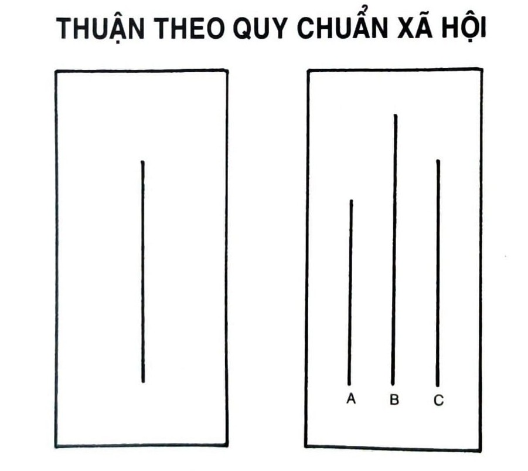

# CHƯƠNG 9: VAI TRÒ CỦA GIA ĐÌNH VÀ BẠN BÈ TRONG VIỆC ĐỊNH HÌNH THÓI QUEN

Vào năm 1965, một người đàn ông Hungary tên Laszlo Polgar đã viết một loạt các bức thư lạ lùng đến một người phụ nữ tên Klara.

Laszlo là một người tin tưởng vững chắc vào sự làm việc chăm chỉ. Thực tế đây chính là toàn bộ niềm tin của anh trong đời: Anh hoàn toàn phủ nhận quan niệm về tài năng bẩm sinh. Anh tuyên bố rằng, với rèn luyện có chủ đích và phát triển các thói quen tốt, một đứa trẻ có thể trở thành thiên tài trong bất kỳ lĩnh vực nào. Tâm niệm của anh là “thiên tài không phải do sinh ra, mà do giáo dục và rèn luyện”.

Laszlo tin vào ý niệm này mạnh mẽ đến mức anh muốn thử nghiệm nó với những đứa con của mình - và anh viết cho Klara bởi vì anh “cần một người vợ sẵn lòng cùng lên thuyền với mình”. Klara là một giáo viên, và mặc dù cô không cứng rắn như Laszlo, cô cũng tin rằng nếu có hướng dẫn thích hợp, bất kỳ ai cũng có thể phát triển kỹ năng của mình.

Laszlo quyết định rằng cờ vua sẽ là lĩnh vực thử nghiệm phù hợp, và anh phác ra một kế hoạch nuôi dạy con mình trở thành thần đồng cờ vua. Những đứa trẻ sẽ được nuôi dạy tại nhà, một điều rất hiếm lạ ở Hungary thời bấy giờ. Ngôi nhà sẽ chứa đầy sách cờ và hình ảnh các kỳ thủ cờ vua nổi tiếng. Những đứa trẻ sẽ chơi cờ với nhau liên tục và so tài trong các giải đấu tốt nhất họ có thể tìm ra. Gia đình lưu giữ một hệ thống ghi chép kỹ lưỡng về lịch sử thi đấu với mọi đấu thủ của từng đứa con. Cuộc sống của họ toàn bộ dành cho cờ vua.

Laszlo đã thành công rước được Klara về nhà, và trong vài năm, cặp đôi Polgar trở thành bố mẹ của ba cô con gái: Susan, Sofia, và Judit.

Susan - cô con gái lớn nhất, bốn tuổi bắt đầu chơi cờ. Chỉ trong sáu tháng, cô bé đã có thể đấu thắng người lớn.

Sofia - cô con gái giữa, còn thể hiện tốt hơn. Mười bốn tuổi đã vô địch thế giới, và trở thành kiện tướng cờ vua chỉ vài năm sau.

Judit - cô con gái út, xuất sắc hơn cả. Vào tuổi lên năm đã có thể đánh thắng bố mình. Mười hai tuổi, là kỳ thủ trẻ nhất nằm trong danh sách một trăm kỳ thủ cờ vua hàng đầu thế giới. Mười lăm tuổi bốn tháng, trở thành đại kiện tướng trẻ nhất mọi thời đại - trẻ hơn cả Bobby Fischer, người nắm giữ kỷ lục trước đó. Trong suốt hai mươi bảy năm, cô luôn là nữ kỳ thủ mạnh nhất thế giới.

Thời thơ ấu của chị em nhà Polgar không hề điển hình, ít nhất là vậy. Vậy mà nếu bạn hỏi, họ sẽ nói cách sống này rất hấp dẫn, thậm chí còn vô cùng hưởng thụ. Trong các cuộc phỏng vấn, ba chị em mô tả thời thơ ấu của mình là khoảng thời gian vui vẻ và thú vị hơn là tàn khốc. Họ yêu thích chơi cờ. Họ không bao giờ thấy đủ. Có một lần, Laszlo kể ông phát hiện Sofia chơi cờ trong nhà tắm vào giữa đêm khuya. Để khuyên cô bé đi ngủ, ông bảo, “Sofia, để yên cho mấy quân cờ đi nào!” để rồi nhận được câu trả lời, “Bố, bọn nó không chịu để con yên!”

Chị em nhà Polgar lớn lên trong một nền văn hóa đặt cờ vua lên trước tất cả mọi thứ - thưởng bằng cờ, phạt cũng bằng cờ. Trong thế giới của họ, ám ảnh về cờ vua là chuyện bình thường. Và như ta sẽ thấy, bất kỳ thói quen bình thường nào trong văn hóa của bạn sẽ thuộc nhóm những hành vi hấp dẫn nhất mà bạn tìm kiếm.

## SỨC QUYẾN RŨ CỦA CHUẨN MỰC XÃ HỘI

Con người là sinh vật sống theo bầy đàn. Chúng ta đều muốn hòa nhập, gắn kết với người khác và tìm kiếm sự coi trọng cũng như chấp nhận từ đồng loại. Các xu hướng này có tính thiết yếu đối với sự sống còn của chúng ta. Trong phần lớn lịch sử tiến hóa, tổ tiên của ta sống theo bộ lạc. Bị tách khỏi bộ lạc - hay tệ hơn, bị trục xuất khỏi bầy - là một bản án tử. “Con sói cô độc sẽ chết, chỉ có bầy sói mới sống sót.”[^43]

Trong khi đó, những ai có thể hợp tác và gắn kết với người khác sẽ được hưởng sự an toàn nâng cao, cơ hội kết đôi cao hơn, và cơ hội tiếp cận các nguồn lực khác nhiều hơn. Như Charles Darwin viết, “Trong lịch sử lâu đời của loài người, những ai học được cách hợp tác và ứng biến tốt nhất sẽ chiếm ưu thế.” Kết quả là, một trong những khao khát thẳm sâu nhất của loài người chính là được thuộc về một nơi nào đó. Và sự ưu tiên cổ xưa này đã tạo ra một ảnh hưởng uy lực lên hành vi hiện đại của chúng ta.

Chúng ta không lựa chọn các thói quen khởi thủy của mình, chúng ta chỉ bắt chước. Chúng ta đi theo một kịch bản được lan truyền từ gia đình và bạn bè, từ trường học và nhà thờ, và từ cộng đồng địa phương xã hội ở quy mô lớn hơn. Mỗi một nhóm và nền văn hóa này đi kèm với một bộ tiêu chuẩn và mong đợi riêng của nó - có nên kết hôn không và khi nào, nên có bao nhiêu con, nghỉ lễ những dịp nào, tiêu bao nhiêu tiền cho tiệc sinh nhật con mình. Theo cách này hay cách khác, các tiêu chuẩn xã hội này là các quy tắc vô hình dẫn hướng hành vi của bạn mỗi ngày. Bạn luôn luôn giữ nó trong đầu, dù cho nó không phải là ưu tiên nhất. Thường thì bạn sẽ đi theo các thói quen của nền văn hóa mình mà không suy nghĩ, không tự hỏi, và thỉnh thoảng còn không nhớ đến. Như triết gia người Pháp Michel de Montaigne viết, “Chúng ta bị cuốn theo các phong tục tập quán xã hội.”

Phần lớn thời gian, đi theo bầy đàn không tạo cảm giác gánh nặng lắm. Ai cũng muốn được thuộc về đâu đó. Nếu bạn lớn lên trong một gia đình tưởng thưởng kỹ năng chơi cờ, thì chơi cờ dường như trở thành một thứ gì đó thật hấp dẫn. Nếu bạn làm việc trong một môi trường mà ai cũng mặc những bộ quần áo đắt tiền, thì tự nhiên bạn cũng sẽ có xu hướng vung tiền vào một bộ cánh tương tự. Nếu tất cả bạn bè của bạn đều đang có chung một câu chuyện đùa thầm kín, hoặc thịnh hành một câu cửa miệng mới, thì tự nhiên bạn cũng sẽ muốn làm vậy, để họ biết là bạn cũng “hiểu được”. Hành vi sẽ hấp dẫn khi nó giúp chúng ta hòa hợp với xung quanh.

Chúng ta mô phỏng các thói quen của ba nhóm người sau: 1. Nhóm gần gũi 2. Nhóm số đông 3. Nhóm mạnh mẽ

Mỗi nhóm đều cung cấp cho ta một cơ hội tận dụng Nguyên tắc số 2 trong Thay đổi Hành vi để khiến cho các thói quen trở nên hấp dẫn hơn.

1. Bắt chước nhóm gần gũi

Sự gần gũi luôn có một tác dụng mạnh mẽ lên hành vi của ta. Điều này đúng trong môi trường vật chất như ta đã đề cập trong Chương 6, nhưng nó cũng đúng trong môi trường xã hội.

Chúng ta tiếp nhận các thói quen từ những người xung quanh. Chúng ta sao chép cách cha mẹ mình dàn xếp các cuộc tranh cãi, cách bạn đồng lứa tán tỉnh người khác, cách các đồng nghiệp làm việc và đạt kết quả. Khi bạn ta hút cần sa, ta cũng muốn thử. Khi vợ bạn có thói quen kiểm tra lại lần nữa cửa khóa hay chưa trước khi vào giường ngủ, bạn cũng sẽ có thói quen ấy.

Tôi phát hiện mình thường bắt chước hành vi của người xung quanh mà không ý thức được việc này. Trong tương tác, tôi thường tự động mô phỏng cử chỉ cơ thể của người đối diện. Ở trường tôi bắt đầu nói chuyện y như bạn cùng phòng. Khi đến nước khác, một cách vô thức tôi cũng bắt chước chất giọng địa phương của vùng đất đó mặc cho đã thường xuyên nhắc nhở mình thôi làm thế.

Như một quy tắc chung, chúng ta càng thân cận với ai đó, khả năng chúng ta bắt chước hành vi của họ càng cao. Có một nghiên cứu đột phá đã theo dấu mười hai ngàn người trong ba mươi hai năm và phát hiện ra “nguy cơ một người mắc béo phì tăng lên đến 57% nếu họ có một người bạn béo phì”. Và ngược lại cũng vậy. Một nghiên cứu khác đã chỉ ra rằng nếu một trong hai người của một cặp đôi giảm cân thì người kia cũng sẽ trở nên thon thả trong một phần ba số trường hợp. Gia đình và bạn bè tạo ra một áp lực đồng đẳng vô hình kéo chúng ta theo hướng họ.

Dĩ nhiên, áp lực đồng đẳng chỉ xấu khi bạn bị bao quanh bởi các tác động xấu. Khi phi hành gia Mike Massimino còn là sinh viên mới tốt nghiệp ở MIT[^44], ông theo một lớp học nhỏ về robotics. Trên tổng số mười người trong lớp, bốn người trở thành phi hành gia. Nếu mục tiêu của bạn là tiến vào không gian thì căn phòng đó chính là nền văn hóa tốt nhất bạn cần. Tương tự, một nghiên cứu cho thấy IQ của bạn thân bạn khi mười một hay mười hai tuổi càng cao bao nhiêu thì IQ của bạn càng cao bấy nhiêu khi đến tuổi mười lăm, kể cả khi đã kiểm soát độ thông minh tự nhiên. Chúng ta chìm ngập trong các đặc tính và tập quán xung quanh chúng ta.

Một trong những điều hiệu quả nhất bạn có thể làm để xây dựng thói quen tốt là gia nhập một nền văn hóa nơi hành vi mà bạn mong muốn là chuẩn hành vi thông thường. Dường như dễ đạt được hành vi mới hơn khi bạn thấy người khác cũng đang thực hiện nó mỗi ngày. Nếu bạn ở giữa những người khỏe mạnh có dáng đẹp, bạn dễ dàng xem tập thể dục là một thói quen thông dụng. Nếu vây quanh bạn là những người yêu nhạc jazz, thì bạn nhiều khả năng sẽ tin rằng chơi nhạc jazz mỗi ngày là điều hiển nhiên. Văn hóa của bạn đặt ra kỳ vọng của bạn về cái gọi là “thông thường”. Hãy ở bên cạnh những người có các thói quen mà bạn muốn có trong đời. Bạn sẽ trỗi vượt cùng họ.

Để giúp cho thói quen trở nên hấp dẫn hơn, bạn có thể áp dụng chiến lược này sâu thêm một bước.

Hãy tham gia một nền văn hóa nơi (1) hành vi mong muốn của bạn là một điều bình thường hiển nhiên và (2) bạn có gì đó chung với nhóm ấy. Steve Kamb, một doanh nhân từ thành phố New York, vận hành một công ty tên là Nerd Fitness, “giúp những kẻ lập dị, người quá cỡ, những người lạc lõng giảm cân, khỏe mạnh và sống lành mạnh hơn”. Khách hàng của anh bao gồm các tay nghiện game, những gã cuồng phim, và những anh Joe “nhàng nhàng bậc trung” mong muốn giữ vóc dáng. Nhiều người cảm thấy lạc lõng khi lần đầu tiên bước vào phòng tập gym hoặc khi cố gắng thay đổi chế độ ăn uống của mình, nhưng nếu bạn cảm thấy quen thuộc với thành viên trong nhóm theo lối nào đó - kiểu như, tình yêu chung với Star Wars chẳng hạn - thì thay đổi đột nhiên trở nên hấp dẫn, bởi vì nó tạo cảm giác như thể đó là điều mà người như bạn đã và đang làm.

Không có gì duy trì động lực tốt hơn việc thuộc về bộ lạc của mình. Nó biến đổi nhiệm vụ của một người thành nhiệm vụ chung. Một phút trước bạn còn lẻ loi một mình. Căn tính của bạn là đơn độc. Bạn là một người đọc sách. Bạn là một nhạc sĩ. Bạn là một vận động viên. Khi bạn tham gia một câu lạc bộ đọc sách, ban nhạc hay câu lạc bộ đạp xe, căn tính của bạn kết nối với những người xung quanh. Thay đổi và trưởng thành không còn là cuộc truy cầu của cá nhân. Chúng ta là người đọc sách. Chúng ta là nhạc sĩ. Chúng ta là vận động viên. Căn tính chung này bắt đầu củng cố căn tính cá nhân của bạn. Đây là lý do vì sao tiếp tục ở lại trong một đội nhóm sau khi đã đạt được mục tiêu mang tính quyết định đối với việc duy trì thói quen. Chính cộng đồng và tình bạn đã cài vào một căn tính mới và giúp hành vi bền vững theo thời gian.

2. Bắt chước nhóm số đông

Vào thập niên 1950, nhà tâm lý học Solomon Asch đã tiến hành một chuỗi thực nghiệm mà nay được giảng dạy cho hàng lứa sinh viên chưa tốt nghiệp mỗi năm. Bắt đầu thí nghiệm, đối tượng tham gia bước vào một căn phòng với một nhóm người lạ. Đối tượng không biết những người khác trong phòng là diễn viên được cài cắm bởi nhà nghiên cứu, những người này được hướng dẫn phản hồi theo một kịch bản có sẵn với các câu hỏi nhất định.

*Hình 10: Đây là hình thể hiện hai tấm thẻ dùng trong thí nghiệm quy thuận xã hội nổi tiếng của Solomon Asch. Chiều dài của đường kẻ trong tấm thẻ thứ nhất (trái) hiển nhiên là bằng với đường kẻ C, nhưng khi nhóm diễn viên tuyên bố chiều dài của nó khác biệt thì các đối tượng thí nghiệm thường sẽ thay đổi ý kiến của mình và đi theo số đông hơn là tin tưởng vào mắt của mình.*

Nhóm này được cho xem một tấm thẻ có một đường kẻ và một tấm thứ hai có nhiều đường kẻ. Mỗi người được yêu cầu chọn một đường kẻ trên tấm thứ hai có chiều dài tương tự với đường kẻ trong tấm thứ nhất. Một nhiệm vụ đơn giản. Sau đây là ví dụ mô phỏng hai tấm thẻ dùng trong thực nghiệm:

Thí nghiệm được tiến hành theo cùng một kiểu. Đầu tiên có một vài lần thử dễ dàng trong đó mọi người đều đồng ý với đường kẻ đúng. Sau một vài vòng, người tham gia được cho xem một mẫu thử cũng hiển nhiên như các mẫu trước, chỉ khác là diễn viên trong phòng sẽ cố tình chọn một câu trả lời không chính xác. Ví dụ, họ sẽ trả lời “A” với bảng so sánh trong Hình 10. Mọi người đều đồng thuận là các đường kẻ này có chiều dài bằng nhau mặc dù chúng rõ ràng là khác nhau.

Đối tượng thí nghiệm, không biết về âm mưu này, ngay lập tức sẽ thấy hoang mang. Mắt họ trừng to. Họ bối rối cười một mình. Họ sẽ kiểm tra lại phản ứng của những người tham gia khác. Sự rối rắm của họ tăng theo số người cung cấp cùng một câu trả lời sai giống nhau. Không lâu sau đối tượng bắt đầu hoài nghi mắt mình. Sau cùng họ đưa ra một câu trả lời mà thẳm sâu trong lòng mình họ biết là sai.

Asch thực hiện thí nghiệm này nhiều lần theo nhiều cách khác nhau. Ông phát hiện ra rằng tỷ lệ thuận theo số lượng diễn viên tăng lên, tính đồng thuận của đối tượng nghiên cứu cũng tăng theo. Nếu chỉ có đối tượng và một diễn viên, thì không có ảnh hưởng gì đến quyết định của người tham gia. Họ đơn giản cho rằng mình đã gặp một gã ngớ ngẩn. Khi có hai diễn viên ở trong phòng, ảnh hưởng cũng rất nhỏ. Nhưng khi số lượng người tăng lên từ ba đến bốn diễn viên và thẳng đến tám diễn viên, thì đối tượng nhiều khả năng bắt đầu tự hỏi lại bản thân. Vào lúc kết thúc cuộc thí nghiệm, gần 75% đối tượng tham gia đã thuận theo câu trả lời của nhóm mặc cho nó rõ mười mươi là không chính xác.

Bất kỳ khi nào chúng ta không chắc phải hành động thế nào, chúng ta sẽ tìm kiếm hướng dẫn từ đội nhóm xung quanh. Chúng ta liên tục quét qua môi trường và tự hỏi, “Mọi người đang làm gì?” Chúng ta xem xét các bình luận đánh giá trên Amazon, Yelp hay TripAdvisor để mô phỏng các thói quen mua sắm, ăn uống và du lịch “tốt nhất”. Đó thường là một chiến lược khôn ngoan. Số đông cũng có lý lẽ của số đông.

Nhưng cũng có mặt trái.

Hành vi thông thường của một bộ tộc thường sẽ áp đảo hành vi mong muốn của một cá nhân. Ví dụ, nghiên cứu cho thấy khi một con tinh tinh đã học được cách đập vỡ hạt cứng hiệu quả từ một bầy trước đó, sau khi chuyển sang bầy mới có cách thức kém hiệu quả hơn, thì nó sẽ tránh dùng cách làm vỡ hạt siêu việt kia để hòa hợp với các con tinh tinh còn lại trong nhóm mới.

Con người cũng tương tự. Luôn có một áp lực nội tại khổng lồ giữ cho ta tuân theo đội nhóm. Phần thưởng của việc được chấp nhận thường lớn hơn phần thưởng từ việc thắng cuộc tranh luận, hay tỏ ra thông minh hơn, hoặc là tìm kiếm sự thật. Trong phần lớn thời gian, chúng ta thà cùng sai với đám đông hơn là tự đúng một mình.

Tâm trí con người biết cách hòa đồng với người khác. Nó muốn hòa mình với người khác. Đây là cơ chế tự nhiên của ta. Bạn có thể chế ngự nó - chọn phớt lờ đội nhóm của mình hoặc chọn ngừng quan tâm đến những gì người khác đang nghĩ - nhưng nó cần nỗ lực. Đi ngược lại bản chất của nền văn hóa ta đang sống đòi hỏi sự cố gắng nhiều hơn.

Khi thay đổi thói quen của mình đồng nghĩa với thách thức bộ lạc thì thay đổi trở nên kém hấp dẫn. Khi thay đổi thói quen có nghĩa là hòa hợp với bộ lạc thì tự nhiên thay đổi trở nên hấp dẫn.

3. Bắt chước nhóm quyền lực

Con người ở bất kỳ đâu cũng đang truy cầu sức mạnh, đặc quyền và địa vị. Ta muốn có huy chương, huy hiệu gắn đầy lên áo vest. Ta muốn có chức danh Chủ tịch hội đồng quản trị hay là Cổ đông[^45]. Ta muốn được ghi nhận, được nhận ra ở nơi ta đến, và được khen tặng. Xu hướng này nghe có vẻ phù phiếm, nhưng nhìn chung đó là động thái khôn ngoan. Theo lịch sử, một người có địa vị và quyền lực cao hơn sẽ có khả năng tiếp cận đến nhiều nguồn lực hơn, ít phải lo lắng về sinh tồn, và cho thấy mình là một phối ngẫu hấp dẫn hơn.

Chúng ta bị hút về các hành vi giúp ta đạt được sự kính trọng, sự chấp nhận, ngưỡng vọng và địa vị. Chúng ta muốn là người có thể thực hiện được nhiều cú muscle-up[^46] nhất trong phòng tập, hay là nghệ sĩ có thể chơi được vòng hợp âm khó nhất, hoặc là bậc cha mẹ có con cái thành công nhất, bởi vì những điều này làm ta khác biệt với đám đông. Một khi đã hòa nhập, ta lại bắt đầu tìm cách nổi bật.

Đây là lý do vì sao ta quan tâm nhiều đến các thói quen của những người cực kỳ hiệu quả. Ta cố gắng sao chép hành vi của người thành công vì bản thân ta khao khát thành công. Nhiều thói quen hằng ngày của chúng ta chính là bản sao của người mà ta ngưỡng mộ. Bạn mô phỏng chiến lược tiếp thị của các công ty thành công nhất trong ngành của mình. Bạn làm theo công thức của một người thợ làm bánh ưa thích. Bạn vay mượn văn phong kể chuyện của tác giả bạn hâm mộ. Bạn bắt chước cách giao tiếp của sếp bạn. Chúng ta bắt chước hết thảy những người mà ta ghen tị.

Người có địa vị cao thích được người khác công nhận, kính trọng và khen tặng. Và điều đó cũng có nghĩa là nếu một hành vi có thể mang lại sự công nhận, kính trọng và khen tặng cho mình, chúng ta sẽ thấy nó hấp dẫn.

Chúng ta thường có thôi thúc tránh đi các hành vi làm giảm bớt vị thế của mình. Ta cắt cỏ và tỉa tót bờ giậu bởi vì không muốn mang tiếng lười nhác trong mắt hàng xóm. Khi mẹ tới thăm, chúng ta lau dọn nhà cửa vì không muốn bị càm ràm. Chúng ta luôn luôn tự vấn, “Người khác sẽ nghĩ gì về mình?” và sửa đổi hành vi dựa trên lời phản hồi.

Chị em nhà Polgar - thần đồng cờ vua được nhắc đến vào đầu chương này - là bằng chứng cho tác động xã hội bền vững đầy uy lực lên hành vi chúng ta. Chị em nhà này luyện tập chơi cờ nhiều giờ mỗi ngày và tiếp tục nỗ lực đáng nể này hàng thập kỷ. Thế nhưng các thói quen và hành vi này được duy trì trong sự hấp dẫn, một phần bởi vì chúng được đánh giá cao bởi nền văn hóa của họ. Từ lời khen ngợi của cha mẹ cho đến thành tựu đạt được từ các cột mốc vị thế xã hội như trở thành đại kiện tướng, họ có quá nhiều lý do để tiếp tục nỗ lực.

## Tóm tắt chương

- Nền văn hóa ta sống sẽ quyết định hành vi nào có tính hấp dẫn với ta.

- Chúng ta có xu hướng thừa hưởng các thói quen được tưởng thưởng và công nhận bởi văn hóa của ta, bởi vì chúng ta khát khao được hòa hợp và thuộc về một bộ tộc.

- Chúng ta có xu hướng mô phỏng các thói quen thuộc ba nhóm: nhóm gần gũi (gia đình và bạn bè), nhóm số đông (bộ tộc), và nhóm quyền lực (người có địa vị và đặc quyền đặc lợi).

---

## Chú thích

[^43]: Tôi thấy rất vui vì đã có thể trích dẫn câu này trong Game of Thrones vào quyển sách của mình. (TG)

[^44]: Massachusetts Institute of Technology.

[^45]: President and Partner titles.

[^46]: Một bài tập luyện cơ bắp nâng cao của động tác hít xà. (ND)
