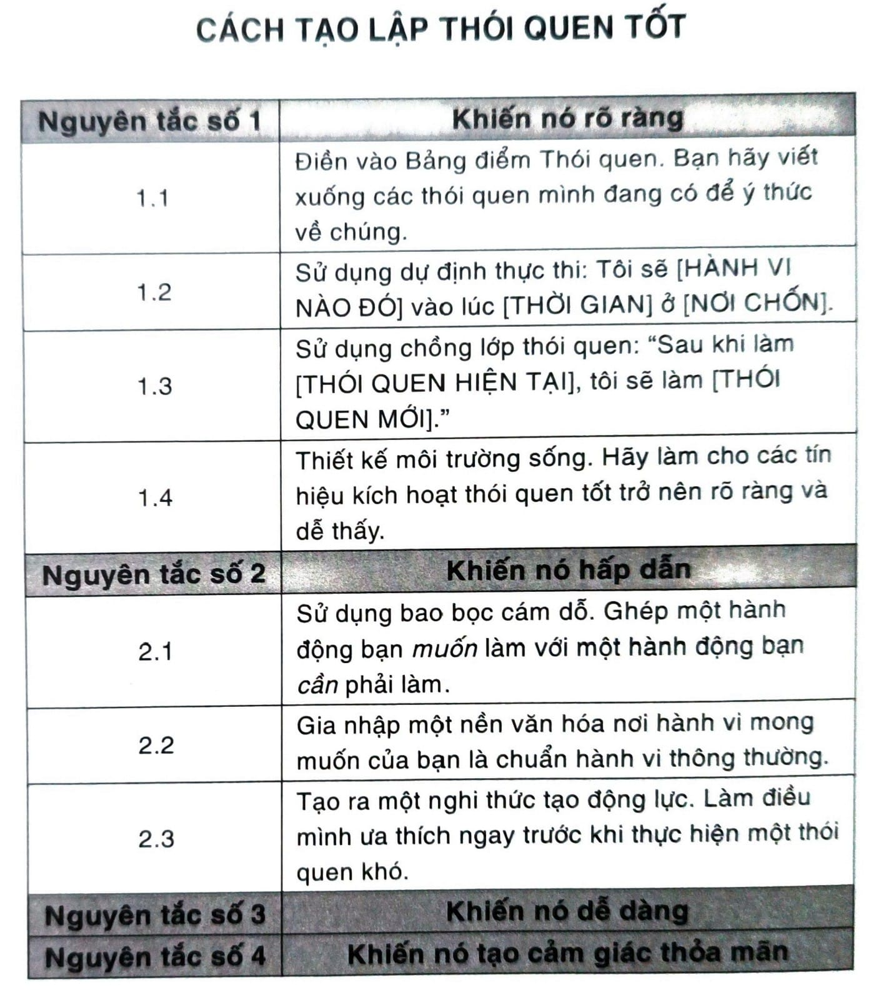
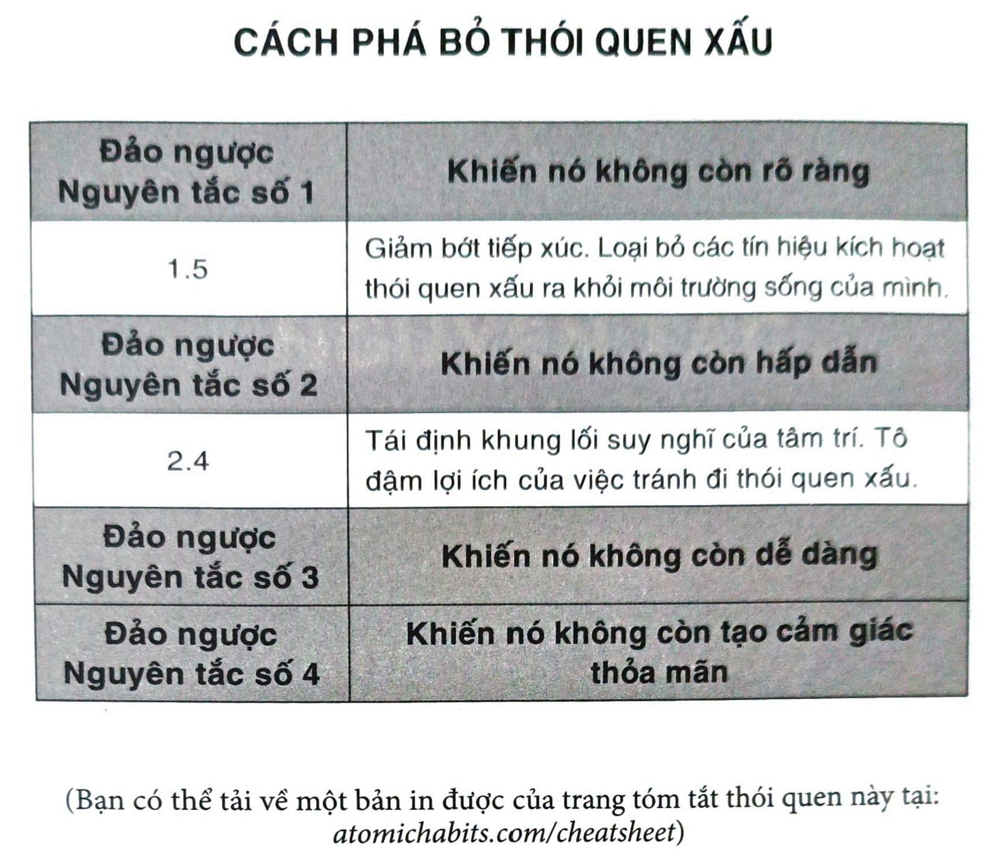

# CHƯƠNG 10: TRUY TÌM VÀ ĐIỀU CHỈNH CĂN NGUYÊN CỦA THÓI QUEN XẤU

Cuối năm 2012, tôi đang ngồi trong một căn hộ cũ chỉ cách Istiklal Caddesi, con đường nổi tiếng bậc nhất Istanbul vài khu nhà. Tôi đang trong chuyến đi bốn ngày đến Thổ Nhĩ Kỳ, và hướng dẫn viên của tôi, Mike, đang ngồi thư giãn cách vài bước đằng kia trong chiếc ghế bành sờn cũ.

Mike cũng không hẳn là một hướng dẫn viên du lịch. Anh ấy chỉ là anh chàng đến từ Maine đã sống ở Thổ Nhĩ Kỳ được năm năm, nhưng anh có đề nghị đưa tôi đi tham quan khi tôi ghé thăm đất nước này, thế là tôi đã chọn anh. Trong đêm đặc biệt ấy, tôi được mời đến ăn tối với anh và vài người bạn Thổ Nhĩ Kỳ.

Có tổng cộng bảy người, và tôi là người duy nhất ở đó, theo một nghĩa nào đấy, không hút ít nhất một gói thuốc lá một ngày. Tôi hỏi một anh chàng xem anh đã bắt đầu hút như thế nào. “Từ bạn bè”, anh trả lời. “Luôn luôn là từ bạn bè. Một người hút, thế là anh cũng thử hút.”

Điều thật sự thú vị là một nửa số người trong căn phòng đó đã từng xoay xở bỏ thuốc. Mike từng ngưng hút được vài năm trước thời điểm đó, và anh ấy cam đoan mình bỏ được thói quen này là nhờ vào quyển sách Allen Carr’s Easy Way to Stop Smoking[^47].

“Nó giải phóng anh khỏi áp lực tinh thần của việc hút”, anh bảo. “Nó nói với bạn: “Thôi đừng tự lừa dối mình nữa. Bạn biết bạn chẳng thực sự muốn hút đâu. Bạn biết bạn không thực sự thích hút mà.” Nó giúp anh cảm thấy như thể anh không còn là nạn nhân nữa. Anh bắt đầu nhận ra là anh không cần phải hút.”

Tôi chưa bao giờ hút thuốc, nhưng sau đó tôi cũng đọc qua quyển sách kia vì tò mò. Tác giả quyển sách đã áp dụng một chiến lược thú vị để giúp người hút thuốc loại bỏ cơn thèm thuốc. Ông ấy tái định khung một cách có hệ thống từng tín hiệu gắn với việc hút thuốc và trao cho nó một ý nghĩa mới. Ông viết những điều như: Bạn nghĩ bạn cần phải từ bỏ cái gì đó, nhưng không, bạn không từ bỏ cái gì cả, thuốc lá không có giá trị gì với bạn hết. Bạn nghĩ hút thuốc là điều mình cần để có thể xã giao, nhưng không. Bạn hoàn toàn có thể xã giao mà không cần hút một điếu nào. Bạn nghĩ hút thuốc là để giảm căng thẳng, nhưng không. Hút thuốc chẳng giải tỏa được tí tinh thần nào cả, thuốc lá phá hủy thần kinh thì có.

Trong sách, ông lặp đi lặp lại các câu từ này và các câu khác tương tự. “Phải làm rõ trong đầu bạn”, ông bảo. “Bạn đang không mất cái gì cả và bạn đang tạo ra các lợi ích tích cực phi thường không chỉ cho sức khỏe, năng lượng và tiền bạc, mà còn trong hình ảnh bản thân, sự tự tin, tự trọng, tự do và điều quan trọng nhất, đó là trong chất lượng và tuổi thọ cuộc đời sau này của bạn.”

Khi đọc hết quyển sách, hút thuốc dường như trở thành điều kỳ quặc nhất trên đời. Và nếu không còn mong đợi lợi ích gì từ việc hút thuốc lá, thì bạn không có lý do để hút nữa. Nó chính là nghịch đảo của Nguyên tắc số 2 trong Thay đổi Hành vi: Khiến nó không còn hấp dẫn. Ừm, tôi biết là ý tưởng này nghe có vẻ đơn giản quá mức. Chỉ cần thay đổi suy nghĩ và bạn có thể bỏ thuốc. Tuy vậy, hãy kiên nhẫn với tôi một chút thôi.

## CƠN THÈM MUỐN ĐẾN TỪ ĐÂU

Mỗi một hành vi đều có một cơn thèm muốn trên bề mặt và một động cơ thẳm sâu bên dưới. Tôi thường có một cơn thèm muốn như thế này: “Tôi muốn ăn taco[^48].” Nếu bạn hỏi vì sao tôi muốn ăn taco, tôi sẽ không nói: “Vì tôi cần thức ăn để tồn tại.” Nhưng sự thực là, đâu đó thẳm sâu bên trong, tôi có động lực ăn taco vì tôi phải ăn để sống. Động cơ sâu bên dưới là kiếm thức ăn nước uống, ngay cả cơn thèm muốn cụ thể của tôi là một cái bánh taco.

Một số động cơ bên trong của ta gồm có:[^49] Bảo tồn năng lượng Kiếm thức ăn nước uống Tìm kiếm tình yêu và tái sinh sản Liên kết và gắn bó với người khác Giành được sự thừa nhận và công nhận của xã hội Giảm bớt sự không chắc chắn Đạt được địa vị và đặc quyền

Cơn thèm chỉ là hiện thân cụ thể của một động cơ sâu hơn bên dưới. Bộ não của bạn không tiến hóa để có một khao khát hút thuốc, lướt Instagram hay chơi trò chơi điện tử. Ở tầm mức sâu hơn, bạn chỉ là đang muốn giảm bớt sự bất ổn và giải tỏa căng thẳng, để được xã hội thừa nhận và công nhận, hoặc giả để giành được vị thế.

Hãy nhìn vào gần như mọi sản phẩm của việc hình thành thói quen mà xem, bạn sẽ thấy không có cái nào tạo ra động lực mới cả, mỗi một sản phẩm đều gắn với các động cơ bên dưới trong bản chất loài người. Tìm kiếm tình yêu và tái sinh sản = dùng Tinder Liên kết và gắn bó với người khác = lướt Facebook Giành được sự thừa nhận và công nhận của xã hội = đăng bài trên Instagram Giảm bớt sự không chắc chắn = tìm kiếm trên Google Đạt được địa vị và đặc quyền = chơi trò chơi điện tử

Thói quen của bạn là giải pháp trong thời hiện đại cho các khát khao cổ xưa. Phiên bản mới hơn của các tật cũ. Các động cơ đằng sau hành vi vẫn giữ nguyên như cũ. Các thói quen đặc trưng ta có sẽ khác nhau theo từng thời kỳ lịch sử.

Đây là phần hữu dụng nhất: Có rất nhiều con đường khác nhau cùng dẫn về một động cơ bên dưới. Một người có thể học cách giảm căng thẳng bằng việc hút một điếu thuốc lá. Một người khác học cách giảm căng thẳng bằng việc chạy bộ. Thói quen hiện tại của bạn không chắc là cách tốt nhất cho vấn đề bạn đang đối mặt; có khi chúng chỉ là các cách bạn từng biết. Một khi đã gắn một giải pháp với một vấn đề cần giải quyết, bạn sẽ tiếp tục viện tới nó khi cần.

Thói quen hoàn toàn là câu chuyện về sự liên tưởng. Các liên tưởng này sẽ quyết định xem chúng ta dự đoán một thói quen có đáng để tái diễn hay không. Như ta đã bàn trong phần Nguyên tắc số 1, não bạn liên tục hấp thụ thông tin và chú ý đến tín hiệu trong môi trường. Mỗi khi nhận được một tín hiệu, não bạn lập tức chạy một mô phỏng và một dự đoán về điều nên làm tiếp theo.

Tín hiệu: Bạn nhận ra lò nướng đang nóng.

Dự đoán: Nếu mình chạm vào thì sẽ bị phỏng, cho nên mình phải tránh đụng vào nó.

Tín hiệu: Bạn nhận ra đèn giao thông chuyển sang màu xanh.

Dự đoán: Nếu mình đạp vào chân ga, mình sẽ vượt qua giao lộ an toàn và đến gần với đích đến hơn, vì vậy mình nên đạp vào chân ga.

Bạn thấy một tín hiệu, phân loại nó theo kinh nghiệm quá khứ, và quyết định phản ứng thích hợp.

Điều này xảy ra chỉ trong tích tắc, nhưng nó đóng vai trò thiết yếu trong thói quen của bạn bởi lẽ mọi hành động xảy ra đều là từ một dự đoán đi trước. Đời nghe như chuỗi phản ứng lại một cách thụ động, nhưng thực ra nó khá dễ đoán. Suốt ngày dài, bạn luôn luôn ở trong quá trình thực hiện các phỏng đoán tốt nhất để hành động dựa trên những điều mới vừa nhìn thấy và những thứ đã hiệu quả với mình trong quá khứ. Bạn liên tục dự đoán điều sẽ xảy ra trong khoảnh khắc tiếp theo.

Hành vi của chúng ta phụ thuộc nặng nề vào các dự đoán này. Nói khác đi, hành vi của ta phụ thuộc rất lớn vào cách ta diễn giải các sự kiện xảy ra với mình, chứ không hẳn chỉ vào hiện thực khách quan của bản thân sự kiện. Hai người cùng nhìn vào một điếu thuốc, một người cảm thấy thôi thúc muốn châm lửa trong khi người kia cự tuyệt vì cái mùi của nó. Cùng một tín hiệu có thể kích hoạt cả thói quen tốt lẫn thói quen xấu, tùy thuộc vào bạn đang dự đoán điều gì. Nguồn cơn của các thói quen bạn có thực ra chính là những phỏng đoán đi trước các thói quen ấy.

Các dự đoán này dẫn tới cảm giác, đây chính là cách ta thường mô tả một cơn thèm muốn - một cảm giác, một khao khát, một thôi thúc. Cảm xúc và cảm giác chuyển đổi các tín hiệu ta tri nhận và dự đoán của ta thành một dấu hiệu mà ta có thể sử dụng. Chúng lý giải những điều ta đang cảm nhận. Ví dụ, dù có nhận ra hay không thì bạn vẫn biết rằng mình đang cảm thấy ấm hay lạnh như thế nào vào lúc này. Nếu nhiệt độ giảm xuống một độ, bạn hẳn sẽ không thấy khác gì. Nhưng nếu nhiệt độ giảm xuống mười độ thì bạn sẽ cảm thấy lạnh và mặc thêm áo. Cảm thấy lạnh là một dấu hiệu thúc đẩy bạn hành động. Bạn luôn luôn tri nhận các tín hiệu mọi lúc mọi nơi, nhưng chỉ khi trong bạn xuất hiện phán đoán cho rằng tốt hơn mình nên thay đổi tình trạng hiện tại, thì bạn mới hành động.

Cơn thèm muốn là dấu chỉ cho thấy có gì đang bị thiếu. Đó là thôi thúc muốn thay đổi trạng thái bên trong. Nhiệt độ giảm xuống tạo ra một khoảng cách giữa cái mà cơ thể bạn đang cảm giác và cái mà nó muốn cảm giác. Khoảng cách giữa tình trạng hiện tại và tình trạng mong muốn cung cấp lý do cho hành động.

Khao khát là sự khác biệt giữa nơi bạn đang ở và nơi bạn muốn đến trong tương lai. Một hành động dù là bé nhỏ đến đâu cũng đều nhuốm màu động cơ muốn cảm thấy khác hơn tình trạng hiện tại. Khi bạn ăn uống quá độ, châm thuốc hay lướt mạng xã hội, cái bạn thực sự muốn không phải là một miếng khoai chiên hay điếu thuốc hoặc một chùm like. Điều bạn thực sự muốn là được cảm thấy khác đi.

Cảm giác và cảm xúc báo cho ta biết có nên giữ nguyên trạng huống hiện tại hay là nên thay đổi. Chúng giúp ta quyết định con đường hành động tốt nhất. Các nhà thần kinh học đã khám phá ra rằng khi cảm giác và cảm xúc gặp trục trặc, chúng ta thực sự mất đi khả năng quyết định. Chúng ta không có dấu hiệu nào bảo cho biết mình nên theo đuổi cái gì và tránh né cái gì. Như nhà khoa học thần kinh Antonio Damasio lý giải, “Chính cảm xúc là thứ cho phép bạn đánh dấu cái nào tốt, cái nào xấu, cái nào không cần quan tâm.”

Tóm lại, cơn thèm muốn đặc trưng bạn đang có và các thói quen bạn thực hiện chính là nỗ lực hướng đến các động cơ nền tảng bên dưới. Bất cứ khi nào một thói quen giải quyết thành công một động lực, bạn sẽ hình thành một cơn thèm muốn thực hiện thói quen này một lần nữa. Đúng lúc đó, bạn học được cách tạo ra một dự đoán, chẳng hạn như lướt mạng xã hội sẽ giúp bạn cảm thấy được yêu mến, hoặc xem YouTube có thể cho phép bạn quên đi nỗi sợ của mình. Thói quen trở nên hấp dẫn khi ta gắn chúng với cảm giác tích cực, và ta có thể lợi dụng hiểu biết này thay vì để nó gây bất lợi cho mình.

## TÁI LẬP TRÌNH NÃO BỘ ĐỂ TẬN HƯỞNG CÁC THÓI QUEN KHÓ

Bạn có thể làm cho các thói quen khó trở nên hấp dẫn nếu bạn học được cách gắn chúng với trải nghiệm tích cực. Đôi khi cái bạn cần chỉ là một chuyển biến nhẹ trong cách nghĩ. Ví dụ như ta thường hay nói về những việc mình phải hoàn thành trong một ngày. Bạn phải thức dậy sớm đi làm. Bạn phải gọi mấy cú điện thoại bán hàng cho công ty. Bạn phải nấu cơm tối cho cả nhà.

Bây giờ, bạn hãy đổi một chữ thôi: Bạn không cần “phải”. Bạn “sẽ”.

Bạn sẽ thức dậy sớm đi làm. Bạn sẽ gọi mấy cú điện thoại bán hàng cho công ty. Bạn sẽ nấu cơm tối cho cả nhà. Chỉ bằng cách đổi đi một chữ, bạn đã thay đổi cách bạn nhìn nhận các sự kiện. Bạn chuyển góc nhìn các hành vi này như gánh nặng thành các cơ hội.

Mấu chốt nằm ở chỗ cả hai phiên bản hiện thực này đều đúng. Bạn phải làm những việc này, nghĩa là bạn cũng sẽ làm những việc này. Ta hoàn toàn có thể tìm ra bằng cớ cho bất kỳ lối tư duy nào mà ta chọn.

Tôi từng nghe chuyện về một người đàn ông ngồi xe lăn. Khi được hỏi bị giam cầm vào chiếc xe như vậy thì có khó chịu không, ông trả lời, “Tôi không thấy bị giam cầm bởi xe lăn của mình - ngược lại nhờ nó mà tôi cảm thấy mình được giải phóng. Nếu không có nó, tôi đã bị dính cứng trên giường và không thể đi ra khỏi nhà rồi.” Sự chuyển dịch trong góc nhìn này hoàn toàn thay đổi cách ông sống mỗi ngày.

Tái định khung thói quen để tô đậm lợi ích của chúng thay vì các hạn chế chúng mang lại là cách nhanh chóng mà gọn nhẹ, giúp bạn tái lập trình não mình và làm một thói quen trở nên hấp dẫn hơn.

Tập thể dục. Nhiều người liên tưởng việc tập thể dục với một nhiệm vụ khó khăn khiến họ mất sức và mệt mỏi. Bạn chỉ cần đơn giản nhìn nó như một cách để phát triển kỹ năng và bồi đắp bản thân. Thay vì suốt ngày nói với bản thân “Mình cần phải chạy bộ mỗi sáng”, hãy tự nhủ “Đến giờ rèn sức bền và tốc độ rồi”.

Tài chính. Tiết kiệm lúc nào cũng bị gắn với hy sinh. Tuy nhiên, bạn có thể liên hệ nó với tự do hơn là giới hạn nếu bạn nhận ra sự thật đơn giản này: Sống dưới mức sống mình có khả năng trong hiện tại làm tăng mức sống trong tương lai. Số tiền bạn tiết kiệm được tháng này sẽ nâng cao sức mua cho tháng sau.

Thiền tập. Bất cứ ai từng thử thiền hơn ba giây đều biết đến cảm giác khó chịu khi không thể tránh khỏi những điều sao nhãng cứ liên tiếp xuất hiện trong đầu. Bạn có thể chuyển hóa cơn bực bội này thành niềm vui sướng khi nhìn nhận mỗi cơn phân tâm này chính là một cơ hội cho bạn thực hành quay trở lại hơi thở của mình. Sao nhãng là điều tốt bởi vì bạn cần có sao nhãng để thực hành thiền định.

Bồn chồn trước cuộc chơi. Rất nhiều người cảm thấy lo âu trước một buổi thuyết trình hay một trận thi đấu quan trọng. Họ thở dồn dập, tim đập nhanh, cảm giác kích thích tăng cao. Nếu ta diễn dịch các cảm giác này theo lối tiêu cực, bạn sẽ cảm thấy bị đe dọa và căng cứng cơ thể. Nếu có thể diễn giải theo hướng tích cực, ta có thể phản ứng lại bằng sự linh hoạt uyển chuyển. Bạn có thể tái định khung “Mình lo quá” thành “Mình đang hào hứng và sẽ có một liều adrenaline[^50] đủ mạnh để tập trung”.

Thay đổi nhỏ này trong cách nghĩ không phải là phép màu, nhưng chúng có thể giúp thay đổi cảm giác bạn từng có với một thói quen hay tình huống cụ thể nào đó.

Nếu muốn tiến một bước sâu hơn, bạn có thể tạo ra một nghi thức tạo động lực. Chỉ cần thực hành liên kết thói quen của mình với điều gì đó bạn hứng thú, thì bạn có thể dùng tín hiệu đó bất kỳ lúc nào cần thêm chút động lực. Chẳng hạn như bạn luôn luôn bật một bài hát cố định nào đó trước khi quan hệ, thì bạn sẽ bắt đầu liên kết đoạn nhạc đó với hoạt động này. Thế là bất cứ khi nào muốn có hứng, bạn chỉ cần nhấn nút bật nhạc thôi.

Ed Latimore, vận động viên đấm bốc và cũng là một tác giả từ Pittsburgh, cũng đã tận dụng được lợi thế từ chiến lược tương tự mà không biết. “Tôi nhận ra một chuyện kỳ lạ,” anh viết. “Chỉ cần đeo tai nghe vào trong lúc viết là sức tập trung và chú ý của tôi tăng vọt lên. Tôi thậm chí còn chưa bật nhạc.” Anh ấy đang điều kiện hóa bản thân mà không nhận ra. Ban đầu, anh chỉ đeo tai nghe lên, bật vài bản nhạc mình ưa thích, và tập trung làm việc. Sau khi làm được năm, mười, hai mươi lần như vậy thì hành động đeo tai nghe trở thành một tín hiệu mà anh đã tự động gắn với sức tập trung cao. Cơn thèm muốn tự nhiên kéo đến.

Vận động viên cũng áp dụng chiến lược tương tự để đưa bản thân vào phương thức tư duy thích hợp cho thi đấu. Trong sự nghiệp bóng chày của mình, tôi xây dựng một nghi thức khởi động cơ bắp và ném bóng đặc hiệu trước mỗi trận đấu. Toàn bộ lộ trình tốn khoảng mười phút, và mỗi một lần tôi đều thực hiện nó theo cùng một kiểu. Trong lúc nó làm nóng cơ thể tôi cho trận bóng, điều quan trọng hơn chính là nó đưa tôi vào một trạng thái tinh thần phù hợp. Tôi bắt đầu gắn các nghi thức trước trận đấu với cảm giác tập trung và tinh thần cạnh tranh. Cả khi trước đó tôi chưa được tạo động lực thì chỉ cần hoàn thành xong nghi thức của mình, tôi đã bước vào “chế độ thi đấu”.

Bạn có thể dùng chiến lược này cho gần như bất cứ mục đích nào. Ví dụ như bạn muốn hạnh phúc hơn đi! Hãy tìm một thứ khiến bạn thực sự cảm thấy hạnh phúc - như vuốt ve cún cưng hay ngâm mình trong bồn tắm - rồi sau đó bạn tạo ra một nghi thức ngắn xảy ra trước mỗi một lần bạn làm việc mình thích. Hít ba hơi thở sâu và mỉm cười chẳng hạn.

Ba hơi thở sâu. Mỉm cười. Vuốt ve cún cưng. Lặp lại.

Cuối cùng bạn sẽ bắt đầu kết nối lề thói hít-thở-và-mỉm-cười này với trạng thái có tâm tình tốt đẹp. Nó trở thành tín hiệu mang ý nghĩa cảm thấy hạnh phúc. Khi đã hình thành, bạn có thể truy cập vào nó bất cứ khi nào muốn thay đổi tình trạng cảm xúc hiện tại. Căng thẳng ở chỗ làm? Hít ba hơi thở sâu và mỉm cười. Buồn vì cuộc đời? Ba hơi thở sâu và mỉm cười. Khi thói quen đã bám rễ, tín hiệu có thể gợi lên cơn thèm muốn, ngay cả khi nó không có mấy liên hệ với tình huống ban đầu.

Chìa khóa để tìm ra và điều chỉnh căn nguyên của thói quen xấu là tái định khung mối liên kết bạn có với các thói quen này. Điều này không dễ, nhưng nếu bạn có thể tái lập trình các dự đoán của mình thì bạn có thể chuyển hóa một thói quen khó trở thành một thói quen hấp dẫn.

## Tóm tắt chương

- Đảo ngược của Nguyên tắc số 2 trong Thay đổi Hành vi là khiến nó không còn hấp dẫn.

- Mỗi một hành vi đều có một cơn thèm muốn trên bề mặt và một động cơ thẳm sâu bên dưới.

- Thói quen của bạn là giải pháp trong thời hiện đại cho các khát khao cổ xưa.

- Nguồn cơn của các thói quen bạn có thực ra chính là những dự đoán đi trước các thói quen ấy. Dự đoán dẫn đến cảm giác.

- Tô đậm lợi ích của việc tránh một thói quen xấu để làm cho nó kém hấp dẫn hơn.

- Thói quen trở nên hấp dẫn khi ta gắn chúng với cảm giác tích cực, và không hấp dẫn khi ta gắn chúng với cảm giác tiêu cực. Hãy tạo ra một nghi thức tạo động lực bằng cách thực hiện một điều ưa thích ngay trước khi thực hiện một thói quen khó.

---

## Chú thích

[^47]: Tạm dịch: Phương pháp cai thuốc dễ dàng từ Allen Carr. (ND)

[^48]: Bánh taco là món bánh kẹp truyền thống của Mexico, vỏ làm từ bột ngô và có nhiều loại nhân khác nhau. (ND)

[^49]: Đây chỉ là một phần danh sách các động cơ nằm sâu bên dưới. Tôi có viết một bản hoàn chỉnh hơn và có nhiều ví dụ làm sao để ứng dụng các động cơ này vào doanh nghiệp, tại trang atomichabits.com/business. (TG)

[^50]: Chất dẫn truyền thần kinh tiết ra đồng thời khi bạn gặp sợ hãi, tức giận hoặc hứng thú. (ND)
