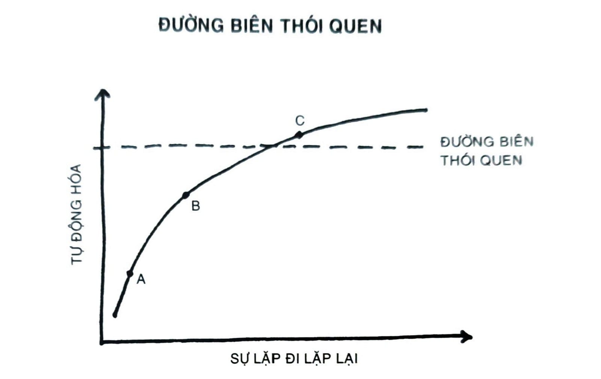
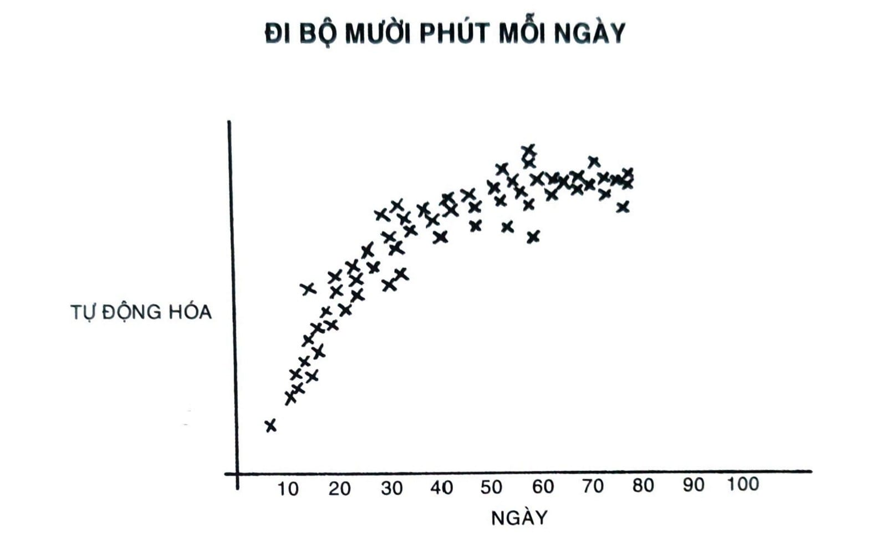

# NGUYÊN TẮC SỐ 3: KHIẾN NÓ DỄ DÀNG

---

# CHƯƠNG 11: ĐI CHẬM, NHƯNG KHÔNG BAO GIỜ ĐI LÙI

Vào ngày đầu tiên lên lớp, Jerry Uelsmann, một giáo sư tại Đại học Florida, đã chia các sinh viên lớp chụp ảnh phim của mình thành hai nhóm.

Tất cả những người bên trái lớp học, ông giảng giải, sẽ thuộc nhóm “số lượng”. Họ sẽ được chấm điểm hoàn toàn dựa trên số lượng sản phẩm họ làm ra. Vào buổi học cuối cùng, ông sẽ đếm tổng số lượng ảnh chụp mà mỗi sinh viên đã nộp. Một trăm bức được điểm A, chín mươi bức được điểm B, tám mươi bức điểm C, và cứ thế.

Trong khi đó, tất cả sinh viên ở bên phải sẽ là nhóm “chất lượng”. Họ sẽ được chấm điểm hoàn toàn dựa vào độ xuất sắc của sản phẩm. Họ chỉ cần nộp duy nhất một bức ảnh trong suốt học phần, nhưng để đạt được điểm A thì bức ảnh phải gần như là hoàn hảo.

Vào cuối kỳ, ông ngạc nhiên khi phát hiện ra tất cả những bức ảnh xuất sắc nhất đều là sản phẩm từ nhóm số lượng. Trong suốt học phần, các sinh viên này chụp ảnh không ngơi tay, thử nghiệm các cách bố cục và ánh sáng, thử nhiều phương pháp khác nhau trong phòng tối, và học hỏi từ sai lầm của mình. Trong quá trình tạo ra hàng trăm bức ảnh, họ mài giũa kỹ năng của mình. Trong khi đó, nhóm chất lượng chỉ ngồi tính toán độ hoàn hảo. Vào khúc cuối, họ không có gì để chứng minh nỗ lực của mình ngoại trừ các lý thuyết chưa được kiểm chứng và một bức ảnh xoàng xĩnh.[^51]

Chúng ta rất dễ sa lầy vào việc lên một kế hoạch thay đổi tốt nhất: cách giảm cân nhanh nhất, lộ trình rèn luyện cơ bắp tốt nhất, ý tưởng hoàn hảo nhất cho nghề tay trái. Chúng ta quá chú trọng việc tìm ra cách thức tốt nhất đến mức không bao giờ tới gần đến bước hành động. Như Voltaire từng viết, “Cái tốt nhất chính là kẻ thù của cái tốt.”

Tôi xem đây là khoảng cách giữa trạng thái vận động và hành động[^52]. Hai ý niệm nghe na ná nhau, nhưng chúng không phải là một. Khi bạn trong trạng thái vận động nguồn lực, bạn đang lên kế hoạch và chiến lược, cũng như học hỏi. Những điều này đều tốt, nhưng chúng không làm ra sản phẩm.

Ngược lại, hành động là kiểu hành vi sẽ tạo ra sản phẩm đầu ra. Nếu tôi phác thảo hai mươi ý tưởng cho bài viết mình muốn viết, thì đó là vận động. Nếu tôi thực sự ngồi xuống và viết một bài, đó mới là hành động. Nếu tôi tìm kiếm một chế độ ăn kiêng tốt hơn, đọc vài quyển sách về chủ đề này thì đó là vận động. Nếu tôi thực sự ăn một bữa ăn lành mạnh, đó mới là hành động.

Đôi khi vận động là điều có ích, nhưng tự thân nó không bao giờ đưa ra một kết quả. Bạn đến nói chuyện với huấn luyện viên cá nhân bao nhiêu lần cũng chẳng có ý nghĩa gì, sự vận động đó không hề giúp cho bạn có được vóc dáng khỏe mạnh. Chỉ có hành động rèn luyện thân thể mới tạo ra kết quả mà bạn đang mong đạt được.

Nếu vận động không đưa đến kết quả, vậy vì sao ta cứ làm hoài? Thỉnh thoảng ta làm vì ta thực sự cần lên kế hoạch và học hỏi nhiều hơn. Nhưng thường là, chúng ta làm vì trạng thái vận động cho ta cảm giác như mình đang tiến triển mà không sợ đối mặt với nguy cơ thất bại. Phần đông chúng ta là chuyên gia né tránh chỉ trích. Thất bại và bị chỉ trích công khai thì chẳng hay ho tẹo nào, cho nên ta có xu hướng tránh các tình huống dễ nảy sinh điều này. Và đó chính là lý do lớn nhất vì sao bạn ưa vận động hơn là thực sự hành động: Bạn muốn trì hoãn thất bại.

Ở trong trạng thái vận động và thuyết phục bản thân rằng mình đang tiến bộ thì dễ dàng vô cùng. Bạn nghĩ, “Mình đang có bốn cuộc tương tác với khách hàng tiềm năng. Điều này thật tốt. Chúng ta đang đi đúng hướng.” Hay là, “Mình đã động não được vài ý tưởng cho quyển sách muốn viết. Mọi thứ đang hội tụ lại đây.”

Trạng thái vận động làm bạn cảm thấy bạn đang sắp hoàn thành mọi thứ. Nhưng thực tế là bạn chỉ đang chuẩn bị cho mọi thứ được hoàn tất. Khi công tác chuẩn bị biến tướng thành một hình thức trì hoãn, bạn cần thay đổi. Bạn sẽ không muốn mình mãi mãi lên kế hoạch. Bạn muốn mình thực thi.

Nếu bạn muốn thành thạo một thói quen, chìa khóa nằm ở việc tái diễn, chứ không phải sự hoàn hảo. Bạn không cần phải phác ra kỹ càng từng chi tiết một của thói quen. Bạn chỉ cần thực hành nó. Đây chính là điểm cần nhớ đầu tiên của Nguyên tắc số 3: Bạn chỉ cần tạo ra sự lặp đi lặp lại.

## THỰC TẾ CẦN BAO LÂU ĐỂ HÌNH THÀNH THÓI QUEN MỚI?

*Hình thành thói quen là quá trình một hành vi trở nên tự động*

dần dần thông qua sự lặp đi lặp lại. Bạn tái lặp một hoạt động càng nhiều lần thì cấu trúc não bạn càng thay đổi để trở nên hiệu quả với hoạt động ấy hơn. Các nhà thần kinh học gọi đây là sự tăng cường dài hạn[^53], dùng để chỉ sự cường hóa liên kết giữa các tế bào thần kinh trong não dựa trên mô thức hoạt động mới xảy ra. Với mỗi sự lặp đi lặp lại, tín hiệu từ tế bào đến tế bào được cải thiện và các liên kết thần kinh được thắt chặt. Được mô tả lần đầu tiên bởi nhà tâm lý học thần kinh Donald Hebb năm 1949, hiện tượng này thường được gọi là Quy tắc Hebb: “Tế bào thần kinh nào bắn tín hiệu cho nhau thì liên kết với nhau.”

Tái diễn một thói quen dẫn đến các thay đổi về vật lý rõ rệt trong não. Ở các nghệ sĩ chơi đàn, phần tiểu não - cần thiết cho các vận động thể lý như móc dây đàn guitar hay kéo vĩ cầm - có kích thước to hơn so với người không phải nhạc công chuyên nghiệp. Trong khi đó, các nhà toán học có lượng chất xám trong tiểu thùy đỉnh dưới[^54] tăng cao, là chất đóng vai trò quan trọng trong tính toán và ước lượng. Kích thước của nó liên quan trực tiếp đến lượng thời gian bỏ ra vào lĩnh vực ấy; nhà toán học càng lớn tuổi và nhiều kinh nghiệm thì tỷ trọng chất xám càng lớn.

Khi các nhà khoa học phân tích bộ não các bác tài xế taxi ở London, họ phát hiện thấy hồi hải mã[^55] - vùng não liên quan đến trí nhớ không gian - có kích thước lớn hơn đáng kể so với những người không phải là tài xế taxi. Thậm chí còn thú vị hơn nữa, hồi hải mã giảm kích thước khi một tài xế nghỉ hưu. Tựa như cách thức cơ bắp trên người phản ứng với bài tập nâng tạ thông dụng, các vùng não nhất định của não tự thích nghi khi được sử dụng và teo đi khi bị từ bỏ.

Hẳn nhiên, tầm quan trọng của việc lặp đi lặp lại trong thiết lập thói quen đã được ghi nhận từ lâu trước khi các nhà thần kinh học bắt đầu thám hiểm não bộ. Năm 1860, triết gia người Anh George H. Lewes đã viết, “Trong quá trình học nói một ngôn ngữ mới, học chơi một nhạc cụ mới, hay thực hiện một động tác không quen thuộc, khó nhọc là không thể tránh, bởi các kênh cần thiết cho cảm giác đi qua vẫn chưa được thiết lập; nhưng chẳng mấy chốc mà sự tái diễn sẽ tạo nên một con đường, thế rồi khó khăn tan biến; hành động trở nên tự động đến mức chúng có thể được thi hành mà não bộ không cần dự phần.” Cả lẽ thường lẫn bằng chứng khoa học đều đồng thuận: Sự lặp đi lặp lại là một hình thức của thay đổi.

Mỗi một lần bạn lặp lại một hành động, bạn đang kích hoạt một con đường thần kinh gắn với thói quen ấy. Điều đó có nghĩa, tạo ra sự lặp đi lặp lại là một trong những bước trọng yếu cần làm để mã hóa một thói quen mới. Đây là lý do vì sao các sinh viên đã chụp hàng đống ảnh có thể cải thiện kỹ năng của mình trong khi những người chỉ thảo luận lý thuyết về bức ảnh hoàn hảo đã không làm được. Một nhóm tham gia vào thực hành chủ động, nhóm còn lại học thụ động. Một nhóm hành động, nhóm kia thì ở trong trạng thái vận động.

Tất cả thói quen đều đi theo một quỹ đạo giống nhau, từ thực hành có nỗ lực đến hành vi tự động, một quá trình gọi là sự tự động hóa. Tự động hóa là khả năng thực hiện một hành vi mà không cần suy nghĩ về mỗi bước, xảy ra khi tâm trí phi ý thức nắm quyền.

Nó trông như thế này:

*Hình 11: Vào lúc khởi đầu (điểm A), để thực thi, một thói quen đòi hỏi một lượng lớn nỗ lực và tập trung. Sau một vài lần tái diễn (điểm B), nó trở nên dễ hơn, nhưng vẫn cần sự tập trung của ý thức. Với đủ luyện tập (điểm C), thói quen trở thành tự động thay vì có ý thức. Vượt qua ngưỡng này - đường biên thói quen - hành vi có thể được thực hiện ít nhiều mà không cần suy nghĩ. Một thói quen đã hình thành.*

Trong trang tiếp theo, bạn sẽ xem các nhà nghiên cứu theo dõi mức độ tự động hóa một thói quen, ví dụ đi bộ mười phút mỗi ngày, trong thực tế như thế nào. Hình dạng của biểu đồ này, các nhà khoa học gọi là đường cong học tập, tiết lộ một sự thật quan trọng về thay đổi hành vi: Thói quen hình thành dựa trên tần suất thực hiện, không phải theo thời gian.

*Hình 12: Biểu đồ này thể hiện một người đang tạo lập thói quen đi bộ mười phút sau bữa sáng mỗi ngày. Bạn để ý, khi sự tái diễn tăng lên thì tính tự động tăng theo, cho đến khi hành vi trở nên dễ dàng và tự động hơn cả mong đợi.*

Một trong những câu hỏi tôi hay gặp là, “Bao lâu thì tôi có thể xây dựng được thói quen mới?” Nhưng đúng ra người ta nên hỏi, “Cần bao nhiêu lần thực hiện thì một thói quen được hình thành?” Nghĩa là, cần lặp đi lặp lại bao nhiêu lần thì một thói quen mới trở nên tự động?

Chẳng có gì thần kỳ về lượng thời gian trôi qua trong việc hình thành thói quen mới. Hai mươi mốt ngày, ba mươi ngày hay ba trăm ngày, đều chẳng quan trọng. Điều có ý nghĩa là tần suất bạn thực hiện một hành vi. Trong ba mươi ngày bạn có thể thực hiện việc ấy hai lần, hay hai trăm lần đều được. Chính tần suất này tạo nên khác biệt. Thói quen hiện tại của bạn đã được nhập nội hóa theo hàng trăm - nếu không muốn nói là hàng ngàn - lần lặp đi lặp lại. Thói quen mới đòi hỏi cấp độ tái diễn tương tự. Bạn cần xâu chuỗi lại với nhau đủ số lần thực hiện thành công cho đến khi hành vi được chèn vững chắc vào tâm trí, và bạn vượt qua được Đường biên Thói quen.

Trong thực tế, thời gian để một thói quen trở nên tự động thực sự không có ý nghĩa gì cả. Điều quan trọng ở đây là bạn đã hành động để tiến bộ. Và một hành động có thể hoàn toàn tự động hóa hay không cũng không quá quan trọng nữa.

Để xây dựng một thói quen, bạn cần thực hành nó. Cách hiệu quả nhất để thực hành chính là trung thành với Nguyên tắc số 3 trong Thay đổi Hành vi: Khiến nó dễ dàng. Các chương sau sẽ chỉ cho bạn cách làm điều này.

## Tóm tắt chương

- Nguyên tắc số 3 trong Thay đổi Hành vi là khiến nó dễ dàng.

*Hình thức học hỏi hiệu quả nhất là thực hành, không phải lên*

- kế hoạch.

- Tập trung vào việc thực sự hành động, đừng chỉ ở trong trạng thái vận động.

*Hình thành thói quen là quá trình một hành vi trở nên tự động*

- dần dần thông qua sự lặp đi lặp lại.

- Lượng thời gian bạn bỏ ra thực hành một thói quen không quan trọng bằng số lần bạn thực hành thói quen ấy.

---

## Chú thích

[^51]: Câu chuyện tương tự được kể trong quyển sách Art and Fear của David Bayles và Ted Orland. Câu chuyện này được phóng tác với sự cho phép của tác giả. Vui lòng xem giải thích đầy đủ trong phần ghi chú cuối sách. (TG)

[^52]: Being in motion and taking action.

[^53]: Long-term potentiation.

[^54]: Inferior parietal lobule.

[^55]: Hippocampus.
