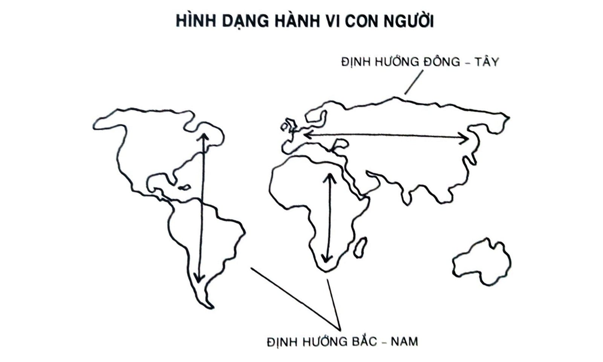

# CHƯƠNG 12: QUY LUẬT NỖ LỰC ÍT NHẤT

Trong quyển sách đoạt giải của mình, Súng, Vi trùng, và Thép, nhà nhân chủng học và sinh vật học Jared Diamond đã chỉ ra một thực tế đơn giản: Các lục địa khác nhau thì có hình dạng khác nhau. Lúc mới đọc qua, tuyên bố này trông có vẻ rất rõ ràng và không có gì quan trọng, nhưng thật ra nó có tác động không hề nhỏ đến hành vi con người.

Trục chính của châu Mỹ chạy từ Bắc xuống Nam. Tức là, lãnh thổ Bắc Mỹ và Nam Mỹ có khuynh hướng cao hẹp hơn là phình rộng. Điều đó cũng đúng với châu Phi. Trong khi đó, lãnh thổ khu vực châu Âu, châu Á và vùng Trung Đông thì ngược lại. Sự trải rộng về hình dạng lãnh thổ này có khuynh hướng chạy theo chiều Đông - Tây. Theo Diamond, sự khác biệt về hình dạng này có một vai trò đáng chú ý trong việc lan tỏa nông nghiệp qua các thế kỷ.

Khi nông nghiệp bắt đầu lan rộng khắp thế giới, nông dân không gặp trở ngại nhiều khi phát triển theo tuyến Đông - Tây thay vì tuyến Bắc - Nam. Đó là bởi vì những khu vực trải dài trong cùng vĩ tuyến có sự tương đồng về mặt khí hậu, lượng ánh nắng mặt trời, lượng mưa và những thay đổi mùa màng. Những yếu tố này cho phép nông dân ở châu Âu và châu Á thuần dưỡng một vài giống cây và gieo trồng theo sự trải rộng lãnh thổ từ Pháp đến Trung Quốc.

*Hình 13: Trục chính của châu Âu và châu Á là Đông - Tây. Trục chính của châu Mỹ và châu Phi là Bắc - Nam. Điều này dẫn đến khí hậu biến đổi theo chiều lên - xuống ở châu Mỹ nhiều hơn châu Âu và châu Á. Kết quả là, nông nghiệp lan nhanh gần gấp hai lần ở châu Âu và châu Á so với những nơi khác. Hành vi của nông dân - dù đã trải qua hàng trăm ngàn năm - vẫn bị ràng buộc bởi lực cản của môi trường.*

Theo so sánh, khí hậu thay đổi đáng kể khi đi dọc từ Bắc xuống Nam. Hãy tưởng tượng khí hậu ở Florida khác nhiều thế nào so với Canada. Bạn có thể là nông dân tài giỏi nhất trên thế giới, nhưng điều đó không giúp bạn trồng cam Florida vào mùa đông ở Canada được. Tuyết là một sự thay thế tệ hại cho đất. Nếu muốn lan rộng vụ mùa theo trục Bắc - Nam, người nông dân sẽ phải tìm ra giống cây hợp thủy thổ và thuần dưỡng cây trồng mới mỗi khi thời tiết thay đổi.

Kết quả là, nông nghiệp lan nhanh với tốc độ hơn gấp hai đến ba lần ở châu Á và châu Âu so với châu Mỹ. Trải qua nhiều thế kỷ, sự khác biệt nhỏ này tạo ra một tác động rất lớn. Gia tăng sản xuất thực phẩm cho phép gia tăng dân số nhanh chóng. Khi có nhiều nhân lực, các nền văn hóa này có thể tạo lập được quân đội hùng mạnh và được trang bị tốt hơn để phát triển công nghệ mới. Mới đầu, sự thay đổi diễn ra nhỏ thôi - một vụ mùa lan rộng hơn một chút, dân số tăng nhanh hơn một chút - nhưng khi hợp lại thì thành sự thay đổi lớn lao theo thời gian.

Sự lan nhanh của nông nghiệp là một ví dụ minh họa cho Nguyên tắc số 3 trong Thay đổi Hành vi trên cấp độ toàn cầu. Tri thức truyền thống cho rằng động cơ là chìa khóa dẫn đến thay đổi thói quen. Đúng là khi bạn thực sự muốn, thì bạn cũng sẽ làm thôi. Thế nhưng thực tế là, động cơ thực sự đằng sau ta là cơn lười và ta sẽ làm cái gì mình thấy tiện. Mặc kệ các sách bán chạy nhất về năng suất nói gì với bạn, đây là một chiến lược khôn ngoan chứ không hề ngớ ngẩn.

Năng lượng rất quý giá, và não bộ được lập trình để bảo toàn năng lượng bất cứ khi nào có thể. Tuân theo Quy luật Nỗ lực Ít nhất là lẽ tự nhiên của con người, trong tình thế mà khi phải đưa ra quyết định giữa hai lựa chọn từa tựa nhau, người ta tự nhiên sẽ hướng về lựa chọn đòi hỏi ít lao động nhất.[^56] Ví dụ như mở rộng trang trại của bạn theo hướng Đông, nơi bạn có thể trồng cùng loại cây thay vì theo hướng Bắc với khí hậu khác hẳn. Trong tất cả những hành động khả dĩ, cái được công nhận sẽ là cái đưa đến kết quả giá trị nhất với ít công sức nhất. Chúng ta có động cơ để làm những việc dễ dàng.

Mỗi một hành động đều cần một lượng năng lượng nhất định. Càng đòi hỏi nhiều năng lượng, càng ít khả năng hành động đó sẽ xảy ra. Nếu mục tiêu của bạn là thực hiện một trăm cái hít đất mỗi ngày, như vậy thì tốn nhiều năng lượng lắm! Mới đầu, khi bạn cảm thấy hào hứng và có động lực, bạn có thể gom đủ sức mạnh để thực hiện. Nhưng sau vài ngày, nỗ lực lớn như thế có thể làm bạn kiệt sức. Trong khi đó, duy trì thói quen hít đất mỗi ngày một cái thì lại hầu như chẳng tốn tí năng lượng nào từ lúc bắt đầu. Và thói quen nào càng đòi hỏi ít năng lượng, thói quen đó càng dễ thành lập.

Hãy thử nhìn lại các hành vi đang lấp đầy cuộc sống của bạn, bạn sẽ thấy rằng những hành vi này đều được thực hiện với mức độ động lực rất thấp. Các thói quen như lướt màn hình điện thoại, kiểm tra thư điện tử, xem truyền hình ngốn rất nhiều thời gian của bạn bởi vì những việc làm này hầu như không tốn công để thực hiện. Tất cả đều rất tiện lợi.

Theo một nghĩa nào đấy, mỗi một thói quen đều chỉ là một chướng ngại vật trên con đường dẫn đến điều bạn mong muốn. Giảm cân là trở ngại trên con đường dẫn đến dáng chuẩn. Thiền là trở ngại trên con đường dẫn đến tịnh tâm. Viết nhật ký là trở ngại trên con đường dẫn đến suy nghĩ thông suốt. Thật sự thì bạn không phải muốn có thói quen đó. Cái bạn muốn chính là kết quả mà thói quen đó mang lại. Chướng ngại vật càng lớn - tức là, thói quen càng khó - thì lực cản giữa bạn và trạng thái mong đợi cuối cùng của bạn càng lớn. Đó là lý do chủ yếu vì sao bạn cần phải làm cho thói quen thật dễ dàng để có thể thực hiện ngay cả khi bạn không thích. Nếu bạn có thể khiến thói quen tốt của mình tiện lợi hơn nữa, bạn sẽ dễ dàng duy trì được các thói quen ấy về sau.

Thế còn những lúc chúng ta có vẻ như đang làm ngược lại thì sao? Nếu chúng ta lười chết đi được, thì làm sao giải thích được chuyện người ta đạt được những mục tiêu rất khó như nuôi dạy một đứa trẻ, bắt đầu khởi nghiệp hay trèo lên đỉnh Everest?

Hiển nhiên là bạn có khả năng làm được những thứ cực kỳ khó. Vấn đề ở chỗ, có một số ngày bạn cảm thấy muốn làm chuyện khó và những ngày khác thì chỉ muốn bỏ cuộc. Vào những ngày khó khăn ấy, điều cần thiết là bạn phải khiến càng nhiều việc có lợi cho mình càng tốt để có thể vượt qua các thử thách mà cuộc sống ném vào lộ trình của mình. Gặp phải càng ít lực cản, bạn càng dễ dàng vươn lên mạnh mẽ. Ý tưởng đằng sau chuyện khiến mọi chuyện dễ dàng không phải là chỉ làm việc dễ. Ý tưởng ở đây là khiến cho mọi thứ càng dễ càng tốt tại thời điểm bạn thực hiện những việc có thể bù đắp cho nỗ lực bỏ ra về lâu về dài.

## ĐẠT ĐƯỢC NHIỀU HƠN VỚI NỖ LỰC ÍT HƠN

Thử tưởng tượng bạn đang cầm một vòi nước tưới cây với một chỗ gấp khúc ở giữa ống. Một ít nước có thể chảy qua, nhưng không nhiều. Nếu bạn muốn lượng nước chảy qua vòi xịt tăng lên thì bạn có hai lựa chọn. Lựa chọn thứ nhất là mở van nước để tạo áp lực lớn hơn cho nước chảy ra. Lựa chọn thứ nhì là chỉ cần nắn lại ống cho hết gập để nước chảy qua tự nhiên.

Cố gắng bơm động lực của mình lên để duy trì các thói quen khó giống như ép nước chảy mạnh qua đường ống bị gấp khúc vậy. Bạn cũng làm được thôi, nhưng cần rất nhiều công sức và còn gia tăng áp lực lên cuộc sống của mình. Trong khi đó, khiến cho thói quen của bạn đơn giản và dễ dàng hơn giống như nắn lại ống nước. Thay vì cố vượt qua lực cản trong cuộc sống thì ta giảm nó xuống.

Một trong những cách hiệu quả nhất để giảm lực cản gắn với thói quen là thiết kế môi trường sống. Trong Chương 6, chúng ta đã bàn về thiết kế môi trường sống, một phương pháp làm cho các tín hiệu trở nên rõ ràng hơn, ngoài ra bạn còn có thể tối ưu hóa môi trường sống của mình để giúp cho các hành vi được thực hiện dễ dàng hơn. Giả sử, khi bạn đang tìm nơi nào đó để thực thi một thói quen mới, thì tốt nhất là bạn nên chọn nơi có sẵn ngay trên lộ trình của thói quen thường nhật. Thói quen sẽ dễ hình thành hơn nếu nó có thể nhét vừa vặn vào trong dòng chảy cuộc sống của bạn. Bạn có nhiều khả năng đến phòng gym hơn nếu nó ở ngay trên đường mình đi làm, bởi vì dừng lại đi vào sẽ không tạo ra quá nhiều lực cản trong đời sống của bạn. Thử so sánh, nếu phòng tập ở ngoài con đường bạn đi về đều đặn - ngay cả khi chỉ cách đó vài khu nhà thôi - thì bạn phải “ra khỏi lộ trình thông thường” để đến đó.

Hay có thể sẽ hiệu quả hơn nếu bạn giảm lực cản ngay trong nhà hay ở nơi làm việc. Rất thường xuyên, ta hay bắt đầu thói quen ở những môi trường nhiều lực cản. Chúng ta cố gắng theo sát một liệu trình ăn kiêng khi ra ngoài ăn tối với bạn bè. Chúng ta cố gắng viết một quyển sách trong một ngôi nhà hỗn loạn. Chúng ta cố gắng tập trung khi đang dùng một chiếc điện thoại thông minh toàn những sao nhãng. Đâu nhất thiết phải như vậy. Ta có thể loại bỏ những lực cản gây trở ngại cho mình mà. Đây chính xác là điều mà các nhà máy sản xuất điện tử ở Nhật Bản đã bắt tay vào làm những năm 1970.

Trong một bài báo đăng trên tờ New Yorker nhan đề “Tốt hơn mọi lúc mọi nơi”, James Surowiecki viết:

“Các hãng Nhật nhấn mạnh một khái niệm gọi là “sản xuất tinh gọn”, liên tục hướng đến loại bỏ mọi hình thức lãng phí từ quy trình sản xuất cho tới tái thiết kế nơi làm việc, để công nhân không phải tốn thời gian xoay người lấy dụng cụ. Kết quả là các công ty Nhật có năng suất cao hơn và sản phẩm Nhật thì đáng tin cậy hơn của Mỹ. Năm 1974, đơn đặt hàng tivi màu của Mỹ nhiều hơn gấp năm lần so với tivi Nhật. Nhưng đến 1979, công nhân Mỹ tốn gấp ba lần thời gian để lắp ráp xong một máy.”

Tôi thích gọi chiến lược này là thêm vào bằng cách bớt ra[^57]. Công ty Nhật tìm kiếm và loại bỏ mọi lực cản trong tất cả các công đoạn của quá trình sản xuất. Khi bớt đi những nỗ lực thừa thãi, họ được tăng thêm khách hàng và doanh thu. Tương tự, khi chúng ta loại bỏ những lực cản khiến ta mất thời gian và năng lượng, ta sẽ đạt được nhiều hơn với nỗ lực ít hơn. (Đây là lý do vì sao dọn dẹp khiến chúng ta sung sướng: Ta đồng thời vừa cải thiện bản thân và vừa giảm bớt đi gánh nặng tâm trí[^58] mà môi trường sống gây ra cho mình.)

Nếu quan sát các sản phẩm dễ gây ra thói quen, bạn sẽ thấy các sản phẩm hay dịch vụ này thạo nhất là loại bỏ từng mẩu lực cản ra khỏi cuộc sống của bạn. Dịch vụ giao thức ăn giảm lực cản của việc đi chợ. Ứng dụng hẹn hò giảm lực cản của việc giới thiệu và kết giao xã hội ban đầu. Dịch vụ đi chung xe giảm lực cản của việc băng qua thành phố. Tin nhắn điện thoại giảm lực cản của việc viết thư tay.

Tựa như những nhà máy sản xuất tivi Nhật Bản tái thiết kế lại nơi làm việc để giảm chuyển động thừa, các công ty thành công sẽ thiết kế những sản phẩm tự động hóa, loại bỏ hoặc đơn giản hóa sao cho càng ít bước thực hiện càng tốt. Họ giảm bớt số lượng nội dung cần điền trong mỗi biểu mẫu. Họ cắt bớt số lần cần click chuột để tạo một tài khoản. Họ giao hàng với các chỉ dẫn dễ hiểu hơn hoặc ít bắt khách phải lựa chọn hơn.

Khi những chiếc loa điều khiển bằng giọng nói đầu tiên được ra mắt - các sản phẩm như là Google Home, Amazon Echo, và Apple HomePod - tôi thử hỏi một người bạn rằng anh thích điều gì từ các sản phẩm đã mua. Anh bảo chỉ cần nói “Chơi nhạc đồng quê” và không cần phải rút điện thoại ra, mở ứng dụng, rồi chọn một danh sách nhạc. Dĩ nhiên, chỉ vài năm trước thôi, có được nhạc không giới hạn trong túi là một kỳ tích lớn lao nếu so với việc phải chạy ra cửa hàng mua đĩa CD. Kinh doanh là một hành trình bất tận hướng đến việc mang lại cùng một kết quả giống nhau theo một kiểu cách đơn giản hơn.

Các chính phủ cũng sử dụng hiệu quả các chiến lược tương tự. Khi chính phủ Anh muốn gia tăng thuế thu vào, họ đã chuyển đổi từ việc bắt công dân truy cập một trang web để có thể tải đơn thuế, đến việc đưa họ đường dẫn trực tiếp đến đơn thuế. Chỉ giảm một bước đó thôi cũng khiến tỷ lệ phản hồi từ 19,2% nâng lên 23,4%. Ở một đất nước như Vương quốc Anh, lượng phần trăm đó tương đương với hàng triệu bảng tiền thuế.

Ý tưởng chủ đạo ở đây là tạo ra một môi trường dễ thực thi nhất có thể cho hành vi đúng. Cuộc chiến kiến tạo các thói quen tốt hơn phần nhiều là nằm ở việc tìm ra cách giảm bớt lực cản liên quan đến thói quen tốt và gia tăng lực cản liên quan đến thói quen xấu.

## SẮP SẴN MÔI TRƯỜNG SỐNG CHO TƯƠNG LAI

Oswald Nuckols là một nhà phát triển công nghệ thông tin đến từ Natchez, Mississippi. Anh cũng là người hiểu rõ sức mạnh của việc sắp sẵn môi trường sống của mình.

Nuckols tập trung vào thói quen dọn dẹp bằng cách tuân theo một chiến lược mà anh gọi là “sắp xếp lại phòng ốc”. Ví dụ như, khi xem tivi xong, anh sẽ đặt điều khiển trở lại giá, sắp xếp lại gối trên trường kỷ, và gấp gọn chăn. Khi rời khỏi ôtô, anh dọn hết rác. Mỗi khi tắm, anh vệ sinh bồn cầu khi đang chờ nước nóng. (Như anh viết, “dù sao thì thời điểm hoàn hảo nhất để cọ bồn chính là ngay trước khi bạn tắm.”) Mục đích của việc sắp xếp lại phòng ốc cho giống ban đầu không phải đơn giản chỉ là dọn dẹp sau mỗi hành động, mà là sắp sẵn cho hành động tiếp theo.

“Khi tôi bước vào một căn phòng thì mọi thứ đều được đặt đúng vị trí của chúng”, Nuckols viết. “Bởi vì tôi làm thế mỗi ngày ở mỗi phòng, nên đồ đạc luôn trong tình trạng tốt... Người ta nghĩ chắc tôi siêng lắm nhưng thật ra tôi lười vô cùng. Chỉ là tôi lười một cách chủ động. Nó trả lại cho bạn nhiều thời gian lắm đấy.”

Mỗi khi bạn bố trí một không gian cho một mục đích nào đó, bạn đang sắp xếp nó cho hành động tiếp theo được dễ dàng hơn. Ví dụ, vợ tôi có một chiếc hộp đựng thiệp được xếp sẵn theo chủ đề - sinh nhật, cảm thông, đám cưới, tốt nghiệp, và các loại khác. Mỗi khi cần, cô ấy rút một tấm phù hợp rồi gửi đi. Vợ tôi rất giỏi trong việc nhớ gửi thiệp cho ai đó bởi vì cô ấy đã giảm lực cản của công việc đó. Trong nhiều năm, tôi luôn ngược lại. Khi ai đó mới có em bé thì tôi sẽ nghĩ, “Mình nên gửi thiệp.” Nhưng rồi nhiều tuần trôi qua và khi tôi sực nhớ và đi mua thiệp thì đã muộn rồi. Thói quen đó không dễ có.

Có rất nhiều cách sắp xếp môi trường sống của bạn để sẵn sàng sử dụng ngay. Nếu bạn muốn nấu một bữa sáng đầy đủ dinh dưỡng, hãy đặt chảo lên bếp, để bình xịt bếp trên kệ, bày sẵn đĩa và các dụng cụ nào cần thiết ngay đêm trước đó. Khi bạn thức dậy, làm bữa sáng sẽ dễ dàng hơn. Muốn vẽ nhiều hơn? Bày bút chì, bút nét, sổ và họa cụ trên mặt bàn, nơi nào dễ lấy. Muốn tập thể dục? Để sẵn đồ vận động, giày, giỏ thể thao, bình nước trước mắt. Muốn giảm cân? Cắt nhỏ thật nhiều trái cây và rau củ vào cuối tuần và đóng hộp, để bạn dễ dàng tiếp cận thực phẩm bổ dưỡng, có-thể-ăn-liền trong tuần.

Đó là những cách đơn giản để tạo ra các thói quen tốt trên con đường ít trở lực nhất.

Bạn cũng có thể đảo ngược nguyên tắc này để sắp sẵn môi trường khiến những thói quen xấu khó khăn hơn. Giả sử như bạn thấy mình xem tivi nhiều quá, vậy thì mỗi lần xem xong hãy rút dây điện ra. Chỉ cắm điện lại khi bạn có thể hô lớn tên chương trình mình muốn xem. Kiểu sắp sẵn này tạo ra vừa đủ lực cản để ngăn chuyện xem tivi một cách vô thức lại.

Nếu cũng không hiệu quả, bạn có thể tiến thêm một bước nữa. Rút dây điện tivi và tháo pin đồ điều khiển mỗi khi xem xong, vậy thì lần sau sẽ cần thêm mười giây nữa để mở lại. Và nếu bạn thật sự là thanh niên nghiêm túc, thì hãy khuân tivi ra khỏi phòng khách, cất vào trong tủ mỗi khi xem xong. Có thể đảm bảo rằng chỉ khi nào muốn xem lắm bạn mới đem ra. Lực cản càng lớn, thói quen càng khó xảy ra.

Mỗi khi có thể, tôi sẽ để điện thoại ở một phòng khác cho tới bữa trưa. Khi điện thoại ở ngay bên cạnh, tôi sẽ ngồi cầm nó cả buổi sáng không vì lý do gì cả. Nhưng khi điện thoại ở một phòng khác, tôi ít khi nghĩ đến nó. Và lực cản đủ lớn để tôi không đi lấy nó mà không có lý do. Kết quả là, tôi có ba đến bốn tiếng mỗi buổi sáng để làm việc mà không bị gián đoạn.

Nếu để điện thoại ở phòng khác chưa đủ với bạn, hãy nhờ bạn bè hoặc gia đình giấu nó đi trong vài giờ. Hoặc là nhờ đồng nghiệp giữ giúp vào buổi sáng và trả lại cho bạn vào bữa trưa.

Đặc biệt có nhiều khi chỉ cần rất ít lực cản là đủ để ngăn chặn một hành vi không mong muốn. Khi tôi giấu bia vào sâu trong tủ lạnh, tôi không thấy bia và sẽ uống ít hơn. Khi tôi xóa ứng dụng mạng xã hội khỏi điện thoại, có thể cả mấy tuần sau tôi mới tải và đăng nhập lại. Tuy rằng các chiêu này không thể khắc chế được cơn nghiện thật sự, nhưng đối với đa số chúng ta, một ít lực cản thôi cũng tạo ra khác biệt lớn giữa duy trì một thói quen tốt và sa đà vào một thói quen xấu. Hãy tưởng tượng tác động cộng gộp của hàng tá thay đổi như vậy và của việc sống trong một môi trường được thiết kế tạo điều kiện dễ dàng cho thói quen tốt, cũng như cản trở thói quen xấu.

Dù cho ta đang tiếp cận thay đổi hành vi trong vai trò một cá nhân, một ông bố bà mẹ, một huấn luyện viên, hay một nhà lãnh đạo, ta cũng đều nên tự đặt cho bản thân một câu hỏi: “Làm thế nào để thiết kế một thế giới mà ở đó, làm việc đúng thật là dễ?” Tái thiết kế cuộc đời bạn để các hành động trọng yếu nhất chính là các hành động dễ thực hiện nhất.

## Tóm tắt chương

- Hành vi con người tuân theo Quy luật Nỗ lực Ít nhất. Một cách tự nhiên, ta sẽ hướng về lựa chọn cần lao động ít nhất.

- Tạo ra một môi trường sống để làm việc đúng đắn dễ dàng nhất có thể.

- Giảm lực cản liên quan đến hành vi tốt. Khi lực cản thấp, thói quen thành lập dễ dàng hơn.

- Tăng lực cản liên quan đến hành vi xấu. Khi lực cản cao, thói quen thành lập khó khăn hơn.

- Sắp sẵn môi trường sống của bạn để chuẩn bị điều kiện thuận lợi cho hành động tương lai.

---

## Chú thích

[^56]: Đây là nguyên tắc nền móng của vật lý, được biết đến với tên gọi Nguyên lý Tác động Tối thiểu. Nó phát biểu rằng đường thẳng nối hai điểm bất kỳ luôn là con đường ít tốn năng lượng nhất. Nguyên tắc đơn giản này làm nền tảng cho các quy luật của vũ trụ. Từ một ý tưởng này, bạn có thể mô tả các quy luật vận động và tính tương đối. (TG)

[^57]: Cụm thêm vào bằng cách bớt ra cũng được các đội nhóm và doanh nghiệp sử dụng để mô tả việc loại bớt người ra khỏi đội nhằm làm toàn đội mạnh hơn. (TG)

[^58]: Cognitive load: trong tâm lý học nhận thức, đây là từ chỉ sức lực tiêu hao cho trí nhớ ngắn hạn khi con người tiếp nhận và xử lý thông tin. (ND)
