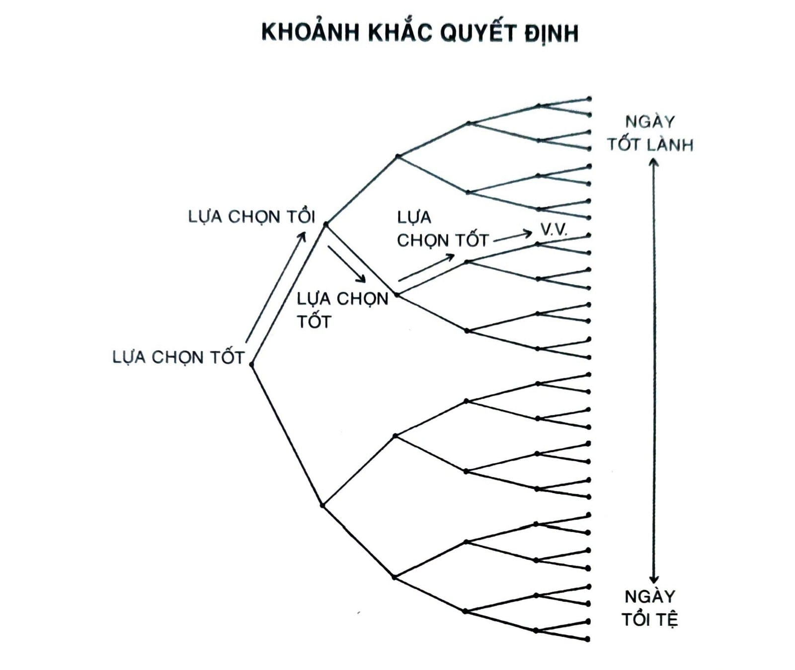
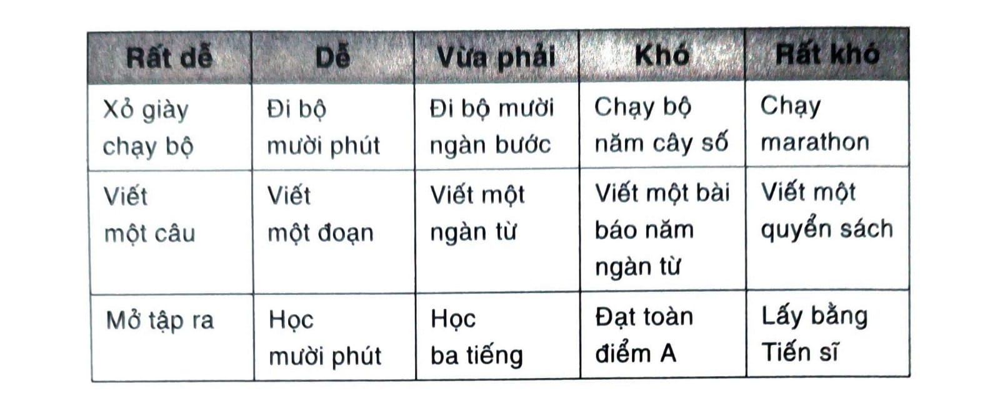
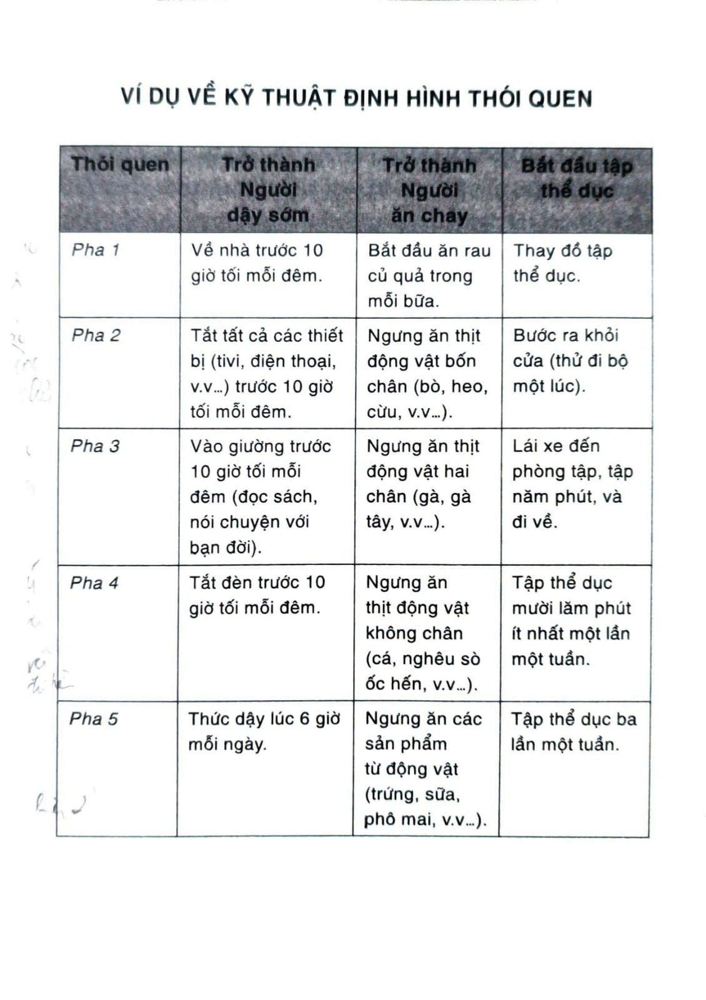

# CHƯƠNG 13: PHÁ BỎ TRÌ HOÃN DÙNG NGAY QUY TẮC HAI PHÚT

Twyla Tharp được xem là một trong những vũ công và nhà biên đạo múa vĩ đại nhất trong thời kỳ hiện đại. Năm 1992, cô được trao giải thưởng MacArthur Fellowship, thường được gọi là Giải Thiên Tài[^59], và trong phần lớn sự nghiệp cô lưu diễn vòng quanh thế giới trình diễn các tác phẩm nguyên bản của mình. Cô cũng ghi nhận thành công của mình là nhờ các thói quen đơn giản hằng ngày.

“Tôi bắt đầu ngày mới bằng một nghi thức”, cô kể. “Tôi thức dậy vào lúc 5:30 sáng, thay đồ tập thể dục, mặc quần giữ ấm, áo khoác và mũ. Tôi bước ra ngoài căn hộ ở Manhattan, vẫy một chiếc taxi, báo tài xế đưa đến phòng gym Pumping Iron ở Đường số 91 và Đại lộ số 1, ở đó tôi tập luyện hai giờ.

“Nghi thức của tôi không phải bài tập giãn cơ hay nâng tạ mà mỗi sáng tôi rèn luyện cơ thể mình ở phòng gym; nghi thức là chiếc taxi. Khoảnh khắc tôi báo với tài xế nơi muốn đến là điểm hoàn tất nghi thức.

“Đó là động tác đơn giản, nhưng làm thế mỗi buổi sáng đã biến nó thành thói quen - làm cho nó dễ dàng lặp đi lặp lại. Việc đó giảm thiểu nguy cơ tôi bỏ qua hoặc là làm khác đi. Nó trở thành một món trong danh sách nếp sinh hoạt thường lệ của tôi, và là một thứ bớt phải nghĩ tới.”

Vẫy một chiếc xe mỗi sáng có thể là một động tác nhỏ, nhưng nó là ví dụ xuất sắc cho Nguyên tắc số 3 trong Thay đổi Hành vi.

Các nhà nghiên cứu ước tính, có 40 đến 50% số hành động của ta trong một ngày bất kỳ là được hoàn thành bằng thói quen. Đây quả là một con số đáng kể, nhưng tác động thực sự của thói quen còn lớn hơn cả ấn tượng mà con số này mang lại. Thói quen là lựa chọn tự động ảnh hưởng đến quyết định có ý thức theo sau nó. Đúng vậy, một thói quen có thể hoàn thành chỉ trong vài giây, nhưng nó có thể định hình các hành động bạn sẽ thực hiện trong vài phút hay vài giờ tới.

Thói quen như lối đi đường cao tốc. Chúng dẫn bạn vào một con đường, trước khi bạn kịp nhận ra, bạn đã tăng tốc hướng về hành vi tiếp theo. Tiếp tục cái đang làm dường như dễ hơn là bắt đầu một cái mới hoàn toàn khác. Bạn ngồi xem một bộ phim dở hai tiếng. Bạn tiếp tục ăn vặt dù đã đầy bụng. Bạn chỉ xem điện thoại “một tí thôi” và chẳng mấy chốc bạn đã nhìn chằm chằm màn hình hai mươi phút. Theo cách này, các thói quen bạn đi theo mà không suy nghĩ, thường sẽ quyết định các lựa chọn tiếp theo khi bạn bắt đầu suy nghĩ.

Mỗi chiều tối, có một tích tắc - thường đâu đó tầm 5:15 chiều - định hướng toàn bộ buổi tối hôm đó của tôi. Vợ tôi bước vào cửa sau ngày làm việc, và hoặc là hai chúng tôi thay đồ tập thể dục và đi tới phòng gym, hoặc là sẽ nhào vào sofa, gọi đồ ăn Ấn và xem The Office.[^60] Tương tự như Twyla Tharp vẫy taxi, nghi thức của tôi là thay đồ tập thể dục. Nếu tôi thay đồ, tôi biết việc đi tập sẽ diễn ra. Những thứ theo sau - lái xe đến phòng tập, quyết định xem tập bài nào, bước đến thanh xà - đều dễ dàng khi tôi thực hiện bước đầu tiên.

Mỗi ngày đều có hàng tá khoảnh khắc đưa đến tác động ngoại cỡ. Tôi gọi các lựa chọn tí hon này là khoảnh khắc quyết định. Là lúc bạn quyết định xem nên gọi thức ăn bên ngoài hay nấu bữa tối ở nhà. Là lúc bạn chọn lái xe hay đạp xe đạp. Là lúc bạn quyết định giữa bắt đầu làm bài tập hay chụp lấy tay cầm điều khiển game. Các lựa chọn này chính là ngã ba trên con đường phía trước.

Khoảnh khắc quyết định đưa ra các lựa chọn cho cái tôi tương lai của bạn.

*Hình 14: Sự khác nhau giữa ngày tốt lành và ngày tồi tệ thường nằm ở một vài lựa chọn năng suất và lành mạnh tại những thời khắc quyết định. Mỗi một điểm này giống như ngã ba trên con đường, các lựa chọn này dồn lại trong suốt một ngày và sau cùng có thể dẫn đến các kết quả đầu ra rất khác.*

Ví dụ, bước vào một nhà hàng là khoảnh khắc có tính quyết định bởi vì nó sẽ chi phối món mà bạn sẽ ăn trưa. Trên lý thuyết, bạn kiểm soát những gì bạn gọi, nhưng ở một nghĩa rộng hơn, bạn chỉ có thể gọi những món có trong thực đơn. Nếu bạn bước vào một nhà hàng bít-tết, bạn có thể gọi một phần thăn chuột hoặc nạc lưng, nhưng sushi thì không. Lựa chọn của bạn bị giới hạn bởi những thứ có sẵn. Chúng được đóng khuôn bởi lựa chọn đầu tiên.

Chúng ta luôn bị giới hạn bởi nơi mà thói quen của ta dẫn đến. Đây là lý do vì sao kiểm soát tốt các thời khắc quyết định trong suốt một ngày của bạn là điều quan trọng. Mỗi một ngày đều do sự hình thành của nhiều khoảnh khắc, nhưng chỉ có một số lựa chọn thuộc về thói quen thực sự có tính quyết định với con đường bạn đi. Các lựa chọn nhỏ này dồn lại, mỗi một cái thiết lập quỹ đạo cho cách bạn sẽ trải qua trong khối thời gian tiếp theo.

Thói quen là điểm khởi đầu, không phải kết thúc. Chúng là chiếc taxi, không phải phòng tập gym.

## QUY TẮC HAI PHÚT

Ngay cả khi bạn biết mình cần phải bắt đầu từ cái nhỏ, thì bắt đầu quá to vẫn dễ dàng. Khi bạn mơ đến thay đổi, cơn hào hứng không tránh khỏi lấn át tâm trí, và rồi bạn thấy bản thân mình đang cố gắng làm gì đó quá nhiều và quá sớm. Cách hữu hiệu nhất mà tôi biết để chống lại khuynh hướng này là sử dụng Quy tắc Hai phút, phát biểu như sau, “Khi bạn bắt đầu một thói quen mới, nó chỉ nên kéo dài không quá hai phút.”

Bạn sẽ thấy gần như bất kỳ thói quen nào cũng có thể giảm mức độ xuống thành một phiên bản hai phút: “Đọc sách mỗi đêm trước khi ngủ” trở thành “Đọc một trang.” “Tập ba mươi phút yoga” trở thành “Chuẩn bị sẵn thảm tập yoga.” “Học bài trên lớp” trở thành “Mở tập ra.” “Gấp đồ đã giặt” trở thành “Gấp một đôi vớ.” “Chạy bộ năm cây số” trở thành “Thắt dây giày chạy bộ.”

Mấu chốt nằm ở việc làm cho thói quen của bạn trở nên dễ dàng hết mức có thể khi bắt đầu. Ai cũng có thể thiền một phút, đọc một trang sách, hoặc dọn dẹp một cái quần hay cái áo. Và như ta vừa thảo luận, đây là chiến lược hữu hiệu bởi vì một khi bạn bắt đầu làm điều đúng đắn, tiếp tục nó sẽ dễ dàng hơn nhiều. Thói quen tốt không nên là một thứ khó nhọc. Các hành động theo sau có thể khó khăn, nhưng hai phút đầu tiên nên là chuyện dễ làm. Cái bạn cần là một “thói quen cửa ngõ” dẫn bạn vào con đường hiệu suất hơn một cách tự nhiên.

Bạn thường có thể tìm ra các thói quen cửa ngõ dẫn đến kết quả mong muốn này bằng cách phân loại các mục tiêu của mình theo thang đo từ “rất dễ” đến “rất khó”. Ví dụ, chạy trọn vẹn một cuộc marathon sẽ rất khó. Chạy năm cây số sẽ khó. Đi bộ mười ngàn bước chân tương đối khó. Đi bộ mười phút thì dễ. Và xỏ giày chạy bộ thì rất dễ. Mục tiêu của bạn có thể là chạy marathon, còn thói quen cửa ngõ của bạn sẽ là xỏ giày chạy bộ. Đó là cách bạn làm theo Quy tắc Hai phút.

Người ta thường nghĩ đọc một trang sách, thiền một phút hay gọi một cuộc bán hàng thì có gì mà kích thích được nhỉ. Nhưng ý tưởng ở đây không phải là chỉ làm một thứ. Mấu chốt là thành thục thói quen có mặt sẵn sàng. Sự thực là, một thói quen phải được hình thành rồi sau đó mới có thể cải thiện. Nếu kỹ năng có mặt sẵn sàng để thực hiện một điều gì đó còn chưa học xong, thì chẳng có cơ may nào bạn sẽ nhuần nhuyễn được các chi tiết tinh vi hơn. Thay vì cố gắng sắp đặt một thói quen hoàn hảo ngay từ đầu, hãy làm điều dễ dàng mà bền bỉ. Bạn phải chuẩn hóa trước khi tối ưu hóa.

Khi bạn đã thành thạo nghệ thuật có mặt sẵn sàng, hai phút đầu tiên đơn giản chỉ là một nghi thức khởi đầu một nếp sinh hoạt lớn hơn. Đây không chỉ là một mẹo giúp cho thói quen trở nên dễ dàng mà còn là phương thức lý tưởng giúp ta nhuần nhuyễn một kỹ năng khó. Bạn càng nghi thức hóa bước đầu tiên của một quá trình bao nhiêu thì khả năng nó trở thành một trạng thái tập trung cao độ cần thiết cho bạn làm những việc to tát cao bấy nhiêu. Bằng cách thực hiện nghi thức khởi động giống nhau trước mỗi lần tập thể dục, bạn đã khiến cho việc đạt tới trạng thái thể hiện đỉnh cao trở nên dễ dàng. Bằng cách tuân theo cùng một nghi thức sáng tạo, bạn đã khiến cho việc đạt tới trạng thái tạo tác nhọc nhằn trở nên dễ dàng. Bằng cách tập thói quen tắt điện đều đặn không đổi, bạn đã khiến cho việc đi ngủ đúng giờ mỗi đêm trở nên dễ dàng. Có thể bạn không tự động hóa được toàn bộ quá trình, nhưng bạn có thể làm cho động tác đầu tiên trở nên tự giác. Cứ khởi động thật trơn tru, tự khắc phần còn lại sẽ đi theo.

Có thể đối với một số người, Quy tắc Hai phút nghe cứ như một trò bịp. Bạn nên biết là mục tiêu thực sự của việc này nằm ở chỗ làm được nhiều hơn hai phút, cho nên bạn hẳn cảm thấy mình đang tự lừa bản thân. Không ai thực lòng cảm thấy hào hứng với chuyện đọc một trang sách, hít đất một cái hay là mở tập ra cả. Và nếu biết rõ đó là một cú lừa tâm trí, thế làm sao ta thích nó được?

Nếu Quy tắc Hai phút nghe khiên cưỡng quá, bạn hãy thử cái này: Làm hai phút rồi ngừng. Bạn chạy bộ, nhưng bắt buộc phải dừng lại sau hai phút. Tập thiền, nhưng phải dừng sau hai phút. Học tiếng Ả Rập, nhưng phải dừng lại sau đúng hai phút. Đây không còn là chiến lược khởi động nữa, nó trở thành toàn bộ quá trình. Thói quen của bạn chỉ được phép tồn tại trong một trăm hai mươi giây.

Một độc giả của tôi đã dùng chiến lược này để giảm hơn bốn mươi lăm kí-lô. Vào lúc ban đầu, anh tới phòng gym mỗi ngày, nhưng anh bảo bản thân mình không được ở lại quá năm phút. Anh sẽ tới phòng tập, tập năm phút, rồi đi về ngay khi hết năm phút của mình. Sau vài tuần, anh nhìn xung quanh và nghĩ, “Ừm, đằng nào cũng đã tới đây, hay là mình ở lại lâu hơn chút.” Chỉ vài năm sau, số cân thừa biến đâu mất.

Công việc viết báo cho bạn một ví dụ khác. Gần như bất kỳ ai cũng có thể hưởng lợi từ việc trút hết suy nghĩ của mình ra khỏi đầu vào trang giấy, nhưng đa phần người ta bỏ cuộc sau vài ngày và tránh nó như tránh tà.[^61] Bí quyết là, luôn luôn ở bên dưới cái ngưỡng tạo cảm giác như đó là việc phải làm. Greg McKeown, chuyên viên tư vấn lãnh đạo ở Vương quốc Anh đã xây dựng một thói quen viết hằng ngày bằng cách đặc biệt chỉ viết ít hơn cảm giác muốn viết. Anh luôn dừng việc viết lách lại trước khi cảm thấy bắt đầu phiền phức. Ernest Hemingway tin rằng lời khuyên tương tự có thể áp dụng cho bất kỳ thể loại viết lách nào. “Cách hay nhất là luôn luôn dừng lại khi bạn còn đang cảm thấy ổn”, ông nói.

Các chiến lược như thế này có hiệu quả còn vì một lý do khác: Chúng củng cố căn tính bạn muốn xây dựng. Nếu bạn có mặt tại phòng gym năm ngày liên tiếp - ngay cả chỉ có hai phút - thì bạn đã bỏ một lá phiếu cho căn tính mới của mình. Bạn không còn lo về chuyện giữ vóc dáng. Bạn tập trung vào việc trở thành kiểu người không bao giờ bỏ lỡ rèn luyện. Bạn đang thực hiện hành động nhỏ nhất xác nhận kiểu người bạn muốn trở thành.

Chúng ta hiếm khi nghĩ về thay đổi theo cách này bởi lẽ mọi người đều đang bị mục tiêu cuối cùng ăn mòn. Thế nhưng một cái hít đất thì vẫn tốt hơn là không tập gì cả. Một phút luyện guitar vẫn hơn không luyện gì cả. Một phút đọc sách vẫn tốt hơn không bao giờ cầm quyển sách lên. Thà làm ít hơn mình mong đợi vẫn còn hơn không làm gì cả.

Tại một thời điểm khi bạn đã hình thành được thói quen hiện diện đều đặn mỗi ngày, bạn có thể kết hợp Quy tắc Hai phút với một kỹ thuật mà tôi gọi là kỹ thuật định hình thói quen để thăng cấp thói quen của mình về phía mục tiêu cuối cùng. Bắt đầu bằng cách nhuần nhuyễn hai phút đầu tiên của phiên bản hành vi nhỏ gọn nhất. Sau đó, hãy tiến đến bước trung gian và lặp lại quá trình - chỉ tập trung vào hai phút đầu tiên và thành thạo giai đoạn ấy trước khi bước qua cấp độ mới. Sau cùng, bạn sẽ chạm tới thói quen bạn đã hy vọng từ đầu trong khi vẫn giữ sức tập trung vào điểm cần thiết: Vào hai phút đầu tiên của hành vi.

Gần như tất cả mục tiêu cuộc đời lớn lao nào cũng có thể được chuyển hóa thành một hành vi hai phút. Tôi muốn sống thọ và mạnh khỏe > Tôi cần giữ vóc dáng khỏe khoắn > Tôi cần tập thể dục > Tôi cần thay đồ tập thể dục. Tôi muốn có một cuộc hôn nhân hạnh phúc > Tôi cần phải là một người bạn đời tốt > Tôi phải thực hiện điều gì đó mỗi ngày để làm cho cuộc sống của vợ/ chồng tôi dễ chịu hơn > Tôi phải lên thực đơn cho tuần tới.

Bất kỳ lúc nào bạn đang phải vật vã duy trì một thói quen, hãy áp dụng Quy tắc Hai phút. Đó là cách đơn giản giúp cho thói quen của bạn trở nên dễ dàng.

## Tóm tắt chương

- Một thói quen có thể hoàn thành chỉ trong vài giây nhưng tiếp tục có tác động đến hành vi của bạn trong nhiều phút nhiều giờ sau đó.

- Nhiều thói quen xảy ra vào các thời khắc quyết định - các lựa chọn giống như ngã ba giữa con đường - và nó đưa bạn tới con đường của một ngày năng suất hoặc là kém hiệu suất.

- Quy tắc Hai phút nói rằng, “Khi bạn bắt đầu một thói quen mới, nó chỉ nên kéo dài không quá hai phút.”

- Bạn càng nghi thức hóa bước đầu tiên của một quá trình bao nhiêu thì khả năng nó trở thành một trạng thái tập trung cao độ cần thiết cho bạn làm những việc to tát cao bấy nhiêu.

- Chuẩn hóa trước khi tối ưu hóa. Bạn không thể cải thiện một thói quen còn chưa tồn tại.

---

## Chú thích

[^59]: Genius Grant.

[^60]: Công bằng mà nói, phiên bản này nghe cũng là một buổi tối tuyệt vời. (TG)

[^61]: Tôi đã thiết kế một quyển nhật ký thói quen đặc biệt dành cho việc viết lách. Nó có phần “Một dòng mỗi ngày” để bạn viết một dòng đơn giản về sự việc trong ngày. Bạn có thể đọc thêm tại atomichabits.com/journal. (TG)
